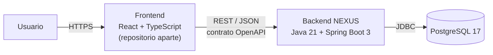
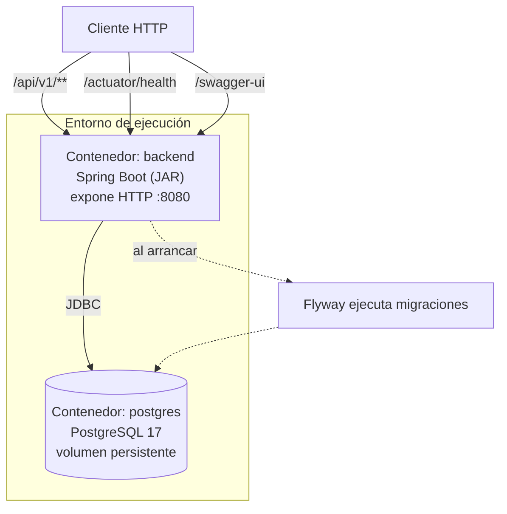
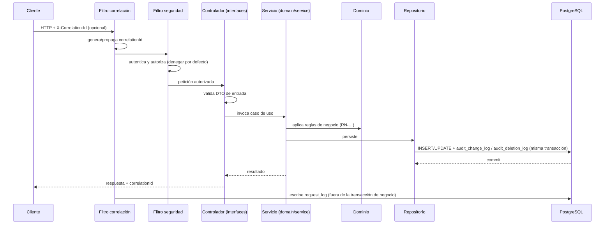

# Arquitectura del Backend — NEXUS

| Campo | Valor |
|---|---|
| Proyecto | NEXUS — Renovación de plataforma |
| Empresa | FACTECH GROUP SAS |
| Documento | `architecture.md` |
| Versión | 0.18.0 |
| Estado | Borrador |
| Responsable técnico | Bonilla Diaz William Steven |
| Fecha de creación | 19-08-2026 |
| Última actualización | 26-08-2026 |
| Documento superior | `constitution.md` v0.5.0 |
| Documento relacionado | `security.md` v0.3.0 |

---

## 1. Propósito y alcance

Este documento describe la arquitectura del backend de NEXUS: sus componentes, sus límites, cómo fluye una petición y qué reglas estructurales deben respetarse al agregar código.

Está subordinado a `constitution.md` (§0.1 de la constitución). Donde este documento detalla una regla constitucional, la cita explícitamente. Donde toma una decisión propia, la registra en §16.

**Fuera de alcance:** el modelo de roles y permisos y el mecanismo de autenticación se especifican en `security.md`; la estrategia de pruebas en `testing-strategy.md`; las convenciones de código en `development-guide.md`.

---

## 2. Contexto del sistema



El backend es el **único** componente con acceso a la base de datos. El frontend no consume PostgreSQL de ninguna forma, ni directa ni a través de herramientas de terceros.

El contrato entre frontend y backend es la especificación OpenAPI publicada, y nada más (Art. VIII.7). Los dos repositorios evolucionan de forma independiente.

---

## 3. Stack tecnológico

Versiones vigentes, en cumplimiento del Art. X.3 y X.5. La **fuente de verdad** de la versión exacta es siempre `pom.xml` y los `Dockerfile`; esta tabla declara la línea soportada.

| Área | Tecnología | Línea | Decisión |
|---|---|---|---|
| Lenguaje | Java (Temurin) | 21 LTS | D-01 |
| Framework | Spring Boot | 3.5.x | D-01 |
| Construcción | Maven | 3.9.x | D-02 |
| Base de datos | PostgreSQL | 17 | Art. V.1 |
| Migraciones | Flyway | 11.x | D-03 |
| Acceso a datos | Spring Data JPA / Hibernate | — | §6 |
| Documentación API | springdoc-openapi (Swagger UI) | 2.x | Art. VIII.2 |
| Pruebas | JUnit 5, Testcontainers, MockMvc | — | Art. VII |
| Contenedores | Docker + Docker Compose | — | Art. X.1, X.2 |
| CI/CD | GitHub Actions | — | Documento Marco §11 |

**Sobre la actualización de versiones:** los cambios de línea (por ejemplo Spring Boot 3.5 → 4.0, o Java 21 → 25) son decisiones de arquitectura y requieren registro en `docs/architecture/` y actualización de este documento. Las actualizaciones de parche son mantenimiento ordinario.

---

## 4. Vista de contenedores



- El backend es **stateless**: no mantiene estado de sesión en memoria. Cualquier estado vive en PostgreSQL. Esto permite escalar horizontalmente sin afinidad de sesión.
- Las migraciones se ejecutan al arrancar la aplicación, de forma automática y verificada (Art. V.4).
- El entorno local completo se levanta con `docker compose up` (Art. X.2).

---

## 5. Estructura del código

### 5.1 Organización

El código se organiza **por módulo de negocio**, no por capa técnica global. Cada módulo es autónomo y contiene sus propias capas (Art. VI.1).

```
src/main/java/com/factech/nexus/
├── NexusApplication.java
│
├── shared/                     Infraestructura transversal, sin lógica de negocio
│   ├── config/                 Configuración de Spring, beans, propiedades
│   ├── error/                  Manejo global de errores y formato de respuesta
│   ├── security/               Filtros de autenticación y autorización
│   ├── observability/          Correlación, request_log, logging estructurado
│   ├── audit/                  Los cuatro registros de auditoría (§6.6)
│   └── persistence/            Tipos base, generación de UUID v7, auditoría de entidades
│
└── modules/
    └── <modulo>/               Un paquete por módulo (COD-MODULO del requerimiento)
        └── <agregado>/         Un paquete por agregado: permissions, roles, users…
            ├── domain/
            │   ├── models/     Entidades JPA, objetos de valor y reglas de negocio (RN-…)
            │   ├── repository/ Puertos de persistencia y sus adaptadores JPA
            │   └── service/    Casos de uso y orquestación transaccional
            ├── application/    Consultas, comandos, modelos de lectura y DTO de la API
            └── interfaces/     Controladores REST

src/main/resources/
├── application.yml             Configuración base (sin valores de entorno)
└── db/migration/               Migraciones Flyway
```

**Un paquete por agregado dentro del módulo.** `SP` reúne cuarenta y dos requerimientos sobre siete agregados distintos —permisos, roles, membresías, países, monedas, auditoría y usuarios—, y un único `domain/` para todos ellos sería un paquete de decenas de clases sin más relación entre sí que pertenecer al mismo módulo. La subdivisión por agregado mantiene junto lo que cambia junto.

### 5.2 Reglas de dependencia entre capas

| Capa | PUEDE depender de | NO DEBE depender de |
|---|---|---|
| `interfaces` | `application`, `domain/service` | `domain/repository`, agregados de otros módulos |
| `domain/service` | `domain/models`, `domain/repository`, `application` | `interfaces` |
| `domain/repository` | `domain/models`, `application` | `interfaces` |
| `domain/models` | JPA, y el JDK | Spring, HTTP, `interfaces` |
| `application` | El JDK | Todo lo demás |

`application` es la capa **sin dependencias**: consultas, comandos, modelos de lectura y DTO de la API. Que no dependa de nada es lo que le permite ser el lenguaje común entre `interfaces` y `domain`.

!!! warning "Divergencia declarada con la arquitectura hexagonal — 22-08-2026"

    Hasta esta fecha, §5.1 prescribía `api` / `application` / `domain` / `infrastructure` y §5.2 exigía que **`domain` no conociera ningún framework**, de modo que toda regla `RN-…` pudiera probarse sin levantar Spring ni base de datos (Art. VI.3).

    La disposición adoptada **renuncia a esa propiedad**: las entidades JPA viven en `domain/models` y los adaptadores de persistencia en `domain/repository`, de modo que `domain` depende de JPA. Conviene que la consecuencia esté escrita y no se descubra al tropezar con ella:

    - Una regla de negocio que viva en una entidad anotada **no se puede probar sin base de datos**. Las pruebas que `Art. VI.3` describe como unitarias puras pasan a ser de integración, más lentas y con más superficie de fallo.
    - **Los planes de `RF-SP-001` a `RF-SP-009` están escritos sobre la disposición anterior.** Varios exigen de forma explícita lo contrario de lo que esta sección ahora admite: `RF-SP-001` `T-11` pide probar el agregado `Role` «sin Spring ni base de datos», `T-12` pide «el agregado sin anotaciones de JPA», y `T-20` es una prueba de ArchUnit que **falla** si `domain` importa JPA. Los cuatro puntos deben resolverse al aprobar sus tareas: o se reescriben esas tareas, o la regla de ArchUnit se acota a lo que esta sección permite.
    - El aislamiento que se pierde es real, pero también lo es el coste que evita: mantener un agregado de dominio y una entidad de persistencia separadas exige un `mapper` por agregado y una prueba de ida y vuelta por cada uno.

    La divergencia se declara aquí para que no quede tácita y para que quien la revise tenga delante lo que se gana y lo que se paga.

### 5.3 Comunicación entre módulos

- Un módulo **NO DEBE** acceder a las tablas ni a los repositorios de otro módulo.
- La comunicación ocurre a través de un servicio del módulo propietario (`domain/service`), mediante una interfaz publicada por él. Los tipos que cruzan la frontera son los de su `application`, nunca sus entidades.
- Las dependencias entre módulos deben ser acíclicas y quedar declaradas en el documento de requerimientos del módulo.

---

## 6. Persistencia

### 6.1 Principios

PostgreSQL es el único motor (Art. V.1). El esquema vive en migraciones Flyway versionadas, que son la fuente de verdad (Art. V.3, V.12). No existe generación automática de esquema: `ddl-auto` se configura en `validate`, nunca en `update` ni `create`.

### 6.2 Convenciones de esquema

| Elemento | Convención | Ejemplo |
|---|---|---|
| Tabla | `snake_case`, plural | `roles`, `role_permissions` |
| Columna | `snake_case` | `created_at` |
| Clave primaria | `id`, tipo `uuid` | `id uuid PRIMARY KEY` |
| Clave foránea | `<entidad_singular>_id` | `role_id` |
| Índice | `ix_<tabla>_<columnas>` | `ix_roles_name` |
| Restricción única | `uq_<tabla>_<columnas>` | `uq_roles_name` |
| Clave foránea (nombre) | `fk_<tabla>_<tabla_referida>` | `fk_role_permissions_roles` |
| Migración | `V<n>__<descripcion>.sql` | `V1__crear_roles.sql` |

### 6.3 Identificadores

Toda clave primaria es `uuid` generado como **UUID v7** (Art. V.11). La generación ocurre **en la capa de aplicación**, no en la base de datos: JPA necesita el identificador antes del `INSERT`, y generarlo en Java mantiene el comportamiento idéntico en pruebas y en producción.

UUID v7 incorpora una marca de tiempo en sus bits altos, por lo que los valores son crecientes y no fragmentan el índice B-tree como lo haría un v4 aleatorio.

### 6.4 Columnas obligatorias

Toda tabla de negocio incluye (Art. V.7):

| Columna | Tipo | Descripción |
|---|---|---|
| `id` | `uuid` | Clave primaria, UUID v7 |
| `created_at` | `timestamptz` | Fecha de creación |
| `updated_at` | `timestamptz` | Fecha de última modificación |
| `deleted_at` | `timestamptz` NULL | Marca de borrado lógico (Art. V.10) |

Las marcas de tiempo se almacenan siempre en `timestamptz` en UTC. La conversión a zona horaria local es responsabilidad del frontend.

**Las tablas no almacenan el actor del cambio** (Art. V.7). Quién creó o modificó un registro se responde consultando `audit_change_log` por entidad e identificador; quién lo eliminó y por qué, `audit_deletion_log` (§6.6). Esos registros son la única fuente de verdad del actor. Replicar el actor en cada tabla duplicaría un dato que ya existe y que puede quedar desincronizado.

Dos consecuencias que deben asumirse de forma consciente:

1. **Toda operación de escritura DEBE emitir su evento de auditoría.** Es lo que sostiene el modelo: si una operación omite el evento, la autoría de ese cambio se pierde y no hay forma de reconstruirla (Art. V.8).
2. **Mostrar "creado por" en una vista exige consultar la auditoría.** Para listados, esa consulta se resuelve con una proyección específica sobre `audit_change_log`, no agregando la columna de vuelta a la tabla de negocio.

### 6.5 Integridad

La integridad se declara en el esquema, no solo en la aplicación (Art. V.6): claves foráneas, `NOT NULL`, restricciones únicas y `CHECK` para dominios cerrados. Una validación en Java **complementa** la restricción de base de datos; no la sustituye.

### 6.6 Registros de auditoría

Implementa el Art. V.8. Son **cuatro tablas, no una**. Cada una responde una pregunta que las demás no pueden responder, y cada una declara `NOT NULL` lo que en su contexto es obligatorio — algo que un registro único no permite, porque lo obligatorio de un caso es inaplicable en otro.

| Tabla | Responde | Se escribe cuando |
|---|---|---|
| `audit_change_log` | Quién creó qué, y quién editó qué | Un alta o una edición se confirma |
| `audit_deletion_log` | Quién eliminó qué, y **por qué** | Una baja lógica o física se confirma |
| `audit_error_log` | A quién le falló qué, sobre qué recurso | Un fallo no controlado o un rechazo por regla de negocio |
| `audit_security_log` | Quién intentó qué contra el control de acceso | Los eventos de `security.md` §8 |

#### 6.6.1 Núcleo común

Las cuatro comparten estas columnas. Es lo que permite consultarlas en conjunto y correlacionarlas con `request_log`:

| Columna | Tipo | Descripción |
|---|---|---|
| `id` | `uuid` | Clave primaria, UUID v7 |
| `occurred_at` | `timestamptz` | Momento del evento, en UTC |
| `actor_id` | `uuid` NULL | Usuario responsable. `NULL` = anónimo o proceso del sistema |
| `correlation_id` | `uuid` NULL | Enlace con `request_log` (Art. XV.1) |
| `ip_address` | `inet` NULL | Dirección de origen (Art. V.15) |
| `user_agent` | `text` NULL | Cliente desde el que se originó la operación |

`inet` es el tipo nativo de PostgreSQL para direcciones: valida el formato, admite IPv4 e IPv6 sin decidir longitudes, y permite consultar por rango de red con el operador de contención de subred — sobre un `varchar` esa misma consulta obliga a recorrer la tabla entera.

Las tres columnas de origen son nulables **a la vez y por la misma razón**: existen operaciones sin petición HTTP detrás (migraciones, tareas programadas, procesos internos). Esa correspondencia la fija el esquema, no la aplicación:

```sql
CONSTRAINT ck_audit_origen CHECK (
    (correlation_id IS NULL     AND ip_address IS NULL)
 OR (correlation_id IS NOT NULL AND ip_address IS NOT NULL)
)
```

Con esa restricción, una fila sin IP significa inequívocamente «no vino de la red», y nunca «se olvidó registrarla» (Art. V.15).

**Obtención de la IP.** Detrás de un proxy inverso, la IP del socket es la del proxy; la real llega en `X-Forwarded-For`, que es una cabecera **provista por el cliente** y por tanto falsificable. Se resuelve declarando en configuración la lista de proxies confiables y descartando todo salto no confiable de la cadena. Sin esa lista, cualquiera puede escribir en su propia auditoría la IP que quiera, y el campo deja de ser evidencia.

**La IP no se enmascara.** El enmascaramiento del Art. XV.5 aplica a cuerpos de petición y respuesta; en la auditoría la IP *es* el dato. Queda sujeta, eso sí, a la política de retención (§9).

#### 6.6.2 `audit_change_log` — creación y edición

| Columna | Tipo | Descripción |
|---|---|---|
| `module` | `varchar` | Código del módulo que originó el evento (`SP`, y los que se incorporen) |
| `entity` | `varchar` | Nombre lógico de la entidad (`roles`, `users`) |
| `entity_id` | `uuid` | Identificador del registro afectado |
| `action` | `varchar` | `CREATE` o `UPDATE`, con `CHECK` sobre el dominio cerrado |
| `changes` | `jsonb` | En `CREATE`, el estado inicial. En `UPDATE`, solo los campos modificados |

En una edición, `changes` registra el antes y el después **únicamente de lo que cambió**:

```json
{
  "name":   { "before": "Supervisor", "after": "Supervisor de zona" },
  "status": { "before": "ACTIVO",     "after": "INACTIVO" }
}
```

Guardar el registro completo en cada edición multiplica el volumen y obliga a diferenciar a mano para responder «qué se editó». El diff responde esa pregunta directamente, y el estado completo se reconstruye aplicando los eventos en orden.

Tres reglas que evitan huecos y ruido:

- **Una edición que no modifica ningún campo no emite evento.** Un `UPDATE` con `changes` vacío es una fila sin información que ensucia la línea de tiempo.
- **Restaurar un registro eliminado lógicamente se audita aquí**, como `UPDATE` sobre `deleted_at`. La fila de `audit_deletion_log` **permanece**: la eliminación ocurrió, y borrarla sería reescribir la historia.
- **Los campos enmascarados nunca entran en `changes`.** Que una contraseña cambió se registra; su valor no, ni antes ni después (Art. IV.8).

#### 6.6.3 `audit_deletion_log` — eliminación

| Columna | Tipo | Descripción |
|---|---|---|
| `module`, `entity`, `entity_id` | | Igual que en `audit_change_log` |
| `deletion_type` | `varchar` | `LOGICAL`, `PHYSICAL` o `ASSOCIATION` |
| `reason` | `text` | Motivo declarado por el actor. Obligatorio salvo en `ASSOCIATION` (Art. V.13) |
| `snapshot` | `jsonb` **NOT NULL** | Estado completo del registro al momento de eliminarse |

El motivo es obligatorio en el esquema para las entidades de negocio, y no basta con enviarlo en blanco:

```sql
CONSTRAINT ck_deletion_reason CHECK (
    deletion_type = 'ASSOCIATION'
 OR (reason IS NOT NULL AND char_length(btrim(reason)) > 0)
)
```

La restricción exige contenido, no longitud. Un motivo de un solo carácter la satisface, de modo que la garantía es formal: obliga a escribir algo, no a que ese algo informe. Se decidió no elevar el mínimo para no imponer fricción a quien sí redacta un motivo útil.

**El `reason IS NOT NULL` no es redundante, y su ausencia era un defecto.** Hasta el 22-08-2026 esta restricción se escribía solo con la comparación de longitud, y con el motivo en nulo esa comparación da `NULL`: `FALSE OR NULL` es `NULL`, y un `CHECK` que evalúa a `NULL` **acepta la fila**. Es decir, la obligación del Art. V.13 podía saltarse sin más que omitir el campo — exactamente lo contrario de lo que la restricción existe para impedir. Se detectó al implementar `RF-SP-001` · `T-01`, que es quien crea la tabla, y su prueba de integración ejercita hoy los tres casos: en blanco, solo espacios y nulo.

**Consecuencia sobre la API, que debe asumirse de forma consciente:** si el motivo es obligatorio, hay que pedirlo. Todo `DELETE` recibe un cuerpo JSON con el motivo y responde `400` si llega vacío:

```
DELETE /api/v1/roles/{id}

{ "reason": "Rol duplicado tras la fusión de las áreas de cobranza." }
```

El cuerpo en `DELETE` es admisible en OpenAPI 3.1 y Spring lo soporta sin artificios, pero RFC 9110 no le define semántica y un intermediario podría descartarlo. Si eso llegara a ocurrir en el despliegue real, la alternativa declarada es la cabecera `X-Deletion-Reason`. **No** se usa parámetro de consulta: el motivo terminaría en la URL, y con ella en las trazas de acceso del proxy y en `request_log`.

**En una asociación**, el estado conservado no se limita a los dos identificadores que la componen: incluye también sus **códigos legibles** —el del rol y el del permiso—. Con solo los identificadores habría que resolver dos referencias que pueden haber desaparecido, y el evento dejaría de responder qué se desvinculó.

El `snapshot` es lo que vuelve útil a este registro. Sin él, la fila dice que el rol `018f3a…` fue eliminado y ya nadie recuerda qué rol era. Pasa por el mismo enmascarador que el resto: el estado de un usuario eliminado se conserva sin su `password_hash`.

#### 6.6.4 `audit_error_log` — fallos

| Columna | Tipo | Descripción |
|---|---|---|
| `resource` | `varchar` | Recurso afectado: entidad o ruta del endpoint |
| `entity_id` | `uuid` NULL | Registro concreto, cuando el error se refiere a uno |
| `operation` | `varchar` | Caso de uso, o método y ruta HTTP |
| `error_code` | `varchar` | Código del contrato de error (§7.3) o de la regla incumplida (`RN-SEG-003`) |
| `error_type` | `varchar` | `BUSINESS_RULE`, `INTEGRATION` o `UNHANDLED` |
| `http_status` | `smallint` | Código devuelto al cliente |
| `severity` | `varchar` | `MEDIA` o `ALTA` |
| `message` | `text` | Mensaje saneado: sin trazas, SQL, rutas ni versiones (Art. VI.5) |

**Qué entra y qué no.** El `request_log` ya registra toda petición fallida (Art. XV.4); duplicarlo entero no aportaría información y sí volumen. Aquí entra solo lo accionable:

| Caso | ¿Auditoría de error? | Por qué |
|---|---|---|
| Excepción no controlada (`5xx`) | **Sí** | Es el fallo que hay que investigar |
| Violación de una regla `RN-…` | **Sí** | Explica por qué el negocio rechazó la operación |
| Fallo de una integración externa | **Sí** | Evidencia frente a un tercero |
| Validación de formato (`400`) | No | Ruido de formulario; `request_log` ya lo cubre |
| `401` o `404` | No | `request_log` ya lo cubre |
| Denegación de autorización (`403`) | No — va a `audit_security_log` | Es un evento de control de acceso, no un fallo del sistema |

La última fila es la frontera que importa: una denegación no es un error del sistema, es el sistema funcionando. Registrarla como error contamina la búsqueda de fallos reales.

**Cuándo la severidad es `ALTA`.** Un rechazo de negocio es `MEDIA` por omisión —un duplicado, un padre inválido, un permiso inexistente—, y sube a `ALTA` cuando **ataca la estructura del control de accesos**, para que esos casos puedan encontrarse buscando por severidad. Son siete reglas, y cada una está ahí por un motivo distinto:

| Regla | Por qué es `ALTA` |
|---|---|
| `RN-SEG-003`, `RN-SEG-010` | Declarar permisos por encima del rol padre o de los del propio actor: **escalada de privilegios** |
| `RN-SEG-013` | Lo mismo por la puerta de atrás: reubicar un rol bajo un padre que no concede sus permisos |
| `RN-SEG-005` | Retirarle a un padre un permiso que un hijo declara rompe la contención **en sentido inverso** |
| `RN-SEG-006`, `RN-SEG-007` | Un ciclo o una segunda raíz **corrompen la jerarquía entera**, no un rol |
| `RN-SEG-008` | Eliminar un rol con hijos o con personas asignadas es retirar accesos en bloque sin dejar rastro de a quién |

La lista vive en un solo sitio del código —`GlobalExceptionHandler`— y cada requerimiento que declare una regla con esta naturaleza añade la suya ahí.

**Esa tabla se declara en el esquema, no solo aquí.** Desde el 21-08-2026, al aprobar el plan de `RF-SP-013`:

```sql
CONSTRAINT ck_audit_error_log_status CHECK (http_status NOT IN (400, 401, 403, 404))
```

Escribir por descuido una denegación en el registro de errores deja así de producir un dato incorrecto que nadie nota, y pasa a ser un `INSERT` que falla. Los estados admitidos no se enumeran a propósito: `409` y `422` de regla de negocio, `5xx` no controlados, y el `200` o el `503` con que puede resolverse un fallo de integración según se degrade o se rechace la operación.

**El detalle técnico completo no vive aquí.** La traza va al log de aplicación, alcanzable por `correlation_id`. Esta tabla responde «a quién le falló qué», no «en qué línea».

#### 6.6.5 `audit_security_log` — control de acceso

Su catálogo de eventos, severidades y columnas propias se define en `security.md` §8, que es donde corresponde.

#### 6.6.6 Consulta transversal

Las cuatro tablas están separadas **para escribir**. Para leer hay dos preguntas legítimas y frecuentes que las cruzan: «todo lo que le pasó a esta entidad» y «todo lo que hizo esta persona». Se resuelven con una vista de solo lectura sobre el núcleo común:

```sql
CREATE VIEW v_audit_timeline AS
    SELECT 'CHANGE' AS audit_type, id, occurred_at, actor_id, correlation_id,
           ip_address, entity, entity_id, action AS summary
      FROM audit_change_log
    UNION ALL
    SELECT 'DELETION', id, occurred_at, actor_id, correlation_id,
           ip_address, entity, entity_id, deletion_type
      FROM audit_deletion_log
    UNION ALL
    SELECT 'ERROR', id, occurred_at, actor_id, correlation_id,
           ip_address, resource, entity_id, error_code
      FROM audit_error_log
    UNION ALL
    SELECT 'SECURITY', id, occurred_at, actor_id, correlation_id,
           ip_address, 'security', target_user_id, event_type
      FROM audit_security_log;
```

La vista es **solo de lectura**: nada se escribe a través de ella. Cada tabla se escribe por su propio camino, con sus propias obligaciones. Consultarla exige los cuatro permisos de lectura; con un subconjunto se consulta cada tabla por separado (`security.md` §4.4).

**Índices mínimos** en cada tabla — una auditoría que no puede consultarse no cumple su función:

| Índice | Responde |
|---|---|
| `(entity, entity_id, occurred_at DESC)` | La línea de tiempo de un registro |
| `(actor_id, occurred_at DESC)` | Todo lo que hizo una persona |
| `(correlation_id)` | El enlace con `request_log` |
| `(ip_address)` | Investigación por origen |
| `(occurred_at DESC, id DESC)` | **Los últimos eventos de todo el sistema** — añadido en `V33` |

**Por qué el quinto no estaba y hace falta.** Los cuatro primeros responden preguntas que **empiezan por un filtro**. Ninguno responde la del listado **sin filtros**, que es la primera pantalla de `RF-SP-011` a `RF-SP-014`: un B-tree sobre `(entity, entity_id, occurred_at DESC)` no sirve para ordenar por `occurred_at` a secas, porque sus dos primeras columnas mandan en el orden. Sin él, devolver veinte filas obliga a ordenar la tabla entera.

Incluye `id` porque dos eventos pueden compartir instante, y sin desempate el orden de las empatadas queda a criterio del plan de ejecución — que puede cambiar entre la página 1 y la 2. Al ser `id` un **UUID v7**, cuya marca temporal vive en los bits altos (Art. V.11), ese desempate sigue siendo orden cronológico y no arbitrario.

**Qué índices NO se crean, y es tan decisión como los que sí.** Ninguno por `module`, `action`, `severity`, `outcome` ni `error_type`: son columnas de dos o tres valores, y un índice que parte la tabla en mitades no acota nada — el planificador lo descarta. Y el coste no es neutro: **cada índice de estas tablas se paga en cada operación de negocio del sistema**, porque cada una emite su evento dentro de la misma transacción (Art. V.14). En una tabla *append-only* de alto volumen el criterio es el mínimo que sostiene las consultas reales, no el máximo que podría servir. Las dos excepciones, ambas en `V33`, tienen cardinalidad de verdad: `(error_code, occurred_at DESC)` —«cuántas veces falló esto»— y el índice GIN de trigramas sobre el motivo de eliminación, **parcial** porque las asociaciones no llevan motivo.

---

### 6.7 Registro de peticiones (`request_log`)

**Existe desde `V35`, y hasta entonces era un hueco con forma de párrafo.** Cinco secciones de este documento lo daban por escrito —§6.6.1 lo cita como el otro extremo de `correlation_id`, §6.6.3 justifica en él la decisión de no llevar el motivo de eliminación en la URL, §8 dibuja su escritura fuera de la transacción, §9 le asigna la retención más corta y §11 su variable de entorno—, y la tabla no existía. La consecuencia no era teórica: §6.6.4 decide **no** auditar los `404`, los `400` de formato ni las peticiones mal dirigidas «porque `request_log` ya lo cubre», de modo que un **barrido de rutas** —el reconocimiento previo a un ataque— no dejaba rastro en ninguna parte del sistema.

| Columna | Tipo | Por qué |
|---|---|---|
| `id` | `uuid` PK | `uuid` v7: ordenable por generación (§6.3) |
| `occurred_at` | `timestamptz` NOT NULL | En UTC, como todo el sistema |
| `correlation_id` | `uuid` NOT NULL | **Aquí no es nulable**, al contrario que en los cuatro registros de auditoría: aquellos admiten eventos de procesos internos, y esto solo lo escribe una petición HTTP |
| `actor_id` | `uuid` NULL | **Nulo significa anónimo**, y es un dato. Sin clave foránea a `users`: la fila debe sobrevivir a la eliminación de la persona (§6.6.1) |
| `method`, `path` | `varchar` NOT NULL | Qué se pidió |
| `query_string` | `text` NULL | Los parámetros, tal como llegaron |
| `status` | `smallint` NULL | **Nulo cuando la petición se abortó sin respuesta.** Un cero fingido diría que el sistema respondió cero |
| `duration_ms` | `integer` NOT NULL | Lo que hace **verificables** los umbrales p95 del Art. XV.9, que hasta ahora no se podían medir porque no había de dónde |
| `ip_address`, `user_agent` | `inet` / `text` NULL | El origen (Art. V.15) |

**Ni cuerpo ni cabeceras, y no es una omisión.** Por ahí viajan contraseñas y tokens, y ningún saneador es de fiar sobre un contenido arbitrario: la única forma segura de no registrar un secreto es no registrar el cuerpo (Art. VI.5). El Art. XV.2 pide «parámetros», y eso es `query_string`.

**Dónde se escribe.** En un filtro de servlet que **envuelve** al del límite de tasa y va **después** del de correlación: lo primero, para que un rechazo por ráfaga también quede registrado —si fuera al revés, el ataque más ruidoso sería el único invisible—; lo segundo, para que la fila lleve la misma correlación que el cliente recibe en su respuesta, que es lo que vuelve útil el identificador que se le muestra a quien reporta un error.

**Fuera de la transacción de negocio y *best effort*** (Art. XV.7, §8): se escribe en una transacción propia una vez emitida la respuesta, y un fallo al registrar se anota en el log de aplicación sin alterar el resultado. Una operación revertida deja su fila igual — que el negocio fallara no significa que nadie llamara. Es la diferencia con los cuatro registros de auditoría, que se unen a la transacción de negocio y desaparecen con ella a propósito.

**Qué queda fuera:** `/actuator/health`. La sonda del contenedor la llama cada diez segundos —unas ocho mil filas diarias en la tabla que más crece del sistema— y no responde ninguna pregunta: no es la petición de nadie, es el orquestador comprobando que el proceso vive.

**El actor se apunta dentro de la cadena de seguridad**, no al escribir. Spring Security limpia su contexto en su propio `finally`, que corre **antes** que el de cualquier filtro que la envuelva: preguntándole al escribir, toda petición del sistema quedaría registrada como anónima, con filas que existen y parecen correctas. Lo copia un filtro colocado detrás de la autorización, mientras el dato todavía está.

**Índices:** `(occurred_at DESC, id DESC)` para el listado cronológico, `(correlation_id)` para reconstruir una operación completa a partir del identificador que reportó el usuario, y `(actor_id, occurred_at DESC)` para «qué hizo esta persona». La purga sigue pendiente de **D-10**, que es quien fija los días.

---

## 7. API

### 7.1 Convenciones

- Base: `/api/v1`. La versión va en la ruta (Art. VIII.1).
- Recursos en plural y `kebab-case`: `/api/v1/roles`, `/api/v1/role-permissions`.
- Los identificadores en las rutas son UUID.
- Verbos HTTP según su semántica: `GET` consulta, `POST` crea, `PUT` reemplaza, `PATCH` modifica parcialmente, `DELETE` elimina.

### 7.2 Códigos de estado

| Código | Uso |
|---|---|
| `200` | Consulta o modificación exitosa |
| `201` | Recurso creado (con cabecera `Location`) |
| `204` | Operación exitosa sin contenido |
| `400` | Petición malformada o inválida |
| `401` | No autenticado |
| `403` | Autenticado pero sin permiso |
| `404` | Recurso inexistente |
| `409` | Conflicto con el estado actual (duplicados, reglas de negocio) |
| `422` | Entidad sintácticamente válida pero semánticamente rechazada |
| `423` | La cuenta está bloqueada |
| `429` | Demasiadas peticiones: se topó con el límite de tasa (`security.md` §5.5.1). Lleva `Retry-After` |
| `500` | Error no controlado |

### 7.3 Formato de error

Uniforme en toda la API (Art. VIII.4), basado en **RFC 9457 Problem Details**:

```json
{
  "type": "https://nexus.factech.co/errors/validacion",
  "title": "La solicitud contiene campos inválidos",
  "status": 400,
  "detail": "El campo 'name' es obligatorio.",
  "instance": "/api/v1/roles",
  "correlationId": "018f3a2b-7c41-7000-9a3d-1f2e5b8c9d01",
  "errors": [
    { "field": "name", "code": "VAL-001", "message": "El nombre es obligatorio." }
  ]
}
```

Los mensajes nunca exponen trazas, consultas SQL, rutas de archivos ni versiones (Art. VI.5). El `correlationId` siempre viaja en la respuesta, para que un usuario pueda reportar un error y el equipo pueda localizarlo en `request_log` (Art. XV.1).

**Series de `code`.** El campo `code` identifica la causa concreta, y su prefijo dice de qué naturaleza es:

| Serie | Qué identifica | Ejemplo |
|---|---|---|
| `VAL-nnn` | Validación de formato u obligatoriedad, declarada en la `spec.md` del requerimiento | `VAL-001` |
| `RN-XXX-nnn` | Regla de negocio incumplida. El código **es** el identificador de la regla, para poder ir del error al requerimiento sin intermediarios | `RN-SEG-003` |
| `EX-nnn` | Excepción declarada en la `spec.md` que no corresponde a una regla con identificador propio | `EX-002` |
| `AUTH-nnn` | Autenticación y autorización | `AUTH-001`, `AUTH-002` |
| `INT-nnn` | **Fallo de integración entre módulos**: un módulo no responde o no está disponible. Se corresponde con `error_type = 'INTEGRATION'` en `audit_error_log` (§6.6.4) | `INT-001` |
| `ERR-nnn` | Fallo no controlado | `ERR-500` |

La serie `INT-nnn` se abre el 21-08-2026, al completar esta tabla: `error_type = 'INTEGRATION'` existía en el `CHECK` de `audit_error_log` desde el principio (§6.6.4) sin ningún código que lo acompañara.

| Código | Significado |
|---|---|
| `INT-001` | El sistema consultado no está disponible y la respuesta no puede completarse con su dato |

**Todavía no tiene consumidor.** El primero previsto era la degradación del detalle de rol cuando el módulo de usuarios no respondía; al absorberse los usuarios en `SP` (`modules.md` v0.9.0) esa integración dejó de existir. La serie se conserva porque el primer sistema externo real la necesitará, y porque tenerla declarada evita que ese requerimiento improvise un código propio.

Un `INT-nnn` puede quedar registrado con un `http_status` de éxito cuando la respuesta se degradó en lugar de fallar: esa columna registra lo que el cliente recibió, no la gravedad del fallo interno.

### 7.4 Paginación y ordenamiento

Las colecciones se paginan siempre. Nunca se devuelve una colección completa sin límite.

```
GET /api/v1/roles?page=0&size=20&sort=name,asc
```

**Tamaño por defecto 20, máximo 100.** Se declara en configuración y es **uniforme para todo el sistema**, no por endpoint: un techo distinto en cada colección obligaría a consultarlo caso por caso y se volvería inconsistente con el tiempo. El techo acota el coste de una petición sin estorbar a una integración que recorra un catálogo.

La respuesta incluye el total de elementos, el total de páginas y la página actual. Una petición con `size` superior al máximo **se rechaza**; no se recorta en silencio, porque el cliente creería haber recibido lo que pidió.

#### El total puede no ser exacto, y la respuesta lo declara

La envoltura lleva además **`totalIsExact`**, y desde `RF-SP-011` significa algo:

- **Sobre tablas acotadas** —roles, permisos, catálogos, personas— el total es el número real y la marca vale `true` siempre. Nada cambia para sus clientes.
- **Sobre tablas que crecen sin purga** —los cuatro registros de auditoría— el conteo es **exacto hasta un techo** y aproximado por encima. La sentencia cuenta sobre una subconsulta con `LIMIT techo + 1`, de modo que **nunca examina más filas que ese techo**, tenga la tabla mil o cien millones. Superado, el total publicado **es** el techo y la marca vale `false`.

El motivo es que un `COUNT(*)` exacto obliga a recorrer todas las filas que cumplen el predicado aunque solo se devuelvan veinte, y lo hace en cada página: con las tablas vacías no se nota y con dos años de operación son segundos por petición. La inmensa mayoría de las consultas siguen dando el número real, porque quien audita llega con un filtro; el techo lo toca sobre todo el listado sin filtros, que es justo donde el total exacto menos informa.

Dos consecuencias que conviene tener presentes:

- **`totalPages` es una cota inferior** cuando el total no es exacto, y **pedir una página más allá de esa cota sigue funcionando**: devuelve contenido si lo hay y colección vacía si no. Es lo que impide que el techo se convierta en un muro.
- **El techo es configuración** —`nexus.pagination.count-limit`, junto a los otros dos valores— y no una constante. Subirlo recupera el total exacto siempre; quitarlo devuelve el recorrido completo.

**El ordenamiento no siempre lo elige el cliente.** Los listados de auditoría ordenan de forma fija por `occurred_at DESC, id DESC`, porque el orden es parte del significado de un registro cronológico: uno que pudiera ordenarse por módulo respondería otra pregunta. Donde sí es configurable —`sort=campo,sentido`— el campo se resuelve contra una **lista blanca cerrada** antes de construir la consulta, de modo que la cadena del cliente nunca llega al `ORDER BY`; y a todo ordenamiento se le añade el identificador como **desempate**, sin declararlo el cliente, o dos páginas consecutivas pueden repetir una fila y omitir otra.

---

## 8. Flujo de una petición



Tres puntos determinantes de este flujo, todos sobre **dónde** se escribe cada registro (Art. V.14):

1. **La auditoría de cambios y la de eliminación se escriben dentro de la misma transacción** que el cambio de negocio. Si la operación se revierte, su evento también. Nunca queda un evento auditado que no ocurrió, ni un cambio sin auditar. Si el evento falla, la operación falla.

2. **La auditoría de error y la de seguridad se escriben en una transacción independiente** (`REQUIRES_NEW`). Es obligatorio y no es un detalle de implementación: estos dos registros se emiten justo cuando la transacción de negocio está siendo revertida. Escritos dentro de ella, el `rollback` borraría el evento junto con el fallo — un intento de inicio de sesión fallido no dejaría rastro, que es exactamente lo contrario de lo que se busca.

3. **`request_log` se escribe fuera de la transacción de negocio**, una vez emitida la respuesta. Así se cumple el Art. XV.7: un fallo al registrar la petición no puede tumbar una operación de negocio válida. La contrapartida es que el registro de peticiones es *best effort* y su indisponibilidad debe monitorearse.

| Registro | Transacción | Si falla su escritura |
|---|---|---|
| `audit_change_log` | La del cambio | Falla la operación de negocio |
| `audit_deletion_log` | La del cambio | Falla la operación de negocio |
| `audit_error_log` | Propia, independiente | No se propaga; queda en el log de aplicación como `ERROR` |
| `audit_security_log` | Propia, independiente | No se propaga, salvo eventos declarados como requisito legal (Art. XV.7) |
| `request_log` | Ninguna, posterior a la respuesta | No se propaga; *best effort* |

---

## 9. Observabilidad

Implementa el Art. XV. Seis registros con propósitos distintos — los cuatro de auditoría (§6.6), el de peticiones y el de aplicación:

| Registro | Responde | Dónde vive | Retención |
|---|---|---|---|
| `audit_change_log` | Quién creó y quién editó qué | PostgreSQL | Larga; no se purga sin decisión documentada (XV.8) |
| `audit_deletion_log` | Quién eliminó qué y por qué | PostgreSQL | Larga; no se purga sin decisión documentada (XV.8) |
| `audit_security_log` | Qué ocurrió en el control de acceso | PostgreSQL | Larga; no se purga sin decisión documentada (XV.8) |
| `audit_error_log` | A quién le falló qué y con qué error | PostgreSQL | Acotada, mayor que la de `request_log` (XV.8) |
| `request_log` | Qué se le pidió al sistema y qué respondió | PostgreSQL | Acotada, purga automatizada (XV.8) |
| Log de aplicación | Qué ocurrió técnicamente durante la ejecución | Salida estándar, formato estructurado | Según la plataforma de ejecución |

Los seis comparten el **identificador de correlación**, lo que permite reconstruir una operación completa a partir de un solo valor. Los cinco que viven en PostgreSQL comparten además la **IP de origen** cuando la operación llegó por HTTP (Art. V.15), de modo que la pregunta «desde dónde se hizo esto» se responde sin depender de que `request_log` siga existiendo — y `request_log` es justamente el de retención más corta.

Que la retención sea distinta por registro es una consecuencia buscada de la separación del Art. V.8: la auditoría de error acumula volumen y envejece rápido; la de eliminación no envejece nunca.

**Enmascaramiento (Art. XV.5):** antes de persistir cualquier cuerpo de petición o respuesta se aplica una lista de campos sensibles (contraseñas, tokens, cabeceras `Authorization`, datos personales). El enmascaramiento es por lista de inclusión de lo que sí puede registrarse, no por lista de exclusión: un campo nuevo no declarado se enmascara por defecto.

**Salud:** tres rutas públicas y sin detalle interno —la general y las dos sondas separadas— más las métricas detrás de autenticación. Ver §9.1.

**Rendimiento (Art. XV.9):** la duración de cada petición queda en `request_log`, lo que permite medir el p95 real por endpoint y verificar los umbrales (<500 ms lectura, <1 s escritura) sin instrumentación adicional.

---

### 9.1 Salud, sondas y métricas

**Tres rutas de salud, y no una** (issue #31). `/actuator/health` respondía a la vez a dos preguntas que no son la misma:

| Ruta | Responde | Quién la usa |
|---|---|---|
| `/actuator/health` | ¿El sistema está bien? | Cualquiera; es la de siempre |
| `/actuator/health/liveness` | **¿Hay que reiniciarlo?** | El orquestador, para decidir un reinicio |
| `/actuator/health/readiness` | **¿Le mando tráfico?** | El balanceador y el `healthcheck` del contenedor |

La distinción no es de estilo. En el primer arranque Flyway aplica las migraciones y la aplicación está **viva sin poder atender**: con una sola sonda, quien pregunta lo primero interpreta lo segundo y reinicia un proceso perfectamente sano, justo cuando más caro es. El `start_period` holgado del `docker-compose.yml` era el parche que lo tapaba.

**Las tres son públicas** (Art. XV.10) y **sin detalle** (`show-details: never`): quien las consulta es el orquestador, que no porta credencial, y el detalle de salud —componentes, versiones, la URL de la base— es un mapa del sistema para quien lo sondee (Art. VI.5).

**Las métricas no son públicas.** `/actuator/metrics` se expone pero queda **detrás de la autenticación**, porque el Art. XV.10 abre la salud y nada más. Con `http.server.requests` los umbrales p95 del Art. XV.9 pasan a ser medibles por dos vías independientes: la métrica agregada y la duración por petición de `request_log` (§6.7).

**Lo que sigue sin resolverse, y conviene no confundirlo con lo hecho:**

- **Nadie raspa esas métricas.** Un raspador no porta un JWT, de modo que hace falta un permiso propio o una red de administración que las aísle. Llega con la infraestructura de despliegue (**D-09**).
- **Nadie alerta.** Una métrica que nadie mira es una métrica que no existe. En particular sigue sin vigilarse la **ausencia de eventos de auditoría**, que `RF-SP-001` §10 declara que debería: `recordSecurityAfterCommit` acepta a conciencia que una escritura fallida tras el `commit` deje la operación sin evento **a cambio de que esa ausencia se vigile**.
- **Ningún otro endpoint de actuator se expone.** `env` y `beans` publican configuración y estructura interna; no están en la lista y una prueba impide que entren «para depurar» y se queden.

---


---

## 10. Seguridad

El modelo de roles, permisos y el mecanismo de autenticación se definen en `security.md` (decisión D-08, cerrada el 19-08-2026): token de acceso JWT de 15 minutos más refresh token opaco, revocable y con rotación. A nivel arquitectónico se fija lo siguiente:

- La autorización se aplica en la capa `interfaces` mediante filtros y anotaciones declarativas, con **denegar por defecto** (Art. IV.1). Un endpoint sin declaración explícita de permiso queda inaccesible.
- El backend es stateless: no hay sesión en memoria del servidor.
- Toda entrada externa se valida en el borde, antes de llegar a `domain/service` (Art. IV.4).
- El acceso a datos usa exclusivamente consultas parametrizadas (Art. IV.5).
- Las credenciales de base de datos y los secretos llegan por variable de entorno (Art. IX.1).

---

## 11. Configuración y entornos

Toda configuración dependiente del entorno se inyecta por variable de entorno (Art. IX.1). La aplicación falla al arrancar si falta una variable obligatoria (Art. IX.5).

| Variable | Obligatoria | Descripción |
|---|---|---|
| `DATABASE_URL` | Sí | Cadena de conexión a PostgreSQL |
| `DATABASE_USER` | Sí | Usuario de base de datos |
| `DATABASE_PASSWORD` | Sí | Contraseña de base de datos |
| `JWT_SECRET` | Sí | Secreto de firma de tokens |
| `API_URL` | Sí | URL pública del backend |
| `ENVIRONMENT` | Sí | `development` \| `testing` \| `production` |
| `LOG_LEVEL` | No | Nivel de log; por defecto `INFO` |
| `REQUEST_LOG_RETENTION_DAYS` | No | Retención del `request_log` |

El repositorio mantiene `.env.example` con todas las variables y **sin valores reales** (Art. IX.3).

---

## 12. Despliegue

- El backend se empaqueta como imagen Docker, construida en múltiples etapas: una etapa compila con Maven, la etapa final contiene solo el JRE y el JAR.
- El contenedor se ejecuta con un usuario sin privilegios.
- `docker-compose.yml` levanta backend y PostgreSQL para desarrollo local.
- GitHub Actions ejecuta, en cada Pull Request: compilación, linting, pruebas unitarias y pruebas de integración con Testcontainers. La integración a `main` requiere pipeline en verde (Art. XI, verificación).

---

## 13. Atributos de calidad

Trazabilidad a ISO/IEC 25010, referida por el Documento Marco §2.

| Atributo | Cómo lo aborda esta arquitectura |
|---|---|
| Adecuación funcional | Cada módulo implementa requerimientos identificados y verificables (Art. I, II) |
| Eficiencia | Umbrales p95 medibles desde `request_log` (Art. XV.9); paginación obligatoria |
| Compatibilidad | Contrato OpenAPI versionado como única interfaz externa (Art. VIII) |
| Fiabilidad | Transaccionalidad explícita; auditoría consistente con el cambio; errores uniformes |
| Seguridad | Denegar por defecto, mínimo privilegio, enmascaramiento, parametrización (Art. IV) |
| Mantenibilidad | Modularización por negocio y dominio libre de framework (Art. VI) |
| Portabilidad | Docker, configuración por entorno, migraciones automatizadas (Art. IX, X) |

---

## 14. Restricciones conocidas

- **Un solo motor de base de datos.** No se contempla soporte multi-motor; el SQL puede usar características propias de PostgreSQL (Art. V.2).
- **Backend stateless.** Cualquier funcionalidad que requiera estado en memoria compartido entre peticiones necesita una decisión de arquitectura previa.
- **`request_log` en la base de datos transaccional.** Es la opción simple y correcta para el volumen inicial. Si el volumen de peticiones crece, esta decisión debe revisarse antes de que degrade el rendimiento del motor de negocio; el disparador de revisión debe definirse como métrica, no por percepción.

---

## 15. Registro de decisiones de arquitectura

Las decisiones relevantes se registran individualmente en `docs/architecture/` (Art. XII.4), con el formato: contexto, decisión, alternativas consideradas y consecuencias.

Nomenclatura: `ADR-NNN-<titulo-en-kebab-case>.md`

| # | Decisión | Fecha |
|---|---|---|
| [`ADR-001`](architecture/ADR-001-publicacion-del-contrato-openapi.md) | **Publicación del contrato OpenAPI** como archivo versionado en `docs/api/openapi.json`, generado por una prueba de integración y verificado en CI. Desbloquea al frontend, que no podía generar su cliente. Su consecuencia sobre `security.md` §6 está declarada: el contrato deja de ser reservado, aunque `EXPOSE_API_DOCS` siga en `false` | 24-08-2026 |

Las decisiones D-01 a D-07, cerradas el 19-08-2026, están registradas en `constitution.md` §20.

---

## 15.1 Envío de notificaciones salientes

**Decidido el 22-08-2026**, al aprobar `RF-SP-040`. Hasta entonces el sistema no tenía ninguna forma de hacer llegar nada a una persona que no puede entrar, y de ese hueco colgaban tres cosas: el restablecimiento autónomo de la contraseña (`RF-SP-040`), la verificación del correo al cambiarlo (`RF-SP-027`) y el aviso a quien le restablecen la credencial (`RF-SP-038`).

**El envío es infraestructura transversal, no un módulo ni un submódulo.** Se publica como un **puerto** en la capa compartida, y cada módulo que necesite enviar algo lo consume declarando en su propio requerimiento **qué** envía y **cuándo**. Ningún módulo es dueño de las notificaciones de otro.

| Salida considerada | Por qué se descartó |
|---|---|
| Submódulo «Notificaciones» de `SP` | Haría a `SP` dueño de los envíos de academia, productos y comisiones, que no son suyos, y obligaría a migrar sus requerimientos al promoverlo |
| Módulo propio con código nuevo | Fijaría un código inmutable sobre un alcance que [`modules.md` §6](modules.md) declara expresamente que **no puede fijarse** hasta conocer el producto completo. Es el mismo error que se evitó con la red comercial |

**El envío NO forma parte de la respuesta HTTP que lo origina.** Se ejecuta desacoplado, y esa no es una decisión de rendimiento sino de seguridad: `RF-SP-040` responde de forma indistinguible exista o no la identidad solicitada, y si la respuesta esperase al envío, el tiempo delataría cuál de los dos casos ocurrió. La consecuencia a asumir es que **un fallo de envío no se refleja en la respuesta** y necesita su propio tratamiento —reintentos y registro—, que forma parte de D-23.

### El mecanismo, decidido el 26-08-2026 (cierre de D-23)

**El proveedor es Resend**, por su API HTTP y no por SMTP, y la diferencia está en lo que se paga por operar cada uno: SMTP obliga a gestionar credenciales, puertos salientes que muchas redes corporativas bloquean, y **una cola propia para los reintentos**; con el API la entrega, los reintentos y los rebotes los lleva el proveedor, y lo que queda de este lado es una petición HTTP. Se implementa en `shared/notification` como `ResendNotificationSender`, detrás del puerto `NotificationSender`.

**El desacople son dos mitades y ninguna cubre a la otra**, y conviene que esté escrito porque la segunda es fácil de dar por resuelta:

- **Después del commit**, para no enviar sobre una transacción que puede revertirse — un permiso enviado que la base de datos no conoce.
- **Y fuera del hilo de la petición.** La devolución de llamada `afterCommit` corre *en* ese hilo, justo antes de que el controlador devuelva: saca el envío de la transacción y **no** de la respuesta. Con el envío ahí dentro, la respuesta de `RF-SP-040` vuelve a tardar distinto según exista la identidad, que es exactamente la fuga que esta sección existe para cerrar.

**El adaptador no lanza nunca.** Para cuando se ejecuta, la respuesta ya viajó: propagar el fallo no lo desharía y solo rompería el hilo que lo intentó. Lo que sí hace es **dejar constancia** —un envío que no ocurre y no se registra es indistinguible de uno que sí—, y **nada del contenido llega al registro**: ni el cuerpo, ni el permiso, ni el destinatario.

**Tres restos declarados.** El remitente debe pertenecer a un **dominio verificado** en Resend, o el proveedor rechaza el envío con un `403` que no se descubre hasta producción. Sin credencial el envío queda **apagado** y se avisa al arrancar, no al primer envío. Y **no hay reintento propio**: si la llamada al proveedor falla, ese mensaje se pierde y solo queda el registro del fallo.

## 16. Decisiones pendientes

| # | Decisión | Bloquea | Responsable |
|---|---|---|---|
| D-09 | Infraestructura de despliegue para `testing` y `production` | Pipeline de despliegue | Responsable del proyecto |
| D-10 | Retención concreta, en días, de `request_log` y de cada registro de auditoría por separado | Migración de observabilidad | Responsable técnico |
| D-11 | Política de idempotencia en operaciones de escritura expuestas a reintentos | Diseño de endpoints críticos | Responsable técnico |
| **D-24** | **Publicación del contrato OpenAPI hacia el frontend**: dónde se publica el `.json`/`.yaml` generado y por qué vía. El Art. VIII.7 lo declara **único contrato** entre los dos repositorios, y hoy solo es obtenible de una instancia con `EXPOSE_API_DOCS` en `true` — es decir, en local y en ningún entorno desplegado. La salida previsible es generarlo en `verify` con `springdoc-openapi-maven-plugin` y publicarlo como artefacto de CI o en un repositorio compartido, para que el frontend consuma un archivo versionado sin depender de que alguien tenga el backend levantado ni de abrir la documentación en producción | Que el frontend pueda cumplir el Art. VIII.7 fuera de local | Responsable del proyecto |
| **D-25** | **Cómo consume `PM` los datos de `SP`.** El módulo de productos necesita tres lecturas que hoy solo existen dentro de `SP`: que una **membresía** existe y qué `level` tiene, que una **moneda** está activa y cuántos decimales declara, y cuál es la **membresía vigente** de una persona. `SP` las expone como endpoints REST y como tablas, y ninguna de las dos vías sirve desde otro módulo del mismo proceso: llamarse por HTTP a sí mismo es absurdo, y leer sus tablas lo prohíbe `modules.md` §7. La salida previsible es que `SP` **publique interfaces de aplicación** de solo lectura —un puerto por dato, consumido por `PM` e implementado por el propio `SP`—, que es una ampliación de `SP` y no puede escribirse desde `PM`. Decidirlo incluye qué devuelve cada una y qué pasa cuando el dato no existe | Los `plan.md` de `RF-PM-001` y `RF-PM-007`; **no** sus `spec.md` | Responsable técnico |

D-08 quedó cerrada en `security.md` §12, junto con las decisiones D-12 a D-15 del modelo de autorización. Las pendientes propias de seguridad (D-16 a D-19) se registran en ese mismo documento.

---

## 17. Control de cambios

| Versión | Fecha | Cambio | Responsable |
|---|---|---|---|
| 0.1.0 | 19-08-2026 | Creación inicial. Incorpora las decisiones D-01 a D-07. | Responsable técnico |
| 0.2.0 | 19-08-2026 | Cierre de D-08 en `security.md`. Referencia cruzada al modelo de seguridad. | Responsable técnico |
| 0.3.0 | 19-08-2026 | Se retiran `created_by` y `updated_by` de las columnas obligatorias: el actor reside solo en la auditoría. | Responsable técnico |
| 0.4.0 | 20-08-2026 | Nueva §6.6: la auditoría se separa en cuatro registros (cambios, eliminación, error y seguridad), con núcleo común, IP de origen y vista de consulta transversal. §8 incorpora la transaccionalidad diferenciada; §9 pasa de tres a seis registros de observabilidad. Enmienda la constitución 0.4.0. | Responsable técnico |
| 0.5.0 | 20-08-2026 | `audit_deletion_log` admite `deletion_type = ASSOCIATION`, donde el motivo no es exigible (Art. V.13 enmendado). | Responsable técnico |
| 0.6.0 | 20-08-2026 | §7.4 fija el tamaño de página por defecto en 20 y el máximo en 100, uniformes para todo el sistema. | Responsable técnico |
| 0.7.0 | 21-08-2026 | El estado conservado de una eliminación de asociación incluye los códigos legibles de ambos extremos, no solo sus identificadores. | Responsable técnico |
| 0.8.0 | 21-08-2026 | La restricción del motivo de eliminación pasa de exigir diez caracteres a exigir solo contenido no vacío. | Responsable técnico |
| 0.9.0 | 22-08-2026 | Nueva §15.1: el **envío de notificaciones salientes** queda decidido como **infraestructura transversal con puerto publicado**, no como módulo ni submódulo, y cada módulo declara en su requerimiento qué envía y cuándo. El envío es **desacoplado de la respuesta**, por seguridad y no por rendimiento: `RF-SP-040` responde de forma indistinguible y esperar al envío delataría el caso por el tiempo. Se registra **D-23** para el mecanismo concreto —proveedor, desacople, reintentos y rebotes—. | Responsable técnico |
| 0.10.0 | 22-08-2026 | §5.1 y §5.2 adoptan la disposición **por agregado dentro del módulo** —`domain/models`, `domain/repository`, `domain/service`, `application` e `interfaces`— y la tabla de dependencias se reescribe en consecuencia. La divergencia con la arquitectura hexagonal queda **declarada**: `domain` pasa a depender de JPA y las reglas de negocio dejan de ser probables sin base de datos. Se registran los cuatro puntos de `RF-SP-001` que la contradicen y que deben resolverse al aprobar sus tareas. | Responsable técnico |
| 0.11.0 | 22-08-2026 | **Corrección de `ck_deletion_reason` (§6.6.3)**, detectada al implementar `RF-SP-001` · `T-01`. La restricción se transcribía sin comprobar la presencia del motivo, y con `reason` en nulo la comparación de longitud da `NULL`: `FALSE OR NULL` es `NULL`, y un `CHECK` que evalúa a `NULL` **acepta la fila**. La obligación del Art. V.13 podía saltarse omitiendo el campo. Gana `reason IS NOT NULL`, y `V4__create_audit_logs.sql` la declara así con prueba de integración para los tres casos —en blanco, solo espacios y nulo—. | Responsable técnico |
| 0.12.0 | 24-08-2026 | Se registra **D-24**: **publicación del contrato OpenAPI hacia el frontend**. El Art. VIII.7 declara la especificación publicada como el **único** contrato entre los dos repositorios, y hasta ahora nadie había decidido **por dónde llega**: solo es obtenible de una instancia con `EXPOSE_API_DOCS` en `true`, lo que hoy significa en local y en ningún entorno desplegado. Sin resolverlo, el frontend acaba transcribiendo rutas de la tabla de `requirements/sp.md` §9 —que declara ser propuesta, no contrato— o de los `plan.md`, que es exactamente el acuerdo por fuera del contrato que VIII.7 prohíbe. Se detectó al preguntar de dónde debía el frontend obtener las rutas, junto con un defecto de `SecurityConfig` corregido en el mismo pase: `/v3/api-docs.yaml` respondía `401` porque no casa con el literal exacto ni con `/v3/api-docs/**`, y varias herramientas de generación de cliente piden el YAML por defecto. | Responsable técnico |
| 0.12.0 | 24-08-2026 | Nueva tabla en §15 con [`ADR-001`](architecture/ADR-001-publicacion-del-contrato-openapi.md): el **contrato OpenAPI pasa a publicarse** como archivo versionado en `docs/api/openapi.json`, generado por `OpenApiContractIT` durante `mvn verify` y verificado en CI, que falla si lo comprometido no coincide con lo generado —el Art. VIII.6 hecho verificable—. Se descartó `springdoc-openapi-maven-plugin`, que arrancaría la aplicación una segunda vez cuando la suite ya la levanta con Testcontainers. Desbloquea `R-01` del frontend, que tenía cuarenta y dos de sus cuarenta y cuatro requerimientos detenidos. La consecuencia sobre `security.md` §6 se declara y se acepta: la reserva del contrato nunca fue un control, sino defensa en profundidad. | Responsable técnico |
| 0.13.0 | 25-08-2026 | **Consecuencias de implementar los trece endpoints que faltaban del módulo** —`RF-SP-002` a `RF-SP-015`—. §7.4 declara que **`totalIsExact` deja de valer siempre verdadero**: sobre las tablas que crecen sin purga —los cuatro registros de auditoría— el conteo es **exacto hasta un techo** y aproximado por encima, contando sobre una subconsulta con `LIMIT techo + 1` que **nunca examina más filas que ese techo**, tenga la tabla mil o cien millones. El `COUNT(*)` exacto obliga a recorrer todas las filas que cumplen el predicado aunque solo se devuelvan veinte, y lo hace en cada página: con las tablas vacías no se nota y con dos años de operación son segundos por petición. Se declara además que **`totalPages` es una cota inferior** cuando el total no es exacto y que **pedir una página más allá sigue funcionando**, que es lo que impide que el techo se convierta en un muro; y que el ordenamiento **no siempre lo elige el cliente** —los listados de auditoría lo tienen fijo porque el orden es parte del significado de un registro cronológico—, que donde sí lo elige se resuelve contra una **lista blanca cerrada** antes de construir la consulta, y que a todo ordenamiento se le añade el identificador como **desempate**. §6.6.6 incorpora el **quinto índice mínimo**, `(occurred_at DESC, id DESC)`: los cuatro anteriores responden preguntas que empiezan por un filtro y **ninguno responde la del listado sin filtros**, que es la primera pantalla de los cuatro registros. Queda escrito por qué **no** se indexan `module`, `action`, `severity`, `outcome` ni `error_type` —columnas de dos o tres valores, que el planificador descarta— y que el coste no es neutro: **cada índice de estas tablas se paga en cada operación de negocio del sistema**. §6.6.4 fija por fin **cuándo la severidad de un rechazo es `ALTA`**: siete reglas que atacan la estructura del control de accesos, cada una con su motivo, frente al `MEDIA` por omisión de un duplicado o un padre inválido. | Responsable técnico |
| 0.14.0 | 25-08-2026 | §7.2 declara por fin los dos códigos que la API ya devolvía sin estar en la tabla: **`423`** —la cuenta bloqueada, que `RF-SP-034` estrenó— y **`429`**, que entra con el límite de tasa (issue #21) y **lleva `Retry-After`**. Una tabla de códigos incompleta no es un detalle de redacción: es el documento al que se acude para saber qué puede recibir un cliente, y lo que no está en ella acaba tratándose como un error del servidor. | Responsable técnico |
| 0.15.0 | 25-08-2026 | Nueva **§6.7: `request_log` existe** (issue #23, `V35`). Cinco secciones lo daban por escrito y la tabla no estaba, y el hueco no era teórico: §6.6.4 decide **no** auditar los `404`, los `400` de formato ni las peticiones mal dirigidas «porque `request_log` ya lo cubre», de modo que un **barrido de rutas** —el reconocimiento previo a un ataque— no dejaba rastro en ninguna parte. Se declaran las columnas y tres cosas que no se deducen del esquema: que `correlation_id` **no** es nulable aquí al contrario que en los cuatro registros de auditoría —aquellos admiten procesos internos, esto solo lo escribe una petición HTTP—; que **`status` nulo** significa que la petición se abortó sin respuesta, porque un cero fingido diría que el sistema respondió cero; y que el actor se apunta **dentro de la cadena de seguridad** y no al escribir, porque Spring Security limpia su contexto antes que el filtro que la envuelve y toda petición quedaría registrada como anónima — con filas que existen y parecen correctas. `duration_ms` vuelve **verificables** los umbrales p95 del Art. XV.9, que hasta ahora no se podían medir porque no había de dónde. La purga sigue pendiente de **D-10**. | Responsable técnico |
| 0.16.0 | 25-08-2026 | Nueva **§9.1: sondas separadas y métricas** (issue #31). `/actuator/health` respondía a la vez a **dos preguntas distintas** —«¿arrancó?» y «¿puede atender?»—, y confundirlas no es teórico: en el primer arranque Flyway aplica las migraciones y la aplicación está **viva sin poder atender**, de modo que quien pregunta lo primero interpreta lo segundo y reinicia un proceso sano; el `start_period` holgado del `docker-compose.yml` era el parche que lo tapaba. Se separan en `/liveness` y `/readiness`, **las tres públicas y sin detalle** —quien las consulta es el orquestador, que no porta credencial, y el detalle de salud es un mapa del sistema (Art. VI.5)—, y el `healthcheck` del contenedor pasa a preguntar por **disponibilidad**, que es lo que decide si se le manda tráfico. Se exponen además las **métricas**, y **no son públicas**: el Art. XV.10 abre la salud y nada más. Con ellas y con `request_log` (§6.7), los umbrales p95 del Art. XV.9 pasan a ser medibles por dos vías independientes. Queda declarado lo que **no** se resuelve: nadie raspa esas métricas —un raspador no porta un JWT, y el permiso propio o la red que las aísle llegan con **D-09**— y **nadie alerta**, en particular sobre la **ausencia de eventos de auditoría** que `RF-SP-001` §10 declara que debe vigilarse. Una métrica que nadie mira es una métrica que no existe. | Responsable técnico |
| 0.17.0 | 26-08-2026 | **D-23 se cierra**, y con ella el último requerimiento del módulo sin implementar. §15.1 gana el mecanismo: **Resend por su API HTTP y no SMTP**, porque SMTP obliga a gestionar credenciales, puertos salientes que muchas redes bloquean y **una cola propia para los reintentos**, mientras que con el API la entrega, los reintentos y los rebotes los lleva el proveedor. Lo que queda escrito con más cuidado es **el desacople, que son dos mitades y ninguna cubre a la otra**: después del commit —para no enviar sobre una transacción que puede revertirse— **y fuera del hilo de la petición**. La segunda es fácil de dar por resuelta y no lo está: `afterCommit` corre *en* el hilo de la petición, de modo que saca el envío de la transacción y **no de la respuesta** — con él ahí dentro, `RF-SP-040` vuelve a tardar distinto según exista la identidad, que es justo la fuga que esta sección existe para cerrar. Se declaran tres restos: el remitente debe pertenecer a un **dominio verificado** o el proveedor responde `403` que no se ve hasta producción; sin credencial el envío queda **apagado** y se avisa **al arrancar**, no al primer envío; y **no hay reintento propio**, de modo que un fallo de la llamada pierde ese mensaje y solo deja su registro. El adaptador **no lanza nunca** y **nada del contenido llega al registro** —ni el cuerpo, ni el permiso, ni el destinatario—, porque un mensaje de recuperación lleva la llave de una cuenta y los registros se copian a sitios que quien los escribe no controla. | Responsable técnico |
| 0.18.0 | 26-08-2026 | **§16 registra D-25, la primera decisión que nace de tener un segundo módulo.** `PM` —Productos y Mercadeo, incorporado ese día— necesita tres lecturas de `SP`: una membresía y su nivel, una moneda y sus decimales, y la membresía vigente de una persona. `SP` las expone como **endpoints REST y como tablas**, y ninguna de las dos vías sirve desde otro módulo del mismo proceso — llamarse por HTTP a sí mismo es absurdo, y leer sus tablas lo prohíbe `modules.md` §7. Lo que falta es que `SP` las publique como **interfaz de aplicación**, y eso es una ampliación de `SP` que no puede escribirse desde `PM`. La decisión bloquea los `plan.md` de `RF-PM-001` y `RF-PM-007` y **no sus especificaciones**: qué debe pasar se puede decidir hoy; por dónde entra el dato, no. | Responsable técnico |
