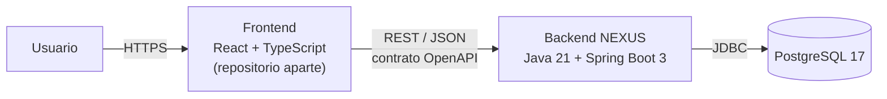
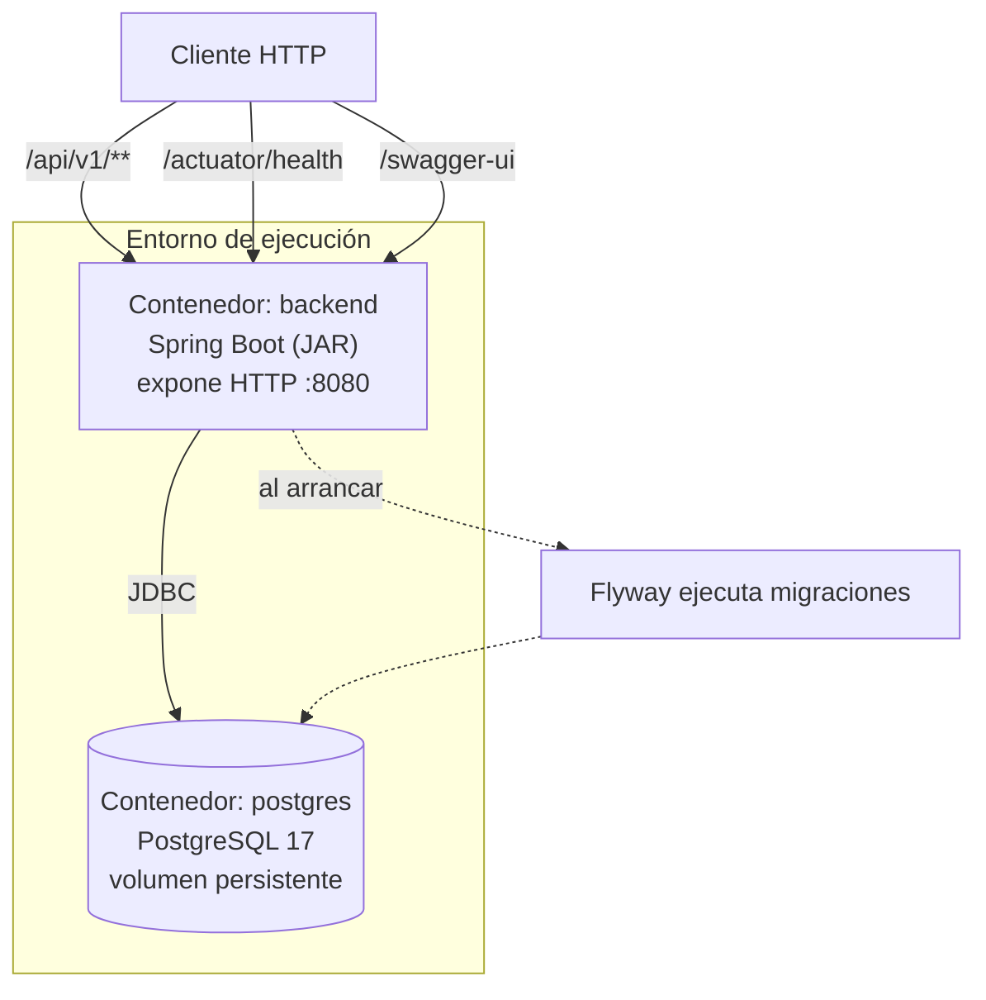
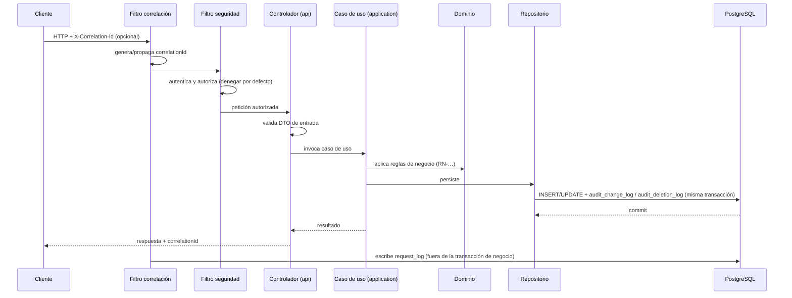

# Arquitectura del Backend — NEXUS

| Campo | Valor |
|---|---|
| Proyecto | NEXUS — Renovación de plataforma |
| Empresa | FACTECH GROUP SAS |
| Documento | `architecture.md` |
| Versión | 0.3.0 |
| Estado | Borrador |
| Responsable técnico | Bonilla Diaz William Steven |
| Fecha de creación | 19-08-2026 |
| Última actualización | 19-08-2026 |
| Documento superior | `constitution.md` v0.3.0 |
| Documento relacionado | `security.md` v0.2.0 |

---

## 1. Propósito y alcance

Este documento describe la arquitectura del backend de NEXUS: sus componentes, sus límites, cómo fluye una petición y qué reglas estructurales deben respetarse al agregar código.

Está subordinado a `constitution.md` (§0.1 de la constitución). Donde este documento detalla una regla constitucional, la cita explícitamente. Donde toma una decisión propia, la registra en §16.

**Fuera de alcance:** el modelo de roles y permisos y el mecanismo de autenticación se especifican en `security.md`; la estrategia de pruebas en `testing-strategy.md`; las convenciones de código en `development-guide.md`.

---

## 2. Contexto del sistema



El backend es el **único** componente con acceso a la base de datos. El frontend no consume PostgreSQL de ninguna forma, ni directa ni a través de herramientas de terceros.

El contrato entre frontend y backend es la especificación OpenAPI publicada, y nada más (Art. VIII.7). Los dos repositorios evolucionan de forma independiente.

---

## 3. Stack tecnológico

Versiones vigentes, en cumplimiento del Art. X.3 y X.5. La **fuente de verdad** de la versión exacta es siempre `pom.xml` y los `Dockerfile`; esta tabla declara la línea soportada.

| Área | Tecnología | Línea | Decisión |
|---|---|---|---|
| Lenguaje | Java (Temurin) | 21 LTS | D-01 |
| Framework | Spring Boot | 3.5.x | D-01 |
| Construcción | Maven | 3.9.x | D-02 |
| Base de datos | PostgreSQL | 17 | Art. V.1 |
| Migraciones | Flyway | 11.x | D-03 |
| Acceso a datos | Spring Data JPA / Hibernate | — | §6 |
| Documentación API | springdoc-openapi (Swagger UI) | 2.x | Art. VIII.2 |
| Pruebas | JUnit 5, Testcontainers, MockMvc | — | Art. VII |
| Contenedores | Docker + Docker Compose | — | Art. X.1, X.2 |
| CI/CD | GitHub Actions | — | Documento Marco §11 |

**Sobre la actualización de versiones:** los cambios de línea (por ejemplo Spring Boot 3.5 → 4.0, o Java 21 → 25) son decisiones de arquitectura y requieren registro en `docs/architecture/` y actualización de este documento. Las actualizaciones de parche son mantenimiento ordinario.

---

## 4. Vista de contenedores



- El backend es **stateless**: no mantiene estado de sesión en memoria. Cualquier estado vive en PostgreSQL. Esto permite escalar horizontalmente sin afinidad de sesión.
- Las migraciones se ejecutan al arrancar la aplicación, de forma automática y verificada (Art. V.4).
- El entorno local completo se levanta con `docker compose up` (Art. X.2).

---

## 5. Estructura del código

### 5.1 Organización

El código se organiza **por módulo de negocio**, no por capa técnica global. Cada módulo es autónomo y contiene sus propias capas (Art. VI.1).

```
src/main/java/com/factech/nexus/
├── NexusApplication.java
│
├── shared/                     Infraestructura transversal, sin lógica de negocio
│   ├── config/                 Configuración de Spring, beans, propiedades
│   ├── error/                  Manejo global de errores y formato de respuesta
│   ├── security/               Filtros de autenticación y autorización
│   ├── observability/          Correlación, request_log, logging estructurado
│   ├── audit/                  Los cuatro registros de auditoría (§6.6)
│   └── persistence/            Tipos base, generación de UUID v7, auditoría de entidades
│
└── modules/
    └── <modulo>/               Un paquete por módulo (COD-MODULO del requerimiento)
        ├── api/                Controladores REST y DTOs de entrada/salida
        ├── application/        Casos de uso y orquestación transaccional
        ├── domain/             Entidades, objetos de valor y reglas de negocio (RN-…)
        └── infrastructure/     Repositorios y adaptadores hacia el exterior

src/main/resources/
├── application.yml             Configuración base (sin valores de entorno)
└── db/migration/               Migraciones Flyway
```

### 5.2 Reglas de dependencia entre capas

| Capa | PUEDE depender de | NO DEBE depender de |
|---|---|---|
| `api` | `application`, DTOs propios | `infrastructure`, entidades de otros módulos |
| `application` | `domain`, puertos de `infrastructure` | `api` |
| `domain` | Solo de sí mismo y del JDK | Spring, JPA, HTTP, cualquier framework |
| `infrastructure` | `domain` | `api` |

La regla crítica es la de `domain`: **las reglas de negocio no conocen el framework** (Art. VI.3). Una regla `RN-…` debe poder probarse con una prueba unitaria pura, sin levantar Spring ni base de datos.

### 5.3 Comunicación entre módulos

- Un módulo **NO DEBE** acceder a las tablas ni a los repositorios de otro módulo.
- La comunicación ocurre a través de la capa `application` del módulo propietario, mediante una interfaz publicada por él.
- Las dependencias entre módulos deben ser acíclicas y quedar declaradas en el documento de requerimientos del módulo.

---

## 6. Persistencia

### 6.1 Principios

PostgreSQL es el único motor (Art. V.1). El esquema vive en migraciones Flyway versionadas, que son la fuente de verdad (Art. V.3, V.12). No existe generación automática de esquema: `ddl-auto` se configura en `validate`, nunca en `update` ni `create`.

### 6.2 Convenciones de esquema

| Elemento | Convención | Ejemplo |
|---|---|---|
| Tabla | `snake_case`, plural | `roles`, `role_permissions` |
| Columna | `snake_case` | `created_at` |
| Clave primaria | `id`, tipo `uuid` | `id uuid PRIMARY KEY` |
| Clave foránea | `<entidad_singular>_id` | `role_id` |
| Índice | `ix_<tabla>_<columnas>` | `ix_roles_name` |
| Restricción única | `uq_<tabla>_<columnas>` | `uq_roles_name` |
| Clave foránea (nombre) | `fk_<tabla>_<tabla_referida>` | `fk_role_permissions_roles` |
| Migración | `V<n>__<descripcion>.sql` | `V1__crear_roles.sql` |

### 6.3 Identificadores

Toda clave primaria es `uuid` generado como **UUID v7** (Art. V.11). La generación ocurre **en la capa de aplicación**, no en la base de datos: JPA necesita el identificador antes del `INSERT`, y generarlo en Java mantiene el comportamiento idéntico en pruebas y en producción.

UUID v7 incorpora una marca de tiempo en sus bits altos, por lo que los valores son crecientes y no fragmentan el índice B-tree como lo haría un v4 aleatorio.

### 6.4 Columnas obligatorias

Toda tabla de negocio incluye (Art. V.7):

| Columna | Tipo | Descripción |
|---|---|---|
| `id` | `uuid` | Clave primaria, UUID v7 |
| `created_at` | `timestamptz` | Fecha de creación |
| `updated_at` | `timestamptz` | Fecha de última modificación |
| `deleted_at` | `timestamptz` NULL | Marca de borrado lógico (Art. V.10) |

Las marcas de tiempo se almacenan siempre en `timestamptz` en UTC. La conversión a zona horaria local es responsabilidad del frontend.

**Las tablas no almacenan el actor del cambio** (Art. V.7). Quién creó o modificó un registro se responde consultando `audit_change_log` por entidad e identificador; quién lo eliminó y por qué, `audit_deletion_log` (§6.6). Esos registros son la única fuente de verdad del actor. Replicar el actor en cada tabla duplicaría un dato que ya existe y que puede quedar desincronizado.

Dos consecuencias que deben asumirse de forma consciente:

1. **Toda operación de escritura DEBE emitir su evento de auditoría.** Es lo que sostiene el modelo: si una operación omite el evento, la autoría de ese cambio se pierde y no hay forma de reconstruirla (Art. V.8).
2. **Mostrar "creado por" en una vista exige consultar la auditoría.** Para listados, esa consulta se resuelve con una proyección específica sobre `audit_change_log`, no agregando la columna de vuelta a la tabla de negocio.

### 6.5 Integridad

La integridad se declara en el esquema, no solo en la aplicación (Art. V.6): claves foráneas, `NOT NULL`, restricciones únicas y `CHECK` para dominios cerrados. Una validación en Java **complementa** la restricción de base de datos; no la sustituye.

### 6.6 Registros de auditoría

Implementa el Art. V.8. Son **cuatro tablas, no una**. Cada una responde una pregunta que las demás no pueden responder, y cada una declara `NOT NULL` lo que en su contexto es obligatorio — algo que un registro único no permite, porque lo obligatorio de un caso es inaplicable en otro.

| Tabla | Responde | Se escribe cuando |
|---|---|---|
| `audit_change_log` | Quién creó qué, y quién editó qué | Un alta o una edición se confirma |
| `audit_deletion_log` | Quién eliminó qué, y **por qué** | Una baja lógica o física se confirma |
| `audit_error_log` | A quién le falló qué, sobre qué recurso | Un fallo no controlado o un rechazo por regla de negocio |
| `audit_security_log` | Quién intentó qué contra el control de acceso | Los eventos de `security.md` §8 |

#### 6.6.1 Núcleo común

Las cuatro comparten estas columnas. Es lo que permite consultarlas en conjunto y correlacionarlas con `request_log`:

| Columna | Tipo | Descripción |
|---|---|---|
| `id` | `uuid` | Clave primaria, UUID v7 |
| `occurred_at` | `timestamptz` | Momento del evento, en UTC |
| `actor_id` | `uuid` NULL | Usuario responsable. `NULL` = anónimo o proceso del sistema |
| `correlation_id` | `uuid` NULL | Enlace con `request_log` (Art. XV.1) |
| `ip_address` | `inet` NULL | Dirección de origen (Art. V.15) |
| `user_agent` | `text` NULL | Cliente desde el que se originó la operación |

`inet` es el tipo nativo de PostgreSQL para direcciones: valida el formato, admite IPv4 e IPv6 sin decidir longitudes, y permite consultar por rango de red con el operador de contención de subred — sobre un `varchar` esa misma consulta obliga a recorrer la tabla entera.

Las tres columnas de origen son nulables **a la vez y por la misma razón**: existen operaciones sin petición HTTP detrás (migraciones, tareas programadas, procesos internos). Esa correspondencia la fija el esquema, no la aplicación:

```sql
CONSTRAINT ck_audit_origen CHECK (
    (correlation_id IS NULL     AND ip_address IS NULL)
 OR (correlation_id IS NOT NULL AND ip_address IS NOT NULL)
)
```

Con esa restricción, una fila sin IP significa inequívocamente «no vino de la red», y nunca «se olvidó registrarla» (Art. V.15).

**Obtención de la IP.** Detrás de un proxy inverso, la IP del socket es la del proxy; la real llega en `X-Forwarded-For`, que es una cabecera **provista por el cliente** y por tanto falsificable. Se resuelve declarando en configuración la lista de proxies confiables y descartando todo salto no confiable de la cadena. Sin esa lista, cualquiera puede escribir en su propia auditoría la IP que quiera, y el campo deja de ser evidencia.

**La IP no se enmascara.** El enmascaramiento del Art. XV.5 aplica a cuerpos de petición y respuesta; en la auditoría la IP *es* el dato. Queda sujeta, eso sí, a la política de retención (§9).

#### 6.6.2 `audit_change_log` — creación y edición

| Columna | Tipo | Descripción |
|---|---|---|
| `module` | `varchar` | Código del módulo (`SP`, `USR`, …) |
| `entity` | `varchar` | Nombre lógico de la entidad (`roles`, `users`) |
| `entity_id` | `uuid` | Identificador del registro afectado |
| `action` | `varchar` | `CREATE` o `UPDATE`, con `CHECK` sobre el dominio cerrado |
| `changes` | `jsonb` | En `CREATE`, el estado inicial. En `UPDATE`, solo los campos modificados |

En una edición, `changes` registra el antes y el después **únicamente de lo que cambió**:

```json
{
  "name":   { "before": "Supervisor", "after": "Supervisor de zona" },
  "status": { "before": "ACTIVO",     "after": "INACTIVO" }
}
```

Guardar el registro completo en cada edición multiplica el volumen y obliga a diferenciar a mano para responder «qué se editó». El diff responde esa pregunta directamente, y el estado completo se reconstruye aplicando los eventos en orden.

Tres reglas que evitan huecos y ruido:

- **Una edición que no modifica ningún campo no emite evento.** Un `UPDATE` con `changes` vacío es una fila sin información que ensucia la línea de tiempo.
- **Restaurar un registro eliminado lógicamente se audita aquí**, como `UPDATE` sobre `deleted_at`. La fila de `audit_deletion_log` **permanece**: la eliminación ocurrió, y borrarla sería reescribir la historia.
- **Los campos enmascarados nunca entran en `changes`.** Que una contraseña cambió se registra; su valor no, ni antes ni después (Art. IV.8).

#### 6.6.3 `audit_deletion_log` — eliminación

| Columna | Tipo | Descripción |
|---|---|---|
| `module`, `entity`, `entity_id` | | Igual que en `audit_change_log` |
| `deletion_type` | `varchar` | `LOGICAL` o `PHYSICAL` |
| `reason` | `text` **NOT NULL** | Motivo declarado por el actor (Art. V.13) |
| `snapshot` | `jsonb` **NOT NULL** | Estado completo del registro al momento de eliminarse |

El motivo es obligatorio en el esquema, y el esquema exige además que diga algo:

```sql
CONSTRAINT ck_deletion_reason CHECK (char_length(btrim(reason)) >= 10)
```

**Consecuencia sobre la API, que debe asumirse de forma consciente:** si el motivo es obligatorio, hay que pedirlo. Todo `DELETE` recibe un cuerpo JSON con el motivo y responde `400` si falta o no alcanza el mínimo:

```
DELETE /api/v1/roles/{id}

{ "reason": "Rol duplicado tras la fusión de las áreas de cobranza." }
```

El cuerpo en `DELETE` es admisible en OpenAPI 3.1 y Spring lo soporta sin artificios, pero RFC 9110 no le define semántica y un intermediario podría descartarlo. Si eso llegara a ocurrir en el despliegue real, la alternativa declarada es la cabecera `X-Deletion-Reason`. **No** se usa parámetro de consulta: el motivo terminaría en la URL, y con ella en las trazas de acceso del proxy y en `request_log`.

El `snapshot` es lo que vuelve útil a este registro. Sin él, la fila dice que el rol `018f3a…` fue eliminado y ya nadie recuerda qué rol era. Pasa por el mismo enmascarador que el resto: el estado de un usuario eliminado se conserva sin su `password_hash`.

#### 6.6.4 `audit_error_log` — fallos

| Columna | Tipo | Descripción |
|---|---|---|
| `resource` | `varchar` | Recurso afectado: entidad o ruta del endpoint |
| `entity_id` | `uuid` NULL | Registro concreto, cuando el error se refiere a uno |
| `operation` | `varchar` | Caso de uso, o método y ruta HTTP |
| `error_code` | `varchar` | Código del contrato de error (§7.3) o de la regla incumplida (`RN-SEG-003`) |
| `error_type` | `varchar` | `BUSINESS_RULE`, `INTEGRATION` o `UNHANDLED` |
| `http_status` | `smallint` | Código devuelto al cliente |
| `severity` | `varchar` | `MEDIA` o `ALTA` |
| `message` | `text` | Mensaje saneado: sin trazas, SQL, rutas ni versiones (Art. VI.5) |

**Qué entra y qué no.** El `request_log` ya registra toda petición fallida (Art. XV.4); duplicarlo entero no aportaría información y sí volumen. Aquí entra solo lo accionable:

| Caso | ¿Auditoría de error? | Por qué |
|---|---|---|
| Excepción no controlada (`5xx`) | **Sí** | Es el fallo que hay que investigar |
| Violación de una regla `RN-…` | **Sí** | Explica por qué el negocio rechazó la operación |
| Fallo de una integración externa | **Sí** | Evidencia frente a un tercero |
| Validación de formato (`400`) | No | Ruido de formulario; `request_log` ya lo cubre |
| `401` o `404` | No | `request_log` ya lo cubre |
| Denegación de autorización (`403`) | No — va a `audit_security_log` | Es un evento de control de acceso, no un fallo del sistema |

La última fila es la frontera que importa: una denegación no es un error del sistema, es el sistema funcionando. Registrarla como error contamina la búsqueda de fallos reales.

**El detalle técnico completo no vive aquí.** La traza va al log de aplicación, alcanzable por `correlation_id`. Esta tabla responde «a quién le falló qué», no «en qué línea».

#### 6.6.5 `audit_security_log` — control de acceso

Su catálogo de eventos, severidades y columnas propias se define en `security.md` §8, que es donde corresponde.

#### 6.6.6 Consulta transversal

Las cuatro tablas están separadas **para escribir**. Para leer hay dos preguntas legítimas y frecuentes que las cruzan: «todo lo que le pasó a esta entidad» y «todo lo que hizo esta persona». Se resuelven con una vista de solo lectura sobre el núcleo común:

```sql
CREATE VIEW v_audit_timeline AS
    SELECT 'CHANGE' AS audit_type, id, occurred_at, actor_id, correlation_id,
           ip_address, entity, entity_id, action AS summary
      FROM audit_change_log
    UNION ALL
    SELECT 'DELETION', id, occurred_at, actor_id, correlation_id,
           ip_address, entity, entity_id, deletion_type
      FROM audit_deletion_log
    UNION ALL
    SELECT 'ERROR', id, occurred_at, actor_id, correlation_id,
           ip_address, resource, entity_id, error_code
      FROM audit_error_log
    UNION ALL
    SELECT 'SECURITY', id, occurred_at, actor_id, correlation_id,
           ip_address, 'security', target_user_id, event_type
      FROM audit_security_log;
```

La vista es **solo de lectura**: nada se escribe a través de ella. Cada tabla se escribe por su propio camino, con sus propias obligaciones. Consultarla exige los cuatro permisos de lectura; con un subconjunto se consulta cada tabla por separado (`security.md` §4.4).

**Índices mínimos** en cada tabla — una auditoría que no puede consultarse no cumple su función:

| Índice | Responde |
|---|---|
| `(entity, entity_id, occurred_at DESC)` | La línea de tiempo de un registro |
| `(actor_id, occurred_at DESC)` | Todo lo que hizo una persona |
| `(correlation_id)` | El enlace con `request_log` |
| `(ip_address)` | Investigación por origen |

---

## 7. API

### 7.1 Convenciones

- Base: `/api/v1`. La versión va en la ruta (Art. VIII.1).
- Recursos en plural y `kebab-case`: `/api/v1/roles`, `/api/v1/role-permissions`.
- Los identificadores en las rutas son UUID.
- Verbos HTTP según su semántica: `GET` consulta, `POST` crea, `PUT` reemplaza, `PATCH` modifica parcialmente, `DELETE` elimina.

### 7.2 Códigos de estado

| Código | Uso |
|---|---|
| `200` | Consulta o modificación exitosa |
| `201` | Recurso creado (con cabecera `Location`) |
| `204` | Operación exitosa sin contenido |
| `400` | Petición malformada o inválida |
| `401` | No autenticado |
| `403` | Autenticado pero sin permiso |
| `404` | Recurso inexistente |
| `409` | Conflicto con el estado actual (duplicados, reglas de negocio) |
| `422` | Entidad sintácticamente válida pero semánticamente rechazada |
| `500` | Error no controlado |

### 7.3 Formato de error

Uniforme en toda la API (Art. VIII.4), basado en **RFC 9457 Problem Details**:

```json
{
  "type": "https://nexus.factech.co/errors/validacion",
  "title": "La solicitud contiene campos inválidos",
  "status": 400,
  "detail": "El campo 'name' es obligatorio.",
  "instance": "/api/v1/roles",
  "correlationId": "018f3a2b-7c41-7000-9a3d-1f2e5b8c9d01",
  "errors": [
    { "field": "name", "code": "VAL-001", "message": "El nombre es obligatorio." }
  ]
}
```

Los mensajes nunca exponen trazas, consultas SQL, rutas de archivos ni versiones (Art. VI.5). El `correlationId` siempre viaja en la respuesta, para que un usuario pueda reportar un error y el equipo pueda localizarlo en `request_log` (Art. XV.1).

### 7.4 Paginación y ordenamiento

Las colecciones se paginan siempre. Nunca se devuelve una colección completa sin límite.

```
GET /api/v1/roles?page=0&size=20&sort=name,asc
```

`size` tiene un máximo declarado en configuración. La respuesta incluye el total de elementos, el total de páginas y la página actual.

---

## 8. Flujo de una petición



Tres puntos determinantes de este flujo, todos sobre **dónde** se escribe cada registro (Art. V.14):

1. **La auditoría de cambios y la de eliminación se escriben dentro de la misma transacción** que el cambio de negocio. Si la operación se revierte, su evento también. Nunca queda un evento auditado que no ocurrió, ni un cambio sin auditar. Si el evento falla, la operación falla.

2. **La auditoría de error y la de seguridad se escriben en una transacción independiente** (`REQUIRES_NEW`). Es obligatorio y no es un detalle de implementación: estos dos registros se emiten justo cuando la transacción de negocio está siendo revertida. Escritos dentro de ella, el `rollback` borraría el evento junto con el fallo — un intento de inicio de sesión fallido no dejaría rastro, que es exactamente lo contrario de lo que se busca.

3. **`request_log` se escribe fuera de la transacción de negocio**, una vez emitida la respuesta. Así se cumple el Art. XV.7: un fallo al registrar la petición no puede tumbar una operación de negocio válida. La contrapartida es que el registro de peticiones es *best effort* y su indisponibilidad debe monitorearse.

| Registro | Transacción | Si falla su escritura |
|---|---|---|
| `audit_change_log` | La del cambio | Falla la operación de negocio |
| `audit_deletion_log` | La del cambio | Falla la operación de negocio |
| `audit_error_log` | Propia, independiente | No se propaga; queda en el log de aplicación como `ERROR` |
| `audit_security_log` | Propia, independiente | No se propaga, salvo eventos declarados como requisito legal (Art. XV.7) |
| `request_log` | Ninguna, posterior a la respuesta | No se propaga; *best effort* |

---

## 9. Observabilidad

Implementa el Art. XV. Seis registros con propósitos distintos — los cuatro de auditoría (§6.6), el de peticiones y el de aplicación:

| Registro | Responde | Dónde vive | Retención |
|---|---|---|---|
| `audit_change_log` | Quién creó y quién editó qué | PostgreSQL | Larga; no se purga sin decisión documentada (XV.8) |
| `audit_deletion_log` | Quién eliminó qué y por qué | PostgreSQL | Larga; no se purga sin decisión documentada (XV.8) |
| `audit_security_log` | Qué ocurrió en el control de acceso | PostgreSQL | Larga; no se purga sin decisión documentada (XV.8) |
| `audit_error_log` | A quién le falló qué y con qué error | PostgreSQL | Acotada, mayor que la de `request_log` (XV.8) |
| `request_log` | Qué se le pidió al sistema y qué respondió | PostgreSQL | Acotada, purga automatizada (XV.8) |
| Log de aplicación | Qué ocurrió técnicamente durante la ejecución | Salida estándar, formato estructurado | Según la plataforma de ejecución |

Los seis comparten el **identificador de correlación**, lo que permite reconstruir una operación completa a partir de un solo valor. Los cinco que viven en PostgreSQL comparten además la **IP de origen** cuando la operación llegó por HTTP (Art. V.15), de modo que la pregunta «desde dónde se hizo esto» se responde sin depender de que `request_log` siga existiendo — y `request_log` es justamente el de retención más corta.

Que la retención sea distinta por registro es una consecuencia buscada de la separación del Art. V.8: la auditoría de error acumula volumen y envejece rápido; la de eliminación no envejece nunca.

**Enmascaramiento (Art. XV.5):** antes de persistir cualquier cuerpo de petición o respuesta se aplica una lista de campos sensibles (contraseñas, tokens, cabeceras `Authorization`, datos personales). El enmascaramiento es por lista de inclusión de lo que sí puede registrarse, no por lista de exclusión: un campo nuevo no declarado se enmascara por defecto.

**Salud:** `/actuator/health` expuesto sin autenticación de negocio y sin detalle interno (Art. XV.10).

**Rendimiento (Art. XV.9):** la duración de cada petición queda en `request_log`, lo que permite medir el p95 real por endpoint y verificar los umbrales (<500 ms lectura, <1 s escritura) sin instrumentación adicional.

---

## 10. Seguridad

El modelo de roles, permisos y el mecanismo de autenticación se definen en `security.md` (decisión D-08, cerrada el 19-08-2026): token de acceso JWT de 15 minutos más refresh token opaco, revocable y con rotación. A nivel arquitectónico se fija lo siguiente:

- La autorización se aplica en la capa `api` mediante filtros y anotaciones declarativas, con **denegar por defecto** (Art. IV.1). Un endpoint sin declaración explícita de permiso queda inaccesible.
- El backend es stateless: no hay sesión en memoria del servidor.
- Toda entrada externa se valida en el borde, antes de llegar a `application` (Art. IV.4).
- El acceso a datos usa exclusivamente consultas parametrizadas (Art. IV.5).
- Las credenciales de base de datos y los secretos llegan por variable de entorno (Art. IX.1).

---

## 11. Configuración y entornos

Toda configuración dependiente del entorno se inyecta por variable de entorno (Art. IX.1). La aplicación falla al arrancar si falta una variable obligatoria (Art. IX.5).

| Variable | Obligatoria | Descripción |
|---|---|---|
| `DATABASE_URL` | Sí | Cadena de conexión a PostgreSQL |
| `DATABASE_USER` | Sí | Usuario de base de datos |
| `DATABASE_PASSWORD` | Sí | Contraseña de base de datos |
| `JWT_SECRET` | Sí | Secreto de firma de tokens |
| `API_URL` | Sí | URL pública del backend |
| `ENVIRONMENT` | Sí | `development` \| `testing` \| `production` |
| `LOG_LEVEL` | No | Nivel de log; por defecto `INFO` |
| `REQUEST_LOG_RETENTION_DAYS` | No | Retención del `request_log` |

El repositorio mantiene `.env.example` con todas las variables y **sin valores reales** (Art. IX.3).

---

## 12. Despliegue

- El backend se empaqueta como imagen Docker, construida en múltiples etapas: una etapa compila con Maven, la etapa final contiene solo el JRE y el JAR.
- El contenedor se ejecuta con un usuario sin privilegios.
- `docker-compose.yml` levanta backend y PostgreSQL para desarrollo local.
- GitHub Actions ejecuta, en cada Pull Request: compilación, linting, pruebas unitarias y pruebas de integración con Testcontainers. La integración a `main` requiere pipeline en verde (Art. XI, verificación).

---

## 13. Atributos de calidad

Trazabilidad a ISO/IEC 25010, referida por el Documento Marco §2.

| Atributo | Cómo lo aborda esta arquitectura |
|---|---|
| Adecuación funcional | Cada módulo implementa requerimientos identificados y verificables (Art. I, II) |
| Eficiencia | Umbrales p95 medibles desde `request_log` (Art. XV.9); paginación obligatoria |
| Compatibilidad | Contrato OpenAPI versionado como única interfaz externa (Art. VIII) |
| Fiabilidad | Transaccionalidad explícita; auditoría consistente con el cambio; errores uniformes |
| Seguridad | Denegar por defecto, mínimo privilegio, enmascaramiento, parametrización (Art. IV) |
| Mantenibilidad | Modularización por negocio y dominio libre de framework (Art. VI) |
| Portabilidad | Docker, configuración por entorno, migraciones automatizadas (Art. IX, X) |

---

## 14. Restricciones conocidas

- **Un solo motor de base de datos.** No se contempla soporte multi-motor; el SQL puede usar características propias de PostgreSQL (Art. V.2).
- **Backend stateless.** Cualquier funcionalidad que requiera estado en memoria compartido entre peticiones necesita una decisión de arquitectura previa.
- **`request_log` en la base de datos transaccional.** Es la opción simple y correcta para el volumen inicial. Si el volumen de peticiones crece, esta decisión debe revisarse antes de que degrade el rendimiento del motor de negocio; el disparador de revisión debe definirse como métrica, no por percepción.

---

## 15. Registro de decisiones de arquitectura

Las decisiones relevantes se registran individualmente en `docs/architecture/` (Art. XII.4), con el formato: contexto, decisión, alternativas consideradas y consecuencias.

Nomenclatura: `ADR-NNN-<titulo-en-kebab-case>.md`

Las decisiones D-01 a D-07, cerradas el 19-08-2026, están registradas en `constitution.md` §20.

---

## 16. Decisiones pendientes

| # | Decisión | Bloquea | Responsable |
|---|---|---|---|
| D-09 | Infraestructura de despliegue para `testing` y `production` | Pipeline de despliegue | Responsable del proyecto |
| D-10 | Retención concreta, en días, de `request_log` y de cada registro de auditoría por separado | Migración de observabilidad | Responsable técnico |
| D-11 | Política de idempotencia en operaciones de escritura expuestas a reintentos | Diseño de endpoints críticos | Responsable técnico |

D-08 quedó cerrada en `security.md` §12, junto con las decisiones D-12 a D-15 del modelo de autorización. Las pendientes propias de seguridad (D-16 a D-19) se registran en ese mismo documento.

---

## 17. Control de cambios

| Versión | Fecha | Cambio | Responsable |
|---|---|---|---|
| 0.1.0 | 19-08-2026 | Creación inicial. Incorpora las decisiones D-01 a D-07. | Responsable técnico |
| 0.2.0 | 19-08-2026 | Cierre de D-08 en `security.md`. Referencia cruzada al modelo de seguridad. | Responsable técnico |
| 0.3.0 | 19-08-2026 | Se retiran `created_by` y `updated_by` de las columnas obligatorias: el actor reside solo en la auditoría. | Responsable técnico |
| 0.4.0 | 20-08-2026 | Nueva §6.6: la auditoría se separa en cuatro registros (cambios, eliminación, error y seguridad), con núcleo común, IP de origen y vista de consulta transversal. §8 incorpora la transaccionalidad diferenciada; §9 pasa de tres a seis registros de observabilidad. Enmienda la constitución 0.4.0. | Responsable técnico |
