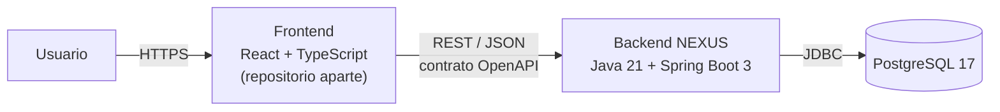
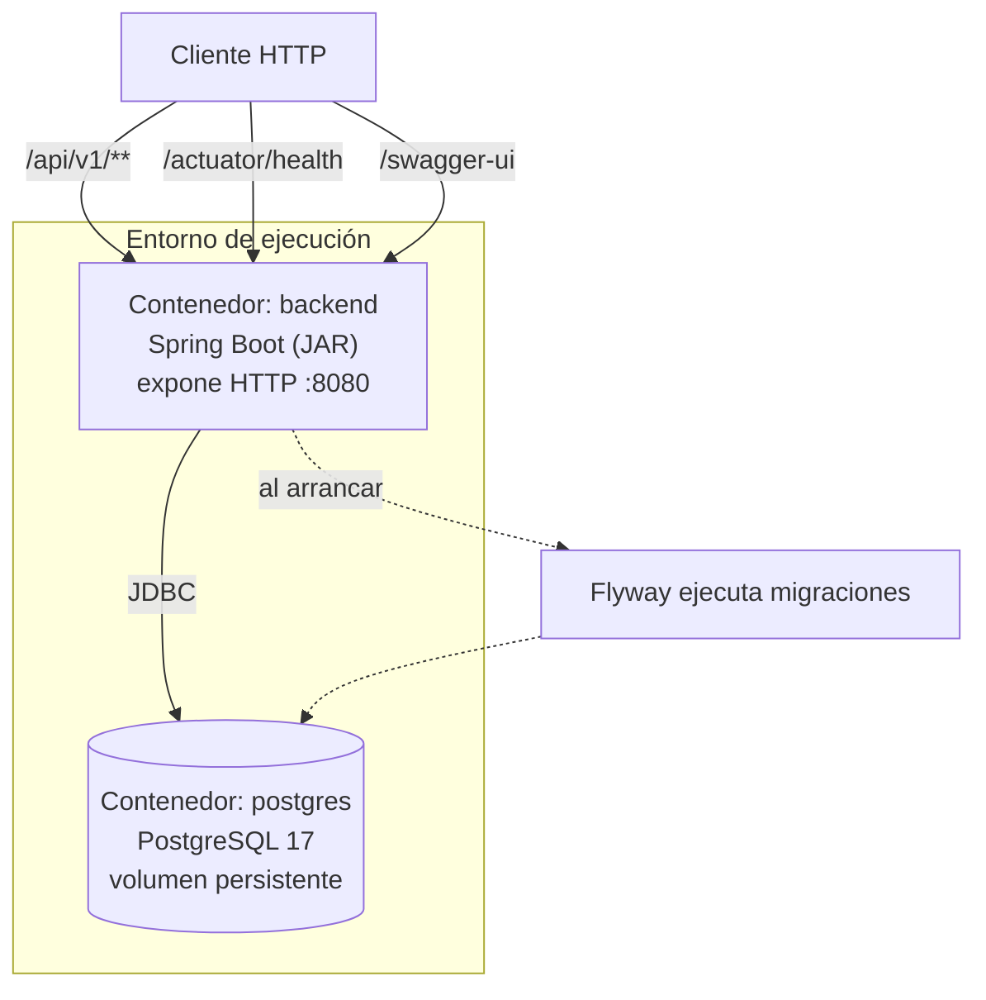
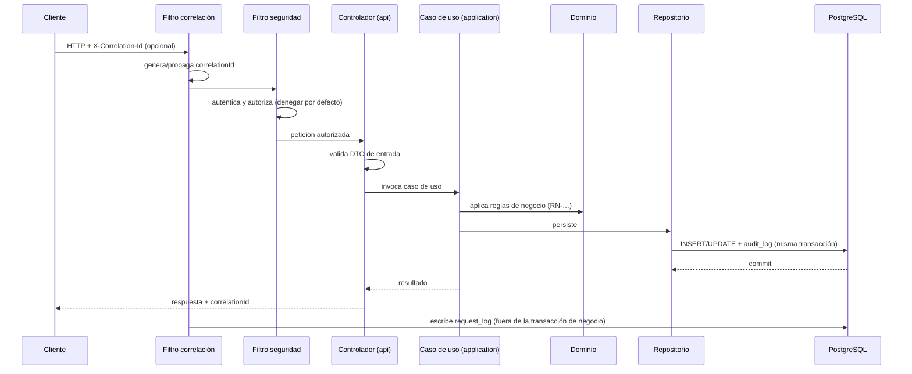

# Arquitectura del Backend — NEXUS

| Campo | Valor |
|---|---|
| Proyecto | NEXUS — Renovación de plataforma |
| Empresa | FACTECH GROUP SAS |
| Documento | `architecture.md` |
| Versión | 0.1.0 |
| Estado | Borrador |
| Responsable técnico | Bonilla Diaz William Steven |
| Fecha de creación | 19-08-2026 |
| Última actualización | 19-08-2026 |
| Documento superior | `constitution.md` v0.2.0 |

---

## 1. Propósito y alcance

Este documento describe la arquitectura del backend de NEXUS: sus componentes, sus límites, cómo fluye una petición y qué reglas estructurales deben respetarse al agregar código.

Está subordinado a `constitution.md` (§0.1 de la constitución). Donde este documento detalla una regla constitucional, la cita explícitamente. Donde toma una decisión propia, la registra en §16.

**Fuera de alcance:** el modelo de roles y permisos y el mecanismo de autenticación se especifican en `security.md`; la estrategia de pruebas en `testing-strategy.md`; las convenciones de código en `development-guide.md`.

---

## 2. Contexto del sistema



El backend es el **único** componente con acceso a la base de datos. El frontend no consume PostgreSQL de ninguna forma, ni directa ni a través de herramientas de terceros.

El contrato entre frontend y backend es la especificación OpenAPI publicada, y nada más (Art. VIII.7). Los dos repositorios evolucionan de forma independiente.

---

## 3. Stack tecnológico

Versiones vigentes, en cumplimiento del Art. X.3 y X.5. La **fuente de verdad** de la versión exacta es siempre `pom.xml` y los `Dockerfile`; esta tabla declara la línea soportada.

| Área | Tecnología | Línea | Decisión |
|---|---|---|---|
| Lenguaje | Java (Temurin) | 21 LTS | D-01 |
| Framework | Spring Boot | 3.5.x | D-01 |
| Construcción | Maven | 3.9.x | D-02 |
| Base de datos | PostgreSQL | 17 | Art. V.1 |
| Migraciones | Flyway | 11.x | D-03 |
| Acceso a datos | Spring Data JPA / Hibernate | — | §6 |
| Documentación API | springdoc-openapi (Swagger UI) | 2.x | Art. VIII.2 |
| Pruebas | JUnit 5, Testcontainers, MockMvc | — | Art. VII |
| Contenedores | Docker + Docker Compose | — | Art. X.1, X.2 |
| CI/CD | GitHub Actions | — | Documento Marco §11 |

**Sobre la actualización de versiones:** los cambios de línea (por ejemplo Spring Boot 3.5 → 4.0, o Java 21 → 25) son decisiones de arquitectura y requieren registro en `docs/architecture/` y actualización de este documento. Las actualizaciones de parche son mantenimiento ordinario.

---

## 4. Vista de contenedores



- El backend es **stateless**: no mantiene estado de sesión en memoria. Cualquier estado vive en PostgreSQL. Esto permite escalar horizontalmente sin afinidad de sesión.
- Las migraciones se ejecutan al arrancar la aplicación, de forma automática y verificada (Art. V.4).
- El entorno local completo se levanta con `docker compose up` (Art. X.2).

---

## 5. Estructura del código

### 5.1 Organización

El código se organiza **por módulo de negocio**, no por capa técnica global. Cada módulo es autónomo y contiene sus propias capas (Art. VI.1).

```
src/main/java/com/factech/nexus/
├── NexusApplication.java
│
├── shared/                     Infraestructura transversal, sin lógica de negocio
│   ├── config/                 Configuración de Spring, beans, propiedades
│   ├── error/                  Manejo global de errores y formato de respuesta
│   ├── security/               Filtros de autenticación y autorización
│   ├── observability/          Correlación, request_log, logging estructurado
│   ├── audit/                  Registro de eventos de negocio (audit_log)
│   └── persistence/            Tipos base, generación de UUID v7, auditoría de entidades
│
└── modules/
    └── <modulo>/               Un paquete por módulo (COD-MODULO del requerimiento)
        ├── api/                Controladores REST y DTOs de entrada/salida
        ├── application/        Casos de uso y orquestación transaccional
        ├── domain/             Entidades, objetos de valor y reglas de negocio (RN-…)
        └── infrastructure/     Repositorios y adaptadores hacia el exterior

src/main/resources/
├── application.yml             Configuración base (sin valores de entorno)
└── db/migration/               Migraciones Flyway
```

### 5.2 Reglas de dependencia entre capas

| Capa | PUEDE depender de | NO DEBE depender de |
|---|---|---|
| `api` | `application`, DTOs propios | `infrastructure`, entidades de otros módulos |
| `application` | `domain`, puertos de `infrastructure` | `api` |
| `domain` | Solo de sí mismo y del JDK | Spring, JPA, HTTP, cualquier framework |
| `infrastructure` | `domain` | `api` |

La regla crítica es la de `domain`: **las reglas de negocio no conocen el framework** (Art. VI.3). Una regla `RN-…` debe poder probarse con una prueba unitaria pura, sin levantar Spring ni base de datos.

### 5.3 Comunicación entre módulos

- Un módulo **NO DEBE** acceder a las tablas ni a los repositorios de otro módulo.
- La comunicación ocurre a través de la capa `application` del módulo propietario, mediante una interfaz publicada por él.
- Las dependencias entre módulos deben ser acíclicas y quedar declaradas en el documento de requerimientos del módulo.

---

## 6. Persistencia

### 6.1 Principios

PostgreSQL es el único motor (Art. V.1). El esquema vive en migraciones Flyway versionadas, que son la fuente de verdad (Art. V.3, V.12). No existe generación automática de esquema: `ddl-auto` se configura en `validate`, nunca en `update` ni `create`.

### 6.2 Convenciones de esquema

| Elemento | Convención | Ejemplo |
|---|---|---|
| Tabla | `snake_case`, plural | `roles`, `role_permissions` |
| Columna | `snake_case` | `created_at` |
| Clave primaria | `id`, tipo `uuid` | `id uuid PRIMARY KEY` |
| Clave foránea | `<entidad_singular>_id` | `role_id` |
| Índice | `ix_<tabla>_<columnas>` | `ix_roles_name` |
| Restricción única | `uq_<tabla>_<columnas>` | `uq_roles_name` |
| Clave foránea (nombre) | `fk_<tabla>_<tabla_referida>` | `fk_role_permissions_roles` |
| Migración | `V<n>__<descripcion>.sql` | `V1__crear_roles.sql` |

### 6.3 Identificadores

Toda clave primaria es `uuid` generado como **UUID v7** (Art. V.11). La generación ocurre **en la capa de aplicación**, no en la base de datos: JPA necesita el identificador antes del `INSERT`, y generarlo en Java mantiene el comportamiento idéntico en pruebas y en producción.

UUID v7 incorpora una marca de tiempo en sus bits altos, por lo que los valores son crecientes y no fragmentan el índice B-tree como lo haría un v4 aleatorio.

### 6.4 Columnas obligatorias

Toda tabla de negocio incluye (Art. V.7):

| Columna | Tipo | Descripción |
|---|---|---|
| `id` | `uuid` | Clave primaria, UUID v7 |
| `created_at` | `timestamptz` | Fecha de creación |
| `created_by` | `uuid` | Actor que creó el registro |
| `updated_at` | `timestamptz` | Fecha de última modificación |
| `updated_by` | `uuid` | Actor de la última modificación |
| `deleted_at` | `timestamptz` NULL | Marca de borrado lógico (Art. V.10) |

Las marcas de tiempo se almacenan siempre en `timestamptz` en UTC. La conversión a zona horaria local es responsabilidad del frontend.

### 6.5 Integridad

La integridad se declara en el esquema, no solo en la aplicación (Art. V.6): claves foráneas, `NOT NULL`, restricciones únicas y `CHECK` para dominios cerrados. Una validación en Java **complementa** la restricción de base de datos; no la sustituye.

---

## 7. API

### 7.1 Convenciones

- Base: `/api/v1`. La versión va en la ruta (Art. VIII.1).
- Recursos en plural y `kebab-case`: `/api/v1/roles`, `/api/v1/role-permissions`.
- Los identificadores en las rutas son UUID.
- Verbos HTTP según su semántica: `GET` consulta, `POST` crea, `PUT` reemplaza, `PATCH` modifica parcialmente, `DELETE` elimina.

### 7.2 Códigos de estado

| Código | Uso |
|---|---|
| `200` | Consulta o modificación exitosa |
| `201` | Recurso creado (con cabecera `Location`) |
| `204` | Operación exitosa sin contenido |
| `400` | Petición malformada o inválida |
| `401` | No autenticado |
| `403` | Autenticado pero sin permiso |
| `404` | Recurso inexistente |
| `409` | Conflicto con el estado actual (duplicados, reglas de negocio) |
| `422` | Entidad sintácticamente válida pero semánticamente rechazada |
| `500` | Error no controlado |

### 7.3 Formato de error

Uniforme en toda la API (Art. VIII.4), basado en **RFC 9457 Problem Details**:

```json
{
  "type": "https://nexus.factech.co/errors/validacion",
  "title": "La solicitud contiene campos inválidos",
  "status": 400,
  "detail": "El campo 'name' es obligatorio.",
  "instance": "/api/v1/roles",
  "correlationId": "018f3a2b-7c41-7000-9a3d-1f2e5b8c9d01",
  "errors": [
    { "field": "name", "code": "VAL-001", "message": "El nombre es obligatorio." }
  ]
}
```

Los mensajes nunca exponen trazas, consultas SQL, rutas de archivos ni versiones (Art. VI.5). El `correlationId` siempre viaja en la respuesta, para que un usuario pueda reportar un error y el equipo pueda localizarlo en `request_log` (Art. XV.1).

### 7.4 Paginación y ordenamiento

Las colecciones se paginan siempre. Nunca se devuelve una colección completa sin límite.

```
GET /api/v1/roles?page=0&size=20&sort=name,asc
```

`size` tiene un máximo declarado en configuración. La respuesta incluye el total de elementos, el total de páginas y la página actual.

---

## 8. Flujo de una petición



Dos puntos determinantes de este flujo:

1. **`audit_log` se escribe dentro de la misma transacción** que el cambio de negocio. Si la operación se revierte, la auditoría también. Nunca queda un evento auditado que no ocurrió, ni un cambio sin auditar.

2. **`request_log` se escribe fuera de la transacción de negocio**, una vez emitida la respuesta. Así se cumple el Art. XV.7: un fallo al registrar la petición no puede tumbar una operación de negocio válida. La contrapartida es que el registro de peticiones es *best effort* y su indisponibilidad debe monitorearse.

---

## 9. Observabilidad

Implementa el Art. XV. Tres registros con propósitos distintos:

| Registro | Responde | Dónde vive | Retención |
|---|---|---|---|
| `audit_log` | Qué cambió en el negocio y quién lo cambió | PostgreSQL | Larga; no se purga sin decisión documentada (XV.8) |
| `request_log` | Qué se le pidió al sistema y qué respondió | PostgreSQL | Acotada, purga automatizada (XV.8) |
| Log de aplicación | Qué ocurrió técnicamente durante la ejecución | Salida estándar, formato estructurado | Según la plataforma de ejecución |

Los tres comparten el **identificador de correlación**, lo que permite reconstruir una operación completa a partir de un solo valor.

**Enmascaramiento (Art. XV.5):** antes de persistir cualquier cuerpo de petición o respuesta se aplica una lista de campos sensibles (contraseñas, tokens, cabeceras `Authorization`, datos personales). El enmascaramiento es por lista de inclusión de lo que sí puede registrarse, no por lista de exclusión: un campo nuevo no declarado se enmascara por defecto.

**Salud:** `/actuator/health` expuesto sin autenticación de negocio y sin detalle interno (Art. XV.10).

**Rendimiento (Art. XV.9):** la duración de cada petición queda en `request_log`, lo que permite medir el p95 real por endpoint y verificar los umbrales (<500 ms lectura, <1 s escritura) sin instrumentación adicional.

---

## 10. Seguridad

El modelo de roles, permisos y el mecanismo de autenticación se definen en `security.md`. A nivel arquitectónico se fija lo siguiente:

- La autorización se aplica en la capa `api` mediante filtros y anotaciones declarativas, con **denegar por defecto** (Art. IV.1). Un endpoint sin declaración explícita de permiso queda inaccesible.
- El backend es stateless: no hay sesión en memoria del servidor.
- Toda entrada externa se valida en el borde, antes de llegar a `application` (Art. IV.4).
- El acceso a datos usa exclusivamente consultas parametrizadas (Art. IV.5).
- Las credenciales de base de datos y los secretos llegan por variable de entorno (Art. IX.1).

---

## 11. Configuración y entornos

Toda configuración dependiente del entorno se inyecta por variable de entorno (Art. IX.1). La aplicación falla al arrancar si falta una variable obligatoria (Art. IX.5).

| Variable | Obligatoria | Descripción |
|---|---|---|
| `DATABASE_URL` | Sí | Cadena de conexión a PostgreSQL |
| `DATABASE_USER` | Sí | Usuario de base de datos |
| `DATABASE_PASSWORD` | Sí | Contraseña de base de datos |
| `JWT_SECRET` | Sí | Secreto de firma de tokens |
| `API_URL` | Sí | URL pública del backend |
| `ENVIRONMENT` | Sí | `development` \| `testing` \| `production` |
| `LOG_LEVEL` | No | Nivel de log; por defecto `INFO` |
| `REQUEST_LOG_RETENTION_DAYS` | No | Retención del `request_log` |

El repositorio mantiene `.env.example` con todas las variables y **sin valores reales** (Art. IX.3).

---

## 12. Despliegue

- El backend se empaqueta como imagen Docker, construida en múltiples etapas: una etapa compila con Maven, la etapa final contiene solo el JRE y el JAR.
- El contenedor se ejecuta con un usuario sin privilegios.
- `docker-compose.yml` levanta backend y PostgreSQL para desarrollo local.
- GitHub Actions ejecuta, en cada Pull Request: compilación, linting, pruebas unitarias y pruebas de integración con Testcontainers. La integración a `main` requiere pipeline en verde (Art. XI, verificación).

---

## 13. Atributos de calidad

Trazabilidad a ISO/IEC 25010, referida por el Documento Marco §2.

| Atributo | Cómo lo aborda esta arquitectura |
|---|---|
| Adecuación funcional | Cada módulo implementa requerimientos identificados y verificables (Art. I, II) |
| Eficiencia | Umbrales p95 medibles desde `request_log` (Art. XV.9); paginación obligatoria |
| Compatibilidad | Contrato OpenAPI versionado como única interfaz externa (Art. VIII) |
| Fiabilidad | Transaccionalidad explícita; auditoría consistente con el cambio; errores uniformes |
| Seguridad | Denegar por defecto, mínimo privilegio, enmascaramiento, parametrización (Art. IV) |
| Mantenibilidad | Modularización por negocio y dominio libre de framework (Art. VI) |
| Portabilidad | Docker, configuración por entorno, migraciones automatizadas (Art. IX, X) |

---

## 14. Restricciones conocidas

- **Un solo motor de base de datos.** No se contempla soporte multi-motor; el SQL puede usar características propias de PostgreSQL (Art. V.2).
- **Backend stateless.** Cualquier funcionalidad que requiera estado en memoria compartido entre peticiones necesita una decisión de arquitectura previa.
- **`request_log` en la base de datos transaccional.** Es la opción simple y correcta para el volumen inicial. Si el volumen de peticiones crece, esta decisión debe revisarse antes de que degrade el rendimiento del motor de negocio; el disparador de revisión debe definirse como métrica, no por percepción.

---

## 15. Registro de decisiones de arquitectura

Las decisiones relevantes se registran individualmente en `docs/architecture/` (Art. XII.4), con el formato: contexto, decisión, alternativas consideradas y consecuencias.

Nomenclatura: `ADR-NNN-<titulo-en-kebab-case>.md`

Las decisiones D-01 a D-07, cerradas el 19-08-2026, están registradas en `constitution.md` §20.

---

## 16. Decisiones pendientes

| # | Decisión | Bloquea | Responsable |
|---|---|---|---|
| D-08 | Mecanismo de autenticación y gestión de sesión (JWT stateless, duración, refresco, revocación) | `security.md`, módulo de usuarios | Responsable técnico |
| D-09 | Infraestructura de despliegue para `testing` y `production` | Pipeline de despliegue | Responsable del proyecto |
| D-10 | Retención concreta de `request_log` y `audit_log` (en días) | Migración de observabilidad | Responsable técnico |
| D-11 | Política de idempotencia en operaciones de escritura expuestas a reintentos | Diseño de endpoints críticos | Responsable técnico |

---

## 17. Control de cambios

| Versión | Fecha | Cambio | Responsable |
|---|---|---|---|
| 0.1.0 | 19-08-2026 | Creación inicial. Incorpora las decisiones D-01 a D-07. | Responsable técnico |
