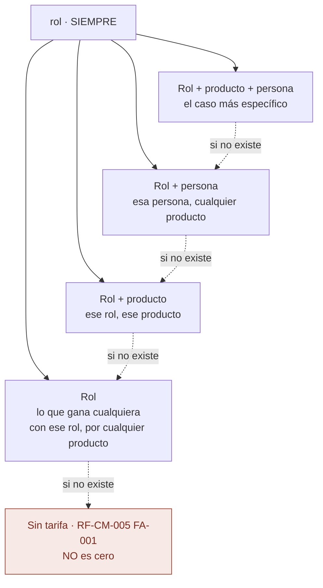
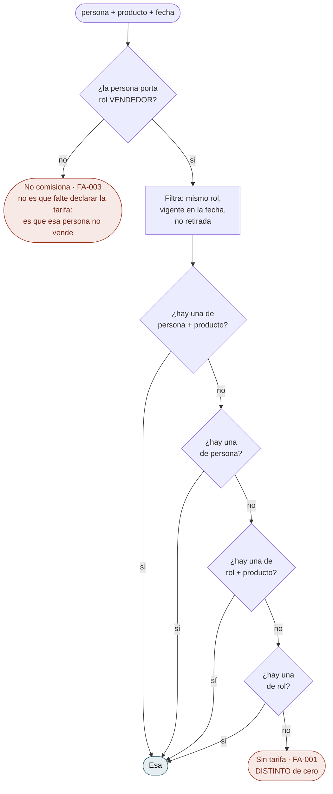
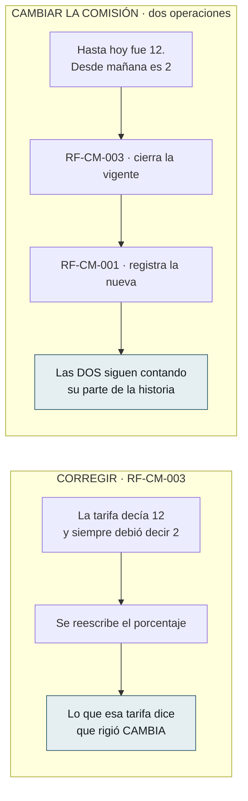
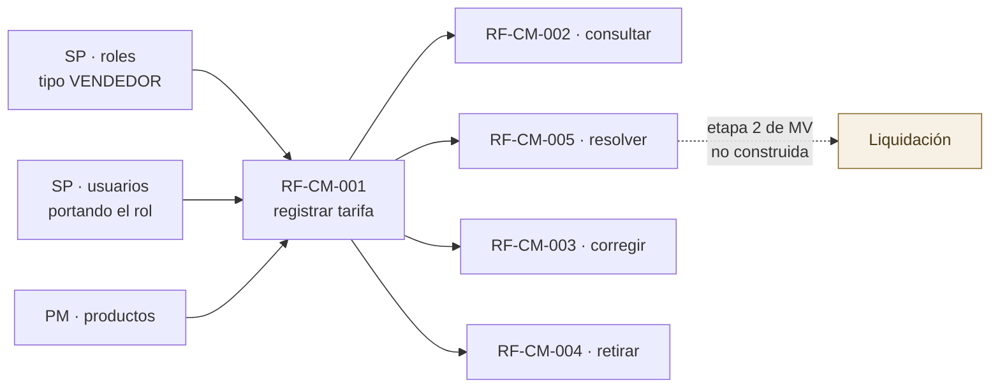

# Flujos del Módulo — `CM` Comisiones

| Campo | Valor |
|---|---|
| Módulo | `CM` — Comisiones |
| Versión | 0.1.0 |
| Estado | **Borrador** |
| Responsable | Bonilla Diaz William Steven |
| Fecha de creación | 01-09-2026 |
| Última actualización | 01-09-2026 |

!!! info "Qué va en este documento"

    La vista de conjunto de los **cinco requerimientos** de `CM`: cómo se encadenan, qué debe existir antes de qué, y sobre todo **cómo se elige una tarifa entre varias**, que es la mitad del módulo y la única parte que un diagrama explica mejor que un párrafo.

    No define comportamiento. Todo lo que aquí se dibuja está declarado en las tripletas de `docs/specs/cm/`; este documento solo lo hace visible. Ante cualquier discrepancia, **manda la spec**.

    El detalle de cada caso, paso a paso y con sus rechazos, está en [Flujos por caso](flujos-por-caso.md).

---

## 1. Los cuatro grados, y por qué la ausencia es la que manda

Una tarifa asocia un **rol vendedor** con un **porcentaje**. Que además acote un producto, una persona, las dos cosas o ninguna es lo que produce sus cuatro grados.

**No hay un campo que diga «para todos», y esa ausencia es deliberada.** Una tarifa sin persona es la de todos los de ese rol; una sin producto, la de todo el catálogo. Un campo aparte podría contradecir a la clave —«para todos» con una persona declarada— y esa contradicción **no la detecta nada**.

**El rol es obligatorio incluso en una excepción de persona**, y no es redundante: la tarifa dice «esta persona, **en este rol**, cobra esto». Sin el rol, una excepción sobreviviría a que la persona dejara de ser vendedora y seguiría aplicándose.

---

## 2. La precedencia, que es la regla que hace que los grados signifiquen algo

`RN-CM-004`. **Vive en un solo sitio** —la sentencia de `RF-CM-005`— y no en cada consumidor.

**Los dos finales rojos no son errores, y no son el mismo.** «No comisiona» es que la persona no vende; «sin tarifa» es que vende y nadie declaró cuánto gana. La respuesta de `RF-CM-005` los distingue porque quien consuma esto va a pagar con esa cifra.

**Y ninguno de los dos es «cero».** Una tarifa de **cero por ciento** es una decisión declarada —«esto no comisiona»— y la única forma de exceptuar un producto a un rol que sí tiene tarifa por omisión (`RN-CM-007`). La ausencia es que nadie la tomó. Confundirlas haría **indistinguible lo pensado de lo olvidado**.

!!! important "El orden vive en el `ORDER BY`, no en el flujo de control"

    La implementación no escribe estos cuatro rombos: los resuelve en una sentencia, con `ORDER BY (user_id IS NOT NULL) DESC, (product_id IS NOT NULL) DESC` y `LIMIT 1`.

    **No es una optimización, es la defensa.** Si el orden viviera en el código, una refactorización podría alterarlo **sin que nada falle** — devolvería un porcentaje plausible, que es exactamente el error que este requerimiento existe para evitar.

---

## 3. Corregir no es cambiar, y confundirlos borra el pasado

Es la distinción que más consecuencias tiene del módulo, y la que un dibujo separa mejor que un párrafo.

**No hay un endpoint que haga las dos**, y es deliberado. Ahorraría una llamada y escondería que **la primera es la que decide hasta cuándo rigió lo anterior**, que es el dato que la liquidación va a leer.

**Y `RN-CM-006` obliga al orden**: no admite solapamiento, de modo que hay que cerrar antes de abrir.

---

## 4. Retirar no es cerrar

| | Retirar (`RF-CM-004`) | Cerrar la vigencia (`RF-CM-003`) |
|---|---|---|
| Qué dice | **No debió existir** | **Dejó de regir** |
| Cómo | Eliminación lógica con motivo | Poblar `valid_to` |
| Efecto en la resolución | Deja de aparecer **siempre**, también en el pasado | Sigue aplicando a las fechas que cubrió |

`RN-CM-005`: la fila **permanece** en los dos casos. Lo que se pagó tiene que seguir explicándose.

---

## 5. Qué debe existir antes de qué

**`CM` es el primer módulo del sistema que depende de dos.** De `SP` toma el rol —para exigir que sea de tipo `VENDEDOR`— y la persona; de `PM`, el producto.

**Y la flecha punteada es todo lo que este módulo no hace.** `CM` declara **cuánto** se paga; **calcular y liquidar** es la otra mitad del área. Hasta el 01-09-2026 no se podía construir porque «no hay sobre qué calcular»; con `MV` ya lo hay, y la liquidación es su **etapa 2**.

---

## 6. Lo que el dibujo dejó a la vista

| # | Observación | Dónde se resuelve |
|---|---|---|
| 1 | **`RF-CM-005` distingue tres respuestas donde un diseño descuidado daría una.** «No comisiona», «sin tarifa» y «cero por ciento» acaban las tres en «no se paga nada», y son cosas distintas: la primera es del actor, la segunda es un olvido y la tercera una decisión | `spec.md` §9 de `RF-CM-005`, `FA-001` a `FA-003` |
| 2 | **`RN-CM-003` es la mitad que se olvida.** Que la persona de una excepción **porte el rol** de la tarifa no falla al declararla: la fila queda ahí y **nunca se aplica**, en silencio | `EX-006` de `RF-CM-001` |
| 3 | **`RF-CM-001` tipifica siete excepciones y cuatro son de datos de otros módulos** —rol, producto y persona—. Es el precio de ser el primer módulo que depende de dos, y no se puede acortar: las tres se comprueban contra puertos publicados, no contra tablas ajenas | `EX-001` a `EX-006` |
| 4 | **El no solapamiento es la única regla del módulo que está en el motor**, y las otras tres críticas no. No es incoherencia: `RN-CM-006` solo mira su propia tabla y **es la única que dos peticiones simultáneas pueden burlar** | `requirements/cm.md` §7.2 |
| 5 | **`RF-CM-002` filtra por persona y devuelve las declaradas PARA esa persona, no las que le aplican.** Son dos preguntas distintas y la segunda es `RF-CM-005`. Quien las confunda verá una lista vacía y concluirá que nadie comisiona | `spec.md` §4.2 de `RF-CM-002` |

---

## 7. Control de cambios

| Versión | Fecha | Cambio | Responsable |
|---|---|---|---|
| 0.1.0 | 01-09-2026 | Creación. `CM` era, junto a `PM`, uno de los dos módulos sin documentos de flujo. Se dibujan los **cinco requerimientos** y las tres cosas que la prosa explicaba peor: **los cuatro grados** y por qué la ausencia es la que da el alcance; **la precedencia de `RN-CM-004`**, con sus dos finales que no son errores ni son el mismo; y la diferencia entre **corregir y cambiar la comisión**, que es la que borra el pasado cuando se confunde. §6 recoge cinco observaciones que el dibujo dejó a la vista. | Responsable técnico |
