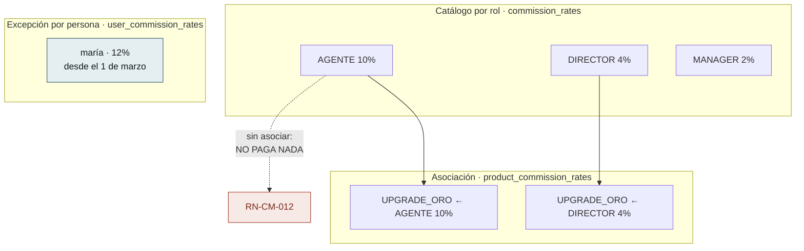
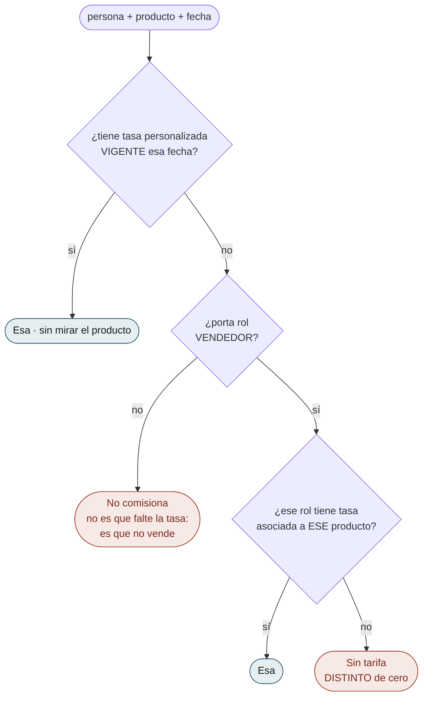
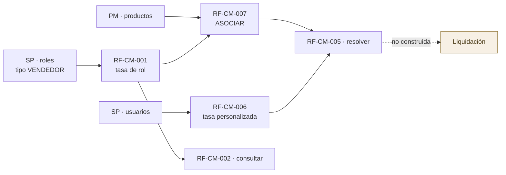

# Flujos del Módulo — `CM` Comisiones

| Campo | Valor |
|---|---|
| Módulo | `CM` — Comisiones |
| Versión | 0.2.0 |
| Estado | **Borrador** |
| Responsable | Bonilla Diaz William Steven |
| Fecha de creación | 01-09-2026 |
| Última actualización | 01-09-2026 |

!!! danger "Este documento describe el modelo ANTERIOR y está a medio rehacer"

    `CM` se rediseñó el 01-09-2026 (`requirements/cm.md` v0.4.0): los cuatro grados desaparecieron, el producto salió a una tabla de asociación y las tasas de rol perdieron la vigencia.

    Lo que sigue **está reescrito**; los diagramas por caso de `flujos-por-caso.md` **todavía no**.

---

## 1. Las dos piezas, y en qué no se parecen

**La ausencia cambió de significado, y es lo que más fácil se lee mal.** En el modelo anterior una tasa sin producto valía para **todos**; ahora **no rige hasta que se la asocia**. Una tasa creada y no asociada **parece configurada y no paga nada**, y eso no falla: se descubre liquidando.

**La personalizada no está en ese circuito.** No se asocia a productos (`RN-CM-014`) y **no lleva rol**: quien la tiene gana lo mismo venda lo que venda.

---

## 2. La resolución, que ahora son dos niveles y no cuatro

**Una pregunta y una respuesta de reserva.** Frente a los cuatro grados anteriores, la precedencia se lee de un vistazo — y sigue viviendo **en un solo sitio**, no en cada consumidor.

**Los dos finales rojos siguen sin ser el mismo, y ninguno es cero.** «No comisiona» es que la persona no vende; «sin tarifa» es que vende y nadie asoció una tasa a ese producto para su rol. Y el **cero por ciento** es una decisión declarada —«este producto no paga a este rol»— que hoy solo puede expresarse **asociando** una tasa de cero. Confundirlos haría **indistinguible lo pensado de lo olvidado**.

---

## 3. Lo que se ganó y lo que se perdió al simplificar

| | |
|---|---|
| **Se ganó** | La precedencia cabe en dos preguntas · Una tasa se reutiliza en varios productos sin duplicarse · El `EXCLUDE` vuelve a caber en una tabla, y el resto lo cierra una clave primaria |
| **Se perdió** | **El historial de las tasas de rol** · La protección de `RN-CM-003`, que impedía que una excepción sobreviviera a que la persona dejara de vender · La tarifa por omisión del rol |

!!! danger "Corregir un porcentaje reescribe lo que rigió siempre"

    Las tasas de rol **no tienen vigencia**. No hay dos filas contando su parte de la historia: hay una que ahora dice otra cosa. Pasar `AGENTE` de 10 a 12 **borra el 10**.

    Lo único que preservaría el pasado es que **la liquidación copie el porcentaje que aplicó** (`RN-CM-008`) — y esa liquidación **no existe**. Hoy, cambiar una tasa borra el pasado y no queda forma de saberlo.

## 4. Qué debe existir antes de qué
 

**`CM` es el primer módulo del sistema que depende de dos.** De `SP` toma el rol —para exigir que sea de tipo `VENDEDOR`— y la persona; de `PM`, el producto.

**Y la flecha punteada es todo lo que este módulo no hace.** `CM` declara **cuánto** se paga; **calcular y liquidar** es la otra mitad del área. **Y sigue sin poderse construir**: «no hay sobre qué calcular», porque ninguna tabla de ventas existe todavía.

---

## 5. Lo que el dibujo dejó a la vista

| # | Observación | Dónde se resuelve |
|---|---|---|
| 1 | **`RF-CM-005` distingue tres respuestas donde un diseño descuidado daría una.** «No comisiona», «sin tarifa» y «cero por ciento» acaban las tres en «no se paga nada», y son cosas distintas: la primera es del actor, la segunda es un olvido y la tercera una decisión | `spec.md` §9 de `RF-CM-005`, `FA-001` a `FA-003` |
| 2 | **`RN-CM-003` es la mitad que se olvida.** Que la persona de una excepción **porte el rol** de la tarifa no falla al declararla: la fila queda ahí y **nunca se aplica**, en silencio | `EX-006` de `RF-CM-001` |
| 3 | **`RF-CM-001` tipifica siete excepciones y cuatro son de datos de otros módulos** —rol, producto y persona—. Es el precio de ser el primer módulo que depende de dos, y no se puede acortar: las tres se comprueban contra puertos publicados, no contra tablas ajenas | `EX-001` a `EX-006` |
| 4 | **El no solapamiento es la única regla del módulo que está en el motor**, y las otras tres críticas no. No es incoherencia: `RN-CM-006` solo mira su propia tabla y **es la única que dos peticiones simultáneas pueden burlar** | `requirements/cm.md` §7.2 |
| 5 | **`RF-CM-002` filtra por persona y devuelve las declaradas PARA esa persona, no las que le aplican.** Son dos preguntas distintas y la segunda es `RF-CM-005`. Quien las confunda verá una lista vacía y concluirá que nadie comisiona | `spec.md` §4.2 de `RF-CM-002` |

---

## 6. Control de cambios

| Versión | Fecha | Cambio | Responsable |
|---|---|---|---|
| 0.1.0 | 01-09-2026 | Creación. `CM` era, junto a `PM`, uno de los dos módulos sin documentos de flujo. Se dibujan los **cinco requerimientos** y las tres cosas que la prosa explicaba peor: **los cuatro grados** y por qué la ausencia es la que da el alcance; **la precedencia de `RN-CM-004`**, con sus dos finales que no son errores ni son el mismo; y la diferencia entre **corregir y cambiar la comisión**, que es la que borra el pasado cuando se confunde. §6 recoge cinco observaciones que el dibujo dejó a la vista. | Responsable técnico |
| 0.2.0 | 01-09-2026 | **Reescrito tras el rediseño de `CM`** (`requirements/cm.md` v0.4.0). Los cuatro grados desaparecen y el documento pasa a dibujar **dos piezas que no se parecen** —el catálogo por rol y la excepción por persona— más la **asociación**, que es lo único que pone una tasa en vigor. §1 marca lo que más fácil se lee mal: **la ausencia cambió de significado**, y una tasa sin asociar ya no vale para todos sino para ninguno. §2 dibuja la resolución en **dos niveles** en vez de cuatro. §3 es nueva y enfrenta lo que se perdió al simplificar — sobre todo el **historial de las tasas de rol**: corregir un porcentaje reescribe lo que rigió siempre, y lo único que lo preservaría es una liquidación que **no existe**. Los diagramas de `flujos-por-caso.md` **siguen describiendo el modelo anterior** y se avisa en cabecera. | Responsable técnico |
