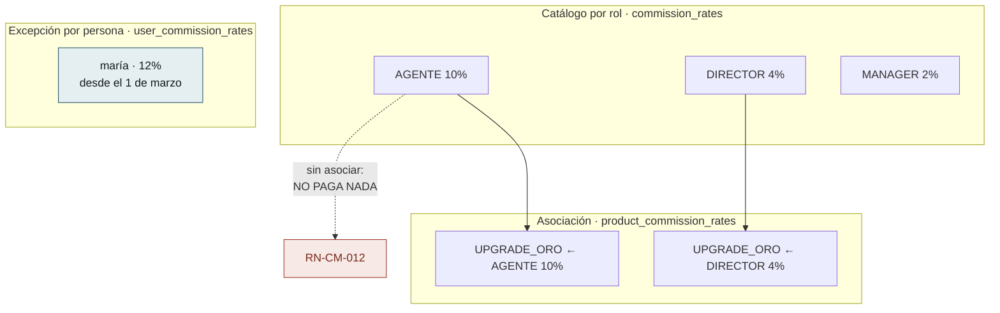
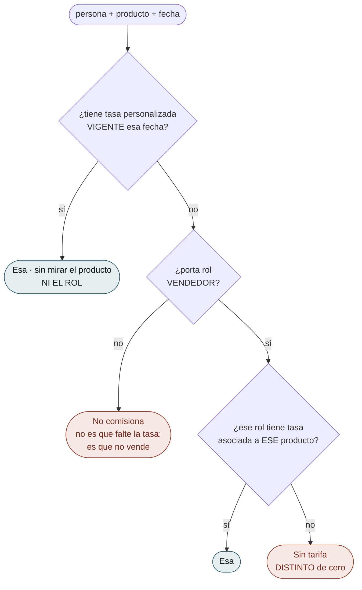
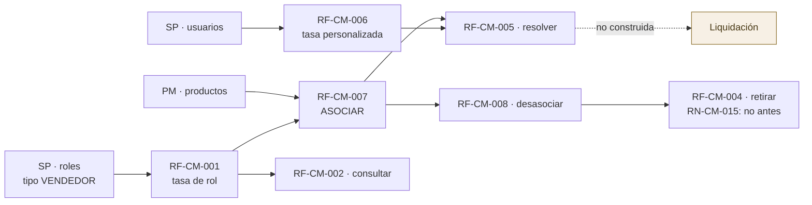

# Flujos del Módulo — `CM` Comisiones

| Campo | Valor |
|---|---|
| Módulo | `CM` — Comisiones |
| Versión | 0.3.0 |
| Estado | **Borrador** |
| Responsable | Bonilla Diaz William Steven |
| Fecha de creación | 01-09-2026 |
| Última actualización | 02-09-2026 |

!!! warning "Este documento está al día; `flujos-por-caso.md` NO"

    `CM` se rediseñó el 01-09-2026 (`requirements/cm.md` v0.4.0) y se **construyó** el 02-09-2026 (v0.5.0): los cuatro grados desaparecieron, el producto salió a una tabla de asociación y las tasas de rol perdieron la vigencia.

    Lo que sigue describe el modelo **vigente y construido**. Los diagramas por caso de [`flujos-por-caso.md`](flujos-por-caso.md) **siguen describiendo el modelo anterior** y no deben leerse como referencia.

---

## 1. Las dos piezas, y en qué no se parecen

**La ausencia cambió de significado, y es lo que más fácil se lee mal.** En el modelo anterior una tasa sin producto valía para **todos**; ahora **no rige hasta que se la asocia**. Una tasa creada y no asociada **parece configurada y no paga nada**, y eso no falla: se descubre liquidando.

**La personalizada no está en ese circuito.** No se asocia a productos (`RN-CM-014`) y **no lleva rol**: quien la tiene gana lo mismo venda lo que venda.

---

## 2. La resolución, que ahora son dos niveles y no cuatro

**Una pregunta y una respuesta de reserva.** Frente a los cuatro grados anteriores, la precedencia se lee de un vistazo — y sigue viviendo **en un solo sitio**, no en cada consumidor: es un `UNION ALL` de dos ramas con la prioridad en el `ORDER BY`, y no dos consultas encadenadas en Java. Dos consultas habrían dado el mismo resultado hoy y habrían puesto la regla en un `if`, donde nada la protege de que alguien invierta el orden mientras arregla otra cosa.

!!! danger "El primer rombo va ANTES que el rol, y al construirlo se vio lo que eso significa"

    Que la personalizada se pregunte primero **no es un detalle de eficiencia**: decide que **quien ya no vende cobra igual**. Su tasa no lleva rol desde el 01-09-2026, de modo que nada la ata a que su titular siga siendo vendedor.

    `cm.md` §5.3 lo describía como que la excepción «no falla — se queda callada hasta que alguien la mira». **Al construirlo resultó no ser callada: sigue pagando.** La consecuencia visible es que `roleId` puede llegar **nulo** junto a `outcome: RESUELTA`, y eso no es una incoherencia de la respuesta — es esta rama.

**Los dos finales rojos siguen sin ser el mismo, y ninguno es cero.** «No comisiona» es que la persona no vende; «sin tarifa» es que vende y nadie asoció una tasa a ese producto para su rol. Y el **cero por ciento** es una decisión declarada —«este producto no paga a este rol»— que hoy solo puede expresarse **asociando** una tasa de cero. Confundirlos haría **indistinguible lo pensado de lo olvidado**.

---

## 3. Lo que se ganó y lo que se perdió al simplificar

| | |
|---|---|
| **Se ganó** | La precedencia cabe en dos preguntas · Una tasa se reutiliza en varios productos sin duplicarse · El `EXCLUDE` vuelve a caber en una tabla, y el resto lo cierra una clave primaria |
| **Se perdió** | **El historial de las tasas de rol** · La protección de `RN-CM-003`, que impedía que una excepción sobreviviera a que la persona dejara de vender · La tarifa por omisión del rol |

!!! danger "Corregir un porcentaje reescribe lo que rigió siempre"

    Las tasas de rol **no tienen vigencia**. No hay dos filas contando su parte de la historia: hay una que ahora dice otra cosa. Pasar `AGENTE` de 10 a 12 **borra el 10**.

    Lo único que preservaría el pasado es que **la liquidación copie el porcentaje que aplicó** (`RN-CM-008`) — y esa liquidación **no existe**. Hoy, cambiar una tasa borra el pasado y no queda forma de saberlo.

## 4. Qué debe existir antes de qué
 

**La flecha de `RF-CM-008` a `RF-CM-004` es la única de este diagrama que no es una dependencia de datos sino una regla** (`RN-CM-015`, nacida al construir el módulo): una tasa asociada **no se retira**. La asociación no tiene retiro lógico y sobreviviría apuntando a una fila que la resolución ya no mira, de modo que **el producto dejaría de comisionar sin que nada lo dijera**. Es la silenciosidad de `RN-CM-012` llegando por la puerta de atrás.

**`CM` es el primer módulo del sistema que depende de dos.** De `SP` toma el rol —para exigir que sea de tipo `VENDEDOR`— y la persona; de `PM`, el producto.

**Y la flecha punteada es todo lo que este módulo no hace.** `CM` declara **cuánto** se paga; **calcular y liquidar** es la otra mitad del área. **Y sigue sin poderse construir**: «no hay sobre qué calcular», porque ninguna tabla de ventas existe todavía.

---

## 5. Lo que el dibujo dejó a la vista

| # | Observación | Dónde se resuelve |
|---|---|---|
| 1 | **`RF-CM-005` distingue tres respuestas donde un diseño descuidado daría una.** «No comisiona», «sin tarifa» y «cero por ciento» acaban las tres en «no se paga nada», y son cosas distintas: la primera es del actor, la segunda es un olvido y la tercera una decisión | `spec.md` §9 de `RF-CM-005`, `FA-001` a `FA-003` |
| 2 | **`RF-CM-001` pasó de cuatro verificaciones a una.** El alta comprobaba el rol, el producto, la persona y el solapamiento; ahora solo el rol. Las otras tres no se relajaron: **se mudaron** —el producto a `RF-CM-007`, la persona a `RF-CM-006` y el solapamiento a la vigencia, que esta tabla ya no tiene | `requirements/cm.md` §4 |
| 3 | **Ahora son DOS las reglas que viven en el motor, y por el mismo motivo.** `RN-CM-006` —ningún día cubierto dos veces— y `RN-CM-013` —un porcentaje por rol y producto— son **las únicas que dos peticiones simultáneas pueden burlar**, y ninguna de las dos se comprueba en el caso de uso: la primera es un `EXCLUDE`, la segunda **es la clave primaria de la asociación** | `requirements/cm.md` §7.4 |
| 4 | **`RN-CM-015` no salió del diseño sino de construirlo**, y es la única así del módulo. Cubre la silenciosidad de `RN-CM-012` llegando al revés: retirar una tasa asociada deja la asociación viva apuntando a una fila muerta, y **el producto deja de pagar sin que nada lo diga** | `requirements/cm.md` §5.2 |
| 5 | **`RF-CM-002` filtra por persona y devuelve las declaradas PARA esa persona, no las que le aplican.** Son dos preguntas distintas y la segunda es `RF-CM-005`. Quien las confunda verá una lista vacía y concluirá que nadie comisiona | `spec.md` §4.2 de `RF-CM-002` |
| 6 | **Lo que `cm.md` §5.3 llamaba «se queda callada» resultó ser «sigue pagando».** Una tasa personalizada sobrevive a que su titular deje de vender **y cobra**, porque la resolución la consulta antes que el rol. Es consecuencia declarada de haberle quitado el rol, pero la prosa la describía más suave de lo que es | §2 de este documento |

---

## 6. Control de cambios

| Versión | Fecha | Cambio | Responsable |
|---|---|---|---|
| 0.1.0 | 01-09-2026 | Creación. `CM` era, junto a `PM`, uno de los dos módulos sin documentos de flujo. Se dibujan los **cinco requerimientos** y las tres cosas que la prosa explicaba peor: **los cuatro grados** y por qué la ausencia es la que da el alcance; **la precedencia de `RN-CM-004`**, con sus dos finales que no son errores ni son el mismo; y la diferencia entre **corregir y cambiar la comisión**, que es la que borra el pasado cuando se confunde. §6 recoge cinco observaciones que el dibujo dejó a la vista. | Responsable técnico |
| 0.2.0 | 01-09-2026 | **Reescrito tras el rediseño de `CM`** (`requirements/cm.md` v0.4.0). Los cuatro grados desaparecen y el documento pasa a dibujar **dos piezas que no se parecen** —el catálogo por rol y la excepción por persona— más la **asociación**, que es lo único que pone una tasa en vigor. §1 marca lo que más fácil se lee mal: **la ausencia cambió de significado**, y una tasa sin asociar ya no vale para todos sino para ninguno. §2 dibuja la resolución en **dos niveles** en vez de cuatro. §3 es nueva y enfrenta lo que se perdió al simplificar — sobre todo el **historial de las tasas de rol**: corregir un porcentaje reescribe lo que rigió siempre, y lo único que lo preservaría es una liquidación que **no existe**. Los diagramas de `flujos-por-caso.md` **siguen describiendo el modelo anterior** y se avisa en cabecera. | Responsable técnico |
| 0.3.0 | 02-09-2026 | **El módulo se construye, y el dibujo gana dos cosas que no se veían diseñándolo.** §2 marca que el primer rombo —la personalizada— va **antes que el rol**, y que eso no es eficiencia sino una decisión: **quien ya no vende cobra igual**. Lo que este documento y `cm.md` §5.3 describían como que la excepción «se queda callada» resultó ser **«sigue pagando»**, y se ve en que `roleId` llega nulo junto a `RESUELTA`. §4 añade la flecha de `RF-CM-008` a `RF-CM-004`, que es **la única del diagrama que no es una dependencia de datos sino una regla** (`RN-CM-015`): una tasa asociada no se retira, porque la asociación sobreviviría apuntando a una fila muerta. Y se anota que la precedencia se resuelve con un `UNION ALL` y no con dos consultas encadenadas — dos consultas habrían dado el mismo resultado hoy y habrían puesto la regla en un `if`. El aviso de cabecera se corrige: **este documento está al día**; `flujos-por-caso.md` no. | Responsable técnico |
