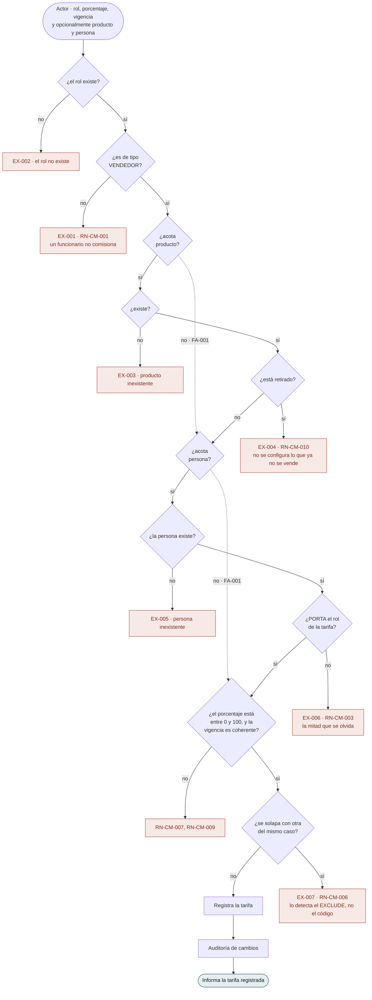
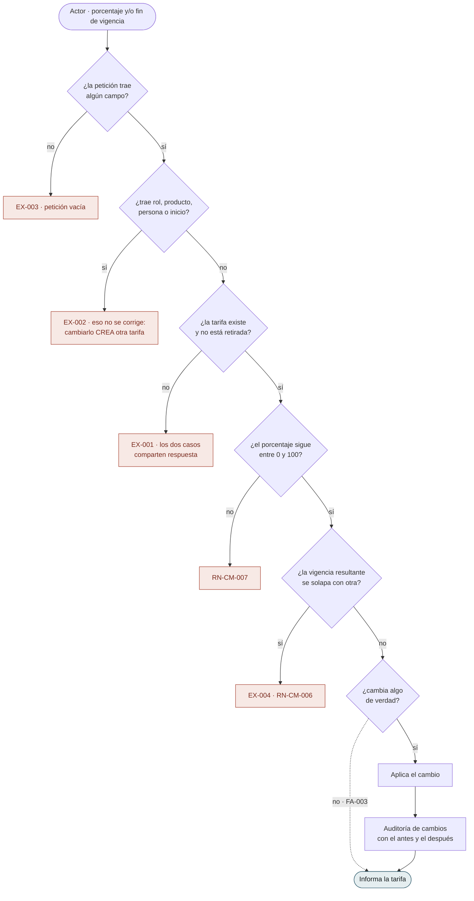
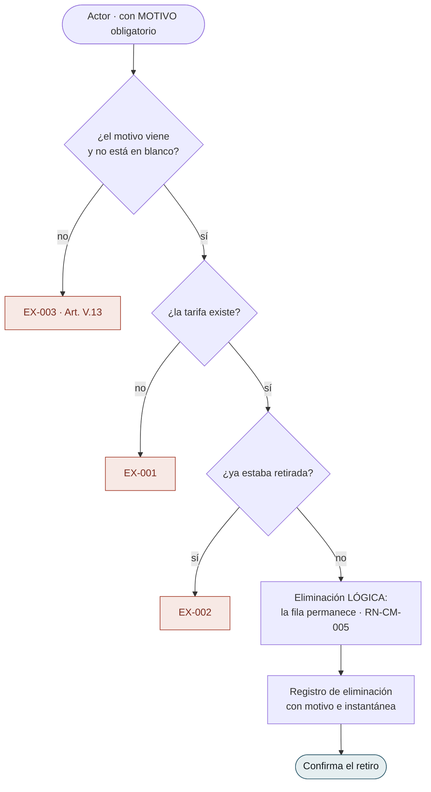
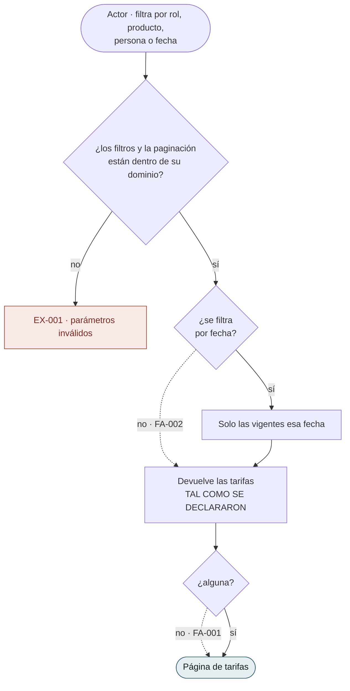
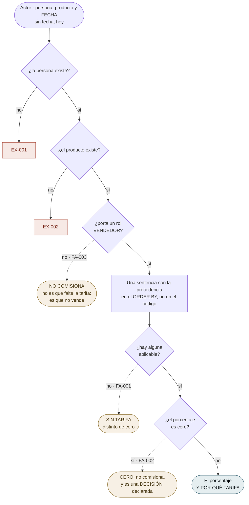

# Flujos por caso de uso — `CM` Comisiones

| Campo | Valor |
|---|---|
| Módulo | `CM` — Comisiones |
| Versión | 0.1.1 |
| Estado | **Borrador** |
| Responsable | Bonilla Diaz William Steven |
| Fecha de creación | 01-09-2026 |
| Última actualización | 01-09-2026 |

!!! info "Qué va en este documento"

    Un diagrama por caso de uso: qué puede hacer el actor, qué verifica el sistema en cada paso y por dónde sale la operación cuando una verificación falla.

    Cada diagrama es la transcripción literal de las **§8 Flujo principal**, **§9 Flujos alternativos** y **§10 Excepciones** de su spec. No añade comportamiento. Ante cualquier discrepancia, **manda la spec**.

!!! danger "Estos diagramas describen el modelo ANTERIOR"

    `CM` se rediseñó el 01-09-2026 (`requirements/cm.md` v0.4.0): los cuatro grados desaparecieron, el producto salió a una tabla de asociación y las tasas de rol perdieron la vigencia.

    **Lo que sigue todavía no está rehecho.** La vista de conjunto sí lo está, en [Flujos del módulo](flujos-del-modulo.md). Ante cualquier discrepancia, manda `requirements/cm.md`.

!!! note "Convención de los diagramas"

    | Forma | Significado |
    |---|---|
    | Cápsula | Acción del actor, o respuesta final del sistema |
    | Rombo | Verificación del sistema |
    | Rectángulo | Paso del sistema que produce efecto |
    | Recuadro rojo | Rechazo tipificado, con su identificador `EX-00n` |
    | Línea punteada | Flujo alternativo `FA-00n`: no es error |

---

## 1. Tarifas

### `RF-CM-001` · Registrar una tarifa de comisión

Una sola alta para los cuatro grados. El grado sale de **qué se omite**.

**`EX-006` es la excepción que este módulo existe para no olvidar.** Una excepción es «esta persona, **en este rol**, cobra distinto»; si la persona no porta ese rol, la fila **nunca se aplicará y nadie se enterará**, porque no falla: se queda callada.

**`EX-007` la detecta el motor, no el caso de uso.** La sostiene un `EXCLUDE USING gist` sobre la combinación y el rango de fechas, y **tiene que estar ahí**: es la única de las reglas críticas que dos peticiones simultáneas pueden burlar, y una comprobación previa no sobrevive a la concurrencia.

**`FA-002` y `FA-003` no cambian el flujo**, solo lo que significa el resultado: la excepción de una persona y la primera tarifa del sistema recorren estos mismos pasos.

---

### `RF-CM-003` · Corregir una tarifa

Solo dos campos se corrigen. Que sean solo dos es la mitad del requerimiento.

**`EX-002` es la frontera del requerimiento dibujada.** Cambiar el rol, el producto o la persona **no corrige una tarifa: crea otra**. Lo corregible es lo que se declaró mal —el porcentaje— y hasta cuándo rige.

**`FA-001` y `FA-002` —cerrar y reabrir una vigencia— son este mismo camino.** No tienen pasos propios: son el resultado de poblar o vaciar `valid_to`, y la comprobación de solapamiento es la que decide si se admiten.

**Corregir el porcentaje reescribe lo que esa tarifa dice que rigió** (`RN-CM-008`). Lo ya liquidado conserva el suyo, y garantizarlo es obligación de la liquidación —que guardará su propio porcentaje—, no de esta tabla.

---

### `RF-CM-004` · Retirar una tarifa

**Retirar no es cerrar la vigencia**, y `RN-CM-005` lo dice en una frase: **se retira lo que no debió existir, se cierra lo que dejó de regir**. La primera desaparece de la resolución también en el pasado; la segunda sigue aplicando a las fechas que cubrió.

**La fila permanece**, para que una liquidación pasada siga resolviendo con qué porcentaje se pagó.

---

## 2. Consultar

### `RF-CM-002` · Consultar las tarifas

**Devuelve filas, no resuelve nada.** Es la diferencia con `RF-CM-005` y conviene tenerla presente: **filtrar por persona devuelve las tarifas declaradas PARA esa persona, no las que le aplican**. Quien las confunda verá una lista vacía —lo normal, porque las excepciones por persona son raras— y concluirá que nadie comisiona.

**Incluye el historial**: las vencidas viajan junto a las vigentes salvo que se filtre por fecha. Es lo que hace de esta consulta el registro de lo que se pagó, y no la foto de lo que se paga hoy.

---

### `RF-CM-005` · Consultar la comisión efectiva

El submódulo entero en un caso de uso. **Aquí es donde vive `RN-CM-004`.**

**Tres finales ámbar que acaban todos en «no se paga nada» y son cosas distintas**, y distinguirlos es media razón de existir del requerimiento:

- **No comisiona** — la persona no vende. Es una respuesta sobre el actor.
- **Sin tarifa** — vende, y **nadie declaró** cuánto gana. Es un olvido.
- **Cero por ciento** — alguien decidió que ese caso no comisiona. Es lo contrario de un olvido, y la única forma de exceptuar un producto a un rol que sí tiene tarifa por omisión.

Devolver cero en los tres haría **indistinguible lo pensado de lo olvidado**, y quien consuma esto va a pagar con esa cifra.

**Devuelve el porcentaje y POR QUÉ TARIFA**, no solo el número. Sin eso, una discrepancia de liquidación es imposible de explicar.

**El producto retirado se resuelve con normalidad.** Preguntar qué se pagaba por algo que ya no se vende es legítimo, y es la consulta que una liquidación atrasada necesita.

---

## 3. Lo que el dibujo dejó a la vista

| # | Observación | Dónde se resuelve |
|---|---|---|
| 1 | **`RF-CM-001` dibuja siete excepciones y cuatro miran datos de otros módulos.** Es el precio de ser el primer módulo que depende de dos, y no se puede acortar: las tres validaciones cruzan la frontera por puertos publicados | `EX-001` a `EX-006` |
| 2 | **`EX-004` de `RF-CM-001` y `RN-CM-005` son las dos mitades de la misma idea**, y solo puestas juntas se ve: **el pasado se conserva y el futuro no se configura**. No se declara una tarifa nueva sobre un producto retirado, y las que ya existían permanecen | `RN-CM-005`, `RN-CM-010` |
| 3 | **`RF-CM-003` es el único caso del módulo cuyo rechazo más probable —`EX-002`— no es un error del actor sino un malentendido del modelo.** Quien intenta cambiar el producto de una tarifa cree estar corrigiendo; está creando otra | `spec.md` §10 de `RF-CM-003` |
| 4 | **`RF-CM-005` no tiene ningún paso que escriba**, y es el único requerimiento del módulo del que eso puede decirse sin matices: las cuatro operaciones de tarifas escriben auditoría, y `RF-CM-002` también es de lectura pura | `plan.md` §7 de cada uno |
| 5 | **La fecha es un parámetro de entrada y no el reloj**, y por eso el diagrama la pone en la cápsula inicial. Es lo que permite reconstruir qué porcentaje regía en cualquier día pasado — que es exactamente lo que una liquidación atrasada hace | `spec.md` §6.1 de `RF-CM-005` |

---

## 4. Control de cambios

| Versión | Fecha | Cambio | Responsable |
|---|---|---|---|
| 0.1.0 | 01-09-2026 | Creación. Un diagrama por cada uno de los **cinco** casos de uso, transcritos de las §8, §9 y §10 de sus tripletas. El que más aporta es el de `RF-CM-005`: pone en el mismo dibujo **los tres finales que acaban en «no se paga nada» y son cosas distintas** —no comisiona, sin tarifa y cero por ciento—, que es la distinción que la prosa cuesta más de sostener. §3 recoge cinco observaciones que el dibujo dejó a la vista. | Responsable técnico |
| 0.1.1 | 01-09-2026 | Se marca en cabecera que **estos diagramas describen el modelo anterior**: el rediseño de `CM` de ese mismo día dejó obsoletos los cuatro grados, la precedencia de cuatro niveles y la columna de producto. No se rehacen todavía — se avisa, que es lo que impide que alguien los lea como si valieran. | Responsable técnico |
