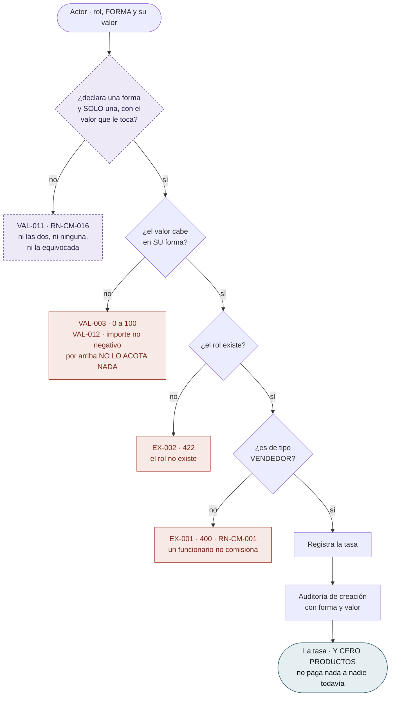
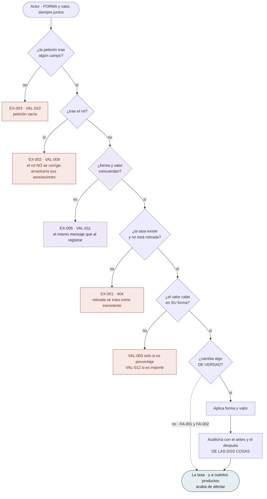
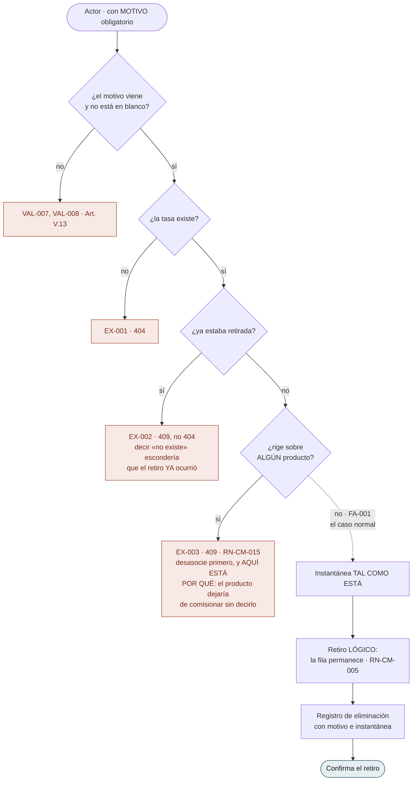
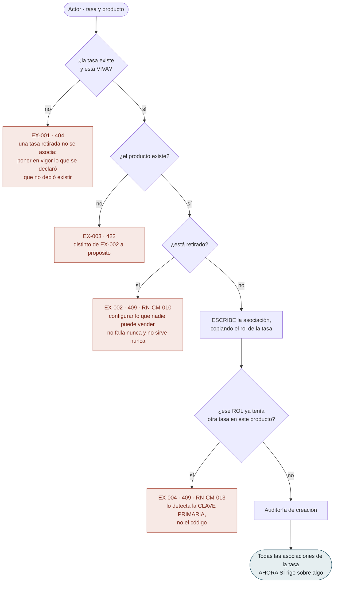
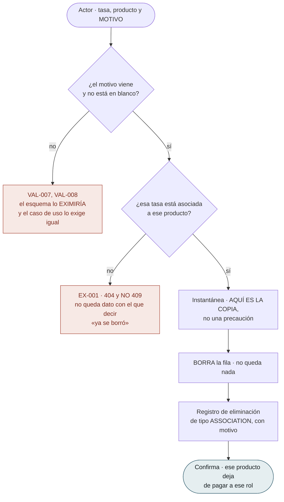
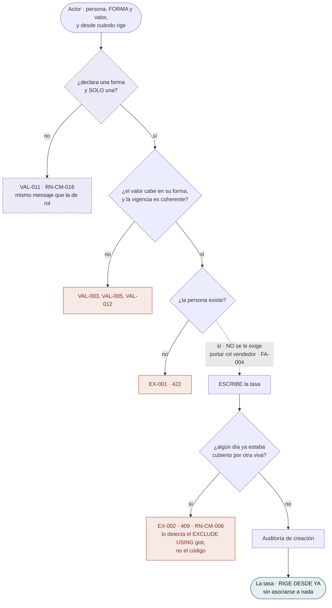
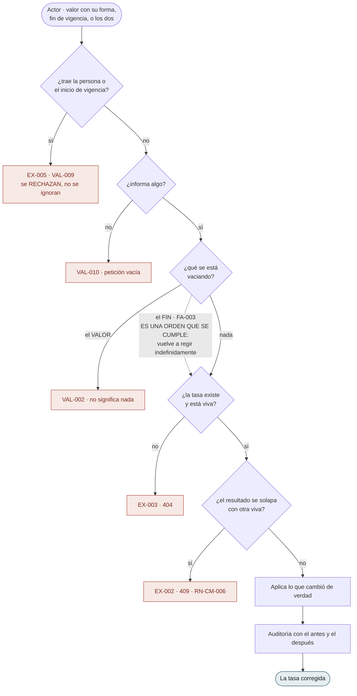
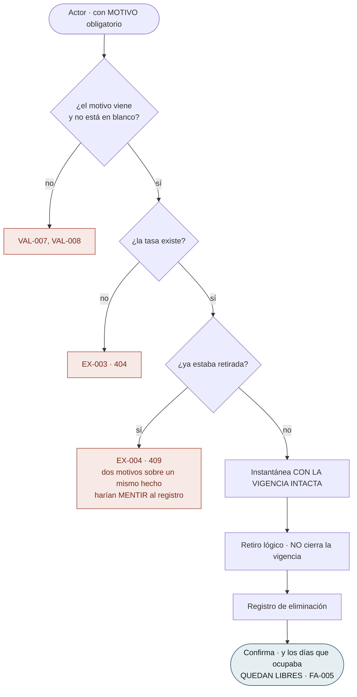
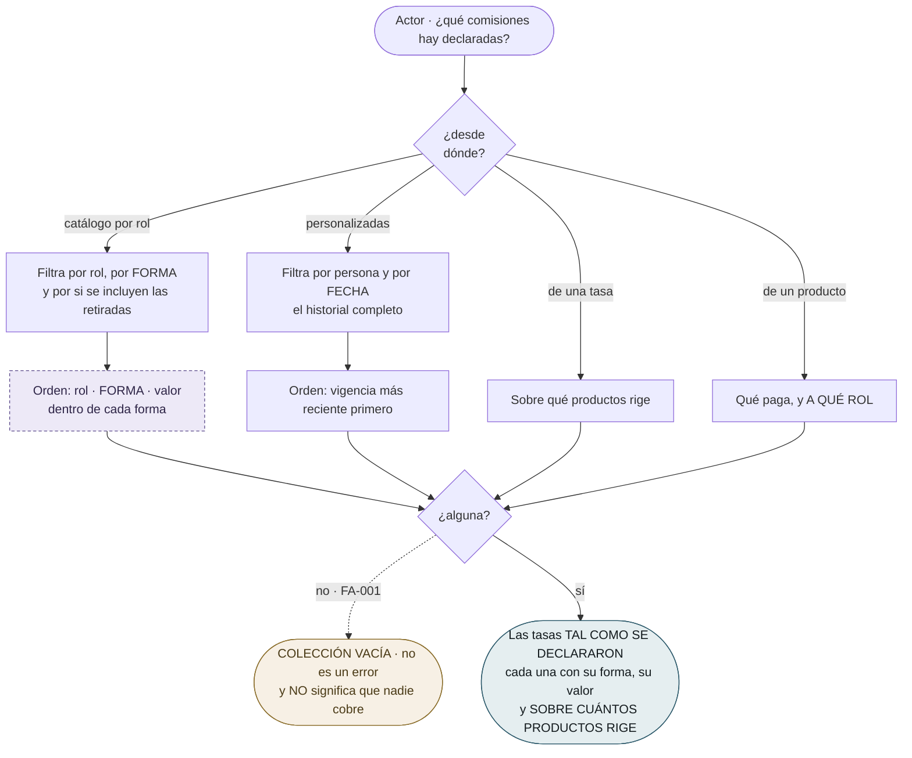
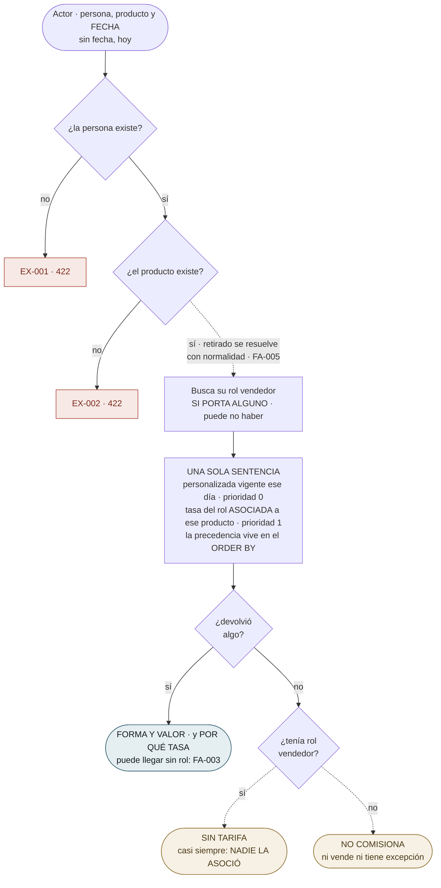

# Flujos por caso de uso — `CM` Comisiones

| Campo | Valor |
|---|---|
| Módulo | `CM` — Comisiones |
| Versión | 0.2.0 |
| Estado | **Borrador** |
| Responsable | Bonilla Diaz William Steven |
| Fecha de creación | 01-09-2026 |
| Última actualización | 02-09-2026 |

!!! info "Qué va en este documento"

    Un diagrama por caso de uso: qué puede hacer el actor, qué verifica el sistema en cada paso y por dónde sale la operación cuando una verificación falla.

    Cada diagrama es la transcripción literal de las **§8 Flujo principal**, **§9 Flujos alternativos** y **§10 Excepciones** de su spec. No añade comportamiento. Ante cualquier discrepancia, **manda la spec**.

!!! warning "Los diagramas mezclan lo construido y lo decidido, y lo dicen con el color"

    `CM` se rediseñó el 01-09-2026 (`cm.md` v0.4.0), se **construyó** el 02-09-2026, y ese mismo día el responsable del proyecto **devolvió el valor directo** (`cm.md` v0.7.0).

    Lo que el valor fijo añade **está decidido en las tripletas y no está construido**. En los diagramas va con **borde discontinuo morado**, de modo que el mismo dibujo sirve para leer el sistema de hoy —tapando esos nodos— y para construir el de mañana.

!!! note "Convención de los diagramas"

    | Forma | Significado |
    |---|---|
    | Cápsula | Acción del actor, o respuesta final del sistema |
    | Rombo | Verificación del sistema |
    | Rectángulo | Paso del sistema que produce efecto |
    | Recuadro rojo | Rechazo tipificado, con su identificador `EX-00n` |
    | Recuadro ámbar | Final que no es error y tampoco paga nada |
    | **Borde discontinuo morado** | **Decidido en la tripleta, sin construir** (el valor fijo) |
    | Línea punteada | Flujo alternativo `FA-00n`: no es error |

---

## 1. El catálogo por rol

Tres operaciones sobre `commission_rates`. **Ninguna de las tres pone nada en vigor**: eso lo hace §2.

### `RF-CM-001` · Registrar una tasa de comisión por rol

Dos campos hasta el 02-09-2026, cuatro desde entonces —de los que llegan tres—. **El alta más simple del módulo, y la que menos hace de lo que parece.**

**Este diagrama tenía siete rechazos y ahora tiene cuatro, y ninguno se relajó.** Producto inexistente, producto retirado, persona inexistente, persona sin el rol y solapamiento **no desaparecieron: se mudaron** — los cuatro primeros a §2, el último a §3. Se dice porque un diagrama más corto se lee como un sistema que comprueba menos.

**El final no es una cápsula cualquiera.** Dice **cero productos** porque sin ese número la respuesta de una tasa que paga y la de una que no serían idénticas. `RN-CM-012` no produce error en ningún sitio: **solo se ve aquí y en el listado.**

**El primer rombo no consulta nada.** `RN-CM-016` se decide mirando la propia petición, sin tocar ninguna otra fila, y por eso va antes que todo lo demás — enterarse de que la petición pedía algo imposible no debe costar una consulta.

!!! danger "Falta un rombo que un lector espera, y su ausencia es la regla"

    Nadie comprueba que un importe fijo **quepa en el precio de algo**. `RN-CM-018` declara que **por arriba no lo acota nada**, y aquí no podría: al registrar la tasa **no hay ningún producto** (`RN-CM-012`), de modo que no hay precio contra el que comparar.

    Una tasa de «10.000 fijos» sobre un catálogo de productos de 8.000 se registra sin advertencia, sin rechazo y sin nada. La defensa está en la liquidación, **que no existe**, y su forma será **rechazar y no recortar**.

---

### `RF-CM-003` · Corregir el valor de una tasa

Se llamaba «corregir el porcentaje». **Lo que se corrige es una pareja —forma y valor— y viaja entera.**

!!! danger "El rombo «¿cambia algo de verdad?» es el sitio donde este módulo se rompe en silencio"

    Compara el valor viejo con el nuevo, y hasta el 02-09-2026 comparaba **una cifra**. Estaba bien: `10.00` y `10.0000` son el mismo porcentaje, y tratarlos como iguales es lo que evita auditar correcciones que no corrigen nada (`FA-002`).

    **Con dos formas, esa misma comparación miente.** Pasar una tasa de `10 %` a `10` de importe fijo **cambia todo lo que paga**, y las dos cifras comparan iguales. El rombo sale por «no», el sistema **no escribe, no audita, no mueve la marca de modificación** — y devuelve éxito.

    La tasa se queda como estaba y quien la corrigió cree que la cambió. Es la razón de que `CA-CM-024` y `CA-CM-091` usen **los mismos números y pidan lo contrario**: cualquiera de las dos se satisface rompiendo la otra.

**`EX-002` sigue siendo la frontera del requerimiento dibujada**, y ahora con **un solo** inmutable donde había cuatro. El rol no se corrige porque cambiarlo **arrastra todas las asociaciones de la tasa** a un rol que nadie eligió. La forma **sí** se corrige, por decisión del responsable del proyecto del 02-09-2026: prohibirlo obligaría a desasociar cada producto, retirar y volver a asociar, y **durante esa secuencia esos productos no comisionan**.

**Corregir reescribe lo que esa tasa dice que rigió siempre** (`RN-CM-008`), porque estas tasas **no tienen vigencia**. Lo ya liquidado solo se salva si la liquidación copió lo que aplicó — y desde el valor fijo tiene que copiar **tres cosas**: la forma, el valor y **la moneda**, que no está en ninguna tabla de este módulo.

---

### `RF-CM-004` · Retirar una tasa de comisión

**Este diagrama no cambia con el valor fijo**, y merece decirse: retirar no mira lo que la tasa paga, solo si alguien lo está cobrando.

**`EX-003` es el rombo que nació de construir el módulo, no de diseñarlo.** `product_commission_rates` no tiene `deleted_at`: una asociación **sobreviviría** al retiro lógico de su tasa, apuntando a una fila muerta, y ese producto **dejaría de comisionar sin que nada fallara**. Una clave foránea no puede expresarlo —no distingue una fila viva de una lógicamente borrada—, y el borrado en cascada destruiría configuración que nadie pidió destruir. De modo que la regla vive en el caso de uso y **el coste se paga a la vista**: hay que desasociar producto a producto.

**Retirar no es cerrar una vigencia**, aunque estas tasas ya no tengan ninguna: **se retira lo que no debió existir, se cierra lo que dejó de regir.** La distinción sigue viva en §3, que es donde queda la vigencia.

---

## 2. La asociación, que es lo único que pone una tasa en vigor

Aquí es donde `RN-CM-012` deja de ser una frase. **Sin estas dos operaciones, todo lo de §1 es un catálogo que no paga nada a nadie.**

### `RF-CM-007` · Asociar una tasa de rol a un producto

**El rectángulo va ANTES del rombo, y es el único diagrama del módulo donde eso pasa.** No es un descuido del dibujo: comprobar antes de escribir sería una carrera, y `RN-CM-013` es una de las dos reglas del módulo que dos peticiones simultáneas pueden burlar. **Se escribe y se deja que la clave primaria hable.**

**Y la clave primaria es `(product_id, role_id)`, sin la tasa dentro.** Es lo que hace que el rombo diga «ese **rol**» y no «esa **tasa**»: con la tasa en la clave, dos tasas distintas del mismo rol cabrían las dos sobre el mismo producto y la regla no se sostendría. El mensaje del rechazo lo refleja — el conflicto es «este rol ya cobra por este producto», que puede ser con **otra** tasa, y decir «esta tasa ya está asociada» mandaría a buscar el problema donde no está.

**`FA-002` no dibuja nada y es la puerta de `RN-CM-011`.** Un producto puede pagar a varios roles —es el override de la cadena comercial— y **la suma de lo que pagan puede pasar de cien** sin que nada lo impida. Con el valor fijo el agujero **cambia de tamaño**: antes hacían falta tres niveles para pasarse del importe de la venta, ahora **basta uno**.

---

### `RF-CM-008` · Retirar la asociación de una tasa con un producto

**El único borrado físico del módulo.** Lo que queda después gobierna las tres decisiones del diagrama.

!!! danger "El primer rombo es la única operación del proyecto que ENDURECE una regla de auditoría"

    `ck_deletion_reason` **exime** de motivo a las eliminaciones de tipo asociación, y el criterio general es correcto: al perder un vínculo, las dos filas que unía siguen contándolo todo.

    **Aquí no.** La asociación **es** el hecho de que ese producto pagaba a ese rol, y al borrarla **no queda ninguna otra fila que lo diga**. El motivo se exige en el caso de uso, por encima de lo que el esquema permitiría — y quitar esa validación **no rompería ninguna restricción del motor**.

**`EX-001` es `404` y no `409`, al revés que los otros dos retiros del módulo.** Allí la fila permanece y por eso puede afirmarse «ya estaba retirada». Aquí no queda nada: el sistema **no puede distinguir** una asociación que nunca existió de una que se borró hace un minuto, e inventar un conflicto sería afirmar algo que no sabe.

**`FA-001` dibuja una ventana real.** Cambiar lo que un rol cobra por un producto son **dos operaciones** —esta y `RF-CM-007`—, y entre una y otra **ese producto no comisiona a ese rol**. Se acepta: una operación de sustitución escondería que se está tomando una decisión sobre lo que se paga.

---

## 3. La excepción por persona

La **única pieza del módulo con vigencia**, y por tanto **el único historial que le queda**.

### `RF-CM-006` · Registrar la tasa personalizada de una persona

**El final dice «rige desde ya» y el de `RF-CM-001` decía «cero productos».** Puestos uno al lado del otro se ve la diferencia entera entre las dos piezas: **una hay que ponerla en vigor y la otra nace en vigor.**

**`EX-002` la detecta el motor**, igual que `EX-004` de `RF-CM-007` y por el mismo motivo: es la otra de las dos reglas que dos peticiones simultáneas pueden burlar. Un `EXCLUDE USING gist` sobre la persona y el rango de fechas, **parcial sobre las vivas** para que retirar libere los días.

!!! danger "Un importe fijo aquí rige sobre TODO el catálogo, en todas sus monedas a la vez"

    Una tasa de rol en importe fijo se interpreta en la moneda de **los productos que alguien le asoció** (§2). El desconcierto está acotado a esa lista.

    **Esta no se asocia a nada** (`RN-CM-014`). «10.000 fijos» significa **diez mil de cada moneda que haya en el catálogo**, y su titular gana más o menos según qué venda, sin que nadie lo haya decidido así.

    No hay ningún rombo que lo advierta ni puede haberlo: darle moneda propia a la tasa y exigir coincidencia al asociar **no funciona aquí**, porque esta tasa **no tiene producto con el que coincidir**. Es el caso que hizo descartar esa salida para todo el módulo.

---

### `RF-CM-006` · Corregir una tasa personalizada

**Dos campos y dos comportamientos opuestos ante el mismo gesto.**

**El rombo «¿qué se está vaciando?» es el dibujo de una asimetría deliberada.** Vaciar el fin de vigencia **se obedece** —significa «rige indefinidamente»—; vaciar el valor **se rechaza** —no significa nada—. Son el mismo gesto sobre dos campos y el sistema hace lo contrario con cada uno, a propósito.

**Y esa asimetría se agranda con el valor fijo**: el fin de vigencia sigue parcheándose solo, mientras que **el valor y su forma pasan a viajar juntos o no viajar**. Parece una inconsistencia y no lo es — media forma vacía no significa nada, y una tasa sin fin sí.

**Cambiar de forma a partir de una fecha son DOS operaciones aquí**, y esta es la única pieza del módulo donde eso deja rastro: cerrar la vigente poniéndole fin, y registrar otra en la otra forma desde el día siguiente. Las dos filas conviven y **son el historial**. Corregir la forma de la tasa viva también funciona, y **no es lo mismo**: reescribe lo que esa tasa dijo durante toda su vigencia, incluidos los días ya pasados. Es la operación correcta para arreglar una equivocación y la equivocada para acordar un cambio.

---

### `RF-CM-006` · Retirar una tasa personalizada

**«No cierra la vigencia» es un paso escrito en negativo, y hace falta.** Cerrarla «para dejarlo ordenado» destruiría el dato de qué periodo cubría lo retirado. **Lo retirado no debió existir; lo vencido dejó de regir** — y solo lo segundo sigue explicando lo que se pagó.

**Por eso los días quedan libres.** La restricción de no solapamiento es **parcial sobre las vivas**: retirar una tasa permite declarar otra que cubra su periodo, que es exactamente lo que hace falta cuando la primera fue un error.

---

## 4. Leer

### `RF-CM-002` · Consultar las tasas de comisión

**Cuatro lecturas que responden a la misma pregunta desde cuatro sitios**, y ninguna sola la responde.

**Devuelve filas, no resuelve nada.** Filtrar las personalizadas por persona devuelve **las declaradas para ella**, no la que **le aplica** — quien las confunda verá una lista vacía, que es lo normal porque las excepciones son raras, y concluirá que nadie comisiona.

**«Sobre cuántos productos rige» es el dato que hace visible a `RN-CM-012`**, la única regla del módulo que no produce error en ninguna parte. Sin ese número, el listado sería idéntico para una tasa que paga y para una que no.

!!! danger "El orden del catálogo dejó de poder ordenar, y es lo único de esta versión que no es aditivo"

    Era «por rol y, dentro de cada rol, **de mayor a menor porcentaje**». Con dos formas, ese orden **compara cosas que no admiten un “mayor que”**: cuál paga más entre «10 %» y «10.000 fijos» depende del precio del producto, que el catálogo no conoce **y que difiere entre los productos asociados a la misma tasa**.

    Ordenar por la cifra a secas es **peor que no ordenar**: produce una lista que **parece** de mayor a menor sin serlo. El orden pasa a **rol → forma → valor**, que no es una ordenación por lo que se paga —eso ya no existe— sino **dos listas comparables una detrás de otra**.

**Y la lectura por producto perdió algo al ganar la forma.** Era donde `RN-CM-011` se veía venir, sumando a ojo los porcentajes de los tres roles que cobran por un producto. Con formas mezcladas **ya no hay suma que hacer**: «10 %, 15 % y 5.000 fijos» no se suma sin conocer el precio. La vigilancia que nadie hacía ahora tampoco se puede hacer a ojo.

---

## 5. Resolver

### `RF-CM-005` · Consultar la comisión efectiva

El módulo entero en un caso de uso. **Aquí es donde vive `RN-CM-004`.**

!!! danger "La precedencia es un RECTÁNGULO y no dos rombos encadenados, y esa forma es el requerimiento"

    Dibujarla como «¿tiene personalizada? → si no, ¿tiene tasa de rol asociada?» sería más legible **y estaría mintiendo sobre dónde vive la regla**.

    Con dos preguntas encadenadas, el orden vive en el flujo de control y una reorganización puede invertirlo **sin que nada falle**: devolvería un porcentaje plausible. Con una sentencia y la prioridad materializada en el `ORDER BY`, invertirla exige editar la consulta a propósito.

    Es el defecto que este requerimiento existe para evitar: **no falla, paga mal.**

**La búsqueda del rol es un rectángulo y no un rombo**, y también importa. La versión anterior **cortaba** cuando la persona no portaba rol vendedor, y con el modelo de hoy eso **escondería `FA-003`**: la personalizada de quien dejó de vender **sigue pagando**, porque la resolución la consulta antes que el rol. El rol nulo no detiene nada — solo apaga la rama del rol.

**Dos finales ámbar que acaban en «no se paga nada» y son cosas distintas**, más un tercer caso que **no es ámbar**:

- **No comisiona** — la persona no vende y no tiene excepción. Es una respuesta sobre el actor.
- **Sin tarifa** — vende, y no hay nada aplicable. Con el modelo de hoy la causa más probable **no es que nadie declarara la tasa sino que nadie la asoció**.
- **Valor cero** — sale por la cápsula azul, resuelta. Alguien **decidió** que ese caso no comisiona, y eso es lo contrario de un olvido.

Devolver cero en los tres haría **indistinguible lo pensado de lo olvidado**, y quien consuma esto va a pagar con esa cifra.

!!! warning "Este es el único punto del sistema donde la moneda se podría saber, y no se devuelve"

    La consulta **recibe el producto**: es el primer y único sitio donde un importe fijo y su moneda existen a la vez. Devolverla se preguntó al responsable del proyecto el 02-09-2026 y **se decidió que no** — empezaría a mezclar la tarifa con la venta (`cm.md` §1.4).

    La consecuencia queda dibujada por lo que **no** hay: la misma persona con la misma tasa fija, sobre dos productos de monedas distintas, obtiene **exactamente la misma respuesta** y **ninguna señal**. La liquidación tendrá que ir a buscar la moneda al producto — que para entonces puede haberse retirado, porque `FA-005` admite justo eso.

---

## 6. Lo que el dibujo dejó a la vista

| # | Observación | Dónde se resuelve |
|---|---|---|
| 1 | **`RF-CM-001` pasó de siete rechazos a cuatro y no comprueba menos.** Los cinco que faltan se **mudaron** a los diagramas de §2 y §3 con los campos que los causaban. Un diagrama más corto se lee como un sistema más laxo, y aquí es lo contrario: **el alta se vació porque la puesta en vigor se llenó** | §1, §2 |
| 2 | **Tres diagramas comprueban el motivo el primero de todo, y en uno de ellos es la única constancia que quedará.** En `RF-CM-008` la fila **se borra**, de modo que ese texto es lo único que explicará por qué ese producto dejó de pagar — y el esquema **habría aceptado la fila sin él** | `RF-CM-004`, `RF-CM-008`, `RF-CM-006` retirar |
| 3 | **El rombo de la forma aparece en cuatro diagramas y siempre en el mismo sitio: el primero, antes de consultar nada.** Es la única regla del módulo que se decide mirando solo la petición. Todas las demás necesitan otra fila —un rol, un producto, una vigencia ajena—, y por eso van después | `RN-CM-016` |
| 4 | **Dos diagramas escriben ANTES de comprobar, y son exactamente las dos reglas que la concurrencia puede burlar.** `RF-CM-007` deja hablar a la clave primaria y `RF-CM-006` al `EXCLUDE`. En el resto del módulo el orden es el contrario, y esa excepción **se ve en el dibujo** sin tener que leer ningún plan | `RN-CM-013`, `RN-CM-006` |
| 5 | **Dos rechazos no dicen «no puedes» sino «haz esto otro primero».** `EX-003` de `RF-CM-004` manda a desasociar, y `EX-004` de `RF-CM-007` manda a retirar la asociación existente. Es la forma que tiene este módulo de **no hacer nada en silencio**: obliga a una decisión explícita por cada producto que deja de comisionar | `RN-CM-015`, `RN-CM-013` |
| 6 | **`RF-CM-005` es el único diagrama sin ningún rechazo de negocio y sin ninguna escritura.** Sus dos rechazos son datos que no existen; todo lo demás son finales legítimos. **Es lectura pura, y aun así es donde el módulo se juega lo que paga** | `plan.md` §8 de `RF-CM-005` |
| 7 | **El valor fijo no añadió ni un solo rombo a `RF-CM-004`, `RF-CM-007`, `RF-CM-008` ni al retiro de una personalizada.** Cuatro de las diez operaciones **no miran lo que una tasa paga**, solo si alguien lo está cobrando — y eso es lo que hizo que el cambio fuera acotado en lugar de tocar el módulo entero | §1, §2, §3 |
| 8 | **Ningún diagrama comprueba que un importe fijo quepa en algo, y no es un olvido de ninguno de los diez.** Al registrar no hay producto; al asociar el precio se corregirá mañana; al resolver no se calcula. `RN-CM-018` **no tiene dónde vivir dentro de este módulo** — la hereda la liquidación, junto al tope de la cadena de `RN-CM-011` | `RN-CM-018`, `RN-CM-011` |

---

## 7. Control de cambios

| Versión | Fecha | Cambio | Responsable |
|---|---|---|---|
| 0.1.0 | 01-09-2026 | Creación. Un diagrama por cada uno de los **cinco** casos de uso, transcritos de las §8, §9 y §10 de sus tripletas. El que más aporta es el de `RF-CM-005`: pone en el mismo dibujo **los tres finales que acaban en «no se paga nada» y son cosas distintas** —no comisiona, sin tarifa y cero por ciento—, que es la distinción que la prosa cuesta más de sostener. §3 recoge cinco observaciones que el dibujo dejó a la vista. | Responsable técnico |
| 0.1.1 | 01-09-2026 | Se marca en cabecera que **estos diagramas describen el modelo anterior**: el rediseño de `CM` de ese mismo día dejó obsoletos los cuatro grados, la precedencia de cuatro niveles y la columna de producto. No se rehacen todavía — se avisa, que es lo que impide que alguien los lea como si valieran. | Responsable técnico |
| 0.2.0 | 02-09-2026 | **Rehecho entero** sobre el modelo vigente (`cm.md` v0.7.0), y se levanta el aviso de la v0.1.1. Pasa de cinco diagramas a **diez**, porque los ocho requerimientos del módulo suman diez operaciones: el catálogo por rol, **la asociación** —que es lo único que pone una tasa en vigor y que la v0.1.0 no dibujaba— y las tres de la excepción por persona. **Los diagramas mezclan lo construido y lo decidido, y lo distinguen con el color**: lo que el valor fijo añade va con borde discontinuo, de modo que el mismo dibujo se lee tapando esos nodos para ver el sistema de hoy. **Dibujarlo dejó a la vista ocho cosas** (§6), y tres no estaban escritas en ninguna tripleta. (1) **El rombo de la forma aparece en cuatro diagramas y siempre el primero**, porque `RN-CM-016` es la única regla del módulo que se decide sin consultar ninguna otra fila. (2) **Dos diagramas escriben antes de comprobar, y son exactamente las dos reglas que la concurrencia puede burlar** —la clave primaria de la asociación y el `EXCLUDE` de la vigencia—: la excepción al orden habitual **se ve en el dibujo** sin leer ningún plan. (3) **Cuatro de las diez operaciones no ganaron ni un rombo con el valor fijo**, porque no miran lo que una tasa paga sino si alguien lo está cobrando — y eso es lo que hizo que el cambio fuera acotado. Se dibujan además dos cosas que la prosa sostenía peor: que la precedencia de `RF-CM-005` es **un rectángulo y no dos rombos encadenados** —dibujarla encadenada mentiría sobre dónde vive la regla—, y que en `RF-CM-006` **vaciar el fin de vigencia se obedece y vaciar el valor se rechaza**, que es el mismo gesto con dos respuestas opuestas. | Responsable técnico |
