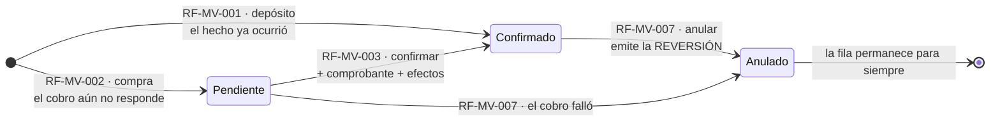
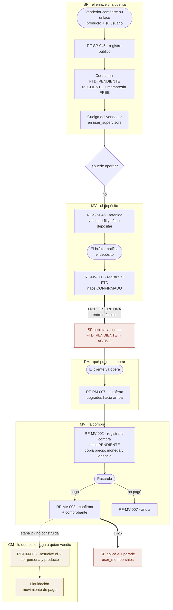
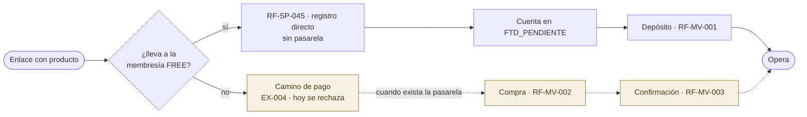
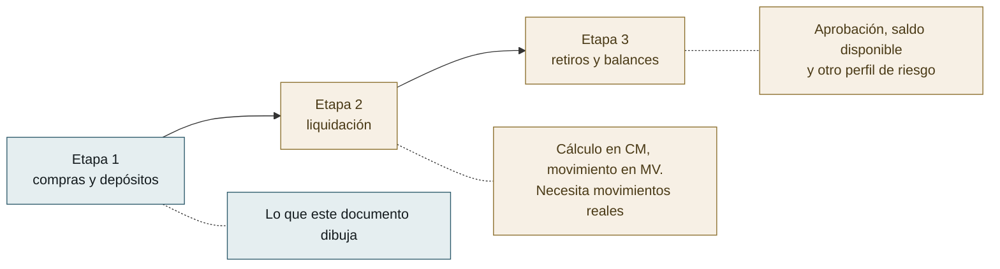

# Flujos del Módulo — `MV` Movimientos

| Campo | Valor |
|---|---|
| Módulo | `MV` — Movimientos |
| Versión | 0.2.0 |
| Estado | **Borrador** |
| Responsable | Bonilla Diaz William Steven |
| Fecha de creación | 01-09-2026 |
| Última actualización | 01-09-2026 |

!!! info "Qué va en este documento"

    La vista de conjunto de los **once requerimientos** de `MV`: cómo se encadenan, qué debe existir antes de qué, y —lo que ningún otro documento dibuja todavía— **el recorrido completo de un cliente**, que atraviesa cuatro módulos.

    No define comportamiento: lo declara [`requirements/mv.md`](../../requirements/mv.md). Ante cualquier discrepancia, **manda ese documento**, y cuando existan las tripletas, mandan ellas.

    El detalle de cada caso, paso a paso y con sus rechazos, está en [Flujos por caso](flujos-por-caso.md).

!!! warning "Ninguno de estos once requerimientos tiene `spec.md` todavía"

    Se dibujan **antes** de escribir las tripletas, por decisión del responsable del proyecto (01-09-2026), y eso invierte el orden habitual: en `SP` los flujos transcribieron specs ya aprobadas.

    El motivo es que aquí el valor está en lo contrario — **dibujar primero es lo que hace visibles las decisiones que faltan**, y §6 recoge las tres que este documento destapó.

    Los tres últimos —recibir, consultar y reprocesar notificaciones entrantes— se añadieron el mismo día, después de dibujar el resto.

---

## 1. Ciclo de vida de un movimiento

**Lo que el diagrama no puede dibujar y hay que leer en `requirements/mv.md`:**

- **`RN-MV-001` prohíbe modificar el movimiento, y el estado sí cambia.** No es una contradicción, y conviene decirlo porque es la primera pregunta que aparece: lo que la regla congela son los **importes y los participantes** —importe, moneda, cantidad, producto, cliente y vendedor—. El estado, el instante de confirmación y el número de comprobante **no forman parte de lo que se declaró**: son lo que le fue pasando.
- **Anular no borra**: emite un movimiento de tipo `REVERSION` que apunta al original, y el original queda en `ANULADO`. Los dos permanecen. La tabla no tiene `deleted_at` y esa ausencia **es** la regla.
- **Solo `CONFIRMADO` produce efectos** (`RN-MV-004`). Un movimiento pendiente no habilita cuentas, no concede membresías y no comisiona.
- Un movimiento anulado **deshace** lo que el confirmado había producido. Qué significa eso exactamente para una membresía ya concedida es la decisión abierta de §6.3.

---

## 2. El recorrido completo de un cliente

Esto es lo que ningún documento dibujaba todavía, y por eso cuesta ver que el sistema esté completo: **atraviesa cuatro módulos y ninguno lo cuenta entero.**

**Las tres cosas que este dibujo hace evidentes:**

1. **Las dos flechas gruesas son D-26**, y son el único punto donde un módulo escribe en otro. Están las dos en el mismo sitio del recorrido —después de confirmar— y las dos escriben en `SP`. Que sean dos y no una refuerza que la decisión merece resolverse de una vez y no caso por caso.
2. **La cadena se sostiene entera menos por un eslabón.** Todo lo dibujado en línea continua existe o está especificado; lo punteado es la etapa 2. Sin `MV`, el recorrido se cortaba en `FTD_PENDIENTE` y no había forma de seguir.
3. **El vendedor aparece una vez, al principio, y cobra al final.** Entre las dos cosas no vuelve a intervenir. Por eso `RN-MV-003` congela quién era: es la única forma de que el pago del final corresponda al vínculo del principio.

---

## 3. Los dos caminos de entrada, y en qué se separan

**Lo que separa a los dos caminos no es el precio: es quién confirma.** En el gratuito confirma **un tercero** —el bróker, avisando de un depósito que ya ocurrió—; en el de pago confirma **la pasarela**, respondiendo a un cobro que el sistema inició. De ahí sale la asimetría del §1: el depósito nace confirmado y la compra nace pendiente.

**Y los dos acaban en el mismo sitio.** Una cuenta habilitada por depósito y una habilitada por compra son indistinguibles después, que es lo que permite que el resto del sistema no tenga que saber por dónde entró nadie.

---

## 4. Qué deja cada operación

| Requerimiento | Escribe | Auditoría | Efecto fuera de `MV` |
|---|---|---|---|
| `RF-MV-001` · depósito | `movements` | Cambio | **Habilita la cuenta** si es el FTD (D-26) |
| `RF-MV-002` · compra | `movements` | Cambio | Ninguno: está `PENDIENTE` |
| `RF-MV-003` · confirmar | `movements.status`, comprobante | Cambio | **Aplica lo comprado** (D-26) |
| `RF-MV-004` a `RF-MV-006` · consultas | — | — | Ninguno |
| `RF-MV-007` · anular | `movements` — **inserta**, no borra | Cambio + eliminación | Deshace lo aplicado (§6.3) |
| `RF-MV-008` · métodos de pago | — | — | Ninguno |
| `RF-MV-009` · recibir notificación | `inbound_notifications` | Cambio | Los de `RF-MV-001` o `RF-MV-003`, si la interpreta |
| `RF-MV-010` · consultar notificaciones | — | — | Ninguno |
| `RF-MV-011` · reprocesar | `inbound_notifications`, `movements` | Cambio | Los del movimiento que produzca |

**`RF-MV-007` escribe en el registro de eliminación aunque no elimine nada**, y es deliberado: el Art. V.13 exige motivo para deshacer, y anular dinero es deshacer. Que la fila permanezca no cambia que alguien tuvo que justificar por qué deja de contar.

---

## 5. Dónde se detiene el módulo hoy

---

## 6. Lo que dibujar destapó

Tres cosas que `requirements/mv.md` v0.1.0 no decía, y que solo se ven al seguir el recorrido de punta a punta.

### 6.1 El depósito y la compra no comparten máquina de estados

`requirements/mv.md` §4.1 describía `RF-MV-003` como si todo movimiento naciera `PENDIENTE` y hubiera que confirmarlo. **No es así, y el motivo es bueno**: un depósito es un hecho que **ya ocurrió** y del que un tercero avisa; confirmarlo después sería preguntarle al sistema si cree lo que el bróker le acaba de decir. Una compra sí nace pendiente, porque el cobro está en marcha y todavía puede fallar.

**Resuelto**: el depósito nace `CONFIRMADO`, la compra nace `PENDIENTE`, y `RF-MV-003` es de compras. Aplicado a `requirements/mv.md` v0.2.0.

### 6.2 Un depósito que no es el primero no habilita nada

El recorrido de §2 dibuja el FTD, que es el que saca la cuenta de `FTD_PENDIENTE`. **El segundo depósito de la misma persona no habilita nada**, porque ya estaba habilitada — y sin decirlo, la implementación evidente sería «todo depósito confirmado habilita», que es correcta por accidente y deja de serlo el día que exista una cuenta desactivada por otro motivo.

**Resuelto**: la habilitación es una consecuencia de la **transición** y no del depósito. Aplicado como `RN-MV-011`.

### 6.3 Anular no dice qué pasa con lo ya concedido

`RN-MV-004` dice que un anulado «deshace lo que el confirmado había producido», y eso es fácil de escribir y difícil de cumplir. Si se anula la compra de un upgrade que ya cambió el nivel de alguien: ¿se le retira el nivel? ¿Se le deja y se registra la pérdida? ¿Y si entre medias compró otro?

**No resuelta, y no bloquea la etapa 1**: se puede construir el registro, la confirmación y la consulta sin decidirlo, porque anular un movimiento que **no** aplicó nada —una compra pendiente que la pasarela rechazó— es el caso frecuente y no tiene esta pregunta dentro. Queda declarada en `requirements/mv.md` §5.3 y es lo primero que hay que cerrar antes de escribir la tripleta de `RF-MV-007`.
