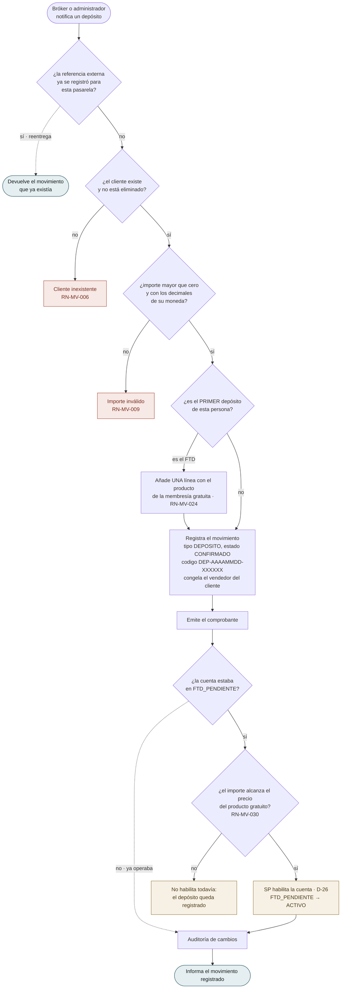
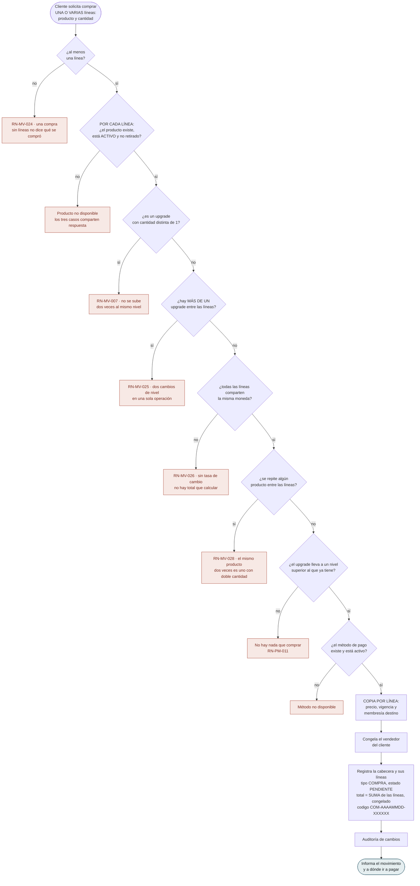
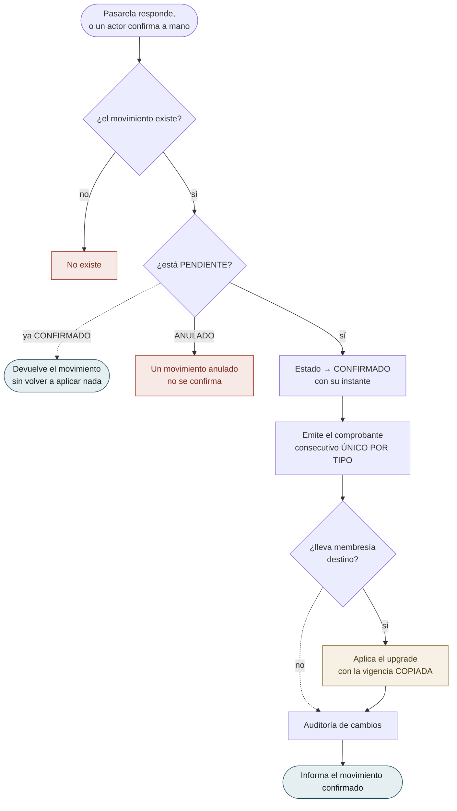
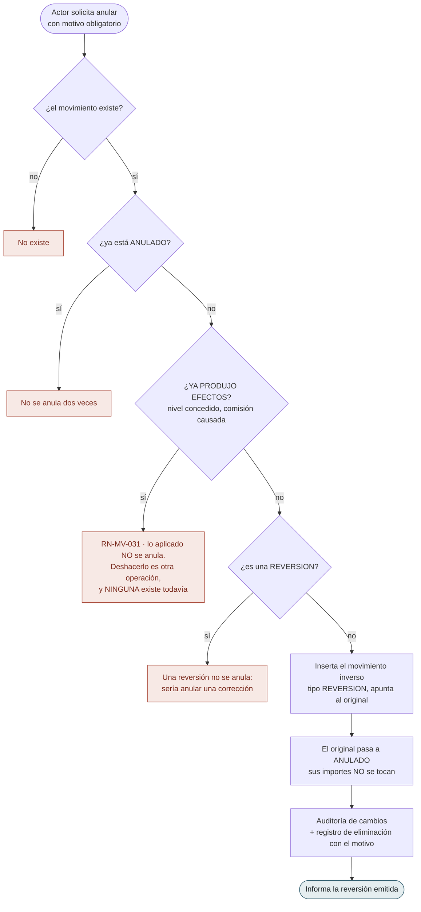
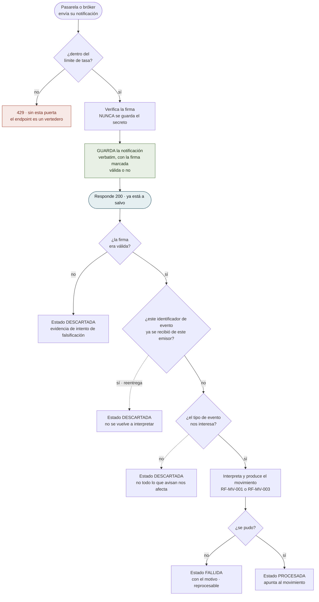
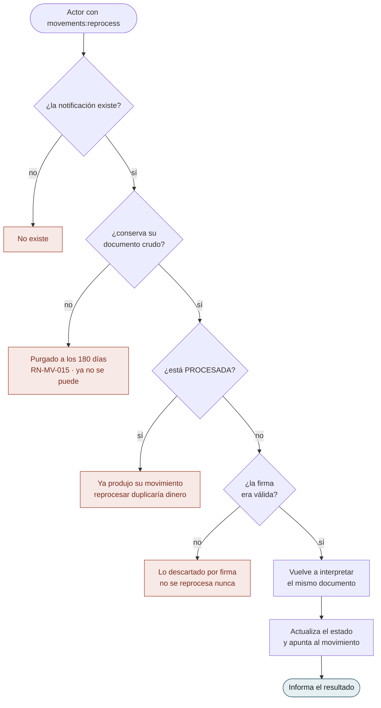
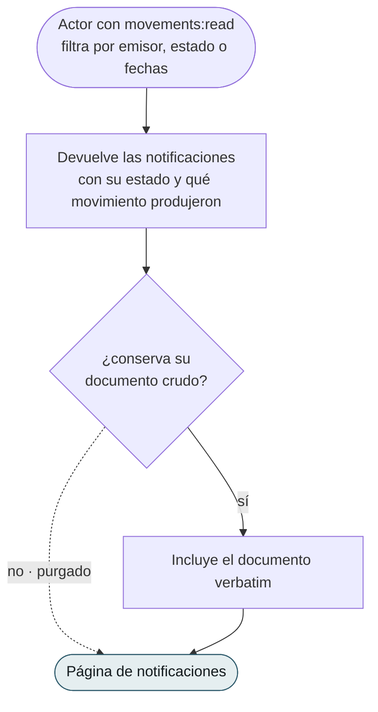
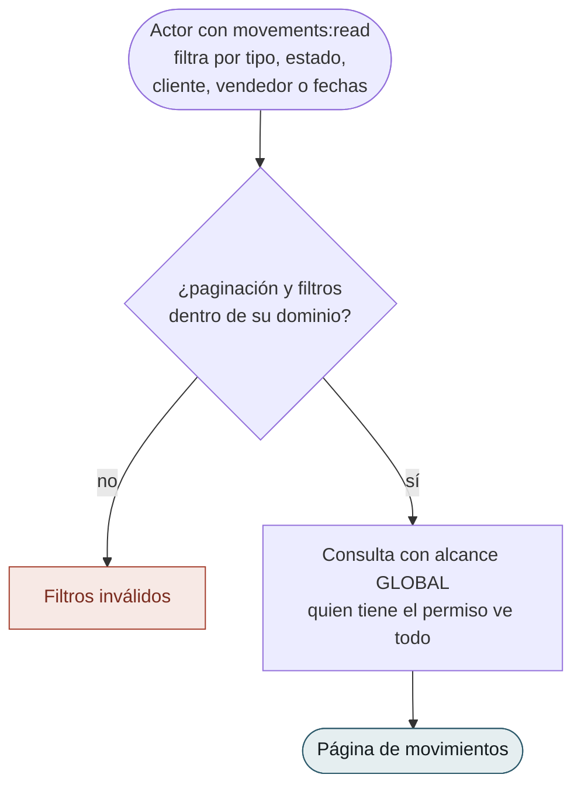
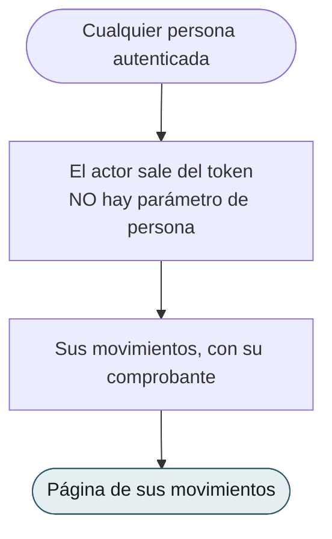

# Flujos por caso de uso — `MV` Movimientos

| Campo | Valor |
|---|---|
| Módulo | `MV` — Movimientos |
| Versión | 0.5.0 |
| Estado | **Borrador** |
| Responsable | Bonilla Diaz William Steven |
| Fecha de creación | 01-09-2026 |
| Última actualización | 01-09-2026 |

!!! info "Qué va en este documento"

    Un diagrama por caso de uso: qué puede hacer el actor, qué verifica el sistema en cada paso y por dónde sale la operación cuando una verificación falla.

    **Se dibuja antes de que existan las tripletas**, al revés que en `SP`. De modo que aquí los diagramas **no transcriben** una `§8 Flujo principal` ya aprobada: la **proponen**, a partir de las reglas de [`requirements/mv.md`](../../requirements/mv.md). Cuando cada `spec.md` se escriba, mandará ella.

!!! note "Convención de los diagramas"

    | Forma | Significado |
    |---|---|
    | Cápsula | Acción del actor, o respuesta final del sistema |
    | Rombo | Verificación del sistema |
    | Rectángulo | Paso del sistema que produce efecto |
    | Recuadro rojo | Rechazo, con la regla que lo motiva |
    | Recuadro ámbar | Escritura **fuera de `MV`** — depende de **D-26** |
    | Línea punteada | Camino alternativo: no es error |

---

## 1. Registrar

### `RF-MV-001` · Registrar un depósito

El dinero que entra a nombre de un cliente. **Nace `CONFIRMADO`**: es un hecho que ya ocurrió y del que un tercero avisa.

**La reentrega devuelve lo que ya había y no falla**, y es lo más importante del diagrama. Toda pasarela reintenta cuando no recibe respuesta a tiempo, de modo que la doble entrega **es el caso normal**. Responder un error convertiría un reintento legítimo en una alarma; crear un segundo movimiento duplicaría el dinero. La unicidad la sostiene el esquema (`RN-MV-005`), no esta comprobación: dos entregas simultáneas la burlan.

**`V5` es `RN-MV-011`**, y no es «todo depósito habilita»: es la **transición** la que habilita. El segundo depósito de la misma persona no toca su estado.

**El paso ámbar es D-26, ya cerrada** (01-09-2026): `SP` publica «habilitar cuenta por depósito» y `MV` la invoca, **síncrona y en la misma transacción** — si esa escritura falla, falla el registro entero y no queda un depósito confirmado con la cuenta retenida.

**`V4` y `V6` son la novedad del 01-09-2026.** El **FTD lleva una línea** con el producto de la membresía gratuita —el mismo que fija su importe—, y por eso se comisiona como cualquier otra venta sin tocarle la firma a `RF-CM-005`. Y habilita **si el importe alcanza ese precio** (`RN-MV-030`): **al menos y no exactamente**, porque exigir el importe exacto convertiría una comisión bancaria en un bloqueo.

---

### `RF-MV-002` · Registrar una compra

Qué producto pidió quién, y a qué precio. **Nace `PENDIENTE`**: el cobro está en marcha y todavía puede fallar.

**`P1` es la regla que otros documentos impusieron a este módulo antes de que existiera** (`RN-MV-002`). No se guarda una referencia al producto para leer su precio después: se guarda el precio. Sin eso, corregir un precio en el catálogo reescribiría lo ya vendido — y `requirements/pm.md` §1.4 lo dejó escrito el 26-08-2026, meses antes de que hubiera dónde cumplirlo.

**No hay comprobante todavía**, y es deliberado: `RN-MV-008` lo emite al confirmar. Un comprobante sobre un cobro que puede fallar sería un número gastado.

**Las cuatro verificaciones nuevas del centro son el precio de admitir varias líneas**, y ninguna existía cuando un movimiento llevaba un solo producto. La que importa es `RN-MV-025`: **dos upgrades en la misma compra son dos cambios de nivel en una sola operación**, y no hay forma no arbitraria de decidir en cuál queda la persona. Las cuatro **cruzan dos tablas**, así que ningún `CHECK` las sostiene y viven en el caso de uso.

**El código sí se emite ya**, y esa asimetría es el motivo de que sean dos códigos distintos: el del movimiento identifica algo que **ya existe** aunque no se haya pagado; el del comprobante numera un documento que **solo existe si se pagó**. La fecha del código sale de `occurred_at` (`RN-MV-017`), no del reloj.

---

## 2. Confirmar y anular

### `RF-MV-003` · Confirmar un movimiento pendiente

Donde una compra se vuelve real, y donde se produce **todo** el efecto.

**Confirmar dos veces no aplica dos veces.** Es la misma defensa que `RF-MV-001`, en el otro extremo del mismo problema: la pasarela reintenta su notificación, y sin este camino punteado el cliente recibiría dos upgrades por un pago.

**`P3` usa la vigencia del movimiento, no la del producto.** Si entre la compra y la confirmación alguien cambió `validity_days` en el catálogo, manda lo que se compró.

**El paso ámbar es D-26 otra vez**, y es el segundo de los dos únicos puntos donde `MV` escribe fuera.

---

### `RF-MV-007` · Anular un movimiento

No borra. **Inserta.**

**`V3` es la puerta que el responsable decidió cerrar** (`RN-MV-031`, 01-09-2026). Anular una compra pendiente que la pasarela rechazó —el caso frecuente— pasa de largo: no había aplicado nada. Anular una compra **ya aplicada** ya no se admite por esta vía.

**Y eso deja un hueco a la vista en lugar de resolverlo**: retirar un nivel concedido o revertir una comisión causada son **operaciones distintas que no existen**. Se eligió así sobre deshacerlo todo —que obligaría a quitarle el nivel a quien lleva un mes usándolo— y sobre revertir solo el dinero —que dejaría el libro y el acceso discrepando—. **El precio: hoy un movimiento aplicado por error no tiene corrección por ninguna vía.**

**Escribe en el registro de eliminación aunque no elimine.** El Art. V.13 exige motivo para deshacer, y esto deshace dinero.

---

## 3. Lo que llega de fuera

### `RF-MV-009` · Recibir una notificación de un sistema externo

El único endpoint del módulo que **no lo llama una persona**. Y el orden de sus pasos es la mitad del requerimiento.

**Todo lo que hay debajo de la cápsula verde ocurre después de responder**, y ese es el punto entero del diagrama. `RN-MV-012`: guardar va **antes** de interpretar, y responder va antes de trabajar.

- **Guardar después de procesar** sería tener la notificación en todos los casos **menos en el único que importa**: aquel en que procesarla falló.
- **Responder después de procesar** convertiría cada operación lenta en una reentrega, porque las pasarelas tienen espera corta y reintentan. Y cada reentrega es otro procesamiento — la forma más fácil de duplicar dinero.

**La firma se verifica antes de guardar y no impide guardar.** Es `RN-MV-014`: lo que no valida se conserva marcado, porque «alguien está intentando falsificar confirmaciones de pago» vale más visible en una tabla que en un `401` que nadie mira. Por eso el límite de tasa es la primera puerta y no una mejora posterior.

**Cuatro de los cinco desenlaces no producen movimiento**, y ninguno es un error del emisor. Es lo que justifica que la notificación sea una tabla y no una columna de `movements`.

---

### `RF-MV-011` · Reprocesar una notificación

**Las cuatro salidas son negativas y las cuatro importan.** Esta es la operación con más capacidad de hacer daño del módulo —reprocesar algo ya procesado duplica dinero— y por eso cada puerta está antes de tocar nada.

**La purga la inutiliza, y es correcto.** A los 180 días el documento ya no está y la fila sí: se sabe qué llegó y qué produjo, pero no se puede volver a interpretar. Es el precio declarado de `RN-MV-015`, y el motivo de que el plazo cubra la ventana de contracargo con margen.

**Lo descartado por firma inválida no se reprocesa jamás**, ni corrigiendo la clave. Si la firma no validó, no consta que el mensaje viniera de quien dice: reprocesarlo sería procesar algo que nadie autenticó.

---

### `RF-MV-010` · Consultar las notificaciones recibidas

**Es la consulta de conciliación**: la que responde «la pasarela dice que nos avisó, ¿lo hizo?». Sin ella, la tabla guarda evidencia que nadie puede mirar.

**El documento lleva datos personales de terceros**, y por eso exige `movements:read` y no basta estar autenticado — al revés que `RF-MV-006`, que solo devuelve lo propio.

---

## 4. Consultar

### `RF-MV-004` · Consultar movimientos

**El alcance global es una decisión aplazada, no un descuido.** Que un director vea los movimientos de todos y no solo los de su equipo depende de **D-22**, abierta desde hace semanas. Es el mismo aplazamiento explícito que `requirements/cm.md` §5.3 hizo con las tarifas, y esta consulta es la que habrá que revisar el día que D-22 se cierre.

---

### `RF-MV-005` · Consultar el detalle, con su comprobante

**Devuelve datos, no un PDF.** El backend no maneja ningún binario: ningún controlador acepta ni devuelve ficheros, y abrirlo es una decisión de infraestructura que ningún requerimiento respalda. Quien lo pinte, lo pinta.

**Un movimiento retirado o de un producto retirado se consulta con normalidad.** Preguntar qué se pagó por algo que ya no se vende es exactamente lo que una revisión atrasada necesita — el mismo criterio que `RF-CM-005` aplicó a las tarifas.

---

### `RF-MV-006` · Consultar los movimientos propios

**No exige permiso y no admite parámetro**, por el mismo criterio con el que `RF-SP-039` publicó el perfil propio y `RF-PM-007` la oferta propia: pedir `movements:read` para que alguien vea sus tres compras le daría el libro entero. Y sin parámetro no hay forma de preguntar por un tercero — **es lo único que hace que esta consulta no dependa de D-22**.

---

### `RF-MV-008` · Consultar los métodos de pago

**Solo los activos, y sin permiso.** Quien va a pagar necesita saber con qué puede pagar, y un método desactivado no se ofrece — aunque **siga siendo válido en los movimientos que lo usaron**, por el mismo criterio de `RN-PM-008` con las monedas.

**Método no es pasarela** (`RN-MV-010`): esta consulta devuelve con qué se puede pagar, no quién lo procesa. Qué proveedor atiende cada método es configuración, no catálogo de negocio.
