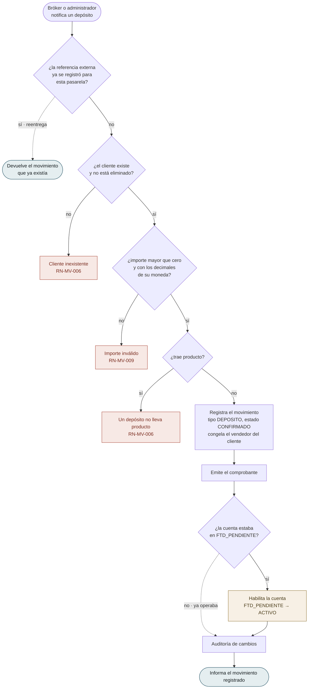
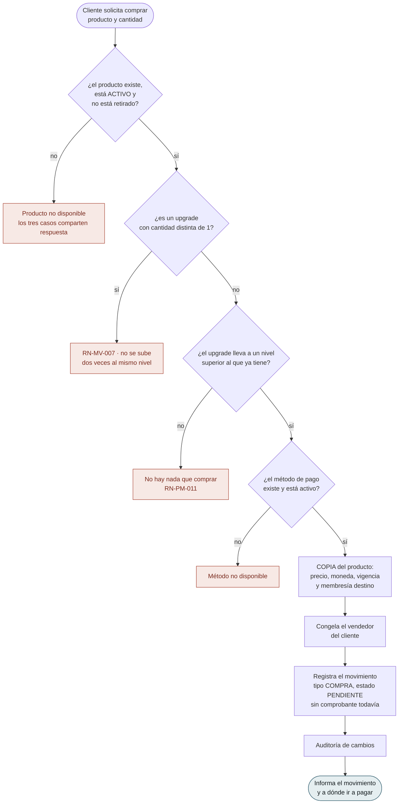
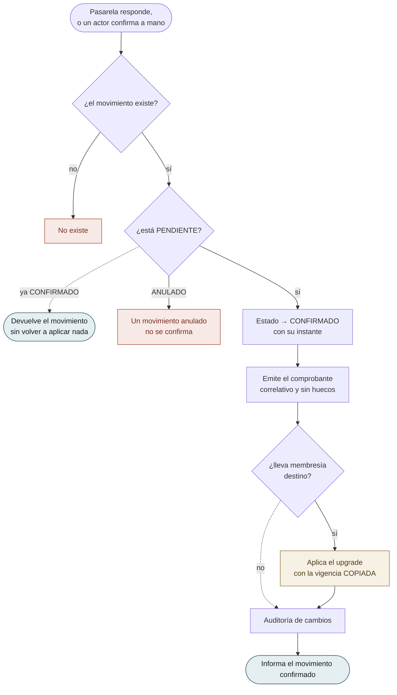
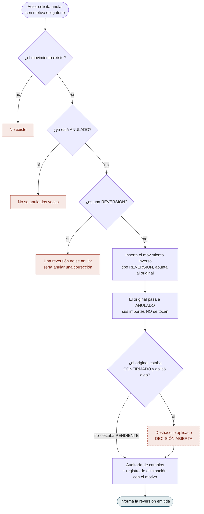
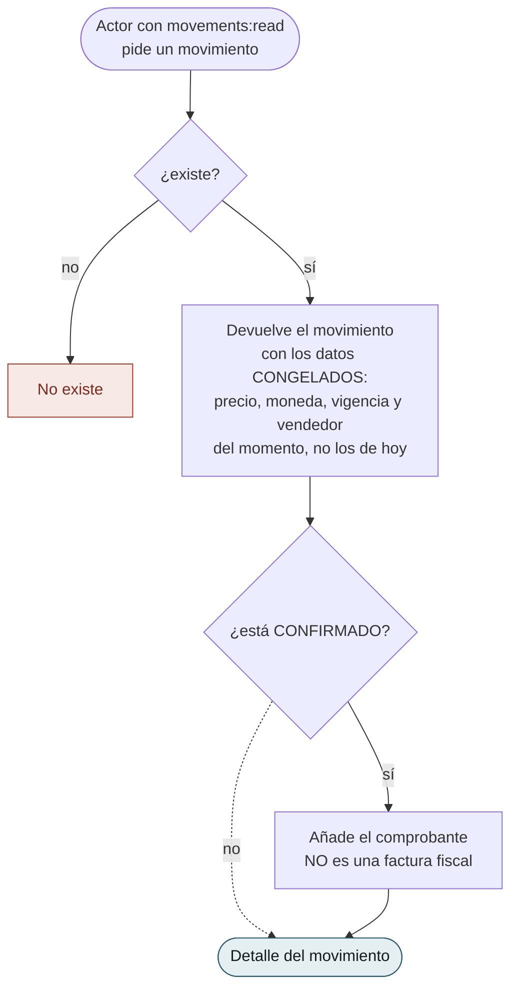
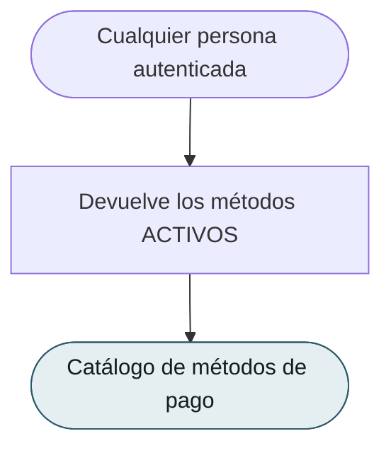

# Flujos por caso de uso — `MV` Movimientos

| Campo | Valor |
|---|---|
| Módulo | `MV` — Movimientos |
| Versión | 0.1.0 |
| Estado | **Borrador** |
| Responsable | Bonilla Diaz William Steven |
| Fecha de creación | 01-09-2026 |
| Última actualización | 01-09-2026 |

!!! info "Qué va en este documento"

    Un diagrama por caso de uso: qué puede hacer el actor, qué verifica el sistema en cada paso y por dónde sale la operación cuando una verificación falla.

    **Se dibuja antes de que existan las tripletas**, al revés que en `SP`. De modo que aquí los diagramas **no transcriben** una `§8 Flujo principal` ya aprobada: la **proponen**, a partir de las reglas de [`requirements/mv.md`](../../requirements/mv.md). Cuando cada `spec.md` se escriba, mandará ella.

!!! note "Convención de los diagramas"

    | Forma | Significado |
    |---|---|
    | Cápsula | Acción del actor, o respuesta final del sistema |
    | Rombo | Verificación del sistema |
    | Rectángulo | Paso del sistema que produce efecto |
    | Recuadro rojo | Rechazo, con la regla que lo motiva |
    | Recuadro ámbar | Escritura **fuera de `MV`** — depende de **D-26** |
    | Línea punteada | Camino alternativo: no es error |

---

## 1. Registrar

### `RF-MV-001` · Registrar un depósito

El dinero que entra a nombre de un cliente. **Nace `CONFIRMADO`**: es un hecho que ya ocurrió y del que un tercero avisa.

**La reentrega devuelve lo que ya había y no falla**, y es lo más importante del diagrama. Toda pasarela reintenta cuando no recibe respuesta a tiempo, de modo que la doble entrega **es el caso normal**. Responder un error convertiría un reintento legítimo en una alarma; crear un segundo movimiento duplicaría el dinero. La unicidad la sostiene el esquema (`RN-MV-005`), no esta comprobación: dos entregas simultáneas la burlan.

**`V5` es `RN-MV-011`**, y no es «todo depósito habilita»: es la **transición** la que habilita. El segundo depósito de la misma persona no toca su estado.

**El paso ámbar depende de D-26.** Es la escritura en `users`, que hoy no tiene forma acordada.

---

### `RF-MV-002` · Registrar una compra

Qué producto pidió quién, y a qué precio. **Nace `PENDIENTE`**: el cobro está en marcha y todavía puede fallar.

**`P1` es la regla que otros documentos impusieron a este módulo antes de que existiera** (`RN-MV-002`). No se guarda una referencia al producto para leer su precio después: se guarda el precio. Sin eso, corregir un precio en el catálogo reescribiría lo ya vendido — y `requirements/pm.md` §1.4 lo dejó escrito el 26-08-2026, meses antes de que hubiera dónde cumplirlo.

**No hay comprobante todavía**, y es deliberado: `RN-MV-008` lo emite al confirmar. Un comprobante sobre un cobro que puede fallar sería un número gastado y una promesa incumplida.

---

## 2. Confirmar y anular

### `RF-MV-003` · Confirmar un movimiento pendiente

Donde una compra se vuelve real, y donde se produce **todo** el efecto.

**Confirmar dos veces no aplica dos veces.** Es la misma defensa que `RF-MV-001`, en el otro extremo del mismo problema: la pasarela reintenta su notificación, y sin este camino punteado el cliente recibiría dos upgrades por un pago.

**`P3` usa la vigencia del movimiento, no la del producto.** Si entre la compra y la confirmación alguien cambió `validity_days` en el catálogo, manda lo que se compró.

**El paso ámbar es D-26 otra vez**, y es el segundo de los dos únicos puntos donde `MV` escribe fuera.

---

### `RF-MV-007` · Anular un movimiento

No borra. **Inserta.**

**`P3` no está resuelto**, y el diagrama lo dice en lugar de fingir que sí. Anular una compra pendiente que la pasarela rechazó —el caso frecuente— no pasa por ahí: no había aplicado nada. Anular una compra ya aplicada plantea preguntas que nadie ha respondido: ¿se retira el nivel concedido? ¿y si entre medias compró otro? Ver `flujos-del-modulo.md` §6.3.

**Escribe en el registro de eliminación aunque no elimine.** El Art. V.13 exige motivo para deshacer, y esto deshace dinero.

---

## 3. Consultar

### `RF-MV-004` · Consultar movimientos

**El alcance global es una decisión aplazada, no un descuido.** Que un director vea los movimientos de todos y no solo los de su equipo depende de **D-22**, abierta desde hace semanas. Es el mismo aplazamiento explícito que `requirements/cm.md` §5.3 hizo con las tarifas, y esta consulta es la que habrá que revisar el día que D-22 se cierre.

---

### `RF-MV-005` · Consultar el detalle, con su comprobante

**Devuelve datos, no un PDF.** El backend no maneja ningún binario: ningún controlador acepta ni devuelve ficheros, y abrirlo es una decisión de infraestructura que ningún requerimiento respalda. Quien lo pinte, lo pinta.

**Un movimiento retirado o de un producto retirado se consulta con normalidad.** Preguntar qué se pagó por algo que ya no se vende es exactamente lo que una revisión atrasada necesita — el mismo criterio que `RF-CM-005` aplicó a las tarifas.

---

### `RF-MV-006` · Consultar los movimientos propios

**No exige permiso y no admite parámetro**, por el mismo criterio con el que `RF-SP-039` publicó el perfil propio y `RF-PM-007` la oferta propia: pedir `movements:read` para que alguien vea sus tres compras le daría el libro entero. Y sin parámetro no hay forma de preguntar por un tercero — **es lo único que hace que esta consulta no dependa de D-22**.

---

### `RF-MV-008` · Consultar los métodos de pago

**Solo los activos, y sin permiso.** Quien va a pagar necesita saber con qué puede pagar, y un método desactivado no se ofrece — aunque **siga siendo válido en los movimientos que lo usaron**, por el mismo criterio de `RN-PM-008` con las monedas.

**Método no es pasarela** (`RN-MV-010`): esta consulta devuelve con qué se puede pagar, no quién lo procesa. Qué proveedor atiende cada método es configuración, no catálogo de negocio.
