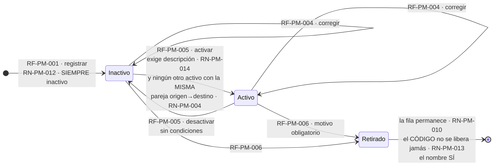
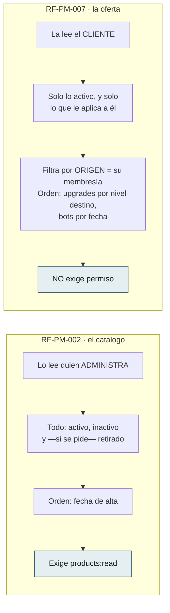
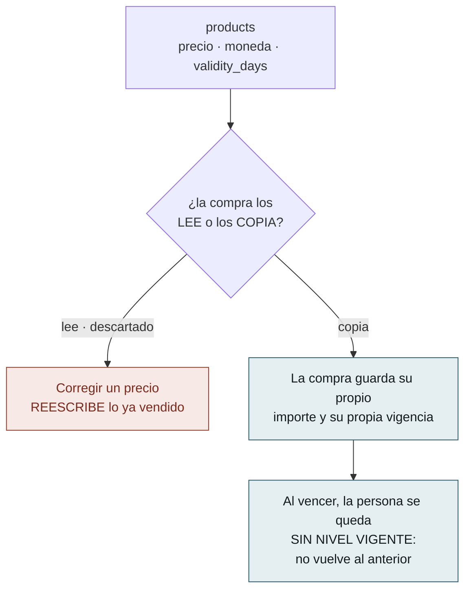
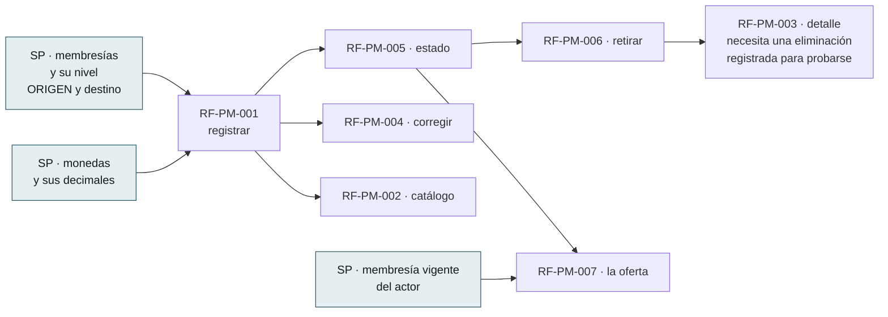
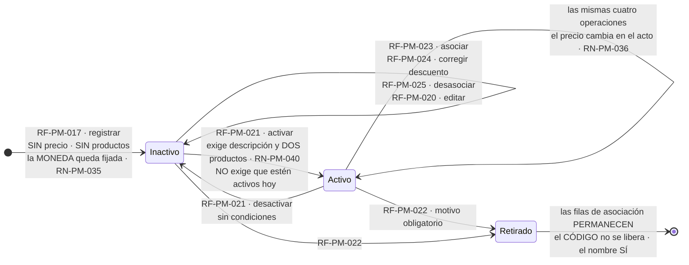
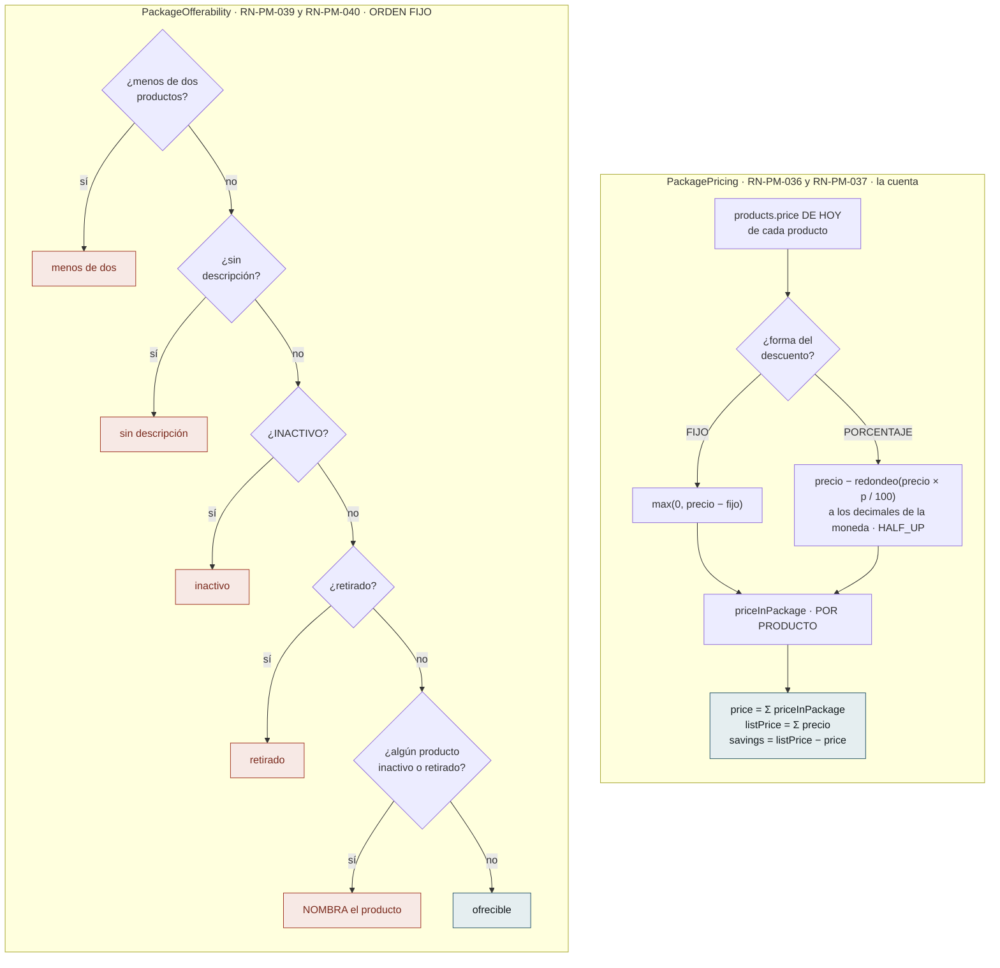
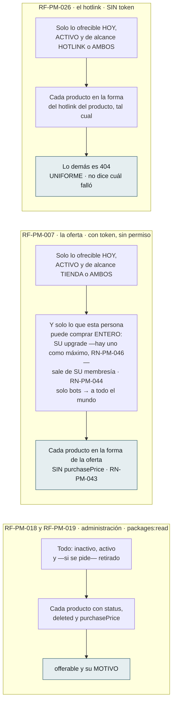
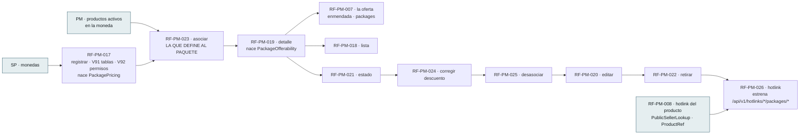

# Flujos del Módulo — `PM` Productos y Mercadeo

| Campo | Valor |
|---|---|
| Módulo | `PM` — Productos y Mercadeo |
| Versión | 0.5.0 |
| Estado | **Borrador** |
| Responsable | Bonilla Diaz William Steven |
| Fecha de creación | 01-09-2026 |
| Última actualización | 16-09-2026 |

!!! info "Qué va en este documento"

    La vista de conjunto de `PM`: los **siete requerimientos del catálogo de productos** —el ciclo de vida del producto, en qué se separan las dos consultas que el módulo publica, y qué queda congelado para quien venga después— y, desde el 15-09-2026, los **diez de los paquetes** (`RF-PM-017` a `RF-PM-026`, §6 y §7): un agregado que copia el ciclo de vida del producto y que **no tiene precio propio**. Los de hotlink del producto, reseñas y portada (`RF-PM-008` a `RF-PM-016`) siguen sin dibujar, y §8 lo anota.

    No define comportamiento. Todo lo que aquí se dibuja está declarado en las tripletas de `docs/specs/pm/`; este documento solo lo hace visible. Ante cualquier discrepancia, **manda la spec**.

    El detalle de cada caso está en [Flujos por caso](flujos-por-caso.md).

---

## 1. Ciclo de vida del producto

**Nace inactivo**, y esa decisión gobierna medio módulo.

**Lo que el diagrama no puede dibujar y hay que leer en las specs:**

- **`RN-PM-004` se comprueba solo al activar**, y ese es el motivo de que el producto nazca inactivo. Naciendo activo habría que verificar «un solo upgrade activo por pareja origen→destino» en el alta **y** en la activación, y **la copia que se quedara atrás no fallaría: admitiría**.
- **Activar exige descripción y desactivar no exige nada.** Registrar un producto a medias es legítimo —está preparándose—; ofrecérselo a un cliente sin decirle qué se lleva, no.
- **El tipo y el código no tienen ninguna transición.** Son inmutables (`RN-PM-001`, `RN-PM-013`), y por eso `RF-PM-004` los rechaza explícitamente en vez de ignorarlos.
- **El código y el nombre se comportan al revés al retirar**, y es deliberado: el nombre queda libre porque es una etiqueta corregible; **el código no se libera jamás**, porque el día que una factura diga `UPGRADE_ORO` tiene que resolver a un solo producto para siempre.
- **Un producto vendido se retira igual.** La fila permanece y la compra guarda su propio importe, de modo que quien consulte su compra verá el producto retirado — consecuencia declarada, no defecto.

---

## 2. Las dos consultas no son la misma, y por eso son dos endpoints

Es la separación que más se malinterpreta del módulo.

**Fundirlas con un filtro habría dado a cada cliente el catálogo entero** para que pudiera ver tres líneas. Y la regla que decide qué se ofrece **vive en el servidor o no vive**: repetida en cada pantalla, la copia que se quedara atrás no fallaría — **ofrecería de más**.

**`/products/available` compite en forma con `/products/{id}`**, y Spring resuelve antes el segmento literal. Es correcto, y **por eso tiene prueba**: si alguien renombra, el síntoma sería un `400` por identificador inválido en la única ruta que un cliente usa a diario.

---

## 3. Lo que este módulo congela para quien venga después

`PM` escribió condiciones sobre **un módulo que todavía no existe**: el que registre las compras. Están en `requirements/pm.md` §1.4 desde el 26-08-2026.

**La condición se escribió antes de que hubiera dónde cumplirla**, y esa es la parte que conviene no perder: quien construya las compras **se la encontrará escrita** en lugar de tener que deducirla. Sin ella, corregir un precio reescribiría facturas ya emitidas.

**Y al vencer no se vuelve al nivel anterior**, porque eso habría exigido que la compra **guardase cuál era**: después de asignar el nuevo, esa información no está en ningún sitio.

---

## 4. Qué debe existir antes de qué

**El orden de implementación no fue el de los identificadores** —fue `001 → 002 → 005 → 006 → 003 → 004 → 007`— porque `RF-PM-003` devuelve el motivo del retiro y necesita una eliminación ya registrada contra la que probarse.

**Las tres cajas azules son D-25**: las tres lecturas que `SP` publica y `PM` importa. `RF-PM-007` estrena la tercera, y es la única que este módulo no podía construir hasta que existiera.

---

## 5. Qué deja cada operación

| Requerimiento | Escribe | Auditoría |
|---|---|---|
| `RF-PM-001` · registrar | `products`, siempre `INACTIVO` | Cambios |
| `RF-PM-002` a `RF-PM-003` · consultas | — | — |
| `RF-PM-004` · corregir | `products` | Cambios, con el antes y el después |
| `RF-PM-005` · estado | `products.status` | Cambios |
| `RF-PM-006` · retirar | `products.deleted_at` | Cambios **+ eliminación** con motivo e instantánea |
| `RF-PM-007` · la oferta | — | — |

**Ninguna operación de este módulo emite evento de seguridad**, ni siquiera el retiro. Es una decisión declarada y no un olvido: **un producto no concede privilegios**, y el catálogo de `security.md` §8.1 es cerrado.

---

## 6. El paquete: un precio que no está en ninguna columna

Desde el 15-09-2026 el módulo tiene un segundo agregado, y su ciclo de vida **copia el del producto a propósito** (`RN-PM-041`): nace inactivo, se arma en ese estado, y se retira con motivo. Lo que no copia es lo que lo define: **no tiene precio propio**.

**Lo que el diagrama no dibuja:**

- **Se arma inactivo.** Activar exige dos productos y meter productos exige que el paquete exista: si asociar pidiera un paquete activo, el círculo no tendría por dónde entrar. Por eso `RF-PM-023` asocia en cualquier estado vivo (`FA-002`).
- **Activar no mira el estado de los productos.** Exige que haya dos y que haya descripción; que estén activos hoy lo mira **la oferta**, cada vez. Un paquete activo con un producto retirado dentro **es un estado legítimo**: el detalle lo nombra y la oferta lo oculta (`RN-PM-039`).
- **Quitar productos hasta dejar uno no desactiva el paquete.** Lo saca de la oferta mientras siga con menos de dos, y vuelve solo cuando vuelva a tener dos (`RN-PM-040`).
- **La moneda no tiene transición** porque es la unidad en la que se suma: cambiarla convertiría los descuentos fijos en otra cosa. `RF-PM-020` la rechaza junto al código.

### 6.1 Los dos objetos que hacen la cuenta

Todo lo que el paquete publica sale de **dos componentes de dominio** que nacen en `RF-PM-017` y `RF-PM-019` y que las otras lecturas **consultan sin repetir**.

**Se redondea por producto y el total es la suma**, no al revés: el total tiene que cuadrar con las líneas que el front pinta. **Y el precio no se guarda** — cuando `RF-PM-004` corrige el precio de un producto, todos los paquetes que lo contienen cambian sin que nadie los toque (`RN-PM-036`). El único hueco es el declarado: un fijo que entró cuando el producto valía 100 y hoy vale 50 cuenta **cero**, nunca negativo, y nada avisa (`RN-PM-037`).

**El orden de los motivos es fijo porque tres lecturas lo consumen** y tienen que decir lo mismo:

| Lectura | Qué hace con `PackageOfferability` |
|---|---|
| `RF-PM-019` · detalle | Publica `offerable` **y el motivo**, nombrando el producto que detiene el paquete: es la única pantalla desde la que se arregla |
| `RF-PM-018` · lista | Publica el booleano como **columna**, no como filtro |
| `RF-PM-007` · oferta | **Filtra**: lo no ofrecible no aparece y nada lo dice |
| `RF-PM-026` · hotlink | **`404`**, el mismo que el paquete inexistente |

---

## 7. Dónde se publica el paquete y quién ve qué

El paquete se publica **donde se publican los productos**, y con la misma asimetría de §2: la lectura de administración lo enseña todo, las dos públicas solo lo que se puede comprar.

**El alcance de los productos no filtra dentro del paquete.** Un paquete `HOTLINK` o `AMBOS` con un producto `TIENDA` dentro **se resuelve por hotlink entero**: el canal lo decide el paquete. Y el alcance es, desde el 15-09-2026, el mismo dominio de cuatro valores del producto: `TIENDA` y `AMBOS` llegan a la oferta, `HOTLINK` y `AMBOS` al hotlink, `NINGUNO` a ninguna vista. Filtrarlos crearía paquetes impublicables sin motivo nombrado.

**Y un paquete lleva un upgrade como máximo, comprobado al asociar y no en la oferta** (`RN-PM-046`, desde el 16-09-2026): dos upgrades en un paquete serían dos cambios de membresía vendidos a la vez a la misma persona, y rechazarlo en `RF-PM-023` es el único sitio donde el error tiene a alguien delante. Hasta ese día la regla era «los upgrades comparten origen» (`RN-PM-044`), que protegía lo mismo por un camino más largo —un paquete con upgrades de dos orígenes no se le podría ofrecer a nadie—; hoy `RN-PM-044` es solo la lectura: **el upgrade del paquete decide a quién se ofrece**.

### 7.1 Qué debe existir antes de qué

**El orden de construcción es `017 → 023 → 019 → 018 → 021 → 024 → 025 → 020 → 022 → 026`**, y de nuevo no es el de los identificadores: **el detalle va tercero** porque es donde nace `PackageOfferability` y donde se prueba la cuenta, y todo lo que viene después devuelve el detalle. El hotlink va último por decisión de `requirements/pm.md` §6.1.

### 7.2 Qué deja cada operación

| Requerimiento | Escribe | Auditoría |
|---|---|---|
| `RF-PM-017` · registrar | `product_packages`, siempre `INACTIVO`, **sin precio** | Cambios |
| `RF-PM-018` a `RF-PM-019` · lista y detalle | — | — |
| `RF-PM-020` · editar | `product_packages` — nombre, descripción, alcance | Cambios, con el antes y el después |
| `RF-PM-021` · estado | `product_packages.status` | Cambios |
| `RF-PM-022` · retirar | `product_packages.deleted_at`; **las filas de asociación permanecen** | Cambios **+ eliminación** con motivo e instantánea |
| `RF-PM-023` · asociar | `product_package_items` | Cambios |
| `RF-PM-024` · corregir descuento | `product_package_items` — forma **y** valor | Cambios, `type` y `value` con el antes y el después |
| `RF-PM-025` · desasociar | **borrado físico** de `product_package_items` | Eliminación **`ASSOCIATION`**, **sin motivo**, con el descuento en la instantánea |
| `RF-PM-026` · hotlink | — | — |

**Ninguna emite evento de seguridad**, por lo mismo que §5: un paquete no concede privilegios.

---

## 8. Lo que el dibujo dejó a la vista

| # | Observación | Dónde se resuelve |
|---|---|---|
| 1 | **`RF-PM-001` tiene un hueco en su numeración de excepciones**: va de `EX-003` a `EX-005`. No es un error — `EX-004` **existe tachada**: era «ya hay un upgrade activo hacia ese destino» y **migró a `RF-PM-005`** cuando el producto pasó a nacer inactivo. El número se deja vacío a propósito, para que la migración de la regla quede a la vista | `spec.md` §10 de `RF-PM-001` |
| 2 | **`RF-PM-007` es el único requerimiento del módulo sin ninguna excepción tipificada.** No admite entrada, de modo que no hay nada que rechazar: sus tres caminos son alternativos, no errores | `spec.md` §10 de `RF-PM-007` |
| 3 | **Dos reglas se comprueban en sitios distintos siendo la misma pregunta**: `RN-PM-007` —los decimales según la moneda— vive en el dominio porque un `CHECK` no consulta `currencies`, y `RN-PM-006` —precio mayor que cero— sí está en el esquema. Quien busque «dónde se valida el precio» encontrará dos sitios | `requirements/pm.md` §10.3 |
| 4 | **El motivo del retiro lo devuelve el detalle y no el listado**, y esa asimetría enmendó a posteriori el motivo con el que se había aprobado `RF-PM-002` — la decisión no cambió, su justificación se reescribió | `requirements/pm.md` §11 v0.5.0 |
| 5 | **`RF-PM-005` es el único requerimiento cuya excepción depende del estado al que se va, no del actual.** Desactivar no tiene condiciones; activar tiene dos. Un diagrama de estados con transiciones simétricas lo escondería | `EX-002` de `RF-PM-005` |
| 6 | **`RF-PM-021` activa un paquete con un producto inactivo dentro, y `RF-PM-023` no lo deja entrar.** No es incoherencia: asociar tiene a un administrador delante al que decirle por qué no; activar mira lo que es del paquete —descripción y cuántos— y deja lo que es del producto a la oferta, que lo mira **cada vez**. Exigirlo al activar dejaría paquetes activos con productos que se retiraron después, exactamente igual | `RF-PM-021` §2 y `FA-001`; `RN-PM-039` |
| 7 | **`RF-PM-025` es el único `DELETE` del módulo que responde `200` con cuerpo.** Lo que cambió al quitar un producto es **el precio del paquete**, y devolverlo ahorra la lectura siguiente. Un `204` habría sido el reflejo, no la decisión | `RF-PM-025` §4 |
| 8 | **El hotlink del paquete necesitó una declaración pública propia** aunque cuelga de la familia `/api/v1/hotlinks/`: el patrón del producto es de **dos** segmentos (`/*/*`) y `/{username}/packages/{code}` tiene tres. La cota sí se hereda, porque `RateLimitFilter` decide por prefijo. `requirements/pm.md` v0.31.0 lo dijo al revés y se corrigió en v0.33.0 | `RF-PM-026` plan §5; `pm.md` §7 |
| 9 | **`RF-PM-018` ordenado por precio invierte el orden de sus sentencias.** El precio no está en ninguna columna, así que la página no se puede ordenar en la sentencia de paquetes: se ordena en la de **filas**, con la suma sin redondear, y los paquetes se traen después. Es el único orden del sistema que necesita la segunda sentencia antes que la primera | `RF-PM-018` §14.2 |
| 10 | **Los requerimientos `RF-PM-008` a `RF-PM-016` —hotlink del producto, reseñas, portada— siguen sin dibujar.** Estos dos documentos saltaron de los siete del catálogo a los diez de los paquetes; el hueco queda anotado para no fingir que no existe | Pendiente |

---

## 9. Control de cambios

| Versión | Fecha | Cambio | Responsable |
|---|---|---|---|
| 0.5.0 | 16-09-2026 | **Un paquete lleva UN upgrade como máximo** (`requirements/pm.md` v0.38.0, `RN-PM-046`): la caja de la oferta en §7 y el párrafo del origen se reescriben — la comprobación al asociar ya no compara orígenes, cuenta upgrades. | Responsable técnico |
| 0.4.0 | 15-09-2026 | **Los paquetes quedan construidos**, y el documento se pone al día con dos cosas que cambiaron entre el dibujo y el código: **el alcance es de cuatro valores** (`requirements/pm.md` v0.35.0) —la oferta recibe `TIENDA` y `AMBOS`, el hotlink `HOTLINK` y `AMBOS`, y `NINGUNO` no llega a ninguna vista—, y **la siembra de permisos es `V93`**. Lo demás se construyó como estaba dibujado: `PackagePricing`, `PackageOfferability` con su orden fijo, el `200` de la desasociación, la declaración pública de tres segmentos. | Responsable técnico |
| 0.3.0 | 15-09-2026 | **Nacen los paquetes** (`requirements/pm.md` v0.31.0 a v0.33.0; tripletas `RF-PM-017` a `RF-PM-026`). §6 dibuja el **ciclo de vida del paquete** —que copia el del producto a propósito y se arma inactivo—, y **los dos objetos que hacen la cuenta**: `PackagePricing`, que redondea por producto y suma, y `PackageOfferability`, con su orden fijo de motivos y las cuatro lecturas que lo consumen de cuatro formas distintas. §7 pone al lado lo que ve administración, la oferta y el hotlink, el **orden de construcción** `017 → 023 → 019 → …` y qué deja cada operación — con el único borrado físico del módulo. §8 gana cinco observaciones, entre ellas que **el hotlink del paquete sí necesitó declaración pública propia** (tres segmentos frente a dos), y deja anotado que `RF-PM-008` a `RF-PM-016` siguen sin dibujar. | Responsable técnico |
| 0.2.0 | 02-09-2026 | **El upgrade declara su membresía de ORIGEN.** El ciclo de vida lo nota en la transición a `ACTIVO`: `RN-PM-004` deja de contarse por destino y pasa a contarse **por pareja origen→destino**, de modo que dos saltos distintos hacia el mismo nivel conviven activos. La **oferta propia** deja de comparar niveles y filtra por coincidencia exacta de origen; el orden sigue mirando el `level` del destino, porque ordenar no es filtrar. Y el mapa de dependencias con `SP` lo refleja: de `memberships` entran ahora **dos** identificadores por upgrade, no uno. | Responsable técnico |
| 0.1.0 | 01-09-2026 | Creación. `PM` era, junto a `CM`, uno de los dos módulos sin documentos de flujo pese a tener sus siete requerimientos construidos. Se dibujan el **ciclo de vida del producto** —con `RN-PM-004` comprobándose en un solo sitio, que es el motivo de que nazca inactivo—, la **separación entre catálogo y oferta**, y **lo que este módulo congeló para un módulo que todavía no existe**. §6 recoge cinco observaciones, entre ellas el **hueco deliberado en la numeración de excepciones de `RF-PM-001`**: `EX-004` está tachada porque la regla migró a `RF-PM-005`. | Responsable técnico |
