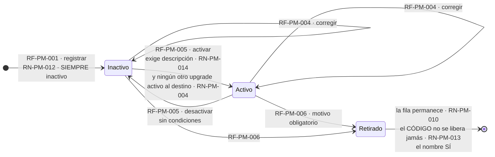
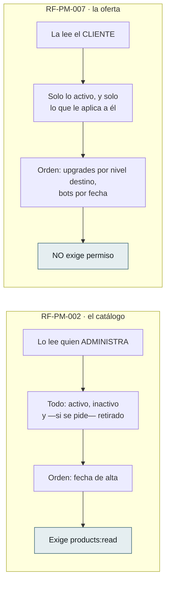
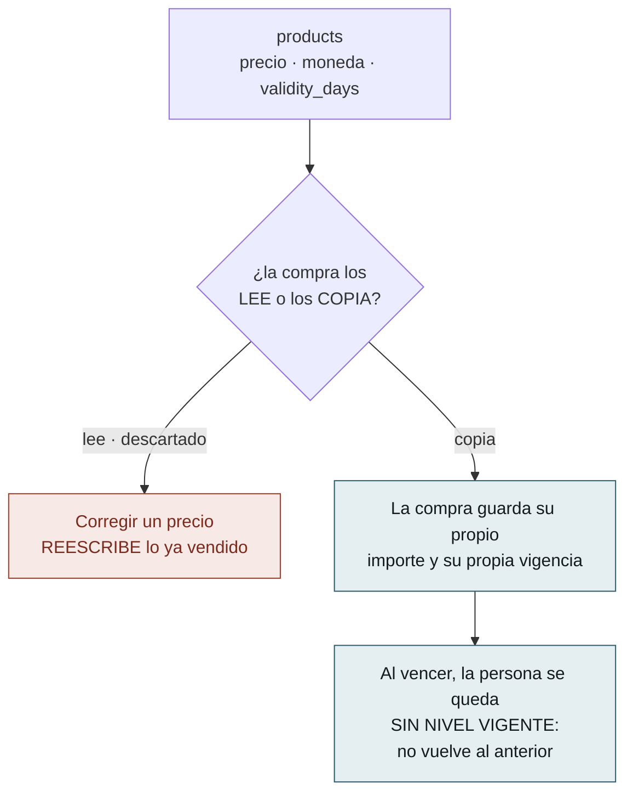
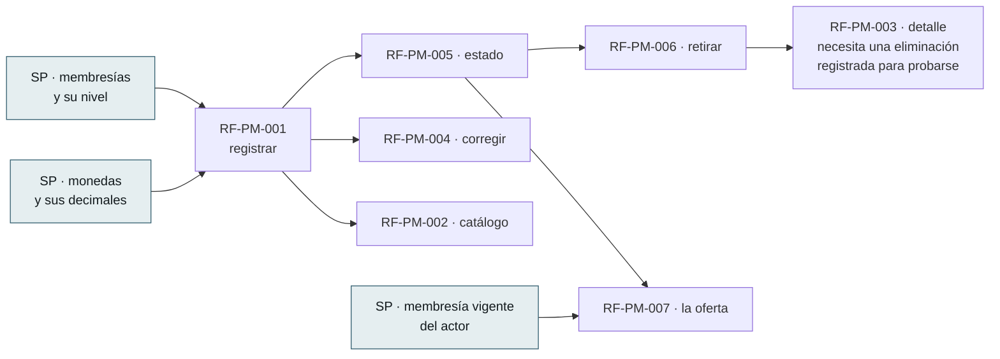

# Flujos del Módulo — `PM` Productos y Mercadeo

| Campo | Valor |
|---|---|
| Módulo | `PM` — Productos y Mercadeo |
| Versión | 0.1.0 |
| Estado | **Borrador** |
| Responsable | Bonilla Diaz William Steven |
| Fecha de creación | 01-09-2026 |
| Última actualización | 01-09-2026 |

!!! info "Qué va en este documento"

    La vista de conjunto de los **siete requerimientos** de `PM`: el ciclo de vida del producto, en qué se separan las dos consultas que el módulo publica, y qué queda congelado para quien venga después.

    No define comportamiento. Todo lo que aquí se dibuja está declarado en las tripletas de `docs/specs/pm/`; este documento solo lo hace visible. Ante cualquier discrepancia, **manda la spec**.

    El detalle de cada caso está en [Flujos por caso](flujos-por-caso.md).

---

## 1. Ciclo de vida del producto

**Nace inactivo**, y esa decisión gobierna medio módulo.

**Lo que el diagrama no puede dibujar y hay que leer en las specs:**

- **`RN-PM-004` se comprueba solo al activar**, y ese es el motivo de que el producto nazca inactivo. Naciendo activo habría que verificar «un solo upgrade activo por destino» en el alta **y** en la activación, y **la copia que se quedara atrás no fallaría: admitiría**.
- **Activar exige descripción y desactivar no exige nada.** Registrar un producto a medias es legítimo —está preparándose—; ofrecérselo a un cliente sin decirle qué se lleva, no.
- **El tipo y el código no tienen ninguna transición.** Son inmutables (`RN-PM-001`, `RN-PM-013`), y por eso `RF-PM-004` los rechaza explícitamente en vez de ignorarlos.
- **El código y el nombre se comportan al revés al retirar**, y es deliberado: el nombre queda libre porque es una etiqueta corregible; **el código no se libera jamás**, porque el día que una factura diga `UPGRADE_ORO` tiene que resolver a un solo producto para siempre.
- **Un producto vendido se retira igual.** La fila permanece y la compra guarda su propio importe, de modo que quien consulte su compra verá el producto retirado — consecuencia declarada, no defecto.

---

## 2. Las dos consultas no son la misma, y por eso son dos endpoints

Es la separación que más se malinterpreta del módulo.

**Fundirlas con un filtro habría dado a cada cliente el catálogo entero** para que pudiera ver tres líneas. Y la regla que decide qué se ofrece **vive en el servidor o no vive**: repetida en cada pantalla, la copia que se quedara atrás no fallaría — **ofrecería de más**.

**`/products/available` compite en forma con `/products/{id}`**, y Spring resuelve antes el segmento literal. Es correcto, y **por eso tiene prueba**: si alguien renombra, el síntoma sería un `400` por identificador inválido en la única ruta que un cliente usa a diario.

---

## 3. Lo que este módulo congela para quien venga después

`PM` escribió condiciones sobre **un módulo que todavía no existe**: el que registre las compras. Están en `requirements/pm.md` §1.4 desde el 26-08-2026.

**La condición se escribió antes de que hubiera dónde cumplirla**, y esa es la parte que conviene no perder: quien construya las compras **se la encontrará escrita** en lugar de tener que deducirla. Sin ella, corregir un precio reescribiría facturas ya emitidas.

**Y al vencer no se vuelve al nivel anterior**, porque eso habría exigido que la compra **guardase cuál era**: después de asignar el nuevo, esa información no está en ningún sitio.

---

## 4. Qué debe existir antes de qué

**El orden de implementación no fue el de los identificadores** —fue `001 → 002 → 005 → 006 → 003 → 004 → 007`— porque `RF-PM-003` devuelve el motivo del retiro y necesita una eliminación ya registrada contra la que probarse.

**Las tres cajas azules son D-25**: las tres lecturas que `SP` publica y `PM` importa. `RF-PM-007` estrena la tercera, y es la única que este módulo no podía construir hasta que existiera.

---

## 5. Qué deja cada operación

| Requerimiento | Escribe | Auditoría |
|---|---|---|
| `RF-PM-001` · registrar | `products`, siempre `INACTIVO` | Cambios |
| `RF-PM-002` a `RF-PM-003` · consultas | — | — |
| `RF-PM-004` · corregir | `products` | Cambios, con el antes y el después |
| `RF-PM-005` · estado | `products.status` | Cambios |
| `RF-PM-006` · retirar | `products.deleted_at` | Cambios **+ eliminación** con motivo e instantánea |
| `RF-PM-007` · la oferta | — | — |

**Ninguna operación de este módulo emite evento de seguridad**, ni siquiera el retiro. Es una decisión declarada y no un olvido: **un producto no concede privilegios**, y el catálogo de `security.md` §8.1 es cerrado.

---

## 6. Lo que el dibujo dejó a la vista

| # | Observación | Dónde se resuelve |
|---|---|---|
| 1 | **`RF-PM-001` tiene un hueco en su numeración de excepciones**: va de `EX-003` a `EX-005`. No es un error — `EX-004` **existe tachada**: era «ya hay un upgrade activo hacia ese destino» y **migró a `RF-PM-005`** cuando el producto pasó a nacer inactivo. El número se deja vacío a propósito, para que la migración de la regla quede a la vista | `spec.md` §10 de `RF-PM-001` |
| 2 | **`RF-PM-007` es el único requerimiento del módulo sin ninguna excepción tipificada.** No admite entrada, de modo que no hay nada que rechazar: sus tres caminos son alternativos, no errores | `spec.md` §10 de `RF-PM-007` |
| 3 | **Dos reglas se comprueban en sitios distintos siendo la misma pregunta**: `RN-PM-007` —los decimales según la moneda— vive en el dominio porque un `CHECK` no consulta `currencies`, y `RN-PM-006` —precio mayor que cero— sí está en el esquema. Quien busque «dónde se valida el precio» encontrará dos sitios | `requirements/pm.md` §10.3 |
| 4 | **El motivo del retiro lo devuelve el detalle y no el listado**, y esa asimetría enmendó a posteriori el motivo con el que se había aprobado `RF-PM-002` — la decisión no cambió, su justificación se reescribió | `requirements/pm.md` §11 v0.5.0 |
| 5 | **`RF-PM-005` es el único requerimiento cuya excepción depende del estado al que se va, no del actual.** Desactivar no tiene condiciones; activar tiene dos. Un diagrama de estados con transiciones simétricas lo escondería | `EX-002` de `RF-PM-005` |

---

## 7. Control de cambios

| Versión | Fecha | Cambio | Responsable |
|---|---|---|---|
| 0.1.0 | 01-09-2026 | Creación. `PM` era, junto a `CM`, uno de los dos módulos sin documentos de flujo pese a tener sus siete requerimientos construidos. Se dibujan el **ciclo de vida del producto** —con `RN-PM-004` comprobándose en un solo sitio, que es el motivo de que nazca inactivo—, la **separación entre catálogo y oferta**, y **lo que este módulo congeló para un módulo que todavía no existe**. §6 recoge cinco observaciones, entre ellas el **hueco deliberado en la numeración de excepciones de `RF-PM-001`**: `EX-004` está tachada porque la regla migró a `RF-PM-005`. | Responsable técnico |
