# Flujos por caso de uso — `PM` Productos y Mercadeo

| Campo | Valor |
|---|---|
| Módulo | `PM` — Productos y Mercadeo |
| Versión | 0.5.0 |
| Estado | **Borrador** |
| Responsable | Bonilla Diaz William Steven |
| Fecha de creación | 01-09-2026 |
| Última actualización | 16-09-2026 |

!!! info "Qué va en este documento"

    Un diagrama por caso de uso: qué puede hacer el actor, qué verifica el sistema en cada paso y por dónde sale la operación cuando una verificación falla.

    Cada diagrama es la transcripción literal de las **§8 Flujo principal**, **§9 Flujos alternativos** y **§10 Excepciones** de su spec. No añade comportamiento. Ante cualquier discrepancia, **manda la spec**.

!!! note "Convención de los diagramas"

    | Forma | Significado |
    |---|---|
    | Cápsula | Acción del actor, o respuesta final del sistema |
    | Rombo | Verificación del sistema |
    | Rectángulo | Paso del sistema que produce efecto |
    | Recuadro rojo | Rechazo tipificado, con su identificador `EX-00n` |
    | Línea punteada | Flujo alternativo `FA-00n`: no es error |

---

## 1. El catálogo

### `RF-PM-001` · Registrar un producto

Un alta para los dos tipos, con la condición cruzada que los separa.

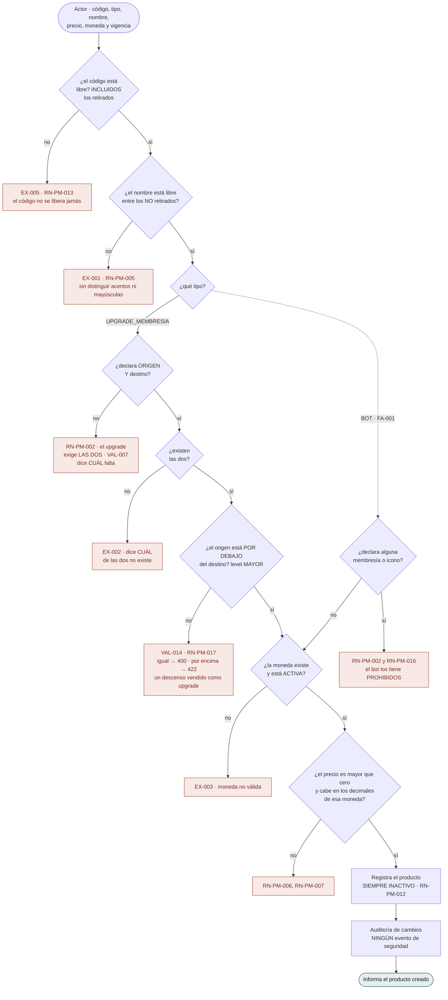

**Las dos primeras verificaciones se comportan al revés a propósito.** El **código** se comprueba contra **todos** los productos, incluidos los retirados; el **nombre**, solo contra los vivos. El nombre es una etiqueta que `RF-PM-004` deja corregir; el código es lo que una factura usará para siempre.

**`RN-PM-002` va en los dos sentidos, y desde el 02-09-2026 sobre las DOS membresías.** Un upgrade sin origen o sin destino es inservible; un **bot con cualquiera de las dos promete un cambio de nivel que nadie va a aplicar**. No falla: promete. Con dos campos, el rechazo **dice cuál** de los cuatro casos se dio — un mensaje que no distinga obliga a probar los dos.

**El origen se declara y no se deduce, y esa es la razón de la enmienda.** Mientras se deducía —«cualquiera por debajo del destino»— el **salto era imposible**: «subir a `ORO`» era el mismo producto y el mismo precio para quien sube un escalón y para quien sube tres. Ahora **cada salto es un producto** (`RN-PM-018`).

**El rombo de `RN-PM-017` produce dos códigos distintos a propósito.** Origen **igual** al destino lo ve el agregado —le basta comparar dos identificadores— y es `400`; origen **por encima** exige leer el `level` de dos filas de `memberships` y es `422`, porque el dato existe y lo que no vale es la relación entre los dos.

**Falta `EX-004` y no es un error.** Está **tachada** en la spec: era «ya hay un upgrade activo hacia ese destino» y **migró a `RF-PM-005`** cuando se decidió que el producto naciera inactivo. El número se deja vacío para que la migración de la regla quede a la vista. Al migrar cambió además de forma: hoy la regla se cuenta **por pareja origen→destino**.

---

### `RF-PM-004` · Corregir un producto

**`V5` tuvo un defecto que la prueba de camino feliz no veía**, y conviene que quede dibujado: el precio **leído de la base** viene con la escala de la columna —`numeric(14,4)`, de modo que `49.99` llega como `49.9900`—, y compararlo en crudo daba cuatro decimales contra los dos de la moneda. El síntoma era exacto: **cambiar solo la moneda, sin tocar el precio, se rechazaba por decimales que ese precio no tiene**. Se compara la escala **significativa**.

**El precio se puede corregir siempre**, y de ahí sale la condición que este módulo le impone a quien registre las compras: cada compra guarda su propio importe, o corregir un precio reescribiría facturas ya emitidas.

**No se exige motivo**, al revés que al retirar: la auditoría ya registra qué cambió, de cuánto a cuánto, quién y cuándo, y exigirlo en cada coma llena ese campo de «ajuste».

---

### `RF-PM-005` · Cambiar el estado

El único caso del módulo cuyas condiciones **dependen del estado al que se va**, no del actual.

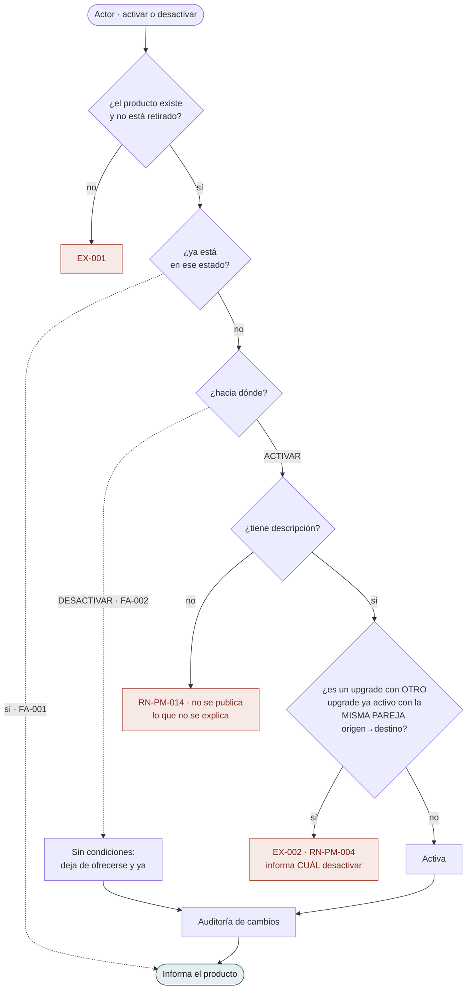

**La asimetría es el requerimiento.** Activar exige dos cosas; desactivar, ninguna. Un diagrama de estados con transiciones simétricas lo escondería, y por eso aquí se bifurca.

**`RN-PM-004` se comprueba aquí y en ningún otro sitio**, y esa es la razón de que el producto nazca inactivo. Con dos copias —una en el alta y otra aquí— la que se quedara atrás **no fallaría: admitiría**. Dos upgrades activos **con la misma pareja origen→destino** son **dos precios simultáneos para lo mismo**, y eso no se descubre como un error: se descubre como una discrepancia de facturación meses después.

**Lo que cambió el 02-09-2026 es qué cuenta como «lo mismo».** Dos upgrades hacia `ORO`, uno desde `BECA` y otro desde `PLATINO`, **no compiten**: venden saltos distintos, y que cuesten distinto es lo normal. La regla anterior —una por destino— prohibía exactamente lo que el origen existe para permitir.

**`EX-002` informa cuál desactivar.** Saber que hay un conflicto sin saber con qué deja al actor buscando a ciegas.

---

### `RF-PM-006` · Retirar un producto

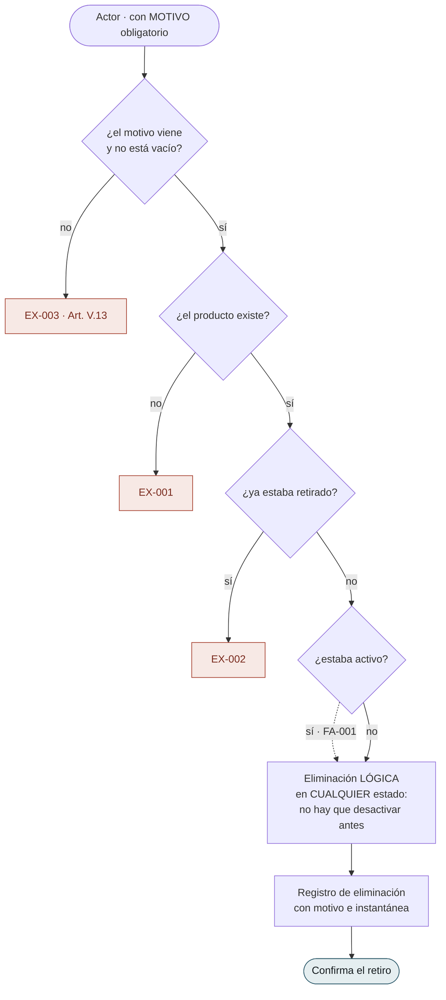

**No hay que desactivar antes, y el motivo es sutil.** Exigir el paso previo haría que **todos** los registros de eliminación dijeran «inactivo», destruyendo el dato que se conserva para saber si el producto estaba a la venta cuando se retiró. El motivo obligatorio ya es la barrera.

**La ruta es `POST /{id}/deletion` y no `DELETE`**: la RFC 9110 no define semántica para el cuerpo de un `DELETE` y un intermediario puede descartarlo, con lo que la petición llegaría **sin el motivo** que el Art. V.13 exige.

---

## 2. Las dos consultas

### `RF-PM-002` · Consultar el catálogo

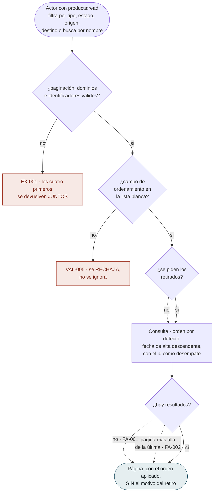

**El campo de ordenamiento fuera de la lista blanca se rechaza y no se ignora**: ignorarlo devolvería un orden distinto del pedido **sin decirlo**.

**El identificador es el desempate, y sale gratis.** Sin un orden total, dos productos que compartan el valor ordenado pueden repetirse o saltarse entre páginas — y eso se descubre como «faltan productos», sin ningún error de por medio. El `id` es un UUID v7, de modo que su orden **es** el cronológico.

**No lleva el motivo del retiro**, y la sentencia ni siquiera lo selecciona — que es lo único que hace verificable el criterio. Uno a uno es una consulta; en bloque sería una exportación de decisiones comerciales.

---

### `RF-PM-003` · Consultar el detalle

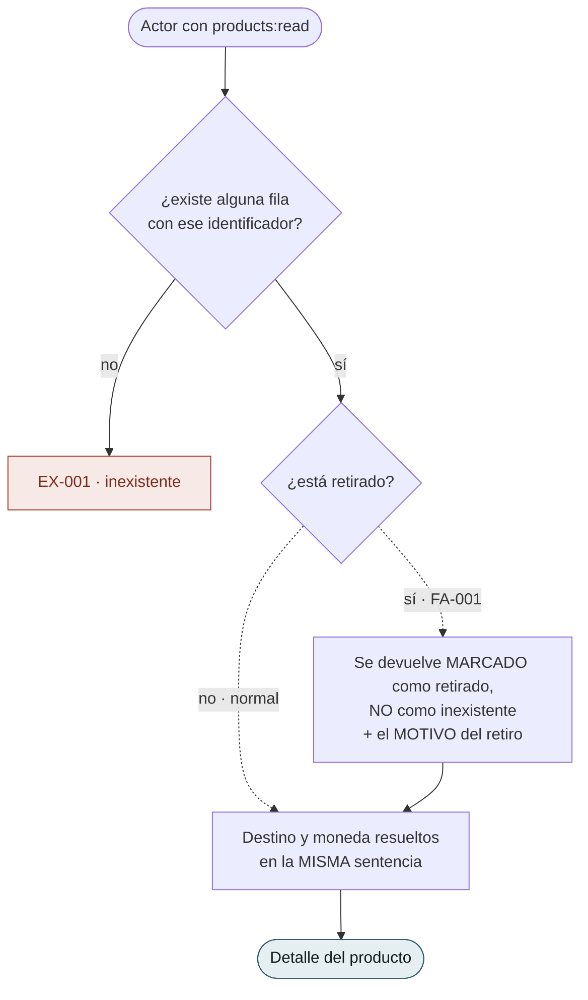

**Un producto retirado se devuelve, no se oculta**, al revés que un rol eliminado. El catálogo **conserva** lo retirado a propósito: entender por qué algo dejó de venderse es media razón de existir del módulo.

**Devuelve el motivo del retiro a quien tenga `products:read`**, y esa decisión se tomó a conciencia: delante de un producto retirado «por qué» es la pregunta de todo el mundo, y obligar a cambiar de pantalla convierte la auditoría en un trámite. La consecuencia está asumida por escrito — `products:read` alcanza a un dato que en la auditoría acota `audit:read-deletions`.

**No devuelve autoría**: el Art. V.7 mantiene las columnas de actor fuera de las tablas.

---

### `RF-PM-007` · Consultar la oferta propia

El único requerimiento del módulo **sin ninguna excepción tipificada**: no admite entrada, así que no hay nada que rechazar.

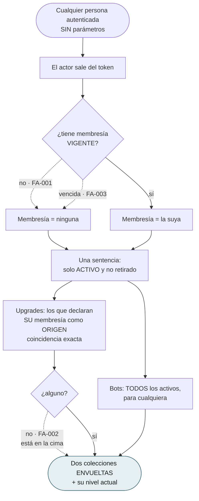

**`FA-001` y `FA-003` van al mismo sitio, y decirlo importa.** Vencer no es lo mismo que no tener, pero para decidir «a dónde puede subir» produce el mismo resultado. Y la vigencia **la calcula `SP`**: reimplementarla aquí es el defecto que devuelve resultados plausibles durante meses.

**Aquí ya no se comparan niveles**, desde el 02-09-2026. La oferta es una **coincidencia exacta**: los upgrades cuyo origen es la membresía del actor. **La comparación no desapareció, se mudó** — se hace una vez, al registrar el producto (`RN-PM-017`), en lugar de en cada consulta.

**Y `FA-001` sale del propio filtro**: quien no tiene membresía no coincide con ningún origen. Antes había que escribirlo aparte. Lo mismo con el upgrade **hacia** el nivel que ya se tiene: no se ofrece porque su origen es otro, sin que nadie lo prohíba expresamente.

**Lo que se paga por ello conviene tenerlo delante**: si nadie declara un upgrade desde `VIP`, quien esté en `VIP` **no ve ninguna subida** — sin error y sin aviso, y el catálogo se ve perfectamente bien desde administración. La cobertura de la cadena deja de ser automática.

**Las dos colecciones van envueltas** para que el día que los bots crezcan, añadir paginación no rompa a ningún cliente.

---

## 3. Los paquetes

Diez casos desde el 15-09-2026, dibujados **en el orden de construcción** de `requirements/pm.md` §6.1 y no en el de los identificadores. Todos comparten un rombo —«¿el paquete existe y está vivo?»— que en las escrituras va con **`FOR UPDATE`**: el paquete es lo que se bloquea, y el producto nunca.

### `RF-PM-017` · Registrar un paquete

El alta del producto, sin precio y sin productos.

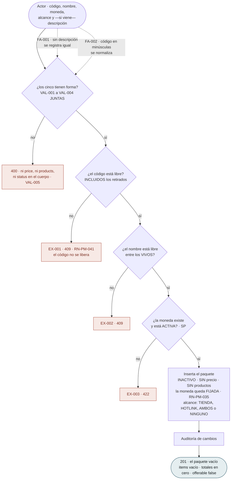

**El cuerpo no admite `price`**, y el rechazo es deliberado: aceptarlo y descartarlo haría creer que el paquete tiene un precio propio. **Tampoco `products`**: los productos entran uno a uno por `RF-PM-023`, donde cada uno tiene sus siete verificaciones. Las dos unicidades se comportan como las del producto —código contra todos, nombre contra los vivos— y tienen su red en `uq_product_packages_code` y `uq_product_packages_name`.

---

### `RF-PM-023` · Asociar un producto

**La operación que define al paquete**: siete verificaciones en fila, y cada una con su mensaje.

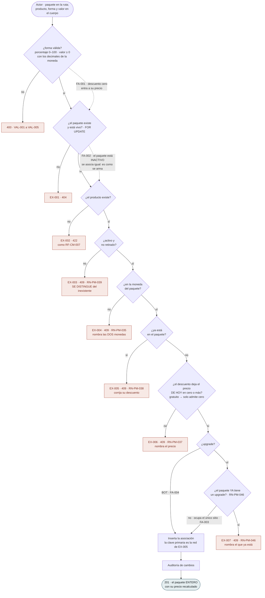

**`EX-002` es `422` y `EX-003` es `409`, y el salto es deliberado.** El producto inexistente es un dato del cuerpo que no resuelve —el trato de `RF-CM-007`—; el producto inactivo **existe**, y quien llama tiene `packages:update`, ve el catálogo entero y merece saber por qué no entra. Es lo contrario de la lista pública de reseñas, que no distingue.

**El último rombo es el que evita el paquete que nadie puede comprar.** Un paquete con upgrades desde `BECA` y desde `PLATINO` no se le puede ofrecer a nadie entero; dejarlo asociar produciría un paquete bien configurado que la oferta oculta para siempre. Se rechaza aquí porque es el único sitio donde el error tiene a alguien delante. **Los bots no fijan origen ni lo miran.**

---

### `RF-PM-021` · Cambiar el estado

Como en el producto, las condiciones dependen del estado **al que se va**.

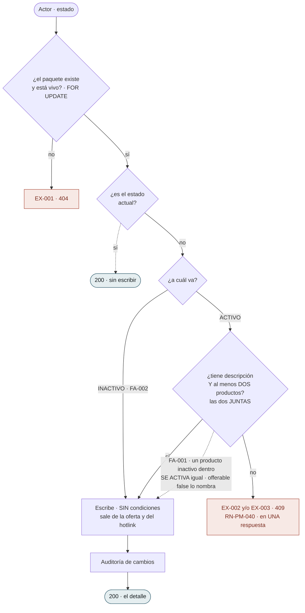

**Activar mira lo que es del paquete y no lo que es de sus productos.** Descripción y cuántos son suyos; que los productos estén activos hoy es de cada producto, cambia sin que el paquete se entere, y por eso lo mira la oferta **cada vez** (`RN-PM-039`). Los dos motivos del `409` **van juntos**: quien activó un paquete vacío y sin descripción corrige una vez.

---

### `RF-PM-024` · Corregir un descuento

Forma **y** valor, juntos y obligatorios: son un solo dato.

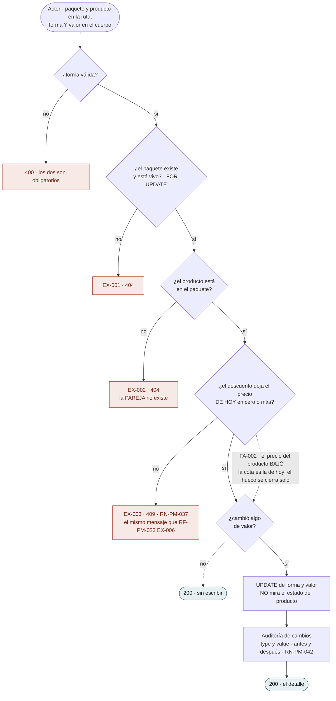

**`EX-002` es `404` y no distingue «el producto no existe» de «no está aquí»**: lo que se corrige es la pareja, y la pareja no existe. **Y no mira el estado del producto**: la fila existe, el descuento es del paquete, y un producto inactivo dentro puede corregirse igual — lo que decide si se ofrece es la oferta.

---

### `RF-PM-025` · Desasociar un producto

Sin cuerpo, sin motivo, y con el paquete de vuelta.

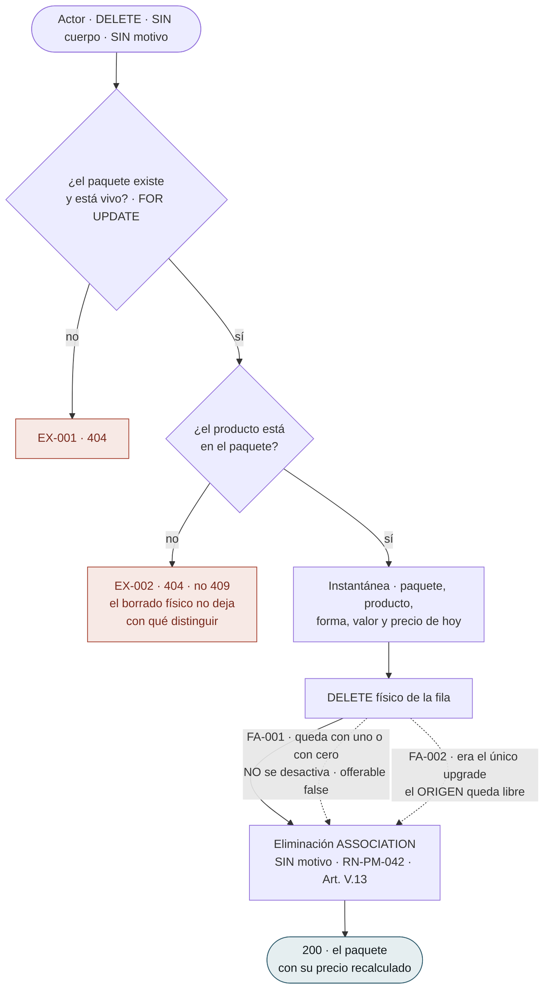

**Responde `200` con el paquete y no `204`**, porque lo que cambió es su precio. **Y es el único borrado físico del módulo**: la fila es una asociación (Art. V.13), y el registro de eliminación guarda el descuento en la instantánea para que la auditoría diga qué rebaja tenía el producto cuando salió.

---

### `RF-PM-020` · Editar un paquete

Nombre, descripción y alcance. **Código y moneda se rechazan, no se ignoran.**

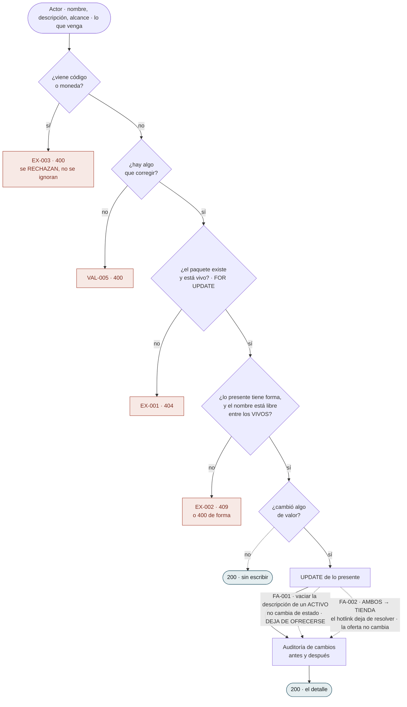

**La moneda es inmutable porque es la unidad en la que se suma**: cambiarla dejaría los descuentos fijos expresados en otra cosa y el paquete con un precio que no es de nadie. Y **vaciar la descripción de un paquete activo se permite**, como en el producto: no lo desactiva, lo saca de la oferta hasta que vuelva a tenerla (`RN-PM-040`), y el detalle lo dice.

---

### `RF-PM-022` · Retirar un paquete

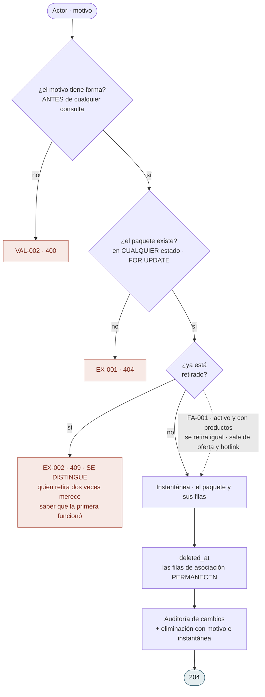

**Las filas de asociación no se borran al retirar el paquete.** Quedan bajo el retirado para que el detalle administrativo siga diciendo qué tenía dentro y con qué descuento — la instantánea de la eliminación las lleva también, pero la instantánea es auditoría y las filas son catálogo. **Los productos no cambian**: eran suyos antes del paquete y lo siguen siendo después.

---

### `RF-PM-019` · Consultar el detalle

La lectura de administración: **todo**, con la cuenta hecha y el motivo de lo que la detiene.

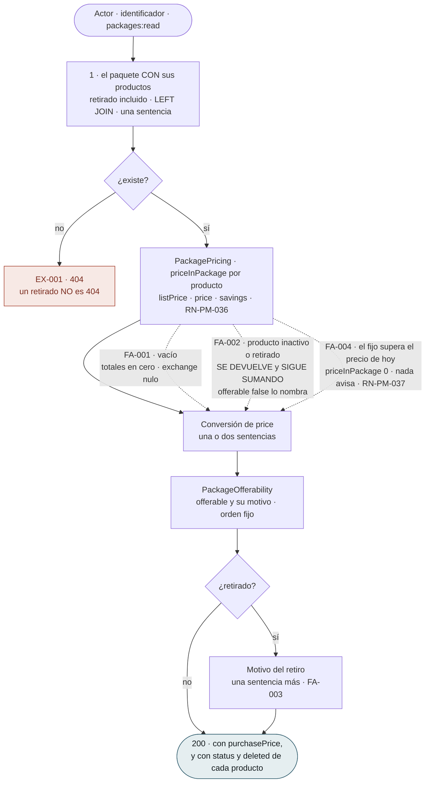

**El producto inactivo se devuelve y sigue sumando**, porque esta es la única pantalla desde la que se arregla: ocultarlo dejaría el paquete en `offerable: false` sin nada visible que lo explique. **Tres, cuatro o cinco sentencias**: paquete con productos, moneda de casa, tasa si hay algo que convertir, y el motivo si está retirado — la misma escalera que `RF-PM-003`.

---

### `RF-PM-018` · Consultar los paquetes

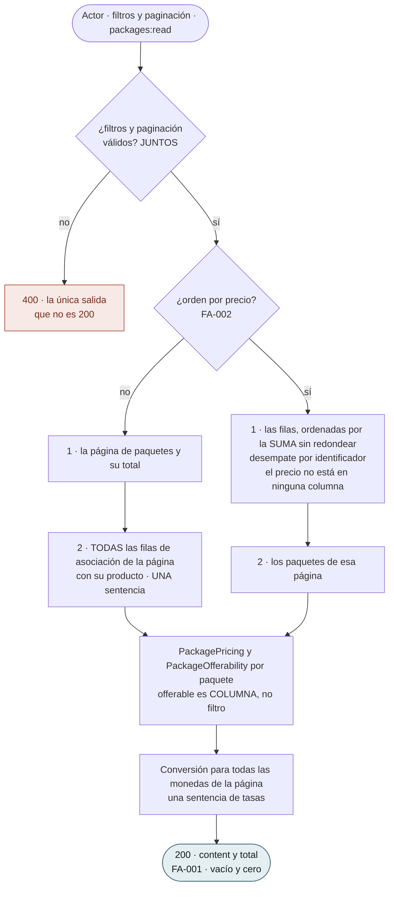

**Ordenar por precio invierte el orden de las sentencias**, y es la consecuencia más visible de que el precio se calcule: no hay columna por la que ordenar la página, así que se ordena la sentencia de filas por la suma sin redondear y los paquetes se traen después. **`offerable` es columna y no filtro**: quien administra quiere ver precisamente los que no se ofrecen.

---

### `RF-PM-026` · El hotlink del paquete

Público, y con **un solo `404`** para todo lo que no procede.

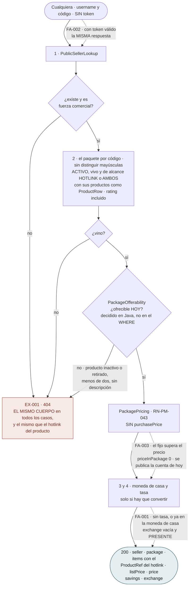

**El paquete no ofrecible responde lo mismo que el inexistente**, y es la diferencia con el detalle: distinguirlos publicaría, sin token, que el paquete existe y qué le pasa. Quien tiene que saberlo es administración, y lo sabe por `RF-PM-019` con permiso. **La ofrecibilidad se decide en Java y no en el `WHERE`** para que `RN-PM-039` viva en un solo sitio. **Y el alcance de los productos no filtra dentro del paquete**: el canal lo decide el paquete.

---

### `RF-PM-007` · La oferta gana `packages` — enmienda del 15-09-2026

El diagrama de §2 no cambia; **se le añade una tercera colección** con su propio filtro.

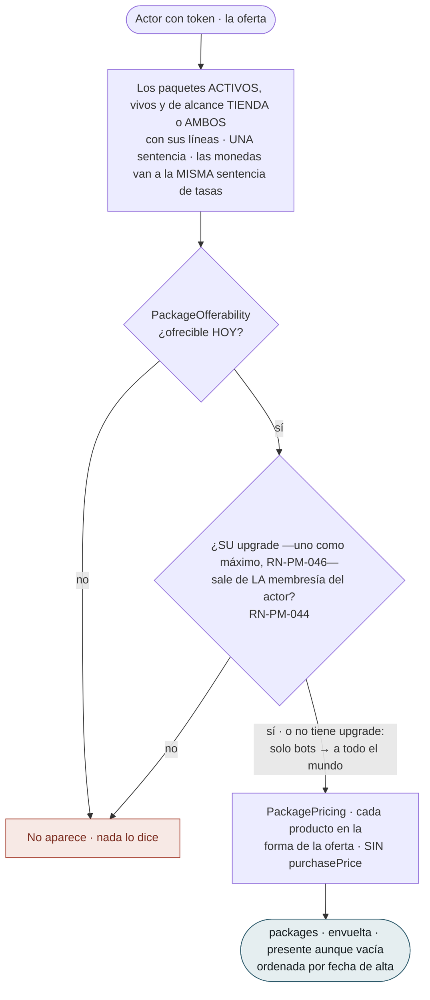

**Es `RN-PM-011` aplicada al paquete entero.** Un paquete se ofrece a quien puede comprarlo **todo**: como lleva un upgrade como máximo (`RN-PM-046`, comprobado al asociar desde el 16-09-2026; antes, «comparten origen»), basta comparar el origen de ese upgrade con la membresía vigente del actor (`RN-PM-044`). Sin membresía solo se ven los paquetes de bots — igual que sin membresía solo se ven bots. **La construye `RF-PM-019`** (`T-11`, `T-12`), porque es donde nacen las dos piezas que necesita.

---

## 4. Lo que el dibujo dejó a la vista

| # | Observación | Dónde se resuelve |
|---|---|---|
| 1 | **`RF-PM-001` salta de `EX-003` a `EX-005`.** No falta nada: `EX-004` está **tachada** en la spec porque la regla —«ya hay un upgrade activo hacia ese destino»— **migró a `RF-PM-005`** al decidirse que el producto nace inactivo. El hueco es deliberado y deja la migración a la vista | `spec.md` §10 de `RF-PM-001` |
| 2 | **`RF-PM-001` verifica dos unicidades con criterios opuestos en pasos consecutivos** —el código contra todos, el nombre solo contra los vivos—, y el diagrama las pone una encima de otra. Es de las pocas asimetrías del sistema que se entienden mejor viéndolas juntas | `RN-PM-005`, `RN-PM-013` |
| 3 | **`RN-PM-002` y `RN-PM-016` se comprueban en el mismo rombo y no son la misma regla.** La primera obliga y prohíbe —destino en el upgrade, prohibido en el bot—; la segunda **solo prohíbe**, porque un upgrade sin icono es un producto normal | `requirements/pm.md` §5.2 |
| 4 | **Las dos consultas del módulo tienen actores, permisos y órdenes distintos**, y la única forma de ver que no son variantes de la misma es ponerlas al lado. Fundirlas con un filtro habría dado a cada cliente el catálogo entero | `flujos-del-modulo.md` §2 |
| 5 | **`RF-PM-007` es el único caso del sistema cuyo diagrama no tiene ni un solo recuadro rojo.** No admite entrada: sus tres caminos son alternativos y ninguno es un error | `spec.md` §10 de `RF-PM-007` |
| 6 | **`RF-PM-004` guarda un defecto ya corregido que conviene no repetir**: comparar el precio en crudo contra los decimales de la moneda falla, porque lo leído de la base viene con la escala de la columna. El síntoma era cambiar **solo** la moneda y ver rechazado un precio que sí cabía | `ProductPrice.cabeEn` |
| 7 | **`RF-PM-023` pasa de `422` a `409` entre dos rombos consecutivos sobre el mismo producto.** Inexistente es un dato del cuerpo que no resuelve; inactivo **existe**, y quien llama tiene permiso para saber por qué no entra. Es la asimetría opuesta a la de las reseñas, donde ambos son el mismo `404` | `RF-PM-023` `EX-002` y `EX-003` |
| 8 | **`RF-PM-024` y `RF-PM-025` tienen la misma `EX-002` —`404`, «ese producto no está en el paquete»— por razones distintas.** En la corrección, porque lo que se edita es la pareja y la pareja no existe; en la desasociación, porque el borrado físico no deja con qué distinguir «nunca estuvo» de «ya se quitó» | `RF-PM-024` §10, `RF-PM-025` §10 |
| 9 | **La misma pregunta —«¿el descuento deja el precio de hoy en cero o más?»— aparece en tres diagramas con tres efectos.** En `RF-PM-023` y `RF-PM-024` es un rombo que rechaza; en `RF-PM-019` es un flujo alternativo que **cuenta cero y no avisa**. No es incoherencia: la cota se comprueba cuando alguien escribe, y el precio del producto puede bajar después sin que nadie escriba en el paquete | `RN-PM-037` |
| 10 | **`RF-PM-026` es el diagrama con un solo recuadro rojo al que llegan cuatro flechas.** Vendedor, paquete, ofrecibilidad y —dentro de la sentencia— estado, retiro y alcance, todos al mismo `404` con el mismo cuerpo. Un diagrama con siete recuadros habría sido más fiel al código y **menos fiel a la decisión** | `RF-PM-026` §10 |
| 11 | **`RF-PM-017` es el único alta del sistema cuya validación de campos desconocidos nombra tres campos concretos**: `price`, `products` y `status`. Los tres son los que alguien que viene del alta de producto intentaría mandar, y los tres tienen respuesta en otro sitio — la cuenta, `RF-PM-023` y `RF-PM-021` | `RF-PM-017` `VAL-005` |

---

## 5. Control de cambios

| Versión | Fecha | Cambio | Responsable |
|---|---|---|---|
| 0.5.0 | 16-09-2026 | **Un paquete lleva UN upgrade como máximo** (`requirements/pm.md` v0.38.0, `RN-PM-046`): en el diagrama de `RF-PM-023` el rombo del origen pasa a «¿ya tiene un upgrade?» y `EX-007` nombra el que está; en el de la oferta (`RF-PM-007`) el filtro mira **el** upgrade. | Responsable técnico |
| 0.4.0 | 15-09-2026 | **Los diez casos quedan construidos** y tres diagramas se retocan con lo que cambió entre el dibujo y el código: el **alta** nombra los cuatro valores del alcance, el **hotlink del paquete** publica `HOTLINK` o `AMBOS`, y la **oferta** trae los paquetes de alcance `TIENDA` o `AMBOS` en **una** sentencia y no dos. El resto se construyó como estaba dibujado; las cuentas de sentencias reales quedaron en `CA-PM-284` y `CA-PM-338`. | Responsable técnico |
| 0.3.0 | 15-09-2026 | **Diez casos nuevos: los paquetes** (`RF-PM-017` a `RF-PM-026`), transcritos de las §8, §9 y §10 de sus tripletas y dibujados **en el orden de construcción**, más el diagrama de la **enmienda de `RF-PM-007`** —la oferta gana `packages`—. El que más aporta es `RF-PM-023`, la asociación: **siete rombos en fila** que cambian de `422` a `409` sobre el mismo producto y terminan en el que evita el paquete que nadie podría comprar. Le sigue `RF-PM-026`, con **un solo recuadro rojo al que llegan cuatro flechas**. §4 gana cinco observaciones, entre ellas que la misma pregunta sobre la cota del descuento aparece en tres diagramas con tres efectos. | Responsable técnico |
| 0.2.0 | 02-09-2026 | **El upgrade declara de dónde sale**, y tres diagramas cambian. El del **alta** gana un rombo —`RN-PM-017`, el origen por debajo del destino— que produce **dos códigos distintos a propósito**: origen igual al destino es `400` porque lo ve el agregado, y origen por encima es `422` porque exige el `level` de dos filas de `memberships`. El del **cambio de estado** deja de contar «un upgrade activo por destino» y pasa a contarlo **por pareja origen→destino**: dos upgrades hacia `ORO`, uno desde `BECA` y otro desde `PLATINO`, ya no compiten. Y el de la **oferta propia** pierde su comparación de niveles entera: pasa a ser una **coincidencia exacta** por origen, con lo que `FA-001` y el upgrade hacia el nivel que ya se tiene salen **del propio filtro** en lugar de estar escritos aparte. Queda anotado lo que se paga: si nadie declara un upgrade desde `VIP`, quien esté en `VIP` no ve ninguna subida — sin error y sin aviso. | Responsable técnico |
| 0.1.0 | 01-09-2026 | Creación. Un diagrama por cada uno de los **siete** casos de uso, transcritos de las §8, §9 y §10 de sus tripletas. Los dos que más aportan son `RF-PM-005` —donde se ve que las condiciones **dependen del estado al que se va y no del actual**, cosa que un diagrama de estados simétrico esconde— y `RF-PM-001`, que pone en pasos consecutivos **dos unicidades con criterios opuestos**. §3 recoge seis observaciones, entre ellas el **hueco deliberado de `EX-004`**, tachada porque su regla migró a otro requerimiento. | Responsable técnico |
