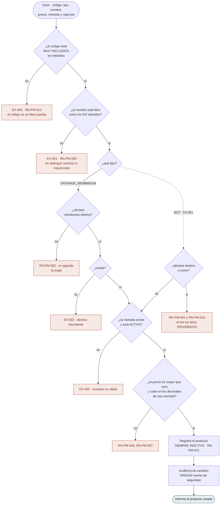
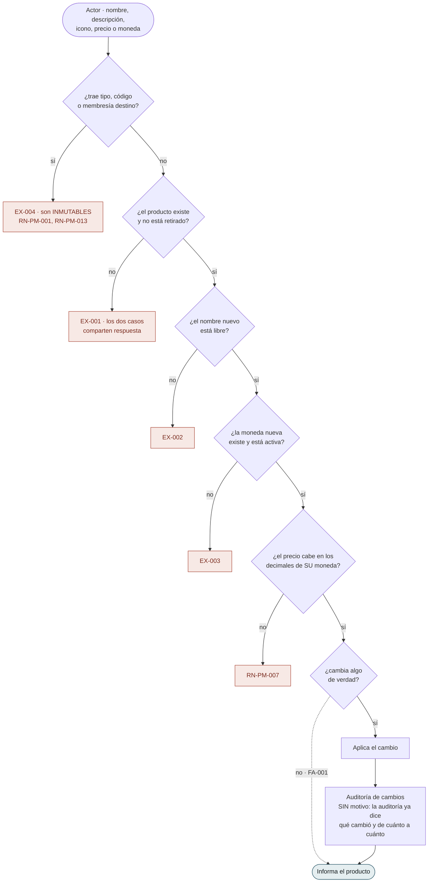
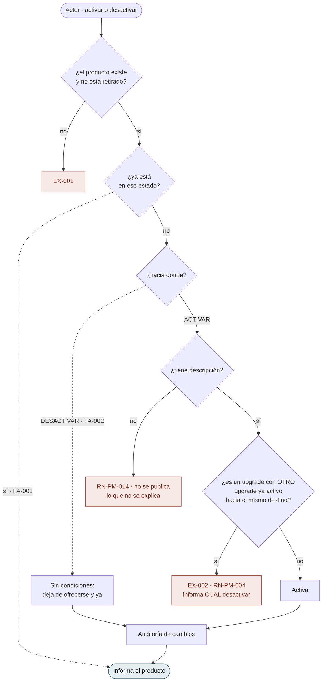
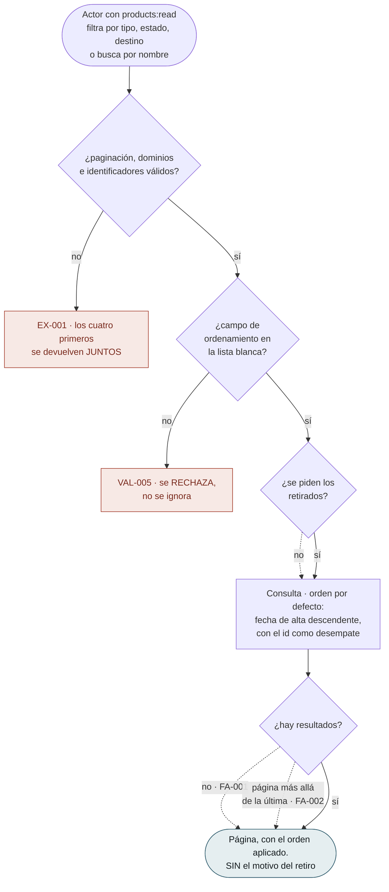
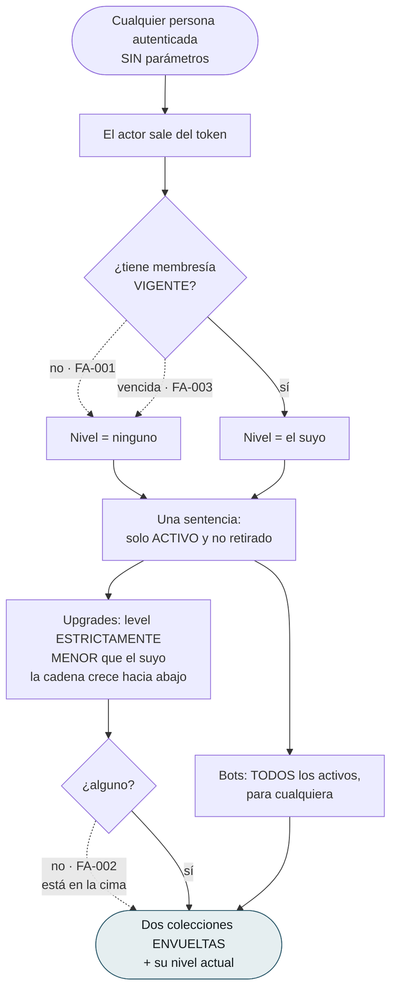

# Flujos por caso de uso — `PM` Productos y Mercadeo

| Campo | Valor |
|---|---|
| Módulo | `PM` — Productos y Mercadeo |
| Versión | 0.1.0 |
| Estado | **Borrador** |
| Responsable | Bonilla Diaz William Steven |
| Fecha de creación | 01-09-2026 |
| Última actualización | 01-09-2026 |

!!! info "Qué va en este documento"

    Un diagrama por caso de uso: qué puede hacer el actor, qué verifica el sistema en cada paso y por dónde sale la operación cuando una verificación falla.

    Cada diagrama es la transcripción literal de las **§8 Flujo principal**, **§9 Flujos alternativos** y **§10 Excepciones** de su spec. No añade comportamiento. Ante cualquier discrepancia, **manda la spec**.

!!! note "Convención de los diagramas"

    | Forma | Significado |
    |---|---|
    | Cápsula | Acción del actor, o respuesta final del sistema |
    | Rombo | Verificación del sistema |
    | Rectángulo | Paso del sistema que produce efecto |
    | Recuadro rojo | Rechazo tipificado, con su identificador `EX-00n` |
    | Línea punteada | Flujo alternativo `FA-00n`: no es error |

---

## 1. El catálogo

### `RF-PM-001` · Registrar un producto

Un alta para los dos tipos, con la condición cruzada que los separa.

**Las dos primeras verificaciones se comportan al revés a propósito.** El **código** se comprueba contra **todos** los productos, incluidos los retirados; el **nombre**, solo contra los vivos. El nombre es una etiqueta que `RF-PM-004` deja corregir; el código es lo que una factura usará para siempre.

**`RN-PM-002` va en los dos sentidos, y la mitad que se olvida es la segunda.** Un upgrade sin destino es inservible; un **bot con destino promete un cambio de nivel que nadie va a aplicar**. No falla: promete.

**Falta `EX-004` y no es un error.** Está **tachada** en la spec: era «ya hay un upgrade activo hacia ese destino» y **migró a `RF-PM-005`** cuando se decidió que el producto naciera inactivo. El número se deja vacío para que la migración de la regla quede a la vista.

---

### `RF-PM-004` · Corregir un producto

**`V5` tuvo un defecto que la prueba de camino feliz no veía**, y conviene que quede dibujado: el precio **leído de la base** viene con la escala de la columna —`numeric(14,4)`, de modo que `49.99` llega como `49.9900`—, y compararlo en crudo daba cuatro decimales contra los dos de la moneda. El síntoma era exacto: **cambiar solo la moneda, sin tocar el precio, se rechazaba por decimales que ese precio no tiene**. Se compara la escala **significativa**.

**El precio se puede corregir siempre**, y de ahí sale la condición que este módulo le impone a quien registre las compras: cada compra guarda su propio importe, o corregir un precio reescribiría facturas ya emitidas.

**No se exige motivo**, al revés que al retirar: la auditoría ya registra qué cambió, de cuánto a cuánto, quién y cuándo, y exigirlo en cada coma llena ese campo de «ajuste».

---

### `RF-PM-005` · Cambiar el estado

El único caso del módulo cuyas condiciones **dependen del estado al que se va**, no del actual.

**La asimetría es el requerimiento.** Activar exige dos cosas; desactivar, ninguna. Un diagrama de estados con transiciones simétricas lo escondería, y por eso aquí se bifurca.

**`RN-PM-004` se comprueba aquí y en ningún otro sitio**, y esa es la razón de que el producto nazca inactivo. Con dos copias —una en el alta y otra aquí— la que se quedara atrás **no fallaría: admitiría**. Dos upgrades activos al mismo nivel son **dos precios simultáneos para lo mismo**, y eso no se descubre como un error: se descubre como una discrepancia de facturación meses después.

**`EX-002` informa cuál desactivar.** Saber que hay un conflicto sin saber con qué deja al actor buscando a ciegas.

---

### `RF-PM-006` · Retirar un producto

**No hay que desactivar antes, y el motivo es sutil.** Exigir el paso previo haría que **todos** los registros de eliminación dijeran «inactivo», destruyendo el dato que se conserva para saber si el producto estaba a la venta cuando se retiró. El motivo obligatorio ya es la barrera.

**La ruta es `POST /{id}/deletion` y no `DELETE`**: la RFC 9110 no define semántica para el cuerpo de un `DELETE` y un intermediario puede descartarlo, con lo que la petición llegaría **sin el motivo** que el Art. V.13 exige.

---

## 2. Las dos consultas

### `RF-PM-002` · Consultar el catálogo

**El campo de ordenamiento fuera de la lista blanca se rechaza y no se ignora**: ignorarlo devolvería un orden distinto del pedido **sin decirlo**.

**El identificador es el desempate, y sale gratis.** Sin un orden total, dos productos que compartan el valor ordenado pueden repetirse o saltarse entre páginas — y eso se descubre como «faltan productos», sin ningún error de por medio. El `id` es un UUID v7, de modo que su orden **es** el cronológico.

**No lleva el motivo del retiro**, y la sentencia ni siquiera lo selecciona — que es lo único que hace verificable el criterio. Uno a uno es una consulta; en bloque sería una exportación de decisiones comerciales.

---

### `RF-PM-003` · Consultar el detalle

**Un producto retirado se devuelve, no se oculta**, al revés que un rol eliminado. El catálogo **conserva** lo retirado a propósito: entender por qué algo dejó de venderse es media razón de existir del módulo.

**Devuelve el motivo del retiro a quien tenga `products:read`**, y esa decisión se tomó a conciencia: delante de un producto retirado «por qué» es la pregunta de todo el mundo, y obligar a cambiar de pantalla convierte la auditoría en un trámite. La consecuencia está asumida por escrito — `products:read` alcanza a un dato que en la auditoría acota `audit:read-deletions`.

**No devuelve autoría**: el Art. V.7 mantiene las columnas de actor fuera de las tablas.

---

### `RF-PM-007` · Consultar la oferta propia

El único requerimiento del módulo **sin ninguna excepción tipificada**: no admite entrada, así que no hay nada que rechazar.

**`FA-001` y `FA-003` van al mismo sitio, y decirlo importa.** Vencer no es lo mismo que no tener, pero para decidir «a dónde puede subir» produce el mismo resultado. Y la vigencia **la calcula `SP`**: reimplementarla aquí es el defecto que devuelve resultados plausibles durante meses.

**«Nivel superior» es número MENOR.** La cadena crece hacia abajo —`1` es la cima—, de modo que la comparación es `<` estricto. **Escrita al revés ofrecería bajadas de nivel, cobrándolas, y ninguna prueba de camino feliz lo vería.**

**El estricto es lo que impide ofrecer el upgrade al nivel que ya se tiene**: sería cobrar por quedarse donde se está.

**Las dos colecciones van envueltas** para que el día que los bots crezcan, añadir paginación no rompa a ningún cliente.

---

## 3. Lo que el dibujo dejó a la vista

| # | Observación | Dónde se resuelve |
|---|---|---|
| 1 | **`RF-PM-001` salta de `EX-003` a `EX-005`.** No falta nada: `EX-004` está **tachada** en la spec porque la regla —«ya hay un upgrade activo hacia ese destino»— **migró a `RF-PM-005`** al decidirse que el producto nace inactivo. El hueco es deliberado y deja la migración a la vista | `spec.md` §10 de `RF-PM-001` |
| 2 | **`RF-PM-001` verifica dos unicidades con criterios opuestos en pasos consecutivos** —el código contra todos, el nombre solo contra los vivos—, y el diagrama las pone una encima de otra. Es de las pocas asimetrías del sistema que se entienden mejor viéndolas juntas | `RN-PM-005`, `RN-PM-013` |
| 3 | **`RN-PM-002` y `RN-PM-016` se comprueban en el mismo rombo y no son la misma regla.** La primera obliga y prohíbe —destino en el upgrade, prohibido en el bot—; la segunda **solo prohíbe**, porque un upgrade sin icono es un producto normal | `requirements/pm.md` §5.2 |
| 4 | **Las dos consultas del módulo tienen actores, permisos y órdenes distintos**, y la única forma de ver que no son variantes de la misma es ponerlas al lado. Fundirlas con un filtro habría dado a cada cliente el catálogo entero | `flujos-del-modulo.md` §2 |
| 5 | **`RF-PM-007` es el único caso del sistema cuyo diagrama no tiene ni un solo recuadro rojo.** No admite entrada: sus tres caminos son alternativos y ninguno es un error | `spec.md` §10 de `RF-PM-007` |
| 6 | **`RF-PM-004` guarda un defecto ya corregido que conviene no repetir**: comparar el precio en crudo contra los decimales de la moneda falla, porque lo leído de la base viene con la escala de la columna. El síntoma era cambiar **solo** la moneda y ver rechazado un precio que sí cabía | `ProductPrice.cabeEn` |

---

## 4. Control de cambios

| Versión | Fecha | Cambio | Responsable |
|---|---|---|---|
| 0.1.0 | 01-09-2026 | Creación. Un diagrama por cada uno de los **siete** casos de uso, transcritos de las §8, §9 y §10 de sus tripletas. Los dos que más aportan son `RF-PM-005` —donde se ve que las condiciones **dependen del estado al que se va y no del actual**, cosa que un diagrama de estados simétrico esconde— y `RF-PM-001`, que pone en pasos consecutivos **dos unicidades con criterios opuestos**. §3 recoge seis observaciones, entre ellas el **hueco deliberado de `EX-004`**, tachada porque su regla migró a otro requerimiento. | Responsable técnico |
