# Flujos del Módulo — `SP` Sistema Principal

| Campo | Valor |
|---|---|
| Módulo | `SP` — Sistema Principal |
| Versión | 0.3.0 |
| Estado | **Borrador** |
| Responsable | Bonilla Diaz William Steven |
| Fecha de creación | 21-08-2026 |
| Última actualización | 22-08-2026 |

!!! info "Qué va en este documento"

    La vista de conjunto de los requerimientos de `SP`: cómo se encadenan entre sí, qué debe existir antes de qué, y qué deja cada operación en la auditoría.

    Se dibujan los **42 que tienen spec aprobada**, que a esta fecha son todos los registrados en [`requirements/sp.md`](../../requirements/sp.md), y los **cinco ciclos de vida** que el modelo tiene hoy: el rol, la persona, su credencial, su sesión y su membresía.

    No define comportamiento. Todo lo que aquí se dibuja está declarado en las precondiciones y postcondiciones de las tripletas de `docs/specs/sp/`; este documento solo lo hace visible. Ante cualquier discrepancia, **manda la spec**.

    El flujo *técnico* de una petición —controlador, servicio, repositorio— está en [`architecture.md` §8](../../architecture.md), y no se repite aquí.

    El detalle de cada caso, paso a paso y con sus rechazos, está en [Flujos por caso](flujos-por-caso.md).

---

## 1. Ciclo de vida del rol

Siete de los cuarenta y dos requerimientos escriben sobre la misma entidad. El rol nace activo (`RF-SP-001`) y desde ahí solo hay dos caminos: cambiar de estado o desaparecer.

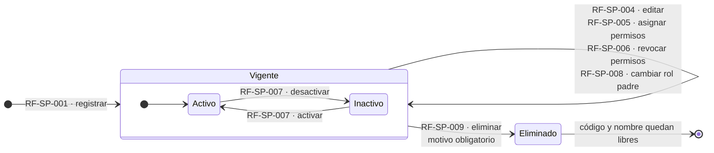

**Lo que el diagrama no puede dibujar y hay que leer en las specs:**

- Las cuatro mutaciones del bucle exigen las mismas tres condiciones: el rol **no está eliminado**, **no es de sistema** y **el actor no lo porta**. Ninguna distingue entre activo e inactivo: un rol inactivo se sigue editando.
- `RF-SP-007` desactivar **no** revoca asignaciones. El rol deja de conceder permisos de inmediato, pero el vínculo con los usuarios se conserva; reactivarlo lo restituye entero.
- `RF-SP-009` exige además **sin hijos vigentes ni usuarios asignados**.
- El **rol raíz** queda fuera de tres operaciones: no cambia de estado (`RF-SP-007` `EX-001`), no cambia de padre (`RF-SP-008` `EX-003`) y no se elimina (`RF-SP-009` `EX-004`). Un rol raíz inactivo dejaría al sistema sin su última vía de administración.
- Un **rol de sistema** no tiene ninguna transición saliente: no se edita, no cambia de estado y no se elimina. Nace por migración y permanece.
- El borrado es lógico, y qué ocurre entonces con `role_permissions` **no está resuelto**: `RF-SP-009` §7 dice que sus asociaciones con permisos «dejan de tener efecto» sin decir si las filas se borran o sobreviven. `RF-SP-029` sí lo declara para las suyas —`user_roles` y `user_memberships` desaparecen—, de modo que la asimetría entre las dos eliminaciones queda a la vista.

---

## 2. Ciclo de vida de la persona

La segunda entidad con estado propio, y la única con **tres** estados vivos en lugar de dos. La diferencia con el rol está en el final: el código de un rol eliminado vuelve a estar libre; el nombre de usuario y el correo de una persona eliminada **no**.

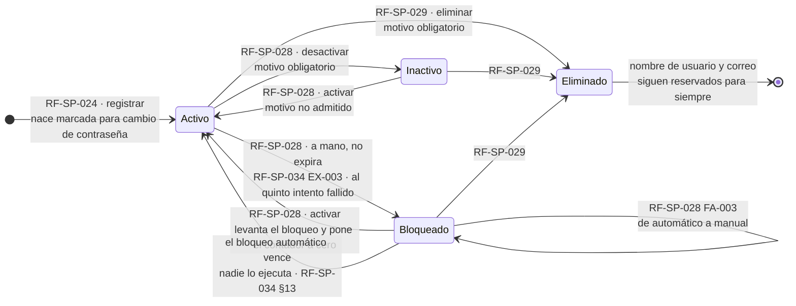

**Lo que el diagrama no puede dibujar y hay que leer en las specs:**

- Las tres salidas del estado activo —desactivar, bloquear y eliminar— comparten tres condiciones: **la cuenta no es la del actor** (`RN-SP-017`), **no es el último usuario activo con el rol raíz** (`RN-SP-001`) y **no tiene a nadie a cargo** (`RN-SP-022`). Devolver el acceso no atraviesa ninguna de las tres.
- El **bloqueo automático** de `RF-SP-034` no pasa por esas condiciones: es una respuesta de seguridad, y no puede quedar supeditada a que alguien reorganice un equipo primero.
- **El bloqueo automático se levanta solo, y ningún requerimiento ejecuta esa transición**: la dispara el paso del tiempo y se hace efectiva en el siguiente intento de `RF-SP-034`, «sin intervención de nadie» (§13). El **manual no expira** —`locked_until` queda nulo—, y por eso `EX-002` da dos mensajes distintos: el automático dice cuándo termina, el manual remite a un administrador. `RF-SP-028` es la única forma de salir del segundo.
- **El contador de intentos fallidos es un ciclo dentro del ciclo.** Sube con cada fallo consecutivo, dispara el bloqueo al quinto (`CA-SP-376`), vuelve a cero con un inicio de sesión correcto (`CA-SP-295`) y también al activar la cuenta por `RF-SP-028`. Un intento correcto entre dos fallidos lo reinicia: el umbral cuenta fallos **consecutivos**, no acumulados.
- **`PENDIENTE` está declarado en el dominio de `users` y no tiene ninguna transición**, ni de entrada ni de salida. `security.md` §3.1 lo conserva para un flujo de activación que todavía no existe; mientras siga así, el diagrama está completo sin él.
- Ni el bloqueo ni la desactivación tocan roles, membresía ni credencial. Lo que sí ocurre al retirar el acceso es que **todos sus refresh tokens quedan revocados**.
- La **credencial es ortogonal al estado de la cuenta** y tiene su propio ciclo, en §3: retirar el acceso no la toca, y sustituirla no devuelve el acceso a quien lo perdió.
- `RF-SP-029` es la única operación del módulo que **retira** roles y membresía y a la vez **cierra** —sin borrarla— la asignación de superior comercial. La asimetría es deliberada: los primeros decían qué podía hacer hoy; la segunda es historial de negocio (`RN-SP-021`).

---

## 3. Ciclo de vida de la credencial

Cuatro requerimientos escriben sobre la contraseña, y lo que los separa no es cómo la sustituyen —los tres que la reemplazan lo hacen por completo— sino **quién termina conociendo el secreto**. De ahí sale todo lo demás: si la cuenta queda marcada para cambio obligatorio, si la credencial caduca sola y con qué severidad se audita.

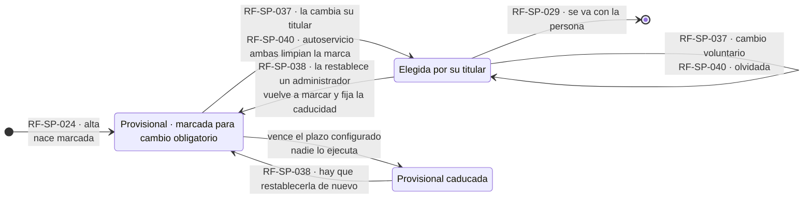

El camino de vuelta de `RF-SP-040` tiene una pieza propia, de vida corta y con estados propios: el **permiso temporal** que viaja al canal del titular.

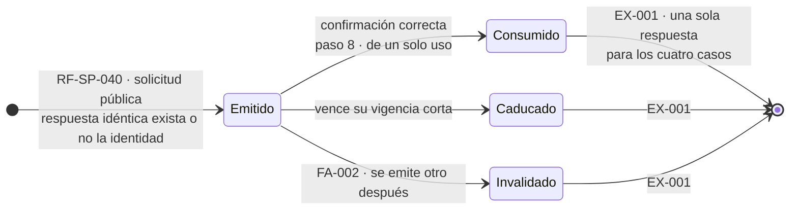

**Lo que los diagramas no pueden dibujar y hay que leer en las specs:**

- **Las tres operaciones que sustituyen la credencial revocan todos los refresh tokens** de la persona con motivo `ACCESO_RETIRADO`. Es la unión con §4, y es lo que hace que cambiar la contraseña sirva de algo cuando ya la robaron (`RF-SP-037` §2, `security.md` §5.5).
- **La marca de cambio obligatorio no impide iniciar sesión**: `RF-SP-034` `FA-002` autentica y advierte, porque la persona necesita una sesión para poder cambiarla. Lo que se le niega es todo lo demás hasta que ejecute `RF-SP-037`.
- **Solo `RF-SP-038` produce el estado caducado**, y nadie lo comunica: la credencial provisional deja de servir al pasar el plazo y no falla nada hasta que alguien intenta usarla. Es el precio declarado de cerrar por tiempo la ventana en que un administrador conoce una credencial ajena.
- **`RF-SP-040` no marca la cuenta** y es deliberado: la contraseña la eligió su titular y nadie más la conoce, de modo que no hay ventana que cerrar.
- **Ninguna de las tres toca el estado de la cuenta.** Si estaba bloqueada, sigue bloqueada; si estaba inactiva, sigue inactiva. `RF-SP-040` §4 lo enuncia como criterio: una operación sobre la credencial no deshace una decisión de seguridad. Levantar un bloqueo es siempre `RF-SP-028`.
- **La contraseña anterior no se recupera nunca**: se almacena con Argon2id y la política mínima vive en `security.md` §3.2, no en las specs.
- `EX-002` de `RF-SP-040` **no consume el permiso temporal**: una contraseña que incumple la política es un error de la persona legítima, y gastarle el permiso por eso castigaría el intento correcto.

---

## 4. Ciclo de vida de una sesión

Nueve requerimientos escriben sobre `refresh_tokens`, y solo dos de ellos —`RF-SP-034` y `RF-SP-035`— llegan a crear alguno: los otros siete únicamente revocan. Este es el único punto del módulo donde **por qué** se revocó algo cambia la respuesta a la siguiente petición.

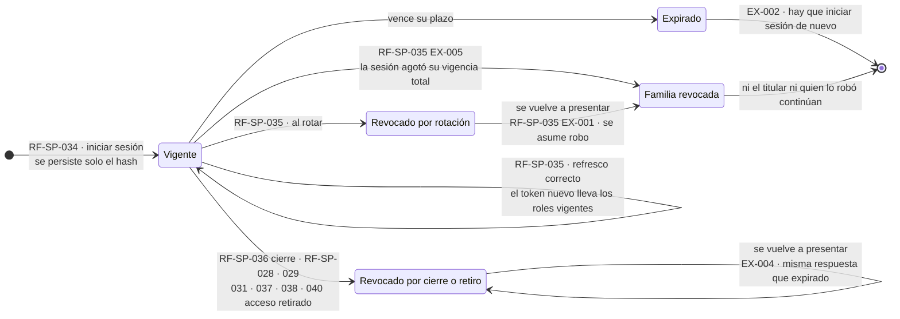

**Lo que el diagrama no puede dibujar y hay que leer en las specs:**

- La bifurcación entre `ROT` y `RET` es la razón de que cada revocación guarde su **motivo**. Sin ese dato, cerrar sesión y reintentar sería indistinguible de un robo, y `RF-SP-035` revocaría la familia de todo el que refresca dos veces.
- El **token de acceso** no aparece en el diagrama porque no se revoca: sigue valiendo hasta que expira, como mucho quince minutos. Todo lo que aquí se revoca son refresh tokens.
- `RF-SP-035` es también el punto donde los cambios de rol de `RF-SP-030` y `RF-SP-031` llegan a la sesión. Por eso `RF-SP-031` revoca además todos los tokens: para que el retiro no espere quince minutos.
- El refresco correcto **no deja evento en la auditoría de seguridad**; sus excepciones sí, y `EX-001` con severidad alta.
- **Los estados terminales no vacían la tabla.** `security.md` §5.5 sujeta los tokens expirados y revocados a la política de retención, pero ninguna spec de `SP` la ejecuta: el `[*]` del diagrama es el fin de la vida útil del token, no el de su fila.

---

## 5. Ciclo de vida de la membresía de una persona

La asignación tiene un ciclo que el catálogo no tiene, y es el único del módulo **sin columna de estado**: «vigente» y «vencida» no se escriben, se calculan al consultar. Cuatro requerimientos la mueven, y ninguno de ellos es el que la deja de conceder.

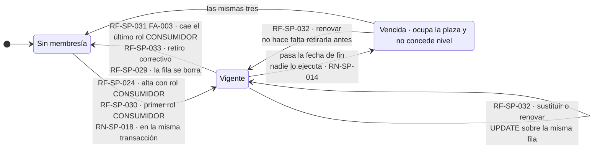

**Lo que el diagrama no puede dibujar y hay que leer en las specs:**

- **La transición a vencida no la ejecuta nadie.** `RF-SP-032` §2 lo resuelve de forma explícita: la vigencia se evalúa al consultarla y ningún proceso recorre las membresías venciéndolas, porque ese proceso sería un requerimiento nuevo —con su horario, su registro de ejecución y su comportamiento ante fallos— que hoy nada cubre. Es la tercera transición del módulo que dispara el reloj y no una petición, junto con el vencimiento del bloqueo (§2) y el del refresh token (§4).
- **Vencer no es lo mismo que no tener.** La fila permanece, ocupa la única plaza de la persona y no concede nivel alguno; `RF-SP-026` la devuelve con su fecha, que es lo que permite distinguir una cosa de la otra. Nadie avisa antes de que ocurra, y `RF-SP-032` §13 deja dicho que la interfaz debería hacerlo visible.
- **Una plaza por persona, declarada en el esquema.** La clave primaria de `user_memberships` es `user_id`, de modo que `RN-SP-014` deja de ser una regla que el dominio deba recordar; por eso `RF-SP-032` sustituye con un `UPDATE` y no insertando una fila nueva. No hay historial de membresías.
- **El rol de consumidor y el nivel son inseparables** (`RN-SP-013` y `RN-SP-018`, recíprocas): se conceden juntos —`RF-SP-024` y `RF-SP-030` exigen indicar la membresía con el primer rol `CONSUMIDOR`— y se sueltan juntos, porque retirar el último arrastra la membresía en la misma transacción y bajo el mismo identificador de correlación (`RN-SP-015`). Rechazar ese retiro, como decía el borrador de `RF-SP-031`, producía un bloqueo mutuo del que nadie salía.
- **`RF-SP-033` es la salida correctiva y exige justo lo contrario**: que la persona ya **no** porte ningún rol `CONSUMIDOR`. Existe para deshacer un estado inconsistente, y su uso es excepcional por diseño.
- La eliminación de la persona **borra la fila**, igual que las de `user_roles` y a diferencia de la asignación de superior comercial, que se cierra. La membresía del catálogo no se toca: `RN-SP-008` impide borrarlas, y esta operación no lo intenta.

---

## 6. Qué debe existir antes de qué

Las precondiciones de las 42 specs forman un orden de dependencias. Este es el mapa de lo que hay que tener poblado antes de poder ejecutar cada operación.

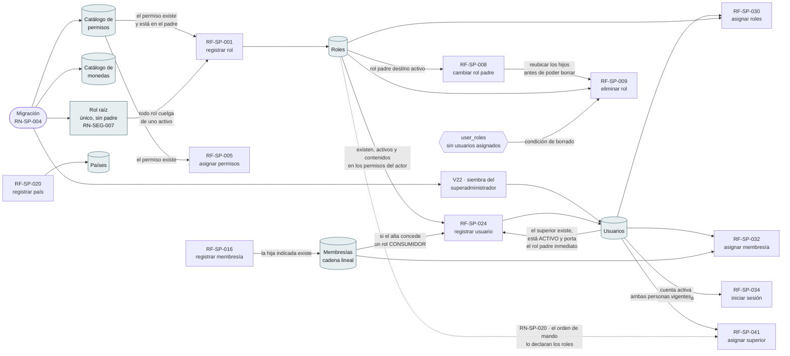

Dos encadenamientos no evidentes, que solo aparecen al cruzar specs:

- **`RF-SP-008` → `RF-SP-009`.** Como no se elimina un rol con hijos vigentes, borrar un nodo intermedio de la jerarquía obliga a **reubicar antes** cada hijo. Ninguna de las dos specs lo dice.
- **`RF-SP-024` depende de sí mismo.** El alta exige un actor autenticado con permiso, y el superior comercial que a veces exige es otro usuario que ya debe existir y estar activo. El bucle `USR → RF-SP-024 → USR` del diagrama es real, y por eso se rompe fuera de la API: el `plan.md` de `RF-SP-024` §2.5 siembra el superadministrador en `V22`, con identificador fijo y credencial por marcador de posición de Flyway. **La spec no lo dice; solo su plan.**

---

## 7. Las 42 operaciones, por naturaleza

**Veintiséis escriben estado y dieciséis solo leen.** Doce de estas últimas comparten la postcondición literal «ninguna: la consulta no altera el estado del sistema»; las cuatro de auditoría dicen «ninguna **sobre los datos consultados**», y `RF-SP-014` añade que registra la propia consulta como evento de seguridad.

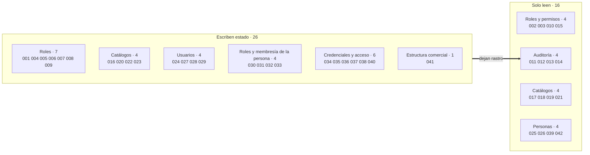

La proporción cambió al absorber los usuarios: antes `SP` era mitad administración y mitad consulta; ahora **casi dos tercios de su superficie escribe**, y el peso se ha ido a las personas y a su acceso —quince de los veintiséis—. El bloque de auditoría sigue siendo el único que se alimenta de todos los demás.

---

## 8. Auditoría transversal

Las cuatro tablas de [`architecture.md` §6.6](../../architecture.md) se escriben por caminos distintos y se consultan por requerimientos distintos. Este es el cruce completo.

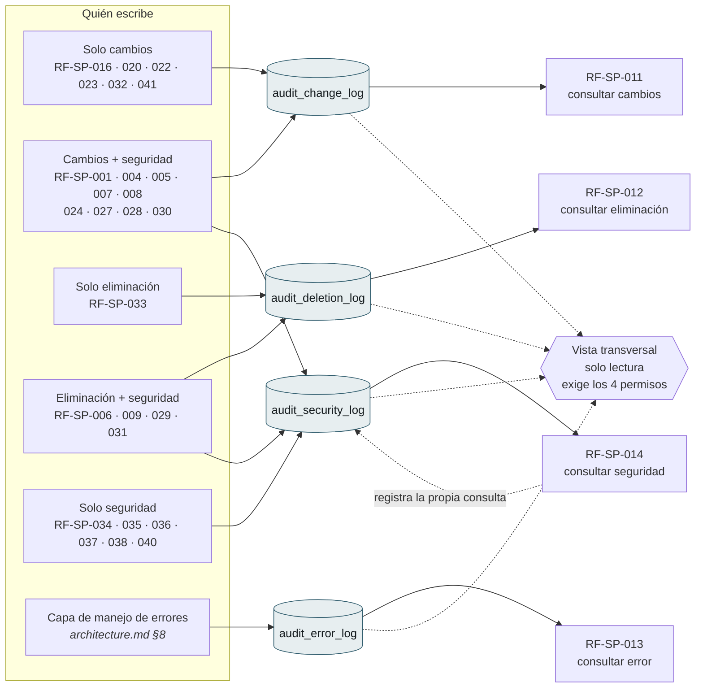

Dos operaciones están en su grupo **de forma condicional**: `RF-SP-027` solo escribe en seguridad **si cambió el correo**, y `RF-SP-035` solo lo hace **en sus excepciones** —el refresco correcto no deja evento—.

Cuatro asimetrías que el cruce deja a la vista:

| Observación | Estado |
|---|---|
| `audit_error_log` **no tiene escritor declarado en ninguna spec de `SP`**, pero `RF-SP-013` lo consulta. Su única fuente es la capa transversal de errores. | Coherente con `architecture.md` §6.6.3, pero ninguna spec lo enuncia. |
| **Seis operaciones escriben en cambios y no en seguridad.** Cuatro son de catálogo y no son control de acceso; `RF-SP-032` cambia el nivel de un consumidor, y `RF-SP-041` mueve a alguien en la estructura comercial. La línea divisoria no está enunciada en ningún documento. | `RF-SP-041` es la única que **razona** su exclusión, y además con condición de disparo: si D-22 hace depender el alcance de datos de esa relación, vuelve a su compuerta. |
| **El registro de eliminación tiene tres clases de escritor.** `RF-SP-009` y `RF-SP-029` exigen motivo; `RF-SP-006`, `RF-SP-031` y `RF-SP-033` escriben **sin motivo declarado**. | Declarado en cada spec por separado. Es la excepción a «todo borrado lleva motivo» (Art. V.13), y quien consume la auditoría la descubre en `RF-SP-012` `FA-001`. |
| `RF-SP-014` es la **única consulta que escribe**: registra quién miró el registro de seguridad, cuándo y con qué filtros. Las otras tres consultas de auditoría no dejan rastro equivalente. | Declarado en `RF-SP-014` §7. Si mirar la auditoría de seguridad se audita, conviene decidir si mirar las otras tres también. |

---

## 9. Los submódulos de catálogo

Permisos, membresías, monedas y países no comparten forma. Cada uno decidió distinto sobre su ciclo de vida, y esas decisiones solo se ven al ponerlos uno al lado del otro.

```mermaid
flowchart TB
    subgraph PER["Permisos · alta por migración, sin ninguna salida"]
        direction LR
        R1(["alta por migración · RN-SP-004"]) --> R2["RF-SP-010<br/>consultar"] --> R3["RF-SP-015<br/>detalle"]
        R1 -.->|"ni alta por API, ni edición,<br/>ni baja, ni estado"| RX["∅"]
    end

    subgraph MEM["Membresías · cadena lineal"]
        direction LR
        M1["RF-SP-016<br/>registrar"] --> M2["RF-SP-017<br/>consultar"] --> M3["RF-SP-018<br/>detalle"]
        M1 -.->|"RN-SP-008 · ni editar ni eliminar,<br/>y sin indicador de activo:<br/>desactivar un eslabón dejaría<br/>un hueco en un orden lineal"| MX["∅"]
    end

    subgraph MON["Monedas · alta solo por migración"]
        direction LR
        N1(["alta por migración"]) --> N2["RF-SP-019<br/>consultar"]
        N2 --> N3["RF-SP-023<br/>cambiar estado<br/><i>salvo la moneda por defecto</i>"]
    end

    subgraph PAI["Países · alta por API, definitiva"]
        direction LR
        P1["RF-SP-020<br/>registrar"] --> P2["RF-SP-021<br/>consultar"]
        P2 --> P3["RF-SP-022<br/>cambiar estado"]
        P1 -.->|"código y nombre<br/>definitivos · RN-SP-009"| PX["∅"]
    end

    classDef vacio fill:#f6e6e2,stroke:#a33b2a,stroke-dasharray:3 3,color:#a33b2a
    class MX,PX,RX vacio
```

- **Permisos** es el más rígido de los cuatro y el único **sin ninguna operación de escritura en todo el módulo**: no se da de alta por API, no se edita, no se elimina y ni siquiera tiene indicador de estado. El catálogo lo fija la migración (`RN-SP-004`), de modo que ampliarlo es desplegar, no administrar. Es coherente con que un permiso sea la unidad que el código comprueba: una fila que apareciera o desapareciera en caliente cambiaría lo que el sistema sabe hacer sin que ningún despliegue lo declarara.
- **Monedas** no tiene alta por API y es deliberado: `RF-SP-019` §2 lo argumenta —el catálogo existe desde el principio para que sumar una moneda sea insertar una fila, no migrar cada tabla financiera—. Lo único modificable es su estado (`RN-SP-010`), y la moneda por defecto no puede desactivarse: es a este catálogo lo que el rol raíz es a la jerarquía.
- **Países** sí se dan de alta por API, a medida que la plataforma llega a ellos, y el catálogo no se siembra con la lista internacional completa. El código y el nombre son definitivos; el estado es la salida para un alta equivocada (`RN-SP-009`).
- **Membresías** es la única de las cuatro con alta por API **y sin ninguna salida**: ni edición, ni reubicación, ni baja, ni indicador de activo. `RN-SP-008` lo justifica de forma explícita —desactivar un eslabón dejaría un hueco en un orden lineal—, así que la inmutabilidad es deliberada y está escrita. Lo que sí tiene ciclo es su **asignación** a una persona, y está en §5.

Desde el 22-08-2026 los dos catálogos que admiten cambio de estado tienen tripleta aprobada: `RF-SP-022` para países y `RF-SP-023` para monedas. La diferencia entre ambas es una sola verificación —la moneda por defecto—, y es lo que justifica que sean dos requerimientos y no uno.

---

## 10. La estructura comercial

La única relación **persona → persona** del modelo, y la primera cuyo pasado importa tanto como su presente. Ningún requerimiento la escribe en solitario: siempre viaja con el rol que la justifica.

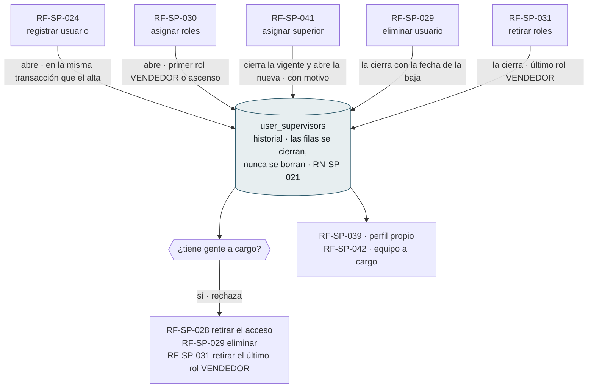

- **El orden de mando lo declaran los roles, no las personas.** `RN-SP-020` exige que el superior porte el **rol padre inmediato** del rol comercial de mayor rango del subordinado. La jerarquía de `roles` y la estructura de `user_supervisors` son dos dibujos del mismo orden, y el sistema no admite que se contradigan.
- **Nadie se queda huérfano en silencio.** Las tres operaciones que retirarían a un superior se rechazan si tiene equipo, e informan **cuántas** personas —nunca quiénes: eso es `RF-SP-042`, que tiene su propio permiso—. Es la misma postura que `RN-SEG-008` toma con un rol que tiene hijos.
- **Mover a alguien mueve su rama entera.** `RF-SP-041` cambia de quién depende el subordinado; quienes estaban a su cargo siguen estándolo.
- **La cúspide no tiene superior**, igual que el rol raíz no tiene padre. Es el único caso admitido de vendedor sin asignación vigente (`RN-SP-019`).
- La asimetría con la membresía de §5 es deliberada y las dos specs la razonan: la asignación de superior **se cierra** porque el pasado dice a quién se atribuía la producción, y la de membresía **se borra** porque solo decía qué nivel tenía hoy.

---

## 11. Qué queda por resolver

| # | Punto | Dónde se resuelve |
|---|---|---|
| ~~1~~ | ~~**De dónde sale la primera persona.**~~ **Resuelto:** el `plan.md` de `RF-SP-024` §2.5 declara `V22__seed_superadmin.sql`, que inserta el superadministrador con identificador fijo, correo y hash por marcador de posición de Flyway —un despliegue sin credencial inicial declarada no arranca— y le asigna el rol `SUPERADMIN` de `V7`. Nace marcado para cambio obligatorio, igual que un alta corriente | `RF-SP-024` `plan.md` §2.5 |
| 2 | **`RF-SP-035` `EX-004` depende de un motivo de revocación que dos de sus fuentes no declaran.** `RF-SP-037`, `038` y `040` escriben `ACCESO_RETIRADO`; `RF-SP-028` y `RF-SP-031` solo dicen «revoca todos sus refresh tokens». Sin ese dato, un cierre legítimo sería indistinguible de un robo | `RF-SP-028` §7, `RF-SP-031` §7 |
| 3 | El encadenamiento `RF-SP-008` → `RF-SP-009` para borrar nodos intermedios no está dicho en ninguna de las dos specs | `RF-SP-009` §13 casos límite |
| 4 | `audit_error_log` sin escritor declarado del lado de `SP` | `RF-SP-013` §2 contexto |
| 5 | La excepción de `RF-SP-006`, `RF-SP-031` y `RF-SP-033` —escribir en eliminación sin motivo— no figura junto a la regla general | `architecture.md` §6.6.3 |
| 6 | Los roles de sistema quedan fuera de `RF-SP-004` a `RF-SP-009`: no tienen ninguna operación de mantenimiento | `security.md` §4.3 |
| 7 | **El modelo de alcance de datos (D-22) sigue abierto**, y de él depende que `RF-SP-041` tenga que emitir evento de seguridad. La condición de disparo está declarada; lo que falta es la decisión | `architecture.md` §16, `RF-SP-041` §7 |
| 8 | **La caducidad de la credencial provisional no tiene dónde escribirse.** `RF-SP-038` §7 obliga a fijar «el momento en que la credencial provisional caduca», y `users` solo declara `must_change_password`: el esquema no tiene columna para ese instante | `modelo-datos.md` §1, `RF-SP-038` §7 |
| 9 | **Ninguna spec dice cómo se sale de una credencial provisional caducada.** `RF-SP-038` puede emitir otra; si `RF-SP-040` también sirve —no exige conocer la vigente— no está declarado en ninguna de las dos | `RF-SP-038` §13, `RF-SP-040` §13 |
| 10 | **`PENDIENTE` está declarado en el dominio de `users` y ninguna operación entra ni sale de él.** O se retira del dominio, o se declara qué flujo lo poblará | `security.md` §3.1, `modelo-datos.md` §1 |
| 11 | **Qué ocurre con `role_permissions` al eliminar un rol.** `RF-SP-009` §7 dice que sus asociaciones «dejan de tener efecto», sin decir si las filas se borran o sobreviven al borrado lógico. `RF-SP-029` sí lo declara para las suyas | `RF-SP-009` §7 |
| 12 | **Nadie purga los refresh tokens.** `security.md` §5.5 los sujeta a la política de retención, y ninguna spec de `SP` la ejecuta ni la declara | `security.md` §5.5 |
| 13 | **`RF-SP-032` §13 describe `RN-SP-015` en su forma anterior a la enmienda del 21-08-2026**: dice que sobre una membresía vencida la regla «deja de proteger», cuando la vigente ya no rechaza nunca —retira la membresía en cascada, vencida o no— | `RF-SP-032` §13, `RN-SP-015` |

---

## 12. Control de cambios

| Versión | Fecha | Cambio | Responsable |
|---|---|---|---|
| 0.1.0 | 21-08-2026 | Creación inicial. Cinco diagramas derivados de las precondiciones y postcondiciones de las 21 tripletas de `SP`, y cinco puntos abiertos que el cruce deja a la vista. | Responsable técnico |
| 0.2.0 | 22-08-2026 | Los 21 requerimientos restantes, de `RF-SP-022` a `RF-SP-042`. Tres diagramas nuevos —ciclo de vida de la persona, ciclo de vida de una sesión y estructura comercial— y los cinco anteriores rehechos sobre los 42: el mapa de dependencias incorpora usuarios y estructura, el reparto por naturaleza pasa a 26 escrituras y 16 lecturas, y el cruce de auditoría se reagrupa por combinación de registros. Se retiran las marcas de «sin tripleta» de `RF-SP-022` y `RF-SP-023`, y se registran dos puntos abiertos nuevos: el origen de la primera persona y el motivo de revocación del que depende `RF-SP-035` `EX-004`. | Responsable técnico |
| 0.3.0 | 22-08-2026 | Revisión de completitud contra las nueve tablas de `modelo-datos.md` §1. **Dos ciclos de vida nuevos**: la credencial (§3, con el permiso temporal de un solo uso de `RF-SP-040` en diagrama propio) y la membresía de una persona (§5, la asignación, que hasta ahora solo figuraba como catálogo). **Tres enmiendas a diagramas existentes**: el vencimiento del bloqueo automático y el contador de intentos fallidos en §2, el catálogo de permisos como cuarto submódulo en §9, y la retención pendiente de los refresh tokens en §4. Secciones renumeradas de la §3 en adelante. Seis puntos abiertos nuevos: la caducidad sin columna, la salida de una provisional caducada, `PENDIENTE` sin transiciones, `role_permissions` en el borrado de rol, la purga de tokens y la referencia obsoleta a `RN-SP-015` en `RF-SP-032`. Se cierra el punto 1 —el origen de la primera persona—: el `plan.md` de `RF-SP-024` §2.5 lo declara en `V22__seed_superadmin.sql`, y §6 lo incorpora al mapa de dependencias. | Responsable técnico |
