# Flujos por caso de uso — `SP` Sistema Principal

| Campo | Valor |
|---|---|
| Módulo | `SP` — Sistema Principal |
| Versión | 0.4.0 |
| Estado | **Borrador** |
| Responsable | Bonilla Diaz William Steven |
| Fecha de creación | 21-08-2026 |
| Última actualización | 01-09-2026 |

!!! info "Qué va en este documento"

    Un diagrama por caso de uso: qué puede hacer el actor, qué verifica el sistema en cada paso y por dónde sale la operación cuando una verificación falla.

    Cada diagrama es la transcripción literal de las **§8 Flujo principal**, **§9 Flujos alternativos** y **§10 Excepciones** de su spec. No añade comportamiento. Ante cualquier discrepancia, **manda la spec**.

    Cubre los **42 requerimientos con spec aprobada** de `SP`, agrupados por lo que resuelven. Los doce submódulos que `modules.md` §5.1 declara quedan todos representados.

!!! note "Convención de los diagramas"

    | Forma | Significado |
    |---|---|
    | Cápsula | Acción del actor, o respuesta final del sistema |
    | Rombo | Verificación del sistema |
    | Rectángulo | Paso del sistema que produce efecto |
    | Recuadro rojo | Rechazo tipificado, con su identificador `EX-00n` |
    | Línea punteada | Flujo alternativo `FA-00n`: no es error |

    Cuando una excepción no tiene un paso propio en la §8 se dibuja en el punto donde el sistema necesariamente la detecta. Cuando el flujo principal verifica algo que la §10 no tipifica, el rechazo aparece marcado como **sin excepción tipificada**.

---

## 1. Roles

### `RF-SP-001` · Registrar rol

El único camino de entrada de un rol al sistema. Nace activo y con sus permisos ya contenidos en los del padre.

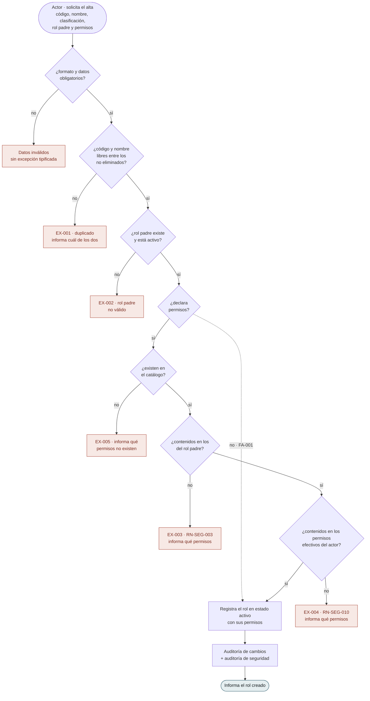
```mermaid
flowchart TD
    A(["Actor · solicita el alta<br/>código, nombre, clasificación,<br/>rol padre y permisos"])
    A --> V1{"¿formato y datos<br/>obligatorios?"}
    V1 -->|no| E0["Datos inválidos<br/>sin excepción tipificada"]
    V1 -->|sí| V2{"¿código y nombre<br/>libres entre los<br/>no eliminados?"}
    V2 -->|no| E1["EX-001 · duplicado<br/>informa cuál de los dos"]
    V2 -->|sí| V3{"¿rol padre existe<br/>y está activo?"}
    V3 -->|no| E2["EX-002 · rol padre<br/>no válido"]
    V3 -->|sí| D1{"¿declara<br/>permisos?"}
    D1 -.->|"no · FA-001"| P1
    D1 -->|sí| V4{"¿existen en<br/>el catálogo?"}
    V4 -->|no| E5["EX-005 · informa qué<br/>permisos no existen"]
    V4 -->|sí| V5{"¿contenidos en los<br/>del rol padre?"}
    V5 -->|no| E3["EX-003 · RN-SEG-003<br/>informa qué permisos"]
    V5 -->|sí| V6{"¿contenidos en los permisos<br/>efectivos del actor?"}
    V6 -->|no| E4["EX-004 · RN-SEG-010<br/>informa qué permisos"]
    V6 -->|sí| P1["Registra el rol en estado activo<br/>con sus permisos"]
    P1 --> P2["Auditoría de cambios<br/>+ auditoría de seguridad"]
    P2 --> FIN(["Informa el rol creado"])

    classDef ex fill:#F7E9E5,stroke:#A33B2A,color:#7A2B1E
    classDef ok fill:#E5EEF0,stroke:#2D5A6B,color:#141B1E
    class E0,E1,E2,E3,E4,E5 ex
    class FIN ok
```

`FA-001` — sin permisos iniciales el sistema omite las dos verificaciones de contención y el rol queda registrado vacío, a la espera de `RF-SP-005`.

---

### `RF-SP-002` · Consultar roles

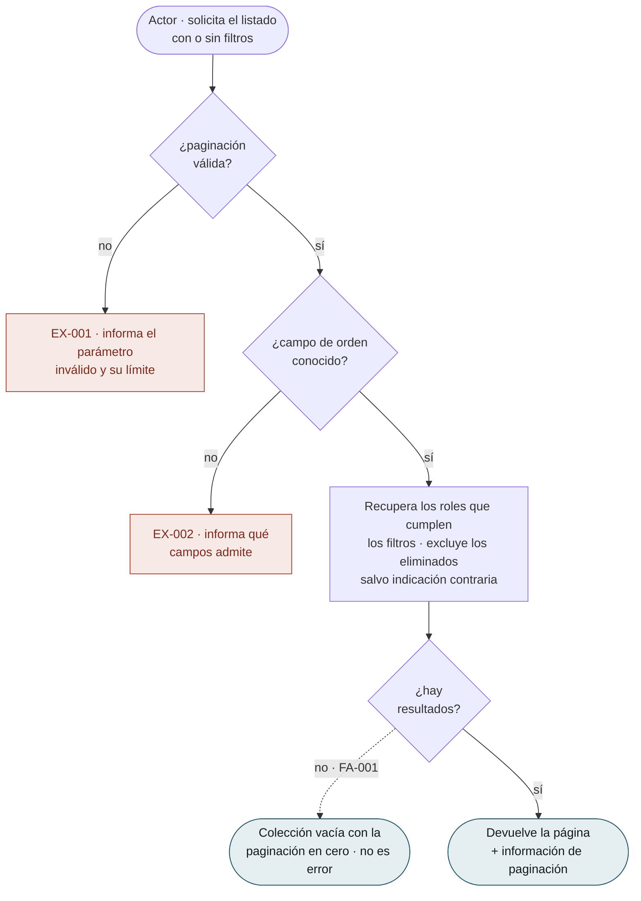
```mermaid
flowchart TD
    A(["Actor · solicita el listado<br/>con o sin filtros"])
    A --> V1{"¿paginación<br/>válida?"}
    V1 -->|no| E1["EX-001 · informa el parámetro<br/>inválido y su límite"]
    V1 -->|sí| V2{"¿campo de orden<br/>conocido?"}
    V2 -->|no| E2["EX-002 · informa qué<br/>campos admite"]
    V2 -->|sí| P1["Recupera los roles que cumplen<br/>los filtros · excluye los eliminados<br/>salvo indicación contraria"]
    P1 --> D1{"¿hay<br/>resultados?"}
    D1 -.->|"no · FA-001"| F2(["Colección vacía con la<br/>paginación en cero · no es error"])
    D1 -->|sí| FIN(["Devuelve la página<br/>+ información de paginación"])

    classDef ex fill:#F7E9E5,stroke:#A33B2A,color:#7A2B1E
    classDef ok fill:#E5EEF0,stroke:#2D5A6B,color:#141B1E
    class E1,E2 ex
    class FIN,F2 ok
```

---

### `RF-SP-003` · Consultar detalle de rol

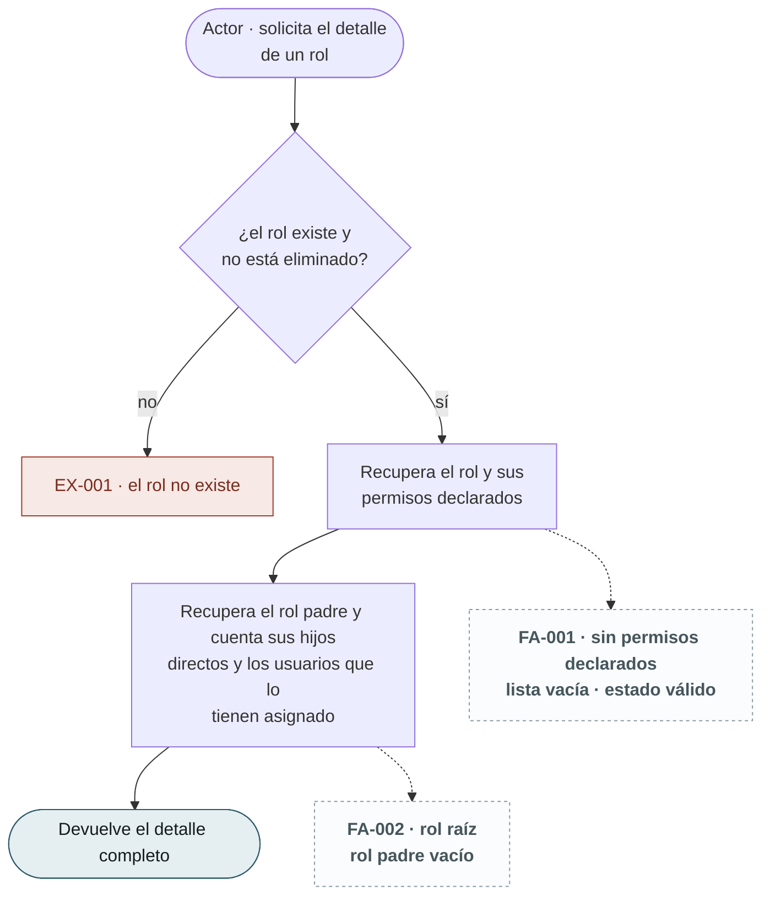
```mermaid
flowchart TD
    A(["Actor · solicita el detalle<br/>de un rol"])
    A --> V1{"¿el rol existe y<br/>no está eliminado?"}
    V1 -->|no| E1["EX-001 · el rol no existe"]
    V1 -->|sí| P1["Recupera el rol y sus<br/>permisos declarados"]
    P1 --> P2["Recupera el rol padre y cuenta sus hijos<br/>directos y los usuarios que lo<br/>tienen asignado"]
    P2 --> FIN(["Devuelve el detalle completo"])
    P1 -.-> N1["FA-001 · sin permisos declarados<br/>lista vacía · estado válido"]
    P2 -.-> N2["FA-002 · rol raíz<br/>rol padre vacío"]

    classDef ex fill:#F7E9E5,stroke:#A33B2A,color:#7A2B1E
    classDef ok fill:#E5EEF0,stroke:#2D5A6B,color:#141B1E
    classDef fa fill:#FBFCFD,stroke:#8A9BA2,stroke-dasharray:3 3,color:#46565C
    class E1 ex
    class FIN ok
    class N1,N2 fa
```

---

### `RF-SP-004` · Editar rol

Toca nombre, descripción y clasificación. **No** toca código, permisos, estado ni rol padre: cada uno tiene su propio caso de uso.

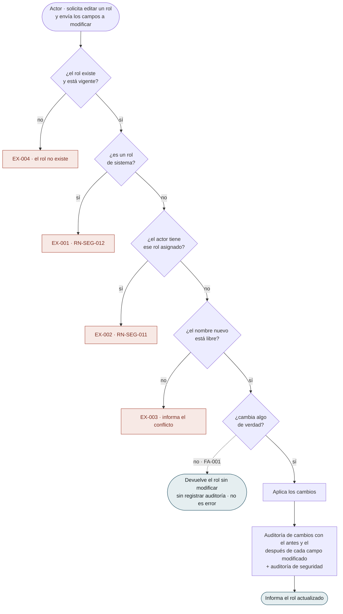
```mermaid
flowchart TD
    A(["Actor · solicita editar un rol<br/>y envía los campos a modificar"])
    A --> V1{"¿el rol existe<br/>y está vigente?"}
    V1 -->|no| E4["EX-004 · el rol no existe"]
    V1 -->|sí| V2{"¿es un rol<br/>de sistema?"}
    V2 -->|sí| E1["EX-001 · RN-SEG-012"]
    V2 -->|no| V3{"¿el actor tiene<br/>ese rol asignado?"}
    V3 -->|sí| E2["EX-002 · RN-SEG-011"]
    V3 -->|no| V4{"¿el nombre nuevo<br/>está libre?"}
    V4 -->|no| E3["EX-003 · informa el conflicto"]
    V4 -->|sí| D1{"¿cambia algo<br/>de verdad?"}
    D1 -.->|"no · FA-001"| F1(["Devuelve el rol sin modificar<br/>sin registrar auditoría · no es error"])
    D1 -->|sí| P1["Aplica los cambios"]
    P1 --> P2["Auditoría de cambios con el antes y el<br/>después de cada campo modificado<br/>+ auditoría de seguridad"]
    P2 --> FIN(["Informa el rol actualizado"])

    classDef ex fill:#F7E9E5,stroke:#A33B2A,color:#7A2B1E
    classDef ok fill:#E5EEF0,stroke:#2D5A6B,color:#141B1E
    class E1,E2,E3,E4 ex
    class FIN,F1 ok
```

---

### `RF-SP-005` · Asignar permisos

Idempotente y de todo o nada: si un solo permiso incumple, se rechaza la operación completa.

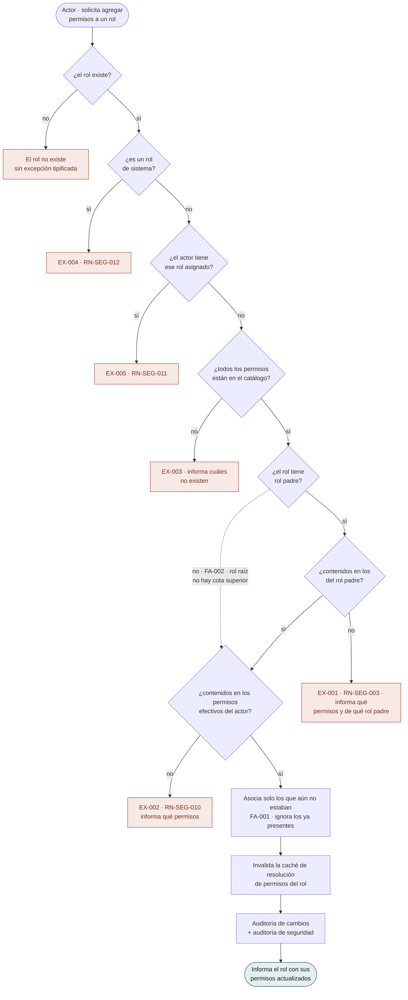
```mermaid
flowchart TD
    A(["Actor · solicita agregar<br/>permisos a un rol"])
    A --> V1{"¿el rol existe?"}
    V1 -->|no| E0["El rol no existe<br/>sin excepción tipificada"]
    V1 -->|sí| V2{"¿es un rol<br/>de sistema?"}
    V2 -->|sí| E4["EX-004 · RN-SEG-012"]
    V2 -->|no| V3{"¿el actor tiene<br/>ese rol asignado?"}
    V3 -->|sí| E5["EX-005 · RN-SEG-011"]
    V3 -->|no| V4{"¿todos los permisos<br/>están en el catálogo?"}
    V4 -->|no| E3["EX-003 · informa cuáles<br/>no existen"]
    V4 -->|sí| D1{"¿el rol tiene<br/>rol padre?"}
    D1 -.->|"no · FA-002 · rol raíz<br/>no hay cota superior"| V6
    D1 -->|sí| V5{"¿contenidos en los<br/>del rol padre?"}
    V5 -->|no| E1["EX-001 · RN-SEG-003 · informa qué<br/>permisos y de qué rol padre"]
    V5 -->|sí| V6{"¿contenidos en los permisos<br/>efectivos del actor?"}
    V6 -->|no| E2["EX-002 · RN-SEG-010<br/>informa qué permisos"]
    V6 -->|sí| P1["Asocia solo los que aún no estaban<br/>FA-001 · ignora los ya presentes"]
    P1 --> P2["Invalida la caché de resolución<br/>de permisos del rol"]
    P2 --> P3["Auditoría de cambios<br/>+ auditoría de seguridad"]
    P3 --> FIN(["Informa el rol con sus<br/>permisos actualizados"])

    classDef ex fill:#F7E9E5,stroke:#A33B2A,color:#7A2B1E
    classDef ok fill:#E5EEF0,stroke:#2D5A6B,color:#141B1E
    class E0,E1,E2,E3,E4,E5 ex
    class FIN ok
```

Los roles hijos no se tocan: la contención sigue valiendo porque el conjunto del padre solo creció.

---

### `RF-SP-006` · Revocar permisos

El espejo del anterior, con una verificación que el otro no necesita: retirar un permiso puede dejar a un hijo excediendo a su padre.

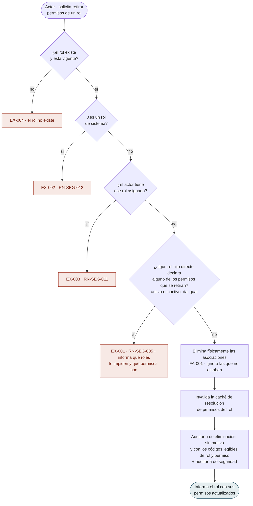
```mermaid
flowchart TD
    A(["Actor · solicita retirar<br/>permisos de un rol"])
    A --> V1{"¿el rol existe<br/>y está vigente?"}
    V1 -->|no| E4["EX-004 · el rol no existe"]
    V1 -->|sí| V2{"¿es un rol<br/>de sistema?"}
    V2 -->|sí| E2["EX-002 · RN-SEG-012"]
    V2 -->|no| V3{"¿el actor tiene<br/>ese rol asignado?"}
    V3 -->|sí| E3["EX-003 · RN-SEG-011"]
    V3 -->|no| V4{"¿algún rol hijo directo declara<br/>alguno de los permisos que se retiran?<br/>activo o inactivo, da igual"}
    V4 -->|sí| E1["EX-001 · RN-SEG-005 · informa qué roles<br/>lo impiden y qué permisos son"]
    V4 -->|no| P1["Elimina físicamente las asociaciones<br/>FA-001 · ignora las que no estaban"]
    P1 --> P2["Invalida la caché de resolución<br/>de permisos del rol"]
    P2 --> P3["Auditoría de eliminación, sin motivo<br/>y con los códigos legibles de rol y permiso<br/>+ auditoría de seguridad"]
    P3 --> FIN(["Informa el rol con sus<br/>permisos actualizados"])

    classDef ex fill:#F7E9E5,stroke:#A33B2A,color:#7A2B1E
    classDef ok fill:#E5EEF0,stroke:#2D5A6B,color:#141B1E
    class E1,E2,E3,E4 ex
    class FIN ok
```

---

### `RF-SP-007` · Cambiar estado del rol

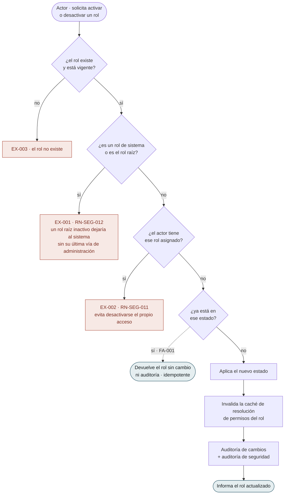
```mermaid
flowchart TD
    A(["Actor · solicita activar<br/>o desactivar un rol"])
    A --> V1{"¿el rol existe<br/>y está vigente?"}
    V1 -->|no| E3["EX-003 · el rol no existe"]
    V1 -->|sí| V2{"¿es un rol de sistema<br/>o es el rol raíz?"}
    V2 -->|sí| E1["EX-001 · RN-SEG-012<br/>un rol raíz inactivo dejaría al sistema<br/>sin su última vía de administración"]
    V2 -->|no| V3{"¿el actor tiene<br/>ese rol asignado?"}
    V3 -->|sí| E2["EX-002 · RN-SEG-011<br/>evita desactivarse el propio acceso"]
    V3 -->|no| D1{"¿ya está en<br/>ese estado?"}
    D1 -.->|"sí · FA-001"| F1(["Devuelve el rol sin cambio<br/>ni auditoría · idempotente"])
    D1 -->|no| P1["Aplica el nuevo estado"]
    P1 --> P2["Invalida la caché de resolución<br/>de permisos del rol"]
    P2 --> P3["Auditoría de cambios<br/>+ auditoría de seguridad"]
    P3 --> FIN(["Informa el rol actualizado"])

    classDef ex fill:#F7E9E5,stroke:#A33B2A,color:#7A2B1E
    classDef ok fill:#E5EEF0,stroke:#2D5A6B,color:#141B1E
    class E1,E2,E3 ex
    class FIN,F1 ok
```

Desactivar corta la concesión de permisos de inmediato para todos los portadores, pero **conserva intactas** sus asignaciones: reactivar lo restituye entero.

---

### `RF-SP-008` · Cambiar rol padre

La operación con más verificaciones del módulo: mueve un nodo de la jerarquía sin romper ni la aciclicidad ni la contención.

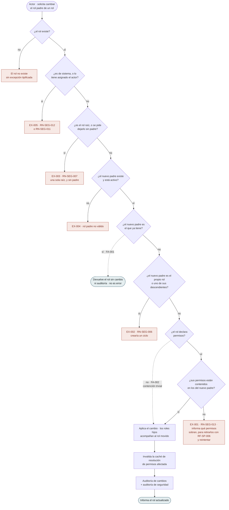
```mermaid
flowchart TD
    A(["Actor · solicita cambiar<br/>el rol padre de un rol"])
    A --> V1{"¿el rol existe?"}
    V1 -->|no| E0["El rol no existe<br/>sin excepción tipificada"]
    V1 -->|sí| V2{"¿es de sistema, o lo<br/>tiene asignado el actor?"}
    V2 -->|sí| E5["EX-005 · RN-SEG-012<br/>o RN-SEG-011"]
    V2 -->|no| V3{"¿es el rol raíz, o se pide<br/>dejarlo sin padre?"}
    V3 -->|sí| E3["EX-003 · RN-SEG-007<br/>una sola raíz, y sin padre"]
    V3 -->|no| V4{"¿el nuevo padre existe<br/>y está activo?"}
    V4 -->|no| E4["EX-004 · rol padre no válido"]
    V4 -->|sí| D1{"¿el nuevo padre es<br/>el que ya tiene?"}
    D1 -.->|"sí · FA-001"| F1(["Devuelve el rol sin cambio<br/>ni auditoría · no es error"])
    D1 -->|no| V5{"¿el nuevo padre es el propio rol<br/>o uno de sus descendientes?"}
    V5 -->|sí| E2["EX-002 · RN-SEG-006<br/>crearía un ciclo"]
    V5 -->|no| D2{"¿el rol declara<br/>permisos?"}
    D2 -.->|"no · FA-002<br/>contención trivial"| P1
    D2 -->|sí| V6{"¿sus permisos están contenidos<br/>en los del nuevo padre?"}
    V6 -->|no| E1["EX-001 · RN-SEG-013 · informa qué permisos<br/>sobran, para retirarlos con RF-SP-006<br/>y reintentar"]
    V6 -->|sí| P1["Aplica el cambio · los roles hijos<br/>acompañan al rol movido"]
    P1 --> P2["Invalida la caché de resolución<br/>de permisos afectada"]
    P2 --> P3["Auditoría de cambios<br/>+ auditoría de seguridad"]
    P3 --> FIN(["Informa el rol actualizado"])

    classDef ex fill:#F7E9E5,stroke:#A33B2A,color:#7A2B1E
    classDef ok fill:#E5EEF0,stroke:#2D5A6B,color:#141B1E
    class E0,E1,E2,E3,E4,E5 ex
    class FIN,F1 ok
```

---

### `RF-SP-009` · Eliminar rol

Sin flujos alternativos: o se cumplen todas las condiciones, o se rechaza.

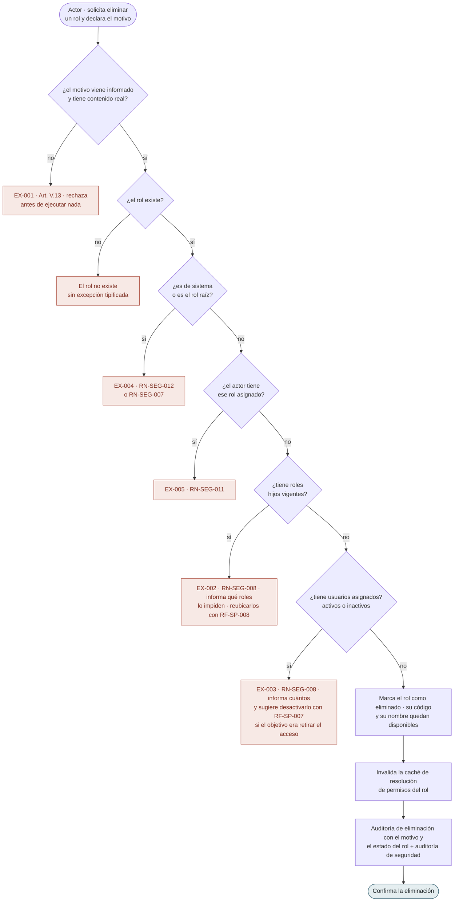
```mermaid
flowchart TD
    A(["Actor · solicita eliminar<br/>un rol y declara el motivo"])
    A --> V1{"¿el motivo viene informado<br/>y tiene contenido real?"}
    V1 -->|no| E1["EX-001 · Art. V.13 · rechaza<br/>antes de ejecutar nada"]
    V1 -->|sí| V2{"¿el rol existe?"}
    V2 -->|no| E0["El rol no existe<br/>sin excepción tipificada"]
    V2 -->|sí| V3{"¿es de sistema<br/>o es el rol raíz?"}
    V3 -->|sí| E4["EX-004 · RN-SEG-012<br/>o RN-SEG-007"]
    V3 -->|no| V4{"¿el actor tiene<br/>ese rol asignado?"}
    V4 -->|sí| E5["EX-005 · RN-SEG-011"]
    V4 -->|no| V5{"¿tiene roles<br/>hijos vigentes?"}
    V5 -->|sí| E2["EX-002 · RN-SEG-008 · informa qué roles<br/>lo impiden · reubicarlos con RF-SP-008"]
    V5 -->|no| V6{"¿tiene usuarios asignados?<br/>activos o inactivos"}
    V6 -->|sí| E3["EX-003 · RN-SEG-008 · informa cuántos<br/>y sugiere desactivarlo con RF-SP-007<br/>si el objetivo era retirar el acceso"]
    V6 -->|no| P1["Marca el rol como eliminado · su código<br/>y su nombre quedan disponibles"]
    P1 --> P2["Invalida la caché de resolución<br/>de permisos del rol"]
    P2 --> P3["Auditoría de eliminación con el motivo y<br/>el estado del rol + auditoría de seguridad"]
    P3 --> FIN(["Confirma la eliminación"])

    classDef ex fill:#F7E9E5,stroke:#A33B2A,color:#7A2B1E
    classDef ok fill:#E5EEF0,stroke:#2D5A6B,color:#141B1E
    class E0,E1,E2,E3,E4,E5 ex
    class FIN ok
```

---

## 2. Catálogo de permisos

### `RF-SP-010` · Consultar permisos

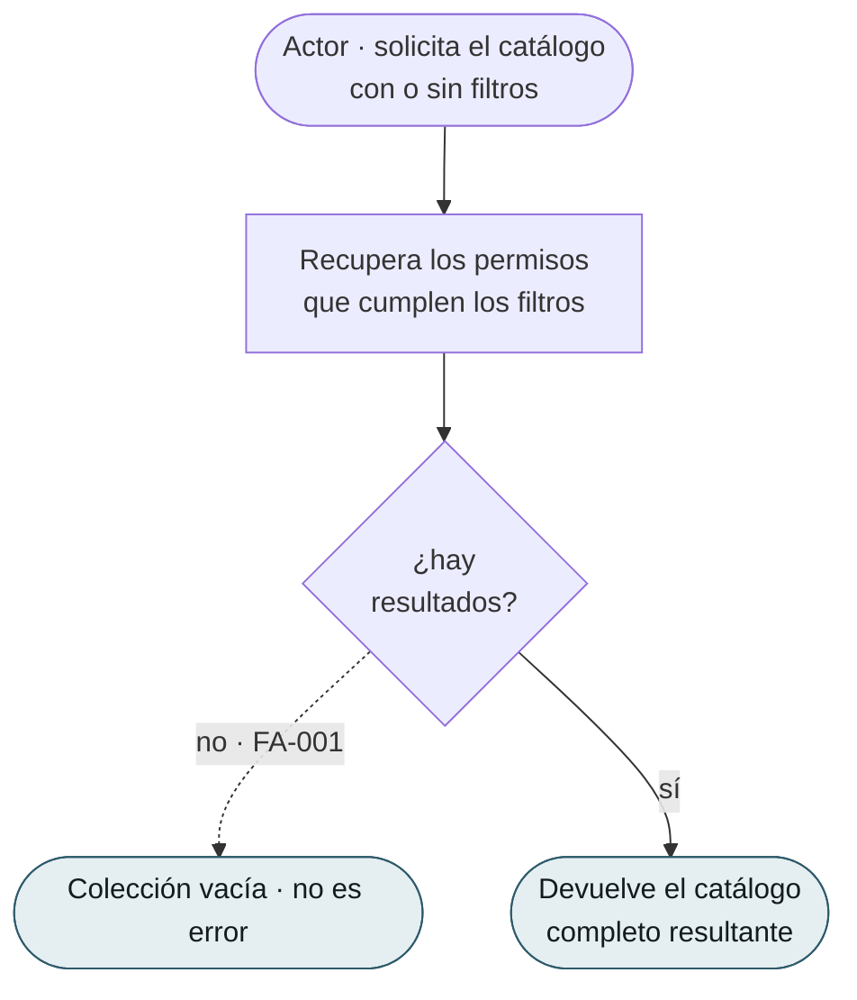
```mermaid
flowchart TD
    A(["Actor · solicita el catálogo<br/>con o sin filtros"])
    A --> P1["Recupera los permisos<br/>que cumplen los filtros"]
    P1 --> D1{"¿hay<br/>resultados?"}
    D1 -.->|"no · FA-001"| F1(["Colección vacía · no es error"])
    D1 -->|sí| FIN(["Devuelve el catálogo<br/>completo resultante"])

    classDef ok fill:#E5EEF0,stroke:#2D5A6B,color:#141B1E
    class FIN,F1 ok
```

Sin excepciones propias: autenticación y autorización se resuelven en el borde.

---

### `RF-SP-015` · Consultar detalle de permiso

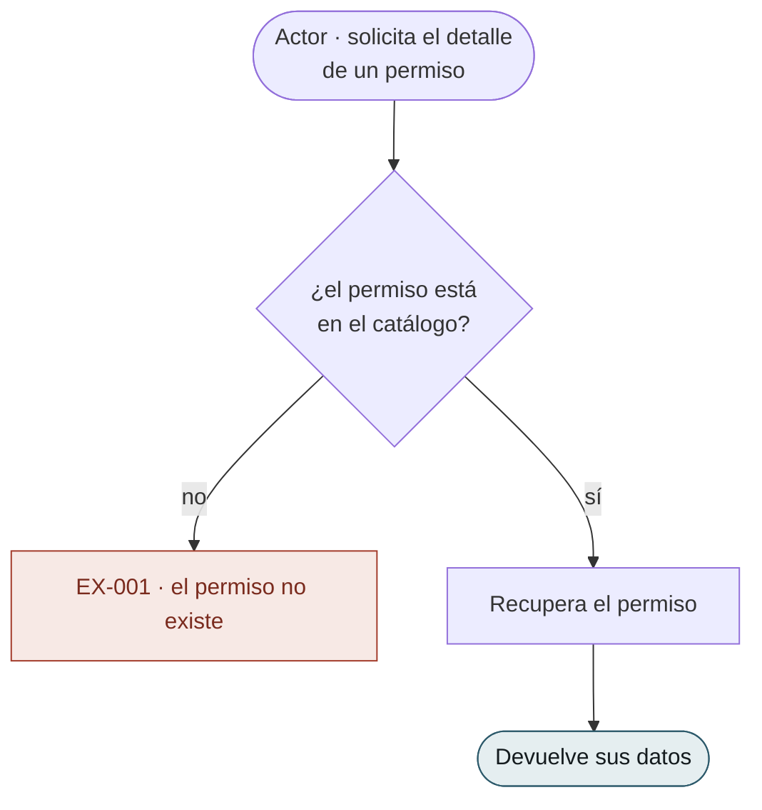
```mermaid
flowchart TD
    A(["Actor · solicita el detalle<br/>de un permiso"])
    A --> V1{"¿el permiso está<br/>en el catálogo?"}
    V1 -->|no| E1["EX-001 · el permiso no existe"]
    V1 -->|sí| P1["Recupera el permiso"]
    P1 --> FIN(["Devuelve sus datos"])

    classDef ex fill:#F7E9E5,stroke:#A33B2A,color:#7A2B1E
    classDef ok fill:#E5EEF0,stroke:#2D5A6B,color:#141B1E
    class E1 ex
    class FIN ok
```

---

## 3. Auditoría

Las cuatro consultas comparten esqueleto —validar, recuperar del más reciente al más antiguo, paginar—. Lo que las distingue es su flujo alternativo, y en un caso, un paso de más.

### `RF-SP-011` · Consultar auditoría de cambios

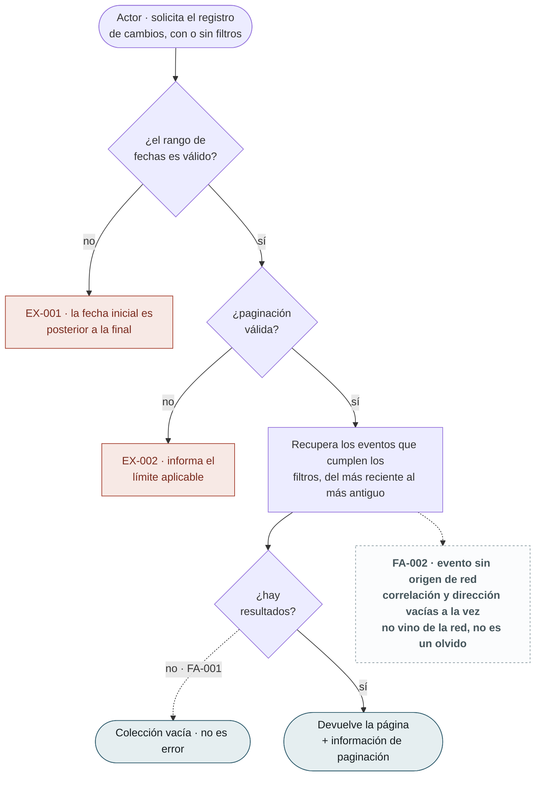
```mermaid
flowchart TD
    A(["Actor · solicita el registro<br/>de cambios, con o sin filtros"])
    A --> V1{"¿el rango de<br/>fechas es válido?"}
    V1 -->|no| E1["EX-001 · la fecha inicial es<br/>posterior a la final"]
    V1 -->|sí| V2{"¿paginación<br/>válida?"}
    V2 -->|no| E2["EX-002 · informa el<br/>límite aplicable"]
    V2 -->|sí| P1["Recupera los eventos que cumplen los<br/>filtros, del más reciente al más antiguo"]
    P1 --> D1{"¿hay<br/>resultados?"}
    D1 -.->|"no · FA-001"| F1(["Colección vacía · no es error"])
    D1 -->|sí| FIN(["Devuelve la página<br/>+ información de paginación"])
    P1 -.-> N1["FA-002 · evento sin origen de red<br/>correlación y dirección vacías <b>a la vez</b><br/>no vino de la red, no es un olvido"]

    classDef ex fill:#F7E9E5,stroke:#A33B2A,color:#7A2B1E
    classDef ok fill:#E5EEF0,stroke:#2D5A6B,color:#141B1E
    classDef fa fill:#FBFCFD,stroke:#8A9BA2,stroke-dasharray:3 3,color:#46565C
    class E1,E2 ex
    class FIN,F1 ok
    class N1 fa
```

---

### `RF-SP-012` · Consultar auditoría de eliminación

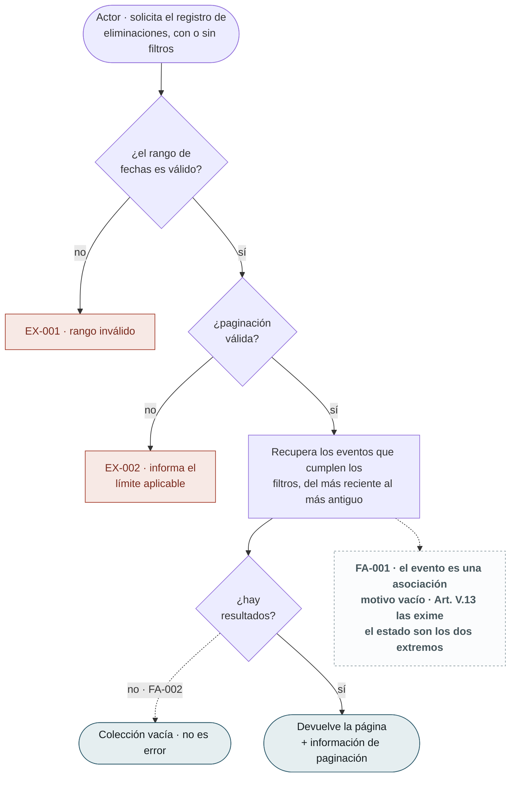
```mermaid
flowchart TD
    A(["Actor · solicita el registro de<br/>eliminaciones, con o sin filtros"])
    A --> V1{"¿el rango de<br/>fechas es válido?"}
    V1 -->|no| E1["EX-001 · rango inválido"]
    V1 -->|sí| V2{"¿paginación<br/>válida?"}
    V2 -->|no| E2["EX-002 · informa el<br/>límite aplicable"]
    V2 -->|sí| P1["Recupera los eventos que cumplen los<br/>filtros, del más reciente al más antiguo"]
    P1 --> D1{"¿hay<br/>resultados?"}
    D1 -.->|"no · FA-002"| F1(["Colección vacía · no es error"])
    D1 -->|sí| FIN(["Devuelve la página<br/>+ información de paginación"])
    P1 -.-> N1["FA-001 · el evento es una asociación<br/>motivo <b>vacío</b> · Art. V.13 las exime<br/>el estado son los dos extremos"]

    classDef ex fill:#F7E9E5,stroke:#A33B2A,color:#7A2B1E
    classDef ok fill:#E5EEF0,stroke:#2D5A6B,color:#141B1E
    classDef fa fill:#FBFCFD,stroke:#8A9BA2,stroke-dasharray:3 3,color:#46565C
    class E1,E2 ex
    class FIN,F1 ok
    class N1 fa
```

---

### `RF-SP-013` · Consultar auditoría de error

El diagnóstico por correlación no es un caso raro: es el flujo para el que existe esta consulta.

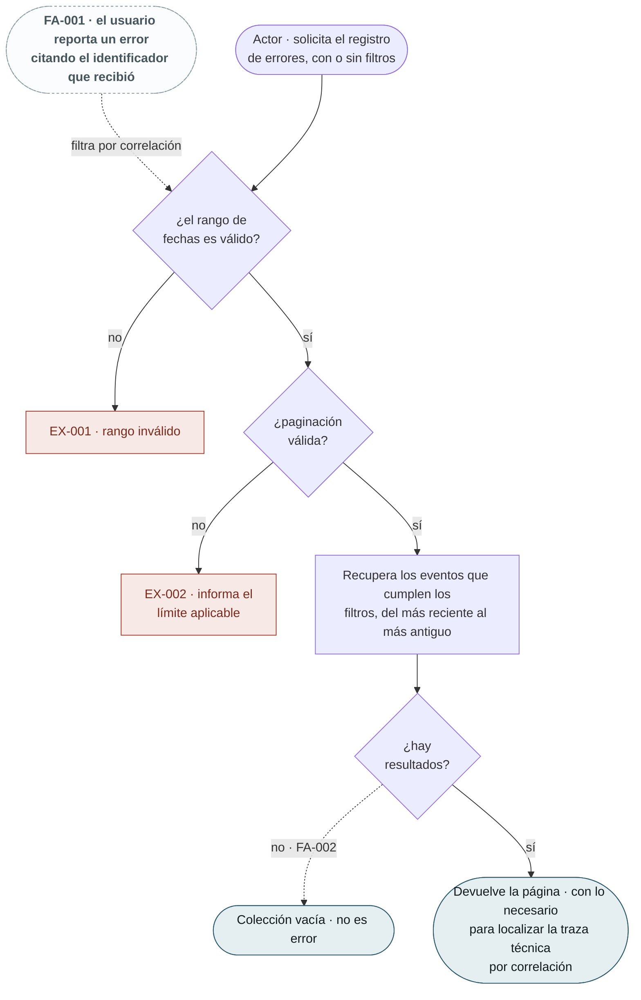
```mermaid
flowchart TD
    A(["Actor · solicita el registro<br/>de errores, con o sin filtros"])
    A2(["FA-001 · el usuario reporta un error<br/>citando el identificador que recibió"])
    A2 -.->|"filtra por correlación"| V1
    A --> V1{"¿el rango de<br/>fechas es válido?"}
    V1 -->|no| E1["EX-001 · rango inválido"]
    V1 -->|sí| V2{"¿paginación<br/>válida?"}
    V2 -->|no| E2["EX-002 · informa el<br/>límite aplicable"]
    V2 -->|sí| P1["Recupera los eventos que cumplen los<br/>filtros, del más reciente al más antiguo"]
    P1 --> D1{"¿hay<br/>resultados?"}
    D1 -.->|"no · FA-002"| F1(["Colección vacía · no es error"])
    D1 -->|sí| FIN(["Devuelve la página · con lo necesario<br/>para localizar la traza técnica<br/>por correlación"])

    classDef ex fill:#F7E9E5,stroke:#A33B2A,color:#7A2B1E
    classDef ok fill:#E5EEF0,stroke:#2D5A6B,color:#141B1E
    classDef fa fill:#FBFCFD,stroke:#8A9BA2,stroke-dasharray:3 3,color:#46565C
    class E1,E2 ex
    class FIN,F1 ok
    class A2 fa
```

---

### `RF-SP-014` · Consultar auditoría de seguridad

**La única consulta del módulo que escribe.** Mirar quién intentó qué contra el control de acceso es, en sí mismo, un evento de seguridad.

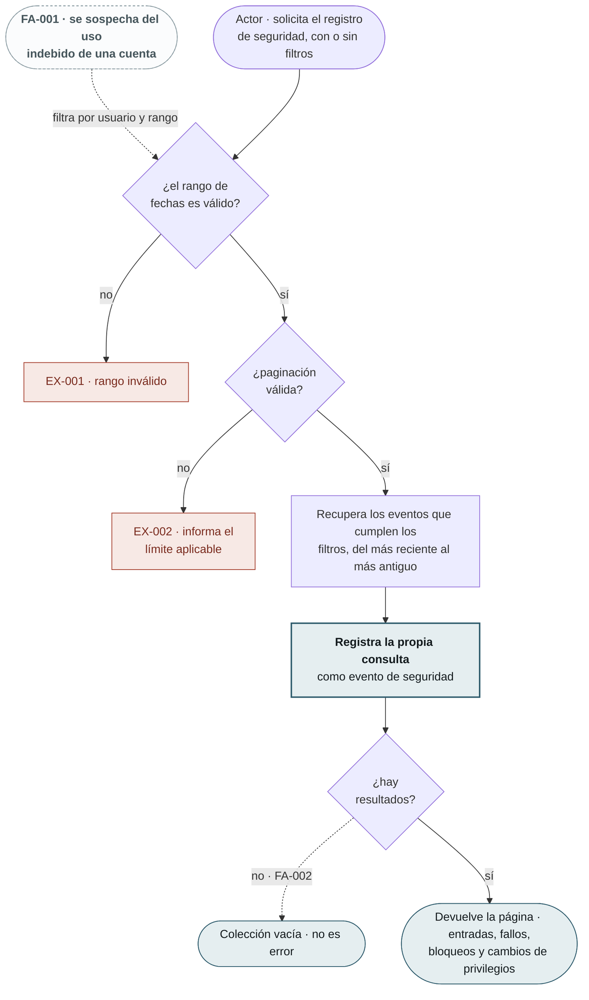
```mermaid
flowchart TD
    A(["Actor · solicita el registro<br/>de seguridad, con o sin filtros"])
    A2(["FA-001 · se sospecha del uso<br/>indebido de una cuenta"])
    A2 -.->|"filtra por usuario y rango"| V1
    A --> V1{"¿el rango de<br/>fechas es válido?"}
    V1 -->|no| E1["EX-001 · rango inválido"]
    V1 -->|sí| V2{"¿paginación<br/>válida?"}
    V2 -->|no| E2["EX-002 · informa el<br/>límite aplicable"]
    V2 -->|sí| P1["Recupera los eventos que cumplen los<br/>filtros, del más reciente al más antiguo"]
    P1 --> P2["<b>Registra la propia consulta</b><br/>como evento de seguridad"]
    P2 --> D1{"¿hay<br/>resultados?"}
    D1 -.->|"no · FA-002"| F1(["Colección vacía · no es error"])
    D1 -->|sí| FIN(["Devuelve la página · entradas, fallos,<br/>bloqueos y cambios de privilegios"])

    classDef ex fill:#F7E9E5,stroke:#A33B2A,color:#7A2B1E
    classDef ok fill:#E5EEF0,stroke:#2D5A6B,color:#141B1E
    classDef fa fill:#FBFCFD,stroke:#8A9BA2,stroke-dasharray:3 3,color:#46565C
    classDef esc fill:#E5EEF0,stroke:#2D5A6B,stroke-width:2px,color:#141B1E
    class E1,E2 ex
    class FIN,F1 ok
    class A2 fa
    class P2 esc
```

---

## 4. Membresías

### `RF-SP-016` · Registrar membresía

La cadena es lineal: cada membresía tiene como mucho una hija. Insertar en medio obliga a recolocar y a recalcular niveles.

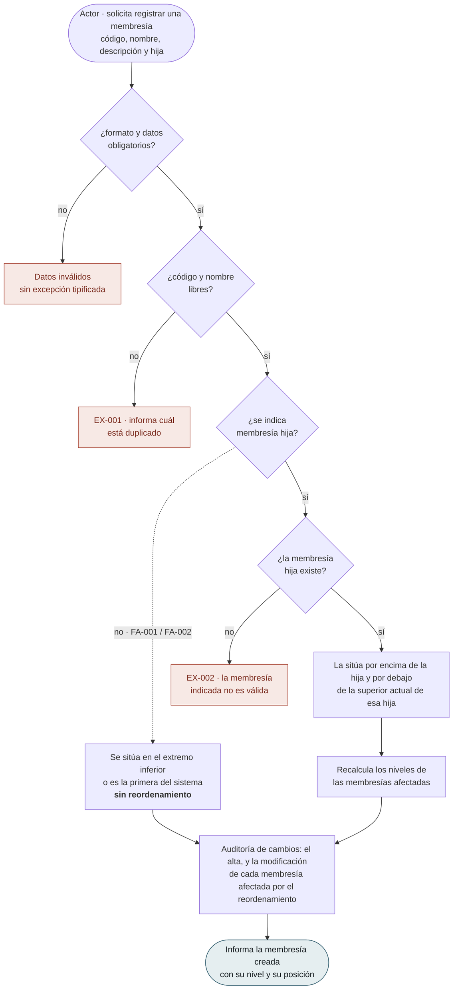
```mermaid
flowchart TD
    A(["Actor · solicita registrar una membresía<br/>código, nombre, descripción y hija"])
    A --> V1{"¿formato y datos<br/>obligatorios?"}
    V1 -->|no| E0["Datos inválidos<br/>sin excepción tipificada"]
    V1 -->|sí| V2{"¿código y nombre<br/>libres?"}
    V2 -->|no| E1["EX-001 · informa cuál<br/>está duplicado"]
    V2 -->|sí| D1{"¿se indica<br/>membresía hija?"}
    D1 -.->|"no · FA-001 / FA-002"| P0["Se sitúa en el extremo inferior<br/>o es la primera del sistema<br/><b>sin reordenamiento</b>"]
    D1 -->|sí| V3{"¿la membresía<br/>hija existe?"}
    V3 -->|no| E2["EX-002 · la membresía<br/>indicada no es válida"]
    V3 -->|sí| P1["La sitúa por encima de la hija y por debajo<br/>de la superior actual de esa hija"]
    P1 --> P2["Recalcula los niveles de<br/>las membresías afectadas"]
    P0 --> P3
    P2 --> P3["Auditoría de cambios: el alta, y la modificación<br/>de cada membresía afectada por el reordenamiento"]
    P3 --> FIN(["Informa la membresía creada<br/>con su nivel y su posición"])

    classDef ex fill:#F7E9E5,stroke:#A33B2A,color:#7A2B1E
    classDef ok fill:#E5EEF0,stroke:#2D5A6B,color:#141B1E
    class E0,E1,E2 ex
    class FIN ok
```

---

### `RF-SP-017` · Consultar membresías

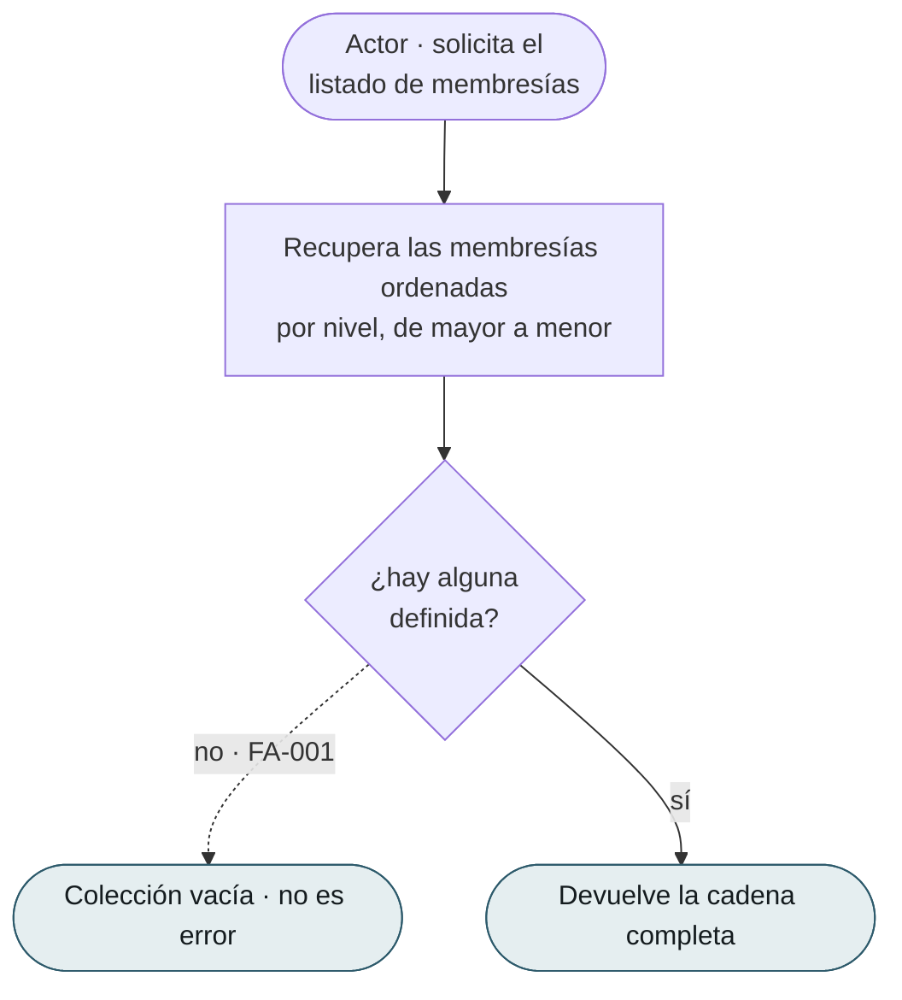
```mermaid
flowchart TD
    A(["Actor · solicita el<br/>listado de membresías"])
    A --> P1["Recupera las membresías ordenadas<br/>por nivel, de mayor a menor"]
    P1 --> D1{"¿hay alguna<br/>definida?"}
    D1 -.->|"no · FA-001"| F1(["Colección vacía · no es error"])
    D1 -->|sí| FIN(["Devuelve la cadena completa"])

    classDef ok fill:#E5EEF0,stroke:#2D5A6B,color:#141B1E
    class FIN,F1 ok
```

---

### `RF-SP-018` · Consultar detalle de membresía

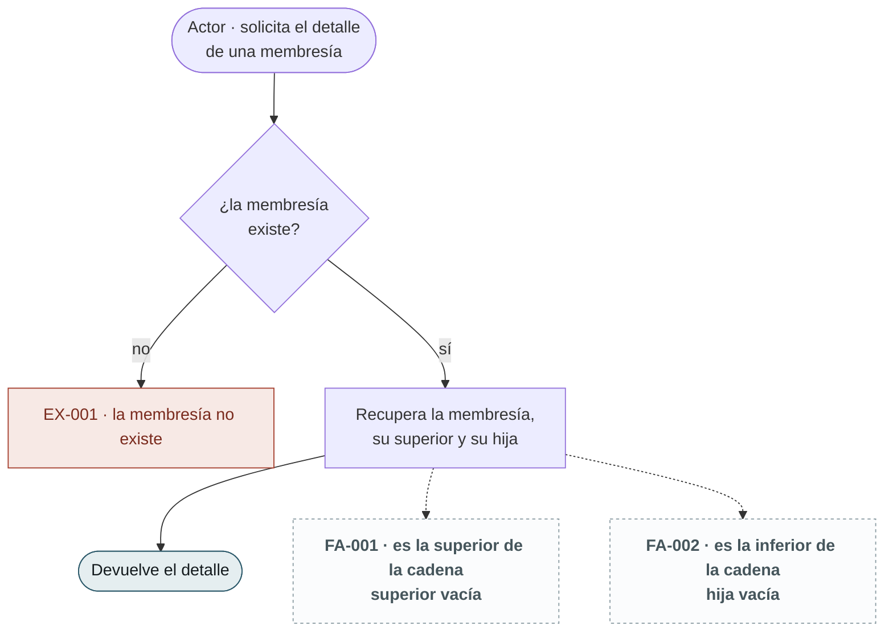
```mermaid
flowchart TD
    A(["Actor · solicita el detalle<br/>de una membresía"])
    A --> V1{"¿la membresía<br/>existe?"}
    V1 -->|no| E1["EX-001 · la membresía no existe"]
    V1 -->|sí| P1["Recupera la membresía,<br/>su superior y su hija"]
    P1 --> FIN(["Devuelve el detalle"])
    P1 -.-> N1["FA-001 · es la superior de la cadena<br/>superior vacía"]
    P1 -.-> N2["FA-002 · es la inferior de la cadena<br/>hija vacía"]

    classDef ex fill:#F7E9E5,stroke:#A33B2A,color:#7A2B1E
    classDef ok fill:#E5EEF0,stroke:#2D5A6B,color:#141B1E
    classDef fa fill:#FBFCFD,stroke:#8A9BA2,stroke-dasharray:3 3,color:#46565C
    class E1 ex
    class FIN ok
    class N1,N2 fa
```

---

## 5. Monedas y países

### `RF-SP-019` · Consultar monedas

Sin flujos alternativos y sin excepciones propias. Hoy devuelve un único elemento, y aun así existe: el catálogo está desde el principio para que sumar una moneda sea insertar una fila.

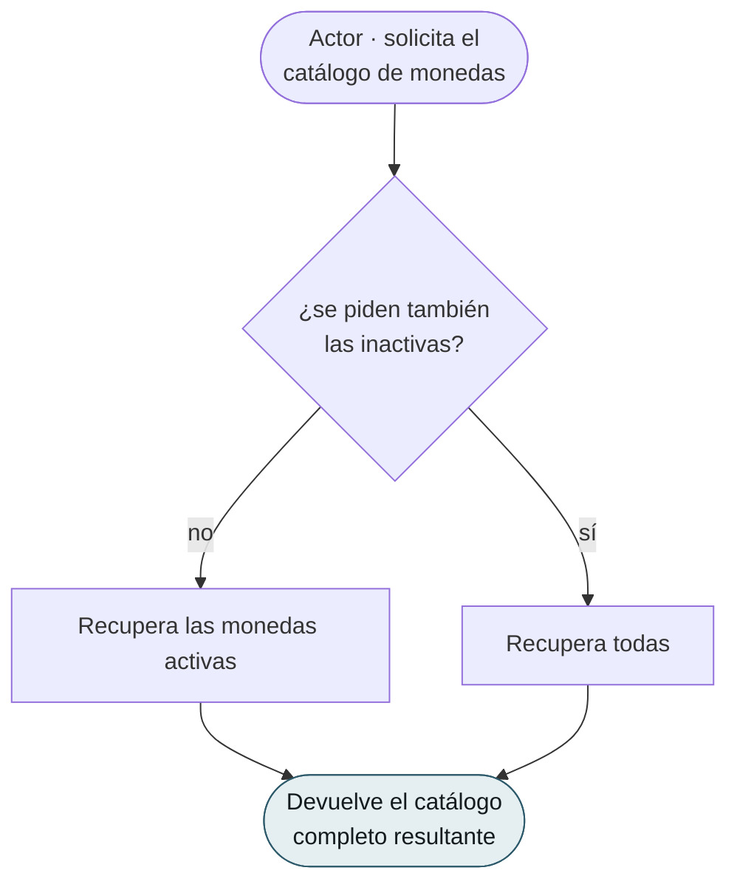
```mermaid
flowchart TD
    A(["Actor · solicita el<br/>catálogo de monedas"])
    A --> D1{"¿se piden también<br/>las inactivas?"}
    D1 -->|no| P1["Recupera las monedas activas"]
    D1 -->|sí| P2["Recupera todas"]
    P1 --> FIN(["Devuelve el catálogo<br/>completo resultante"])
    P2 --> FIN

    classDef ok fill:#E5EEF0,stroke:#2D5A6B,color:#141B1E
    class FIN ok
```

---

### `RF-SP-020` · Registrar país

Sin flujos alternativos. El código y el nombre son **definitivos**: no hay edición ni baja, y por eso un duplicado sería permanente. Lo único reversible es el estado, con `RF-SP-022` (`RN-SP-009`).

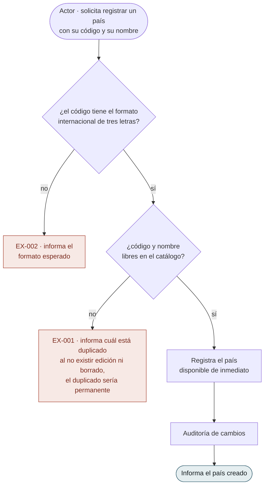
```mermaid
flowchart TD
    A(["Actor · solicita registrar un país<br/>con su código y su nombre"])
    A --> V1{"¿el código tiene el formato<br/>internacional de tres letras?"}
    V1 -->|no| E2["EX-002 · informa el<br/>formato esperado"]
    V1 -->|sí| V2{"¿código y nombre<br/>libres en el catálogo?"}
    V2 -->|no| E1["EX-001 · informa cuál está duplicado<br/>al no existir edición ni borrado,<br/>el duplicado sería permanente"]
    V2 -->|sí| P1["Registra el país<br/>disponible de inmediato"]
    P1 --> P2["Auditoría de cambios"]
    P2 --> FIN(["Informa el país creado"])

    classDef ex fill:#F7E9E5,stroke:#A33B2A,color:#7A2B1E
    classDef ok fill:#E5EEF0,stroke:#2D5A6B,color:#141B1E
    class E1,E2 ex
    class FIN ok
```

---

### `RF-SP-021` · Consultar países

```mermaid
flowchart TD
    A(["Actor · solicita el catálogo<br/>de países, con o sin búsqueda"])
    A --> D1{"¿se piden también<br/>los inactivos?"}
    D1 -->|no| P1["Recupera los países activos que<br/>cumplen la búsqueda, por nombre"]
    D1 -->|sí| P2["Recupera todos, por nombre"]
    P1 --> D2{"¿hay<br/>resultados?"}
    P2 --> D2
    D2 -.->|"no · FA-001"| F1(["Colección vacía · no es error"])
    D2 -->|sí| FIN(["Devuelve el catálogo<br/>completo resultante"])

    classDef ok fill:#E5EEF0,stroke:#2D5A6B,color:#141B1E
    class FIN,F1 ok
```

---

### `RF-SP-022` · Cambiar el estado de un país

```mermaid
flowchart TD
    A(["Actor · solicita activar<br/>o desactivar un país"])
    A --> V1{"¿el estado pedido<br/>está en el dominio?"}
    V1 -->|no| E0["Estado no válido · VAL-001<br/>sin excepción tipificada"]
    V1 -->|sí| V2{"¿el país existe<br/>en el catálogo?"}
    V2 -->|no| E1["EX-001 · el país no existe"]
    V2 -->|sí| D1{"¿ya está en<br/>ese estado?"}
    D1 -.->|"sí · FA-001"| F1(["Devuelve el país sin cambio<br/>ni auditoría · idempotente, igual<br/>que RF-SP-007"])
    D1 -->|no| P1["Aplica el nuevo estado · el código y el<br/>nombre no se tocan, y lo que ya lo<br/>referencia lo sigue resolviendo"]
    P1 --> P2["Auditoría de cambios<br/>con el estado anterior y el nuevo"]
    P2 --> FIN(["Informa el país actualizado"])

    classDef ex fill:#F7E9E5,stroke:#A33B2A,color:#7A2B1E
    classDef ok fill:#E5EEF0,stroke:#2D5A6B,color:#141B1E
    class E0,E1 ex
    class FIN,F1 ok
```

Desactivar no borra nada: el país deja de aparecer en `RF-SP-021` —salvo que se pidan los inactivos— y deja de poder elegirse en altas nuevas, pero los datos que ya lo apuntan lo siguen resolviendo.

---

### `RF-SP-023` · Cambiar el estado de una moneda

Mismo flujo que `RF-SP-022` con una verificación más, y es la que justifica que sean dos requerimientos y no uno.

```mermaid
flowchart TD
    A(["Actor · solicita activar<br/>o desactivar una moneda"])
    A --> V1{"¿el estado pedido<br/>está en el dominio?"}
    V1 -->|no| E0["Estado no válido · VAL-001<br/>sin excepción tipificada"]
    V1 -->|sí| V2{"¿la moneda existe<br/>en el catálogo?"}
    V2 -->|no| E2["EX-002 · la moneda no existe"]
    V2 -->|sí| D1{"¿se pide<br/>desactivarla?"}
    D1 -->|sí| V3{"¿es la moneda<br/>por defecto?"}
    V3 -->|sí| E1["EX-001 · RN-SP-010 · los importes del sistema<br/>quedarían sin referencia válida · cambiar cuál es<br/>la moneda por defecto es migración, no API"]
    V3 -->|no| D2
    D1 -->|no| D2{"¿ya está en<br/>ese estado?"}
    D2 -.->|"sí · FA-001"| F1(["Devuelve la moneda sin cambio<br/>ni auditoría · idempotente"])
    D2 -->|no| P1["Aplica el nuevo estado · código, nombre,<br/>símbolo y decimales quedan intactos"]
    P1 --> P2["Auditoría de cambios · <b>no</b> de seguridad"]
    P2 --> FIN(["Informa la moneda actualizada"])

    classDef ex fill:#F7E9E5,stroke:#A33B2A,color:#7A2B1E
    classDef ok fill:#E5EEF0,stroke:#2D5A6B,color:#141B1E
    class E0,E1,E2 ex
    class FIN,F1 ok
```

La moneda por defecto es a este catálogo lo que el rol raíz es a la jerarquía: el único elemento que no admite la operación, porque sin él el resto pierde su punto de referencia.

---

## 6. Usuarios

### `RF-SP-024` · Registrar usuario

La operación con más compuertas de todo el módulo: ocho verificaciones antes de escribir. Tres de ellas —contención, membresía y superior— no comprueban el dato en sí, sino que la persona no quede en un estado que ninguna otra operación sabría deshacer.

```mermaid
flowchart TD
    A(["Actor · solicita el alta · datos de la persona,<br/>credencial, roles, membresía y superior"])
    A --> V1{"¿formato y datos<br/>obligatorios?"}
    V1 -->|no| E0["Datos inválidos<br/>sin excepción tipificada"]
    V1 -->|sí| V2{"¿la contraseña cumple<br/>la política mínima?"}
    V2 -->|no| E2["EX-002 · informa <b>qué</b> regla incumple,<br/>sin reproducir la contraseña en ningún registro"]
    V2 -->|sí| V3{"¿usuario y correo libres,<br/><b>incluidos los eliminados</b>?"}
    V3 -->|no| E1["EX-001 · RN-SP-016 · informa cuál de los dos,<br/>sin decir si el conflicto es con una cuenta<br/>viva o con una eliminada"]
    V3 -->|sí| D1{"¿declara<br/>roles?"}
    D1 -.->|"no · FA-001"| P1
    D1 -->|sí| V4{"¿existen, no eliminados<br/>y activos?"}
    V4 -->|no| E3["EX-003 · rechaza el alta <b>completa</b>: crear al<br/>usuario sin esos roles sería un estado que<br/>nadie pidió"]
    V4 -->|sí| V5{"¿contenidos en los permisos<br/>efectivos del actor?"}
    V5 -->|no| E4["EX-004 · RN-SEG-010 · sin esta verificación, quien<br/>puede crear usuarios podría fabricarse<br/>un superadministrador"]
    V5 -->|sí| V6{"¿rol CONSUMIDOR y<br/>membresía van juntos?"}
    V6 -->|no| E5["EX-005 · RN-SP-018 · el rol de consumidor y el<br/>nivel de acceso se conceden juntos, o ninguno"]
    V6 -->|sí| V7{"¿rol VENDEDOR y<br/>superior van juntos?"}
    V7 -->|no| E6["EX-006 · RN-SP-019 · mismo trato que EX-005 da<br/>al par consumidor-membresía · salvo la<br/>cúspide de la fuerza comercial"]
    V7 -->|sí| V8{"¿el superior existe, está ACTIVO<br/>y porta el rol padre inmediato?"}
    V8 -->|no| E7["EX-007 · RN-SP-020 · informa qué rol debería portar ·<br/>admitirlo dejaría la estructura de personas<br/>contradiciendo el orden de mando de los roles"]
    V8 -->|sí| P1["Registra la persona con su credencial protegida<br/>—Argon2id, no recuperable— y sus roles"]
    P1 --> P2["La marca para <b>cambio obligatorio</b><br/>de contraseña"]
    P2 --> P3["Cuando procede, escribe su superior comercial en la<br/><b>misma transacción</b>: no hay un instante en que<br/>el vendedor esté creado y sin superior"]
    P3 --> P4["Auditoría de cambios + auditoría de seguridad,<br/>sin ningún dato de la credencial · Art. IV.8"]
    P4 --> FIN(["Informa el usuario creado"])

    classDef ex fill:#F7E9E5,stroke:#A33B2A,color:#7A2B1E
    classDef ok fill:#E5EEF0,stroke:#2D5A6B,color:#141B1E
    class E0,E1,E2,E3,E4,E5,E6,E7 ex
    class FIN ok
```

`FA-001` — sin roles la persona queda registrada y **autenticable, pero sin permiso efectivo alguno**. Es un estado válido y transitorio, a la espera de `RF-SP-030`.

El nombre de usuario y el correo quedan reservados **de forma permanente**: `RF-SP-029` no los libera. Es la asimetría deliberada con `roles`, cuyo código y nombre sí vuelven a estar libres al eliminarse.

---

### `RF-SP-025` · Consultar usuarios

```mermaid
flowchart TD
    A(["Actor · solicita el listado<br/>con o sin filtros"])
    A --> V1{"¿paginación<br/>válida?"}
    V1 -->|no| E1["EX-001 · informa el parámetro<br/>inválido y su límite"]
    V1 -->|sí| V2{"¿campo de orden<br/>conocido?"}
    V2 -->|no| E2["EX-002 · informa qué campos admite ·<br/><b>ninguno de la credencial</b>"]
    V2 -->|sí| P1["Recupera los usuarios que cumplen los filtros<br/>· excluye los eliminados salvo indicación contraria"]
    P1 --> D1{"¿hay<br/>resultados?"}
    D1 -.->|"no · FA-001"| F1(["Colección vacía con la paginación<br/>en cero · no es error"])
    D1 -->|sí| FIN(["Devuelve la página con su<br/>información de paginación"])

    classDef ex fill:#F7E9E5,stroke:#A33B2A,color:#7A2B1E
    classDef ok fill:#E5EEF0,stroke:#2D5A6B,color:#141B1E
    class E1,E2 ex
    class FIN,F1 ok
```

---

### `RF-SP-026` · Consultar detalle de usuario

La consulta que explica **por qué** alguien no puede hacer nada, distinguiendo dos causas que desde fuera se parecen.

```mermaid
flowchart TD
    A(["Actor · solicita el detalle<br/>de un usuario"])
    A --> V1{"¿el usuario existe<br/>y no está eliminado?"}
    V1 -->|no| E1["EX-001 · no distingue entre nunca haber<br/>existido y haber sido eliminado"]
    V1 -->|sí| P1["Recupera la persona con sus roles<br/>y su membresía vigente"]
    P1 --> P2["Resuelve los permisos efectivos: unión de<br/>los permisos de sus <b>roles activos</b>"]
    P2 --> D1{"¿qué roles<br/>tiene?"}
    D1 -.->|"ninguno · FA-001"| F1(["Roles y permisos efectivos vacíos ·<br/>puede autenticarse, no puede hacer nada"])
    D1 -.->|"los tiene, todos inactivos · FA-002"| F2(["Devuelve los roles marcados como inactivos y<br/>los permisos efectivos <b>vacíos</b> · RN-SEG-002"])
    D1 -->|"con alguno activo"| FIN(["Devuelve el detalle completo"])

    classDef ex fill:#F7E9E5,stroke:#A33B2A,color:#7A2B1E
    classDef ok fill:#E5EEF0,stroke:#2D5A6B,color:#141B1E
    class E1 ex
    class FIN,F1,F2 ok
```

`FA-001` y `FA-002` devuelven la misma lista de permisos —vacía— por motivos distintos. Es la diferencia entre «no le han dado nada» y «lo que le dieron está apagado», y solo se ve mirando la lista de roles.

---

### `RF-SP-027` · Editar usuario

```mermaid
flowchart TD
    A(["Actor · solicita editar los datos<br/>de un usuario"])
    A --> V1{"¿el usuario existe<br/>y no está eliminado?"}
    V1 -->|no| E2["EX-002 · el usuario no existe"]
    V1 -->|sí| D1{"¿envía<br/>correo?"}
    D1 -->|sí| V2{"¿libre entre los<br/>demás usuarios?"}
    V2 -->|no| E1["EX-001 · informa el conflicto<br/>sin revelar de qué usuario se trata"]
    V2 -->|sí| D2
    D1 -->|no| D2{"¿algún valor<br/>cambia de verdad?"}
    D2 -.->|"no · FA-001"| F1(["Devuelve el usuario sin cambio<br/>ni auditoría · no es error"])
    D2 -->|sí| P1["Aplica los cambios · no toca nombre de usuario,<br/>roles, membresía, estado ni credencial"]
    P1 --> P2["Auditoría de cambios con el antes y el<br/>después de cada campo modificado"]
    P2 --> D3{"¿cambió<br/>el correo?"}
    D3 -->|sí| P3["Auditoría de seguridad, severidad alta ·<br/>el usuario afectado es el objeto del evento"]
    D3 -->|no| FIN
    P3 --> FIN(["Informa el usuario actualizado"])

    classDef ex fill:#F7E9E5,stroke:#A33B2A,color:#7A2B1E
    classDef ok fill:#E5EEF0,stroke:#2D5A6B,color:#141B1E
    class E1,E2 ex
    class FIN,F1 ok
```

El correo es el único campo editable que además es identificador de acceso: por eso cambiarlo emite evento de seguridad y el resto de campos no.

---

### `RF-SP-028` · Cambiar el estado de un usuario

El flujo con más ramas del módulo. Las tres verificaciones del centro —motivo, último administrador y equipo a cargo— **solo se ejecutan cuando se retira el acceso**; devolverlo no las atraviesa.

```mermaid
flowchart TD
    A(["Actor · solicita activar, desactivar<br/>o bloquear una cuenta"])
    A --> V1{"¿el usuario existe<br/>y no está eliminado?"}
    V1 -->|no| E5["EX-005 · el usuario no existe"]
    V1 -->|sí| V2{"¿es la cuenta<br/>del propio actor?"}
    V2 -->|sí| E2["EX-002 · RN-SP-017 · evita que alguien se retire<br/>su propio acceso y quede sin poder revertirlo"]
    V2 -->|no| D1{"¿el estado pedido<br/>retira el acceso?"}
    D1 -->|"no · lo devuelve"| V6{"¿trae<br/>motivo?"}
    V6 -->|sí| E4["EX-004 · campo no admitido · devolver el acceso<br/>no es lo que hay que justificar"]
    V6 -->|no| D2
    D1 -->|sí| V3{"¿el motivo viene con<br/>contenido real?"}
    V3 -->|no| E1["EX-001 · rechaza <b>antes</b> de ejecutar nada"]
    V3 -->|sí| V4{"¿es el último <b>activo</b><br/>con el rol raíz?"}
    V4 -->|sí| E3["EX-003 · RN-SP-001 · se evalúa sobre el estado<br/>vigente al aplicar el cambio, no antes"]
    V4 -->|no| V5{"¿tiene gente<br/>a cargo?"}
    V5 -->|sí| E6["EX-006 · RN-SP-022 · informa <b>cuántas</b>, sin<br/>listarlas · se reasignan con RF-SP-041"]
    V5 -->|no| D2{"¿ya está en<br/>ese estado?"}
    D2 -.->|"sí · FA-001"| F1(["Devuelve la cuenta sin cambio<br/>ni auditoría · idempotente"])
    D2 -.->|"bloqueada por el sistema y<br/>ahora a mano · FA-003"| P1
    D2 -->|no| P1["Aplica el nuevo estado · el bloqueo por decisión de<br/>un actor <b>no tiene momento de expiración</b>"]
    P1 --> D3{"¿la cuenta<br/>queda activa?"}
    D3 -.->|"sí · FA-002"| P2["Levanta el bloqueo y pone a cero el contador<br/>de intentos fallidos · <b>misma credencial</b>"]
    D3 -->|no| P3["Revoca <b>todos</b> sus refresh tokens · sus tokens de<br/>acceso vigentes dejan de admitirse sin esperar<br/>a que expiren"]
    P2 --> P4
    P3 --> P4["Auditoría de cambios + auditoría de seguridad · el<br/>usuario afectado es el objeto, con el motivo<br/>en el detalle cuando lo hubo"]
    P4 --> FIN(["Informa el usuario actualizado"])

    classDef ex fill:#F7E9E5,stroke:#A33B2A,color:#7A2B1E
    classDef ok fill:#E5EEF0,stroke:#2D5A6B,color:#141B1E
    class E1,E2,E3,E4,E5,E6 ex
    class FIN,F1 ok
```

`FA-003` es **el único caso del módulo en que pedir el estado que ya se tiene no es una operación vacía**: la cuenta sigue bloqueada, pero el bloqueo pasa de automático a manual y deja de levantarse solo. Cambian su origen y su duración, así que sí hay evento.

`EX-006` alcanza solo al cambio de estado **por decisión de un actor**. El bloqueo automático por intentos fallidos de `RF-SP-034` no lo atraviesa: es una respuesta de seguridad, y no puede quedar supeditada a que alguien reorganice un equipo primero.

---

### `RF-SP-029` · Eliminar usuario

```mermaid
flowchart TD
    A(["Actor · solicita eliminar un usuario<br/>y declara el motivo"])
    A --> V1{"¿el motivo viene<br/>con contenido?"}
    V1 -->|no| E1["EX-001 · Art. V.13 · rechaza <b>antes</b><br/>de ejecutar nada"]
    V1 -->|sí| V2{"¿el usuario existe y<br/>no está ya eliminado?"}
    V2 -->|no| E4["EX-004 · no distingue entre nunca haber<br/>existido y estar ya eliminado"]
    V2 -->|sí| V3{"¿es la cuenta<br/>del propio actor?"}
    V3 -->|sí| E2["EX-002 · RN-SP-017"]
    V3 -->|no| V4{"¿es el último <b>activo</b><br/>con el rol raíz?"}
    V4 -->|sí| E3["EX-003 · RN-SP-001 · el sistema quedaría sin<br/>ninguna vía de administración"]
    V4 -->|no| V5{"¿tiene gente<br/>a cargo?"}
    V5 -->|sí| E5["EX-005 · RN-SP-022 · misma protección que<br/>RN-SEG-008 da a un rol con hijos · informa<br/>cuántas, sin listarlas"]
    V5 -->|no| P1["<b>Captura el estado</b> de la persona —roles,<br/>membresía y superior— antes de tocar nada"]
    P1 --> P2["Marca al usuario como eliminado, <b>retira</b> sus roles<br/>y su membresía y <b>cierra</b> su asignación de superior"]
    P2 --> P3["Revoca todos sus refresh tokens"]
    P3 --> P4["Auditoría de eliminación con el motivo y ese<br/>estado + auditoría de seguridad"]
    P4 --> FIN(["Confirma la eliminación · su usuario y su correo<br/><b>siguen reservados</b>: ningún alta puede tomarlos"])

    classDef ex fill:#F7E9E5,stroke:#A33B2A,color:#7A2B1E
    classDef ok fill:#E5EEF0,stroke:#2D5A6B,color:#141B1E
    class E1,E2,E3,E4,E5 ex
    class FIN ok
```

El orden de `P1` y `P2` **no es indiferente**: si las asignaciones se borraran antes de capturar el estado, el evento de auditoría quedaría sin ellas y la información se perdería sin que nada fallara.

Roles y membresía **desaparecen**; la asignación de superior **se cierra con fecha**. Aquellos decían qué podía hacer hoy y no significan nada una vez la persona se va; el historial de mando dice a quién se atribuía su producción, y eso lo necesitarán las comisiones mucho después de la baja (`RN-SP-021`).

---

### `RF-SP-039` · Consultar el perfil propio

**La única operación del módulo que no exige ningún permiso.** Basta con estar autenticado: quien pregunta y de quien se pregunta son la misma persona.

```mermaid
flowchart TD
    A(["Persona autenticada ·<br/>solicita su propio perfil"])
    A --> V1{"¿trae credencial<br/>válida?"}
    V1 -->|no| E1["EX-001 · falta de <b>autenticación</b>, no falta<br/>de permiso · architecture.md §7.2"]
    V1 -->|sí| V2{"¿la cuenta sigue<br/>existiendo?"}
    V2 -->|no| E2["EX-002 · el token de acceso sobrevive hasta 15 min<br/>a la eliminación · responde no autenticado"]
    V2 -->|sí| P1["Recupera datos, roles, membresía vigente, último<br/>inicio de sesión y superior comercial vigente"]
    P1 --> P2["Resuelve los permisos efectivos: unión<br/>de los de sus roles activos"]
    P2 --> FIN(["Devuelve el perfil"])
    FIN -.->|"FA-001 · sin roles activos"| F1(["Permisos efectivos <b>vacíos</b> · permite a la interfaz<br/>explicarlo en vez de mostrar una pantalla rota"])
    FIN -.->|"FA-002 · cambio obligatorio pendiente"| F2(["Indicador activo · la interfaz lleva a RF-SP-037 en<br/>lugar de dejarla chocar contra el rechazo<br/>de todos los demás endpoints"])
    FIN -.->|"FA-003 · no es vendedora o es la cúspide"| F3(["Perfil <b>sin</b> superior comercial · no es un dato<br/>faltante: es el estado normal de la mayoría"])

    classDef ex fill:#F7E9E5,stroke:#A33B2A,color:#7A2B1E
    classDef ok fill:#E5EEF0,stroke:#2D5A6B,color:#141B1E
    class E1,E2 ex
    class FIN,F1,F2,F3 ok
```

---
## 7. Roles y membresía de una persona

Las cuatro operaciones que conectan a una persona con lo que puede hacer y con el nivel que tiene contratado. Ninguna de las cuatro cambia sola: `RN-SP-018` obliga a que el rol de consumidor y la membresía viajen juntos, y `RN-SP-019` hace lo mismo con el rol de vendedor y el superior comercial.

### `RF-SP-030` · Asignar roles a un usuario

```mermaid
flowchart TD
    A(["Actor · solicita asignar uno o varios<br/>roles a un usuario"])
    A --> V1{"¿el usuario existe<br/>y no está eliminado?"}
    V1 -->|no| E4["EX-004 · el usuario no existe"]
    V1 -->|sí| V2{"¿los roles existen y no<br/>están eliminados?"}
    V2 -->|no| E2["EX-002 · rechaza la operación completa e informa<br/>cuáles, sin distinguir entre nunca haber<br/>existido y haber sido eliminado"]
    V2 -->|sí| V3{"¿todos<br/>activos?"}
    V3 -->|no| E3["EX-003 · un rol inactivo no concedería nada<br/>—RN-SEG-002— y dejaría a quien lo<br/>asigna creyendo que sí"]
    V3 -->|sí| V4{"¿contenidos en los permisos<br/>efectivos del actor?"}
    V4 -->|no| E1["EX-001 · RN-SEG-010 · la excepción que impide<br/>la escalada de privilegios"]
    V4 -->|sí| V5{"¿primer rol CONSUMIDOR<br/>acompañado de membresía?"}
    V5 -->|no| E5["EX-005 · RN-SP-018 · «consumidor sin nivel» no existe,<br/>y admitirlo dejaría a la persona en un limbo del que<br/>solo se sale con otra llamada que nadie garantiza"]
    V5 -->|sí| V6{"¿se indica membresía<br/>sin que corresponda?"}
    V6 -->|sí| E6["EX-006 · campo no admitido · cambiar el nivel de quien<br/>ya lo tiene es RF-SP-032 · aceptarlo aquí sería una<br/>segunda vía con reglas que no son las suyas"]
    V6 -->|no| V7{"¿primer rol VENDEDOR o ascenso,<br/>acompañado de superior?"}
    V7 -->|no| E7["EX-007 · RN-SP-019 · mismo razonamiento que EX-005 ·<br/>salvo que el rol resultante sea la cúspide"]
    V7 -->|sí| V8{"¿el superior corresponde<br/>y puede serlo?"}
    V8 -->|no| E8["EX-008 · superior no admitido —cambiarlo después es<br/>RF-SP-041— o RN-SP-020: debe existir, estar ACTIVO<br/>y portar el rol padre inmediato"]
    V8 -->|sí| D1{"¿alguno de los roles<br/>es nuevo para la persona?"}
    D1 -.->|"ninguno · FA-001"| F1(["Devuelve sin cambio ni auditoría ·<br/>idempotente, sin duplicados"])
    D1 -->|sí| P1["Asocia solo los que aún no tenía y, cuando procede,<br/>escribe su superior comercial en la <b>misma transacción</b>:<br/>nadie porta un rol comercial sin sitio en la estructura"]
    P1 --> P2["Auditoría de cambios + auditoría de seguridad, severidad<br/>alta · el usuario afectado es el objeto del evento"]
    P2 --> FIN(["Informa el usuario con sus roles actualizados"])

    classDef ex fill:#F7E9E5,stroke:#A33B2A,color:#7A2B1E
    classDef ok fill:#E5EEF0,stroke:#2D5A6B,color:#141B1E
    class E1,E2,E3,E4,E5,E6,E7,E8 ex
    class FIN,F1 ok
```

Los permisos nuevos **no llegan al instante**: la persona los tiene desde que expire su token de acceso vigente, hasta quince minutos después (`security.md` §4.5). `RF-SP-035` es el punto donde esa latencia se cierra.

---

### `RF-SP-031` · Retirar roles a un usuario

La operación con más efectos en cascada del módulo: puede retirar la membresía, cerrar la asignación de superior y revocar todas las sesiones, todo en la misma transacción.

```mermaid
flowchart TD
    A(["Actor · solicita retirar uno o varios<br/>roles a un usuario"])
    A --> V1{"¿el usuario existe<br/>y no está eliminado?"}
    V1 -->|no| E4["EX-004 · el usuario no existe"]
    V1 -->|sí| V2{"¿los permisos de los roles a retirar<br/>están contenidos en los del actor?"}
    V2 -->|no| E3["EX-003 · RN-SEG-010"]
    V2 -->|sí| V3{"¿deja al sistema sin ningún usuario<br/>activo con el rol raíz?"}
    V3 -->|sí| E1["EX-001 · RN-SP-001"]
    V3 -->|no| V4{"¿lo dejaría sin rol VENDEDOR<br/>teniendo gente a cargo?"}
    V4 -->|sí| E5["EX-005 · RN-SP-022 · informa <b>cuántas</b> personas ·<br/>quiénes son se consulta con RF-SP-042, que<br/>tiene su propio permiso"]
    V4 -->|no| D1{"¿alguno de los roles<br/>estaba asignado?"}
    D1 -.->|"ninguno · FA-001"| F1(["Devuelve sin cambio ni auditoría ·<br/>idempotente"])
    D1 -->|sí| P1["Desasocia los roles que la persona sí tenía · FA-002:<br/>quedarse sin ninguno es un estado admitido"]
    P1 --> D2{"¿queda sin ningún<br/>rol CONSUMIDOR?"}
    D2 -.->|"sí · FA-003"| P2["<b>Retira también su membresía</b> · RN-SP-015 · misma<br/>transacción y mismo identificador de correlación"]
    D2 -->|no| D3
    P2 --> D3{"¿queda sin ningún<br/>rol VENDEDOR?"}
    D3 -.->|"sí · FA-004"| P3["<b>Cierra</b> su asignación de superior con la fecha de hoy ·<br/>la fila <b>no se borra</b>: quién tuvo a cargo a quién,<br/>y hasta cuándo, es historial · RN-SP-021"]
    D3 -->|no| P4
    P3 --> P4["Revoca todos sus refresh tokens · el retiro aplica<br/>de inmediato, no en quince minutos"]
    P4 --> P5["Auditoría de eliminación, sin motivo declarado,<br/>+ auditoría de seguridad con severidad alta"]
    P5 --> FIN(["Informa el usuario con sus roles actualizados"])

    classDef ex fill:#F7E9E5,stroke:#A33B2A,color:#7A2B1E
    classDef ok fill:#E5EEF0,stroke:#2D5A6B,color:#141B1E
    class E1,E3,E4,E5 ex
    class FIN,F1 ok
```

Las dos cascadas son deliberadamente distintas. La membresía **se borra** y solo afecta a la persona misma; la asignación de superior **se cierra** y afecta a terceros —por eso, si además tiene equipo, la operación se rechaza antes en `EX-005`—. El equipo nunca se reasigna solo al superior del superior: moverlo en silencio cambiaría a quién pertenece un resultado sin que nadie lo haya decidido.

`FA-003` es la **única salida del estado de consumidor**, y por eso esta operación es su puerta: `RF-SP-033` la cierra explícitamente para quien todavía porta el rol.

---

### `RF-SP-032` · Asignar membresía a un usuario

```mermaid
flowchart TD
    A(["Actor · solicita asignar una membresía,<br/>con o sin fecha de fin"])
    A --> V1{"¿el usuario existe<br/>y no está eliminado?"}
    V1 -->|no| E3["EX-003 · el usuario no existe"]
    V1 -->|sí| V2{"¿la membresía existe<br/>en la cadena?"}
    V2 -->|no| E2["EX-002 · la membresía no es válida"]
    V2 -->|sí| V3{"¿porta algún rol<br/>CONSUMIDOR?"}
    V3 -->|no| E1["EX-001 · RN-SP-013 · primero el rol de<br/>consumidor, con RF-SP-030"]
    V3 -->|sí| V4{"¿la fecha de fin es posterior<br/>al momento de asignar?"}
    V4 -->|no| E4["EX-004 · nacería ya vencida: no concedería<br/>nada y nadie la ha pedido así"]
    V4 -->|sí| D1{"¿ya tiene esta<br/>misma membresía?"}
    D1 -->|no| P1["Establece la membresía · FA-001 si es la primera,<br/>sustituye la anterior —vigente o vencida— si la había"]
    D1 -->|sí| D2{"¿la vigencia enviada<br/>coincide con la suya?"}
    D2 -.->|"sí · FA-002"| F1(["Devuelve sin cambio ni auditoría ·<br/>idempotente"])
    D2 -.->|"no · FA-003 · renovación"| P1
    P1 --> P2["Auditoría de cambios con la membresía anterior<br/>y la nueva, y con sus fechas de fin"]
    P2 --> FIN(["Informa el usuario con su membresía vigente"])

    classDef ex fill:#F7E9E5,stroke:#A33B2A,color:#7A2B1E
    classDef ok fill:#E5EEF0,stroke:#2D5A6B,color:#141B1E
    class E1,E2,E3,E4 ex
    class FIN,F1 ok
```

`FA-003` es lo que separa esta operación de una simple idempotencia: el nivel no cambia, pero **hasta cuándo lo tiene, sí**. Renovar un periodo, convertir una membresía indefinida en una con fecha —o al revés— y devolverle vigencia a una ya vencida son el mismo caso.

---

### `RF-SP-033` · Retirar la membresía de un usuario

```mermaid
flowchart TD
    A(["Actor · solicita retirar la<br/>membresía de un usuario"])
    A --> V1{"¿el usuario existe<br/>y no está eliminado?"}
    V1 -->|no| E2["EX-002 · el usuario no existe"]
    V1 -->|sí| V2{"¿porta algún rol<br/>CONSUMIDOR?"}
    V2 -->|sí| E1["EX-001 · RN-SP-018 · las dos salidas reales son bajar<br/>de nivel con RF-SP-032, o dejar de ser consumidor<br/>con RF-SP-031, que retira la membresía por su cuenta"]
    V2 -->|no| D1{"¿tenía<br/>membresía?"}
    D1 -.->|"no · FA-001"| F1(["Confirma sin cambio ni auditoría ·<br/>el resultado pedido ya se cumplía"])
    D1 -->|sí| P1["Retira la membresía · roles, permisos efectivos<br/>y estado de la cuenta quedan intactos"]
    P1 --> P2["Auditoría de eliminación, sin motivo, con la membresía<br/>que tenía al retirarse y su vigencia"]
    P2 --> FIN(["Confirma la operación"])

    classDef ex fill:#F7E9E5,stroke:#A33B2A,color:#7A2B1E
    classDef ok fill:#E5EEF0,stroke:#2D5A6B,color:#141B1E
    class E1,E2 ex
    class FIN,F1 ok
```

`EX-001` es lo que define este requerimiento: sin ella, esta operación sería la vía para producir exactamente el estado —consumidor sin nivel— que `RN-SP-018` prohíbe.

---

## 8. Sesión y credenciales

Seis operaciones que comparten una misma disciplina: **decir lo menos posible**. Cuatro de ellas devuelven deliberadamente la misma respuesta ante causas distintas, para que el endpoint no sirva como verificador de qué cuentas existen. La excepción es `RF-SP-037`, y por un motivo concreto: quien la ejecuta ya está autenticado.

### `RF-SP-034` · Iniciar sesión

```mermaid
flowchart TD
    A(["Persona · presenta su identificador<br/>—usuario o correo— y su contraseña"])
    A --> V1{"¿dentro del límite de intentos<br/>por credencial y por origen?"}
    V1 -->|no| E4["EX-004 · exceso de peticiones · <b>no llega a comprobar<br/>credenciales</b> e informa cuándo reintentar"]
    V1 -->|sí| V2{"¿la cuenta está<br/>bloqueada?"}
    V2 -->|sí| E2["EX-002 · rechaza <b>sin comprobar la contraseña</b> ·<br/>si el bloqueo es automático dice cuándo expira;<br/>si es manual, que hay que contactar a un administrador"]
    V2 -->|no| V3{"¿existe la cuenta, está activa<br/>y coincide la contraseña?"}
    V3 -->|no| E1["EX-001 · <b>una sola respuesta</b> para los cuatro casos,<br/>en mensaje y en tiempo · incrementa el contador si la<br/>cuenta existía · auditoría de seguridad, severidad media"]
    E1 --> V4{"¿alcanza el umbral<br/>de intentos fallidos?"}
    V4 -->|sí| E3["EX-003 · bloquea por un tiempo creciente y lo registra<br/>con severidad <b>alta</b> · la respuesta a quien lo<br/>intentó sigue siendo la de EX-001"]
    V3 -->|sí| P1["Pone a cero el contador de intentos fallidos y<br/>registra el momento del inicio de sesión"]
    P1 --> P2["Emite el token de acceso con los códigos de rol y un<br/>refresh token, del que persiste <b>solo el hash</b>, junto<br/>con la IP y el agente de usuario"]
    P2 --> P3["Auditoría de seguridad, severidad informativa,<br/>en <b>transacción independiente</b> · Art. V.14"]
    P3 --> FIN(["Entrega ambas credenciales y la<br/>vigencia del token de acceso"])
    FIN -.->|"FA-001 · sin roles activos"| F1(["La autenticación <b>tiene éxito</b>: la identidad quedó probada,<br/>que es lo que este requerimiento decide · toda petición<br/>posterior se deniega por autorización, no por identidad"])
    FIN -.->|"FA-002 · cambio obligatorio pendiente"| F2(["Advierte que debe cambiarla · rechazar aquí la dejaría sin<br/>poder hacerlo, porque necesita sesión · lo único admitido<br/>con esa marca es RF-SP-037, que además la limpia"])

    classDef ex fill:#F7E9E5,stroke:#A33B2A,color:#7A2B1E
    classDef ok fill:#E5EEF0,stroke:#2D5A6B,color:#141B1E
    class E1,E2,E3,E4 ex
    class FIN,F1,F2 ok
```

`EX-002` es una excepción **consciente** al silencio de `EX-001`, y el orden del diagrama lo refleja: se comprueba **antes** que la contraseña. Quien provocó un bloqueo por fuerza bruta ya sabe que la cuenta existe —fue él quien la bloqueó—, de modo que callarlo no le oculta nada y solo deja al titular legítimo sin entender por qué su contraseña correcta no funciona. Y comprobar la contraseña antes de rechazar permitiría usar el tiempo de respuesta para distinguir una correcta de una incorrecta.

---

### `RF-SP-035` · Refrescar el token

El único flujo del módulo donde una misma condición —«el token está revocado»— se bifurca en dos desenlaces opuestos según **por qué** lo esté. Esa es la razón de que cada revocación guarde su motivo.

```mermaid
flowchart TD
    A(["Persona · presenta su refresh token"])
    A --> V1{"¿dentro del límite de<br/>refrescos por origen?"}
    V1 -->|no| E0["Exceso de peticiones<br/>sin excepción tipificada"]
    V1 -->|sí| V2{"¿el token existe y<br/>no ha expirado?"}
    V2 -->|no| E2["EX-002 · no distingue inexistente de expirado ·<br/><b>no revoca ninguna familia</b>: un token que no<br/>existe no identifica ninguna sesión que revocar"]
    V2 -->|sí| V3{"¿está<br/>revocado?"}
    V3 -->|"sí · por rotación"| E1["EX-001 · <b>asume robo</b> · revoca toda la familia de esa<br/>sesión y obliga a autenticarse de nuevo · auditoría de<br/>seguridad severidad alta, identificando el token por<br/>su registro y <b>nunca por su valor</b>"]
    V3 -->|"sí · por cierre o retiro"| E4["EX-004 · misma respuesta que EX-002 · <b>no</b> revoca familia<br/>ni registra severidad alta: no hay dos copias en circulación,<br/>solo un cliente reintentando con algo ya retirado"]
    V3 -->|no| V4{"¿la familia agotó la duración<br/>máxima de sesión?"}
    V4 -->|sí| E5["EX-005 · revoca la familia · no es un incidente, es el techo<br/>funcionando: se registra como cierre, no como robo"]
    V4 -->|no| V5{"¿la persona existe, está activa,<br/>no bloqueada ni eliminada?"}
    V5 -->|no| E3["EX-003 · revoca el token presentado y no emite ninguno ·<br/>es el control que impide que una sesión sobreviva<br/>a la desactivación de su titular"]
    V5 -->|sí| P1["Revoca el presentado con motivo <b>rotación</b> y emite uno<br/>nuevo, dejando registrado el vínculo entre ambos"]
    P1 --> P2["Emite un token de acceso nuevo con los códigos<br/>de rol <b>vigentes</b> · FA-001"]
    P2 --> FIN(["Entrega ambas credenciales · <b>sin</b> evento en la auditoría<br/>de seguridad, y sin ampliar la vigencia total de la sesión"])

    classDef ex fill:#F7E9E5,stroke:#A33B2A,color:#7A2B1E
    classDef ok fill:#E5EEF0,stroke:#2D5A6B,color:#141B1E
    class E0,E1,E2,E3,E4,E5 ex
    class FIN ok
```

`FA-001` es el punto donde se cierra la latencia de hasta quince minutos que `security.md` §4.5 declara para `RF-SP-030`: el token nuevo lleva los roles de ahora, no los del inicio de sesión.

El coste de `EX-001` está asumido: si la reutilización fue un accidente del cliente —dos pestañas refrescando a la vez, un reintento tras un error de red—, la persona pierde la sesión sin que nadie le haya robado nada. No hay forma de distinguir el accidente del robo, y equivocarse en el otro sentido deja al ladrón dentro.

---

### `RF-SP-036` · Cerrar sesión

```mermaid
flowchart TD
    A(["Persona · presenta su refresh token e indica<br/>si cierra solo esa sesión o todas"])
    A --> V1{"¿viene el token, y con formato<br/>de refresh token?"}
    V1 -->|no| E2["EX-002 · la solicitud no es válida"]
    V1 -->|sí| V2{"¿corresponde a<br/>alguna sesión?"}
    V2 -->|no| E1["EX-001 · <b>misma respuesta que un formato inválido</b> ·<br/>el endpoint es público, y separarlos permitiría<br/>comprobar si un valor es un token real"]
    V2 -->|sí| D1{"¿ya estaba revocado<br/>o expirado?"}
    D1 -.->|"sí · FA-001"| F1(["Confirma sin registrar evento · el resultado pedido —que ese<br/>token no sirva— ya se cumplía · <b>no</b> es reutilización<br/>sospechosa, a diferencia de RF-SP-035"])
    D1 -->|no| P1["Revoca el token —o todos los de la persona, si se pidió—<br/>con motivo <b>CIERRE</b>"]
    P1 --> P2["Auditoría de seguridad, severidad informativa"]
    P2 --> FIN(["Confirma la operación · el token de acceso vigente sigue<br/>valiendo hasta que expire, como mucho quince minutos"])

    classDef ex fill:#F7E9E5,stroke:#A33B2A,color:#7A2B1E
    classDef ok fill:#E5EEF0,stroke:#2D5A6B,color:#141B1E
    class E1,E2 ex
    class FIN,F1 ok
```

El motivo `CIERRE` no es un detalle de registro: es exactamente lo que impide que `RF-SP-035` confunda un cierre de sesión con el robo de una credencial.

---

### `RF-SP-037` · Cambiar la contraseña propia

```mermaid
flowchart TD
    A(["Persona autenticada · presenta su<br/>contraseña vigente y la nueva"])
    A --> V1{"¿la vigente coincide con<br/>la registrada?"}
    V1 -->|no| E1["EX-001 · <b>aquí sí se dice qué falló</b>: quien pide ya está<br/>autenticado y no se le revela nada que no supiera ·<br/>el intento cuenta para el bloqueo, con el umbral de RF-SP-034"]
    V1 -->|sí| V2{"¿la nueva cumple<br/>la política mínima?"}
    V2 -->|no| E2["EX-002 · informa <b>qué</b> regla incumple, sin reproducir<br/>la contraseña en el mensaje ni en ningún registro"]
    V2 -->|sí| V3{"¿la nueva es distinta<br/>de la vigente?"}
    V3 -->|no| E3["EX-003 · aceptarlo revocaría todas las sesiones<br/>sin haber cambiado nada"]
    V3 -->|sí| P1["Sustituye la credencial · Argon2id"]
    P1 --> P2["Revoca <b>todos</b> sus refresh tokens con motivo<br/>ACCESO_RETIRADO, incluido el de la sesión<br/>desde la que se hizo el cambio"]
    P2 --> P3["Limpia la marca de cambio obligatorio, si la tenía"]
    P3 --> P4["Auditoría de seguridad, severidad alta · sin ningún<br/>dato de ninguna de las dos contraseñas"]
    P4 --> FIN(["Confirma · la persona debe autenticarse de nuevo<br/>con la contraseña nueva"])

    classDef ex fill:#F7E9E5,stroke:#A33B2A,color:#7A2B1E
    classDef ok fill:#E5EEF0,stroke:#2D5A6B,color:#141B1E
    class E1,E2,E3 ex
    class FIN ok
```

Es la única puerta de salida del **cambio obligatorio de contraseña** que ponen `RF-SP-024` y `RF-SP-038`, y la única operación que se admite mientras esa marca está puesta.

---

### `RF-SP-038` · Restablecer la contraseña de otra persona

```mermaid
flowchart TD
    A(["Actor · solicita restablecer la contraseña<br/>de un usuario y proporciona la nueva"])
    A --> V1{"¿el usuario existe<br/>y no está eliminado?"}
    V1 -->|no| E3["EX-003 · el usuario no existe, sin<br/>distinguir de haber sido eliminado"]
    V1 -->|sí| V2{"¿es la cuenta<br/>del propio actor?"}
    V2 -->|sí| E1["EX-001 · RN-SP-017 · debe usar RF-SP-037 · permitirlo daría<br/>a quien tiene el permiso una forma de cambiar su propia<br/>contraseña sin conocer la vigente"]
    V2 -->|no| V3{"¿la nueva cumple<br/>la política mínima?"}
    V3 -->|no| E2["EX-002 · informa qué regla incumple, sin reproducir<br/>la contraseña en ningún registro"]
    V3 -->|sí| P1["Sustituye la credencial, <b>marca la cuenta para cambio<br/>obligatorio</b> y fija cuándo caduca la credencial provisional"]
    P1 --> P2["Revoca todos sus refresh tokens con motivo<br/>ACCESO_RETIRADO"]
    P2 --> P3["Auditoría de seguridad, severidad alta · el usuario<br/>afectado es el objeto del evento"]
    P3 --> FIN(["Confirma · estado, roles y membresía no cambian:<br/>si la cuenta estaba bloqueada, <b>sigue bloqueada</b>"])

    classDef ex fill:#F7E9E5,stroke:#A33B2A,color:#7A2B1E
    classDef ok fill:#E5EEF0,stroke:#2D5A6B,color:#141B1E
    class E1,E2,E3 ex
    class FIN ok
```

Preparar una credencial **no concede acceso**: el estado de la cuenta es un asunto de `RF-SP-028` y esta operación no lo toca.

---

### `RF-SP-040` · Restablecer la contraseña olvidada

El único requerimiento del módulo con **dos entradas distintas y separadas en el tiempo**: la solicitud es pública y no autentica a nadie; la confirmación llega después con un permiso temporal de un solo uso.

```mermaid
flowchart TD
    A(["Persona · solicita restablecer e indica<br/>su nombre de usuario o su correo"])
    A --> V1{"¿dentro del límite por<br/>identidad y por origen?"}
    V1 -->|no| E3["EX-003 · rechaza <b>sin revelar</b> si la identidad existe ·<br/>sin este límite se puede inundar de correos a una<br/>persona real, que es acoso, y sondear identidades"]
    V1 -->|sí| P1["Responde <b>idéntico</b> exista o no la identidad, incluido el<br/>tiempo de respuesta · registra la solicitud en la<br/>auditoría de seguridad en ambos casos"]
    P1 -.->|"FA-001 · no existe"| F1(["No emite permiso ni envía nada · una ráfaga sobre<br/>identidades inexistentes es un reconocimiento en curso,<br/>y por eso también se registra"])
    P1 -->|"existe"| P2["Emite un permiso temporal de un solo uso, <b>invalida<br/>cualquier anterior</b> —FA-002— y lo hace llegar<br/><b>sin bloquear</b> la respuesta"]
    P2 --> B(["Persona · presenta el permiso temporal<br/>junto con la contraseña nueva"])
    B --> V2{"¿el permiso está vigente, sin<br/>usar y sin sustituir?"}
    V2 -->|no| E1["EX-001 · <b>una sola respuesta</b> para los cuatro casos ·<br/>distinguirlos diría a quien prueba permisos al azar<br/>cuál de ellos estuvo a punto de acertar"]
    V2 -->|sí| V3{"¿la contraseña nueva cumple<br/>la política mínima?"}
    V3 -->|no| E2["EX-002 · <b>no consume el permiso</b>: el error es de la persona<br/>legítima, y obligarla a pedir otro por escribir una<br/>contraseña corta sería castigar el intento correcto"]
    V3 -->|sí| P3["Sustituye la credencial, consume el permiso y revoca<br/>todas las sesiones de esa persona"]
    P3 --> P4["Auditoría de seguridad, severidad alta · avisa al titular<br/><b>sin bloquear</b> la respuesta · RNF-FIA-001"]
    P4 --> FIN(["Confirma · <b>no</b> marca cambio obligatorio: la contraseña<br/>la eligió su titular y nadie más la conoce"])

    classDef ex fill:#F7E9E5,stroke:#A33B2A,color:#7A2B1E
    classDef ok fill:#E5EEF0,stroke:#2D5A6B,color:#141B1E
    class E1,E2,E3 ex
    class FIN,F1 ok
```

La diferencia con `RF-SP-038` está en el desenlace: allí la credencial la eligió otra persona, y por eso la cuenta queda marcada para cambio obligatorio; aquí la eligió su titular, y no hay nada que forzar después.

`FA-003` — si la cuenta estaba bloqueada o inactiva, el restablecimiento **se completa igual y la persona sigue sin poder entrar**. Preparar la credencial no concede acceso, mismo criterio que `RF-SP-038`.

---

## 9. Estructura comercial

Las dos operaciones sobre la estructura **persona → persona**: quién está a cargo de quién. No conceden ni retiran ningún permiso —hoy—, pero son las que sostendrán la atribución de la producción comercial.

### `RF-SP-041` · Asignar superior comercial

```mermaid
flowchart TD
    A(["Actor · solicita poner a una persona a<br/>cargo de otra y declara el motivo"])
    A --> V1{"¿el motivo viene<br/>con contenido?"}
    V1 -->|no| E7["EX-007 · exigencia <b>adicional</b> al Art. V.13: el historial de<br/>mando sustentará comisiones, y un tramo sin explicación<br/>es un agujero justo donde más va a doler"]
    V1 -->|sí| V2{"¿ambas personas existen y<br/>no están eliminadas?"}
    V2 -->|no| E6["EX-006 · la persona no existe, sin distinguir<br/>de haber sido eliminada"]
    V2 -->|sí| V3{"¿el subordinado es<br/>el propio actor?"}
    V3 -->|sí| E8["EX-008 · RN-SP-017 · único caso en que quien ejecuta tiene<br/>interés directo en el resultado: de la posición cuelga<br/>la atribución de la producción comercial"]
    V3 -->|no| V4{"¿subordinado y superior<br/>son la misma persona?"}
    V4 -->|sí| E5["EX-005 · la única forma de ciclo que el orden<br/>de mando no impide por sí solo"]
    V4 -->|no| V5{"¿el subordinado porta<br/>algún rol VENDEDOR?"}
    V5 -->|no| E1["EX-001 · la estructura comercial solo alcanza a quien porta<br/>un rol de esa clasificación · concederlo es RF-SP-030,<br/>y esa operación ya pide el superior"]
    V5 -->|sí| V6{"¿es la cúspide de la<br/>fuerza comercial?"}
    V6 -->|sí| E2["EX-002 · RN-SP-019 · esa posición no depende de nadie ·<br/>funciona igual que el rol raíz de RN-SEG-007:<br/>la cadena tiene que empezar en alguien"]
    V6 -->|no| V7{"¿el superior está<br/>ACTIVO?"}
    V7 -->|no| E4["EX-004 · nadie queda a cargo de quien no tiene acceso ·<br/>sería justo la situación que RN-SP-022 impide<br/>al retirar el acceso"]
    V7 -->|sí| V8{"¿porta el rol padre inmediato<br/>del rol del subordinado?"}
    V8 -->|no| E3["EX-003 · RN-SP-020 · informa <b>qué rol</b> debería portar:<br/>sin ese dato, quien recibe el error no sabe a quién buscar"]
    V8 -->|sí| D1{"¿ya es su<br/>superior?"}
    D1 -.->|"sí · FA-001"| F1(["Ni cierra ni abre nada · el motivo se descarta, porque no hay<br/>hecho al que atribuirlo · no parte el historial en dos<br/>tramos consecutivos con el mismo superior"])
    D1 -->|no| D2{"¿tenía superior<br/>vigente?"}
    D2 -.->|"no · FA-002"| P2
    D2 -->|sí| P1["<b>Cierra</b> la asignación vigente con la fecha de esta<br/>operación · la fila se conserva: es historial de negocio,<br/>no una versión vieja de un dato · RN-SP-021"]
    P1 --> P2["Registra la asignación nueva, vigente<br/>desde esa misma fecha"]
    P2 --> P3["Auditoría de cambios <b>con el motivo</b> y con ambos superiores<br/>identificables · <b>sin</b> evento de seguridad"]
    P3 --> FIN(["Informa la estructura resultante · el equipo del subordinado<br/><b>se mueve con él</b> y nadie más cambia de superior"])

    classDef ex fill:#F7E9E5,stroke:#A33B2A,color:#7A2B1E
    classDef ok fill:#E5EEF0,stroke:#2D5A6B,color:#141B1E
    class E1,E2,E3,E4,E5,E6,E7,E8 ex
    class FIN,F1 ok
```

El motivo se valida **primero**, antes de saber si el cambio será real. Exigirlo solo cuando resulte haber cambio obligaría a validar en dos momentos distintos según el estado previo.

La ausencia de evento de seguridad tiene **condición de disparo declarada**: el día que el modelo de alcance de datos (D-22) haga depender de esta relación qué puede ver cada quien, mover a alguien de rama sí cambiará su acceso efectivo, y la spec vuelve a su compuerta para añadirlo.

---

### `RF-SP-042` · Consultar el equipo a cargo

```mermaid
flowchart TD
    A(["Actor · solicita la estructura<br/>comercial de una persona"])
    A --> V1{"¿la persona existe y<br/>no está eliminada?"}
    V1 -->|no| E1["EX-001 · no distingue entre nunca haber<br/>existido y haber sido eliminada"]
    V1 -->|sí| P1["Recupera su superior vigente, si lo tiene"]
    P1 --> P2["Recupera las asignaciones vigentes que la<br/>declaran superior, paginadas"]
    P2 --> FIN(["Devuelve la estructura con su<br/>información de paginación"])
    FIN -.->|"FA-001 · no es de la fuerza comercial"| F1(["Estructura vacía · «esta persona no tiene estructura<br/>comercial» es una respuesta legítima y distinta<br/>de «esta persona no existe»"])
    FIN -.->|"FA-002 · es la cúspide"| F2(["Equipo directo y <b>sin</b> superior · hay que distinguirlo<br/>de «tiene superior y no lo encontramos»"])
    FIN -.->|"FA-003 · sin equipo"| F3(["Equipo vacío con la paginación en cero · es la respuesta<br/>que confirma que puede dársele de baja sin<br/>reasignar a nadie · RN-SP-022"])

    classDef ex fill:#F7E9E5,stroke:#A33B2A,color:#7A2B1E
    classDef ok fill:#E5EEF0,stroke:#2D5A6B,color:#141B1E
    class E1 ex
    class FIN,F1,F2,F3 ok
```

No tiene permiso propio: exige `users:read`, el mismo que `RF-SP-025` y `RF-SP-026`. Quien puede ver la ficha de una persona puede ver de quién depende. Es además la consulta que `RF-SP-028`, `RF-SP-029` y `RF-SP-031` mandan usar cuando rechazan por equipo a cargo, porque ellas informan **cuántos** son y nunca quiénes.

---
## 10. Registro público

### `RF-SP-045` · Registro de clientes por enlace

El **primer endpoint público del sistema que escribe**. Los seis que ya existían o leen, o consumen una credencial que el propio sistema emitió.

```mermaid
flowchart TD
    A(["Persona SIN CUENTA abre el enlace<br/>producto + vendedor + sus datos"])
    A --> V1{"¿dentro del<br/>límite de tasa?"}
    V1 -->|no| E0["429 · es público y crea usuarios"]
    V1 -->|sí| V2{"¿el producto existe,<br/>está ACTIVO y no<br/>está retirado?"}
    V2 -->|no| E1["EX-001 · los TRES casos<br/>comparten respuesta:<br/>no se enumera el catálogo"]
    V2 -->|sí| V3{"¿es un UPGRADE?"}
    V3 -->|no| E3["EX-003 · un BOT no declara<br/>membresía destino"]
    V3 -->|sí| V4{"¿lleva a la<br/>membresía gratuita?"}
    V4 -->|no| E4["EX-004 · exige pago.<br/>ÚNICA excepción que dice qué pasó"]
    V4 -->|sí| V5{"¿el vendedor existe, no está<br/>eliminado y porta rol VENDEDOR?"}
    V5 -->|no| E2["EX-002 · los TRES casos<br/>comparten respuesta:<br/>no se enumera la plantilla"]
    V5 -->|sí| V6{"¿nombre de usuario<br/>y correo libres?"}
    V6 -->|no| E5["EX-005 · SÍ dice cuál de los dos.<br/>Contradice a EX-001 a propósito"]
    V6 -->|sí| V7{"¿la contraseña cumple<br/>la política?"}
    V7 -->|no| E6["VAL-006"]
    V7 -->|sí| P1["Crea la cuenta en FTD_PENDIENTE<br/>contraseña elegida por ella:<br/>SIN marca de cambio obligatorio"]
    P1 --> P2["Concede rol CONSUMIDOR<br/>+ membresía del producto<br/>vigencia desde validity_days"]
    P2 --> P3["Cuelga al cliente del vendedor<br/>en user_supervisors"]
    P3 --> P4["Auditoría de cambios<br/>+ seguridad · USER_CREATED"]
    P4 --> FIN(["Confirma, y dice que falta<br/>el depósito para operar.<br/>NO devuelve sesión"])

    classDef ex fill:#F7E9E5,stroke:#A33B2A,color:#7A2B1E
    classDef ok fill:#E5EEF0,stroke:#2D5A6B,color:#141B1E
    class E0,E1,E2,E3,E4,E5,E6 ex
    class FIN ok
```

**Las tres respuestas compartidas y la que no lo es** son la parte que hay que leer con cuidado. `EX-001` y `EX-002` funden tres casos cada una **porque el endpoint es público**: distinguirlos lo convertiría en una forma de enumerar el catálogo comercial o la plantilla probando valores. `EX-005` **sí** distingue, y contradice a las otras dos a propósito — quien se registra necesita saber cuál de sus dos identidades chocó, y callarlo lo deja probando a ciegas. El coste está declarado: este endpoint permite comprobar si un correo está registrado, como cualquier formulario de registro del mundo.

**`EX-004` es la única que explica.** Ahí el producto existe y está activo —el enlace es legítimo— y callarlo dejaría a alguien con un enlace bueno sin entender por qué no funciona.

**Los cuatro pasos finales son una sola transacción.** Cualquier corte deja un estado que ninguna regla admite: un consumidor sin membresía viola `RN-SP-018`, y un cliente sin atribución es el huérfano que `RN-SP-027` existe para evitar.

**No devuelve credenciales de sesión**, y esa ausencia evita duplicar la emisión de sesiones en dos requerimientos — el segundo acabaría olvidando alguna regla del primero.

---

### `RF-SP-046` · La retención de quien no ha depositado

Este requerimiento **no tiene endpoint**: es un filtro. Lo que hace valer es que `FTD_PENDIENTE` **autentique y no opere**.

```mermaid
flowchart TD
    A(["Petición con token válido"])
    A --> V1{"¿la cuenta está<br/>en FTD_PENDIENTE?"}
    V1 -.->|no| P1["Sigue su camino normal"]
    V1 -->|sí| V2{"¿la ruta está en la<br/>lista blanca?"}
    V2 -->|sí| P1
    V2 -->|no| E1["403 · falta el depósito<br/>con qué falta y cómo hacerlo"]

    subgraph LB["Lo alcanzable sin haber depositado"]
        L1["GET /users/me · si no ve su perfil<br/>no sabe POR QUÉ lo rechazan"]
        L2["POST /auth/password · cambiar la propia"]
        L3["POST /auth/logout · retener a quien<br/>quiere salir es lo contrario de retener"]
        L4["Consultar su estado y qué le falta"]
    end

    classDef ex fill:#F7E9E5,stroke:#A33B2A,color:#7A2B1E
    classDef ok fill:#E5EEF0,stroke:#2D5A6B,color:#141B1E
    class E1 ex
    class P1 ok
```

**Tiene la forma exacta de `MustChangePasswordFilter`**, y no por parecido: es el mismo problema. Un claim en el token decide, y una **lista blanca escrita con el motivo al lado** dice qué sigue siendo alcanzable. Ese motivo al lado es lo que convierte una excepción en una decisión revisable en vez de en un olvido.

**La lista blanca es la parte que hay que revisar**, no el filtro. Sin ella la cuenta queda sin salida: la persona no podría ni ver que le falta depositar ni enterarse de cómo hacerlo, y recuperarla exigiría tocar la base a mano.

**Se decide con el claim y no con la base de datos**, por la misma razón que `MustChangePasswordFilter`: consultar `users.status` en cada petición es la consulta por petición que **D-08** existe para evitar. Y trae el mismo coste acotado — quien deposita conserva un token retenido hasta quince minutos, y el refresco lo recalcula.
!!! warning "Qué libera esta retención está sin decidir"

    Quien saca la cuenta de `FTD_PENDIENTE` **no está decidido**. Hoy la única vía es que un actor la active a mano por `RF-SP-028`; confirmar automáticamente que el depósito llegó exige una pieza que no existe.

    Es la única retención del sistema cuya llave **todavía no existe**: el filtro sabe retener y nadie sabe soltar, salvo a mano.

---

## 11. Lo que el dibujo dejó a la vista

Nueve asimetrías entre specs que solo se ven al poner los 42 flujos en la misma notación. Ninguna contradice lo aprobado; son inconsistencias de tipificación o dependencias que ninguna spec enuncia.

| # | Observación | Dónde se resuelve |
|---|---|---|
| 1 | **«Rol inexistente» está tipificada en `RF-SP-003`, `004`, `006` y `007`, pero no en `005`, `008` ni `009`** — aunque las tres verifican la existencia en su flujo principal. Tres altas de excepción, o una regla común en el borde. | `RF-SP-005` §10, `RF-SP-008` §10, `RF-SP-009` §10 |
| 2 | `RF-SP-001`, `RF-SP-016` y `RF-SP-024` validan formato y obligatoriedad en el paso 2 pero **no tipifican la excepción**; `RF-SP-020` sí lo hace (`EX-002`). | `RF-SP-001` §10, `RF-SP-016` §10, `RF-SP-024` §10 |
| 3 | `RF-SP-014` es la **única consulta que escribe**: registra la propia consulta como evento de seguridad. `RF-SP-011` solo dice que «puede quedar registrada en el registro de peticiones». Si mirar la auditoría de seguridad se audita, conviene decidir si mirar las otras tres también. | `security.md` §8 |
| 4 | La invalidación de caché de permisos aparece en `RF-SP-005` a `RF-SP-009`, pero no en `001` ni `004`. Es correcto —ni el alta ni la edición de metadatos alteran una resolución previa— pero no está dicho en ningún sitio. | `architecture.md`, decisión de caché |
| 5 | `RF-SP-006` y `RF-SP-009` escriben en el mismo registro de eliminación con obligaciones distintas de motivo. El consumidor lo descubre en `RF-SP-012` `FA-001`, no en la regla general. | `architecture.md` §6.6.3 |
| 6 | **`RF-SP-035` `EX-004` depende de un dato que nadie se compromete a escribir.** Para distinguir un robo de un cierre legítimo necesita el motivo de revocación que dejaron `RF-SP-028`, `RF-SP-031` o un cambio de contraseña; pero solo `RF-SP-037`, `RF-SP-038` y `RF-SP-040` declaran `ACCESO_RETIRADO` en sus postcondiciones. `RF-SP-028` y `RF-SP-031` dicen «revoca todos sus refresh tokens» sin nombrar motivo alguno. | `RF-SP-028` §7, `RF-SP-031` §7 |
| 7 | **El límite de intentos por origen se tipifica en `RF-SP-034` (`EX-004`) y en `RF-SP-040` (`EX-003`), pero `RF-SP-035` lo verifica en su paso 2 sin tipificarlo.** Los tres son endpoints públicos con la misma exposición. | `RF-SP-035` §10 |
| 8 | **`RF-SP-024` `EX-005` no tiene paso propio en su flujo principal.** Los pasos 5, 6 y 7 cubren existencia de roles, contención y superior comercial; la verificación del par consumidor-membresía existe solo como excepción. Su gemela `EX-006` sí tiene el paso 7. | `RF-SP-024` §8 |
| 9 | **`RN-SP-022` se enuncia tres veces con tres identificadores distintos** — `RF-SP-028` `EX-006`, `RF-SP-029` `EX-005` y `RF-SP-031` `EX-005` — y ninguna de las tres remite a las otras. Las tres informan cuántas personas hay a cargo sin listarlas, y las tres mandan a `RF-SP-041`. | `requirements/sp.md`, `RN-SP-022` |

---

## 12. Control de cambios

| Versión | Fecha | Cambio | Responsable |
|---|---|---|---|
| 0.1.0 | 21-08-2026 | Creación inicial. Un diagrama por cada uno de los 21 casos de uso, transcritos de las §8, §9 y §10 de sus specs, y cinco inconsistencias de tipificación detectadas al normalizar la notación. | Responsable técnico |
| 0.2.0 | 22-08-2026 | Los 21 casos de uso restantes, de `RF-SP-022` a `RF-SP-042`: cambio de estado de país y moneda, las siete operaciones sobre usuarios, las cuatro de roles y membresía de una persona, las seis de sesión y credenciales, y las dos de estructura comercial. Cuatro secciones nuevas —Usuarios, Roles y membresía de una persona, Sesión y credenciales, Estructura comercial— y cuatro observaciones nuevas en §10. | Responsable técnico |
| 0.4.0 | 01-09-2026 | **Dos casos nuevos, y son los dos que rompen un supuesto que el resto del documento daba por bueno.** §10 dibuja `RF-SP-045` —el **primer endpoint público del sistema que escribe**— y `RF-SP-046`, la retención de quien no ha depositado. El primero enseña de un vistazo una asimetría que hay que leer despacio: **`EX-001` y `EX-002` funden tres casos cada una porque el endpoint es público** —distinguirlos lo convertiría en una forma de enumerar el catálogo comercial o la plantilla probando valores— mientras que **`EX-005` sí distingue, contradiciéndolas a propósito**, porque quien se registra necesita saber cuál de sus dos identidades chocó. El segundo **no tiene endpoint**: es un filtro con la forma exacta de `MustChangePasswordFilter`, y lo que hay que revisar de él no es el filtro sino **la lista blanca**, sin la cual la cuenta queda sin salida. Los dos comparten una propiedad que ningún otro caso de este documento tiene: **la transición que los libera no está decidida**. El filtro sabe retener y nadie sabe soltar, salvo a mano por `RF-SP-028`. | Responsable técnico |
