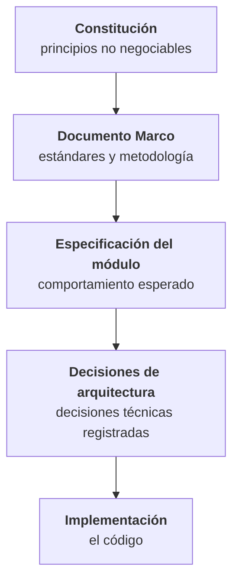

# Documentación técnica de NEXUS

Backend de la plataforma NEXUS — **FACTECH GROUP SAS**.

Esta documentación es parte del repositorio y se versiona junto al código (Art. XII.1). Si un cambio altera comportamiento, contrato o esquema, la documentación afectada se actualiza **en el mismo Pull Request**.

---

## Documentos

<div class="grid cards" markdown>

-   :material-gavel:{ .lg .middle } **Constitución**

    ---

    Los principios no negociables del proyecto. 15 artículos con reglas verificables, jerarquía documental, definición de terminado y proceso de enmienda.

    [:octicons-arrow-right-24: Leer la constitución](constitution.md)

-   :material-sitemap:{ .lg .middle } **Arquitectura**

    ---

    Componentes, stack, estructura del código, convenciones de esquema y de API, flujo de una petición y observabilidad.

    [:octicons-arrow-right-24: Ver la arquitectura](architecture.md)

-   :material-shield-lock:{ .lg .middle } **Seguridad**

    ---

    Quién es quién y qué puede hacer cada quien: identidad, autorización por contención de privilegios, autenticación y protección de datos.

    [:octicons-arrow-right-24: Ver el modelo de seguridad](security.md)

-   :material-view-module:{ .lg .middle } **Mapa modular**

    ---

    Qué módulos y submódulos componen el sistema, cómo se decide si algo es módulo o submódulo, y cómo dependen entre sí.

    [:octicons-arrow-right-24: Ver el mapa modular](modules.md)

-   :material-database:{ .lg .middle } **Modelo de datos**

    ---

    Las entidades del sistema y sus relaciones. El esquema exacto vive en las migraciones Flyway, que son su fuente de verdad (Art. V.3).

    [:octicons-arrow-right-24: Ver el modelo de datos](modelo-datos.md)

-   :material-format-list-numbered:{ .lg .middle } **Requerimientos y trazabilidad**

    ---

    Índice de requerimientos por módulo, nomenclatura de identificadores y matriz de trazabilidad.

    [:octicons-arrow-right-24: Ver la trazabilidad](requirements.md)

-   :material-arrow-decision:{ .lg .middle } **Flujos**

    ---

    Los flujos de cada módulo, dibujados: cómo se encadenan sus requerimientos entre sí y, caso por caso, por dónde sale la operación cuando una verificación falla.

    [:octicons-arrow-right-24: Ver los flujos](flujos/sp/flujos-del-modulo.md)

-   :material-code-braces:{ .lg .middle } **Guía de desarrollo**

    ---

    Cómo se escribe código aquí, día a día: entorno local, convenciones, manejo de errores, transacciones, Git y checklist previo al Pull Request.

    [:octicons-arrow-right-24: Abrir la guía](development-guide.md)

-   :material-rocket-launch:{ .lg .middle } **Despliegue**

    ---

    Cómo se lleva el backend a un entorno que no es la máquina de nadie: la topología en Railway, las variables de cada entorno, el primer arranque, la verificación y la operación.

    [:octicons-arrow-right-24: Ver el despliegue](deployment.md)

</div>

---

## Jerarquía normativa

En caso de conflicto, prevalece el documento de mayor jerarquía. Ningún elemento de nivel inferior puede contradecir a uno superior.



Si la implementación necesita contradecir una regla constitucional, **primero se enmienda la constitución**, nunca al revés.

---

## Metodología

El proyecto sigue **Spec-Driven Development**: la especificación es la fuente de verdad y precede a la implementación.

```
Requerimiento → spec.md → plan.md → tasks.md → Issue → Pull Request → Código → Prueba
```

Cada funcionalidad se documenta en una **tripleta**: `spec.md` responde *qué debe pasar y por qué*, `plan.md` responde *cómo se construye* y `tasks.md` responde *en qué pasos*. Los tres se aprueban en compuertas sucesivas (Art. I.6).

Ninguna línea de código se escribe antes de que la tripleta esté aprobada (Art. I.1), y todo cambio es reconstruible hasta el requerimiento que lo originó (Art. III.1).

---

## Estado del proyecto

### Indicadores

Al **26-08-2026**. Cada cifra se cuenta sobre el documento que es su autoridad y se actualiza **con el cambio que la mueve** (Art. III.6), no en una revisión aparte.

| Indicador | Valor | Autoridad |
|---|---|---|
| Módulos registrados | 2 | [`modules.md` §4](modules.md#4-inventario-de-modulos) |
| Módulos implementados | 0 | [`modules.md` §4](modules.md#4-inventario-de-modulos) |
| Requerimientos registrados | 49 | [`requirements.md` §4](requirements.md#4-matriz-de-trazabilidad) |
| Requerimientos con **tripleta aprobada** | 49 | [`requirements.md` §5](requirements.md#5-estado-general) |
| Requerimientos con **endpoint funcionando** | 43 | [`requirements.md` §5](requirements.md#5-estado-general) |
| Requerimientos **implementados** | 0 | [`requirements.md` §4](requirements.md#4-matriz-de-trazabilidad) |

#### Por módulo

| Módulo | Estado | Requerimientos | Con tripleta aprobada | Con endpoint | Implementados |
|---|---|---|---|---|---|
| [`SP` — Sistema Principal](requirements/sp.md) | En desarrollo | 42 | 42 | 42 | 0 |
| [`PM` — Productos y Mercadeo](requirements/pm.md) | En desarrollo | 7 | 7 | 1 | 0 |
| **Total** | — | **49** | **49** | **43** | **0** |

El inventario de módulos está **incompleto a propósito** y así está declarado: figuran `SP`, que el Documento Marco nombra, y `PM`, incorporado el 26-08-2026; el resto del alcance del producto sigue por inventariar ([`modules.md` §6](modules.md#6-alcance-por-inventariar)). Esta tabla crece con él, no lo sustituye.

!!! warning "«Implementados: 0» no significa «no hay código»"

    `Implementado` es el estado que exige la **definición de terminado** (constitución §16 y Art. XVI): entre otras condiciones, **Pull Request aprobado por alguien distinto del autor e integrado**. Hoy hay cuarenta y tres requerimientos construidos —los cuarenta y dos de `SP` y el primero de `PM`— y su suite pasa en verde, pero el trabajo vive en ramas `feature/…` sin fusionar y sus Issues están por crear, de modo que **ninguno** cumple esa definición.

    La fila que dice cuánto hay **construido** es «requerimientos con endpoint funcionando». La que dice cuánto está **cerrado** es «implementados». Leer la segunda como si fuera la primera es la confusión que este panel existe para evitar.

#### Del código

| Indicador | Valor | De dónde sale |
|---|---|---|
| Migraciones Flyway | 32 | `src/main/resources/db/migration` |
| Pruebas unitarias en verde | 170 | `./mvnw clean verify` |
| Pruebas de integración en verde | 616 | `./mvnw clean verify` |
| Tareas de tripleta abiertas | 14 | [`requirements.md` §5](requirements.md#5-estado-general) |

Son las que sus `tasks.md` declaran `Pendiente`, verificadas contra el código una a una. Hay además **ochenta y siete filas en `En curso`** cuyo estado va por detrás de lo construido y que no se han revisado todavía: mientras esa revisión no se haga, el estado de una tarea no es fuente fiable, y sí lo son la matriz de trazabilidad y la suite.

### Versiones de la documentación

!!! warning "Documentación en estado Borrador"

    Todos los documentos están en versiones `0.x`. Mientras permanezcan en Borrador, las enmiendas se acumulan como MINOR; la versión `1.0.0` se emite al ser aprobada por el stakeholder (Art. 17.6).

| Documento | Versión | Estado |
|---|---|---|
| [Constitución](constitution.md) | 0.7.0 | Borrador |
| [Arquitectura](architecture.md) | 0.21.0 | Borrador |
| [Seguridad](security.md) | 0.35.0 | Borrador |
| [Mapa modular](modules.md) | 0.14.0 | Borrador |
| [Modelo de datos](modelo-datos.md) | 0.11.0 | Borrador |
| [Requerimientos y trazabilidad](requirements.md) | 0.69.0 | Borrador |
| [Guía de desarrollo](development-guide.md) | 0.7.0 | Borrador |
| [Despliegue](deployment.md) | 0.2.0 | Borrador |
| [Requerimientos de `SP`](requirements/sp.md) | 1.26.0 | **Aprobado** |
| [Requerimientos de `PM`](requirements/pm.md) | 0.12.0 | Borrador |
| [Flujos de `SP` · del módulo](flujos/sp/flujos-del-modulo.md) | 0.3.0 | Borrador |
| [Flujos de `SP` · por caso](flujos/sp/flujos-por-caso.md) | 0.2.0 | Borrador |
| Estrategia de pruebas | — | Pendiente |

### Decisiones

**Cerradas:** PostgreSQL como único motor · claves `uuid` v7 · Java 21 LTS con Spring Boot 3 y Maven · migraciones Flyway · auditoría separada en cuatro registros —cambios, eliminación, error y seguridad— más `request_log`, todos con IP de origen · motivo obligatorio en toda eliminación, en **texto libre y sin catálogo de códigos** (D-20) · umbrales p95 de rendimiento · repositorios separados con contrato OpenAPI · autenticación JWT con refresh revocable · contención de privilegios entre roles · permisos `recurso:acción` · Argon2id.

**Pendientes:** **modelo de alcance de datos** (D-22), del que dependen la red comercial, las comisiones y toda consulta con alcance por persona · retención por registro (D-10) · política de idempotencia (D-11) · **la IP de la auditoría** (D-21), que el 27-08-2026 dejó de ser «qué proxies declarar» para ser «el resolvedor necesita admitir rangos»: en Railway no hay ninguna IP de borde que poner, de modo que el Art. V.15 no se cumple en un entorno desplegado · identidad para procesos automáticos (D-19).

Y dos cosas que ya **no** son decisiones pendientes y siguen sin hacerse, que no es lo mismo: el **canal compartido** para el corte de tokens —condición previa a una segunda instancia, y el motivo de que el despliegue corra con una sola réplica— y el **raspado de métricas con alertas**, que D-09 se cerró sin resolver.

Cerradas desde la última revisión de esta portada: **la infraestructura de despliegue** (D-09), resuelta el 27-08-2026 con [`ADR-002`](architecture/ADR-002-plataforma-de-despliegue-railway.md) —**Railway**, un servicio por entorno construido desde el mismo `Dockerfile`, con PostgreSQL gestionado y despliegue por integración de rama—; llevaba abierta desde el 19-08-2026 y se había convertido en el aparcadero de cinco pendientes distintos · **cómo consume un módulo los datos de otro** (D-25), resuelta el 26-08-2026 con interfaces de aplicación de solo lectura publicadas por el dueño del dato · el **mecanismo del canal de envío** (D-23), resuelto el 26-08-2026 con **Resend por su API HTTP y no por SMTP**, que era lo último que le faltaba al módulo para tener sus cuarenta y dos endpoints · el **catálogo inicial de permisos** · los **parámetros concretos de seguridad** · el **restablecimiento de contraseña** · y —a medias, por [`ADR-001`](architecture/ADR-001-publicacion-del-contrato-openapi.md)— la **publicación del contrato OpenAPI** (D-24), que ya se versiona como archivo aunque falte llevarlo al frontend de forma automática.

El detalle de cada decisión, con su responsable y qué bloquea, está en [`architecture.md` §15 y §16](architecture.md#16-decisiones-pendientes) y en [`security.md` §12](security.md#12-decisiones-y-pendientes), que son su autoridad.

---

## Sobre este sitio

Se genera con [MkDocs](https://www.mkdocs.org/) y el tema [Material](https://squidfunk.github.io/mkdocs-material/) a partir de los archivos Markdown de `docs/`. La fuente de verdad son esos archivos, no el sitio publicado: cualquier corrección se hace sobre el Markdown y se integra por Pull Request.

Para levantarlo en local, ver la [guía de desarrollo](development-guide.md#25-la-documentacion-como-sitio).
