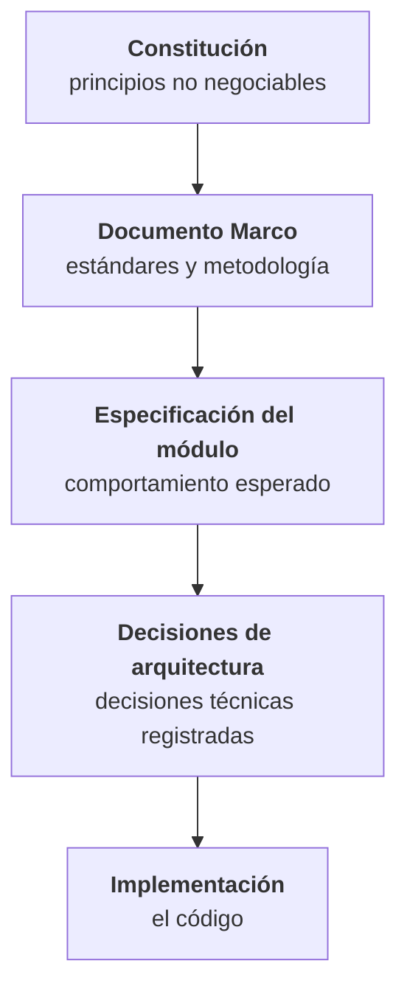

# Documentación técnica de NEXUS

Backend de la plataforma NEXUS — **FACTECH GROUP SAS**.

Esta documentación es parte del repositorio y se versiona junto al código (Art. XII.1). Si un cambio altera comportamiento, contrato o esquema, la documentación afectada se actualiza **en el mismo Pull Request**.

---

## Documentos

<div class="grid cards" markdown>

-   :material-gavel:{ .lg .middle } **Constitución**

    ---

    Los principios no negociables del proyecto. 15 artículos con reglas verificables, jerarquía documental, definición de terminado y proceso de enmienda.

    [:octicons-arrow-right-24: Leer la constitución](constitution.md)

-   :material-sitemap:{ .lg .middle } **Arquitectura**

    ---

    Componentes, stack, estructura del código, convenciones de esquema y de API, flujo de una petición y observabilidad.

    [:octicons-arrow-right-24: Ver la arquitectura](architecture.md)

-   :material-shield-lock:{ .lg .middle } **Seguridad**

    ---

    Quién es quién y qué puede hacer cada quien: identidad, autorización por contención de privilegios, autenticación y protección de datos.

    [:octicons-arrow-right-24: Ver el modelo de seguridad](security.md)

-   :material-view-module:{ .lg .middle } **Mapa modular**

    ---

    Qué módulos y submódulos componen el sistema, cómo se decide si algo es módulo o submódulo, y cómo dependen entre sí.

    [:octicons-arrow-right-24: Ver el mapa modular](modules.md)

-   :material-format-list-numbered:{ .lg .middle } **Requerimientos y trazabilidad**

    ---

    Índice de requerimientos por módulo, nomenclatura de identificadores y matriz de trazabilidad.

    [:octicons-arrow-right-24: Ver la trazabilidad](requirements.md)

-   :material-code-braces:{ .lg .middle } **Guía de desarrollo**

    ---

    Cómo se escribe código aquí, día a día: entorno local, convenciones, manejo de errores, transacciones, Git y checklist previo al Pull Request.

    [:octicons-arrow-right-24: Abrir la guía](development-guide.md)

</div>

---

## Jerarquía normativa

En caso de conflicto, prevalece el documento de mayor jerarquía. Ningún elemento de nivel inferior puede contradecir a uno superior.



Si la implementación necesita contradecir una regla constitucional, **primero se enmienda la constitución**, nunca al revés.

---

## Metodología

El proyecto sigue **Spec-Driven Development**: la especificación es la fuente de verdad y precede a la implementación.

```
Requerimiento → spec.md → plan.md → tasks.md → Issue → Pull Request → Código → Prueba
```

Cada funcionalidad se documenta en una **tripleta**: `spec.md` responde *qué debe pasar y por qué*, `plan.md` responde *cómo se construye* y `tasks.md` responde *en qué pasos*. Los tres se aprueban en compuertas sucesivas (Art. I.6).

Ninguna línea de código se escribe antes de que la tripleta esté aprobada (Art. I.1), y todo cambio es reconstruible hasta el requerimiento que lo originó (Art. III.1).

---

## Estado del proyecto

!!! warning "Documentación en estado Borrador"

    Todos los documentos están en versiones `0.x`. Mientras permanezcan en Borrador, las enmiendas se acumulan como MINOR; la versión `1.0.0` se emite al ser aprobada por el stakeholder (Art. 17.6).

| Documento | Versión | Estado |
|---|---|---|
| [Constitución](constitution.md) | 0.5.0 | Borrador |
| [Arquitectura](architecture.md) | 0.4.0 | Borrador |
| [Seguridad](security.md) | 0.3.0 | Borrador |
| [Guía de desarrollo](development-guide.md) | 0.4.0 | Borrador |
| [Mapa modular](modules.md) | 0.3.0 | Borrador |
| [Requerimientos y trazabilidad](requirements.md) | 0.3.0 | Borrador |
| Estrategia de pruebas | — | Pendiente |

### Decisiones

**Cerradas:** PostgreSQL como único motor · claves `uuid` v7 · Java 21 LTS con Spring Boot 3 y Maven · migraciones Flyway · auditoría separada en cuatro registros —cambios, eliminación, error y seguridad— más `request_log`, todos con IP de origen · motivo obligatorio en toda eliminación · umbrales p95 de rendimiento · repositorios separados con contrato OpenAPI · autenticación JWT con refresh revocable · contención de privilegios entre roles · permisos `recurso:acción` · Argon2id.

**Pendientes:** infraestructura de despliegue · retención por registro · política de idempotencia · parámetros concretos de seguridad · catálogo inicial de permisos · restablecimiento de contraseña · identidad para procesos automáticos · tipificación del motivo de eliminación · lista de proxies confiables por entorno.

---

## Sobre este sitio

Se genera con [MkDocs](https://www.mkdocs.org/) y el tema [Material](https://squidfunk.github.io/mkdocs-material/) a partir de los archivos Markdown de `docs/`. La fuente de verdad son esos archivos, no el sitio publicado: cualquier corrección se hace sobre el Markdown y se integra por Pull Request.

Para levantarlo en local, ver la [guía de desarrollo](development-guide.md#25-la-documentacion-como-sitio).
