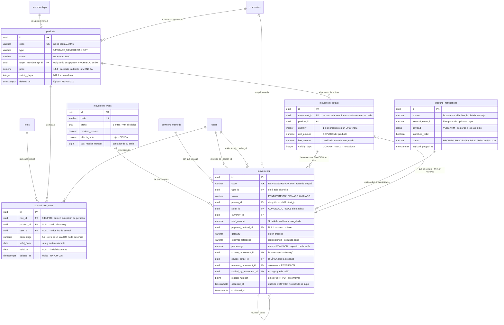
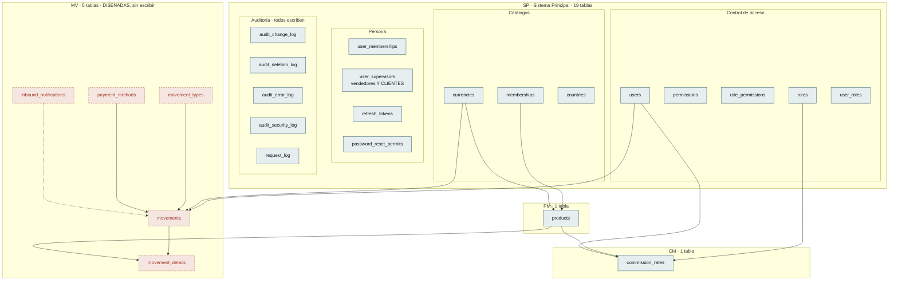

# Modelo de Datos — Estado actual

| Campo | Valor |
|---|---|
| Versión | 0.17.0 |
| Estado | **Borrador** |
| Responsable | Bonilla Diaz William Steven |
| Fecha de creación | 21-08-2026 |
| Última actualización | 01-09-2026 |

!!! info "Qué va en este documento"

    Cómo va quedando el esquema con lo que hay especificado hoy: las tablas, sus columnas y las relaciones entre ellas, agrupadas por lo que resuelven.

    Es una **vista derivada**, no normativa. Sale de [`requirements/sp.md` §10](requirements/sp.md), [`security.md` §9](security.md) y [`architecture.md` §6.6](architecture.md). La fuente de verdad del esquema son las **migraciones Flyway** (Art. V.3), y donde ya existen mandan ellas.

!!! success "Diecinueve tablas existen; cinco están diseñadas y sin escribir"

    De `V1` a `V47` están escritas las **diecinueve** tablas del sistema: las doce de `SP`, sus cinco de auditoría, `products` de `PM` y `commission_rates` de `CM`. Lo único diseñado y sin escribir son las **cinco de `MV`** —`movement_types`, `movements`, `movement_details`, `payment_methods` e `inbound_notifications`—, que van marcadas como tales en el mapa de §5.

---

## 1. Control de acceso

El núcleo del módulo `SP`, incluidas las tablas de usuarios que lo consumen. Es la única zona del modelo con relaciones densas.

```mermaid
erDiagram
    roles ||--o{ roles : "parent_role_id · acota privilegios"
    roles ||--o{ role_permissions : "declara"
    permissions ||--o{ role_permissions : "se declara en"
    users ||--o{ user_roles : "porta"
    roles ||--o{ user_roles : "se asigna a"
    users ||--o{ refresh_tokens : "abre sesión"
    users ||--o{ password_reset_permits : "pide restablecer · RF-SP-040"
    users ||--o{ user_supervisors : "está a cargo de alguien"
    users ||--o{ user_supervisors : "tiene gente a cargo"
    users ||--o| user_memberships : "tiene a lo sumo una"
    memberships ||--o{ user_memberships : "se asigna a"

    memberships {
        uuid id PK "v7"
        varchar code UK "50"
        varchar name "100"
        text description "NULL"
        varchar color "6 · hexadecimal sin # · en mayúsculas"
        uuid parent_membership_id FK,UK "NULL en la superior · UK impide bifurcar"
        smallint level "orden materializado · se recalcula al insertar"
        timestamptz created_at "now"
        timestamptz updated_at "now"
    }

    permissions {
        uuid id PK "v7"
        varchar code UK "100 · resource:action"
        varchar resource "50"
        varchar action "50"
        varchar name "100"
        text description "NULL"
        timestamptz created_at "now"
        timestamptz updated_at "now"
    }

    roles {
        uuid id PK "v7"
        varchar code "50 · único entre los no eliminados"
        varchar name "100 · único entre los no eliminados"
        text description "NULL · CHECK 500 caracteres"
        varchar role_type "20 · FUNCIONARIO VENDEDOR CONSUMIDOR"
        uuid parent_role_id FK "NULL solo en el rol raíz"
        varchar status "20 · ACTIVO INACTIVO · default ACTIVO"
        boolean is_system "default false · bloquea toda edición"
        timestamptz created_at "now"
        timestamptz updated_at "now"
        timestamptz deleted_at "NULL · borrado lógico"
    }

    role_permissions {
        uuid role_id PK,FK "PK compuesta · excepción al Art. V.11"
        uuid permission_id PK,FK "PK compuesta"
        timestamptz created_at "now"
    }

    users {
        uuid id PK "usuarios"
        varchar username UK "inmutable · sin @ · único incluidos los eliminados"
        varchar email UK "corregible · único incluidos los eliminados"
        varchar first_name "—"
        varchar last_name "—"
        varchar password_hash "Argon2id"
        boolean must_change_password "default false · lo fijan RF-SP-024 y RF-SP-038"
        timestamptz password_expires_at "NULL · caducidad de la credencial provisional · la exige RF-SP-038"
        varchar status "ACTIVO FTD_PENDIENTE INACTIVO BLOQUEADO · el segundo AUTENTICA"
        int failed_attempts "control de bloqueo · la crea RF-SP-034"
        timestamptz locked_until "NULL · nulo también en el bloqueo manual, que no expira · la crea RF-SP-034"
        timestamptz last_login_at "NULL · la crea RF-SP-034"
        timestamptz deleted_at "NULL · nace con la tabla en V18 · solo la escribe RF-SP-029"
    }

    user_roles {
        uuid user_id PK,FK "PK compuesta"
        uuid role_id PK,FK "PK compuesta"
        timestamptz created_at "now"
    }

    user_memberships {
        uuid user_id PK,FK "PK sobre user_id · RN-SP-014 en el esquema"
        uuid membership_id FK "—"
        timestamptz started_at "now"
        timestamptz ends_at "NULL · indefinida · la vigencia se evalúa al consultar"
        timestamptz created_at "now"
        timestamptz updated_at "now · RF-SP-032 sustituye con UPDATE"
    }

    refresh_tokens {
        uuid id PK "sesiones revocables"
        uuid user_id FK "—"
        varchar token_hash UK "nunca el valor en claro"
        timestamptz expires_at "—"
        timestamptz revoked_at "NULL"
        varchar revoked_reason "NULL · ROTACION CIERRE ACCESO_RETIRADO · solo ROTACION alerta"
        uuid replaced_by_id FK "NULL · rotación"
        inet ip "—"
        text user_agent "—"
    }

    password_reset_permits {
        uuid id PK "permiso temporal de RF-SP-040 · sin plan.md"
        uuid user_id FK "—"
        varchar token_hash UK "nunca el valor en claro, como refresh_tokens"
        timestamptz expires_at "vigencia corta"
        timestamptz used_at "NULL · de un solo uso"
        timestamptz invalidated_at "NULL · FA-002 · lo invalida el siguiente"
        inet ip "—"
        timestamptz created_at "now"
    }

    user_supervisors {
        uuid id PK "estructura comercial"
        uuid user_id FK "subordinado O CLIENTE · uno vigente por persona"
        uuid supervisor_id FK "superior si es vendedor, QUIEN LO TRAJO si es cliente"
        timestamptz started_at "now"
        timestamptz ended_at "NULL mientras esté vigente"
        timestamptz created_at "now"
        timestamptz updated_at "now"
    }
```

Ocho decisiones que el dibujo no explica solo:

- **`parent_role_id` hace dos trabajos**: acota los privilegios del hijo y expresa el orden de mando comercial (`RN-SP-011`). La consecuencia es permanente: un rol `VENDEDOR` nunca podrá tener un permiso que su superior no tenga, porque `RN-SEG-003` lo rechazaría.
- **`user_supervisors` es la única tabla que relaciona dos usuarios entre sí**, y responde a una pregunta que `parent_role_id` no puede responder: no *qué rol manda sobre qué rol*, sino **qué persona está a cargo de qué persona**. Lleva clave sustituta —al contrario que `user_roles`— porque el mismo par puede repetirse en el tiempo y lo que distingue una fila de otra es el periodo. Su unicidad es parcial, `WHERE ended_at IS NULL`: un solo superior vigente, historial ilimitado. **No concede acceso a ningún dato**; el modelo de alcance sigue pendiente como D-22.
- **La unicidad de `roles` es parcial**, no total: `WHERE deleted_at IS NULL`. Una restricción única corriente bloquearía para siempre el nombre de un rol borrado.
- **La de `users` es justo la contraria: total.** `username` y `email` son únicos entre **todos** los usuarios, incluidos los eliminados (`RN-SP-016`). Reutilizarlos permitiría que la actividad de dos personas distintas quedara bajo la misma etiqueta en la auditoría. La asimetría con `roles` es deliberada: un rol es una etiqueta, un usuario es una persona.
- **`username` y `email` sirven ambos para iniciar sesión**, y lo que impide que se confundan es que `username` no admite el carácter `@` (`RF-SP-024`). Sin esa restricción, las dos columnas necesitarían compartir un espacio de unicidad común.
- **`role_permissions` y `user_roles` no llevan clave sustituta.** La unicidad del par es la restricción que importa, y una columna sin significado no aportaría nada.
- **La credencial provisional necesita dos columnas, no una.** `must_change_password` dice *que* hay que cambiarla; `password_expires_at` dice *hasta cuándo sirve*. `RF-SP-038` §7 exige ambas cosas —fija la marca y «el momento en que la credencial provisional caduca», superado el cual hay que restablecerla de nuevo— y hasta ahora el modelo solo declaraba la primera. La columna es nulable porque solo tiene sentido mientras la credencial sea provisional, y deja de tenerlo en cuanto la persona elige la suya: que `RF-SP-037` y `RF-SP-040` la limpien junto con la marca es la lectura natural, pero **ninguna de las dos lo dice** y es parte de lo que sus `plan.md` tendrán que fijar.
- **El permiso temporal de `RF-SP-040` es una tabla, no una columna.** Tiene vigencia propia, se consume de un solo uso y una solicitud nueva invalida la anterior (`FA-002`), de modo que necesita filas con estado y no un campo en `users`. Su forma copia la de `refresh_tokens` por el mismo motivo: **nunca se guarda el valor en claro**, solo su hash, porque quien leyera la tabla podría entrar como cualquiera. Es la tabla más provisional del modelo —`RF-SP-040` todavía no tiene `plan.md`—, y los nombres de sus columnas quedan sujetos a él.

---

## 2. Catálogos

Tres tablas que hoy **no tienen ninguna clave foránea entrante**: nada en el modelo las referencia todavía.

- **`memberships` es una lista, no un árbol.** El índice único sobre `parent_membership_id` es lo que lo garantiza: sin él la cadena podría bifurcarse y el orden dejaría de estar definido.
- **`currencies.is_default`** exige un índice único parcial: exactamente una fila en `true`, declarado en el esquema y no solo en el dominio (Art. V.6).
- **`countries` sí lleva `updated_at`**, incorporado el 21-08-2026 al aprobar el `plan.md` de `RF-SP-020`: el Art. V.7 lo obliga y `RF-SP-022` mueve la fila. `currencies` lo necesitará por el mismo motivo cuando se escriba el plan de `RF-SP-023`. Ninguna de las tres lleva borrado lógico.
- **La unicidad del nombre de `countries` es funcional**, sobre `f_unaccent(lower(name))` y no sobre `name` literal, porque `RN-SP-009` no admite edición y un `Panamá`/`Panama` duplicado sería permanente. Es la asimetría deliberada con `uq_roles_name`.
- `memberships` no tiene **ninguna** salida —ni baja ni indicador de activo— y `RN-SP-008` lo justifica: desactivar un eslabón dejaría un hueco en un orden lineal.
- **`memberships` gana `color`** el 26-08-2026: seis dígitos hexadecimales **sin `#`**, con los que el frontend pinta el nivel. Es el único campo de la tabla que no participa en ninguna regla del backend —nada se autoriza ni se ordena por él—, y aun así vive aquí y no en el navegador: si lo eligiera el frontend, dos pantallas del mismo sistema pintarían el mismo nivel de distinto color y nadie lo notaría hasta verlas juntas. Como `RN-SP-008` mantiene la membresía inmutable, **un color mal elegido no se puede corregir**; queda declarado en `requirements/sp.md` §5.1 con su condición de reapertura.

---

## 3. Auditoría

Cuatro tablas, no una. Cada una declara `NOT NULL` lo que en su contexto es obligatorio, algo que un registro único no permite. Comparten un núcleo común de seis columnas, repetido aquí en cada tabla porque así estará en el esquema.

- **Las tres columnas de origen son nulables a la vez**, con un `CHECK` que lo impone: `correlation_id` e `ip_address` van juntas. Una fila sin IP significa «no vino de la red», nunca «se olvidó registrarla».
- **`audit_security_log` es de solo inserción**, restringido a nivel de privilegios de base de datos y no por convención en el código. Un registro que la aplicación puede reescribir no prueba nada.
- Las cuatro se leen en conjunto por una **vista de solo lectura** sobre el núcleo común, que exige los cuatro permisos de lectura.
- **`request_log` ya no es un hueco**: existe desde `V35` (issue #23) y `architecture.md` §6.7 declara el porqué de cada columna. Dos diferencias con las cuatro de arriba, y ninguna es de estilo: su `correlation_id` **no** es nulable —aquellas admiten eventos de procesos internos, esto solo lo escribe una petición HTTP— y **no participa en la transacción de negocio**, de modo que una operación revertida deja su fila igual: que el negocio fallara no significa que nadie llamara.

---

## 4. Lo que se vende, cuánto se paga y qué ocurrió con el dinero

Las tres áreas que nacieron después de la primera versión de este documento y que **su mapa no conocía**: `PM` el 27-08-2026, `CM` el 28-08-2026 y `MV` el 01-09-2026.

### 4.1 Las tres columnas que se repiten, y no por casualidad

`price` en `products`, `unit_amount` en `movements`, `percentage` en `commission_rates` y **otra vez** `percentage` en `movements`. Parece duplicación y es lo contrario:

| Dónde | Qué significa |
|---|---|
| `products.price` | Lo que **cuesta hoy** |
| `movements.unit_amount` | Lo que **costó cuando se compró** |
| `commission_rates.percentage` | Lo que **se gana hoy** |
| `movements.percentage` | Lo que **se ganó por esa venta** |

**Copiar y no referenciar es la regla que sostiene el pasado** (`RN-MV-002`, `RN-MV-003`). Sin ella, corregir un precio reescribe facturas y corregir una tarifa reescribe lo que alguien cobró. Lo exigieron `pm.md` §1.4 y `RN-CM-008` **antes de que existiera la tabla donde cumplirlo**.

!!! important "Pero no se copia todo, y la prueba es si el origen puede cambiar"

    **Se copia lo que puede cambiar; lo inmutable se referencia.** El precio y la vigencia se corrigen (`RF-PM-004`), el porcentaje de una tarifa se corrige (`RF-CM-003`) y el vendedor de un cliente se reasigna — los cuatro se copian.

    **La membresía destino no.** `RF-PM-004` `EX-004` **rechaza cambiarla**, junto al tipo y al código, de modo que leerla del producto da siempre el mismo valor. Copiarla solo añadiría **un sitio más donde el dato pudiera discrepar de sí mismo**, que es el coste que toda desnormalización paga y que aquí no compra nada.

    Es la diferencia entre una copia que **protege el pasado** y una que **duplica el presente**.

### 4.2 `movements` se referencia a sí misma tres veces, y son tres cosas

| Columna | Qué apunta |
|---|---|
| `reverses_movement_id` | El movimiento que esta **reversión** deshace |
| `source_movement_id` | La **venta** que devengó esta comisión |
| `settled_by_movement_id` | El **pago** que saldó este devengo |

Tres autorreferencias en una tabla son una señal de alarma habitual. Aquí no lo son porque **las tres van en direcciones distintas del tiempo**: la primera mira atrás para corregir, la segunda mira atrás para explicar el origen, y la tercera mira **adelante** —se puebla después, cuando el pago ocurre—.

### 4.3 Cuatro decisiones que este esquema no muestra, y hay que leer al mirarlo

Un modelo de datos enseña columnas y calla reglas. Estas cuatro se decidieron el 01-09-2026, **no añaden ni una columna**, y sin ellas el dibujo se interpreta mal:

| Decisión | Qué cambia al leer el esquema |
|---|---|
| **El día se corta en `America/Bogota`** | El `AAAAMMDD` dentro de `movements.code` y el instante del cierre mensual. `timestamptz` sigue guardando UTC: lo que la zona decide es **dónde empieza el día**, no cómo se almacena |
| **`SP` publica la escritura, `MV` la invoca** (D-26) | Ninguna clave foránea sale de `MV` hacia `users.status`, y sin embargo un depósito lo cambia. **La escritura cruza por código, no por esquema** |
| **La comisión nace `PENDIENTE` y se causa el primero de mes** | `movements.status` significa **dos cosas distintas según el tipo**: en una compra es «¿pagó?»; en una `COMISION` es «¿ya es exigible?». Mismo dominio, dos lecturas |
| **Lo ya aplicado no se anula** (`RN-MV-031`) | `status = 'ANULADO'` **no aparece nunca** sobre un movimiento que produjo efectos. Quien vea la columna pensará que sí puede, y no |

**La tercera es la más fácil de leer mal.** `PENDIENTE` en una compra y `PENDIENTE` en una comisión son el mismo valor y no significan lo mismo — pero sí comparten la regla que importa: `RN-MV-004`, **lo pendiente no produce efectos**. Es lo que permitió que causar una comisión fuera exactamente confirmarla, sin ampliar `ck_movements_status`.

### 4.4 Lo que `affects_cash` separa

`movements` contiene **dos cosas que no son iguales**: dinero que se movió —compra, depósito, pago de comisión— y **deuda contraída** —lo que un vendedor ganó y no ha cobrado—. Sin distinguirlas, **sumar la tabla no responde ninguna pregunta**.

La marca vive en `movement_types` y no en `movements`, de modo que **es una propiedad del tipo y no de cada fila**: dos movimientos del mismo tipo no pueden discrepar sobre si movieron dinero.

---

## 5. Cómo queda la base de datos

**Diecinueve tablas escritas y cinco diseñadas.** Ninguna se ha retirado nunca.

### 5.1 El inventario, con quién es dueño

| Módulo | Tablas | Estado |
|---|---|---|
| `SP` | `permissions`, `roles`, `role_permissions`, `users`, `user_roles`, `memberships`, `user_memberships`, `currencies`, `countries`, `user_supervisors`, `refresh_tokens`, `password_reset_permits` | **12, escritas** |
| `SP` · auditoría | `audit_change_log`, `audit_deletion_log`, `audit_error_log`, `audit_security_log`, `request_log` | **5, escritas** |
| `PM` | `products` | **1, escrita** |
| `CM` | `commission_rates` | **1, escrita** |
| `MV` | `movement_types`, `movements`, `movement_details`, `payment_methods`, `inbound_notifications` | **5, diseñadas** |

**Un módulo, una a cinco tablas.** `SP` tiene diecisiete y los otros tres juntos tienen siete, y eso no es desequilibrio: `SP` es dueño del acceso, de los catálogos transversales y de la auditoría entera, que es infraestructura que todos usan y nadie duplica.

### 5.2 Lo que cambió en `SP` el 01-09-2026, sin tabla nueva

Dos cambios que **no añaden ninguna tabla** y sí cambian lo que el modelo significa:

| Qué | Cambio |
|---|---|
| `users.status` | `PENDIENTE` —declarado y sin usar desde `V18`— es sustituido por **`FTD_PENDIENTE`**. Cambio de dominio **sin migración de datos**: ninguna fila llevaba el valor retirado |
| `user_supervisors` | **Deja de contener solo vendedores.** El cliente cuelga de su vendedor en la misma tabla, y una fila significa dos cosas según quién sea el subordinado: «reporta a» entre vendedores, «fue traído por» cuando es un cliente |

**El segundo es el más barato y el que más alcance tiene.** Cero columnas nuevas, cero migraciones — y `RN-SP-022` se endurece sin cambiar de texto, de modo que tres requerimientos ya construidos empiezan a rechazar más.

### 5.3 Dónde apunta cada clave foránea que cruza un módulo

Son **siete**, y todas van en la misma dirección: **hacia `SP` y hacia `PM`**, nunca al revés.

| Desde | Hacia | Módulo |
|---|---|---|
| `products.target_membership_id` | `memberships` | `PM` → `SP` |
| `products.currency_id` | `currencies` | `PM` → `SP` |
| `commission_rates.role_id` | `roles` | `CM` → `SP` |
| `commission_rates.user_id` | `users` | `CM` → `SP` |
| `commission_rates.product_id` | `products` | `CM` → `PM` |
| `movements.person_id`, `seller_id`, `currency_id` | `users`, `currencies` | `MV` → `SP` |
| `movement_details.product_id` | `products` | `MV` → `PM` |

**Y hay una escritura que NO aparece aquí**, porque no es una clave foránea: un depósito confirmado en `MV` **cambia `users.status`** invocando una operación que `SP` publica (D-26, cerrada el 01-09-2026). El esquema no la muestra y el código sí — es la única dependencia entre módulos que este cuadro no puede enseñar.

**Las claves foráneas sí cruzan; los repositorios no.** Es la distinción de D-25 y conviene tenerla clara mirando este cuadro: la integridad referencial la defiende el motor, y la frontera de código la defiende una regla de ArchUnit. Que una tabla apunte a otra de otro módulo **no autoriza a leerla desde Java**.

### 5.4 Sobre la numeración de las migraciones

La secuencia no es continua —falta el tramo `V8` a `V12`— y no es un descuido: son números consumidos por trabajo que se reorganizó. Un número de migración **no se reutiliza jamás**, porque Flyway lo registra en el historial de cada entorno.

Las cinco tablas de `MV` ocuparán a partir de `V50`, después de la `V48` y `V49` que `RF-SP-045` reserva.

## 6. Lo que el modelo deja pendiente

| # | Punto | Dónde se resuelve |
|---|---|---|
| ~~1~~ | ~~**`memberships` no tiene vínculo con nada.**~~ **Resuelto el 22-08-2026 al aprobar el `plan.md` de `RF-SP-024`:** la asociación vive en **`user_memberships`**, tabla puente con `user_id` como **clave primaria** —que es `RN-SP-014` declarada en el esquema: una membresía por persona—. No es `users.membership_id` porque la asignación lleva vigencia propia, ni una columna en `roles` porque el nivel es de la persona y no del rol. La restricción de que solo los consumidores la tengan (`RN-SP-013`, `RN-SP-018`) **no** es expresable en el esquema: depende de `user_roles` y `roles.role_type`, y PostgreSQL no admite subconsultas en `CHECK` | — |
| 2 | **`countries` y `currencies` son islas.** Existen sin una sola clave foránea entrante. Su razón de ser es futura —importes con moneda, direcciones con país—, pero conviene dejar escrito quién los referenciará. | `modules.md` §6, alcance por inventariar |
| ~~3~~ | ~~**`request_log` no tiene esquema.**~~ **Resuelto el 25-08-2026 (issue #23):** la tabla se crea en `V35` y sus columnas quedan declaradas en `architecture.md` §6.7 y en §3 de este documento. El hueco no era de documentación: la tabla **no existía**, y cinco secciones de la arquitectura la daban por escrita. Lo que se perdía mientras tanto era todo lo que el manejador global decide no auditar «porque `request_log` ya lo cubre» — los `404`, los `400` de formato y el barrido de rutas | `architecture.md` §6.7 |
| 4 | **`audit_*.actor_id` no declara clave foránea a `users`.** Está documentado como `uuid NULL` sin relación. Si es deliberado —para que eliminar un usuario no arrastre ni bloquee su auditoría— conviene decirlo; si no, falta la restricción. | `architecture.md` §6.6.1 |
| 5 | **Tres estrategias de baja distintas**: `roles` con `deleted_at`, `countries` y `currencies` con `is_active`, `memberships` con ninguna. Cada caso está justificado por separado, pero no hay una regla que diga cuándo se usa cada una. | `architecture.md` §6.4 |
| 6 | **`modelo_v1.mwb` está desactualizado.** Trae `roles.assigned_role_id`, que `security.md` §9 renombra a `parent_role_id`. El modelo gráfico es material de referencia, no autoridad sobre el esquema (Art. V.3). | `DB/modelo_v1.mwb` |
| 7 | **Qué ocurre con `role_permissions` cuando se elimina un rol.** El borrado de `roles` es lógico, y `RF-SP-009` §7 solo dice que sus asociaciones con permisos «dejan de tener efecto»: no declara si las filas se borran o sobreviven. `RF-SP-029` sí lo declara para las suyas —las de `user_roles` y `user_memberships` **desaparecen**—, de modo que dos eliminaciones del mismo módulo resuelven distinto la misma pregunta. Reutilizar el código de un rol eliminado con sus filas de permisos vivas dejaría un vínculo apuntando a un rol que ya no existe para nadie | `RF-SP-009` §7, migración de `roles` |
| ~~8~~ | ~~**`refresh_tokens` y `password_reset_permits` no tienen migración declarada.**~~ **Resuelto:** las crean `V29` y `V37` respectivamente. Lo que sigue — Las crean `RF-SP-034` y `RF-SP-040`, que todavía no tienen `plan.md`; hasta que lo tengan, sus columnas son derivación de la spec y no esquema fijado. Es también donde se decidirá dónde vive la **caducidad de la credencial provisional**, que aquí figura como `users.password_expires_at` | `plan.md` de `RF-SP-034` y `RF-SP-040` |
| 9 | ~~**Nadie purga los tokens.**~~ **Resuelto a medias el 25-08-2026 (issue #25):** `refresh_tokens` ya se purga —por familia entera, treinta días después de que **toda** ella caduque, con constancia auditada y un cerrojo que impide que tres réplicas purguen tres veces (`security.md` §5.5.2)—. Sigue abierto para **`password_reset_permits`**, que no se puede purgar porque todavía no existe: la crea `RF-SP-040`, bloqueado por **D-23**. Y sigue abierto para el `request_log` y los cuatro registros de auditoría, cuyo plazo depende de **D-10** | `security.md` §5.5.2, **D-10**, **D-23** |
| ~~10~~ | ~~**`users.status` declara `PENDIENTE` y ninguna operación entra ni sale de él.**~~ **Resuelto el 01-09-2026:** `RF-SP-045` lo sustituye por **`FTD_PENDIENTE`**, que sí tiene entrada —el registro por enlace— y salida —un depósito confirmado—. `V18` lo había dejado declarado justamente para que estrenarlo no costara alterar el `CHECK` de una tabla en uso, y ese día llegó. Lo que sigue — `security.md` §3.1 lo conserva para un flujo de activación que no existe, y el `CHECK` del dominio cerrado lo admitirá igual. O se retira del dominio hasta que ese flujo se especifique, o se declara qué requerimiento lo poblará | `security.md` §3.1 |

---

## 7. Control de cambios

| Versión | Fecha | Cambio | Responsable |
|---|---|---|---|
| 0.1.0 | 21-08-2026 | Creación inicial. Cuatro diagramas derivados de `requirements/sp.md` §10, `security.md` §9 y `architecture.md` §6.6, y seis puntos pendientes que el modelo deja a la vista. | Responsable técnico |
| 0.2.0 | 21-08-2026 | Consecuencias de aprobar `RF-SP-024`. `users` incorpora `first_name`, `last_name` y `must_change_password`; se anota que `username` es inmutable y sin `@`, que ambos identificadores sirven para iniciar sesión, y que su unicidad es **total** —incluidos los eliminados—, al contrario que la de `roles`. | Responsable técnico |
| 0.3.0 | 21-08-2026 | Consecuencias de aprobar `RF-SP-028`. `locked_until` queda nulo también en el bloqueo manual, que no expira y solo se levanta reactivando la cuenta. | Responsable técnico |
| 0.4.0 | 21-08-2026 | Consecuencias de aprobar el `plan.md` de `RF-SP-020`. `countries` gana `updated_at` y su unicidad de nombre pasa a ser funcional sobre `f_unaccent(lower(name))`. | Responsable técnico |
| 0.5.0 | 21-08-2026 | Consecuencias de aprobar `RF-SP-035`. `refresh_tokens` gana `revoked_reason`: solo la revocación por rotación indica robo, y sin ese dato cerrar sesión sería indistinguible de una reutilización. | Responsable técnico |
| 0.6.0 | 22-08-2026 | Entidad nueva `user_supervisors`, derivada de registrar `RF-SP-041` y `RF-SP-042`: la estructura comercial **persona → persona**, con historial y un solo superior vigente por persona. Es la primera tabla del modelo que relaciona dos usuarios entre sí. Se anota por qué lleva clave sustituta cuando las demás asociaciones no la llevan, y que **no concede alcance sobre los datos** —D-22 sigue abierta—. | Responsable técnico |
| 0.7.0 | 22-08-2026 | Consecuencias de aprobar los `plan.md` de `RF-SP-025` a `RF-SP-029`. `users` incorpora **`deleted_at`**, que nace con la tabla en `V18` y no con `RF-SP-029` —`architecture.md` §6.4 la declara obligatoria en toda tabla de negocio y diez requerimientos la leen antes de que alguien la escriba—, y se anota qué requerimiento crea cada una de las tres columnas de control de acceso: las tres son de `RF-SP-034`. §1 incorpora **`user_memberships`**, que faltaba en el diagrama pese a haberla creado `RF-SP-024` \(`V20`\), y con ella queda **cerrado el hueco 1** de §5: la asociación entre una persona y su nivel vive en esa tabla puente, con `user_id` como clave primaria. | Responsable técnico |
| 0.8.0 | 22-08-2026 | Revisión de completitud disparada por los flujos del módulo v0.3.0. §1 incorpora **`users.password_expires_at`** —`RF-SP-038` §7 exige fijar cuándo caduca la credencial provisional y el modelo solo declaraba la marca— y la tabla **`password_reset_permits`**, que el permiso temporal de un solo uso de `RF-SP-040` exige y que no puede ser una columna porque tiene vigencia, consumo e invalidación propios. §4 añade `user_memberships`, que faltaba en el mapa, retira la pregunta «¿quién apunta aquí?» de `memberships` —`user_memberships` la responde desde la v0.7.0— y anota qué tablas están escritas y cuáles no tienen sitio en la secuencia de migraciones. La advertencia de cabecera deja de decir que no hay ninguna migración escrita: de `V1` a `V7` lo están. §5 suma cuatro pendientes: `role_permissions` ante el borrado lógico de un rol, las dos tablas sin migración declarada, la purga que nadie ejecuta y `PENDIENTE` sin transiciones. | Responsable técnico |
| 0.9.0 | 25-08-2026 | **`request_log` deja de ser un hueco** (issue #23). §3 sustituye el marcador «esquema sin definir» por las once columnas reales que crea `V35`, §4 la marca como escrita en el mapa y §5 cierra el **pendiente 3**. Se anota lo que no se deduce del esquema: su `correlation_id` **no** es nulable al contrario que en las cuatro de auditoría —aquellas admiten eventos de procesos internos, esto solo lo escribe una petición HTTP—, un `status` nulo significa que la petición se abortó sin respuesta, y **no participa en la transacción de negocio**, de modo que una operación revertida deja su fila igual. Sigue faltando la purga, que depende de **D-10** (pendiente 9). | Responsable técnico |
| 0.10.0 | 25-08-2026 | §5 cierra **a medias el pendiente 9** (issue #25): `refresh_tokens` ya tiene quien la purgue. Queda abierto para `password_reset_permits` —que no se puede purgar porque no existe— y para el `request_log` y los cuatro registros de auditoría, cuyo plazo depende de **D-10**. El esquema no cambia: la purga no añade columnas, y su único rastro en el modelo es que la tabla deja de crecer sin techo. | Responsable técnico |
| 0.11.0 | 26-08-2026 | **`memberships` gana `color`**, seis dígitos hexadecimales sin `#` y en mayúsculas, con los que el frontend pinta el nivel (`RN-SP-024`). Es obligatorio: un color opcional obliga al navegador a inventarse uno de reserva, que es justo la decisión que este campo saca del frontend. Se anota en §4 la consecuencia de que `RN-SP-008` lo vuelve **incorregible** una vez creado. | Responsable técnico |
| 0.13.0 | 01-09-2026 | **`user_supervisors` cambia de significado sin cambiar de forma** (`RF-SP-045`). Hasta hoy relacionaba **vendedores entre sí**; desde ahora contiene también a los **clientes**, colgando del vendedor que los trajo. No hay columnas nuevas ni aristas nuevas que dibujar, y por eso este cambio **no se ve en el diagrama**: lo que cambia es qué significa una fila. Se propuso una tabla propia, `client_referrals`, y **el responsable del proyecto la descartó** a favor de reutilizar esta: con dos tablas, subir de un cliente hasta el manager que cobra por él exige un join y un caso especial en la hoja; con una, es un recorrido. | Responsable técnico |
| 0.14.0 | 01-09-2026 | **El documento deja de describir solo `SP`.** Su mapa llevaba **dos módulos de retraso**: no conocía `products` —de `PM`, escrita el 27-08-2026— ni `commission_rates` —de `CM`, el 28-08-2026—, y llamaba `password_reset_tokens` a una tabla que se llama **`password_reset_permits`** desde `V37`. Las tres derivas se corrigen. §4 incorpora **las tres áreas que nacieron después**: qué se vende (`PM`), cuánto se paga (`CM`) y qué ocurrió con el dinero (`MV`), con su diagrama entidad-relación. §5 se reescribe entera como **la vista de conjunto de la base**: diecinueve tablas escritas y cuatro diseñadas, con el inventario por dueño, **las siete claves foráneas que cruzan un módulo** —todas hacia `SP` y `PM`, nunca al revés— y la distinción que conviene tener a la vista mirando ese cuadro: **las claves foráneas sí cruzan y los repositorios no**, porque la integridad la defiende el motor y la frontera de código una regla de ArchUnit. §4.1 explica por qué **cuatro columnas parecen duplicadas y son lo contrario** —`products.price` es lo que cuesta hoy y `movements.unit_amount` lo que costó cuando se compró—, y §4.2 por qué `movements` **se referencia a sí misma tres veces** sin que sea una señal de alarma: las tres van en direcciones distintas del tiempo. §5.2 recoge los **dos cambios de este día que no añaden ninguna tabla** y sí cambian lo que el modelo significa: el estado `FTD_PENDIENTE` y los clientes dentro de `user_supervisors` — el segundo cuesta cero columnas y es el de más alcance. | Responsable técnico |
| 0.15.0 | 01-09-2026 | **Nace `movement_details`**, por decisión del responsable del proyecto: una compra puede llevar **varios productos**. El producto, la cantidad, el importe unitario, la vigencia y la membresía destino **se mudan de `movements` a la línea**, y con ellos `RN-MV-002` —copiar y no referenciar— pasa a cumplirse **por línea**: cada producto se compró a su precio y con su vigencia. La cabecera conserva la moneda, el **total congelado** y el comprobante. Son **veinticuatro tablas**: diecinueve escritas y cinco diseñadas. **Y el reparto tiene un precio que conviene tener escrito en este documento**: `ck_movements_type_product` **se retira**, y las cuatro reglas que la partición hace necesarias —una compra al menos una línea, **como mucho un upgrade**, moneda compartida y total como suma— **cruzan dos tablas, de modo que ningún `CHECK` las sostiene**. El esquema pasa a defender menos que antes y el caso de uso, más. Es el mismo intercambio que ya se hizo al convertir el tipo en catálogo, y la segunda vez en el mismo día. | Responsable técnico |
| 0.16.0 | 01-09-2026 | **Se repara §4 y se recoge lo decidido después de la v0.15.0.** El diagrama de las tres áreas nuevas tenía **dos defectos introducidos al editarlo por partes**: `movements` declaraba **`code` dos veces**, y **`movement_details` aparecía en las relaciones sin bloque de columnas** — estaba dibujada y no definida. Se reescribe entero en lugar de parchearlo: `movements` gana `currency_id`, `payment_method_id`, `gateway`, `external_reference` y `confirmed_at`, y `movement_details` su bloque completo. **§4.3 es nueva y es la parte que un modelo de datos suele callar**: **cuatro decisiones del 01-09-2026 que no añaden ni una columna** y sin las cuales el esquema se lee mal — el día cortándose en `America/Bogota`; la escritura de `MV` sobre `users.status` que **cruza por código y no por esquema** (D-26); que **`movements.status` significa dos cosas según el tipo** —en una compra «¿pagó?», en una `COMISION` «¿ya es exigible?»—; y que **`ANULADO` no aparece jamás sobre un movimiento que produjo efectos** (`RN-MV-031`), de modo que quien vea la columna creerá que puede y no. Las claves foráneas que cruzan módulos pasan de siete a **ocho**, y se añade la advertencia de que **hay una escritura que ese cuadro no puede enseñar**. Se corrigen además tres rastros viejos en §1: `users.status` seguía diciendo «`PENDIENTE` sin uso» y `user_supervisors` describía a su superior como si solo hubiera vendedores. | Responsable técnico |
| 0.17.0 | 01-09-2026 | **Se retira `movement_details.target_membership_id`**, a señalamiento del responsable del proyecto: **era redundante**. `RF-PM-004` `EX-004` rechaza cambiar la membresía destino de un producto, de modo que leerla del producto da siempre el mismo valor —y `RN-PM-010` garantiza que el producto no desaparece nunca—. Las claves foráneas que cruzan módulos vuelven de ocho a **siete**. **Y §4.1 gana el criterio que faltaba**, que es lo que de verdad aporta el cambio: este documento venía dejando entender «cópialo todo», y la regla pasa a ser **se copia lo que puede cambiar; lo inmutable se referencia**. El precio, la vigencia, el porcentaje de una tarifa y el vendedor **sí** se copian, porque los cuatro se corrigen o se reasignan; el destino no, porque nada puede cambiarlo, y copiarlo solo añadiría **un sitio más donde el dato pudiera discrepar de sí mismo**. Es la diferencia entre una copia que **protege el pasado** y una que **duplica el presente**. | Responsable del proyecto |
