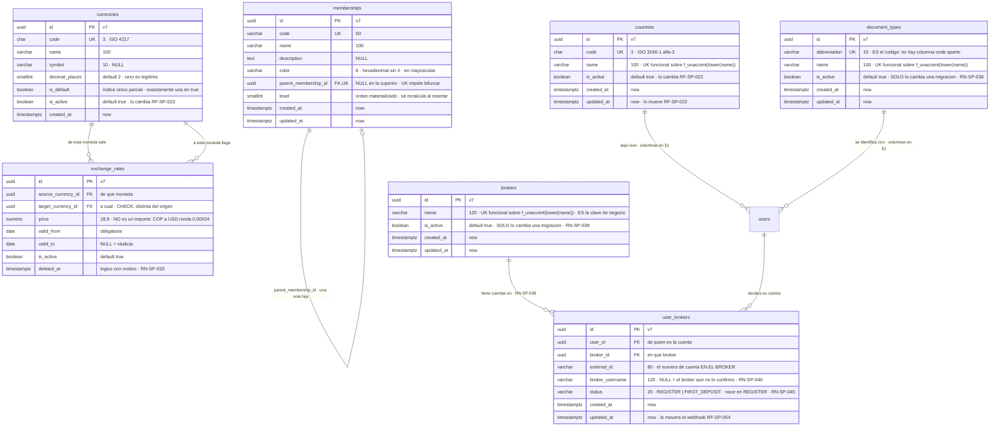
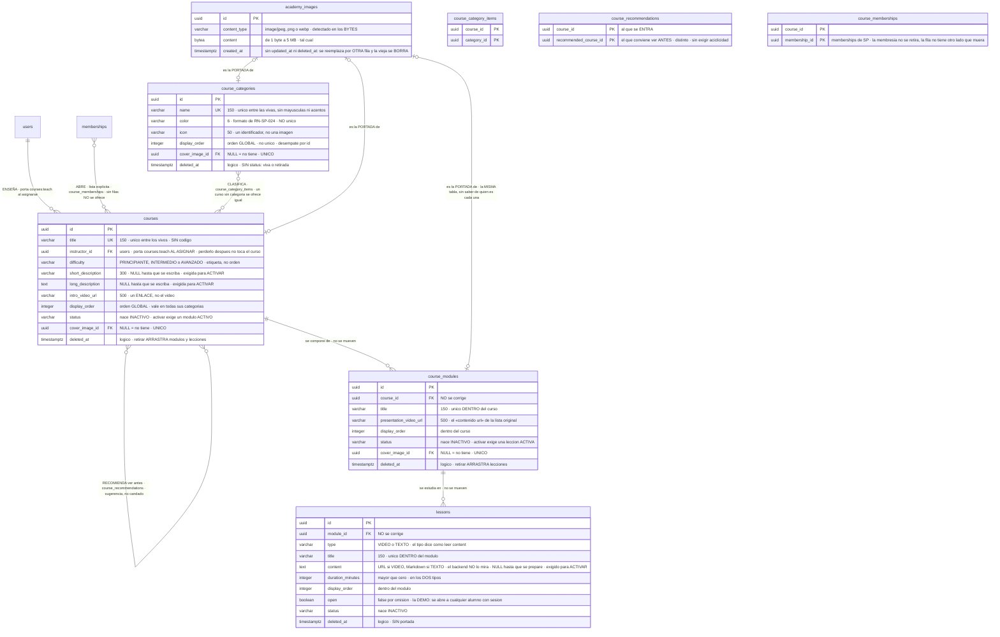
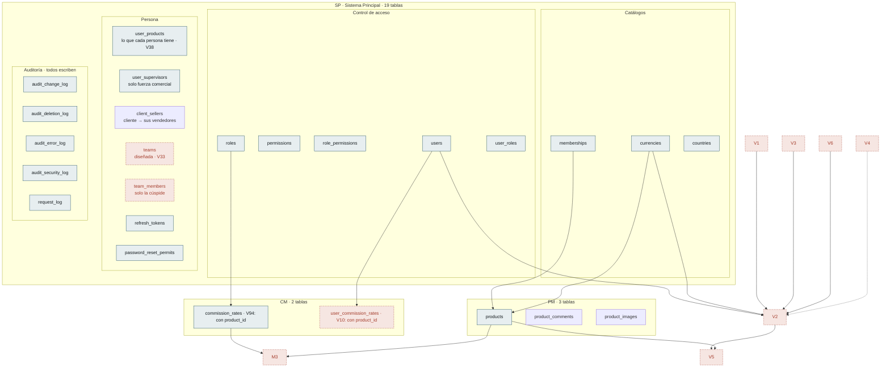

# Modelo de Datos — Estado actual

| Campo | Valor |
|---|---|
| Versión | 0.69.0 |
| Estado | **Borrador** |
| Responsable | Bonilla Diaz William Steven |
| Fecha de creación | 21-08-2026 |
| Última actualización | 25-09-2026 |

!!! info "Qué va en este documento"

    Cómo va quedando el esquema con lo que hay especificado hoy: las tablas, sus columnas y las relaciones entre ellas, agrupadas por lo que resuelven.

    Es una **vista derivada**, no normativa. Sale de [`requirements/sp.md` §10](requirements/sp.md), [`security.md` §9](security.md) y [`architecture.md` §6.6](architecture.md). La fuente de verdad del esquema son las **migraciones Flyway** (Art. V.3), y donde ya existen mandan ellas.

!!! warning "Treinta y dos tablas: treinta y una en las NUEVE migraciones de la consolidación del 15-09-2026, y una más desde `V14`"

    **`product_images` —la portada de un producto, y la primera tabla del sistema que guarda un archivo— la creó `V90` con `RF-PM-014`** el 14-09-2026, junto con la columna `products.cover_image_id`. **Las dos de los paquetes, `product_packages` y `product_package_items`, las creó `V91` con `RF-PM-017`** el 15-09-2026, ya con el alcance de cuatro valores; `V93` sembró sus cuatro permisos. **Y `movement_detail_discounts` la creó `V14` el 16-09-2026** (`RN-MV-027`): la primera tabla nueva después de la consolidación, y la sexta de `MV` — cada rebaja de una línea, como se pactó y como se cobró. No queda ninguna tabla diseñada sin escribir.

    `V49` cerró las tres de `CM` —creó `user_commission_rates` y `product_commission_rates`, y **rehízo `commission_rates`** quitándole el producto, la persona y la vigencia—, y el 04-09-2026 **`V54__create_movements.sql`** creó las cuatro de `MV`: `movements`, `movement_types`, `movement_details` y `payment_methods`, con sus dos catálogos sembrados en la misma migración (`RF-MV-001`).

    **`V55` añadió la quinta de `MV` el mismo día**: `payment_method_exclusions`, que declara **dónde NO vale cada método de pago** (`RN-MV-019`). Con ella `countries` **deja de ser una isla** — es su primera clave foránea entrante en los veinte días que lleva existiendo.

    **La forma de esas cuatro no se repite aquí**: vive en [`requirements/mv.md` §7](requirements/mv.md). Este documento es una **vista derivada** —lo dice justo arriba—, y dos copias del mismo esquema divergen sin que nadie lo note.

    **`movements` es la única tabla del sistema sin `updated_at` ni `deleted_at`** (`RN-MV-001`), y es deliberado: una venta no se edita y no se borra, solo avanza su `status`. Quien mantenga el gestor de auditoría de la aplicación tiene que saberlo, porque no puede tratar esta tabla como a las demás.

    **Y desde el 16-09-2026 la cabecera lleva UNA persona, `user_id`, y el vendedor vive en la línea** (`RN-MV-026`, `RN-MV-003`, `V12`). `client_id` y `seller_id` se retiran de `movements`: nombraban papeles que solo la venta tiene, y el libro va a tener depósitos y comisiones, donde el sujeto no es cliente de nadie. `movement_details.seller_id` es **quien vendió esa línea** —a quien `CM` le creará la comisión—, admite nulo **solo** por los tipos que no venden nada, y **en una venta siempre está**: quien no cuelga de nadie —la cúspide de la fuerza comercial, `RN-SP-019`— **se vende a sí mismo**. La «venta sin atribución» que la v0.25.0 de este documento registró **deja de existir**.

    **`V50`** añadió las cuatro columnas del valor fijo —`rate_type` y `fixed_amount` en las dos tablas de tasas— y **`V52`** el `role_type` de `user_roles`, que es lo que hace declarable `RN-SP-025`.

    !!! warning "Las tablas de `MV` cambiaron de número TRES veces, y no es cosmético"

        Se numeran **por orden de aplicación**, y estas cuatro tablas son el caso que mejor lo enseña: pidieron el `51`, luego el `52`, luego el `53`, y acabaron en el **`54`**.

        | Reserva | Quién se llevó el hueco |
        |---|---|
        | `V51` | `V51__seed_movements_permissions.sql` — la siembra de los cuatro permisos `movements:`, que **no crea ninguna tabla** y estaba escrita antes ([`requirements/mv.md` §6.1](requirements/mv.md)) |
        | `V52` | El `role_type` de `user_roles`, que hace declarable `RN-SP-025` |
        | `V53` | `V53__products_source_membership.sql` — el origen del upgrade (`RF-PM-001`), fusionado el 03-09-2026 |
        | **`V54`** | **Las cuatro tablas de `MV`. Aplicada el 04-09-2026** |

        **La que se aplica primero es siempre la que está escrita.** Las otras eran reservas sin una línea de `SQL`, y esa es la situación en la que una reserva no vale nada: Flyway deja fuera, sin error y sin aviso, una migración con número por debajo del último aplicado.

        No es una preferencia de estilo. Flyway aplica **en orden**, y una migración añadida con un número **por debajo** del último aplicado se queda fuera — el esquema quedaría sin esas cuatro tablas y nada lo diría hasta la primera consulta.

    **`V49` es también la primera migración del proyecto que borra datos a propósito.** Vació `commission_rates` porque **ninguna de las cuatro formas del modelo anterior tiene traducción al nuevo**: dejarlas caer a «tasa de rol» las habría convertido en filas plausibles y falsas — con su porcentaje, sin asociación, y sin que nada dijera que significan otra cosa que el día que se escribieron.

---

## 1. Control de acceso

El núcleo del módulo `SP`, incluidas las tablas de usuarios que lo consumen. Es la única zona del modelo con relaciones densas.

```mermaid
erDiagram
    roles ||--o{ roles : "parent_role_id · acota privilegios"
    roles ||--o{ role_permissions : "declara"
    permissions ||--o{ role_permissions : "se declara en"
    users ||--o{ user_roles : "porta"
    roles ||--o{ user_roles : "se asigna a"
    users ||--o{ refresh_tokens : "abre sesión"
    users ||--o{ password_reset_permits : "pide restablecer · RF-SP-040"
    users ||--o{ user_supervisors : "está a cargo de alguien"
    users ||--o{ user_supervisors : "tiene gente a cargo"
    users ||--o{ client_sellers : "lo registró o le vendió · cliente · RN-SP-049"
    users ||--o{ client_sellers : "registró o vendió · vendedor · el REGISTRO es el principal"
    teams ||--o{ team_members : "reúne · RN-SP-052 · diseñada 21-09-2026"
    users ||--o{ team_members : "pertenece, si es manager · RN-SP-051 · uno vigente"
    countries ||--o{ users : "está en · RN-SP-034 · exactamente uno, obligatorio"
    document_types ||--o{ users : "se identifica con · RN-SP-035 · columnas en §2"
    brokers        ||--o{ user_brokers : "tiene cuentas en · RN-SP-038"
    users          ||--o{ user_brokers : "declara su cuenta · columnas en §2"
    users ||--|{ user_products : "lo que tiene · una sola abierta CON NIVEL · RN-SP-018 · RN-SP-056"
    memberships ||--o{ user_products : "la concede · membership_id nulo si lo poseido no da nivel"

    memberships {
        uuid id PK "v7"
        varchar code UK "50"
        varchar name "100"
        text description "NULL"
        varchar color "6 · hexadecimal sin # · en mayúsculas"
        uuid parent_membership_id FK,UK "NULL en la superior · UK impide bifurcar"
        smallint level "orden materializado · se recalcula al insertar"
        timestamptz created_at "now"
        timestamptz updated_at "now"
    }

    client_sellers {
        uuid client_id PK,FK "DISEÑADA 16-09-2026 · el cliente"
        uuid seller_id PK,FK "el vendedor · la fila REGISTRO es el principal, una por cliente e inmutable"
        varchar origin "REGISTRO o HOTLINK"
        uuid first_movement_id FK "la venta que creo el vinculo · nula solo en las filas traidas de user_supervisors por V20"
        timestamptz created_at "SIN fin: un vinculo es un hecho"
    }

    permissions {
        uuid id PK "v7"
        varchar code UK "100 · resource:action"
        varchar resource "50"
        varchar action "50"
        varchar name "100"
        text description "NULL"
        timestamptz created_at "now"
        timestamptz updated_at "now"
    }

    roles {
        uuid id PK "v7"
        varchar code "50 · único entre los no eliminados"
        varchar name "100 · único entre los no eliminados"
        text description "NULL · CHECK 500 caracteres"
        varchar role_type "20 · FUNCIONARIO VENDEDOR CONSUMIDOR"
        uuid parent_role_id FK "NULL solo en el rol raíz"
        varchar status "20 · ACTIVO INACTIVO · default ACTIVO"
        boolean is_system "default false · bloquea toda edición"
        timestamptz created_at "now"
        timestamptz updated_at "now"
        timestamptz deleted_at "NULL · borrado lógico"
    }

    role_permissions {
        uuid role_id PK,FK "PK compuesta · excepción al Art. V.11"
        uuid permission_id PK,FK "PK compuesta"
        timestamptz created_at "now"
    }

    users {
        uuid id PK "usuarios"
        varchar username UK "inmutable · sin @ · único incluidos los eliminados"
        varchar email UK "corregible · único incluidos los eliminados"
        varchar first_name "—"
        varchar last_name "—"
        uuid country_id FK "OBLIGATORIO · RN-SP-034 · columna y no tabla puente porque el pais no tiene vigencia"
        uuid document_type_id FK "NULL en las filas previas · obligatorio en la API · RN-SP-035"
        varchar document_number "30 · normalizado en mayusculas · unico CON el tipo, y no se libera al eliminar"
        varchar address_line1 "150 · NULL · opcional"
        varchar address_line2 "150 · NULL · complemento: opcional POR NATURALEZA"
        varchar city "100 · NULL · texto libre, no hay catalogo de ciudades"
        varchar phone "20 · NULL en las filas previas · obligatorio en la API · RN-SP-037"
        varchar company_phone "20 · el de la empresa · OPCIONAL · RN-SP-037 · 10-09-2026"
        varchar password_hash "Argon2id"
        boolean must_change_password "default false · lo fijan RF-SP-024 y RF-SP-038"
        timestamptz password_expires_at "NULL · caducidad de la credencial provisional · la exige RF-SP-038"
        varchar status "ACTIVO FTD_PENDIENTE INACTIVO BLOQUEADO · el segundo AUTENTICA"
        int failed_attempts "control de bloqueo · la crea RF-SP-034"
        timestamptz locked_until "NULL · nulo también en el bloqueo manual, que no expira · la crea RF-SP-034"
        timestamptz last_login_at "NULL · la crea RF-SP-034"
        timestamptz deleted_at "NULL · nace con la tabla en V18 · solo la escribe RF-SP-029"
    }

    user_roles {
        uuid user_id PK,FK "PK compuesta"
        uuid role_id PK,FK "PK compuesta"
        varchar role_type FK "COPIA de roles.role_type · RN-SP-025 en el esquema"
        timestamptz created_at "now"
    }

    user_products {
        uuid id PK "historial · user_id se repite"
        uuid user_id FK "uq_user_products_membresia_abierta · WHERE closed_at IS NULL AND membership_id IS NOT NULL"
        uuid product_id FK "NULL solo en lo que no se compra: el suelo de RN-SP-018 y la semilla"
        uuid membership_id FK "NULL si lo poseido no concede nivel · un bot"
        uuid movement_detail_id FK "la linea que lo entrego · UNICA · MV · ON DELETE CASCADE · entrega idempotente"
        integer validity_days "NULL = no caduca · COPIA de lo vendido"
        timestamptz started_at "now · desde cuando se tiene"
        timestamptz ends_at "NULL · indefinida · hasta cuando se pago"
        timestamptz closed_at "NULL · la fila abierta es la actual · cuando dejo de tenerse"
        timestamptz created_at "now"
        timestamptz updated_at "now"
    }

    refresh_tokens {
        uuid id PK "sesiones revocables"
        uuid user_id FK "—"
        varchar token_hash UK "nunca el valor en claro"
        timestamptz expires_at "—"
        timestamptz revoked_at "NULL"
        varchar revoked_reason "NULL · ROTACION CIERRE ACCESO_RETIRADO · solo ROTACION alerta"
        uuid replaced_by_id FK "NULL · rotación"
        inet ip "—"
        text user_agent "—"
    }

    password_reset_permits {
        uuid id PK "permiso temporal de RF-SP-040 · sin plan.md"
        uuid user_id FK "—"
        varchar token_hash UK "nunca el valor en claro, como refresh_tokens"
        timestamptz expires_at "vigencia corta"
        timestamptz used_at "NULL · de un solo uso"
        timestamptz invalidated_at "NULL · FA-002 · lo invalida el siguiente"
        inet ip "—"
        timestamptz created_at "now"
    }

    user_supervisors {
        uuid id PK "estructura comercial"
        uuid user_id FK "subordinado O CLIENTE · uno vigente por persona"
        uuid supervisor_id FK "superior si es vendedor, QUIEN LO TRAJO si es cliente"
        timestamptz started_at "now"
        timestamptz ended_at "NULL mientras esté vigente"
        timestamptz created_at "now"
        timestamptz updated_at "now"
    }

    teams {
        uuid id PK "diseñada · la creará V33"
        varchar name "único funcional y parcial · RN-SP-050 · sin código"
        text description "NULL · máx. 500"
        varchar status "ACTIVO | INACTIVO · RN-SP-053"
        timestamptz created_at "now"
        timestamptz updated_at "now"
        timestamptz deleted_at "NULL · baja lógica · RN-SP-054"
    }

    team_members {
        uuid id PK "la forma de user_supervisors"
        uuid team_id FK "el equipo"
        uuid user_id FK "SOLO la cúspide · RN-SP-051 · uno vigente por persona"
        timestamptz started_at "now"
        timestamptz ended_at "NULL mientras esté vigente · RN-SP-052"
        timestamptz created_at "now"
        timestamptz updated_at "now"
    }
```

**`countries` aparece aquí dibujada sin sus columnas a propósito**: es un catálogo, vive en §2 y repetir sus campos en dos diagramas es la forma más barata de que diverjan. Lo que hace en este es sostener la única arista nueva del 07-09-2026.

Diez decisiones que el dibujo no explica solo:

- **`parent_role_id` hace dos trabajos**: acota los privilegios del hijo y expresa el orden de mando comercial (`RN-SP-011`). La consecuencia es permanente: un rol `VENDEDOR` nunca podrá tener un permiso que su superior no tenga, porque `RN-SEG-003` lo rechazaría.
- **`user_supervisors` y `client_sellers` son las dos tablas que relacionan dos usuarios entre sí**, y responden a preguntas distintas. La primera, a una que `parent_role_id` no puede responder: no *qué rol manda sobre qué rol*, sino **qué persona está a cargo de qué persona** — y solo dentro de la fuerza comercial. Lleva clave sustituta —al contrario que `user_roles`— porque el mismo par puede repetirse en el tiempo y lo que distingue una fila de otra es el periodo. Su unicidad es parcial, `WHERE ended_at IS NULL`: un solo superior vigente, historial ilimitado. La segunda responde **qué vendedor registró o le vendió a qué cliente** (`RN-SP-049`): no es mando, no se cierra, y por eso **desde el 18-09-2026 el cliente no tiene fila en la primera** (`RN-SP-028` revertida) — entre el 01-09-2026 y esa fecha la tuvo, y cada consulta del árbol cargaba con distinguirla. Ninguna de las dos **concede acceso a ningún dato**; el modelo de alcance sigue pendiente como D-22.
- **`teams` y `team_members` organizan LA CÚSPIDE, y solo la cúspide** (21-09-2026, [`requirements/sp.md`](requirements/sp.md) §10.20 y §10.21, `RN-SP-050` a `RN-SP-055`). Un equipo reúne a quienes portan el rol vendedor de mayor rango —los que `RN-SP-019` exime de superior—, y **nadie más tiene fila**: un director o un agente pertenece al equipo de su manager **por recorrido** de `user_supervisors` hacia arriba, no por dato, para que no pueda figurar en un equipo distinto del de quien lo manda. Es una **partición** de las raíces del bosque comercial, no una tercera jerarquía: los equipos no se anidan y encima de ellos no hay nada. `team_members` copia la forma de `user_supervisors` —clave sustituta, unicidad parcial `WHERE ended_at IS NULL`, historial que no se borra— porque responde a la misma pregunta con otro objeto al otro lado: no «quién mandaba sobre esta persona entonces» sino «en qué equipo estaba entonces», que es lo que las comisiones preguntarán. `teams` tiene baja lógica **y** estado, como `roles`, porque «ya no recibe a nadie» y «ya no existe» son dos cosas que el administrador dice por separado. Y tampoco concede acceso a nada: D-22 sigue donde estaba.
- **La unicidad de `roles` es parcial**, no total: `WHERE deleted_at IS NULL`. Una restricción única corriente bloquearía para siempre el nombre de un rol borrado.
- **La de `users` es justo la contraria: total.** `username` y `email` son únicos entre **todos** los usuarios, incluidos los eliminados (`RN-SP-016`). Reutilizarlos permitiría que la actividad de dos personas distintas quedara bajo la misma etiqueta en la auditoría. La asimetría con `roles` es deliberada: un rol es una etiqueta, un usuario es una persona.
- **`username` y `email` sirven ambos para iniciar sesión**, y lo que impide que se confundan es que `username` no admite el carácter `@` (`RF-SP-024`). Sin esa restricción, las dos columnas necesitarían compartir un espacio de unicidad común.
- **`role_permissions` y `user_roles` no llevan clave sustituta.** La unicidad del par es la restricción que importa, y una columna sin significado no aportaría nada.
- **La identidad documental y el contacto son columnas de `users`, y la mayoría de edad NO es una comprobación.** `document_types` es un catálogo diminuto y `users` lo señala con `document_type_id`; lo que hace ese vínculo distinto de los demás es **lo que el catálogo NO contiene**. `RN-SP-035` exige que toda persona sea mayor de edad, y en lugar de una columna `acredita_mayoria` que alguien deba mirar, **el catálogo solo lleva documentos de adulto**: la tarjeta de identidad y el registro civil no están. Registrar a un menor deja de ser algo que se rechaza y pasa a ser algo que **no se puede escribir** — no hay identificador que poner, y `fk_users_document_type` no admite otra cosa. Es el patrón contrario al de `user_roles.role_type`, y conviene ver la simetría: allí se **trajo** un dato para que la regla cupiera en el motor; aquí se **quitó** una opción del catálogo para que la regla no hiciera falta.
- **`users.country_id` es la única cosa que una persona «tiene» y que no vive en una tabla propia**, y la asimetría con las otras dos es la que hay que leer. La membresía está en `user_products` —donde es **una cosa poseída más**, la que concede nivel (`RN-SP-056`)— y el superior en `user_supervisors` porque las dos **tienen vigencia**: se conceden, vencen, se sustituyen, y hay que poder decir cuál regía **entonces**. **El país no tiene periodo.** No se concede hasta una fecha y nadie pregunta dónde estaba alguien el mes pasado — lo que el sistema necesita saber es dónde está **hoy**, que es lo que decide qué medios de pago se le ofrecen (`RN-MV-019`). Una tabla puente para un dato sin vigencia añadiría un `join` a cada consulta de usuario a cambio de nada, y el rastro de cada cambio lo guarda ya `audit_change_log`. **La cardinalidad obligatoria está en el lado izquierdo, no en el derecho**: `||--o{` dice que cada usuario tiene **exactamente un** país —eso es el `NOT NULL`— y que un país puede tener **cero**, que es el estado de todo país recién registrado y del que se acaba de retirar de la circulación.

!!! danger "`user_roles.role_type` es la única columna desnormalizada del sistema, y es la que hace declarable `RN-SP-025`"

    Es una **copia** de `roles.role_type`, y está ahí porque «una persona no puede portar dos roles de tipo `VENDEDOR`» no se puede escribir de otra forma: un `CHECK` no consulta otra tabla, y un índice único no puede unir `user_roles` con `roles`.

    Copiar un dato es normalmente el error que este documento evita. **Aquí no lo es, y la diferencia se puede nombrar:** la copia está atada por una **clave foránea compuesta** `(role_id, role_type) → roles(id, role_type)`, de modo que **no puede divergir**; y su origen es **inmutable** —`RF-SP-004` corrige nombre y descripción, no el tipo—, de modo que nunca tendrá que actualizarse.

    Es el mismo patrón que `product_commission_rates` (§4), y la condición que lo hace legítimo es la misma en los dos sitios: **el dato copiado no cambia en su origen**. Donde cambie, la FK bloquearía la corrección legítima y el patrón deja de valer.

    Sobre ella, `uq_user_roles_vendedor` —parcial, `WHERE role_type = 'VENDEDOR'`— cierra la regla **en el motor**. Se decidió así el 02-09-2026 por un precedente y no por gusto: `RN-SP-018` se comprobaba en el caso de uso, **no aguantó la concurrencia**, y hubo que corregirla el 26-08-2026 sobre esta misma tabla.
- **La credencial provisional necesita dos columnas, no una.** `must_change_password` dice *que* hay que cambiarla; `password_expires_at` dice *hasta cuándo sirve*. `RF-SP-038` §7 exige ambas cosas —fija la marca y «el momento en que la credencial provisional caduca», superado el cual hay que restablecerla de nuevo— y hasta ahora el modelo solo declaraba la primera. La columna es nulable porque solo tiene sentido mientras la credencial sea provisional, y deja de tenerlo en cuanto la persona elige la suya: que `RF-SP-037` y `RF-SP-040` la limpien junto con la marca es la lectura natural, pero **ninguna de las dos lo dice** y es parte de lo que sus `plan.md` tendrán que fijar.
- **El permiso temporal de `RF-SP-040` es una tabla, no una columna.** Tiene vigencia propia, se consume de un solo uso y una solicitud nueva invalida la anterior (`FA-002`), de modo que necesita filas con estado y no un campo en `users`. Su forma copia la de `refresh_tokens` por el mismo motivo: **nunca se guarda el valor en claro**, solo su hash, porque quien leyera la tabla podría entrar como cualquiera. Es la tabla más provisional del modelo —`RF-SP-040` todavía no tiene `plan.md`—, y los nombres de sus columnas quedan sujetos a él.

---

## 2. Catálogos

Los tres catálogos del módulo `SP`, y **la primera tabla que cuelga de uno de ellos**.

!!! warning "Esta sección decía «no tienen ninguna clave foránea entrante», y dejó de ser cierto hace tiempo"

    Lo era el 21-08-2026 y se quedó escrito. `currencies` dejó de ser una isla con `products.currency_id` (`V39`) y `movements.currency_id` (`V54`); `countries`, con `payment_method_exclusions` (`V55`, 04-09-2026). §5.3 lo recogía y esta línea no.

    **Y el 07-09-2026 `currencies` recibe dos más de golpe**, las dos desde la misma tabla: `exchange_rates` apunta a ella **por partida doble** —origen y destino—, que es lo que obliga a que su restricción de no solapamiento compare **las dos** columnas y no una.

    **El mismo día `countries` recibe la suya segunda, y es de otra clase.** `payment_method_exclusions` la señalaba desde una regla de configuración; `users.country_id` la señala **desde una persona** (`RN-SP-034`), y es el primer sitio del modelo donde el país deja de ser un dato sobre el sistema para ser un dato sobre alguien. **Es además la única clave foránea entrante de este cuadro que es `NOT NULL`**: las demás admiten no apuntar a nada, y esta no — de modo que el catálogo **no puede estar vacío** mientras exista un solo usuario, que es lo que obliga a sembrar Colombia (`requirements/sp.md` §10.6).

- **`memberships` es una lista, no un árbol.** El índice único sobre `parent_membership_id` es lo que lo garantiza: sin él la cadena podría bifurcarse y el orden dejaría de estar definido.
- **`currencies.is_default`** exige un índice único parcial: exactamente una fila en `true`, declarado en el esquema y no solo en el dominio (Art. V.6).
- **`document_types` es el primer catálogo cuyo CONTENIDO es una regla de negocio**, y por eso es el único que no se administra por API ni siquiera para desactivar (`RN-SP-036`). `countries` y `currencies` tienen su requerimiento para cambiar `is_active` —`RF-SP-022` y `RF-SP-023`—; este no, y no es un olvido: **añadir una fila a este catálogo es abrir la puerta a los menores de edad**, de modo que la operación no puede existir como llamada. Lo que se retira, se retira con una migración revisada. Su `is_active` **sí se lee** desde el primer día —el listado publica solo los activos— y por eso no es una columna dormida de las que `RF-SP-024` §2 advierte; y **existe porque sin ella no hay retirada posible**: `fk_users_document_type` bloquea el borrado en cuanto una persona la referencie.
- **`user_brokers` es la primera tabla del sistema cuyo único NO incluye a la persona.** Va sobre `(broker_id, external_id)` y no sobre `(user_id, broker_id)`, y esa elección es el requerimiento entero (`RN-SP-038`): una persona puede tener **varias** cuentas en el mismo broker —lo normal en el ramo— y una cuenta **no puede ser de dos personas**. Con el único al revés se prohibiría lo primero y se permitiría lo segundo, que es exactamente el intercambio contrario al que hace falta.
- **`user_brokers.broker_username` admite nulo y su nulo significa algo**: «el broker todavía no lo ha confirmado» (`RN-SP-040`). Lo rellena un webhook (`RF-SP-054`, sin construir), no el alta — declararlo obligatorio obligaría a inventar un valor que sobreviviría a la confirmación.
- **`user_brokers.status` es la segunda columna de esta tabla que espera al mismo webhook** (`RN-SP-045`, 10-09-2026), y por eso conviene leerla junto a la de arriba: `REGISTER` o `FIRST_DEPOSIT`, con `CHECK` en el motor, **nace en `REGISTER`** y hoy nada la mueve. La diferencia con `broker_username` es que **esta sí se lee desde el primer día** —`RF-SP-055` y `RF-SP-056`—, y lo que devuelve es cierto: sin webhook no hay depósito confirmado. **Sus dos valores van en inglés**, únicos en todo el modelo —`users.status`, `products.status` y `movements.status` van en castellano—, porque son el vocabulario del broker que los va a escribir.
- **`user_supervisors` se lee por primera vez EN PROFUNDIDAD** (`RN-SP-047`, 10-09-2026). Hasta hoy toda consulta sobre esta tabla miraba **un nivel** —«quién está a cargo de esta persona», «quién depende de ella»—; `RF-SP-057` recorre la rama entera con una **recursiva**. Dos consecuencias de modelado que conviene tener escritas: **(1)** la terminación **no depende de que los datos sean acíclicos** —lo son, porque `RN-SP-020` ata esta cadena a la de roles, que sí lo es— sino de que la recursión acumule con **`UNION`** y no con `UNION ALL`, que es lo que impide reexpandir a quien ya se vio; **(2)** el recorrido entra por `ix_user_supervisors_supervisor_vigente`, el índice **parcial** de `V28`, y por eso el predicado `ended_at IS NULL` tiene que estar **en los dos brazos** de la recursiva — omitirlo en el recursivo haría descender por la estructura de ayer sin que nada fallara; **(3)** desde el 18-09-2026 la recursiva recorre **solo fuerza comercial**: el cliente no está en la tabla, y sus cuentas se cuelgan en la hoja del vendedor `REGISTRO` de `client_sellers` (`RN-SP-048`), que es un join fijo después del recorrido y no un caso especial dentro de él.
- **`user_brokers.status` no se deriva de `users.status` ni al revés.** Aquel dice si la cuenta del sistema opera (`FTD_PENDIENTE` autentica y no opera, `RN-SP-044`) y este dice qué pasó en el broker. Una persona con dos cuentas puede tener una depositada y otra no, de modo que **no hay función que lleve de un conjunto al otro** sin decidir antes qué significa ese caso — y esa decisión es de `RF-SP-054`, no de aquí.
- **`brokers` guarda solo el nombre**, por decisión del 08-09-2026, y de ahí sale que el **nombre sea la clave de negocio**: único funcional, como en `countries` y `document_types`. Renombrar un broker es, por tanto, una migración.
- **`countries` es el único catálogo del que cuelga una persona**, desde el 07-09-2026. `memberships` tiene su tabla puente y `currencies` no toca a nadie; el país es **una columna de `users`**, y el porqué —no tiene vigencia— está razonado en §1. Lo que este cuadro añade es la consecuencia sobre el catálogo: **`is_active` deja de ser inofensivo**. Desactivar un país lo retira de los selectores del alta y **no desasigna a nadie**, de modo que a partir de ahí pueden convivir usuarios en un país que ya no se ofrece. Es deliberado y es lo que `RF-SP-022` prometía desde el principio — lo que cambia es que ahora hay a quién afectar.
- **`countries` sí lleva `updated_at`**, incorporado el 21-08-2026 al aprobar el `plan.md` de `RF-SP-020`: el Art. V.7 lo obliga y `RF-SP-022` mueve la fila. `currencies` lo necesitará por el mismo motivo cuando se escriba el plan de `RF-SP-023`. Ninguna de las tres lleva borrado lógico.
- **La unicidad del nombre de `countries` es funcional**, sobre `f_unaccent(lower(name))` y no sobre `name` literal, porque `RN-SP-009` no admite edición y un `Panamá`/`Panama` duplicado sería permanente. Es la asimetría deliberada con `uq_roles_name`.
- `memberships` no tiene **ninguna** salida —ni baja ni indicador de activo— y `RN-SP-008` lo justifica: desactivar un eslabón dejaría un hueco en un orden lineal.
- **`memberships` gana `color`** el 26-08-2026: seis dígitos hexadecimales **sin `#`**, con los que el frontend pinta el nivel. Es el único campo de la tabla que no participa en ninguna regla del backend —nada se autoriza ni se ordena por él—, y aun así vive aquí y no en el navegador: si lo eligiera el frontend, dos pantallas del mismo sistema pintarían el mismo nivel de distinto color y nadie lo notaría hasta verlas juntas. Como `RN-SP-008` mantiene la membresía inmutable, **un color mal elegido no se puede corregir**; queda declarado en `requirements/sp.md` §5.1 con su condición de reapertura.

---

## 3. Auditoría

Cuatro tablas, no una. Cada una declara `NOT NULL` lo que en su contexto es obligatorio, algo que un registro único no permite. Comparten un núcleo común de seis columnas, repetido aquí en cada tabla porque así estará en el esquema.

- **Las tres columnas de origen son nulables a la vez**, con un `CHECK` que lo impone: `correlation_id` e `ip_address` van juntas. Una fila sin IP significa «no vino de la red», nunca «se olvidó registrarla».
- **`audit_security_log` es de solo inserción**, restringido a nivel de privilegios de base de datos y no por convención en el código. Un registro que la aplicación puede reescribir no prueba nada.
- Las cuatro se leen en conjunto por una **vista de solo lectura** sobre el núcleo común, que exige los cuatro permisos de lectura.
- **`request_log` ya no es un hueco**: existe desde `V35` (issue #23) y `architecture.md` §6.7 declara el porqué de cada columna. Dos diferencias con las cuatro de arriba, y ninguna es de estilo: su `correlation_id` **no** es nulable —aquellas admiten eventos de procesos internos, esto solo lo escribe una petición HTTP— y **no participa en la transacción de negocio**, de modo que una operación revertida deja su fila igual: que el negocio fallara no significa que nadie llamara.

---

## 4. Lo que se vende y cuánto se paga por venderlo

Las dos áreas que nacieron después de la primera versión de este documento y que **su mapa no conocía**: `PM` el 27-08-2026 y `CM` el 28-08-2026.

```mermaid
erDiagram
    memberships ||--o| products : "un upgrade lleva a"
    currencies  ||--o{ products : "el precio se expresa en"

    roles    ||--o{ commission_rates : "qué gana ese rol"
    products ||--o{ commission_rates : "paga esa tasa · V94: la tasa de rol NACE con su producto"
    users    ||--o{ user_commission_rates : "excepción de"
    products ||--o{ user_commission_rates : "paga esa excepción · V10: la personalizada NACE con su producto"
    products ||--o{ product_links : "enlaza · V35 · UNO POR TIPO: la pareja es la clave"
    products ||--o{ product_comments : "se reseña"
    users    ||--o{ product_comments : "escribe UNA por producto"
    product_images |o--o| products : "es la PORTADA de · V90"
    product_images |o--o| product_packages : "es la PORTADA de · V11 · la MISMA tabla, sin saber de quien es cada una"

    products {
        uuid id PK
        varchar code UK "no se libera JAMAS"
        varchar type "UPGRADE_MEMBRESIA o BOT"
        varchar status "nace INACTIVO"
        varchar scope "TIENDA, HOTLINK, AMBOS o NINGUNO · en que VISTAS se ofrece · V92 renombro HOTLINKS a AMBOS"
        varchar implementation "AUTOMATICA o MANUAL · decide si confirmar una venta ENTREGA"
        uuid target_membership_id FK "obligatorio en upgrade, PROHIBIDO en bot · A DONDE lleva"
        uuid source_membership_id FK "obligatorio en upgrade, PROHIBIDO en bot · DE DONDE sale"
        numeric price "14,4 · EL QUE SE COBRA · la escala la decide la MONEDA"
        numeric purchase_price "14,4 · LO QUE PAGA NEXUS · NULL = no se conoce · solo administracion"
        uuid cover_image_id FK "V90 · la portada · NULL = no tiene · UNICO: una imagen es portada de UN producto"
        integer validity_days "NULL = no caduca"
        timestamptz deleted_at "lógico · RN-PM-010"
    }

    commission_rates {
        uuid id PK
        uuid product_id FK "V94 · de UN producto, y no se corrige · UNICO con role_id entre las vivas"
        uuid role_id FK "qué gana ese rol POR ESTE PRODUCTO"
        varchar rate_type "PORCENTAJE o FIJO · lo declara, no se deduce"
        numeric percentage "5,2 · NULL si es FIJO · cero es un VALOR"
        numeric fixed_amount "14,4 como products.price · NULL si es PORCENTAJE · SIN MONEDA"
        timestamptz deleted_at "lógico · RN-CM-005"
    }



    user_commission_rates {
        uuid id PK
        uuid user_id FK "SIN rol: es de la persona"
        uuid product_id FK "V10 · de UN producto, y no se corrige · EXCLUDE con user_id y el rango entre las vivas"
        varchar rate_type "PORCENTAJE o FIJO"
        numeric percentage "5,2 · NULL si es FIJO"
        numeric fixed_amount "14,4 · NULL si es PORCENTAJE · en la moneda de SU producto"
        date valid_from "la ÚNICA tabla con vigencia"
        date valid_to "NULL = indefinidamente"
        timestamptz deleted_at "lógico"
    }

    product_links {
        uuid product_id PK, FK "V35 · la PAREJA con type es la clave: UN enlace por tipo"
        varchar type PK "30 · VIDEO_PRESENTACION o CUPON_BOT · CHECK, no catalogo: cada uno trae consigo donde se publica"
        varchar url "500 · NOT NULL: no hay enlace sin enlace · quitar uno es BORRAR la fila"
        varchar external_id "100 · id de un sistema AJENO · NULL = no lleva · se PEGA al final de la url al publicarla"
        timestamptz created_at "SIN deleted_at: se borra fisicamente, como product_package_items"
        timestamptz updated_at "cuando se corrigio"
    }

    product_comments {
        uuid id PK
        uuid product_id FK "activo y no retirado AL ESCRIBIR; la resena sobrevive al retiro"
        uuid user_id FK "el AUTOR, no el actor · solo el toca la fila"
        smallint rating "1 a 5 · el promedio NO se guarda: se cuenta"
        text comment "1 a 1000 sin espacios de los extremos"
        timestamptz created_at "cuando se escribio"
        timestamptz updated_at "cuando se corrigio por ultima vez · solo la mueve el autor"
        timestamptz deleted_at "logico · SIN motivo declarado: Art. V.13, contenido propio"
    }

    product_images {
        uuid id PK "cada subida ESTRENA uno · la direccion publica es inmutable"
        varchar content_type "image/jpeg, png o webp · el REAL, detectado en los bytes"
        bytea content "1 byte a 5 MB · TAL CUAL se subio: sin recorte ni conversion"
        timestamptz created_at "cuando se subio · SIN updated_at ni deleted_at: no se modifica, se REEMPLAZA y la vieja se BORRA"
    }

    currencies ||--o{ product_packages : "todo el paquete se expresa en"
    product_packages ||--o{ product_package_items : "contiene"
    products ||--o{ product_package_items : "entra con su descuento en"

    product_packages {
        uuid id PK
        varchar code UK "no se libera JAMAS, como el producto"
        varchar name "unico entre vivos"
        uuid currency_id FK "OBLIGATORIA e INMUTABLE: solo reune productos en esta moneda"
        varchar status "nace INACTIVO · activar exige DOS productos y descripcion"
        varchar scope "TIENDA, HOTLINK, AMBOS o NINGUNO · el mismo dominio que products"
        uuid cover_image_id FK "V11 · la portada · NULL = no tiene · UNICO · SIN icon ni color: sin portada el frontend pinta los suyos por omision"
        date valid_from "V13 · desde cuando se ofrece · obligatoria, SIN default"
        date valid_to "V13 · ultimo dia en que se ofrece · NULL = indefinidamente · fuera de fechas se OCULTA, el estado no cambia"
        timestamptz deleted_at "logico, con motivo · SIN price: se CALCULA"
    }

    product_package_items {
        uuid package_id PK,FK "la PK es la regla:"
        uuid product_id PK,FK "un producto UNA vez por paquete, sin cantidad"
        varchar discount_type "PORCENTAJE o FIJO"
        numeric discount_value "14,4 · 0..100 si porcentaje · 0..precio del producto si fijo"
        timestamptz updated_at "el descuento se corrige · desasociar BORRA la fila"
    }
```

!!! info "`product_packages` no tiene precio, y esa ausencia es la regla"

    Diseñadas el 14-09-2026 (`requirements/pm.md` v0.31.0 §10.6) y **creadas por `V91` el 15-09-2026** (`RF-PM-017`), tal como estaban diseñadas y con `ck_product_packages_scope` de cuatro valores desde el primer día. **El precio del paquete es Σ(precio de hoy del producto − su descuento)** y se calcula en cada lectura, en Java y en un solo sitio (`RN-PM-036`): una columna obligaría a mantenerla en seis operaciones, y la que se quedara atrás no fallaría, mentiría.

    **La moneda sí es columna, aunque se deduzca de los productos**: un paquete vacío también tiene moneda, y es contra la que se comprueba cada asociación (`RN-PM-035`). No se convierte: sumar monedas distintas con la tasa del día haría que el paquete valiera distinto cada mañana.

    **`product_package_items` es una asociación con datos**: la clave primaria es «un producto una vez por paquete» (`RN-PM-038`), el descuento se corrige con auditoría de cambio, y desasociar **borra la fila** y la registra como `ASSOCIATION` sin motivo (Art. V.13, `RN-PM-042`). El techo del descuento fijo —el precio del producto— **no cabe en un `CHECK`**: está en otra tabla, y vive en el caso de uso. **Y desde el 16-09-2026 un paquete lleva un upgrade como máximo** (`RN-PM-046`, [`requirements/pm.md` §5.2.10](requirements/pm.md)), y esa regla **tampoco cabe en el esquema**: el tipo del producto está en `products`, un índice único parcial sobre `product_package_items` no puede mirarlo, y copiar el tipo a la fila sería la columna redundante que `RN-PM-036` no quiso para el precio. Vive en el caso de uso de `RF-PM-023`, con el paquete bloqueado por `FOR UPDATE` para que dos upgrades a la vez se ordenen.

    **Y desde el 16-09-2026 el paquete lleva portada, con la misma forma que el producto** (`V11`, [`requirements/pm.md` §5.2.12](requirements/pm.md)): `cover_image_id` señala una fila de `product_images` —**la misma tabla**, que no sabe si lo que guarda es la portada de un producto o de un paquete: quien la señala lo dice—, nulo cuando no hay, con `fk_product_packages_cover_image` **sin `ON DELETE`** y `uq_product_packages_cover_image` total. **Sin `icon` ni `color` al lado**, y es la decisión que distingue esta portada de la del producto: sin imagen, el frontend pinta **el icono de promoción y el color por omisión del sistema**, los mismos para todos los paquetes, de modo que no hay ninguna regla como `RN-PM-034` que sostener y quitar la portada nunca se rechaza (`RN-PM-045`). Lo que ningún `UNIQUE` puede decir —que una imagen no sea a la vez portada de un producto y de un paquete— no hace falta declararlo: una fila de `product_images` solo nace por una subida, que la señala desde una entidad y solo una.

    **Y desde el 16-09-2026 el paquete tiene VIGENCIA, y es la segunda tabla del sistema que la lleva** (`V13`, [`requirements/pm.md` §5.2.13](requirements/pm.md), `RN-PM-047`): `valid_from` obligatoria **sin `DEFAULT`** —el alta la declara siempre, como en `user_commission_rates`— y `valid_to` nula cuando es indefinida, las dos `date` y no `timestamptz` porque se declara un día y no un instante, con `ck_product_packages_validity` para que el fin no sea anterior al inicio. **Lo que la vigencia hace no cabe en el esquema**: fuera de sus fechas el paquete **se oculta** de la oferta y del hotlink y **no cambia de estado** —es `RN-PM-039` con un motivo más, decidido en Java por el mismo objeto y en el mismo orden, después del retiro y antes del primer producto no ofrecible—, y eso depende de qué día es, que un `CHECK` no consulta. Las dos fechas se corrigen, al revés que el inicio de la tasa personalizada, porque aquí ninguna fila de otra tabla depende de cuándo empezó. Las filas anteriores a `V13` recibieron su `created_at::date` como inicio: es el único valor que no inventa nada.

!!! info "`product_comments` es la primera tabla de `PM` que apunta a `users`, y la primera del sistema que retira sin motivo declarado"

    Nace el 14-09-2026 (`requirements/pm.md` v0.24.0 §10.4). **`user_id` es el autor de la opinión y no el actor del cambio**: sin él la fila no significa nada, igual que `user_commission_rates.user_id`; quién corrigió o retiró sigue en la auditoría (Art. V.7), y coincide con el autor porque `RN-PM-027` lo obliga.

    **Una reseña por persona y producto entre las vivas** —`uq_product_comments_autor`, único y **parcial** sobre `(product_id, user_id) WHERE deleted_at IS NULL`—, de modo que retirada la suya la persona puede escribir otra, y **por parcial no admite `DEFERRABLE`**: la carrera muerde en el segundo `INSERT`.

    **Y el promedio no es una columna de `products`.** `rating.average` y `rating.count` se cuentan sobre las vivas en la misma sentencia que trae el producto; una columna desnormalizada obligaría a mantenerla en tres operaciones, y la que se quedara atrás no fallaría, mentiría.

!!! info "Las cuatro columnas de `rate_type` y `fixed_amount` las escribe `V50`"

    Las decidió el responsable del proyecto el 02-09-2026 (`requirements/cm.md` v0.7.0) y se construyeron **ese mismo día, después de rehacer las tripletas**. Una sola migración para las dos tablas: separarlas dejaría en el historial un estado en el que una pieza admite el valor fijo y la otra no.

**Tres cosas del dibujo que conviene leer despacio:**

- **`rate_type` es una columna y no algo deducido de qué campo esté lleno.** Sin ella, «una forma y solo una» sería una propiedad emergente de dos nulos, y una fila con los dos vacíos no permitiría saber **cuál** de las dos quiso declarar quien la insertó.
- **`fixed_amount` comparte forma con `products.price`, `numeric(14,4)`, y no por simetría.** El precio tiene esa forma porque **la escala real la decide la moneda** —`currencies.decimal_places` va de 0 a 4— y un importe de comisión es dinero en esa misma moneda. Con menos decimales, una comisión en una moneda de cuatro no se podría expresar.
- **Y no lleva moneda.** La toma del producto que se vende, de modo que **la misma fila paga cosas distintas** según a cuál se aplique. Es consecuencia aceptada (`cm.md` §1.1.1), no defecto, y **alcanza por igual a las dos clases de tasa** desde el 11-09-2026: las dos se asocian a varios productos, y un importe fijo se lee en la moneda de cada uno.

!!! danger "Y aparece una asimetría con `products` que ninguna restricción puede cerrar"

    `RN-PM-007` valida que los decimales de un precio casen con los de su moneda, y lo hace **en el dominio** porque un `CHECK` no consulta `currencies`.

    **El valor fijo no puede validarse igual**: cuando se declara, **no se sabe en qué moneda se pagará**. En el catálogo por rol el producto todavía no está asociado; en la personalizada no hay producto en absoluto.

    De modo que dos columnas con **la misma forma** tienen **garantías distintas**: el precio casa con su moneda, el importe de comisión **no lo comprueba nadie**.

!!! danger "`products` tiene DOS membresías desde el 02-09-2026, y la unicidad se movió con ellas"

    Un `UPGRADE_MEMBRESIA` declara **de dónde sale y a dónde lleva**. Hasta esa fecha solo declaraba el destino y quién podía comprarlo **se deducía** de la cadena — cualquiera por debajo—, y eso hacía **imposible el salto**: `BECA → ORO` no se podía distinguir de `PLATINO → ORO`, porque los dos eran «subir a ORO».

    **Lo que cambia en el esquema no es una columna, son dos cosas.** `uq_products_upgrade_target` pasa de ser único sobre `target_membership_id` a serlo sobre **la pareja**. La versión anterior prohibía exactamente lo que el origen existe para permitir: dos upgrades activos hacia `ORO`, uno desde `BECA` y otro desde `PLATINO`, **no son dos precios para lo mismo — son dos saltos distintos**.

    **Y `RN-PM-017` ya no cabe en el motor NI A MEDIAS, desde el 07-09-2026.** Aquel `CHECK` exigía que las dos membresías **no fueran la misma**, y eso es exactamente lo que la **renovación** admite: `V61` lo retira (`requirements/pm.md` §5.2.3). La mitad que sobrevive —«el origen no está por encima del destino»— **nunca** cupo aquí, porque obliga a leer el `level` de **dos filas de `memberships`** y un `CHECK` no consulta otra tabla. De modo que la regla pasa a vivir **entera en el caso de uso**, sin la red que tenía. Es el mismo reparto que `RN-PM-007` con los decimales de la moneda, y conviene tenerlo escrito: **una regla crítica sin una sola línea en el esquema** depende de que nadie inserte en esta tabla saltándose la aplicación.

!!! danger "`products` tiene DOS PRECIOS desde el 08-09-2026, y solo uno de ellos se cobra"

    `price` es **el que se cobra**: lo copia `movement_details.unit_price` y sobre él calcula `RN-CM-019`. `purchase_price` es **lo que NEXUS paga por el producto** cuando tiene que comprarlo —ahí se guarda lo que costó—, es **opcional**, **ninguna otra tabla lo lee** y **no sale de administración**: lo devuelven `RF-PM-002` y `RF-PM-003`, y la oferta y el hotlink **no lo seleccionan** (`RN-PM-024`, `requirements/pm.md` §5.2.6).

    **Nació como `public_price` el 08-09-2026 —lo que se anunciaba— y se renombró el 12-09-2026 al cambiar de significado.** El renombrado no es cosmético: cuando el número era un rótulo, publicarlo sin token era una decisión de forma; ahora que es el costo, publicarlo enseña el margen. La columna cambia de significado **vacía de él** — lo que el hotlink llegó a devolver era el rótulo, no un costo.

    **Comparten forma —`numeric(14,4)`— y también moneda**: no hay una segunda `currency_id`; si NEXUS paga en otra moneda, quien registra el costo lo convierte al declararlo, y una compra con su moneda, su tasa y su fecha es una tabla de compras, no una columna de esta. Lo que no comparten es la obligatoriedad, y ahí está toda la decisión: **el nulo de `purchase_price` significa «no se conoce»** —el producto no se ha comprado todavía, o no aplica—, no «costó cero». Los dos estados existen y son distintos, y por eso la columna admite nulo en lugar de llevar `DEFAULT 0`.

    **Y aparece la tercera columna de esta tabla cuya regla el esquema no puede sostener**, junto a `RN-PM-007` y `RN-PM-017`: que un importe **no se cobre** no es expresable en ninguna restricción. Lo único que lo sostiene es **dónde no aparece** — `movement_details` copia `price`, y el puerto que `PM` publica para vender (`ProductCatalog.saleViewOf`) no lleva el otro. Añadirlo ahí bastaría para que empezara a cobrarse sin que nada fallara.

!!! info "`product_links` recoge lo que era `video_url`, y le añade un tipo (22-09-2026, `V35`)"

    **`products.video_url` existió entre el 14-09-2026 y el 22-09-2026**: `varchar(500)`, nula cuando no había, con `ck_products_video_url_format`. Guardaba **la dirección de un video que presenta el producto**, no el video (`RN-PM-032`, `requirements/pm.md` §5.2.8) — `icon` otra vez: el sistema no almacena binarios y con el video **tampoco los consulta**. **`V35` la migra fila a fila a `product_links` y la borra** con su restricción, porque el producto necesitó **un segundo enlace** y la segunda cosa de la misma forma es la que enseña que la forma era una tabla (`requirements/pm.md` §5.2.14, §10.7).

    **La pareja `(product_id, type)` es la clave primaria**, como en `product_package_items` y por lo mismo: la fila **no es una entidad**, es el valor de un hueco del producto, de modo que no tiene `id` propio, **no tiene `deleted_at`** —quitar un enlace lo borra— y la unicidad «uno por tipo» **es** la clave y no un índice aparte. Los dos tipos van en un `CHECK` y no en un catálogo administrable: cada uno trae consigo **dónde se publica**, y eso es código.

    **`url` es `NOT NULL` y ahí está la diferencia con la columna que reemplaza.** No hay «enlace sin enlace»: donde el nulo de `video_url` significaba «no tiene video», ahora la ausencia de la fila lo significa, y quitar el video es **borrarla**. `external_id` sí admite nulo —un identificador de un sistema ajeno que NEXUS guarda y devuelve **sin interpretar**— y **se pega como último segmento de la url** al publicarla (`RN-PM-049`), de donde sale la única restricción cruzada de la tabla: **con identificador, la url no puede llevar `?` ni `#`** (`ck_product_links_id_sin_consulta`), porque pegar un segmento detrás de una cadena de consulta da un enlace roto **que responde `200`**.

    **Y el tipo decide quién lo ve**, que es lo que esta tabla añade sobre la columna: `VIDEO_PRESENTACION` sale en las cuatro lecturas del producto, hotlink sin token incluido, porque es material de venta y no un costo —al revés que `purchase_price`—; **`CUPON_BOT` no sale de ninguna**, y se publica **solo** en `RF-MV-014` y **solo en la línea `ENTREGADA`** (`RN-PM-050`, `RN-MV-032`), porque es **lo que se compró** y enseñarlo antes es regalarlo.

!!! info "`product_images` es la primera tabla del sistema que guarda un archivo, y NO es una entidad (14-09-2026, `V90`)"

    Nace en [`requirements/pm.md` §10.5](requirements/pm.md) por decisión del responsable del proyecto (§5.2.9 de aquel): **la portada de un producto se sube al backend y los bytes viven en PostgreSQL**, en `bytea`, y no en disco ni en un bucket — mismo volumen, misma copia de seguridad, misma transacción que el producto. **La frase «el sistema no almacena binarios», que este documento repitió con el icono y con el video, deja de ser cierta a propósito**, y lo que se conserva de aquella frontera es la otra mitad: **el sistema no interpreta el contenido**. Guarda lo que recibe —`JPEG`, `PNG` o `WebP`, hasta 5 MB, y el tipo lo deciden **los primeros bytes** y no la cabecera— y lo devuelve tal cual.

    **Tres cosas del dibujo.** La relación va **de `products` hacia la imagen** —`cover_image_id`, nulo cuando no hay— y no al revés: un `product_id` aquí sería un segundo puntero que podría divergir del único que el catálogo lee. **`cover_image_id` es único**: una imagen es portada de un producto como máximo, y eso es lo que hace seguro **borrar físicamente** la reemplazada — nadie más la señala. **Y la tabla no lleva `updated_at` ni `deleted_at`**: una fila no se modifica nunca; reemplazar la portada es **otra fila** con otro identificador, para que la dirección pública `/api/v1/product-images/{id}` sea **inmutable** y se pueda servir con caché de un año, y la anterior se borra en la misma transacción. **No es una baja lógica ni cabe en el Art. V.13**: no se retira una entidad, se corrige el valor de una columna de `products`, y la auditoría de cambios conserva el antes y el después del identificador — **el identificador, no los bytes**, que es lo que se acepta a cambio de no guardar cinco megas por cada intento de acertar con la foto.

    **La regla que la acompaña tampoco vive en el esquema**: `RN-PM-034` —un upgrade siempre tiene portada o icono— cabría en un `CHECK` y no se declara, porque hay upgrades anteriores al 14-09-2026 sin icono, y un `CHECK NOT VALID` los rompería en el primer `UPDATE` —activar, retirar— con un `500` donde el dominio dice que no pasa nada. Vive en el agregado, en las tres operaciones que pueden dejar al producto sin nada que pintar.

    **`ck_products_price_positive` deja de existir con su nombre**: `V67` lo renombra a `ck_products_price_no_negativo` y lo relaja a `price >= 0` (`RN-PM-006`), porque una **renovación** de una membresía gratuita vale cero. El nombre cambia con el umbral a propósito — dejarle el viejo haría que quien lo leyera creyera que el cero sigue prohibido, que es justo lo que `ProductCommissionCapGuard` creía por escrito.

### 4.1 Lo que estas dos tablas le exigen a una que todavía no existe

Ninguna de las dos guarda una venta, y **las dos escribieron condiciones sobre quien la guarde**:

!!! success "Esa tabla ya existe en papel, y acepta las dos condiciones"

    Desde el 04-09-2026 la venta **existe**: `movements` y `movement_details` ([`requirements/mv.md` §7](requirements/mv.md)), creadas por `V54` con `RF-MV-001`. **Copia el precio unitario y la vigencia en la línea** —lo primero que esta sección exigía— y **no copia la membresía destino**, por el criterio que esta misma sección fijó: se copia lo que puede cambiar, y `RF-PM-004` `EX-004` rechaza cambiarla.

    Lo que **sigue sin dueño** es la segunda condición: copiar lo que la comisión valía. La venta no la copia porque **no devenga comisiones todavía** —es la etapa 5 de `MV`—, de modo que la deuda que §4.1 abrió sigue abierta y ahora se sabe **dónde** se pagará.

| Quién lo exige | Qué exige |
|---|---|
| `requirements/pm.md` §1.4 | Cada compra guardará **el importe que se pagó y la vigencia que compró**, en lugar de leerlos del producto |
| `RN-CM-008` | Cada liquidación guardará **la forma y el valor que aplicó** —el tipo, y el porcentaje o el importe—, en lugar de leerlos de la tasa |
| `RN-CM-017` | Y guardará además **la moneda en que se pagó**, que la tasa fija **no declara**: sale del producto de esa venta |
| `RN-CM-018` | Y **rechazará, no recortará**, lo que exceda el importe de la venta — la suma de la cadena, con una personalizada dentro, sigue sin acotar hasta que exista |

**Las dos primeras dicen lo mismo con distinto sujeto: copiar y no referenciar.** Sin ellas, corregir un precio reescribiría facturas ya emitidas y corregir una tasa reescribiría lo que alguien cobró.

!!! info "Desde el 03-09-2026, parte de esta deuda ya no espera a la liquidación (`RN-CM-019`)"

    Cuando lo que paga un producto sale entero de tasas de rol **asociadas** a él —sin ninguna personalizada en la cadena—, `RF-CM-007` y `RF-CM-003` ya rechazan configurarlo por encima de cien: suman el porcentaje de cada tasa de rol asociada, convirtiendo cada valor fijo a `fixed_amount ÷ price × 100` contra el precio **actual** del producto.

    **No nace ninguna columna ni migración.** La suma no se guarda: se calcula en cada asociación y en cada corrección, leyendo `product_commission_rates` y el precio que `PM` publica. Es la misma razón por la que `RN-CM-001`, `RN-CM-010` y la precedencia de `RN-CM-004` tampoco están en el esquema — un `CHECK` no consulta otra tabla, y menos aún **suma** filas hermanas.

    **Y por eso mismo sigue siendo un tope de configuración, no de venta.** Se calcula contra el precio de hoy: si el producto cambia de precio después (`RF-PM-004`), nadie repite la cuenta. Y una tasa **personalizada** en la cadena —que no se asocia a ningún producto— queda fuera de esta suma. Las dos deudas de esta tabla siguen abiertas para esos dos casos; `RN-CM-019` solo cierra el que se puede ver sin ellos.

!!! danger "El valor fijo hace crecer esta lista, y la parte nueva es la moneda"

    Con solo porcentajes, `RN-CM-008` se satisfacía copiando **un número**. Con el valor fijo hay que copiar **tres cosas** —el tipo, el valor y la moneda—, y **la tercera no está en ninguna tabla de `CM`**: la tasa fija no declara moneda, la toma del producto que se vende.

    De modo que la liquidación es **el primer sitio del sistema donde el importe de una comisión existe con su moneda**. Si no la copia ahí, no hay dónde ir a buscarla después: el producto puede haberse retirado, y la tasa nunca la tuvo.

!!! important "Pero no se copia todo, y la prueba es si el origen puede cambiar"

    **Se copia lo que puede cambiar; lo inmutable se referencia.** El **precio** y la **vigencia** se corrigen (`RF-PM-004`) y el **porcentaje** de una tarifa se corrige (`RF-CM-003`) — los tres habrá que copiarlos.

    **La membresía destino no.** `RF-PM-004` `EX-004` **rechaza cambiarla**, junto al tipo y al código, de modo que leerla del producto da siempre el mismo valor. Copiarla solo añadiría **un sitio más donde el dato pudiera discrepar de sí mismo**, que es el coste que toda desnormalización paga y que ahí no compra nada.

    Es la diferencia entre una copia que **protege el pasado** y una que **duplica el presente**.

### 4.2 Lo que se enseña — `AC`, 17-09-2026, diseñado

El quinto módulo, incorporado en [`modules.md`](modules.md) v0.21.0 §5.5 y diseñado en [`requirements/ac.md`](requirements/ac.md) §8. **Ocho tablas, ninguna escrita todavía**: se crearán con los requerimientos que las estrenan, en el orden de `ac.md` §6.1 —`course_categories` con `RF-AC-001`, `courses` con `RF-AC-008`, `course_modules` con `RF-AC-022`, `lessons` con `RF-AC-028`, las tres relaciones con el primer requerimiento de cada una, y `academy_images` con `RF-AC-006`—.

**Cuatro entidades con historia, tres relaciones sin identidad y una tabla que es el valor de una columna.** Las cuatro entidades llevan `deleted_at` y se retiran con motivo y registro; las tres relaciones llevan clave primaria compuesta, sin `id` y sin `deleted_at`, porque dar y quitar una relación **borra la fila** y la auditoría de cambios del curso conserva el antes y el después. `academy_images` es `product_images` columna a columna **en el módulo que la escribe**: la tentación era señalar la tabla de `PM` desde `courses`, y `modules.md` §7 prohíbe que un módulo escriba la tabla de otro. **Lo que sí se comparte es el detector de firma**, que pasa de `PM` a `shared/` con `RF-AC-006`.

**Dos claves foráneas cruzan hacia `SP`** —`courses.instructor_id` y `course_memberships.membership_id`— y ninguna hacia `PM` (§5.3). **Ninguna de las cuatro entidades guarda su ofrecibilidad**: que un curso se ofrezca es una cuenta sobre `courses`, `course_memberships`, `course_modules` y `lessons` que se hace en cada lectura (`RN-AC-015`), como el `offerable` del paquete.

**Y una decisión de columna que conviene ver aquí**: `lessons.content` es **una sola columna para los dos tipos**, y no `video_url` más `body`. `CM` tiene dos columnas —`percentage` y `fixed_amount`— porque una tasa **declara** una de dos formas y hubo que escribir `ck_commission_rates_forma` para que fuera exactamente una y la que corresponde al tipo; una lección **tiene un contenido**, y el tipo dice cómo leerlo. El `CHECK` solo mira que sea una URL cuando el tipo es `VIDEO`.

## 5. Cómo queda la base de datos

**Veintiuna tablas escritas.** Ninguna se ha retirado nunca.

### 5.1 El inventario, con quién es dueño

| Módulo | Tablas | Estado |
|---|---|---|
| `SP` | `permissions`, `roles`, `role_permissions`, `users`, `user_roles`, `memberships`, `user_products`, `currencies`, `countries`, `document_types`, `user_supervisors`, `client_sellers`, `refresh_tokens`, `password_reset_permits`, `exchange_rates`, `brokers`, `user_brokers`, `teams`, `team_members` | **17 escritas** (`client_sellers` desde `V20`, 21-09-2026) **y dos diseñadas**: `teams` y `team_members`, que creará `V33` con `RF-SP-063` (21-09-2026) |
| `SP` · auditoría | `audit_change_log`, `audit_deletion_log`, `audit_error_log`, `audit_security_log`, `request_log` | **5, escritas** |
| `PM` | `products`, `product_comments`, `product_images`, `product_packages`, `product_package_items`, `product_links` | **3 escritas** (`V39`, `V87`, `V90`) **y dos diseñadas**: las de los paquetes, que creará la migración de `RF-PM-017` (14-09-2026). **`product_links` la crea `V35`** (22-09-2026), y con ella `products` **pierde** `video_url` |
| `CM` | `commission_rates`, `user_commission_rates` | **2, escritas** (`V6` del esquema consolidado). `product_commission_rates` existió de `V49` a `V94` (15-09-2026) y `user_commission_rate_products` de `V85` a `V10` (16-09-2026) |
| `MV` | `movements`, `movement_types`, `movement_type_statuses`, `movement_details`, `movement_detail_discounts`, `payment_methods`, `payment_method_exclusions` | **7, escritas** (`V7` del esquema consolidado, `V14` para las rebajas y `V36` para los estados por tipo) |
| `AC` | `course_categories`, `courses`, `course_category_items`, `course_recommendations`, `course_memberships`, `course_modules`, `lessons`, `academy_images` | **5 escritas** —`course_categories` (`V18`), `courses` (`V21`), `course_modules` (`V23`), `lessons` (`V24`) y `course_category_items` (`V42`, 25-09-2026)— **y tres diseñadas** (§4.2): las crearán los requerimientos que las estrenan, en el orden de [`requirements/ac.md`](requirements/ac.md) §6.1 |

**Un módulo, una a ocho tablas.** `SP` tiene veintiuna y los otros cuatro juntos tienen veintiuna —ocho de ellas, las de `AC`, todavía en papel—, y eso no es desequilibrio: `SP` es dueño del acceso, de los catálogos transversales y de la auditoría entera, que es infraestructura que todos usan y nadie duplica.

### 5.2 Lo que cambió en `SP` el 01-09-2026, sin tabla nueva

Dos cambios que **no añaden ninguna tabla** y sí cambian lo que el modelo significa:

| Qué | Cambio |
|---|---|
| `users.status` | `PENDIENTE` —declarado y sin usar desde `V18`— es sustituido por **`FTD_PENDIENTE`**. Cambio de dominio **sin migración de datos**: ninguna fila llevaba el valor retirado |
| `user_supervisors` | **Deja de contener solo vendedores.** El cliente cuelga de su vendedor en la misma tabla, y una fila significa dos cosas según quién sea el subordinado: «reporta a» entre vendedores, «fue traído por» cuando es un cliente |

**El segundo es el más barato y el que más alcance tiene.** Cero columnas nuevas, cero migraciones — y `RN-SP-022` se endurece sin cambiar de texto, de modo que tres requerimientos ya construidos empiezan a rechazar más.

!!! warning "Revertido el 18-09-2026: el cliente sale de `user_supervisors`"

    Por decisión del responsable del proyecto ([`requirements/sp.md`](requirements/sp.md) v1.59.0, `RN-SP-028`). Lo barato salió caro en otra moneda: `RF-SP-042` devolvía la cartera mezclada con el equipo, `RN-SP-022` hacía irretirable a quien hubiera registrado clientes, y cada lectura del árbol cargaba con distinguir «mando» de «cartera». La relación entera del cliente con sus vendedores vive en **`client_sellers`** (§4, `RN-SP-049`): el principal es la fila `REGISTRO` —quien lo registró— y **no se cambia**. La migración `V20` de `RF-SP-059` crea la tabla, copia las filas vigentes de clientes como `REGISTRO` sin venta y **borra** las de clientes de `user_supervisors`, vigentes y cerradas. La tabla de arriba queda como historia de lo que se decidió el 01-09-2026 y duró diecisiete días.

### 5.3 Dónde apunta cada clave foránea que cruza un módulo

Son las que siguen —**y desde el 14-09-2026 una de `PM` apunta a `users`**—, y todas van en la misma dirección: **hacia `SP` y hacia `PM`**, nunca al revés.

| Desde | Hacia | Módulo |
|---|---|---|
| `products.target_membership_id` | `memberships` | `PM` → `SP` |
| `products.source_membership_id` | `memberships` | `PM` → `SP` |
| `products.currency_id` | `currencies` | `PM` → `SP` |
| `commission_rates.role_id` | `roles` | `CM` → `SP` |
| `user_commission_rates.user_id` | `users` | `CM` → `SP` |
| `commission_rates.product_id` | `products` | `CM` → `PM` — **desde `V94`** (15-09-2026); sustituye a `product_commission_rates.product_id`, que existió de `V49` a `V94` |
| `user_commission_rates.product_id` | `products` | `CM` → `PM` — **desde `V10`** (16-09-2026); sustituye a `user_commission_rate_products.product_id`, que existió de `V85` a `V10` |
| `product_comments.user_id` | `users` | `PM` → `SP` — **la primera de `PM` hacia una persona** (14-09-2026) |
| `product_links.product_id` | `products` | `PM` → `PM` (`V35`, 22-09-2026) — **no cruza módulo**, y se anota aquí por lo mismo que la portada del paquete: **sin `ON DELETE`**, porque el producto no se borra físicamente nunca (`RN-PM-010`) |
| `product_packages.currency_id` | `currencies` | `PM` → `SP` — la moneda del paquete entero (14-09-2026, diseñada) |
| `courses.instructor_id` | `users` | `AC` → `SP` — quién enseña (17-09-2026, diseñada). **Que porte `courses:teach` no cabe en la clave**: lo comprueba el dominio contra la interfaz de `SP` |
| `course_memberships.membership_id` | `memberships` | `AC` → `SP` — qué nivel abre el curso (17-09-2026, diseñada). La **primera clave foránea hacia `memberships` que no es de `PM`** |

**Y una que no cruza ningún módulo pero conviene ver aquí**: `product_packages.cover_image_id` → `product_images` (`PM` → `PM`, `V11`, 16-09-2026), la segunda columna que señala esa tabla. Junto con `products.cover_image_id`, hace de `product_images` **el valor de dos columnas de dos tablas**, sin que la tabla sepa de cuál viene cada fila.

**Las claves foráneas sí cruzan; los repositorios no.** Es la distinción de D-25 y conviene tenerla clara mirando este cuadro: la integridad referencial la defiende el motor, y la frontera de código la defiende una regla de ArchUnit. Que una tabla apunte a otra de otro módulo **no autoriza a leerla desde Java**.

### 5.4 Sobre la numeración de las migraciones

**El 15-09-2026 el esquema se consolidó desde cero**, por decisión del responsable del proyecto: las noventa y cuatro migraciones que lo construyeron entre el 20-08-2026 y el 15-09-2026 (`V1` a `V94`, con huecos) se reescribieron en **nueve**, cada tabla en su estado final y con las decisiones vigentes destiladas en su cabecera. El sistema estaba en desarrollo y ninguna base tenía datos que conservar; toda base existente se borra y se levanta con las nueve. Es una **excepción registrada al Art. V.5** (`constitution.md` v0.9.0), que no se repetirá después de la primera versión operativa: desde ahí, un número de migración no se reutiliza jamás y una migración integrada no se edita.

**Qué no cambió**: ni una tabla, columna, restricción o índice —el `pg_dump` del esquema viejo y el del nuevo son idénticos salvo un índice redundante que se retiró, `idx_movements_client`, cubierto por `ix_movements_client`—, ni un identificador literal de las semillas, ni el mecanismo del superadministrador por marcador de posición. Las cuentas de las suites (cincuenta permisos, seis roles, cuatro membresías…) se conservan.

**Qué cambió de verdad**: los registros de auditoría con los que nacen `ADMIN` y `SUPERADMIN` listan hoy sus cincuenta y cuarenta y cuatro permisos —antes listaban los veinticuatro que existían el día que se sembraron, porque los demás llegaron por migraciones posteriores—; y el superadministrador nace ya con país, membresía `BECA` y su registro completo, en lugar de recibirlos por rellenos sucesivos.

| Migración de hoy | Qué contiene | Migraciones viejas que la formaron |
|---|---|---|
| `V1__funciones_compartidas` | extensiones y `f_unaccent` | `V1` |
| `V2__auditoria` | los cuatro registros, `v_audit_timeline`, `request_log` | `V4`, `V33`, `V34`, `V35`, `V36` |
| `V3__sp_catalogos` | `memberships`, `currencies`, `exchange_rates`, `countries`, `document_types`, `brokers` | `V13`, `V14`, `V16`, `V17`, `V38`, `V42`, `V47`, `V65`, `V70`, `V73`, `V79` |
| `V4__sp_seguridad` | `permissions`, `roles`, `role_permissions`, `users`, `user_roles`, `user_products` (`user_memberships` hasta `V38`), `user_supervisors`, `user_brokers`, `refresh_tokens`, `password_reset_permits` | `V2`, `V5`, `V6`, `V18` a `V21`, `V26` a `V29`, `V31`, `V32`, `V37`, `V52`, `V56`, `V64`, `V71`, `V74`, `V77`, `V80`, `V82`, `V83` |
| `V5__pm_productos` | `product_images`, `products`, `product_comments`, `product_packages`, `product_package_items` | `V39`, `V41`, `V43`, `V53`, `V59`, `V61`, `V67`, `V86`, `V87`, `V89`, `V90`, `V91`, `V92`; **`V35`** (22-09-2026), que crea `product_links` y **quita** `products.video_url` |
| `V6__cm_comisiones` | `commission_rates`, `user_commission_rates`, `user_commission_rate_products` | `V44`, `V49`, `V50`, `V84`, `V85`, `V94` |
| `V7__mv_movimientos` | `movement_types`, `payment_methods`, `payment_method_exclusions`, `movements`, `movement_details` | `V54`, `V55`, `V58`, `V78` |
| `V8__semilla_permisos_y_roles` | los cincuenta permisos por módulo, los seis roles de sistema y sus asociaciones | `V3`, `V7`, `V30`, `V40`, `V45`, `V48`, `V51`, `V60`, `V66`, `V72`, `V75`, `V81`, `V88`, `V93` |
| `V9__semilla_catalogos_y_superadmin` | USD, la cadena de membresías, COL, los documentos, los brokers, los catálogos de MV y el superadministrador | `V15`, `V22`, `V46`, `V57`, `V76`, y las semillas de `V54`, `V70`, `V78` |

Los documentos que citan una migración vieja por su número —specs, controles de cambios, `security.md`— cuentan **historia**, y no se reescribieron: esta tabla es la traducción.

**Y desde `V10` la numeración sigue hacia adelante**, sin reutilizar nunca un número: `V10__cm_personalizada_producto` (16-09-2026) es la primera migración posterior a la consolidación, y cambia `user_commission_rates` en lugar de reescribir `V6`, porque una migración aplicada no se toca. **`V11__pm_portada_paquete`** (16-09-2026) es la segunda: añade `product_packages.cover_image_id` con su clave foránea y su único, en lugar de reescribir `V5`. **`V12__mv_sujeto_y_vendedor_por_linea`** (16-09-2026) es la tercera, y la primera que **quita** columnas en lugar de añadirlas: retira `client_id` y `seller_id` de `movements`, pone `user_id`, y lleva el vendedor a `movement_details` — sobre `V7`, que no se reescribe. **`V13__pm_vigencia_paquete`** (16-09-2026) es la cuarta: `product_packages` gana `valid_from` y `valid_to`, rellena las filas que ya había con su fecha de alta y después vuelve obligatorio el inicio — sobre `V5`, y otra vez sin tocarlo. **`V14__mv_descuentos_por_linea`** (16-09-2026) es la quinta, y **la primera que crea una tabla** después de la consolidación: `movement_detail_discounts`, junto con `package_id` y `line_discount` en `movement_details` — sobre `V7` y `V12`.

## 6. Lo que el modelo deja pendiente

| # | Punto | Dónde se resuelve |
|---|---|---|
| ~~1~~ | ~~**`memberships` no tiene vínculo con nada.**~~ **Resuelto el 22-08-2026 al aprobar el `plan.md` de `RF-SP-024`:** la asociación vive en **`user_memberships`**, tabla puente con `user_id` como **clave primaria** —que es `RN-SP-014` declarada en el esquema: una membresía por persona—. No es `users.membership_id` porque la asignación lleva vigencia propia, ni una columna en `roles` porque el nivel es de la persona y no del rol. La restricción de que solo los consumidores la tengan (`RN-SP-013`, `RN-SP-018`) **no** es expresable en el esquema: depende de `user_roles` y `roles.role_type`, y PostgreSQL no admite subconsultas en `CHECK`. **Enmendado el 02-09-2026:** desde que `user_roles` copia el `role_type` (§1), **sí lo es** — la copia trae a la tabla el dato del que dependen, y es lo que permitió declarar `RN-SP-025` en el motor. **No se hace hoy**: es otro requerimiento y otra tripleta, y se anota para que no se pierda. **Enmendado otra vez el 05-09-2026:** `user_memberships` deja de tener `user_id` como clave primaria y pasa a ser un **historial** —una fila por membresía que alguien tuvo, con `id` propio—, de modo que `RN-SP-014` ya no la declara la clave primaria sino el par `uq_user_memberships_abierta` + `ex_user_memberships_sin_solape` (§6, `requirements/sp.md` §10.8). Lo que no cambia es el fondo de esta observación: la asociación sigue viviendo en la tabla puente y no en una columna de `users` | — |
| ~~2~~ | ~~**`countries` y `currencies` son islas.**~~ **Resuelto el 04-09-2026, y tardó veinte días.** `currencies` dejó de serlo con `products.currency_id` (`V39`) y `movements.currency_id` (`V54`); **`countries` recibe su primera clave foránea entrante hoy**, desde `payment_method_exclusions` (`V55`, `RN-MV-019`). La razón de ser que esta observación llamaba «futura» resultó ser la de la mitad izquierda —importes con moneda— y **no la de la derecha**: el país no entró por una dirección de nadie, sino por dónde **no** vale un medio de pago. Y queda una asimetría que conviene leer: el país sigue **sin colgar de ninguna persona**, de modo que el sistema sabe en qué países no se puede pagar de cierta forma y **no sabe en qué país está nadie**. **Cerrada del todo el 07-09-2026 (`RN-SP-034`):** `users.country_id` es esa arista que faltaba, y llega `NOT NULL` — no «el país de quien lo declare», sino el de **todos**. La asimetría que este pendiente describía era real y tenía un coste concreto: `RN-MV-019` sabía dónde no vale un medio de pago y no tenía contra qué contrastarlo. **Y el cierre cobra un precio que este documento no había anticipado**: el catálogo de países dejaba de nacer vacío, porque `V22` siembra un superadministrador al que hay que rellenar | **Cerrado** — `requirements/sp.md` §5.1 y §10.10 |
| ~~3~~ | ~~**`request_log` no tiene esquema.**~~ **Resuelto el 25-08-2026 (issue #23):** la tabla se crea en `V35` y sus columnas quedan declaradas en `architecture.md` §6.7 y en §3 de este documento. El hueco no era de documentación: la tabla **no existía**, y cinco secciones de la arquitectura la daban por escrita. Lo que se perdía mientras tanto era todo lo que el manejador global decide no auditar «porque `request_log` ya lo cubre» — los `404`, los `400` de formato y el barrido de rutas | `architecture.md` §6.7 |
| 4 | **`audit_*.actor_id` no declara clave foránea a `users`.** Está documentado como `uuid NULL` sin relación. Si es deliberado —para que eliminar un usuario no arrastre ni bloquee su auditoría— conviene decirlo; si no, falta la restricción. | `architecture.md` §6.6.1 |
| 5 | **Tres estrategias de baja distintas**: `roles` con `deleted_at`, `countries` y `currencies` con `is_active`, `memberships` con ninguna. Cada caso está justificado por separado, pero no hay una regla que diga cuándo se usa cada una. | `architecture.md` §6.4 |
| 6 | **`modelo_v1.mwb` está desactualizado.** Trae `roles.assigned_role_id`, que `security.md` §9 renombra a `parent_role_id`. El modelo gráfico es material de referencia, no autoridad sobre el esquema (Art. V.3). | `DB/modelo_v1.mwb` |
| 7 | **Qué ocurre con `role_permissions` cuando se elimina un rol.** El borrado de `roles` es lógico, y `RF-SP-009` §7 solo dice que sus asociaciones con permisos «dejan de tener efecto»: no declara si las filas se borran o sobreviven. `RF-SP-029` sí lo declara para las suyas —las de `user_roles` **desaparecen** y las de `user_memberships` **se cierran** desde el 05-09-2026—, de modo que dos eliminaciones del mismo módulo resuelven distinto la misma pregunta. Reutilizar el código de un rol eliminado con sus filas de permisos vivas dejaría un vínculo apuntando a un rol que ya no existe para nadie | `RF-SP-009` §7, migración de `roles` |
| ~~8~~ | ~~**`refresh_tokens` y `password_reset_permits` no tienen migración declarada.**~~ **Resuelto:** las crean `V29` y `V37` respectivamente. Lo que sigue — Las crean `RF-SP-034` y `RF-SP-040`, que todavía no tienen `plan.md`; hasta que lo tengan, sus columnas son derivación de la spec y no esquema fijado. Es también donde se decidirá dónde vive la **caducidad de la credencial provisional**, que aquí figura como `users.password_expires_at` | `plan.md` de `RF-SP-034` y `RF-SP-040` |
| 9 | ~~**Nadie purga los tokens.**~~ **Resuelto a medias el 25-08-2026 (issue #25):** `refresh_tokens` ya se purga —por familia entera, treinta días después de que **toda** ella caduque, con constancia auditada y un cerrojo que impide que tres réplicas purguen tres veces (`security.md` §5.5.2)—. Sigue abierto para **`password_reset_permits`**, que no se puede purgar porque todavía no existe: la crea `RF-SP-040`, bloqueado por **D-23**. Y sigue abierto para el `request_log` y los cuatro registros de auditoría, cuyo plazo depende de **D-10** | `security.md` §5.5.2, **D-10**, **D-23** |
| ~~10~~ | ~~**`users.status` declara `PENDIENTE` y ninguna operación entra ni sale de él.**~~ **Resuelto el 01-09-2026:** `RF-SP-045` lo sustituye por **`FTD_PENDIENTE`**, que sí tiene entrada —el registro por enlace— y salida —un depósito confirmado—. `V18` lo había dejado declarado justamente para que estrenarlo no costara alterar el `CHECK` de una tabla en uso, y ese día llegó. Lo que sigue — `security.md` §3.1 lo conserva para un flujo de activación que no existe, y el `CHECK` del dominio cerrado lo admitirá igual. O se retira del dominio hasta que ese flujo se especifique, o se declara qué requerimiento lo poblará | `security.md` §3.1 |

---

## 7. Control de cambios

| Versión | Fecha | Cambio | Responsable |
|---|---|---|---|
| 0.1.0 | 21-08-2026 | Creación inicial. Cuatro diagramas derivados de `requirements/sp.md` §10, `security.md` §9 y `architecture.md` §6.6, y seis puntos pendientes que el modelo deja a la vista. | Responsable técnico |
| 0.2.0 | 21-08-2026 | Consecuencias de aprobar `RF-SP-024`. `users` incorpora `first_name`, `last_name` y `must_change_password`; se anota que `username` es inmutable y sin `@`, que ambos identificadores sirven para iniciar sesión, y que su unicidad es **total** —incluidos los eliminados—, al contrario que la de `roles`. | Responsable técnico |
| 0.3.0 | 21-08-2026 | Consecuencias de aprobar `RF-SP-028`. `locked_until` queda nulo también en el bloqueo manual, que no expira y solo se levanta reactivando la cuenta. | Responsable técnico |
| 0.4.0 | 21-08-2026 | Consecuencias de aprobar el `plan.md` de `RF-SP-020`. `countries` gana `updated_at` y su unicidad de nombre pasa a ser funcional sobre `f_unaccent(lower(name))`. | Responsable técnico |
| 0.5.0 | 21-08-2026 | Consecuencias de aprobar `RF-SP-035`. `refresh_tokens` gana `revoked_reason`: solo la revocación por rotación indica robo, y sin ese dato cerrar sesión sería indistinguible de una reutilización. | Responsable técnico |
| 0.6.0 | 22-08-2026 | Entidad nueva `user_supervisors`, derivada de registrar `RF-SP-041` y `RF-SP-042`: la estructura comercial **persona → persona**, con historial y un solo superior vigente por persona. Es la primera tabla del modelo que relaciona dos usuarios entre sí. Se anota por qué lleva clave sustituta cuando las demás asociaciones no la llevan, y que **no concede alcance sobre los datos** —D-22 sigue abierta—. | Responsable técnico |
| 0.7.0 | 22-08-2026 | Consecuencias de aprobar los `plan.md` de `RF-SP-025` a `RF-SP-029`. `users` incorpora **`deleted_at`**, que nace con la tabla en `V18` y no con `RF-SP-029` —`architecture.md` §6.4 la declara obligatoria en toda tabla de negocio y diez requerimientos la leen antes de que alguien la escriba—, y se anota qué requerimiento crea cada una de las tres columnas de control de acceso: las tres son de `RF-SP-034`. §1 incorpora **`user_memberships`**, que faltaba en el diagrama pese a haberla creado `RF-SP-024` \(`V20`\), y con ella queda **cerrado el hueco 1** de §5: la asociación entre una persona y su nivel vive en esa tabla puente, con `user_id` como clave primaria. | Responsable técnico |
| 0.8.0 | 22-08-2026 | Revisión de completitud disparada por los flujos del módulo v0.3.0. §1 incorpora **`users.password_expires_at`** —`RF-SP-038` §7 exige fijar cuándo caduca la credencial provisional y el modelo solo declaraba la marca— y la tabla **`password_reset_permits`**, que el permiso temporal de un solo uso de `RF-SP-040` exige y que no puede ser una columna porque tiene vigencia, consumo e invalidación propios. §4 añade `user_memberships`, que faltaba en el mapa, retira la pregunta «¿quién apunta aquí?» de `memberships` —`user_memberships` la responde desde la v0.7.0— y anota qué tablas están escritas y cuáles no tienen sitio en la secuencia de migraciones. La advertencia de cabecera deja de decir que no hay ninguna migración escrita: de `V1` a `V7` lo están. §5 suma cuatro pendientes: `role_permissions` ante el borrado lógico de un rol, las dos tablas sin migración declarada, la purga que nadie ejecuta y `PENDIENTE` sin transiciones. | Responsable técnico |
| 0.9.0 | 25-08-2026 | **`request_log` deja de ser un hueco** (issue #23). §3 sustituye el marcador «esquema sin definir» por las once columnas reales que crea `V35`, §4 la marca como escrita en el mapa y §5 cierra el **pendiente 3**. Se anota lo que no se deduce del esquema: su `correlation_id` **no** es nulable al contrario que en las cuatro de auditoría —aquellas admiten eventos de procesos internos, esto solo lo escribe una petición HTTP—, un `status` nulo significa que la petición se abortó sin respuesta, y **no participa en la transacción de negocio**, de modo que una operación revertida deja su fila igual. Sigue faltando la purga, que depende de **D-10** (pendiente 9). | Responsable técnico |
| 0.10.0 | 25-08-2026 | §5 cierra **a medias el pendiente 9** (issue #25): `refresh_tokens` ya tiene quien la purgue. Queda abierto para `password_reset_permits` —que no se puede purgar porque no existe— y para el `request_log` y los cuatro registros de auditoría, cuyo plazo depende de **D-10**. El esquema no cambia: la purga no añade columnas, y su único rastro en el modelo es que la tabla deja de crecer sin techo. | Responsable técnico |
| 0.11.0 | 26-08-2026 | **`memberships` gana `color`**, seis dígitos hexadecimales sin `#` y en mayúsculas, con los que el frontend pinta el nivel (`RN-SP-024`). Es obligatorio: un color opcional obliga al navegador a inventarse uno de reserva, que es justo la decisión que este campo saca del frontend. Se anota en §4 la consecuencia de que `RN-SP-008` lo vuelve **incorregible** una vez creado. | Responsable técnico |
| 0.13.0 | 01-09-2026 | **`user_supervisors` cambia de significado sin cambiar de forma** (`RF-SP-045`). Hasta hoy relacionaba **vendedores entre sí**; desde ahora contiene también a los **clientes**, colgando del vendedor que los trajo. No hay columnas nuevas ni aristas nuevas que dibujar, y por eso este cambio **no se ve en el diagrama**: lo que cambia es qué significa una fila. Se propuso una tabla propia, `client_referrals`, y **el responsable del proyecto la descartó** a favor de reutilizar esta: con dos tablas, subir de un cliente hasta el manager que cobra por él exige un join y un caso especial en la hoja; con una, es un recorrido. | Responsable técnico |
| 0.14.0 | 01-09-2026 | **El documento deja de describir solo `SP`.** Su mapa llevaba **dos módulos de retraso**: no conocía `products` —de `PM`, escrita el 27-08-2026— ni `commission_rates` —de `CM`, el 28-08-2026—, y llamaba `password_reset_tokens` a una tabla que se llama **`password_reset_permits`** desde `V37`. Las tres derivas se corrigen. §4 incorpora las **dos áreas que nacieron después** con su diagrama entidad-relación, y §4.1 recoge **lo que esas dos tablas le exigen a una que todavía no existe** —la que guarde las ventas—: copiar el importe y la vigencia, copiar el porcentaje. Con el criterio que separa una copia que **protege el pasado** de una que **duplica el presente**: **se copia lo que puede cambiar; lo inmutable se referencia** — el precio y el porcentaje sí, la membresía destino no, porque `RF-PM-004` `EX-004` rechaza cambiarla. §5 se reescribe entera como **la vista de conjunto de la base**: diecinueve tablas, el inventario por dueño, **las cinco claves foráneas que cruzan un módulo** y la distinción que conviene tener a la vista mirándolas — **las claves foráneas sí cruzan y los repositorios no**, porque la integridad la defiende el motor y la frontera de código una regla de ArchUnit. §5.2 recoge los **dos cambios de este día que no añaden ninguna tabla**: el estado `FTD_PENDIENTE` y los clientes dentro de `user_supervisors`, que cuesta cero columnas y es el de más alcance. | Responsable técnico |
| 0.15.0 | 01-09-2026 | **`CM` se rehace y el modelo lo recoge.** Donde había **una** tabla ahora hay **tres**: `commission_rates` se queda como **catálogo por rol** —pierde el producto, la persona y la vigencia—, `user_commission_rates` guarda la **excepción por persona** con su vigencia y **sin rol**, y `product_commission_rates` es la **asociación** que decide sobre qué producto rige cada tasa. **Es la primera vez que este documento describe una tabla ya escrita que hay que rehacer**, y el mapa la marca como tal. Dos detalles del esquema merecen leerse: la **clave primaria de la asociación es `(product_id, role_id)`**, de modo que «un solo porcentaje por rol y producto» **no es una regla que alguien comprueba, es la forma de la tabla**; y `role_id` está ahí **copiado a propósito**, con una **clave foránea compuesta** hacia `commission_rates(id, role_id)` que hace **imposible**, no improbable, que diverja del rol que la tasa declara. **La vigencia queda en una sola tabla**, y con ello el `EXCLUDE` de no solapamiento vuelve a caber donde tiene que estar — sacar el producto fuera lo habría hecho cruzar dos tablas, que ningún índice hace. | Responsable técnico |
| 0.16.0 | 02-09-2026 | **Lo que este documento describía como diseñado pasa a estar escrito.** `V49` crea `user_commission_rates` y `product_commission_rates` y rehace `commission_rates`, de modo que el sistema llega a **veintiuna tablas** y **no queda ninguna pendiente de escribir** — la primera vez desde que existe este documento. **`V49` es además la primera migración del proyecto que borra datos a propósito**, y conviene que quede dicho por qué: **ninguna de las cuatro formas del modelo anterior tenía traducción al nuevo**, y dejarlas caer a «tasa de rol» las habría convertido en filas plausibles y falsas — con su porcentaje, sin asociación, y sin nada que dijera que ya no significan lo que el día que se escribieron. Se vacía para que la pérdida sea **visible** en vez de silenciosa. Al construirlo aparece además una restricción que el diseño no había previsto y que el esquema **no puede declarar**: `RN-CM-015` —una tasa asociada no se retira—, porque `product_commission_rates` no tiene retiro lógico y su fila sobreviviría apuntando a una tasa muerta; una clave foránea no distingue una fila viva de una retirada lógicamente, de modo que esto vive en el caso de uso y no en el motor. | Responsable técnico |
| 0.17.0 | 02-09-2026 | **Vuelve el valor directo a las comisiones** (`requirements/cm.md` v0.7.0) y el mapa lo recoge **antes de que exista la migración**: las dos tablas de tasas ganan `rate_type` y `fixed_amount`, cuatro columnas **diseñadas y sin escribir** que van marcadas en cabecera y en §4. Es la situación en la que estuvo este documento hasta `V49`, y vuelve a estarlo. **`fixed_amount` comparte forma con `products.price`, `numeric(14,4)`, y no por simetría**: el precio la tiene porque **la escala real la decide la moneda** —`currencies.decimal_places` va de 0 a 4— y un importe de comisión es dinero en esa misma moneda; con menos decimales, una comisión en una moneda de cuatro no se podría expresar. **Y el dibujo destapa una asimetría que ninguna restricción puede cerrar**: `RN-PM-007` valida que los decimales de un precio casen con su moneda, y **el valor fijo no puede validarse igual** porque al declararlo **no se sabe en qué moneda se pagará** — en el catálogo por rol el producto todavía no está asociado, y en la personalizada no hay producto en absoluto. Dos columnas con la misma forma, **garantías distintas**. §4.1 crece en consecuencia: con solo porcentajes, `RN-CM-008` se satisfacía copiando **un número**; ahora la liquidación tendrá que copiar **el tipo, el valor y la moneda**, y **la tercera no está en ninguna tabla de `CM`** — es el primer sitio del sistema donde el importe de una comisión existirá con su moneda, y si no la copia ahí no habrá dónde buscarla después. | Responsable técnico |
| 0.18.0 | 02-09-2026 | **`user_roles` gana `role_type`, la primera columna desnormalizada del sistema**, y con ella `RN-SP-025` deja de ser una regla declarada sin nadie que la sostenga. Copiar un dato es normalmente el error que este documento evita; §1 nombra la diferencia: la copia está atada por una **clave foránea compuesta** —de modo que no puede divergir— y su origen es **inmutable**, porque `RF-SP-004` corrige nombre y descripción y no el tipo. Es el mismo patrón que `product_commission_rates`, y la condición que lo hace legítimo es la misma en los dos sitios: **el dato copiado no cambia en su origen**. Sobre esa columna, un **índice único parcial** sobre `(user_id) WHERE role_type = 'VENDEDOR'` cierra la regla en el motor. Se decidió así por un precedente y no por gusto: `RN-SP-018` se comprobaba en el caso de uso, **no aguantó la concurrencia** y hubo que corregirla el 26-08-2026 **sobre esta misma tabla**. Y el hallazgo 1 queda **enmendado**: decía que `RN-SP-013` y `RN-SP-018` no son expresables en el esquema por depender de `user_roles` y `roles.role_type`, y desde hoy **sí lo son** — la copia trae a la tabla justo ese dato. No se hace en este pase, y se anota para que no se pierda. | Responsable técnico |
| 0.19.0 | 02-09-2026 | **Vuelve a haber tablas diseñadas y sin escribir**, y son cuatro: `movements`, `movement_types`, `movement_details` y `payment_methods`, del `MV` renacido. Las creará `V51` con `RF-MV-001`. **Su forma no se copia a este documento**, y eso es lo que cambia respecto del intento anterior: aquí es una **vista derivada** y allí, en [`requirements/mv.md` §7](requirements/mv.md), está la fuente — dos copias de un esquema que todavía se discute divergen sin que nadie lo note, y este mapa ya llegó una vez con **dos módulos de retraso**. Lo que sí se recoge es la respuesta a §4.1, que llevaba abierta desde el 01-09-2026: **la tabla que aquellas dos exigían ya existe en papel y acepta sus condiciones** — copia el precio y la vigencia en la línea, y **no copia la membresía destino** porque `RF-PM-004` `EX-004` rechaza cambiarla. **La segunda condición sigue sin dueño**: copiar lo que la comisión valía no lo hace la venta, porque no devenga comisiones todavía — es la etapa 5 de `MV`, y ahora al menos se sabe dónde se pagará esa deuda. | Responsable técnico |
| 0.20.0 | 02-09-2026 | **La primera de las tres migraciones que se disputaban el `50` está aplicada, y no es ninguna de las que lo habían reservado.** `V51__seed_movements_permissions.sql` siembra los cuatro permisos `movements:` de [`requirements/mv.md` §6](requirements/mv.md) y **no crea ninguna tabla**: la tarea que los siembra no depende de nada, y un permiso sin endpoint que lo exija no rompe nada, mientras que una tabla sin el caso de uso que la escribe promete algo que no existe. Con ello el reparto queda en **`V51` permisos de `MV`, `V52` el `role_type` de `RN-SP-025` y `V53` las cuatro tablas de `MV`** — el número lo toma quien se aplica primero, y las otras dos seguían siendo reservas sin una línea de `SQL`. **Lo que hay que leer del bloque de arriba no es el número sino la asociación**: esos cuatro permisos van **solo a `SUPERADMIN`**, por decisión del responsable del proyecto, de modo que por `RN-SEG-003` ningún rol bajo `ADMIN` podrá declararlos mientras la reserva siga en pie ([`security.md` §4.4](security.md)). El esquema no cambia: `role_permissions` recibe cuatro filas y nada más. | Responsable técnico |
| 0.21.0 | 02-09-2026 | **`products` gana `source_membership_id`**: un upgrade declara **de dónde sale**, no solo a dónde lleva (decisión del responsable del proyecto, `requirements/pm.md` v0.15.0). Hasta hoy quién podía comprarlo **se deducía** de la cadena —cualquiera por debajo del destino—, y esa deducción hacía **imposible el salto**: `BECA → ORO` y `PLATINO → ORO` eran el mismo producto. **Lo que cambia no es una columna, son dos cosas**: `uq_products_upgrade_target` pasa de ser único sobre el destino a serlo sobre **la pareja**, porque la versión anterior prohibía exactamente lo que el origen existe para permitir — dos upgrades activos hacia `ORO` desde sitios distintos **no son dos precios para lo mismo, son dos saltos**. Y `RN-PM-017` **solo cabe a medias en el motor**: un `CHECK` puede exigir que las dos membresías no sean la misma, y **no puede** exigir que el origen esté por debajo del destino — eso obliga a leer el `level` de dos filas de `memberships`, y un `CHECK` no consulta otra tabla. Esa mitad vive en el dominio, por el mismo motivo exacto que `RN-PM-007` con los decimales de la moneda. | Responsable del proyecto |
| 0.22.0 | 03-09-2026 | **Nace `RN-CM-019`** (`requirements/cm.md` v0.8.0) y **el esquema no cambia**: ninguna tabla gana columna, no hay migración. §4.1 recoge la consecuencia — un producto ya no se puede configurar para pagar más del 100 % de sí mismo por la vía de sus tasas de rol asociadas, comprobado al asociar (`RF-CM-007`) y al corregir (`RF-CM-003`) sumando `percentage` o `fixed_amount ÷ price × 100` de cada asociación viva de `product_commission_rates` contra el precio que `PM` publica **en ese instante**. **Es el mismo tipo de regla que `RN-CM-001`, `RN-CM-010` y la precedencia de `RN-CM-004`**: no cabe en un `CHECK` ni en un `EXCLUDE` — aquí, además, porque suma filas hermanas y lee otra tabla de otro módulo — y vive en el dominio. Dos deudas de §4.1 quedan explícitamente **fuera** de este cierre y siguen esperando la liquidación: la tasa **personalizada** de la cadena, que no se asocia a ningún producto, y el precio **cambiando después** de haberse comprobado la suma. | Responsable del proyecto |
| 0.23.0 | 04-09-2026 | **Las cuatro tablas de `MV` dejan de estar diseñadas y pasan a existir**, con `V54__create_movements.sql` y `RF-MV-001`. El sistema llega a **veinticinco tablas** y **no queda ninguna pendiente de escribir** — la segunda vez desde que existe este documento. `movement_types` y `payment_methods` se crean **y se siembran en la misma migración**: una tabla de tipos vacía deja el módulo sin poder registrar nada, y separar la siembra permitiría desplegar ese estado. **`movements` estrena algo que ninguna otra tabla del sistema tiene: no lleva `updated_at` ni `deleted_at`** (`RN-MV-001`), porque una venta no se edita y no se borra, solo avanza su `status` — y eso obliga a que el gestor de auditoría de la aplicación no la trate como a las demás, que es la consecuencia práctica de la regla. **El número cambió por tercera vez, y la lección merece quedarse escrita**: estas tablas reservaron el `51`, luego el `52`, luego el `53`, y acabaron en el `54`, porque cada vez alguien con el `SQL` ya escrito se llevó el hueco — la última, `V53__products_source_membership.sql` el 03-09-2026. **Una tabla reservada no está reservada**, y Flyway deja fuera sin error y sin aviso una migración con número por debajo del último aplicado. **Y queda declarada una tensión que este documento no puede resolver solo**: los cinco importes de `MV` son `numeric(14,2)` mientras `currencies.decimal_places` admite de cero a cuatro y `products.price` es `numeric(14,4)` justamente por eso, de modo que una moneda de tres o cuatro decimales **redondearía en silencio lo que alguien pagó**. Hoy no ocurre —la única moneda sembrada es `USD` con dos— y el caso de uso rechaza al registrar el precio que no quepa, en lugar de dejarlo pasar. Lo que hay que decidir es si los importes del libro suben a `numeric(14,4)` o si el sistema declara que no admitirá monedas de más de dos decimales. | Responsable técnico |
| 0.24.0 | 04-09-2026 | **`countries` deja de ser una isla, veinte días después de crearse**, y con ello se cierra la observación 2 de §6. La clave foránea entrante no llegó por donde esa observación la esperaba —«direcciones con país»— sino desde **`payment_method_exclusions`** (`V55`, `RN-MV-019`): la tabla que declara **dónde NO vale cada método de pago**. El sistema llega a **veintiséis tablas**. **La asimetría que queda merece leerse**: el sistema ya sabe en qué países no se puede pagar de cierta forma y **sigue sin saber en qué país está nadie** — `users` no guarda país, y no hace falta, porque la restricción **se publica y no se comprueba**; quien filtra es el cliente que consume el catálogo. **Declara la exclusión y no el permiso**, al revés que `RN-CM-012`: un método sin filas vale en todas partes, de modo que los tres sembrados no exigen declarar nada y añadir un país no obliga a revisar el catálogo de medios — el precio es que olvidar una exclusión **no falla: ofrece**. Clave primaria compuesta por las dos columnas, como `role_permissions`: la fila **es** la relación y no tiene identidad propia. **Y se corrige un hueco de ayer**: §5.1 no tenía fila para `MV` pese a que `V54` le había creado cuatro tablas — el inventario por módulo llevaba un día diciendo que el sistema tenía tres módulos con tablas cuando ya eran cuatro. | Responsable técnico |
| 0.25.0 | 04-09-2026 | **`movements.seller_id` pasa a admitir nulo** (`RN-MV-003`), por decisión del responsable del proyecto: **comprar no es cosa solo de los clientes**, y un agente también compra. La columna se declaró `NOT NULL` el mismo día suponiendo que toda venta tiene a quién atribuirse, y esa suposición **dejaba fuera a alguien que `sp.md` sabía que existe desde el principio**: `RN-SP-019` declara que la cúspide de la fuerza comercial **no declara superior**, de modo que esa persona no podía comprar nada — no por una decisión de negocio, sino porque la venta no sabía a quién atribuirla. Se retira la exigencia y **no la deducción**: quien tiene superior sigue produciendo una venta atribuida a él. **La consecuencia es de `CM` y hay que decirla aquí porque la columna es la que la produce**: `RN-CM-011` liquida por *override* recorriendo la cadena hacia arriba **desde el vendedor**, de modo que una venta sin vendedor **no comisiona a nadie**. Es correcto y es un caso que la liquidación tendrá que tratar; la alternativa era inventar una atribución, y una comisión pagada a quien no vendió **no se detecta**, porque el dinero sale y el número cuadra. Se enmienda `V54` en lugar de añadir una migración: no está fusionada, y una tabla que nace y se corrige el mismo día no merece dos entradas en el historial del esquema. | Responsable del proyecto |
| 0.26.0 | 05-09-2026 | **`user_memberships` deja de ser una foto y pasa a ser un historial**, por decisión del responsable del proyecto (`requirements/sp.md` v1.35.0, `V56`). §1 rehace la entidad: gana **`id`** como clave primaria —`user_id` se repite— y **`closed_at`**, y la cardinalidad con `users` pasa de `||--o|` a `||--o{`. **Las dos fechas de fin no son redundancia**: `ends_at` es hasta cuándo se **pagó** y `closed_at` cuándo dejó de ser la actual, de modo que una membresía de treinta días reemplazada el día doce conserva las dos y se puede distinguir **vencer** de **que te la sustituyan**. `RN-SP-014` ya no la declara la clave primaria, sino **dos** restricciones que hacen trabajos distintos —`uq_user_memberships_abierta`, único parcial sobre `WHERE closed_at IS NULL`, y `ex_user_memberships_sin_solape`, un `EXCLUDE` sobre el intervalo—, y la observación 1 de §6 queda enmendada con ese cambio sin que su fondo se mueva. **Y la observación 7 corrige un dato que dejó de ser cierto**: al eliminar una persona, las filas de `user_roles` siguen desapareciendo pero las de `user_memberships` **se cierran**, porque borrarlas destruiría el historial de alguien cuya fila en `users` sobrevive al borrado lógico. | Responsable del proyecto |
| 0.27.0 | 05-09-2026 | **La cardinalidad entre `users` y `user_memberships` deja de ser opcional**: pasa de `||--o{` a `||--|{`. `RN-SP-018` reescrita obliga a que **toda** persona tenga una membresía abierta —superadministrador y funcionarios incluidos—, y quien no recibe una al registrarse arranca en la de código `BECA` (`V46`). **No hay cambio de esquema**: `V57` **rellena** y no altera nada — una fila `BECA` para toda persona que no tuviera ninguna abierta. **Y el invariante no se puede declarar en el motor**, cosa que conviene tener escrita porque el Art. V.6 empuja a intentarlo: «toda fila de `users` tiene una fila abierta en `user_memberships`» es una comprobación **entre tablas** que ningún `CHECK` alcanza, y una clave foránea en sentido contrario no existe porque la fila de la membresía nace después que la persona. Lo sostienen el relleno de `V57` y las tres operaciones que crean personas. | Responsable del proyecto |
| 0.28.0 | 07-09-2026 | **`products` gana `scope` e `implementation`**: hasta dónde se muestra un producto y quién aplica lo que otorga (`requirements/pm.md` v0.17.0, `V59`). **Dos columnas obligatorias, sin `DEFAULT` y en los dos tipos**, que se apartan de todo lo que este mapa tenía en esa tabla: `RN-PM-002` y `RN-PM-016` obligan o prohíben **según el tipo**, y estas no distinguen — un bot también se muestra en algún sitio y también se entrega de alguna forma. **`scope` es una escala y no un reparto**: `HOTLINKS` **incluye** la tienda, de modo que no existe forma de publicar algo solo en hotlinks y el día que ese caso aparezca lo que entra es un **tercer valor**, no un cambio de significado de los dos que hay — cambiárselo reescribiría en silencio cada fila ya declarada. **`implementation` es lo primero de `PM` que gobierna a `MV`**: `RN-MV-020` deja de conceder la membresía en toda venta confirmada y la concede **solo** cuando el producto es automático (`requirements/mv.md` v0.9.0). **Y de ahí sale la deuda que este mapa tiene que registrar**: §4.1 declara desde el 01-09-2026 que **se copia lo que puede cambiar y lo inmutable se referencia**, la implementación **se corrige** (`RF-PM-004`), y **`movement_details` no tiene esa columna** (`V54`) — sin ella, corregir un producto reescribiría cómo se entregan ventas ya hechas, en los dos sentidos y sin fallar en ninguno. No se escribe hoy porque `RF-MV-003` —el único que leería el valor— sigue bloqueado por **D-26**, y queda dicho que la copia **debe existir antes** de que ese requerimiento se construya. Es la tercera cosa que `movement_details` tendrá que congelar, junto al código y el nombre del producto que `requirements/mv.md` v0.8.0 dejó anotados. **Ninguna tabla nueva**: el sistema sigue en veintiséis. | Responsable del proyecto |
| 0.29.0 | 07-09-2026 | **Cae `ck_products_origen_distinto` (`V61`)**, y con ella **la última línea de `RN-PM-017` que vivía en el esquema**. La retira la **renovación**: un upgrade puede declarar la misma membresía en los dos lados —`BECA → BECA`, `ORO → ORO`— porque lo que se vende ahí es **tiempo y no nivel** (`requirements/pm.md` v0.19.0 §5.2.3), y esa restricción prohibía exactamente eso. **Ninguna columna cambia**: es una restricción que se va, y el sistema sigue en veintiséis tablas. Lo que hay que leer es lo que queda al descubierto: la mitad superviviente de la regla —«el origen no está por encima del destino»— **nunca cupo en un `CHECK`**, porque obliga a leer el `level` de dos filas de `memberships`, de modo que a partir de hoy **una regla crítica de `PM` no tiene una sola línea declarada en el motor** y depende por completo del caso de uso. Es el mismo reparto que `RN-PM-007` tiene con los decimales de la moneda, con la diferencia de que aquel nunca tuvo red y este la pierde. **`uq_products_upgrade_target` no se toca**: `(BECA, BECA)` es una pareja como cualquier otra, y sigue admitiendo un solo producto activo por pareja. | Responsable del proyecto |
| 0.30.0 | 07-09-2026 | **Nace `exchange_rates`, la tabla veintisiete**: a cuánto se cambia una moneda por otra, con su vigencia (`requirements/sp.md` v1.37.0 §10.14, `V65`). **Es la primera tabla que cuelga de `currencies`, y lo hace por partida doble** —origen y destino apuntan a la misma tabla—, que es lo que obliga a que su restricción de no solapamiento compare **las dos** columnas: con una sola, `USD → COP` y `USD → EUR` no podrían convivir, y eso es justo lo que la regla admite. **La restricción es un `EXCLUDE USING gist` y no un `UNIQUE`**, y es la tercera vez que este modelo lo necesita —`V44`, `V49` y ahora—: lo que no puede repetirse **no es un valor, es un solapamiento de rangos**, y dos tasas con fechas distintas pasarían cualquier unicidad mientras comparten días. Va con `daterange(..., '[]')` —cerrado, o dos tasas que se tocan en un extremo no se verían— y **parcial sobre las vivas y activas**, o retirar dejaría el periodo bloqueado para siempre. **El precio es `numeric(18,8)` y rompe deliberadamente con `numeric(14,4)`**, que es la forma de todo importe del sistema: una tasa **no es un importe**, y con cuatro decimales `COP → USD` se guardaría redondeada y una moneda más devaluada se guardaría como **cero**. Es la primera columna numérica del modelo cuya escala la decide **la aritmética** y no `currencies.decimal_places`. **Y §2 se corrige de paso**: decía que sus tres catálogos «no tienen ninguna clave foránea entrante», y eso dejó de ser cierto el 27-08-2026 con `products.currency_id` — §5.3 ya lo recogía y esa línea no. | Responsable del proyecto |
| 0.31.0 | 07-09-2026 | **`users` gana `country_id`, `NOT NULL`** (`RN-SP-034`, `V64`, `requirements/sp.md` v1.38.0). Ninguna tabla nueva: siguen siendo veintisiete. §1 dibuja la arista `countries ||--o{ users` y §2 anota lo que le hace al catálogo. **La decisión que este documento tiene que dejar razonada es por qué el país es una columna y la membresía y el superior no lo son**: aquellas dos llevan tabla propia porque **tienen vigencia** —se conceden, vencen, se sustituyen, y hay que poder decir cuál regía *entonces*—; el país no tiene periodo, nadie pregunta dónde estaba alguien el mes pasado, y una tabla puente para un dato sin vigencia añadiría un `join` a cada consulta de usuario a cambio de nada. **Cierra el pendiente 2 de §6**, que llevaba abierto desde el 21-08-2026 y que el 04-09-2026 solo se había cerrado a medias: `payment_method_exclusions` sacó a `countries` de ser una isla, pero la asimetría que quedaba escrita —«el sistema sabe en qué países no se puede pagar de cierta forma y **no sabe en qué país está nadie**»— seguía viva. **Y el cierre cobra un precio que no estaba anticipado**: `countries` es ahora el destino de la **única clave foránea entrante `NOT NULL` del modelo**, de modo que el catálogo **no puede estar vacío mientras exista un usuario** — y `V22` siembra un superadministrador. El catálogo deja de nacer vacío y se siembra **Colombia** (`COL`), con UUID v7 literal, igual que `V15` con `USD`; `RN-SP-009` hace esa elección **incorregible**. **Y una advertencia sobre la numeración, que es exactamente el caso que §5.4 y la cabecera describen, y que este documento vivió dos veces el mismo día.** La v0.30.0 anotó `V65` para `exchange_rates` **sin una línea de `SQL` escrita**, de modo que la migración del país se planificó con ese número. Horas después las tripletas de `RF-SP-047` a `RF-SP-050` fijaron `V65` para la tabla y `V66` para sus permisos **en cuatro documentos aprobados**, y el país pasó a **`V64`**. La lección, escrita: **una reserva de una línea no vale nada; una planificada en cuatro documentos sí vale** — y ninguna de las dos garantiza el número, porque Flyway se lo da a quien se aplique primero. Las tablas de `MV` cambiaron de número tres veces por esto mismo. | Responsable técnico |
| 0.32.0 | 08-09-2026 | **`products` gana `public_price`: dos precios en la misma fila, y solo uno es dinero** (`RN-PM-023`, `RN-PM-024`, [`requirements/pm.md`](requirements/pm.md) v0.21.0, `V67`). `price` sigue siendo **el que se cobra** —lo copia `movement_details.unit_price` y sobre él calcula `RN-CM-019`—; el nuevo **solo se muestra**, y **ninguna otra tabla lo lee**. **Comparten forma y también moneda**: no hay una segunda `currency_id`, porque un importe en otra moneda no sería un rótulo sino un segundo precio con su tasa y su vigencia. **Lo que no comparten es la obligatoriedad, y ahí está la decisión**: el nulo significa «este producto no declara precio público» —se anuncia con `price`—, y no «vale cero»; los dos estados existen y son distintos, de modo que la columna admite nulo en lugar de llevar `DEFAULT 0`. **Aparece la tercera regla de esta tabla que el esquema no puede sostener**, junto a `RN-PM-007` y `RN-PM-017`: que un importe **no se cobre** no cabe en ninguna restricción — lo único que lo sostiene es **dónde no aparece**, y añadirlo al puerto de venta bastaría para que empezara a cobrarse sin que nada fallara. **Y `ck_products_price_positive` cambia de umbral y de nombre**: pasa a `ck_products_price_no_negativo` con `price >= 0`, porque `RN-PM-006` deja de exigir «mayor que cero» — una **renovación** de una membresía gratuita vale cero. El nombre se cambia con el umbral a propósito: dejarle el viejo haría creer que el cero sigue prohibido, que es exactamente lo que `ProductCommissionCapGuard` creía **por escrito** y lo que obliga a corregirlo. **Ninguna tabla nueva**: el sistema sigue en veintisiete. | Responsable del proyecto |
| 0.33.0 | 08-09-2026 | **Nace `document_types`, y `users` gana seis columnas** (`RN-SP-035` a `RN-SP-037`, `requirements/sp.md` v1.41.0): identidad documental —tipo y número— y contacto —dos líneas de dirección, ciudad y teléfono—. **Lo que hay que leer de este cambio no es la tabla, es lo que la tabla NO contiene.** Se pidió validar que toda persona sea mayor de edad, y la validación **no es una comprobación**: el catálogo lleva **solo documentos de adulto**, sin columna que marque cuáles sí y cuáles no. Con una columna, registrar a un menor sería posible y rechazado; sin ella es **inexpresable**, porque no hay identificador que poner y la clave foránea no admite otra cosa. **Es el patrón inverso al de `user_roles.role_type`** y merece verse junto a él: allí se **trajo** un dato a la tabla para que la regla cupiera en el motor; aquí se **quitó** una opción del catálogo para que la regla no hiciera falta. Los dos acaban igual — la regla la sostiene el esquema y no un `if`—, y el segundo es más barato. **La consecuencia sobre el catálogo es que no se administra por API ni siquiera para desactivar**, al revés que `countries` y `currencies`: añadir una fila aquí es abrir la puerta a los menores, y eso no puede ser una llamada. **Y la asimetría que este documento tiene que dejar dicha**: las seis columnas nacen **nulables** aunque documento y teléfono sean obligatorios en la API. Un país de relleno es neutro; **un número de documento de relleno es falso sobre la identidad de una persona**, y `V22` siembra un superadministrador que no tiene ninguno. El esquema admite la ausencia porque es la verdad sobre esas filas, y la API la prohíbe para que no se creen más. | Responsable técnico |
| 0.34.0 | 08-09-2026 | **Nacen `brokers` y `user_brokers`** (`RN-SP-038` a `RN-SP-040`, [`requirements/sp.md`](requirements/sp.md) v1.42.0), por decisión del responsable del proyecto: el catálogo de los brokers con los que opera la plataforma y la cuenta que cada persona tiene en cada uno. **`brokers` guarda solo el nombre**, y de ahí sale que el nombre **sea la clave de negocio** —índice único funcional sobre `f_unaccent(lower(name))`, como `countries` y `document_types`— con la consecuencia declarada de que **renombrar un broker es una migración**. **La decisión que carga el diseño está en el único de `user_brokers`**: va sobre **`(broker_id, external_id)`** y **no** sobre `(user_id, broker_id)`, de modo que una persona puede tener **varias cuentas en el mismo broker** —lo normal en el ramo— y una cuenta **no puede ser de dos personas**. Es la primera tabla del sistema cuyo único **no incluye a la persona**, y el intercambio contrario —el único obvio— prohibiría lo que sí se admite y permitiría lo que no. **`broker_username` admite nulo y su nulo significa «el broker todavía no lo ha confirmado»** (`RN-SP-040`): la cuenta se declara con el broker y el identificador, y el nombre de usuario lo rellena después un webhook. **Ninguna de las dos lleva `deleted_at`**: el catálogo se apaga con `is_active` desde una migración, y desvincular una cuenta **no está decidido** — poner la columna hoy sería declarar una operación que nadie implementa. El modelo pasa a **treinta tablas**. | Responsable del proyecto |
| 0.35.0 | 09-09-2026 | **`payment_methods` gana `visibility`, y con ella el sistema separa «¿sirve?» de «¿se ofrece?»** (`RN-MV-022`, `RN-MV-023`, `requirements/mv.md` v0.12.0). Ninguna tabla nueva. **La forma del esquema de `MV` no se copia aquí** —regla de la v0.19.0 de este documento, y sigue valiendo—, pero la decisión sí, porque es de modelado y alcanza a todo catálogo futuro: **`is_active` y `visibility` son dos ejes y no uno**. Fundirlos en un `status` de tres valores era la salida fácil, y las **cuatro combinaciones significan algo** — `ACTIVO`+`INTERNO` es el pago gratuito, que sirve para pagar y nadie elige; `INACTIVO`+`PUBLICO` es un método retirado que algún día vuelve. **Y hay una prueba de que el eje faltaba**: `requirements/mv.md` proponía sembrar `POINTS` con `is_active` en falso «para que siga en la tabla y no se ofrezca» — es decir, **usaba `is_active` para significar visibilidad**, que es exactamente la confusión que esta columna deshace. **Es enumerado y no booleano**, con el criterio de `products.scope` y no el de `countries.is_active`: el dominio **es candidato a crecer** —«solo para administración», «solo en un canal»— y con un booleano cada distinción nueva costaría una columna. **Lo que esto cierra es un agujero de un día**: `RN-PM-006` admitió el precio cero el 08-09-2026 y `movements.payment_method_id` es `NOT NULL`, de modo que toda compra gratuita estaba obligada a declarar tarjeta, PSE o puntos — y las tres son falsas. El esquema no fallaba: mentía. | Responsable del proyecto |
| 0.36.0 | 10-09-2026 | **`user_brokers` gana `status`** (`RN-SP-045`, [`requirements/sp.md`](requirements/sp.md) v1.49.0), por decisión del responsable del proyecto: `REGISTER` o `FIRST_DEPOSIT`, con `CHECK` en el motor como `users.status`. Ninguna tabla nueva; el modelo sigue en **treinta**. **Es la segunda columna de esta tabla que espera al webhook de `RF-SP-054`** —la primera es `broker_username`— y conviene leerlas juntas, porque **se comportan distinto**: aquella nace nula y **no se lee**, esta nace en `REGISTER` y **se lee desde el primer día** (`RF-SP-055`, `RF-SP-056`). Esa diferencia es lo que la separa del defecto de la columna dormida: mientras no exista el webhook, `REGISTER` **no es un valor de relleno, es la verdad** — ninguna cuenta tiene depósito confirmado. **Sus dos valores van en inglés y son los únicos del modelo**: `users.status`, `products.status` y `movements.status` van en castellano, y aquí se cede porque son el vocabulario del broker que los va a escribir. **Y queda escrito lo que no se puede hacer con ella**: `user_brokers.status` y `users.status` **no se derivan el uno del otro**; aquel dice si la cuenta del sistema opera y este qué pasó en el broker, y una persona con dos cuentas puede tener una depositada y otra no — el caso existe y **decidirlo es de `RF-SP-054`**, no de esta columna. | Responsable del proyecto |
| 0.37.0 | 10-09-2026 | **`user_supervisors` se lee por primera vez EN PROFUNDIDAD, y `user_brokers` gana su índice de búsqueda** (`RN-SP-047`, [`requirements/sp.md`](requirements/sp.md) v1.50.0). Ninguna tabla ni columna nueva; el modelo sigue en **treinta**. Lo que cambia es **cómo se lee** una tabla que lleva desde `V21` respondiendo siempre a un solo nivel: `RF-SP-057` recorre la rama entera con una **recursiva**, la primera del sistema. **Dos consecuencias de modelado quedan escritas por adelantado**: la terminación **no descansa en que los datos sean acíclicos** —lo son, porque `RN-SP-020` ata esta cadena a la de roles— sino en que la recursión acumule con **`UNION`** y no con `UNION ALL`; y el predicado **`ended_at IS NULL` tiene que ir en los DOS brazos**, porque el índice parcial de `V28` es el que sostiene el recorrido y omitirlo en el recursivo haría descender por la estructura **de ayer** sin que nada fallara. Se declara además **`ix_user_brokers_busqueda`**, gin de trigramas sobre `f_unaccent(lower(external_id))`, con las **expresiones del predicado** y no otras — la lección que `ix_users_busqueda` dejó escrita en `V29`: si divergen, el índice existe, el planificador no lo usa nunca, y el defecto no sale como error sino como lentitud que nadie relaciona con su migración. | Responsable del proyecto |
| 0.38.0 | 10-09-2026 | **`users` gana `company_phone`** \(`V83`\): el teléfono de la empresa, junto al personal que ya existía. Misma forma que `phone` —`varchar(20)`, normalizado a dígitos con `+` opcional, `ck_users_company_phone_format`— y **opcional**, al revés que aquel: `RN-SP-037` exige el personal y no este, porque exigirlo bloquearía el alta de quien no tenga empresa. **Sin índice**, como `phone`: ninguna consulta filtra ni ordena por él. | Responsable técnico |
| 0.39.0 | 11-09-2026 | **`user_commission_rates` gana `product_id` `NOT NULL`** \(`V84`\): la excepción por persona deja de regir sobre todo el catálogo y pasa a declarar **su** producto. **Columna propia y no tabla de asociación**, y la asimetría con la tasa de rol es deliberada: aquella es **catálogo reutilizable** —una fila que rige en muchos productos, y por eso tiene `product_commission_rates`—, mientras que una personalizada ya es de **una sola persona** y no hay nada que reutilizar; una tabla intermedia solo añadiría un salto. **El `EXCLUDE` se rehace con el producto dentro**: pasa de «una vigente por persona» a «una vigente por persona **y producto**», de modo que la misma persona puede tener varias a la vez sobre productos distintos. Se cierra además la consecuencia de no declarar moneda que este documento tenía anotada para esta tabla: al conocer un producto, conoce una moneda. **La migración ABORTA si hay filas vivas**: no hay dato que inventar —a qué producto pertenecía una tasa que valía para todos no se puede adivinar— y rellenarlas produciría filas plausibles y falsas, que es exactamente lo que `V49` evitó vaciando en lugar de traducir. | Responsable técnico |
| 0.40.0 | 11-09-2026 | **Corrige a v0.39.0 el mismo día, y las dos quedan para que el cambio se vea.** Aquella dio a la excepción por persona una **columna `product_id`**; el responsable del proyecto corrigió la forma: la personalizada debe asociarse a productos **con el mismo mecanismo que la de rol**. La columna se retira y nace **`user_commission_rate_products`** \(`V85`\), gemela de `product_commission_rates` — el sistema llega a **veintiséis tablas**. **Lo que la gemela tiene y esta no es el `role_id` copiado**: allí existe para que `RN-CM-013` pueda declararse en el esquema, con una clave foránea compuesta que le impide divergir; aquí no hay nada equivalente que copiar, porque la regla hermana habla de **persona y fechas** y las fechas no caben en una clave primaria. **Y por eso el `EXCLUDE` de `user_commission_rates` SE RETIRA sin sustituto**: `RN-CM-006` cruza ahora dos tablas, y este documento ya lo había anticipado en v0.15.0 — «sacar el producto fuera lo habría hecho cruzar dos tablas, que ningún índice hace». La regla pasa al caso de uso con un bloqueo consultivo. **No se sustituye por un `EXCLUDE` sobre `(user_id, daterange)`**, que es la tentación: prohibiría dos tasas simultáneas de la misma persona sobre productos **distintos**, que es justo lo que la enmienda existe para permitir. | Responsable técnico |
| 0.41.0 | 12-09-2026 | **`products.public_price` se renombra a `purchase_price` y cambia de significado: de lo que se anuncia a lo que NEXUS paga** (`RN-PM-023`, `RN-PM-024`, [`requirements/pm.md`](requirements/pm.md) v0.23.0 §5.2.6). Decisión del responsable del proyecto. La columna conserva forma, opcionalidad y `CHECK` —que se renombra con ella, `ck_products_purchase_price_no_negativo`—, y lo que cambia es **quién puede leerla**: solo las dos lecturas de administración; la oferta y el hotlink **no la seleccionan**, porque es el costo y publicarlo enseñaría el margen, en el hotlink sin token. **El nulo pasa de «se anuncia con `price`» a «no se conoce»**: un producto que todavía no se ha comprado no tiene costo que declarar, y por eso la migración sigue sin rellenar nada. **Desaparece «el importe que se muestra»**: fuera de administración `price` es lo único que se muestra y la conversión se calcula siempre sobre él. Ninguna tabla nueva: el sistema sigue en veintiséis. | Responsable del proyecto |
| 0.42.0 | 14-09-2026 | **Nace `product_comments`, la segunda tabla de `PM`** ([`requirements/pm.md`](requirements/pm.md) v0.24.0 §10.4): las reseñas de producto, con puntuación de uno a cinco, texto, autor y las tres marcas de tiempo. Por decisión del responsable del proyecto. **Tres cosas del dibujo**: `user_id` es el **autor y no el actor**, y por eso no infringe el Art. V.7; la unicidad «una por persona y producto» es un índice **parcial** sobre las vivas, que no admite `DEFERRABLE`; y **el promedio no se guarda en `products`**: se cuenta sobre las vivas en cada lectura, para que la copia que se quedara atrás no pueda mentir. **Es la primera tabla del sistema que se retira sin motivo declarado** —`Art. V.13` enmendado, `constitution.md` v0.8.0—, y **el esquema de la auditoría no cambia**: el `reason` de `audit_deletion_log` lleva un valor fijo que la especificación declara. §5.1 pasa `PM` a dos tablas; §5.3 registra la primera clave foránea de `PM` hacia `users`. | Responsable del proyecto |
| 0.43.0 | 14-09-2026 | **`products` gana `video_url`: la dirección de un video que presenta el producto** (`RN-PM-032`, [`requirements/pm.md`](requirements/pm.md) v0.27.0 §5.2.8). Decisión del responsable del proyecto. `varchar(500)`, nulo cuando no hay, con `ck_products_video_url_format` —`http://` o `https://` y sin espacios, con la rama `IS NULL` delante—. **Es una dirección y no un archivo**, por el camino de `icon`, y el sistema **no la sigue**: comprueba la forma y nada más. **Al revés que `purchase_price`, se publica en las cuatro lecturas**, hotlink sin token incluido, porque es material de venta y no un costo. Ninguna tabla nueva. | Responsable del proyecto |
| 0.44.0 | 14-09-2026 | **Nace `product_images`, diseñada y pendiente de escribir: la portada de un producto, y la primera tabla del sistema que guarda un archivo** ([`requirements/pm.md`](requirements/pm.md) v0.29.0 §5.2.9 y §10.5). Decisión del responsable del proyecto con seis respuestas preguntadas antes de escribir: **se guarda la imagen y no su dirección** —el video tiene quien lo aloje, la portada no—, **en PostgreSQL con `bytea`** y no en disco ni en un bucket, **por endpoints propios después del alta**, y **servida sin token por identificador de imagen** con caché inmutable. `products` gana `cover_image_id`, **único** y sin `ON DELETE`. **La frase «el sistema no almacena binarios» deja de ser cierta a propósito**, y lo que sobrevive de la frontera es que **no interpreta el contenido**: los bytes se guardan tal cual, el tipo lo deciden sus primeros bytes, y ni recorte ni conversión. **Lo que hay que leer del dibujo es lo que la tabla no tiene**: ni `updated_at` ni `deleted_at`, porque una fila no se modifica —reemplazar es otra fila, y la vieja **se borra físicamente**—, y eso **no es una baja lógica**: se corrige el valor de una columna de `products`, y la auditoría conserva el identificador, no los bytes. **`RN-PM-034` —un upgrade siempre tiene portada o icono— cabe en un `CHECK` y no se declara**: hay filas anteriores que lo violan, y un `CHECK NOT VALID` daría un `500` al activarlas. §5 pasa `PM` a tres tablas —el diagrama de conjunto llevaba a `product_comments` sin dibujar desde la v0.42.0— y la cabecera vuelve a advertir que hay una diseñada sin escribir. | Responsable del proyecto |
| 0.45.0 | 14-09-2026 | **Se diseñan `product_packages` y `product_package_items`**, los paquetes de productos ([`requirements/pm.md`](requirements/pm.md) v0.31.0 §10.6), por decisión del responsable del proyecto. **El paquete no tiene precio**: es Σ(precio de hoy − descuento) calculada en cada lectura (`RN-PM-036`), por lo mismo que el promedio de reseñas no es una columna. **Tiene moneda propia, obligatoria e inmutable** (`RN-PM-035`), porque un paquete vacío también la tiene y porque no se convierte. La tabla de asociación lleva el descuento —forma y valor— y su clave primaria es «un producto una vez por paquete» (`RN-PM-038`); desasociar borra la fila como `ASSOCIATION`. §5.1 pasa `PM` a cinco tablas, dos escritas y tres diseñadas; §5.3 registra la clave foránea del paquete a `currencies`. | Responsable del proyecto |
| 0.46.0 | 14-09-2026 | **`product_images` pasa de diseñada a escrita: `V90`** ([`requirements/pm.md`](requirements/pm.md) v0.32.0). La tabla es la de la v0.44.0 sin cambios —`id`, `content_type`, `content`, `created_at`; `ck_product_images_content_type` y `ck_product_images_size`— y `products.cover_image_id` nace con `fk_products_cover_image` sin `ON DELETE` y `uq_products_cover_image`. El sistema llega a **veintinueve tablas escritas**, y quedan dos diseñadas, las de los paquetes. **Lo que confirmó la construcción**: el orden de las tres escrituras —insertar la nueva, repuntar el producto, **volcar**, borrar la anterior— es el que la clave foránea sin `ON DELETE` exige, y JPA lo respeta solo si el volcado es explícito; y ninguna de las cuatro sentencias del catálogo toca la tabla nueva, que es lo que mantiene el número de consultas de cada lectura. | Responsable técnico |
| 0.47.0 | 15-09-2026 | **`products.scope` pasa a cuatro valores: `TIENDA`, `HOTLINK`, `AMBOS`, `NINGUNO`** ([`requirements/pm.md`](requirements/pm.md) v0.35.0 §5.2.11), por decisión del responsable del proyecto. **Ninguna columna nueva**: `V92` reemplaza `ck_products_scope` y **antes renombra las filas `HOTLINKS` a `AMBOS`** — un `CHECK` no se puede declarar sobre filas que lo violan, y el orden `UPDATE` → `DROP` → `ADD` es lo que lo hace posible en una sola migración. **El renombrado es fiel**: `HOTLINKS` significaba «tienda y hotlinks», que es lo que `AMBOS` dice con su nombre; ningún producto cambia lo que mostraba. `product_packages.scope` —diseñada, `V91`— nace con el mismo dominio. Lo que conviene leer del cambio: **el campo deja de ser una escala** y pasa a ser un conjunto de vistas, con `NINGUNO` como el conjunto vacío — un producto activo que no se ofrece en ninguna parte, y que existe para venderse por otro camino. | Responsable del proyecto |
| 0.48.0 | 15-09-2026 | **`V91` crea `product_packages` y `product_package_items`** ([`requirements/pm.md`](requirements/pm.md) v0.36.0, `RF-PM-017`): el modelo pasa de veintinueve a **treinta y una** tablas escritas y no queda ninguna diseñada pendiente. Nacen tal como se diseñaron el 14-09-2026 —**sin columna de precio**, con la moneda obligatoria e inmutable, con la pareja como clave de la asociación y el porcentaje acotado a cien como único techo del esquema— y **ya con `ck_product_packages_scope` de cuatro valores**, el dominio que `V92` llevó a `products` el mismo día. La unicidad del nombre es un índice parcial, como en `products`, y por parcial no admite `DEFERRABLE`: la carrera la traduce el repositorio. Ninguna clave foránea lleva `ON DELETE`; la fila de asociación se borra desde el caso de uso (`RF-PM-025`) con su registro `ASSOCIATION`. | Responsable técnico |
| 0.49.0 | 15-09-2026 | **La tasa de rol nace con su producto: `commission_rates` gana `product_id` `NOT NULL` y `product_commission_rates` se retira** (`V94`, [`requirements/cm.md`](requirements/cm.md) v0.14.0 §5.4, `RN-CM-021`), por decisión del responsable del proyecto. **Es la segunda migración del proyecto que borra datos a propósito**, y por lo mismo que `V49`: ninguna tasa de rol anterior tenía producto, y clonarlas por cada asociación habría sido una copia plausible decidida por una migración; se vacía para que la pérdida sea visible y administración las registre sabiendo lo que hace. **Lo que hay que leer del dibujo**: la unicidad «un porcentaje por rol y producto» (`RN-CM-013`) deja de ser la clave primaria de una asociación y pasa a ser un índice **parcial** sobre `(product_id, role_id)` entre las vivas —y por parcial no admite `DEFERRABLE`—; la clave foránea compuesta y `uq_commission_rates_id_role`, que existían solo para sostener la asociación, se van con ella. `CM` sigue en tres tablas: la asociación que queda es la de la **personalizada** (`user_commission_rate_products`), que es la única que puede abarcar varios productos. **Y el módulo vuelve a decir la misma cosa de dos maneras a conciencia** —la de rol con columna, la personalizada con tabla—, deshaciendo la simetría de la v0.40.0: son dos preguntas distintas, qué paga un producto y qué gana una persona. | Responsable del proyecto |
| 0.50.0 | 15-09-2026 | **El esquema se consolida desde cero en nueve migraciones** (`V1` a `V9`, por módulo: funciones, auditoría, catálogos de SP, seguridad de SP, PM, CM, MV, semilla de permisos y roles, semillas de catálogos y superadministrador), por decisión del responsable del proyecto y como excepción registrada al Art. V.5 ([`constitution.md`](constitution.md) v0.9.0). **Ni una tabla, columna, restricción o índice cambia** —los `pg_dump` del esquema viejo y del nuevo se compararon sentencia a sentencia—, salvo `idx_movements_client`, redundante con `ix_movements_client`, que se retira; los identificadores literales de las semillas se conservan. §5.4 gana la tabla de traducción migración vieja → migración de hoy, para leer los documentos que citan números viejos. `mvn clean verify`: 370 unitarias y 1413 de integración en verde, salvo `DevelopmentSeedIT` por una edición sin confirmar de la semilla de desarrollo. | Responsable del proyecto |
| 0.51.0 | 16-09-2026 | **La personalizada nace con su producto: `user_commission_rates` gana `product_id` `NOT NULL` y `user_commission_rate_products` se retira** (`V10`, [`requirements/cm.md`](requirements/cm.md) v0.15.0 §5.5), por decisión del responsable del proyecto. `CM` queda en **dos tablas**, las dos con el producto como columna; **`uq_user_commission_rates_vigente` vuelve** como `EXCLUDE` sobre `(user_id, product_id, daterange)` entre las vivas —`RN-CM-006` otra vez en el motor, seis días después de salir—; nace `fk_user_commission_rates_product`. Las personalizadas que había se borran con su asociación. Primera migración posterior a la consolidación: la numeración sigue desde `V10`. | Responsable del proyecto |
| 0.52.0 | 16-09-2026 | **Un cliente tiene un agente principal y varios vendedores vinculados** ([`requirements/sp.md`](requirements/sp.md) v1.56.0 `RN-SP-049`, [`requirements/mv.md`](requirements/mv.md) v0.15.0 `RN-MV-025`), por decisión del responsable del proyecto. Nace **diseñada** `client_sellers` —la pareja como clave, `origin` `REGISTRO` o `HOTLINK`, `first_movement_id` y **sin fin**—, que **no sustituye a `user_supervisors`**: aquella sigue significando mando y atribución por defecto —un superior vigente, historial con cierre—, y esta significa «le vendió», que no manda nada y no se cierra. La escribirá la migración de `RF-MV-011`, la compra por hotlink de un cliente con cuenta, y será la **primera tabla de `SP` con clave foránea hacia `MV`** (`first_movement_id`). El modelo sigue en treinta y una tablas escritas y una diseñada. | Responsable del proyecto |
| 0.53.0 | 16-09-2026 | **El paquete lleva portada: `product_packages` gana `cover_image_id`** (`V11`, [`requirements/pm.md`](requirements/pm.md) v0.37.0 §5.2.12, `RN-PM-045`), por decisión del responsable del proyecto. **Ninguna tabla nueva**: los bytes van a `product_images`, la misma tabla, que desde hoy es el valor de dos columnas de dos tablas y no sabe de cuál viene cada fila — quien la señala lo dice. Nacen `fk_product_packages_cover_image` —sin `ON DELETE`, como la del producto— y `uq_product_packages_cover_image`, total. **Sin `icon` ni `color`**: sin portada, el frontend pinta el icono de promoción y el color por omisión del sistema, y por eso no hay regla de tres caras que sostener ni un `CHECK` que dejar de declarar. El diagrama gana la segunda relación de `product_images` y la columna; §5.3 anota la única clave foránea de `PM` hacia `PM` que merece verse ahí; §5.4 registra `V11` como la segunda migración posterior a la consolidación. | Responsable del proyecto |
| 0.54.0 | 16-09-2026 | **Un paquete lleva UN upgrade como máximo** ([`requirements/pm.md`](requirements/pm.md) v0.38.0 §5.2.10, `RN-PM-046`), por decisión del responsable del proyecto. **Sin migración y sin restricción nueva**: el tipo del producto vive en `products` y ningún índice ni `CHECK` de `product_package_items` puede mirarlo; la regla vive en el caso de uso de `RF-PM-023` bajo el bloqueo del paquete, y §PM lo deja escrito en «lo que no cabe en el esquema». `RN-PM-044` queda reescrita como una lectura —el upgrade del paquete decide a quién se ofrece— y deja de compararse al asociar. | Responsable del proyecto |
| 0.55.0 | 16-09-2026 | **`movements` pierde `client_id` y `seller_id` y gana `user_id`; el vendedor baja a `movement_details.seller_id`** ([`requirements/mv.md`](requirements/mv.md) v0.16.0, `RN-MV-026` y `RN-MV-003` enmendada, `V12`), por decisión del responsable del proyecto. Ninguna tabla nueva. **Es la primera vez que una columna de persona se mueve de una cabecera a sus líneas, y el motivo hay que dejarlo escrito porque va a volver a aparecer**: `movements` es el libro de *todos* los hechos económicos de §4.2 de `mv.md` —depósitos, puntos, comisiones, retiros— y `client_id` nombraba un papel que **solo la venta tiene**. Una columna que en la fila de una comisión llame «cliente» a quien la cobra no falla: **miente en el nombre**, que es el mismo defecto que `payment_methods.visibility` corrigió sobre `is_active`. `user_id` es el sujeto — a nombre de quién ocurre el hecho. Y el vendedor va a la línea porque la comisión se devenga **por línea** (decisión del 02-09-2026) y porque cada línea puede tener el suyo. **Se deshace la v0.25.0**: la cúspide **se vende a sí misma** (`seller_id = user_id`) y la venta sin atribución deja de existir; lo que `CM` haga con una autoventa lo decide `CM`. **Lo que el esquema no sostiene**: «obligatorio en `VENTA`» exige mirar `movement_types` y vive en el caso de uso — la columna de la línea admite nulo por los tipos sin vendedor. `ix_movements_client` pasa a `ix_movements_user` e `ix_movements_seller` se va a `movement_details`, parcial como estaba. El esquema consolidado en `V7` **no se reescribe**: una migración aplicada no se toca (§5.4), y `V12` lo enmienda. | Responsable del proyecto |
| 0.56.0 | 16-09-2026 | **El paquete tiene vigencia: `product_packages` gana `valid_from` y `valid_to`** (`V13`, [`requirements/pm.md`](requirements/pm.md) v0.39.0 §5.2.13, `RN-PM-047`). §4 añade las dos columnas al dibujo y un párrafo al cuadro de los paquetes: `date` y no `timestamptz`, el inicio obligatorio sin `DEFAULT` como en `user_commission_rates` —la segunda tabla del sistema con vigencia—, el fin nulo cuando es indefinido, `ck_product_packages_validity`, y **lo que la vigencia hace se decide en Java**: fuera de fechas el paquete se oculta y no cambia de estado, un motivo más de `RN-PM-039` que depende del día y no cabe en un `CHECK`. Las filas existentes recibieron su `created_at::date`. §5.4 cuenta `V13` como la cuarta migración posterior a la consolidación. | Responsable del proyecto |
| 0.57.0 | 16-09-2026 | **El descuento es de la línea, y la línea recuerda de qué paquete salió** ([`requirements/mv.md`](requirements/mv.md) v0.17.0, `RN-MV-027` nueva y `RN-MV-013` enmendada, `V14`), por decisión del responsable del proyecto. **Nace `movement_detail_discounts`** —la trigésimo segunda tabla, la sexta de `MV` y la primera creada después de la consolidación—: una fila por rebaja, con `type` y `value` como se pactó y `discount_value` como se cobró, **en dinero y por unidad**. `movement_details` gana `package_id` (nulable, a `product_packages`) y `line_discount`, y **`line_amount` pasa a ser `quantity × unit_price − line_discount` con su `CHECK`**. **La forma es de modelado y conviene dejarla escrita porque va a volver**: se guarda **la declaración y el resultado**, y no solo uno de los dos — un porcentaje solo no sobrevive a una corrección del precio del producto (`RF-PM-004`), y un importe solo no explica de dónde salió. Es la misma razón por la que la línea copia el precio en lugar de leerlo (`RN-MV-002`), aplicada a la rebaja. **`package_id` es referencia y no copia**: el paquete no se borra, se retira, y lo que sí cambia de él —el descuento de cada producto, `RF-PM-024`— es justo lo que la tabla nueva congela. **La cabecera pasa a ser suma de las líneas en las tres cifras** y `ck_movements_payable` no cambia. **Cierra la primera pregunta que `mv.md` §7.1 dejó abierta el 02-09-2026** —el descuento es de línea— y deja la segunda a `CM`: sobre qué importe comisiona. Hoy ninguna entrada escribe rebajas; la columna nace con `DEFAULT 0` para que lo ya vendido siga válido sin reescribirlo. `MV` no depende de `products..domain..`, de modo que el tipo de descuento se declara otra vez en `MV` con los mismos dos literales de `PM`. | Responsable del proyecto |
| 0.58.0 | 16-09-2026 | **La línea de la venta congela el nombre y la descripción del producto, y el paquete sube a la cabecera** ([`requirements/mv.md`](requirements/mv.md) v0.19.0, `RN-MV-002` enmendada, `V14` reescrita el mismo día), por decisión del responsable del proyecto. **Cierra a medias una deuda que este documento anotó el 07-09-2026** (v0.28.0): `movement_details` tendría que congelar «el código y el nombre del producto». Congela **el nombre y la descripción** y **no el código**, y esa asimetría es la regla de §4.1 aplicada con precisión — se copia lo que puede cambiar (`RF-PM-004` corrige nombre y descripción) y lo inmutable se referencia (`RN-PM-013` declara el código inmutable). **`movements` gana `package_id`** y `movement_details` lo pierde: una venta lleva un paquete y nada más (`RN-MV-028`), y **con el `product_id` de cada línea forma la pareja** que identifica su asociación en `product_package_items`. **Es la primera vez que este modelo decide NO poner una clave foránea pudiendo**, y el motivo merece quedar escrito: esa tabla no tiene identificador propio —su clave es la pareja (`RN-PM-038`)— y su fila **se borra al desasociar** (`RN-PM-042`), de modo que una FK con `RESTRICT` habría prohibido desasociar un producto de un paquete ya vendido: una regla de `MV` cambiando el comportamiento de `RF-PM-025` sin que nadie lo decidiera. La pareja da la trazabilidad sin ese efecto. Ninguna tabla nueva; el modelo sigue en **treinta y dos**. `V14` se enmienda en lugar de añadir migración —nació el mismo día y no está fusionada, como `V54` el 04-09-2026— y rellena el nombre de lo ya vendido antes de exigirlo, con el orden que `V13` estrenó. | Responsable del proyecto |
| 0.59.0 | 17-09-2026 | **`movements` gana `ix_movements_occurred_at` sobre `(occurred_at DESC, id DESC)`** (`V15`, `RF-MV-006`). Ninguna tabla ni columna. El listado global del libro ordena la tabla entera por fecha y se queda con una página, y los dos índices de `RF-MV-008` —`ix_movements_user` e `ix_movement_details_seller`— empiezan por una persona y no sirven: sin este, cada página es un recorrido completo con ordenamiento parcial en memoria, y el síntoma sería lentitud creciente y no un fallo. Lleva el desempate por `id` que la sentencia usa, de modo que el motor lee el índice en orden y para en el `LIMIT`. **El estado y el método de pago no llevan índice**, a propósito: cardinalidad baja y sin evidencia; el disparador de revisión —`(status, occurred_at DESC)` parcial sobre `PENDIENTE`— queda en el plan del requerimiento. | Responsable del proyecto |
| 0.60.0 | 17-09-2026 | **`movement_details` gana cuatro columnas, y una de ellas es la única de esa tabla que cambia después de escribirse** ([`requirements/mv.md`](requirements/mv.md) v0.24.0 §7.3, `RN-MV-030`, `V16`, `RF-MV-003`), por decisión del responsable del proyecto. **`implementation`** es la copia que el recuadro de `mv.md` §5.4 exigía desde el 07-09-2026 —`AUTOMATICA` o `MANUAL`, con `CHECK`—: decide si confirmar entrega, y `RF-PM-004` la corrige, de modo que se copia como el precio; `V16` la rellena para lo ya vendido con el valor que el catálogo tiene ese día, que es lo mejor que se puede saber de una venta hecha antes de que la copia existiera. **`delivery_status`** (`PENDIENTE` · `ENTREGADA` · `RETENIDA`), **`delivered_at`** y **`delivery_note`** son el estado de la entrega, **de la línea y no de la venta** —los productos de una misma venta no se entregan igual— y **columna y no tabla**: lo que hay que responder es «¿se entregó, y desde cuándo?», y quién lo hizo va a la auditoría. `ck_movement_details_delivery` ata la fecha a `ENTREGADA` y el motivo a `RETENIDA`. **Es la excepción acotada a `RN-MV-001`**: la venta no se toca, pero su cumplimiento sí — `PENDIENTE` → `ENTREGADA` o `RETENIDA`, y de ahí no se sale. Ninguna tabla nueva; el «registro de productos comprados» de `RF-MV-014` se deriva de estas columnas y no se guarda. | Responsable del proyecto |
| 0.61.0 | 17-09-2026 | **`movements` gana `voided_at` y `void_reason`** ([`requirements/mv.md`](requirements/mv.md) v0.26.0 §7.1, `V17`, `RF-MV-005`). Anular no es borrar (`RN-MV-001`): la fila se queda, y desde hoy con el motivo, que es lo que separa «anulada» de «desaparecida». `ck_movements_voided` ata las dos columnas al estado, como `ck_movements_confirmed`. **Columnas propias y no un `resolved_at` genérico** para rechazar y anular: un genérico obligaría a decidir hoy si rechazar lleva motivo, y eso es de `RF-MV-004`. Quinientos caracteres, como el motivo de una eliminación. | Responsable del proyecto |
| 0.62.0 | 17-09-2026 | **Nace `AC` — Academia, con ocho tablas diseñadas** ([`modules.md`](modules.md) v0.21.0 §5.5, [`requirements/ac.md`](requirements/ac.md) v0.1.0 §8), por decisión del responsable del proyecto. §4.2 las dibuja: cuatro entidades con historia —`course_categories`, `courses`, `course_modules`, `lessons`, todas con `deleted_at` y retiro con motivo, **y el retiro arrastra hacia abajo** con un registro por fila—, tres relaciones sin identidad —`course_category_items`, `course_recommendations`, `course_memberships`, con clave compuesta y sin `deleted_at` porque dar y quitar **borra la fila**— y `academy_images`, que es `product_images` columna a columna **en el módulo que la escribe**, porque §7 de `modules.md` prohíbe que `AC` inserte en la tabla de `PM`. **La visibilidad es una tabla y no un nivel mínimo** (`course_memberships`): un curso de un nivel no tiene por qué abrirse a los de arriba, y **sin filas el curso no se ofrece**. **La demostración es una columna de la lección** (`lessons.open`) y no un curso aparte. **`lessons.content` es una sola columna para `VIDEO` y `TEXTO`**, con el tipo diciendo cómo leerla — lo contrario de las dos columnas de `CM`, que declaran dos formas y necesitaron un `CHECK` de exclusión. §5.1 gana la fila de `AC` y §5.3 dos claves foráneas hacia `SP` —el instructor y la membresía—, ninguna hacia `PM`. **Nada se escribe hoy**: cada tabla nace con el requerimiento que la estrena, y las migraciones tomarán el número que esté libre ese día. | Responsable del proyecto |
| 0.63.0 | 17-09-2026 | **`course_categories` es la primera tabla escrita de `AC`** (`V18`, `RF-AC-001`), tal como §4.2 la dibuja, con una decisión de orden que conviene ver aquí: **`cover_image_id` nace ya en la tabla, nulable y sin clave foránea**, porque `academy_images` la crea `RF-AC-006` y su migración añadirá `fk_course_categories_cover_image` y `uq_course_categories_cover_image`. Mientras no exista la tabla nadie escribe la columna, y la forma de la respuesta es la definitiva desde el primer día — es el orden inverso al de `products`, donde la columna llegó con la portada, y se ahorra un `ALTER`. Tres `CHECK` —color en mayúsculas, icono, orden ≥ 0— y el índice parcial `uq_course_categories_name` sobre `f_unaccent(lower(name))`. `V19` siembra permisos y no toca el esquema. | Responsable técnico |
| 0.64.0 | 18-09-2026 | **El cliente sale de `user_supervisors`: `client_sellers` pasa a ser la única relación cliente-vendedor, y el principal es la fila `REGISTRO`, inmutable** ([`requirements/sp.md`](requirements/sp.md) v1.59.0 —`RN-SP-028` revertida, `RN-SP-049` enmendada—, [`requirements/mv.md`](requirements/mv.md) v0.27.0), por decisión del responsable del proyecto. `user_supervisors` vuelve a lo que fue hasta el 01-09-2026: **solo fuerza comercial**, mando con historial; y deja de ser «la única tabla que relaciona dos usuarios», porque `client_sellers` es la otra. La tabla diseñada el 16-09-2026 **no cambia de columnas**: gana un **índice único parcial** sobre `client_id` con `origin = 'REGISTRO'` —un principal por cliente, garantizado por la base— y su `first_movement_id` pasa a ser nulo en un caso concreto: las filas que la migración trae desde `user_supervisors`. **La creará `V20`, de `RF-SP-059`** —y no la de `RF-MV-011`—, porque además de crearla tiene que mover datos: copiar las filas vigentes de clientes como `REGISTRO` y borrar las de clientes de `user_supervisors`, vigentes y cerradas. La recursiva de `RN-SP-047` gana su tercera consecuencia: recorre solo fuerza comercial y el cliente se cuelga en la hoja. El modelo sigue con las mismas tablas escritas y una diseñada hasta que `V20` exista. | Responsable del proyecto |
| 0.65.0 | 21-09-2026 | **Nacen diseñadas `teams` y `team_members`: cómo se organiza la cúspide de la fuerza comercial** ([`requirements/sp.md`](requirements/sp.md) v1.71.0, `RF-SP-063` a `RF-SP-070`, `RN-SP-050` a `RN-SP-055`), por decisión del responsable del proyecto («un CRUD de equipos, sirve para organizar el máximo rango de vendedores»). Un equipo reúne managers y **solo** managers —directores y agentes pertenecen por recorrido de `user_supervisors`, no por fila—, uno vigente por manager con historial: `team_members` es la forma de `user_supervisors` con un equipo al otro lado. `teams` es `roles` sin código, sin padre y sin filas de sistema, con baja lógica y estado. §1 gana las dos entidades y la décima decisión; §5 las dibuja como diseñadas y §5.1 las cuenta (y recoge `client_sellers`, escrita por `V20`, que el inventario no había anotado). Las creará `V33`; los ocho permisos `teams:*`, `V34`. Ninguna concede acceso: D-22 sigue abierta. | Responsable del proyecto |
| 0.66.0 | 22-09-2026 | **Nace `product_links`, la sexta tabla de `PM`, y `products` pierde `video_url`** (`V35`, [`requirements/pm.md`](requirements/pm.md) v0.43.0 §5.2.14 y §10.7). Un producto deja de tener **un** enlace en una columna y pasa a tener **enlaces con tipo** en una tabla anexa: `VIDEO_PRESENTACION` —lo que la v0.43.0 de este documento había puesto en `products`— y **`CUPON_BOT`**, la dirección donde quien ya compró un bot registra la cuenta que ese bot le da. La migración **copia fila a fila** cada `video_url` no nula antes de borrar la columna y `ck_products_video_url_format`, de modo que ningún producto pierde su video. **La pareja `(product_id, type)` es la clave primaria**, como en `product_package_items`: la fila no es una entidad sino el valor de un hueco del producto, no tiene `id` propio, **no tiene `deleted_at`** —quitar un enlace lo borra— y la unicidad «uno por tipo» **es** la clave. `url` es `NOT NULL`, al revés que la columna que reemplaza: no hay enlace sin enlace, y lo que antes decía el nulo lo dice ahora **la ausencia de la fila**. `external_id` es opcional, guarda un identificador **de un sistema ajeno sin interpretarlo** y **se pega como último segmento de la url** al publicarla, de donde sale la única restricción cruzada de la tabla —`ck_product_links_id_sin_consulta`: con identificador, la url no puede llevar `?` ni `#`, porque un segmento detrás de una cadena de consulta da un enlace roto **que responde `200`**—. Los dos tipos van en un `CHECK` y no en un catálogo administrable, porque cada uno trae consigo **dónde se publica** y eso es código: el video sale en las cuatro lecturas del producto, hotlink sin token incluido; **el cupón no sale de ninguna** y se publica solo en `RF-MV-014`, y solo en la línea `ENTREGADA` (`RN-PM-050`, `RN-MV-032`, [`requirements/mv.md`](requirements/mv.md) v0.35.0). Ninguna tabla de `MV` cambia: el cupón **no se copia en la línea**, que es la única excepción declarada a `RN-MV-002` —no es un término de la venta sino el medio de la entrega, de modo que lo que se publica es el vigente—. | Responsable del proyecto |
| 0.67.0 | 23-09-2026 | **Nace `movement_type_statuses`, la séptima tabla de `MV`, y `movements` gana `type_status_id`** (`V36`, [`requirements/mv.md`](requirements/mv.md) v0.36.0, `RN-MV-033` a `RN-MV-035`, `RF-MV-016`). Cada tipo de movimiento declara **sus estados** —la venta, `VALIDAR_COMISIONES` y `VALIDADO`—, y el movimiento lleva uno **de los de su tipo**: la clave foránea es **compuesta**, `(type_status_id, movement_type_id)` contra `(id, movement_type_id)`, de modo que el esquema impide que una venta lleve el estado de otro tipo. Es **un eje aparte** de `status` (el pago) y de `movement_details.delivery_status` (la entrega). `V36` pone `VALIDADO` a lo ya vendido. **`movement_details.seller_id` deja de ser «nulo solo fuera de la venta»**: también lo es en una venta `VALIDAR_COMISIONES`, y pasa a ser la segunda columna de la línea que cambia después de escribirse (`RN-MV-035`) | Responsable técnico |
| 0.68.0 | 23-09-2026 | **`user_memberships` pasa a ser `user_products`, y con ello el modelo deja de saber solo qué NIVEL tiene alguien para saber qué TIENE** (`RN-SP-056`, [`requirements/sp.md` v1.84.0](requirements/sp.md)), por decisión del responsable del proyecto. La tabla gana `product_id`, `validity_days` y `movement_detail_id`, y `membership_id` **pasa a admitir nulo**: una membresía deja de ser lo único poseíble y pasa a ser **el caso que concede nivel**. `V38` la **renombra**, no la copia — conserva datos, claves foráneas y auditoría, y las filas que ya existían quedan con `product_id` nulo, que es lo que son: niveles concedidos sin compra. **Dos consecuencias de modelo que van más allá del nombre.** La primera: `uq_user_products_membresia_abierta` y `ex_user_products_membresia_sin_solape` pasan a ser **parciales sobre `membership_id IS NOT NULL`**, porque el invariante nunca fue de la tabla sino del nivel — nadie tiene dos niveles a la vez, pero tener un bot y una membresía a la vez es lo corriente. La segunda: `movement_detail_id` es **la segunda clave foránea de `SP` que apunta a `MV`**, después de `client_sellers.first_movement_id`, y va **única**, que es lo que hace idempotente la entrega (`RN-MV-036`). `product_id` es nulo **solo en lo que no se compra**, y `ck_user_products_origen` impide la fila que no sea ni una cosa ni un nivel. Con ella se retiran `RF-SP-032` y `RF-SP-033`: el nivel se compra o se recibe al registrarse, y ya no se fija a mano. | Responsable del proyecto |
| 0.69.0 | 25-09-2026 | **`course_category_items` está escrita** (`V42`, `RF-AC-016`), tal como §4.2 la diseñó. La fila de `AC` en la tabla de módulos **venía desfasada desde el 19-09-2026** —decía una escrita cuando ya eran cuatro: `courses`, `course_modules` y `lessons` se crearon en `V21`, `V23` y `V24`— y se corrige aquí: cinco escritas y tres diseñadas. | Responsable técnico |
