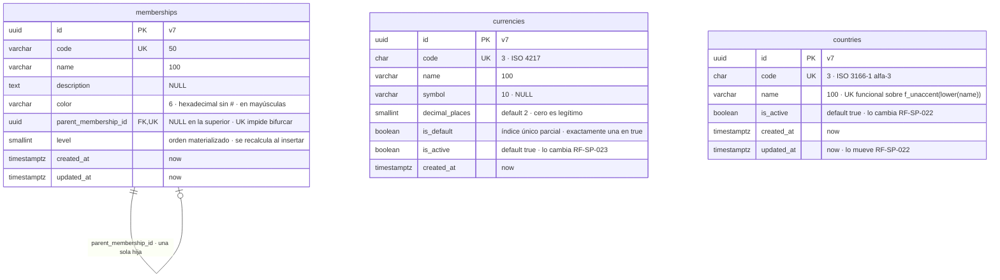
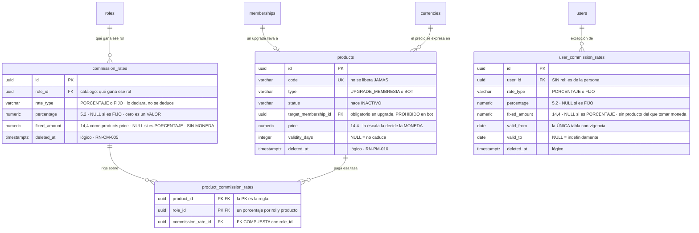
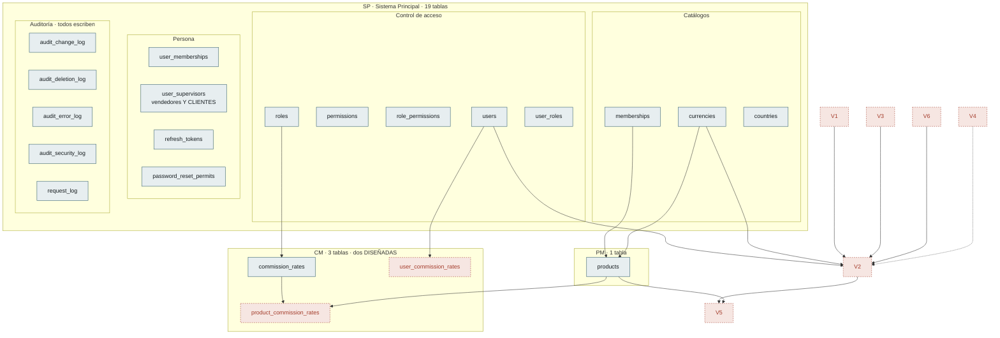

# Modelo de Datos — Estado actual

| Campo | Valor |
|---|---|
| Versión | 0.20.0 |
| Estado | **Borrador** |
| Responsable | Bonilla Diaz William Steven |
| Fecha de creación | 21-08-2026 |
| Última actualización | 02-09-2026 |

!!! info "Qué va en este documento"

    Cómo va quedando el esquema con lo que hay especificado hoy: las tablas, sus columnas y las relaciones entre ellas, agrupadas por lo que resuelven.

    Es una **vista derivada**, no normativa. Sale de [`requirements/sp.md` §10](requirements/sp.md), [`security.md` §9](security.md) y [`architecture.md` §6.6](architecture.md). La fuente de verdad del esquema son las **migraciones Flyway** (Art. V.3), y donde ya existen mandan ellas.

!!! warning "Veintiuna tablas escritas, y cuatro diseñadas que todavía no existen"

    Están escritas las **veintiuna** tablas que este documento describe. `V48` cerró lo último que quedaba: creó `user_commission_rates` y `product_commission_rates`, y **rehízo `commission_rates`** quitándole el producto, la persona y la vigencia.

    Desde el 02-09-2026 hay **cuatro más diseñadas y sin escribir**, del `MV` renacido: `movements`, `movement_types`, `movement_details` y `payment_methods`. Las crea **`V52`** con `RF-MV-001`, y **su forma no se repite aquí**: vive en [`requirements/mv.md` §7](requirements/mv.md). Este documento es una **vista derivada** —lo dice justo arriba—, y dos copias de un esquema que todavía se está discutiendo divergen sin que nadie lo note.

    **`V49`** añadió las cuatro columnas del valor fijo —`rate_type` y `fixed_amount` en las dos tablas de tasas— y **`V51`** el `role_type` de `user_roles`, que es lo que hace declarable `RN-SP-025`.

    !!! warning "El número de `MV` se movió dos veces el 02-09-2026, y no es cosmético"

        Tres migraciones se diseñaron el mismo día sin cruzarse y las tres pedían el `50`. **Se numeran por orden de aplicación**, y el reparto quedó así:

        | Número | Qué hace | Estado |
        |---|---|---|
        | **`V50`** | `V50__seed_movements_permissions.sql` — siembra los cuatro permisos `movements:` y los asocia **solo a `SUPERADMIN`** ([`requirements/mv.md` §6.1](requirements/mv.md)). **Ninguna tabla** | **Aplicada** |
        | **`V51`** | El `role_type` de `user_roles`, que hace declarable `RN-SP-025` | Diseñada |
        | **`V52`** | Las cuatro tablas de `MV`, con `RF-MV-001` | Diseñada |

        **La que se aplicó primero fue la única que estaba escrita**, y por eso se quedó con el `50` aunque llegara la última al reparto. Las otras dos estaban reservadas y sin una línea de `SQL`, que es la situación en la que una reserva no vale nada.

        No es una preferencia de estilo. Flyway aplica **en orden**, y una migración añadida con un número **por debajo** del último aplicado se queda fuera — el esquema quedaría sin esas cuatro tablas y nada lo diría hasta la primera consulta.

    **`V48` es también la primera migración del proyecto que borra datos a propósito.** Vació `commission_rates` porque **ninguna de las cuatro formas del modelo anterior tiene traducción al nuevo**: dejarlas caer a «tasa de rol» las habría convertido en filas plausibles y falsas — con su porcentaje, sin asociación, y sin que nada dijera que significan otra cosa que el día que se escribieron.

---

## 1. Control de acceso

El núcleo del módulo `SP`, incluidas las tablas de usuarios que lo consumen. Es la única zona del modelo con relaciones densas.

```mermaid
erDiagram
    roles ||--o{ roles : "parent_role_id · acota privilegios"
    roles ||--o{ role_permissions : "declara"
    permissions ||--o{ role_permissions : "se declara en"
    users ||--o{ user_roles : "porta"
    roles ||--o{ user_roles : "se asigna a"
    users ||--o{ refresh_tokens : "abre sesión"
    users ||--o{ password_reset_permits : "pide restablecer · RF-SP-040"
    users ||--o{ user_supervisors : "está a cargo de alguien"
    users ||--o{ user_supervisors : "tiene gente a cargo"
    users ||--o| user_memberships : "tiene a lo sumo una"
    memberships ||--o{ user_memberships : "se asigna a"

    memberships {
        uuid id PK "v7"
        varchar code UK "50"
        varchar name "100"
        text description "NULL"
        varchar color "6 · hexadecimal sin # · en mayúsculas"
        uuid parent_membership_id FK,UK "NULL en la superior · UK impide bifurcar"
        smallint level "orden materializado · se recalcula al insertar"
        timestamptz created_at "now"
        timestamptz updated_at "now"
    }

    permissions {
        uuid id PK "v7"
        varchar code UK "100 · resource:action"
        varchar resource "50"
        varchar action "50"
        varchar name "100"
        text description "NULL"
        timestamptz created_at "now"
        timestamptz updated_at "now"
    }

    roles {
        uuid id PK "v7"
        varchar code "50 · único entre los no eliminados"
        varchar name "100 · único entre los no eliminados"
        text description "NULL · CHECK 500 caracteres"
        varchar role_type "20 · FUNCIONARIO VENDEDOR CONSUMIDOR"
        uuid parent_role_id FK "NULL solo en el rol raíz"
        varchar status "20 · ACTIVO INACTIVO · default ACTIVO"
        boolean is_system "default false · bloquea toda edición"
        timestamptz created_at "now"
        timestamptz updated_at "now"
        timestamptz deleted_at "NULL · borrado lógico"
    }

    role_permissions {
        uuid role_id PK,FK "PK compuesta · excepción al Art. V.11"
        uuid permission_id PK,FK "PK compuesta"
        timestamptz created_at "now"
    }

    users {
        uuid id PK "usuarios"
        varchar username UK "inmutable · sin @ · único incluidos los eliminados"
        varchar email UK "corregible · único incluidos los eliminados"
        varchar first_name "—"
        varchar last_name "—"
        varchar password_hash "Argon2id"
        boolean must_change_password "default false · lo fijan RF-SP-024 y RF-SP-038"
        timestamptz password_expires_at "NULL · caducidad de la credencial provisional · la exige RF-SP-038"
        varchar status "ACTIVO FTD_PENDIENTE INACTIVO BLOQUEADO · el segundo AUTENTICA"
        int failed_attempts "control de bloqueo · la crea RF-SP-034"
        timestamptz locked_until "NULL · nulo también en el bloqueo manual, que no expira · la crea RF-SP-034"
        timestamptz last_login_at "NULL · la crea RF-SP-034"
        timestamptz deleted_at "NULL · nace con la tabla en V18 · solo la escribe RF-SP-029"
    }

    user_roles {
        uuid user_id PK,FK "PK compuesta"
        uuid role_id PK,FK "PK compuesta"
        varchar role_type FK "COPIA de roles.role_type · RN-SP-025 en el esquema"
        timestamptz created_at "now"
    }

    user_memberships {
        uuid user_id PK,FK "PK sobre user_id · RN-SP-014 en el esquema"
        uuid membership_id FK "—"
        timestamptz started_at "now"
        timestamptz ends_at "NULL · indefinida · la vigencia se evalúa al consultar"
        timestamptz created_at "now"
        timestamptz updated_at "now · RF-SP-032 sustituye con UPDATE"
    }

    refresh_tokens {
        uuid id PK "sesiones revocables"
        uuid user_id FK "—"
        varchar token_hash UK "nunca el valor en claro"
        timestamptz expires_at "—"
        timestamptz revoked_at "NULL"
        varchar revoked_reason "NULL · ROTACION CIERRE ACCESO_RETIRADO · solo ROTACION alerta"
        uuid replaced_by_id FK "NULL · rotación"
        inet ip "—"
        text user_agent "—"
    }

    password_reset_permits {
        uuid id PK "permiso temporal de RF-SP-040 · sin plan.md"
        uuid user_id FK "—"
        varchar token_hash UK "nunca el valor en claro, como refresh_tokens"
        timestamptz expires_at "vigencia corta"
        timestamptz used_at "NULL · de un solo uso"
        timestamptz invalidated_at "NULL · FA-002 · lo invalida el siguiente"
        inet ip "—"
        timestamptz created_at "now"
    }

    user_supervisors {
        uuid id PK "estructura comercial"
        uuid user_id FK "subordinado O CLIENTE · uno vigente por persona"
        uuid supervisor_id FK "superior si es vendedor, QUIEN LO TRAJO si es cliente"
        timestamptz started_at "now"
        timestamptz ended_at "NULL mientras esté vigente"
        timestamptz created_at "now"
        timestamptz updated_at "now"
    }
```

Ocho decisiones que el dibujo no explica solo:

- **`parent_role_id` hace dos trabajos**: acota los privilegios del hijo y expresa el orden de mando comercial (`RN-SP-011`). La consecuencia es permanente: un rol `VENDEDOR` nunca podrá tener un permiso que su superior no tenga, porque `RN-SEG-003` lo rechazaría.
- **`user_supervisors` es la única tabla que relaciona dos usuarios entre sí**, y responde a una pregunta que `parent_role_id` no puede responder: no *qué rol manda sobre qué rol*, sino **qué persona está a cargo de qué persona**. Lleva clave sustituta —al contrario que `user_roles`— porque el mismo par puede repetirse en el tiempo y lo que distingue una fila de otra es el periodo. Su unicidad es parcial, `WHERE ended_at IS NULL`: un solo superior vigente, historial ilimitado. **No concede acceso a ningún dato**; el modelo de alcance sigue pendiente como D-22.
- **La unicidad de `roles` es parcial**, no total: `WHERE deleted_at IS NULL`. Una restricción única corriente bloquearía para siempre el nombre de un rol borrado.
- **La de `users` es justo la contraria: total.** `username` y `email` son únicos entre **todos** los usuarios, incluidos los eliminados (`RN-SP-016`). Reutilizarlos permitiría que la actividad de dos personas distintas quedara bajo la misma etiqueta en la auditoría. La asimetría con `roles` es deliberada: un rol es una etiqueta, un usuario es una persona.
- **`username` y `email` sirven ambos para iniciar sesión**, y lo que impide que se confundan es que `username` no admite el carácter `@` (`RF-SP-024`). Sin esa restricción, las dos columnas necesitarían compartir un espacio de unicidad común.
- **`role_permissions` y `user_roles` no llevan clave sustituta.** La unicidad del par es la restricción que importa, y una columna sin significado no aportaría nada.

!!! danger "`user_roles.role_type` es la única columna desnormalizada del sistema, y es la que hace declarable `RN-SP-025`"

    Es una **copia** de `roles.role_type`, y está ahí porque «una persona no puede portar dos roles de tipo `VENDEDOR`» no se puede escribir de otra forma: un `CHECK` no consulta otra tabla, y un índice único no puede unir `user_roles` con `roles`.

    Copiar un dato es normalmente el error que este documento evita. **Aquí no lo es, y la diferencia se puede nombrar:** la copia está atada por una **clave foránea compuesta** `(role_id, role_type) → roles(id, role_type)`, de modo que **no puede divergir**; y su origen es **inmutable** —`RF-SP-004` corrige nombre y descripción, no el tipo—, de modo que nunca tendrá que actualizarse.

    Es el mismo patrón que `product_commission_rates` (§4), y la condición que lo hace legítimo es la misma en los dos sitios: **el dato copiado no cambia en su origen**. Donde cambie, la FK bloquearía la corrección legítima y el patrón deja de valer.

    Sobre ella, `uq_user_roles_vendedor` —parcial, `WHERE role_type = 'VENDEDOR'`— cierra la regla **en el motor**. Se decidió así el 02-09-2026 por un precedente y no por gusto: `RN-SP-018` se comprobaba en el caso de uso, **no aguantó la concurrencia**, y hubo que corregirla el 26-08-2026 sobre esta misma tabla.
- **La credencial provisional necesita dos columnas, no una.** `must_change_password` dice *que* hay que cambiarla; `password_expires_at` dice *hasta cuándo sirve*. `RF-SP-038` §7 exige ambas cosas —fija la marca y «el momento en que la credencial provisional caduca», superado el cual hay que restablecerla de nuevo— y hasta ahora el modelo solo declaraba la primera. La columna es nulable porque solo tiene sentido mientras la credencial sea provisional, y deja de tenerlo en cuanto la persona elige la suya: que `RF-SP-037` y `RF-SP-040` la limpien junto con la marca es la lectura natural, pero **ninguna de las dos lo dice** y es parte de lo que sus `plan.md` tendrán que fijar.
- **El permiso temporal de `RF-SP-040` es una tabla, no una columna.** Tiene vigencia propia, se consume de un solo uso y una solicitud nueva invalida la anterior (`FA-002`), de modo que necesita filas con estado y no un campo en `users`. Su forma copia la de `refresh_tokens` por el mismo motivo: **nunca se guarda el valor en claro**, solo su hash, porque quien leyera la tabla podría entrar como cualquiera. Es la tabla más provisional del modelo —`RF-SP-040` todavía no tiene `plan.md`—, y los nombres de sus columnas quedan sujetos a él.

---

## 2. Catálogos

Tres tablas que hoy **no tienen ninguna clave foránea entrante**: nada en el modelo las referencia todavía.

- **`memberships` es una lista, no un árbol.** El índice único sobre `parent_membership_id` es lo que lo garantiza: sin él la cadena podría bifurcarse y el orden dejaría de estar definido.
- **`currencies.is_default`** exige un índice único parcial: exactamente una fila en `true`, declarado en el esquema y no solo en el dominio (Art. V.6).
- **`countries` sí lleva `updated_at`**, incorporado el 21-08-2026 al aprobar el `plan.md` de `RF-SP-020`: el Art. V.7 lo obliga y `RF-SP-022` mueve la fila. `currencies` lo necesitará por el mismo motivo cuando se escriba el plan de `RF-SP-023`. Ninguna de las tres lleva borrado lógico.
- **La unicidad del nombre de `countries` es funcional**, sobre `f_unaccent(lower(name))` y no sobre `name` literal, porque `RN-SP-009` no admite edición y un `Panamá`/`Panama` duplicado sería permanente. Es la asimetría deliberada con `uq_roles_name`.
- `memberships` no tiene **ninguna** salida —ni baja ni indicador de activo— y `RN-SP-008` lo justifica: desactivar un eslabón dejaría un hueco en un orden lineal.
- **`memberships` gana `color`** el 26-08-2026: seis dígitos hexadecimales **sin `#`**, con los que el frontend pinta el nivel. Es el único campo de la tabla que no participa en ninguna regla del backend —nada se autoriza ni se ordena por él—, y aun así vive aquí y no en el navegador: si lo eligiera el frontend, dos pantallas del mismo sistema pintarían el mismo nivel de distinto color y nadie lo notaría hasta verlas juntas. Como `RN-SP-008` mantiene la membresía inmutable, **un color mal elegido no se puede corregir**; queda declarado en `requirements/sp.md` §5.1 con su condición de reapertura.

---

## 3. Auditoría

Cuatro tablas, no una. Cada una declara `NOT NULL` lo que en su contexto es obligatorio, algo que un registro único no permite. Comparten un núcleo común de seis columnas, repetido aquí en cada tabla porque así estará en el esquema.

- **Las tres columnas de origen son nulables a la vez**, con un `CHECK` que lo impone: `correlation_id` e `ip_address` van juntas. Una fila sin IP significa «no vino de la red», nunca «se olvidó registrarla».
- **`audit_security_log` es de solo inserción**, restringido a nivel de privilegios de base de datos y no por convención en el código. Un registro que la aplicación puede reescribir no prueba nada.
- Las cuatro se leen en conjunto por una **vista de solo lectura** sobre el núcleo común, que exige los cuatro permisos de lectura.
- **`request_log` ya no es un hueco**: existe desde `V35` (issue #23) y `architecture.md` §6.7 declara el porqué de cada columna. Dos diferencias con las cuatro de arriba, y ninguna es de estilo: su `correlation_id` **no** es nulable —aquellas admiten eventos de procesos internos, esto solo lo escribe una petición HTTP— y **no participa en la transacción de negocio**, de modo que una operación revertida deja su fila igual: que el negocio fallara no significa que nadie llamara.

---

## 4. Lo que se vende y cuánto se paga por venderlo

Las dos áreas que nacieron después de la primera versión de este documento y que **su mapa no conocía**: `PM` el 27-08-2026 y `CM` el 28-08-2026.

!!! info "Las cuatro columnas de `rate_type` y `fixed_amount` las escribe `V49`"

    Las decidió el responsable del proyecto el 02-09-2026 (`requirements/cm.md` v0.7.0) y se construyeron **ese mismo día, después de rehacer las tripletas**. Una sola migración para las dos tablas: separarlas dejaría en el historial un estado en el que una pieza admite el valor fijo y la otra no.

**Tres cosas del dibujo que conviene leer despacio:**

- **`rate_type` es una columna y no algo deducido de qué campo esté lleno.** Sin ella, «una forma y solo una» sería una propiedad emergente de dos nulos, y una fila con los dos vacíos no permitiría saber **cuál** de las dos quiso declarar quien la insertó.
- **`fixed_amount` comparte forma con `products.price`, `numeric(14,4)`, y no por simetría.** El precio tiene esa forma porque **la escala real la decide la moneda** —`currencies.decimal_places` va de 0 a 4— y un importe de comisión es dinero en esa misma moneda. Con menos decimales, una comisión en una moneda de cuatro no se podría expresar.
- **Y no lleva moneda.** La toma del producto que se vende, de modo que **la misma fila paga cosas distintas** según a cuál se aplique — y en `user_commission_rates`, que no se asocia a nada, sobre **todo el catálogo**. Es consecuencia aceptada (`cm.md` §1.1.1), no defecto.

!!! danger "Y aparece una asimetría con `products` que ninguna restricción puede cerrar"

    `RN-PM-007` valida que los decimales de un precio casen con los de su moneda, y lo hace **en el dominio** porque un `CHECK` no consulta `currencies`.

    **El valor fijo no puede validarse igual**: cuando se declara, **no se sabe en qué moneda se pagará**. En el catálogo por rol el producto todavía no está asociado; en la personalizada no hay producto en absoluto.

    De modo que dos columnas con **la misma forma** tienen **garantías distintas**: el precio casa con su moneda, el importe de comisión **no lo comprueba nadie**.

### 4.1 Lo que estas dos tablas le exigen a una que todavía no existe

Ninguna de las dos guarda una venta, y **las dos escribieron condiciones sobre quien la guarde**:

!!! success "Esa tabla ya existe en papel, y acepta las dos condiciones"

    Desde el 02-09-2026 la venta está diseñada: `movements` y `movement_details` ([`requirements/mv.md` §7](requirements/mv.md)), que `RF-MV-001` creará con `V52`. **Copia el precio unitario y la vigencia en la línea** —lo primero que esta sección exigía— y **no copia la membresía destino**, por el criterio que esta misma sección fijó: se copia lo que puede cambiar, y `RF-PM-004` `EX-004` rechaza cambiarla.

    Lo que **sigue sin dueño** es la segunda condición: copiar lo que la comisión valía. La venta no la copia porque **no devenga comisiones todavía** —es la etapa 5 de `MV`—, de modo que la deuda que §4.1 abrió sigue abierta y ahora se sabe **dónde** se pagará.

| Quién lo exige | Qué exige |
|---|---|
| `requirements/pm.md` §1.4 | Cada compra guardará **el importe que se pagó y la vigencia que compró**, en lugar de leerlos del producto |
| `RN-CM-008` | Cada liquidación guardará **la forma y el valor que aplicó** —el tipo, y el porcentaje o el importe—, en lugar de leerlos de la tasa |
| `RN-CM-017` | Y guardará además **la moneda en que se pagó**, que la tasa fija **no declara**: sale del producto de esa venta |
| `RN-CM-018` | Y **rechazará, no recortará**, lo que exceda el importe de la venta — ni una tasa fija ni la suma de la cadena están acotadas |

**Las dos primeras dicen lo mismo con distinto sujeto: copiar y no referenciar.** Sin ellas, corregir un precio reescribiría facturas ya emitidas y corregir una tasa reescribiría lo que alguien cobró.

!!! danger "El valor fijo hace crecer esta lista, y la parte nueva es la moneda"

    Con solo porcentajes, `RN-CM-008` se satisfacía copiando **un número**. Con el valor fijo hay que copiar **tres cosas** —el tipo, el valor y la moneda—, y **la tercera no está en ninguna tabla de `CM`**: la tasa fija no declara moneda, la toma del producto que se vende.

    De modo que la liquidación es **el primer sitio del sistema donde el importe de una comisión existe con su moneda**. Si no la copia ahí, no hay dónde ir a buscarla después: el producto puede haberse retirado, y la tasa nunca la tuvo.

!!! important "Pero no se copia todo, y la prueba es si el origen puede cambiar"

    **Se copia lo que puede cambiar; lo inmutable se referencia.** El **precio** y la **vigencia** se corrigen (`RF-PM-004`) y el **porcentaje** de una tarifa se corrige (`RF-CM-003`) — los tres habrá que copiarlos.

    **La membresía destino no.** `RF-PM-004` `EX-004` **rechaza cambiarla**, junto al tipo y al código, de modo que leerla del producto da siempre el mismo valor. Copiarla solo añadiría **un sitio más donde el dato pudiera discrepar de sí mismo**, que es el coste que toda desnormalización paga y que ahí no compra nada.

    Es la diferencia entre una copia que **protege el pasado** y una que **duplica el presente**.

## 5. Cómo queda la base de datos

**Veintiuna tablas escritas.** Ninguna se ha retirado nunca.

### 5.1 El inventario, con quién es dueño

| Módulo | Tablas | Estado |
|---|---|---|
| `SP` | `permissions`, `roles`, `role_permissions`, `users`, `user_roles`, `memberships`, `user_memberships`, `currencies`, `countries`, `user_supervisors`, `refresh_tokens`, `password_reset_permits` | **12, escritas** |
| `SP` · auditoría | `audit_change_log`, `audit_deletion_log`, `audit_error_log`, `audit_security_log`, `request_log` | **5, escritas** |
| `PM` | `products` | **1, escrita** |
| `CM` | `commission_rates`, `user_commission_rates`, `product_commission_rates` | **3, escritas** (`V48`) |

**Un módulo, una a seis tablas.** `SP` tiene diecisiete y los otros dos juntos tienen cuatro, y eso no es desequilibrio: `SP` es dueño del acceso, de los catálogos transversales y de la auditoría entera, que es infraestructura que todos usan y nadie duplica.

### 5.2 Lo que cambió en `SP` el 01-09-2026, sin tabla nueva

Dos cambios que **no añaden ninguna tabla** y sí cambian lo que el modelo significa:

| Qué | Cambio |
|---|---|
| `users.status` | `PENDIENTE` —declarado y sin usar desde `V18`— es sustituido por **`FTD_PENDIENTE`**. Cambio de dominio **sin migración de datos**: ninguna fila llevaba el valor retirado |
| `user_supervisors` | **Deja de contener solo vendedores.** El cliente cuelga de su vendedor en la misma tabla, y una fila significa dos cosas según quién sea el subordinado: «reporta a» entre vendedores, «fue traído por» cuando es un cliente |

**El segundo es el más barato y el que más alcance tiene.** Cero columnas nuevas, cero migraciones — y `RN-SP-022` se endurece sin cambiar de texto, de modo que tres requerimientos ya construidos empiezan a rechazar más.

### 5.3 Dónde apunta cada clave foránea que cruza un módulo

Son **ocho**, y todas van en la misma dirección: **hacia `SP` y hacia `PM`**, nunca al revés.

| Desde | Hacia | Módulo |
|---|---|---|
| `products.target_membership_id` | `memberships` | `PM` → `SP` |
| `products.currency_id` | `currencies` | `PM` → `SP` |
| `commission_rates.role_id` | `roles` | `CM` → `SP` |
| `user_commission_rates.user_id` | `users` | `CM` → `SP` |
| `product_commission_rates.product_id` | `products` | `CM` → `PM` |

**Las claves foráneas sí cruzan; los repositorios no.** Es la distinción de D-25 y conviene tenerla clara mirando este cuadro: la integridad referencial la defiende el motor, y la frontera de código la defiende una regla de ArchUnit. Que una tabla apunte a otra de otro módulo **no autoriza a leerla desde Java**.

### 5.4 Sobre la numeración de las migraciones

La secuencia no es continua —falta el tramo `V8` a `V12`— y no es un descuido: son números consumidos por trabajo que se reorganizó. Un número de migración **no se reutiliza jamás**, porque Flyway lo registra en el historial de cada entorno.

## 6. Lo que el modelo deja pendiente

| # | Punto | Dónde se resuelve |
|---|---|---|
| ~~1~~ | ~~**`memberships` no tiene vínculo con nada.**~~ **Resuelto el 22-08-2026 al aprobar el `plan.md` de `RF-SP-024`:** la asociación vive en **`user_memberships`**, tabla puente con `user_id` como **clave primaria** —que es `RN-SP-014` declarada en el esquema: una membresía por persona—. No es `users.membership_id` porque la asignación lleva vigencia propia, ni una columna en `roles` porque el nivel es de la persona y no del rol. La restricción de que solo los consumidores la tengan (`RN-SP-013`, `RN-SP-018`) **no** es expresable en el esquema: depende de `user_roles` y `roles.role_type`, y PostgreSQL no admite subconsultas en `CHECK`. **Enmendado el 02-09-2026:** desde que `user_roles` copia el `role_type` (§1), **sí lo es** — la copia trae a la tabla el dato del que dependen, y es lo que permitió declarar `RN-SP-025` en el motor. **No se hace hoy**: es otro requerimiento y otra tripleta, y se anota para que no se pierda | — |
| 2 | **`countries` y `currencies` son islas.** Existen sin una sola clave foránea entrante. Su razón de ser es futura —importes con moneda, direcciones con país—, pero conviene dejar escrito quién los referenciará. | `modules.md` §6, alcance por inventariar |
| ~~3~~ | ~~**`request_log` no tiene esquema.**~~ **Resuelto el 25-08-2026 (issue #23):** la tabla se crea en `V35` y sus columnas quedan declaradas en `architecture.md` §6.7 y en §3 de este documento. El hueco no era de documentación: la tabla **no existía**, y cinco secciones de la arquitectura la daban por escrita. Lo que se perdía mientras tanto era todo lo que el manejador global decide no auditar «porque `request_log` ya lo cubre» — los `404`, los `400` de formato y el barrido de rutas | `architecture.md` §6.7 |
| 4 | **`audit_*.actor_id` no declara clave foránea a `users`.** Está documentado como `uuid NULL` sin relación. Si es deliberado —para que eliminar un usuario no arrastre ni bloquee su auditoría— conviene decirlo; si no, falta la restricción. | `architecture.md` §6.6.1 |
| 5 | **Tres estrategias de baja distintas**: `roles` con `deleted_at`, `countries` y `currencies` con `is_active`, `memberships` con ninguna. Cada caso está justificado por separado, pero no hay una regla que diga cuándo se usa cada una. | `architecture.md` §6.4 |
| 6 | **`modelo_v1.mwb` está desactualizado.** Trae `roles.assigned_role_id`, que `security.md` §9 renombra a `parent_role_id`. El modelo gráfico es material de referencia, no autoridad sobre el esquema (Art. V.3). | `DB/modelo_v1.mwb` |
| 7 | **Qué ocurre con `role_permissions` cuando se elimina un rol.** El borrado de `roles` es lógico, y `RF-SP-009` §7 solo dice que sus asociaciones con permisos «dejan de tener efecto»: no declara si las filas se borran o sobreviven. `RF-SP-029` sí lo declara para las suyas —las de `user_roles` y `user_memberships` **desaparecen**—, de modo que dos eliminaciones del mismo módulo resuelven distinto la misma pregunta. Reutilizar el código de un rol eliminado con sus filas de permisos vivas dejaría un vínculo apuntando a un rol que ya no existe para nadie | `RF-SP-009` §7, migración de `roles` |
| ~~8~~ | ~~**`refresh_tokens` y `password_reset_permits` no tienen migración declarada.**~~ **Resuelto:** las crean `V29` y `V37` respectivamente. Lo que sigue — Las crean `RF-SP-034` y `RF-SP-040`, que todavía no tienen `plan.md`; hasta que lo tengan, sus columnas son derivación de la spec y no esquema fijado. Es también donde se decidirá dónde vive la **caducidad de la credencial provisional**, que aquí figura como `users.password_expires_at` | `plan.md` de `RF-SP-034` y `RF-SP-040` |
| 9 | ~~**Nadie purga los tokens.**~~ **Resuelto a medias el 25-08-2026 (issue #25):** `refresh_tokens` ya se purga —por familia entera, treinta días después de que **toda** ella caduque, con constancia auditada y un cerrojo que impide que tres réplicas purguen tres veces (`security.md` §5.5.2)—. Sigue abierto para **`password_reset_permits`**, que no se puede purgar porque todavía no existe: la crea `RF-SP-040`, bloqueado por **D-23**. Y sigue abierto para el `request_log` y los cuatro registros de auditoría, cuyo plazo depende de **D-10** | `security.md` §5.5.2, **D-10**, **D-23** |
| ~~10~~ | ~~**`users.status` declara `PENDIENTE` y ninguna operación entra ni sale de él.**~~ **Resuelto el 01-09-2026:** `RF-SP-045` lo sustituye por **`FTD_PENDIENTE`**, que sí tiene entrada —el registro por enlace— y salida —un depósito confirmado—. `V18` lo había dejado declarado justamente para que estrenarlo no costara alterar el `CHECK` de una tabla en uso, y ese día llegó. Lo que sigue — `security.md` §3.1 lo conserva para un flujo de activación que no existe, y el `CHECK` del dominio cerrado lo admitirá igual. O se retira del dominio hasta que ese flujo se especifique, o se declara qué requerimiento lo poblará | `security.md` §3.1 |

---

## 7. Control de cambios

| Versión | Fecha | Cambio | Responsable |
|---|---|---|---|
| 0.1.0 | 21-08-2026 | Creación inicial. Cuatro diagramas derivados de `requirements/sp.md` §10, `security.md` §9 y `architecture.md` §6.6, y seis puntos pendientes que el modelo deja a la vista. | Responsable técnico |
| 0.2.0 | 21-08-2026 | Consecuencias de aprobar `RF-SP-024`. `users` incorpora `first_name`, `last_name` y `must_change_password`; se anota que `username` es inmutable y sin `@`, que ambos identificadores sirven para iniciar sesión, y que su unicidad es **total** —incluidos los eliminados—, al contrario que la de `roles`. | Responsable técnico |
| 0.3.0 | 21-08-2026 | Consecuencias de aprobar `RF-SP-028`. `locked_until` queda nulo también en el bloqueo manual, que no expira y solo se levanta reactivando la cuenta. | Responsable técnico |
| 0.4.0 | 21-08-2026 | Consecuencias de aprobar el `plan.md` de `RF-SP-020`. `countries` gana `updated_at` y su unicidad de nombre pasa a ser funcional sobre `f_unaccent(lower(name))`. | Responsable técnico |
| 0.5.0 | 21-08-2026 | Consecuencias de aprobar `RF-SP-035`. `refresh_tokens` gana `revoked_reason`: solo la revocación por rotación indica robo, y sin ese dato cerrar sesión sería indistinguible de una reutilización. | Responsable técnico |
| 0.6.0 | 22-08-2026 | Entidad nueva `user_supervisors`, derivada de registrar `RF-SP-041` y `RF-SP-042`: la estructura comercial **persona → persona**, con historial y un solo superior vigente por persona. Es la primera tabla del modelo que relaciona dos usuarios entre sí. Se anota por qué lleva clave sustituta cuando las demás asociaciones no la llevan, y que **no concede alcance sobre los datos** —D-22 sigue abierta—. | Responsable técnico |
| 0.7.0 | 22-08-2026 | Consecuencias de aprobar los `plan.md` de `RF-SP-025` a `RF-SP-029`. `users` incorpora **`deleted_at`**, que nace con la tabla en `V18` y no con `RF-SP-029` —`architecture.md` §6.4 la declara obligatoria en toda tabla de negocio y diez requerimientos la leen antes de que alguien la escriba—, y se anota qué requerimiento crea cada una de las tres columnas de control de acceso: las tres son de `RF-SP-034`. §1 incorpora **`user_memberships`**, que faltaba en el diagrama pese a haberla creado `RF-SP-024` \(`V20`\), y con ella queda **cerrado el hueco 1** de §5: la asociación entre una persona y su nivel vive en esa tabla puente, con `user_id` como clave primaria. | Responsable técnico |
| 0.8.0 | 22-08-2026 | Revisión de completitud disparada por los flujos del módulo v0.3.0. §1 incorpora **`users.password_expires_at`** —`RF-SP-038` §7 exige fijar cuándo caduca la credencial provisional y el modelo solo declaraba la marca— y la tabla **`password_reset_permits`**, que el permiso temporal de un solo uso de `RF-SP-040` exige y que no puede ser una columna porque tiene vigencia, consumo e invalidación propios. §4 añade `user_memberships`, que faltaba en el mapa, retira la pregunta «¿quién apunta aquí?» de `memberships` —`user_memberships` la responde desde la v0.7.0— y anota qué tablas están escritas y cuáles no tienen sitio en la secuencia de migraciones. La advertencia de cabecera deja de decir que no hay ninguna migración escrita: de `V1` a `V7` lo están. §5 suma cuatro pendientes: `role_permissions` ante el borrado lógico de un rol, las dos tablas sin migración declarada, la purga que nadie ejecuta y `PENDIENTE` sin transiciones. | Responsable técnico |
| 0.9.0 | 25-08-2026 | **`request_log` deja de ser un hueco** (issue #23). §3 sustituye el marcador «esquema sin definir» por las once columnas reales que crea `V35`, §4 la marca como escrita en el mapa y §5 cierra el **pendiente 3**. Se anota lo que no se deduce del esquema: su `correlation_id` **no** es nulable al contrario que en las cuatro de auditoría —aquellas admiten eventos de procesos internos, esto solo lo escribe una petición HTTP—, un `status` nulo significa que la petición se abortó sin respuesta, y **no participa en la transacción de negocio**, de modo que una operación revertida deja su fila igual. Sigue faltando la purga, que depende de **D-10** (pendiente 9). | Responsable técnico |
| 0.10.0 | 25-08-2026 | §5 cierra **a medias el pendiente 9** (issue #25): `refresh_tokens` ya tiene quien la purgue. Queda abierto para `password_reset_permits` —que no se puede purgar porque no existe— y para el `request_log` y los cuatro registros de auditoría, cuyo plazo depende de **D-10**. El esquema no cambia: la purga no añade columnas, y su único rastro en el modelo es que la tabla deja de crecer sin techo. | Responsable técnico |
| 0.11.0 | 26-08-2026 | **`memberships` gana `color`**, seis dígitos hexadecimales sin `#` y en mayúsculas, con los que el frontend pinta el nivel (`RN-SP-024`). Es obligatorio: un color opcional obliga al navegador a inventarse uno de reserva, que es justo la decisión que este campo saca del frontend. Se anota en §4 la consecuencia de que `RN-SP-008` lo vuelve **incorregible** una vez creado. | Responsable técnico |
| 0.13.0 | 01-09-2026 | **`user_supervisors` cambia de significado sin cambiar de forma** (`RF-SP-045`). Hasta hoy relacionaba **vendedores entre sí**; desde ahora contiene también a los **clientes**, colgando del vendedor que los trajo. No hay columnas nuevas ni aristas nuevas que dibujar, y por eso este cambio **no se ve en el diagrama**: lo que cambia es qué significa una fila. Se propuso una tabla propia, `client_referrals`, y **el responsable del proyecto la descartó** a favor de reutilizar esta: con dos tablas, subir de un cliente hasta el manager que cobra por él exige un join y un caso especial en la hoja; con una, es un recorrido. | Responsable técnico |
| 0.14.0 | 01-09-2026 | **El documento deja de describir solo `SP`.** Su mapa llevaba **dos módulos de retraso**: no conocía `products` —de `PM`, escrita el 27-08-2026— ni `commission_rates` —de `CM`, el 28-08-2026—, y llamaba `password_reset_tokens` a una tabla que se llama **`password_reset_permits`** desde `V37`. Las tres derivas se corrigen. §4 incorpora las **dos áreas que nacieron después** con su diagrama entidad-relación, y §4.1 recoge **lo que esas dos tablas le exigen a una que todavía no existe** —la que guarde las ventas—: copiar el importe y la vigencia, copiar el porcentaje. Con el criterio que separa una copia que **protege el pasado** de una que **duplica el presente**: **se copia lo que puede cambiar; lo inmutable se referencia** — el precio y el porcentaje sí, la membresía destino no, porque `RF-PM-004` `EX-004` rechaza cambiarla. §5 se reescribe entera como **la vista de conjunto de la base**: diecinueve tablas, el inventario por dueño, **las cinco claves foráneas que cruzan un módulo** y la distinción que conviene tener a la vista mirándolas — **las claves foráneas sí cruzan y los repositorios no**, porque la integridad la defiende el motor y la frontera de código una regla de ArchUnit. §5.2 recoge los **dos cambios de este día que no añaden ninguna tabla**: el estado `FTD_PENDIENTE` y los clientes dentro de `user_supervisors`, que cuesta cero columnas y es el de más alcance. | Responsable técnico |
| 0.15.0 | 01-09-2026 | **`CM` se rehace y el modelo lo recoge.** Donde había **una** tabla ahora hay **tres**: `commission_rates` se queda como **catálogo por rol** —pierde el producto, la persona y la vigencia—, `user_commission_rates` guarda la **excepción por persona** con su vigencia y **sin rol**, y `product_commission_rates` es la **asociación** que decide sobre qué producto rige cada tasa. **Es la primera vez que este documento describe una tabla ya escrita que hay que rehacer**, y el mapa la marca como tal. Dos detalles del esquema merecen leerse: la **clave primaria de la asociación es `(product_id, role_id)`**, de modo que «un solo porcentaje por rol y producto» **no es una regla que alguien comprueba, es la forma de la tabla**; y `role_id` está ahí **copiado a propósito**, con una **clave foránea compuesta** hacia `commission_rates(id, role_id)` que hace **imposible**, no improbable, que diverja del rol que la tasa declara. **La vigencia queda en una sola tabla**, y con ello el `EXCLUDE` de no solapamiento vuelve a caber donde tiene que estar — sacar el producto fuera lo habría hecho cruzar dos tablas, que ningún índice hace. | Responsable técnico |
| 0.16.0 | 02-09-2026 | **Lo que este documento describía como diseñado pasa a estar escrito.** `V48` crea `user_commission_rates` y `product_commission_rates` y rehace `commission_rates`, de modo que el sistema llega a **veintiuna tablas** y **no queda ninguna pendiente de escribir** — la primera vez desde que existe este documento. **`V48` es además la primera migración del proyecto que borra datos a propósito**, y conviene que quede dicho por qué: **ninguna de las cuatro formas del modelo anterior tenía traducción al nuevo**, y dejarlas caer a «tasa de rol» las habría convertido en filas plausibles y falsas — con su porcentaje, sin asociación, y sin nada que dijera que ya no significan lo que el día que se escribieron. Se vacía para que la pérdida sea **visible** en vez de silenciosa. Al construirlo aparece además una restricción que el diseño no había previsto y que el esquema **no puede declarar**: `RN-CM-015` —una tasa asociada no se retira—, porque `product_commission_rates` no tiene retiro lógico y su fila sobreviviría apuntando a una tasa muerta; una clave foránea no distingue una fila viva de una retirada lógicamente, de modo que esto vive en el caso de uso y no en el motor. | Responsable técnico |
| 0.17.0 | 02-09-2026 | **Vuelve el valor directo a las comisiones** (`requirements/cm.md` v0.7.0) y el mapa lo recoge **antes de que exista la migración**: las dos tablas de tasas ganan `rate_type` y `fixed_amount`, cuatro columnas **diseñadas y sin escribir** que van marcadas en cabecera y en §4. Es la situación en la que estuvo este documento hasta `V48`, y vuelve a estarlo. **`fixed_amount` comparte forma con `products.price`, `numeric(14,4)`, y no por simetría**: el precio la tiene porque **la escala real la decide la moneda** —`currencies.decimal_places` va de 0 a 4— y un importe de comisión es dinero en esa misma moneda; con menos decimales, una comisión en una moneda de cuatro no se podría expresar. **Y el dibujo destapa una asimetría que ninguna restricción puede cerrar**: `RN-PM-007` valida que los decimales de un precio casen con su moneda, y **el valor fijo no puede validarse igual** porque al declararlo **no se sabe en qué moneda se pagará** — en el catálogo por rol el producto todavía no está asociado, y en la personalizada no hay producto en absoluto. Dos columnas con la misma forma, **garantías distintas**. §4.1 crece en consecuencia: con solo porcentajes, `RN-CM-008` se satisfacía copiando **un número**; ahora la liquidación tendrá que copiar **el tipo, el valor y la moneda**, y **la tercera no está en ninguna tabla de `CM`** — es el primer sitio del sistema donde el importe de una comisión existirá con su moneda, y si no la copia ahí no habrá dónde buscarla después. | Responsable técnico |
| 0.18.0 | 02-09-2026 | **`user_roles` gana `role_type`, la primera columna desnormalizada del sistema**, y con ella `RN-SP-025` deja de ser una regla declarada sin nadie que la sostenga. Copiar un dato es normalmente el error que este documento evita; §1 nombra la diferencia: la copia está atada por una **clave foránea compuesta** —de modo que no puede divergir— y su origen es **inmutable**, porque `RF-SP-004` corrige nombre y descripción y no el tipo. Es el mismo patrón que `product_commission_rates`, y la condición que lo hace legítimo es la misma en los dos sitios: **el dato copiado no cambia en su origen**. Sobre esa columna, un **índice único parcial** sobre `(user_id) WHERE role_type = 'VENDEDOR'` cierra la regla en el motor. Se decidió así por un precedente y no por gusto: `RN-SP-018` se comprobaba en el caso de uso, **no aguantó la concurrencia** y hubo que corregirla el 26-08-2026 **sobre esta misma tabla**. Y el hallazgo 1 queda **enmendado**: decía que `RN-SP-013` y `RN-SP-018` no son expresables en el esquema por depender de `user_roles` y `roles.role_type`, y desde hoy **sí lo son** — la copia trae a la tabla justo ese dato. No se hace en este pase, y se anota para que no se pierda. | Responsable técnico |
| 0.19.0 | 02-09-2026 | **Vuelve a haber tablas diseñadas y sin escribir**, y son cuatro: `movements`, `movement_types`, `movement_details` y `payment_methods`, del `MV` renacido. Las creará `V50` con `RF-MV-001`. **Su forma no se copia a este documento**, y eso es lo que cambia respecto del intento anterior: aquí es una **vista derivada** y allí, en [`requirements/mv.md` §7](requirements/mv.md), está la fuente — dos copias de un esquema que todavía se discute divergen sin que nadie lo note, y este mapa ya llegó una vez con **dos módulos de retraso**. Lo que sí se recoge es la respuesta a §4.1, que llevaba abierta desde el 01-09-2026: **la tabla que aquellas dos exigían ya existe en papel y acepta sus condiciones** — copia el precio y la vigencia en la línea, y **no copia la membresía destino** porque `RF-PM-004` `EX-004` rechaza cambiarla. **La segunda condición sigue sin dueño**: copiar lo que la comisión valía no lo hace la venta, porque no devenga comisiones todavía — es la etapa 5 de `MV`, y ahora al menos se sabe dónde se pagará esa deuda. | Responsable técnico |
| 0.20.0 | 02-09-2026 | **La primera de las tres migraciones que se disputaban el `50` está aplicada, y no es ninguna de las que lo habían reservado.** `V50__seed_movements_permissions.sql` siembra los cuatro permisos `movements:` de [`requirements/mv.md` §6](requirements/mv.md) y **no crea ninguna tabla**: la tarea que los siembra no depende de nada, y un permiso sin endpoint que lo exija no rompe nada, mientras que una tabla sin el caso de uso que la escribe promete algo que no existe. Con ello el reparto queda en **`V50` permisos de `MV`, `V51` el `role_type` de `RN-SP-025` y `V52` las cuatro tablas de `MV`** — el número lo toma quien se aplica primero, y las otras dos seguían siendo reservas sin una línea de `SQL`. **Lo que hay que leer del bloque de arriba no es el número sino la asociación**: esos cuatro permisos van **solo a `SUPERADMIN`**, por decisión del responsable del proyecto, de modo que por `RN-SEG-003` ningún rol bajo `ADMIN` podrá declararlos mientras la reserva siga en pie ([`security.md` §4.4](security.md)). El esquema no cambia: `role_permissions` recibe cuatro filas y nada más. | Responsable técnico |
