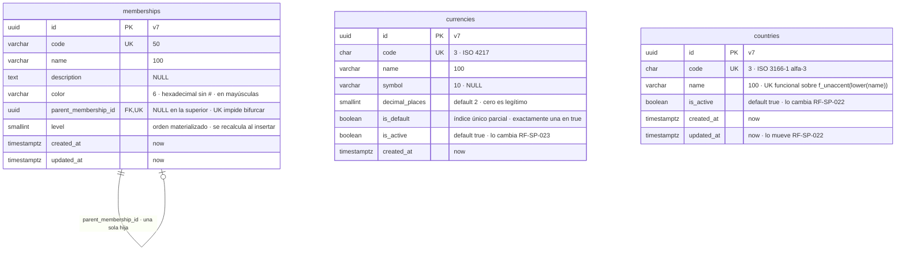
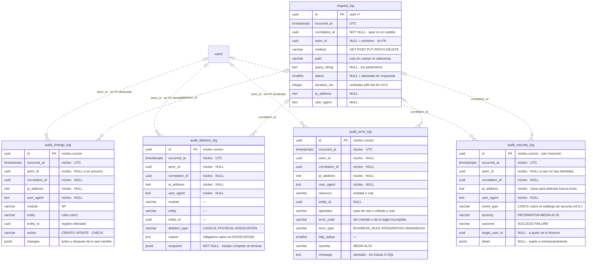
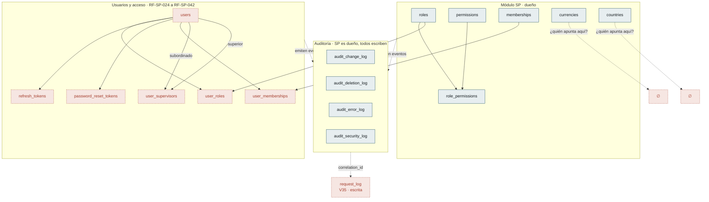

# Modelo de Datos — Estado actual

| Campo | Valor |
|---|---|
| Versión | 0.12.0 |
| Estado | **Borrador** |
| Responsable | Bonilla Diaz William Steven |
| Fecha de creación | 21-08-2026 |
| Última actualización | 28-08-2026 |

!!! info "Qué va en este documento"

    Cómo va quedando el esquema con lo que hay especificado hoy: las tablas, sus columnas y las relaciones entre ellas, agrupadas por lo que resuelven.

    Es una **vista derivada**, no normativa. Sale de [`requirements/sp.md` §10](requirements/sp.md), [`security.md` §9](security.md) y [`architecture.md` §6.6](architecture.md). La fuente de verdad del esquema son las **migraciones Flyway** (Art. V.3), y donde ya existen mandan ellas.

!!! warning "Siete tablas existen; el resto es esquema exigido y no escrito"

    De `V1` a `V7` están escritas: `permissions` y su siembra, las cuatro tablas de auditoría, `roles`, `role_permissions` y la siembra de roles de sistema. **Todo lo demás —`memberships`, `currencies`, `countries`, `users` y las cinco tablas que cuelgan de ella— sigue siendo el esquema que las specs aprobadas exigen y nadie ha migrado todavía**, útil para revisarlo antes de que exista y sea caro cambiarlo.

---

## 1. Control de acceso

El núcleo del módulo `SP`, incluidas las tablas de usuarios que lo consumen. Es la única zona del modelo con relaciones densas.

```mermaid
erDiagram
    roles ||--o{ roles : "parent_role_id · acota privilegios"
    roles ||--o{ role_permissions : "declara"
    permissions ||--o{ role_permissions : "se declara en"
    users ||--o{ user_roles : "porta"
    roles ||--o{ user_roles : "se asigna a"
    users ||--o{ refresh_tokens : "abre sesión"
    users ||--o{ password_reset_tokens : "pide restablecer · RF-SP-040"
    users ||--o{ user_supervisors : "está a cargo de alguien"
    users ||--o{ user_supervisors : "tiene gente a cargo"
    users ||--o| user_memberships : "tiene a lo sumo una"
    memberships ||--o{ user_memberships : "se asigna a"

    memberships {
        uuid id PK "v7"
        varchar code UK "50"
        varchar name "100"
        text description "NULL"
        varchar color "6 · hexadecimal sin # · en mayúsculas"
        uuid parent_membership_id FK,UK "NULL en la superior · UK impide bifurcar"
        smallint level "orden materializado · se recalcula al insertar"
        timestamptz created_at "now"
        timestamptz updated_at "now"
    }

    permissions {
        uuid id PK "v7"
        varchar code UK "100 · resource:action"
        varchar resource "50"
        varchar action "50"
        varchar name "100"
        text description "NULL"
        timestamptz created_at "now"
        timestamptz updated_at "now"
    }

    roles {
        uuid id PK "v7"
        varchar code "50 · único entre los no eliminados"
        varchar name "100 · único entre los no eliminados"
        text description "NULL · CHECK 500 caracteres"
        varchar role_type "20 · FUNCIONARIO VENDEDOR CONSUMIDOR"
        uuid parent_role_id FK "NULL solo en el rol raíz"
        varchar status "20 · ACTIVO INACTIVO · default ACTIVO"
        boolean is_system "default false · bloquea toda edición"
        timestamptz created_at "now"
        timestamptz updated_at "now"
        timestamptz deleted_at "NULL · borrado lógico"
    }

    role_permissions {
        uuid role_id PK,FK "PK compuesta · excepción al Art. V.11"
        uuid permission_id PK,FK "PK compuesta"
        timestamptz created_at "now"
    }

    users {
        uuid id PK "usuarios"
        varchar username UK "inmutable · sin @ · único incluidos los eliminados"
        varchar email UK "corregible · único incluidos los eliminados"
        varchar first_name "—"
        varchar last_name "—"
        varchar password_hash "Argon2id"
        boolean must_change_password "default false · lo fijan RF-SP-024 y RF-SP-038"
        timestamptz password_expires_at "NULL · caducidad de la credencial provisional · la exige RF-SP-038"
        varchar status "CHECK sobre dominio cerrado · PENDIENTE sin uso"
        int failed_attempts "control de bloqueo · la crea RF-SP-034"
        timestamptz locked_until "NULL · nulo también en el bloqueo manual, que no expira · la crea RF-SP-034"
        timestamptz last_login_at "NULL · la crea RF-SP-034"
        timestamptz deleted_at "NULL · nace con la tabla en V18 · solo la escribe RF-SP-029"
    }

    user_roles {
        uuid user_id PK,FK "PK compuesta"
        uuid role_id PK,FK "PK compuesta"
        timestamptz created_at "now"
    }

    user_memberships {
        uuid user_id PK,FK "PK sobre user_id · RN-SP-014 en el esquema"
        uuid membership_id FK "—"
        timestamptz started_at "now"
        timestamptz ends_at "NULL · indefinida · la vigencia se evalúa al consultar"
        timestamptz created_at "now"
        timestamptz updated_at "now · RF-SP-032 sustituye con UPDATE"
    }

    refresh_tokens {
        uuid id PK "sesiones revocables"
        uuid user_id FK "—"
        varchar token_hash UK "nunca el valor en claro"
        timestamptz expires_at "—"
        timestamptz revoked_at "NULL"
        varchar revoked_reason "NULL · ROTACION CIERRE ACCESO_RETIRADO · solo ROTACION alerta"
        uuid replaced_by_id FK "NULL · rotación"
        inet ip "—"
        text user_agent "—"
    }

    password_reset_tokens {
        uuid id PK "permiso temporal de RF-SP-040 · sin plan.md"
        uuid user_id FK "—"
        varchar token_hash UK "nunca el valor en claro, como refresh_tokens"
        timestamptz expires_at "vigencia corta"
        timestamptz used_at "NULL · de un solo uso"
        timestamptz invalidated_at "NULL · FA-002 · lo invalida el siguiente"
        inet ip "—"
        timestamptz created_at "now"
    }

    user_supervisors {
        uuid id PK "estructura comercial"
        uuid user_id FK "subordinado · uno vigente por persona"
        uuid supervisor_id FK "superior · porta el rol padre · RN-SP-020"
        timestamptz started_at "now"
        timestamptz ended_at "NULL mientras esté vigente"
        timestamptz created_at "now"
        timestamptz updated_at "now"
    }
```

Ocho decisiones que el dibujo no explica solo:

- **`parent_role_id` hace dos trabajos**: acota los privilegios del hijo y expresa el orden de mando comercial (`RN-SP-011`). La consecuencia es permanente: un rol `VENDEDOR` nunca podrá tener un permiso que su superior no tenga, porque `RN-SEG-003` lo rechazaría.
- **`user_supervisors` es la única tabla que relaciona dos usuarios entre sí**, y responde a una pregunta que `parent_role_id` no puede responder: no *qué rol manda sobre qué rol*, sino **qué persona está a cargo de qué persona**. Lleva clave sustituta —al contrario que `user_roles`— porque el mismo par puede repetirse en el tiempo y lo que distingue una fila de otra es el periodo. Su unicidad es parcial, `WHERE ended_at IS NULL`: un solo superior vigente, historial ilimitado. **No concede acceso a ningún dato**; el modelo de alcance sigue pendiente como D-22.
- **La unicidad de `roles` es parcial**, no total: `WHERE deleted_at IS NULL`. Una restricción única corriente bloquearía para siempre el nombre de un rol borrado.
- **La de `users` es justo la contraria: total.** `username` y `email` son únicos entre **todos** los usuarios, incluidos los eliminados (`RN-SP-016`). Reutilizarlos permitiría que la actividad de dos personas distintas quedara bajo la misma etiqueta en la auditoría. La asimetría con `roles` es deliberada: un rol es una etiqueta, un usuario es una persona.
- **`username` y `email` sirven ambos para iniciar sesión**, y lo que impide que se confundan es que `username` no admite el carácter `@` (`RF-SP-024`). Sin esa restricción, las dos columnas necesitarían compartir un espacio de unicidad común.
- **`role_permissions` y `user_roles` no llevan clave sustituta.** La unicidad del par es la restricción que importa, y una columna sin significado no aportaría nada.
- **La credencial provisional necesita dos columnas, no una.** `must_change_password` dice *que* hay que cambiarla; `password_expires_at` dice *hasta cuándo sirve*. `RF-SP-038` §7 exige ambas cosas —fija la marca y «el momento en que la credencial provisional caduca», superado el cual hay que restablecerla de nuevo— y hasta ahora el modelo solo declaraba la primera. La columna es nulable porque solo tiene sentido mientras la credencial sea provisional, y deja de tenerlo en cuanto la persona elige la suya: que `RF-SP-037` y `RF-SP-040` la limpien junto con la marca es la lectura natural, pero **ninguna de las dos lo dice** y es parte de lo que sus `plan.md` tendrán que fijar.
- **El permiso temporal de `RF-SP-040` es una tabla, no una columna.** Tiene vigencia propia, se consume de un solo uso y una solicitud nueva invalida la anterior (`FA-002`), de modo que necesita filas con estado y no un campo en `users`. Su forma copia la de `refresh_tokens` por el mismo motivo: **nunca se guarda el valor en claro**, solo su hash, porque quien leyera la tabla podría entrar como cualquiera. Es la tabla más provisional del modelo —`RF-SP-040` todavía no tiene `plan.md`—, y los nombres de sus columnas quedan sujetos a él.

---

## 2. Catálogos

Tres tablas que hoy **no tienen ninguna clave foránea entrante**: nada en el modelo las referencia todavía.

- **`memberships` es una lista, no un árbol.** El índice único sobre `parent_membership_id` es lo que lo garantiza: sin él la cadena podría bifurcarse y el orden dejaría de estar definido.
- **`currencies.is_default`** exige un índice único parcial: exactamente una fila en `true`, declarado en el esquema y no solo en el dominio (Art. V.6).
- **`countries` sí lleva `updated_at`**, incorporado el 21-08-2026 al aprobar el `plan.md` de `RF-SP-020`: el Art. V.7 lo obliga y `RF-SP-022` mueve la fila. `currencies` lo necesitará por el mismo motivo cuando se escriba el plan de `RF-SP-023`. Ninguna de las tres lleva borrado lógico.
- **La unicidad del nombre de `countries` es funcional**, sobre `f_unaccent(lower(name))` y no sobre `name` literal, porque `RN-SP-009` no admite edición y un `Panamá`/`Panama` duplicado sería permanente. Es la asimetría deliberada con `uq_roles_name`.
- `memberships` no tiene **ninguna** salida —ni baja ni indicador de activo— y `RN-SP-008` lo justifica: desactivar un eslabón dejaría un hueco en un orden lineal.
- **`memberships` gana `color`** el 26-08-2026: seis dígitos hexadecimales **sin `#`**, con los que el frontend pinta el nivel. Es el único campo de la tabla que no participa en ninguna regla del backend —nada se autoriza ni se ordena por él—, y aun así vive aquí y no en el navegador: si lo eligiera el frontend, dos pantallas del mismo sistema pintarían el mismo nivel de distinto color y nadie lo notaría hasta verlas juntas. Como `RN-SP-008` mantiene la membresía inmutable, **un color mal elegido no se puede corregir**; queda declarado en `requirements/sp.md` §5.1 con su condición de reapertura.

---

## 3. Auditoría

Cuatro tablas, no una. Cada una declara `NOT NULL` lo que en su contexto es obligatorio, algo que un registro único no permite. Comparten un núcleo común de seis columnas, repetido aquí en cada tabla porque así estará en el esquema.

- **Las tres columnas de origen son nulables a la vez**, con un `CHECK` que lo impone: `correlation_id` e `ip_address` van juntas. Una fila sin IP significa «no vino de la red», nunca «se olvidó registrarla».
- **`audit_security_log` es de solo inserción**, restringido a nivel de privilegios de base de datos y no por convención en el código. Un registro que la aplicación puede reescribir no prueba nada.
- Las cuatro se leen en conjunto por una **vista de solo lectura** sobre el núcleo común, que exige los cuatro permisos de lectura.
- **`request_log` ya no es un hueco**: existe desde `V35` (issue #23) y `architecture.md` §6.7 declara el porqué de cada columna. Dos diferencias con las cuatro de arriba, y ninguna es de estilo: su `correlation_id` **no** es nulable —aquellas admiten eventos de procesos internos, esto solo lo escribe una petición HTTP— y **no participa en la transacción de negocio**, de modo que una operación revertida deja su fila igual: que el negocio fallara no significa que nadie llamara.

---

## 4. Cómo queda el mapa

Qué existe, quién es dueño y qué falta:

**Actualizado el 25-08-2026:** de las dieciséis tablas del dibujo **quince están escritas**, de `V1` a `V35`. La que falta es **`password_reset_tokens`**, que crea `RF-SP-040` —el único requerimiento del grupo sin `plan.md`—, y es por tanto la única tabla del modelo sin sitio asignado en la secuencia de migraciones. `refresh_tokens` dejó de estarlo al implementarse `RF-SP-034`, y `request_log` al cerrarse el issue #23 en `V35`.

**Sobre la numeración de las migraciones.** La secuencia no es continua —falta el tramo `V8` a `V12`— y no es un descuido: esos números quedaron reservados en `plan.md` que se escribieron antes y se implementaron después, y Flyway **aborta el arranque** ante una migración fuera de orden sobre una base ya migrada. Cada archivo afectado lo explica en su cabecera.

---

## 5. Lo que el modelo deja pendiente

| # | Punto | Dónde se resuelve |
|---|---|---|
| ~~1~~ | ~~**`memberships` no tiene vínculo con nada.**~~ **Resuelto el 22-08-2026 al aprobar el `plan.md` de `RF-SP-024`:** la asociación vive en **`user_memberships`**, tabla puente con `user_id` como **clave primaria** —que es `RN-SP-014` declarada en el esquema: una membresía por persona—. No es `users.membership_id` porque la asignación lleva vigencia propia, ni una columna en `roles` porque el nivel es de la persona y no del rol. La restricción de que solo los consumidores la tengan (`RN-SP-013`, `RN-SP-018`) **no** es expresable en el esquema: depende de `user_roles` y `roles.role_type`, y PostgreSQL no admite subconsultas en `CHECK` | — |
| 2 | **`countries` y `currencies` son islas.** Existen sin una sola clave foránea entrante. Su razón de ser es futura —importes con moneda, direcciones con país—, pero conviene dejar escrito quién los referenciará. | `modules.md` §6, alcance por inventariar |
| ~~3~~ | ~~**`request_log` no tiene esquema.**~~ **Resuelto el 25-08-2026 (issue #23):** la tabla se crea en `V35` y sus columnas quedan declaradas en `architecture.md` §6.7 y en §3 de este documento. El hueco no era de documentación: la tabla **no existía**, y cinco secciones de la arquitectura la daban por escrita. Lo que se perdía mientras tanto era todo lo que el manejador global decide no auditar «porque `request_log` ya lo cubre» — los `404`, los `400` de formato y el barrido de rutas | `architecture.md` §6.7 |
| 4 | **`audit_*.actor_id` no declara clave foránea a `users`.** Está documentado como `uuid NULL` sin relación. Si es deliberado —para que eliminar un usuario no arrastre ni bloquee su auditoría— conviene decirlo; si no, falta la restricción. | `architecture.md` §6.6.1 |
| 5 | **Tres estrategias de baja distintas**: `roles` con `deleted_at`, `countries` y `currencies` con `is_active`, `memberships` con ninguna. Cada caso está justificado por separado, pero no hay una regla que diga cuándo se usa cada una. | `architecture.md` §6.4 |
| 6 | **`modelo_v1.mwb` está desactualizado.** Trae `roles.assigned_role_id`, que `security.md` §9 renombra a `parent_role_id`. El modelo gráfico es material de referencia, no autoridad sobre el esquema (Art. V.3). | `DB/modelo_v1.mwb` |
| 7 | **Qué ocurre con `role_permissions` cuando se elimina un rol.** El borrado de `roles` es lógico, y `RF-SP-009` §7 solo dice que sus asociaciones con permisos «dejan de tener efecto»: no declara si las filas se borran o sobreviven. `RF-SP-029` sí lo declara para las suyas —las de `user_roles` y `user_memberships` **desaparecen**—, de modo que dos eliminaciones del mismo módulo resuelven distinto la misma pregunta. Reutilizar el código de un rol eliminado con sus filas de permisos vivas dejaría un vínculo apuntando a un rol que ya no existe para nadie | `RF-SP-009` §7, migración de `roles` |
| 8 | **`refresh_tokens` y `password_reset_tokens` no tienen migración declarada.** Las crean `RF-SP-034` y `RF-SP-040`, que todavía no tienen `plan.md`; hasta que lo tengan, sus columnas son derivación de la spec y no esquema fijado. Es también donde se decidirá dónde vive la **caducidad de la credencial provisional**, que aquí figura como `users.password_expires_at` | `plan.md` de `RF-SP-034` y `RF-SP-040` |
| 9 | ~~**Nadie purga los tokens.**~~ **Resuelto a medias el 25-08-2026 (issue #25):** `refresh_tokens` ya se purga —por familia entera, treinta días después de que **toda** ella caduque, con constancia auditada y un cerrojo que impide que tres réplicas purguen tres veces (`security.md` §5.5.2)—. Sigue abierto para **`password_reset_tokens`**, que no se puede purgar porque todavía no existe: la crea `RF-SP-040`, bloqueado por **D-23**. Y sigue abierto para el `request_log` y los cuatro registros de auditoría, cuyo plazo depende de **D-10** | `security.md` §5.5.2, **D-10**, **D-23** |
| 10 | **`users.status` declara `PENDIENTE` y ninguna operación entra ni sale de él.** `security.md` §3.1 lo conserva para un flujo de activación que no existe, y el `CHECK` del dominio cerrado lo admitirá igual. O se retira del dominio hasta que ese flujo se especifique, o se declara qué requerimiento lo poblará | `security.md` §3.1 |

---

## 6. Control de cambios

| Versión | Fecha | Cambio | Responsable |
|---|---|---|---|
| 0.1.0 | 21-08-2026 | Creación inicial. Cuatro diagramas derivados de `requirements/sp.md` §10, `security.md` §9 y `architecture.md` §6.6, y seis puntos pendientes que el modelo deja a la vista. | Responsable técnico |
| 0.2.0 | 21-08-2026 | Consecuencias de aprobar `RF-SP-024`. `users` incorpora `first_name`, `last_name` y `must_change_password`; se anota que `username` es inmutable y sin `@`, que ambos identificadores sirven para iniciar sesión, y que su unicidad es **total** —incluidos los eliminados—, al contrario que la de `roles`. | Responsable técnico |
| 0.3.0 | 21-08-2026 | Consecuencias de aprobar `RF-SP-028`. `locked_until` queda nulo también en el bloqueo manual, que no expira y solo se levanta reactivando la cuenta. | Responsable técnico |
| 0.4.0 | 21-08-2026 | Consecuencias de aprobar el `plan.md` de `RF-SP-020`. `countries` gana `updated_at` y su unicidad de nombre pasa a ser funcional sobre `f_unaccent(lower(name))`. | Responsable técnico |
| 0.5.0 | 21-08-2026 | Consecuencias de aprobar `RF-SP-035`. `refresh_tokens` gana `revoked_reason`: solo la revocación por rotación indica robo, y sin ese dato cerrar sesión sería indistinguible de una reutilización. | Responsable técnico |
| 0.6.0 | 22-08-2026 | Entidad nueva `user_supervisors`, derivada de registrar `RF-SP-041` y `RF-SP-042`: la estructura comercial **persona → persona**, con historial y un solo superior vigente por persona. Es la primera tabla del modelo que relaciona dos usuarios entre sí. Se anota por qué lleva clave sustituta cuando las demás asociaciones no la llevan, y que **no concede alcance sobre los datos** —D-22 sigue abierta—. | Responsable técnico |
| 0.7.0 | 22-08-2026 | Consecuencias de aprobar los `plan.md` de `RF-SP-025` a `RF-SP-029`. `users` incorpora **`deleted_at`**, que nace con la tabla en `V18` y no con `RF-SP-029` —`architecture.md` §6.4 la declara obligatoria en toda tabla de negocio y diez requerimientos la leen antes de que alguien la escriba—, y se anota qué requerimiento crea cada una de las tres columnas de control de acceso: las tres son de `RF-SP-034`. §1 incorpora **`user_memberships`**, que faltaba en el diagrama pese a haberla creado `RF-SP-024` \(`V20`\), y con ella queda **cerrado el hueco 1** de §5: la asociación entre una persona y su nivel vive en esa tabla puente, con `user_id` como clave primaria. | Responsable técnico |
| 0.8.0 | 22-08-2026 | Revisión de completitud disparada por los flujos del módulo v0.3.0. §1 incorpora **`users.password_expires_at`** —`RF-SP-038` §7 exige fijar cuándo caduca la credencial provisional y el modelo solo declaraba la marca— y la tabla **`password_reset_tokens`**, que el permiso temporal de un solo uso de `RF-SP-040` exige y que no puede ser una columna porque tiene vigencia, consumo e invalidación propios. §4 añade `user_memberships`, que faltaba en el mapa, retira la pregunta «¿quién apunta aquí?» de `memberships` —`user_memberships` la responde desde la v0.7.0— y anota qué tablas están escritas y cuáles no tienen sitio en la secuencia de migraciones. La advertencia de cabecera deja de decir que no hay ninguna migración escrita: de `V1` a `V7` lo están. §5 suma cuatro pendientes: `role_permissions` ante el borrado lógico de un rol, las dos tablas sin migración declarada, la purga que nadie ejecuta y `PENDIENTE` sin transiciones. | Responsable técnico |
| 0.9.0 | 25-08-2026 | **`request_log` deja de ser un hueco** (issue #23). §3 sustituye el marcador «esquema sin definir» por las once columnas reales que crea `V35`, §4 la marca como escrita en el mapa y §5 cierra el **pendiente 3**. Se anota lo que no se deduce del esquema: su `correlation_id` **no** es nulable al contrario que en las cuatro de auditoría —aquellas admiten eventos de procesos internos, esto solo lo escribe una petición HTTP—, un `status` nulo significa que la petición se abortó sin respuesta, y **no participa en la transacción de negocio**, de modo que una operación revertida deja su fila igual. Sigue faltando la purga, que depende de **D-10** (pendiente 9). | Responsable técnico |
| 0.10.0 | 25-08-2026 | §5 cierra **a medias el pendiente 9** (issue #25): `refresh_tokens` ya tiene quien la purgue. Queda abierto para `password_reset_tokens` —que no se puede purgar porque no existe— y para el `request_log` y los cuatro registros de auditoría, cuyo plazo depende de **D-10**. El esquema no cambia: la purga no añade columnas, y su único rastro en el modelo es que la tabla deja de crecer sin techo. | Responsable técnico |
| 0.11.0 | 26-08-2026 | **`memberships` gana `color`**, seis dígitos hexadecimales sin `#` y en mayúsculas, con los que el frontend pinta el nivel (`RN-SP-024`). Es obligatorio: un color opcional obliga al navegador a inventarse uno de reserva, que es justo la decisión que este campo saca del frontend. Se anota en §4 la consecuencia de que `RN-SP-008` lo vuelve **incorregible** una vez creado. | Responsable técnico |
