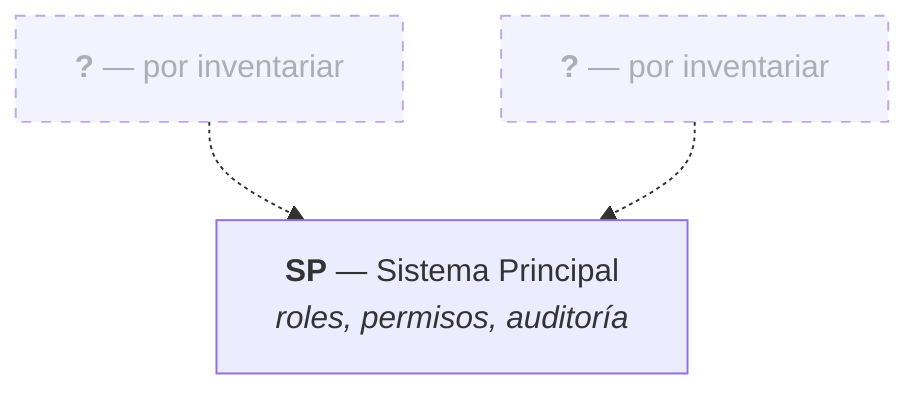

# Mapa Modular del Sistema — NEXUS

| Campo | Valor |
|---|---|
| Proyecto | NEXUS — Renovación de plataforma |
| Empresa | FACTECH GROUP SAS |
| Documento | `modules.md` |
| Versión | 0.9.0 |
| Estado | Borrador |
| Responsable técnico | Bonilla Diaz William Steven |
| Fecha de creación | 20-08-2026 |
| Última actualización | 20-08-2026 |
| Documento superior | `constitution.md` v0.5.0 |
| Documentos relacionados | `architecture.md` v0.4.0, `requirements.md` v0.3.0 |

---

## 1. Propósito

Este documento es la **autoridad única sobre qué módulos y submódulos componen NEXUS**. Define el inventario, la descomposición interna de cada módulo y las dependencias entre ellos.

Es el punto de partida del diseño: antes de especificar un requerimiento hay que saber a qué módulo pertenece, y antes de crear un módulo hay que saber por qué no es un submódulo de otro.

**Reparto de responsabilidades entre documentos:**

| Documento | Es la autoridad sobre |
|---|---|
| `modules.md` (este) | Qué módulos y submódulos existen, y cómo dependen entre sí |
| `requirements.md` | Qué requerimientos existen, su nomenclatura y su estado |
| `architecture.md` | Cómo se estructura internamente un módulo (capas, reglas de dependencia) |

---

## 2. Qué es un módulo y qué es un submódulo

La distinción no es de tamaño, es de **propiedad de los datos**.

| | Módulo | Submódulo |
|---|---|---|
| Define | Un área de negocio con identidad propia | Una agrupación funcional dentro de un módulo |
| Datos | **Es dueño** de sus tablas | Comparte las tablas de su módulo |
| Acceso | Otros módulos lo consumen por interfaz publicada | No es visible desde fuera del módulo |
| Código | `modules/<modulo>/` | Subpaquete dentro del módulo |
| Identificadores | Tiene código propio (`SP`) | **No tiene código propio** |
| Requerimientos | `RF-[MÓDULO]-NNN` | Usa el código de su módulo |

### 2.1 Regla de decisión

> Si una funcionalidad **es dueña de tablas propias** y **otros módulos necesitan consumirla**, es un **módulo**.
> Si opera sobre las tablas de un módulo existente y solo lo usa ese módulo, es un **submódulo**.

### 2.2 Por qué los submódulos no llevan código propio

El Documento Marco define los identificadores como `RF-[MÓDULO]-NNN`. Introducir un nivel más (`RF-SP.ROL-001`) obligaría a enmendarlo y haría los identificadores frágiles: mover una funcionalidad entre submódulos cambiaría su identificador y rompería la trazabilidad.

La numeración es **correlativa dentro del módulo**, sin importar el submódulo. Los submódulos sirven para **organizar** el documento de requerimientos y el código, no para identificar.

### 2.3 Promoción de submódulo a módulo

Un submódulo se promueve a módulo cuando ocurre cualquiera de estas dos cosas:

1. Necesita tablas propias que ningún otro submódulo del módulo usa.
2. Otro módulo necesita consumirlo directamente.

La promoción es una decisión de arquitectura: se registra en `docs/architecture/` con su justificación (Art. XII.4). El submódulo promovido **recibe un código nuevo**; los requerimientos ya escritos conservan el identificador original y se anota la migración en la matriz de trazabilidad.

**No se promueve por tamaño.** Un submódulo grande sigue siendo submódulo si no cumple ninguna de las dos condiciones.

---

## 3. Mapa modular



Las dependencias apuntan **del consumidor al proveedor** y deben ser acíclicas (`architecture.md` §5.3).

---

## 4. Inventario de módulos

!!! warning "Inventario incompleto"

    Solo están registrados los dos módulos que el Documento Marco nombra de forma explícita. **El resto del alcance del producto está por inventariar** (ver §6). Este documento no puede considerarse cerrado hasta que el inventario esté completo.

| Código | Módulo | Paquete Java | Prefijo de permisos | Depende de | Estado |
|---|---|---|---|---|---|
| `SP` | Sistema Principal | `modules/system` | `roles:`, `permissions:`, `audit:`, `memberships:`, `currencies:`, `countries:`, `users:` | — | En diseño |


**Estados:** `Propuesto` · `En diseño` · `En desarrollo` · `Implementado` · `Obsoleto`.

Un módulo `Obsoleto` conserva su fila y su código: sus requerimientos siguen referenciados en la historia del proyecto.

### 4.1 Código de módulo y nombre de paquete

Los ejemplos de `architecture.md` y `security.md` usan el paquete `modules/security` para el trabajo de roles y permisos, mientras que el Documento Marco asigna ese alcance al módulo `SP` (Sistema Principal), cuyo paquete natural es `modules/system`.

Se resolvió el 20-08-2026, antes de redactar el primer requerimiento: el código queda inmutable en cuanto se use en un identificador (§2.1), de modo que no podía postergarse.

| Salida | A favor | En contra |
|---|---|---|
| `SP` → `modules/system` | Conserva la nomenclatura del Documento Marco, ya aprobado | `system` describe peor el contenido real del módulo |
| Renombrar el módulo a `SEG` → `modules/security` | El nombre dice lo que el módulo hace | `SEG` ya se usa como categoría de RNF y como prefijo de las reglas `RN-SEG-…`, lo que genera ambigüedad |

**Decisión: `SP` → `modules/system`.** Conserva la nomenclatura del Documento Marco, que ya está aprobado y usa `RF-SP-001` como ejemplo. Los ejemplos de `architecture.md` y `security.md` que mencionan `modules/security` deben leerse como `modules/system`.

---

## 5. Fichas de módulo

### 5.1 `SP` — Sistema Principal

**Propósito.** Gobierna quién puede hacer qué en el sistema y deja constancia de lo que ocurre. Es el módulo del que dependen todos los demás.

**Alcance.** Catálogo de permisos, definición de roles, contención de privilegios entre roles, usuarios con sus roles y su membresía, credenciales y acceso, catálogos transversales (membresías, monedas y países) y los cuatro registros de auditoría (`architecture.md` §6.6). La auditoría se **consulta** desde aquí; se **escribe** desde cada módulo, en la operación que la origina.

**No incluye.** La definición de qué contenidos exige cada nivel de membresía, que corresponde a los módulos de academia y productos.

| Submódulo | Responsabilidad | Entidades principales |
|---|---|---|
| Roles | Alta, consulta, edición, estado, jerarquía y eliminación lógica | `roles` |
| Permisos | Catálogo de permisos `recurso:acción`. Solo lectura por API; se pueblan por migración | `permissions` |
| Roles y permisos | Asociación y revocación de permisos sobre un rol | `role_permissions` |
| Membresías | Nivel de acceso del consumidor a servicios y contenidos | `memberships` |
| Monedas | Catálogo de monedas | `currencies` |
| Países | Catálogo de países | `countries` |
| Usuarios | Alta, consulta, edición, estado y baja de las personas que acceden | `users` |
| Roles de usuario | Asignación y retiro de roles sobre una persona | `user_roles` |
| Membresía del usuario | Nivel del consumidor, acotado por `RN-SP-013` | `user_memberships` |
| Credenciales y acceso | Inicio y cierre de sesión, refresco con rotación, y gestión de la contraseña | `users`, `refresh_tokens` |
| Auditoría | Consulta de los cuatro registros de auditoría, por separado o desde la vista transversal | `audit_change_log`, `audit_deletion_log`, `audit_error_log`, `audit_security_log` |


**Dependencias.** Ninguna, y ahora en un sentido más fuerte que antes: al absorber los usuarios, sus roles y su acceso, `SP` es **autocontenido**. No necesita que ningún otro módulo exista para funcionar, lo que además elimina el arranque en frío que existía mientras la identidad vivía fuera.

**Diseño detallado.** `security.md` §4 (modelo de autorización y reglas `RN-SEG-…`).

---


### 5.2 Plantilla para un módulo nuevo

```markdown
### `COD` — Nombre del módulo

**Propósito.** [Una frase: qué problema de negocio resuelve.]

**Alcance.** [Qué cubre.]

**No incluye.** [Qué queda deliberadamente fuera y a qué módulo pertenece.]

| Submódulo | Responsabilidad | Entidades principales |
|---|---|---|
| | | |

**Dependencias.** [Módulos que consume, y para qué.]

**Diseño detallado.** [Documento donde se desarrolla.]
```

---

## 6. Alcance por inventariar

Esta sección es el trabajo pendiente para cerrar el diseño modular.

La Épica 2 del documento de historias de usuario (HU08–HU14) define siete roles, y de sus alcances se deducen las áreas de negocio del producto:

| Candidato | Deducido de | Alcance aparente |
|---|---|---|
| Red comercial | HU10, HU11, HU12 | Estructura manager → director → agente y su relación entre personas |
| Comisiones | HU08, HU10, HU12 | FTDs, cálculo y liquidación de comisiones |
| Finanzas | HU09 | Retiros, pagos, balances y egresos |
| Productos y servicios | HU08, HU13 | Catálogo, compras |
| Academia | HU08, HU13, HU14 | Cursos y sesiones en vivo |
| Señales | HU14 | Publicación y consumo de señales |
| Métricas | HU08 | Indicadores y reportes de la plataforma |

!!! warning "Candidatos, no decisiones"

    Son áreas **deducidas de los roles**, no un inventario aprobado. El documento de origen se está entregando por partes: hasta disponer del alcance completo, ni los límites ni los códigos de estos módulos pueden fijarse.

    Los ejemplos del Documento Marco apuntaban a *gestión de activos e inventario* (*"nombre del activo"*, `feature/registrar-activo`). No aparecen en el alcance conocido hasta ahora: queda por confirmar si siguen vigentes o eran material de plantilla.

!!! note "Las historias de usuario son documento de origen"

    El documento de historias usa épicas e identificadores `HU`; el proyecto usa `RF-[MÓDULO]-NNN`. Una historia **no** equivale a un requerimiento funcional: *«quiero ver mi estructura comercial»* son varios `RF`.

    Las historias sirven para **levantar** requerimientos, pero quedan **fuera de la cadena de trazabilidad**, que es `RF` → tripleta → Pull Request → código → prueba (Art. III.1). Las referencias `HU` que aparecen en esta sección son procedencia del candidato, no trazabilidad.

Para cada área de negocio que se incorpore hay que responder:

1. ¿Cuál es su código, corto y estable?
2. ¿De qué tablas es dueña?
3. ¿Qué submódulos la componen?
4. ¿Qué otros módulos necesita consumir, y para qué?
5. ¿Qué queda explícitamente fuera de su alcance?

Las preguntas 2 y 4 son las que determinan si es realmente un módulo (§2.1).

---

## 7. Reglas de dependencia

- Las dependencias entre módulos **DEBEN** ser acíclicas. Si dos módulos se necesitan mutuamente, o son un solo módulo o falta extraer un tercero que ambos consuman.
- Un módulo **NO DEBE** acceder a las tablas ni a los repositorios de otro (`architecture.md` §5.3). La comunicación ocurre por la interfaz que publica la capa `application` del módulo propietario.
- Toda dependencia nueva **DEBE** quedar registrada en el inventario de §4 antes de escribirse en el código.
- Un módulo sin dependientes ni dependencias declaradas es sospechoso: o está mal delimitado, o no pertenece a este sistema.

---

## 8. Cómo se incorpora un módulo

1. Verificar contra §2.1 que es un módulo y no un submódulo de uno existente.
2. Registrar la fila en el inventario de §4.
3. Escribir su ficha en §5, a partir de la plantilla de §5.3.
4. Crear `docs/requirements/<código en minúscula>.md` con la plantilla de requerimientos por módulo.
5. Registrar sus requerimientos en la matriz de `requirements.md`.
6. Crear la carpeta `docs/specs/<código en minúscula>/`, donde vivirá la tripleta de cada requerimiento.

El sitio incorpora el módulo por sí solo: la navegación se genera desde los archivos `.pages` y no requiere tocar `mkdocs.yml`.

El orden importa: el módulo precede al requerimiento, el requerimiento precede a la tripleta, y la tripleta —aprobada en sus tres compuertas— precede al código (Art. I.1, I.6).

---

## 9. Control de cambios

| Versión | Fecha | Cambio | Responsable |
|---|---|---|---|
| 0.1.0 | 20-08-2026 | Creación inicial. Criterios de modularización y fichas de `SP` y `USR`. | Responsable técnico |
| 0.2.0 | 20-08-2026 | El submódulo de auditoría de `SP` pasa de un registro único a los cuatro registros del Art. V.8. | Responsable técnico |
| 0.3.0 | 20-08-2026 | §8 se ajusta a la tripleta `spec` / `plan` / `tasks` y a la navegación automática del sitio. | Responsable técnico |
| 0.4.0 | 20-08-2026 | Se cierra el punto abierto §4.1: el módulo `SP` usa el paquete `modules/system`. | Responsable técnico |
| 0.5.0 | 20-08-2026 | §6 registra las siete áreas candidatas deducidas de la Épica 2 (HU08–HU14) y el conflicto de nomenclatura entre historias de usuario y requerimientos. | Responsable técnico |
| 0.6.0 | 20-08-2026 | Los submódulos de `SP` se ajustan a la guía `guides/001-sp.md`: se separan roles y permisos, y se incorporan membresías, monedas y países. Se retira «Parámetros», cubierto por los catálogos. | Responsable técnico |
| 0.7.0 | 20-08-2026 | Se resuelve la relación entre historias de usuario y requerimientos: las historias son documento de origen y quedan fuera de la trazabilidad. | Responsable técnico |
| 0.8.0 | 20-08-2026 | Se actualizan los prefijos de permisos de `SP` con los catálogos incorporados: membresías, monedas y países. | Responsable técnico |
| 0.9.0 | 21-08-2026 | El módulo `USR` se retira: usuarios, roles de usuario, membresía del usuario y acceso pasan a `SP`, que queda autocontenido. | Responsable técnico |
