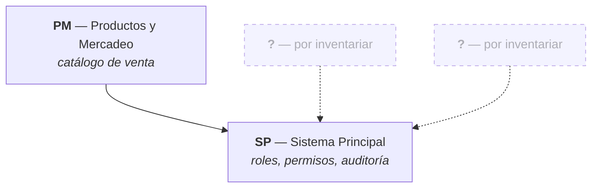

# Mapa Modular del Sistema — NEXUS

| Campo | Valor |
|---|---|
| Proyecto | NEXUS — Renovación de plataforma |
| Empresa | FACTECH GROUP SAS |
| Documento | `modules.md` |
| Versión | 0.17.0 |
| Estado | Borrador |
| Responsable técnico | Bonilla Diaz William Steven |
| Fecha de creación | 20-08-2026 |
| Última actualización | 02-09-2026 |
| Documento superior | `constitution.md` v0.7.0 |
| Documentos relacionados | `architecture.md` v0.17.0, `requirements.md` v0.51.0 |

---

## 1. Propósito

Este documento es la **autoridad única sobre qué módulos y submódulos componen NEXUS**. Define el inventario, la descomposición interna de cada módulo y las dependencias entre ellos.

Es el punto de partida del diseño: antes de especificar un requerimiento hay que saber a qué módulo pertenece, y antes de crear un módulo hay que saber por qué no es un submódulo de otro.

**Reparto de responsabilidades entre documentos:**

| Documento | Es la autoridad sobre |
|---|---|
| `modules.md` (este) | Qué módulos y submódulos existen, y cómo dependen entre sí |
| `requirements.md` | Qué requerimientos existen, su nomenclatura y su estado |
| `architecture.md` | Cómo se estructura internamente un módulo (capas, reglas de dependencia) |

---

## 2. Qué es un módulo y qué es un submódulo

La distinción no es de tamaño, es de **propiedad de los datos**.

| | Módulo | Submódulo |
|---|---|---|
| Define | Un área de negocio con identidad propia | Una agrupación funcional dentro de un módulo |
| Datos | **Es dueño** de sus tablas | Comparte las tablas de su módulo |
| Acceso | Otros módulos lo consumen por interfaz publicada | No es visible desde fuera del módulo |
| Código | `modules/<modulo>/` | Subpaquete dentro del módulo |
| Identificadores | Tiene código propio (`SP`) | **No tiene código propio** |
| Requerimientos | `RF-[MÓDULO]-NNN` | Usa el código de su módulo |

### 2.1 Regla de decisión

> Si una funcionalidad **es dueña de tablas propias** y **otros módulos necesitan consumirla**, es un **módulo**.
> Si opera sobre las tablas de un módulo existente y solo lo usa ese módulo, es un **submódulo**.

### 2.2 Por qué los submódulos no llevan código propio

El Documento Marco define los identificadores como `RF-[MÓDULO]-NNN`. Introducir un nivel más (`RF-SP.ROL-001`) obligaría a enmendarlo y haría los identificadores frágiles: mover una funcionalidad entre submódulos cambiaría su identificador y rompería la trazabilidad.

La numeración es **correlativa dentro del módulo**, sin importar el submódulo. Los submódulos sirven para **organizar** el documento de requerimientos y el código, no para identificar.

### 2.3 Promoción de submódulo a módulo

Un submódulo se promueve a módulo cuando ocurre cualquiera de estas dos cosas:

1. Necesita tablas propias que ningún otro submódulo del módulo usa.
2. Otro módulo necesita consumirlo directamente.

La promoción es una decisión de arquitectura: se registra en `docs/architecture/` con su justificación (Art. XII.4). El submódulo promovido **recibe un código nuevo**; los requerimientos ya escritos conservan el identificador original y se anota la migración en la matriz de trazabilidad.

**No se promueve por tamaño.** Un submódulo grande sigue siendo submódulo si no cumple ninguna de las dos condiciones.

---

## 3. Mapa modular



Las dependencias apuntan **del consumidor al proveedor** y deben ser acíclicas (`architecture.md` §5.3).

---

## 4. Inventario de módulos

!!! warning "Inventario incompleto"

    Están registrados `SP`, que el Documento Marco nombra de forma explícita, y `PM`, incorporado el 26-08-2026 por decisión del responsable del proyecto. **El resto del alcance del producto sigue por inventariar** (ver §6). Este documento no puede considerarse cerrado hasta que el inventario esté completo.

| Código | Módulo | Paquete Java | Prefijo de permisos | Depende de | Estado |
|---|---|---|---|---|---|
| `SP` | Sistema Principal | `modules/system` | `roles:`, `permissions:`, `audit:`, `memberships:`, `currencies:`, `countries:`, `users:` | — | En desarrollo |
| `PM` | Productos y Mercadeo | `modules/products` | `products:` | `SP` | En desarrollo |
| `CM` | Comisiones | `modules/commissions` | `commissions:` | `SP`, `PM` | En desarrollo · **rehecho y construido el 02-09-2026** |


**Estados:** `Propuesto` · `En diseño` · `En desarrollo` · `Implementado` · `Obsoleto`.

Un módulo `Obsoleto` conserva su fila y su código: sus requerimientos siguen referenciados en la historia del proyecto.

### 4.1 Código de módulo y nombre de paquete

Los ejemplos de `architecture.md` y `security.md` usan el paquete `modules/security` para el trabajo de roles y permisos, mientras que el Documento Marco asigna ese alcance al módulo `SP` (Sistema Principal), cuyo paquete natural es `modules/system`.

Se resolvió el 20-08-2026, antes de redactar el primer requerimiento: el código queda inmutable en cuanto se use en un identificador (§2.1), de modo que no podía postergarse.

| Salida | A favor | En contra |
|---|---|---|
| `SP` → `modules/system` | Conserva la nomenclatura del Documento Marco, ya aprobado | `system` describe peor el contenido real del módulo |
| Renombrar el módulo a `SEG` → `modules/security` | El nombre dice lo que el módulo hace | `SEG` ya se usa como categoría de RNF y como prefijo de las reglas `RN-SEG-…`, lo que genera ambigüedad |

**Decisión: `SP` → `modules/system`.** Conserva la nomenclatura del Documento Marco, que ya está aprobado y usa `RF-SP-001` como ejemplo. Los ejemplos de `architecture.md` y `security.md` que mencionan `modules/security` deben leerse como `modules/system`.

---

## 5. Fichas de módulo

### 5.1 `SP` — Sistema Principal

**Propósito.** Gobierna quién puede hacer qué en el sistema y deja constancia de lo que ocurre. Es el módulo del que dependen todos los demás.

**Alcance.** Catálogo de permisos, definición de roles, contención de privilegios entre roles, usuarios con sus roles y su membresía, la estructura de mando de la fuerza comercial, credenciales y acceso, catálogos transversales (membresías, monedas y países) y los cuatro registros de auditoría (`architecture.md` §6.6). La auditoría se **consulta** desde aquí; se **escribe** desde cada módulo, en la operación que la origina.

**No incluye.** La definición de qué contenidos exige cada nivel de membresía, que corresponde a los módulos de academia y productos.

| Submódulo | Responsabilidad | Entidades principales |
|---|---|---|
| Roles | Alta, consulta, edición, estado, jerarquía y eliminación lógica | `roles` |
| Permisos | Catálogo de permisos `recurso:acción`. Solo lectura por API; se pueblan por migración | `permissions` |
| Roles y permisos | Asociación y revocación de permisos sobre un rol | `role_permissions` |
| Membresías | Nivel de acceso del consumidor a servicios y contenidos | `memberships` |
| Monedas | Catálogo de monedas | `currencies` |
| Países | Catálogo de países | `countries` |
| Usuarios | Alta, consulta, edición, estado y baja de las personas que acceden | `users` |
| Roles de usuario | Asignación y retiro de roles sobre una persona | `user_roles` |
| Membresía del usuario | Nivel del consumidor, acotado por `RN-SP-013` | `user_memberships` |
| Estructura comercial | Quién está a cargo de quién dentro de la fuerza comercial, con historial | `user_supervisors` |
| Credenciales y acceso | Inicio y cierre de sesión, refresco con rotación, y gestión de la contraseña | `users`, `refresh_tokens` |
| Auditoría | Consulta de los cuatro registros de auditoría, por separado o desde la vista transversal | `audit_change_log`, `audit_deletion_log`, `audit_error_log`, `audit_security_log` |


**Dependencias.** Ninguna, y ahora en un sentido más fuerte que antes: al absorber los usuarios, sus roles y su acceso, `SP` es **autocontenido**. No necesita que ningún otro módulo exista para funcionar, lo que además elimina el arranque en frío que existía mientras la identidad vivía fuera.

**Diseño detallado.** `security.md` §4 (modelo de autorización y reglas `RN-SEG-…`).

---


### 5.2 `PM` — Productos y Mercadeo

**Propósito.** Es dueño de **lo que la plataforma vende**: qué productos existen, de qué tipo son, cuánto cuestan y a quién se le ofrecen.

**Alcance.** El catálogo de productos y su gobierno —alta, consulta, corrección, activación y retiro— en **dos tipos que no se mezclan**: el **upgrade de membresía**, que da derecho a pasar al nivel que declara, y el **bot del sistema**, que da derecho a una prestación. Publica además la **oferta propia**: qué puede comprar quien mira, que en los upgrades depende de su nivel actual.

**No incluye.** **La compra y el cobro** —orden, estado de pago y pasarela—, que corresponden al área de Finanzas. Tampoco la **aplicación** del upgrade sobre la persona: cambiar su nivel es escribir en `user_memberships`, tabla de `SP` (`RF-SP-032`). Ni el **contenido** de lo que se vende —cursos y sesiones son de Academia; señales, de Señales—, ni la **atribución de la venta**, que es de Comisiones. Las **promociones y campañas** caben en su nombre y no se han registrado todavía.

| Submódulo | Responsabilidad | Entidades principales |
|---|---|---|
| Productos | Alta, consulta, edición, estado y retiro del catálogo | `products` |
| Oferta | Qué puede comprar quien mira, que no es el catálogo completo | `products`, y la membresía vigente que `SP` publique |

**Dependencias.** `SP`, y solo `SP`: valida contra sus **membresías** el destino de un upgrade, contra sus **monedas** el precio, y necesita la **membresía vigente del actor** para decidir la oferta. La dependencia es acíclica, porque `SP` no consume a nadie.

!!! success "Cómo la consume — D-25, cerrada el 26-08-2026"

    **El módulo dueño del dato publica interfaces de aplicación de solo lectura, y el consumidor las importa.** Es la norma para cualquier par de módulos, no solo para estos dos: la dependencia sigue apuntando del consumidor al proveedor, y `SP` no se entera de que `PM` existe. Se descartó la inversión de dependencia, que aquí haría que el módulo raíz importara una interfaz del que depende de él — el ciclo de §7 disfrazado.

    Una interfaz por lectura y no una fachada, modelos de lectura y nunca entidades, la ausencia como valor vacío, y una regla de **ArchUnit** que impide importar repositorios o entidades ajenos. El desarrollo, en [`architecture.md` §15.2](architecture.md#152-como-consume-un-modulo-los-datos-de-otro-cierre-de-d-25).

**Diseño detallado.** [`requirements/pm.md`](requirements/pm.md).

!!! info "Por qué `PM` es un módulo y no un submódulo de `SP`"

    Cumple las dos condiciones de §2.1. **Es dueño de una tabla propia**, `products`, que `SP` no necesita para autorizar ni para nada más. Y **otros módulos van a consumirlo**: Finanzas para cobrar un producto, Comisiones para saber sobre qué importe se comisiona, Academia para saber qué nivel da acceso a qué.

    La dirección de la dependencia lo confirma: `PM` necesita a `SP` y `SP` no necesita a `PM`. Si fuera al revés —si `SP` tuviera que consultar el catálogo para autorizar— serían el mismo módulo o faltaría extraer un tercero.

#### 5.2.1 El código `PM` y el paquete `modules/products`

Mismo desajuste que §4.1 resolvió para `SP`, y por el mismo motivo: **el código nombra el área de negocio y el paquete nombra su contenido**. El área es «Productos y Mercadeo» —así la nombró el responsable del proyecto y así admite crecer hacia promociones y campañas—, mientras que lo que hoy contiene, y lo que seguirá siendo su núcleo, son productos.

| Salida | A favor | En contra |
|---|---|---|
| `PM` → `modules/products` | El código admite el mercadeo sin reabrirse; el paquete dice qué hay dentro | Código y paquete no coinciden, y hay que saberlo |
| `PR` → `modules/products` | Coinciden | Si el mercadeo crece, el código se queda corto **y no se puede cambiar** (§2.1) |
| `PM` → `modules/marketing` | Coinciden | El paquete describe la parte que **todavía no existe** e ignora la que sí |

**Decisión: `PM` → `modules/products`.** El código es lo irreversible y debe cubrir el área completa; el paquete es renombrable y debe describir lo que contiene.

---

### 5.3 `CM` — Comisiones

**Propósito.** Es dueño de **cuánto se le paga a quien vende**: qué porcentaje gana cada rol de tipo vendedor por cada producto, y qué excepciones tiene una persona concreta.

**Alcance.** El **catálogo de tarifas de comisión** y su gobierno: alta, consulta, corrección y retiro. Una tarifa asocia un **rol de tipo `VENDEDOR`** con un **porcentaje** y una **vigencia**, opcionalmente acotada a un **producto** y opcionalmente acotada a una **persona**. Publica además la **resolución**: dada una persona, un producto y una fecha, qué porcentaje le corresponde.

**No incluye.** **El cálculo y la liquidación**, que son la otra mitad del área de §6 y **no se pueden construir todavía**: no existe ninguna tabla de ventas a la que aplicar un porcentaje. Tampoco el **pago** de lo liquidado, que es de Finanzas, ni los **FTDs**. Este módulo nace deliberadamente con la mitad configurable del área, por el mismo camino que `PM`: el catálogo existió antes que la compra.

| Submódulo | Responsabilidad | Entidades principales |
|---|---|---|
| Tasas | El catálogo por rol y las excepciones por persona | `commission_rates`, `user_commission_rates` |
| Asociación | Qué tasa rige sobre qué producto | `product_commission_rates` |
| Resolución | Qué porcentaje le corresponde a una persona por un producto **en una fecha** | Las tres, y el rol vigente que `SP` publique |

**Dependencias.** `SP` y `PM`, y es el **primer módulo que depende de dos**. De `SP` necesita el **rol** —para exigir que sea de tipo `VENDEDOR`— y la **persona** de una tarifa especial; de `PM`, el **producto** al que la tarifa se acota. La dependencia sigue siendo acíclica: `CM` → `PM` → `SP`, y ninguno de los dos consume a `CM`.

!!! success "Cómo los consume — la norma de D-25"

    Sin excepción ni caso nuevo: **cada módulo dueño del dato publica interfaces de aplicación de solo lectura, y `CM` las importa** ([`architecture.md` §15.2](architecture.md#152-como-consume-un-modulo-los-datos-de-otro-cierre-de-d-25)). `PM` tendrá que publicar la suya —hoy no la tiene, porque nadie lo consumía todavía—, y esa ampliación pertenece a los requerimientos de `CM` que la necesiten, no a un requerimiento nuevo de `PM`: es el mismo reparto que se decidió al cerrar D-25.

    Las claves foráneas a `roles`, `users` y `products` **sí** se declaran, por lo mismo que `PM` las declara hacia `SP`: la frontera que §7 defiende es la del **código**, y una clave foránea es integridad declarada en el motor (Art. V.6).

**Diseño detallado.** [`requirements/cm.md`](requirements/cm.md).

!!! info "Por qué `CM` es un módulo y no un submódulo de `PM`"

    Cumple las dos condiciones de §2.1. **Es dueño de tres tablas propias** —`commission_rates`, `user_commission_rates` y `product_commission_rates`— que `PM` no necesita para nada: el catálogo se publica igual exista o no una tasa. Y **otros van a consumirlo**: la liquidación, cuando exista, y Finanzas para pagar lo liquidado.

    **Se consideró y se descartó que fuera un submódulo de `PM`**, que es como se pidió. La razón para no hacerlo es de §2.1 y no de gusto: la comisión no opera sobre `products`, opera sobre `roles` y `users`, que son de `SP`. Un submódulo de `PM` cuyas dos claves foráneas principales apuntan a `SP` no está en su módulo. Pesó además que **el identificador es irreversible** (§2.1): `RF-PM-008` se habría quedado en `PM` para siempre el día que Comisiones creciera hacia el cálculo y la liquidación, que es lo que §6 ya anticipa.

!!! warning "El código se fija sabiendo lo que §6 advierte"

    Esta misma sección advierte que los códigos de los módulos candidatos **no deberían fijarse hasta conocer el alcance completo** del producto. Se procede igualmente **por decisión del responsable del proyecto**, como ya se hizo con `PM` el 26-08-2026, y queda escrito que se procedió sabiéndolo. El riesgo concreto que se asume: si el área acaba llamándose de otro modo —«Ventas», «Compensación»— el código `CM` no se cambia jamás.

#### 5.3.1 Lo que este módulo le impone a `SP`

**Una persona no puede tener dos roles de tipo `VENDEDOR`**, por decisión del responsable del proyecto. No es una regla de `CM` aunque nazca por él: gobierna la **asignación de roles**, que es `RF-SP-030`, y por eso se registra como `RN-SP-025` en [`requirements/sp.md`](requirements/sp.md) y no aquí.

Nace por una pregunta que este módulo no puede responder solo: si alguien tuviera dos roles vendedores con tarifas distintas y ninguna tarifa propia, **no habría forma no arbitraria de elegir**. Las tres salidas eran adivinar —el porcentaje mayor—, exigir tarifa propia, o impedir el caso. Se eligió impedirlo, que es la única que no deja la ambigüedad viva en el sistema.

**No se puede declarar en el esquema.** Un `CHECK` no consulta otra tabla y un índice único no puede unir `user_roles` con `roles` para mirar `role_type`. La regla vive en el caso de uso de `RF-SP-030`, y necesita el mismo bloqueo pesimista que `RN-SP-018` —cuya versión sin bloqueo no se sostuvo bajo concurrencia y se corrigió el 26-08-2026—, porque dos asignaciones simultáneas la burlarían igual.

### 5.4 Plantilla para un módulo nuevo

```markdown
### `COD` — Nombre del módulo

**Propósito.** [Una frase: qué problema de negocio resuelve.]

**Alcance.** [Qué cubre.]

**No incluye.** [Qué queda deliberadamente fuera y a qué módulo pertenece.]

| Submódulo | Responsabilidad | Entidades principales |
|---|---|---|
| | | |

**Dependencias.** [Módulos que consume, y para qué.]

**Diseño detallado.** [Documento donde se desarrolla.]
```

---

## 6. Alcance por inventariar

Esta sección es el trabajo pendiente para cerrar el diseño modular.

La Épica 2 del documento de historias de usuario (HU08–HU14) define siete roles, y de sus alcances se deducen las áreas de negocio del producto:

| Candidato | Deducido de | Alcance aparente |
|---|---|---|
| Red comercial | HU10, HU11, HU12 | Estructura manager → director → agente y su relación entre personas. **Su primera pieza ya está construida dentro de `SP`** — ver la nota que sigue a esta tabla |
| ~~Comisiones~~ | HU08, HU10, HU12 | **Incorporado el 28-08-2026 como `CM`** (§5.3), con las **tarifas**: qué porcentaje gana cada rol vendedor por cada producto, y las excepciones por persona. El **cálculo, la liquidación y los FTDs** siguen fuera, y no por reparto sino porque **no hay sobre qué calcular**: ninguna tabla de ventas existe todavía |
| ~~Comisiones~~ | HU08, HU10, HU12 | **Incorporado el 28-08-2026 como `CM`** (§5.3), con las **tarifas**: qué porcentaje gana cada rol vendedor por cada producto, y las excepciones por persona. El **cálculo, la liquidación y los FTDs** siguen fuera, y no por reparto sino porque **no hay sobre qué calcular**: ninguna tabla de ventas existe todavía |
| Finanzas | HU09 | Retiros, pagos, balances y egresos |
| Academia | HU08, HU13, HU14 | Cursos y sesiones en vivo |
| Señales | HU14 | Publicación y consumo de señales |
| Métricas | HU08 | Indicadores y reportes de la plataforma |

!!! warning "Candidatos, no decisiones"

    Son áreas **deducidas de los roles**, no un inventario aprobado. El documento de origen se está entregando por partes: hasta disponer del alcance completo, ni los límites ni los códigos de estos módulos pueden fijarse.

    Los ejemplos del Documento Marco apuntaban a *gestión de activos e inventario* (*"nombre del activo"*, `feature/registrar-activo`). No aparecen en el alcance conocido hasta ahora: queda por confirmar si siguen vigentes o eran material de plantilla.

!!! info "La red comercial empieza dentro de `SP`, no como módulo propio"

    El 22-08-2026 se registró la relación **persona → persona** de la fuerza comercial: quién está a cargo de quién. Vive en el submódulo «Estructura comercial» de `SP` (§5.1), sobre la tabla `user_supervisors`, con los requerimientos `RF-SP-041` y `RF-SP-042`.

    **Por qué no se creó `RC` en ese momento.** Esta misma sección advierte que los códigos de los módulos candidatos no pueden fijarse hasta conocer el alcance completo, y un código, una vez usado en un identificador, no se cambia jamás (§2.1). Crear el módulo para alojar una sola relación habría fijado su código y su límite antes de saber qué más contiene.

    **Cuándo se promueve** (§2.3). En cuanto se cumpla cualquiera de las dos condiciones, que aquí se anticipan con nombre propio:

    1. Aparece una tabla de red comercial que `SP` no necesita para autorizar —territorios, cuotas, jerarquías paralelas—.
    2. Otro módulo, y **Comisiones es el candidato inmediato**, necesita consumir la estructura directamente.

    La promoción se llevará `user_supervisors` y recibirá un código nuevo; `RF-SP-041` y `RF-SP-042` **conservan su identificador**, y la migración se anota en la matriz de trazabilidad (§2.3).

!!! note "Las historias de usuario son documento de origen"

    El documento de historias usa épicas e identificadores `HU`; el proyecto usa `RF-[MÓDULO]-NNN`. Una historia **no** equivale a un requerimiento funcional: *«quiero ver mi estructura comercial»* son varios `RF`.

    Las historias sirven para **levantar** requerimientos, pero quedan **fuera de la cadena de trazabilidad**, que es `RF` → tripleta → Pull Request → código → prueba (Art. III.1). Las referencias `HU` que aparecen en esta sección son procedencia del candidato, no trazabilidad.

Para cada área de negocio que se incorpore hay que responder:

1. ¿Cuál es su código, corto y estable?
2. ¿De qué tablas es dueña?
3. ¿Qué submódulos la componen?
4. ¿Qué otros módulos necesita consumir, y para qué?
5. ¿Qué queda explícitamente fuera de su alcance?

Las preguntas 2 y 4 son las que determinan si es realmente un módulo (§2.1).

---

## 7. Reglas de dependencia

- Las dependencias entre módulos **DEBEN** ser acíclicas. Si dos módulos se necesitan mutuamente, o son un solo módulo o falta extraer un tercero que ambos consuman.
- Un módulo **NO DEBE** acceder a las tablas ni a los repositorios de otro (`architecture.md` §5.3). La comunicación ocurre por la interfaz que publica la capa `application` del módulo propietario.
- Toda dependencia nueva **DEBE** quedar registrada en el inventario de §4 antes de escribirse en el código.
- Un módulo sin dependientes ni dependencias declaradas es sospechoso: o está mal delimitado, o no pertenece a este sistema.

---

## 8. Cómo se incorpora un módulo

1. Verificar contra §2.1 que es un módulo y no un submódulo de uno existente.
2. Registrar la fila en el inventario de §4.
3. Escribir su ficha en §5, a partir de la plantilla de §5.3.
4. Crear `docs/requirements/<código en minúscula>.md` con la plantilla de requerimientos por módulo.
5. Registrar sus requerimientos en la matriz de `requirements.md`.
6. Crear la carpeta `docs/specs/<código en minúscula>/`, donde vivirá la tripleta de cada requerimiento.

El sitio incorpora el módulo por sí solo: la navegación se genera desde los archivos `.pages` y no requiere tocar `mkdocs.yml`.

El orden importa: el módulo precede al requerimiento, el requerimiento precede a la tripleta, y la tripleta —aprobada en sus tres compuertas— precede al código (Art. I.1, I.6).

---

## 9. Control de cambios

| Versión | Fecha | Cambio | Responsable |
|---|---|---|---|
| 0.1.0 | 20-08-2026 | Creación inicial. Criterios de modularización y fichas de `SP` y `USR`. | Responsable técnico |
| 0.2.0 | 20-08-2026 | El submódulo de auditoría de `SP` pasa de un registro único a los cuatro registros del Art. V.8. | Responsable técnico |
| 0.3.0 | 20-08-2026 | §8 se ajusta a la tripleta `spec` / `plan` / `tasks` y a la navegación automática del sitio. | Responsable técnico |
| 0.4.0 | 20-08-2026 | Se cierra el punto abierto §4.1: el módulo `SP` usa el paquete `modules/system`. | Responsable técnico |
| 0.5.0 | 20-08-2026 | §6 registra las siete áreas candidatas deducidas de la Épica 2 (HU08–HU14) y el conflicto de nomenclatura entre historias de usuario y requerimientos. | Responsable técnico |
| 0.6.0 | 20-08-2026 | Los submódulos de `SP` se ajustan a la guía `guides/001-sp.md`: se separan roles y permisos, y se incorporan membresías, monedas y países. Se retira «Parámetros», cubierto por los catálogos. | Responsable técnico |
| 0.7.0 | 20-08-2026 | Se resuelve la relación entre historias de usuario y requerimientos: las historias son documento de origen y quedan fuera de la trazabilidad. | Responsable técnico |
| 0.8.0 | 20-08-2026 | Se actualizan los prefijos de permisos de `SP` con los catálogos incorporados: membresías, monedas y países. | Responsable técnico |
| 0.9.0 | 21-08-2026 | El módulo `USR` se retira: usuarios, roles de usuario, membresía del usuario y acceso pasan a `SP`, que queda autocontenido. | Responsable técnico |
| 0.10.0 | 22-08-2026 | Submódulo nuevo en `SP`: «Estructura comercial», dueño de `user_supervisors`. §6 deja escrito por qué la red comercial empieza dentro de `SP` en lugar de estrenar el código `RC` —los códigos de los candidatos no pueden fijarse hasta conocer el alcance, y no se cambian jamás— y con qué dos condiciones se promueve, siendo Comisiones el consumidor que las disparará. | Responsable técnico |
| 0.11.0 | 26-08-2026 | **`SP` pasa de `En diseño` a `En desarrollo`.** El estado llevaba sin tocarse desde el 20-08-2026, cuando el módulo era exactamente eso: un diseño. Hoy sus cuarenta y dos requerimientos tienen tripleta aprobada y endpoint funcionando, veintinueve migraciones aplicadas y una suite de 137 pruebas unitarias y 595 de integración en verde. **No pasa a `Implementado`**, y la distinción importa: ese estado exige que sus requerimientos lo estén, y ninguno lo está mientras no haya Pull Request aprobado e integrado (Art. XVI). El detalle, requerimiento a requerimiento, en [`requirements.md` §4 y §5](requirements.md#4-matriz-de-trazabilidad). | Responsable técnico |
| 0.12.0 | 26-08-2026 | **Se incorpora el módulo `PM` — Productos y Mercadeo**, el segundo del sistema y el primero que depende de otro. Es dueño de `products` y cumple las dos condiciones de §2.1: tabla propia que `SP` no necesita, y consumidores previsibles —Finanzas para cobrar, Comisiones para saber sobre qué importe se comisiona, Academia para saber qué nivel da acceso a qué—. Trae **dos tipos de producto que no se mezclan**: el **upgrade de membresía**, que da derecho a pasar al nivel que declara, y el **servicio del sistema**. §5.2.1 fija el desajuste entre código y paquete —`PM` → `modules/products`— por el mismo criterio que §4.1 aplicó a `SP`: el código nombra el área de negocio y es irreversible, el paquete nombra su contenido y es renombrable. **Lo que el módulo NO hace queda escrito**: no cobra, no entrega y **no aplica el upgrade sobre la persona**, porque `user_memberships` es de `SP` y §7 prohíbe que otro módulo la escriba. De ahí sale **D-25**: `SP` no publica hoy ninguna interfaz de aplicación para las tres lecturas que `PM` necesita —una membresía y su nivel, una moneda y sus decimales, la membresía vigente de alguien—, de modo que la dependencia está declarada y **no es consumible todavía**. §6 marca el candidato «Productos y servicios» como incorporado en su mitad de catálogo. Se procede pese a la advertencia de esa misma sección sobre fijar códigos antes de conocer el alcance completo, por decisión del responsable del proyecto, y queda escrito que se procedió sabiéndolo. | Responsable técnico |
| 0.13.0 | 26-08-2026 | **D-25 cerrada**, y la ficha de `PM` deja de declarar su dependencia como no consumible. La respuesta vale para cualquier par de módulos y vive en `architecture.md` §15.2: **el dueño del dato publica interfaces de aplicación de solo lectura y el consumidor las importa**, una por lectura, devolviendo modelos de lectura y nunca entidades, con la ausencia como valor vacío y una regla de ArchUnit que impide importar repositorios o entidades ajenos. Es la primera vez que §7 —«un módulo NO DEBE acceder a las tablas ni a los repositorios de otro»— dice también **por dónde sí**. | Responsable del proyecto |
| 0.14.0 | 27-08-2026 | **`PM` pasa de `En diseño` a `En desarrollo`**: su primer requerimiento está implementado, con tabla propia, permisos sembrados y endpoint funcionando. Con él, la norma de §15.2 de `architecture.md` deja de ser papel: `SP` publica sus dos primeras interfaces hacia otro módulo y una regla de ArchUnit impide que `PM` importe nada de su dominio. | Responsable técnico |
| 0.15.0 | 28-08-2026 | **Se incorpora el módulo `CM` — Comisiones**, el tercero del sistema y el **primero que depende de dos**: `SP` le da el rol y la persona, `PM` el producto. La dependencia sigue siendo acíclica —`CM` → `PM` → `SP`— y la norma de consumo es la de D-25 sin excepción, con una consecuencia declarada: **`PM` tendrá que publicar una interfaz de lectura de productos que hoy no tiene**, y esa ampliación pertenece a los requerimientos de `CM` que la necesiten. Nace con **las tarifas y no con el cálculo**: el cálculo y la liquidación no se aplazan por reparto sino porque **no hay sobre qué calcular** mientras no exista una tabla de ventas — el mismo camino que siguió `PM`, cuyo catálogo existió antes que la compra. **Se pidió como submódulo de `PM` y se decidió que no**, por §2.1: la comisión no opera sobre `products`, opera sobre `roles` y `users`; un submódulo de `PM` con sus dos claves foráneas principales apuntando a `SP` no está en su módulo, y el identificador es irreversible. El código se fija **sabiendo lo que §6 advierte**, igual que con `PM`. Queda además una imposición sobre `SP` que se registra allí y no aquí: **una persona no puede tener dos roles de tipo `VENDEDOR`** (`RN-SP-025`), porque con dos tarifas distintas y ninguna propia no habría forma no arbitraria de elegir. | Responsable del proyecto |
| 0.16.0 | 01-09-2026 | **`CM` se rehace**, por decisión del responsable del proyecto, y su ficha §5.3 lo recoge: donde había **una** tabla ahora hay **tres** —el catálogo por rol, la excepción por persona y la asociación con el producto— y el módulo gana un submódulo, **Asociación**, que es lo único que pone una tasa en vigor. **El cambio invalida la implementación**: los cinco requerimientos están construidos desde el 28-08-2026 con 45 pruebas, y la forma de `commission_rates` cambia. El detalle, en [`requirements/cm.md`](requirements/cm.md) v0.4.0. | Responsable del proyecto |
| 0.17.0 | 02-09-2026 | **`CM` pasa de rediseñado a construido**, y su ficha §5.3 lo recoge: es dueño de **tres tablas** —el catálogo por rol, la excepción por persona y la asociación con el producto— donde el 01-09-2026 tenía una diseñada y dos por escribir. Con `V48` el módulo tiene sus **ocho requerimientos con endpoint funcionando** y **75 pruebas** propias. **La frontera de D-25 se estrenó en su forma más exigente y aguantó**: `CM` es el primer módulo que depende de dos, y al rehacerlo consume `RoleCatalog`, `UserCatalog`, `SellerRoleCatalog` y `ProductCatalog` sin importar una sola entidad ajena — mientras sus consultas siguen uniendo `roles`, `users` y `products` en la misma sentencia, que es lo que impide las `N+1` y **no rompe la frontera**, porque lo que §7 defiende es la del código y no la del motor. El detalle, en [`requirements/cm.md`](requirements/cm.md) v0.5.0. | Responsable técnico |
