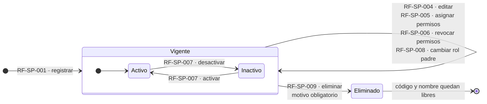
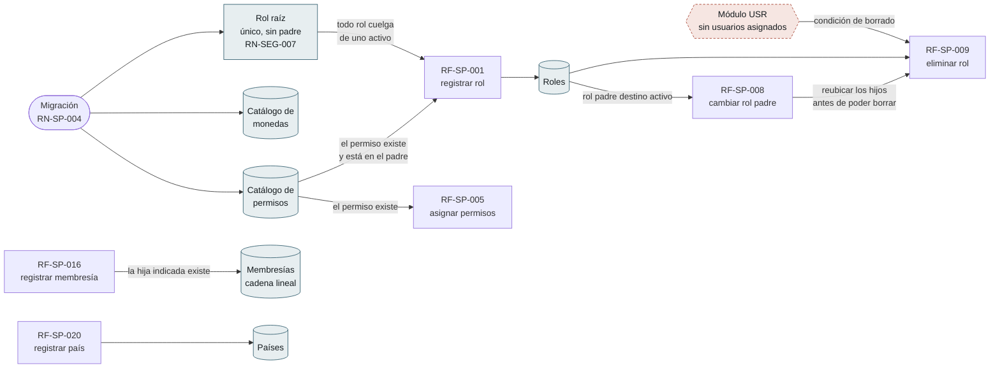
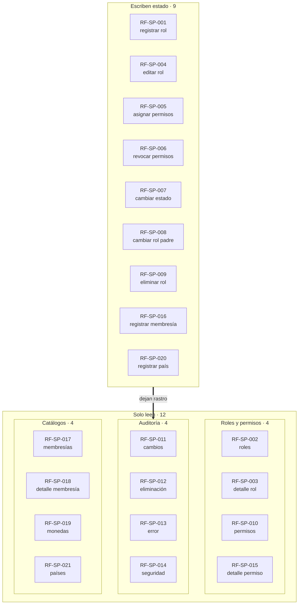
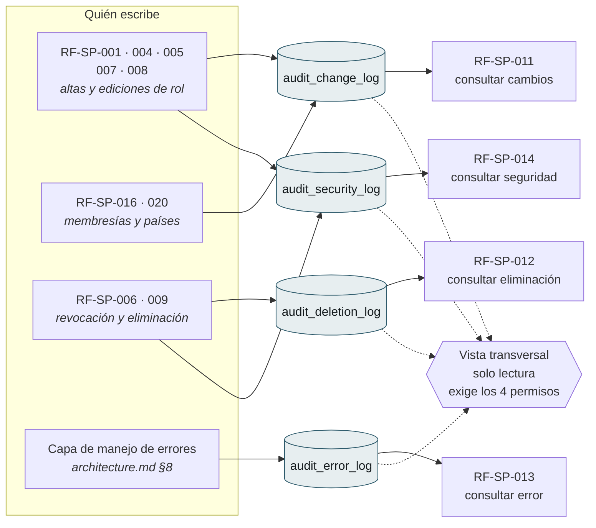
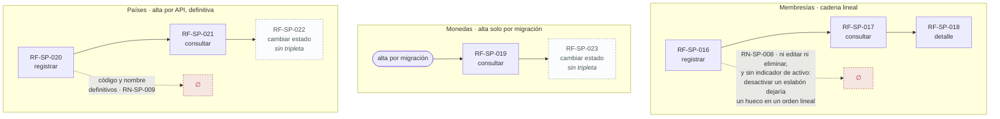

# Flujos del Módulo — `SP` Sistema Principal

| Campo | Valor |
|---|---|
| Módulo | `SP` — Sistema Principal |
| Versión | 0.1.0 |
| Estado | **Borrador** |
| Responsable | Bonilla Diaz William Steven |
| Fecha de creación | 21-08-2026 |
| Última actualización | 21-08-2026 |

!!! info "Qué va en este documento"

    La vista de conjunto de los requerimientos de `SP`: cómo se encadenan entre sí, qué debe existir antes de qué, y qué deja cada operación en la auditoría.

    Se dibujan los **21 que tienen spec aprobada**. `RF-SP-022` y `RF-SP-023` —cambiar el estado de un país y de una moneda— están registrados sin tripleta y aparecen marcados como pendientes donde corresponde.

    No define comportamiento. Todo lo que aquí se dibuja está declarado en las precondiciones y postcondiciones de las tripletas de `docs/specs/sp/`; este documento solo lo hace visible. Ante cualquier discrepancia, **manda la spec**.

    El flujo *técnico* de una petición —controlador, servicio, repositorio— está en [`architecture.md` §8](../architecture.md), y no se repite aquí.

---

## 1. Ciclo de vida del rol

Siete de los veintiún requerimientos escriben sobre la misma entidad. El rol nace activo (`RF-SP-001`) y desde ahí solo hay dos caminos: cambiar de estado o desaparecer.

**Lo que el diagrama no puede dibujar y hay que leer en las specs:**

- Las cuatro mutaciones del bucle exigen las mismas tres condiciones: el rol **no está eliminado**, **no es de sistema** y **el actor no lo porta**. Ninguna distingue entre activo e inactivo: un rol inactivo se sigue editando.
- `RF-SP-007` desactivar **no** revoca asignaciones. El rol deja de conceder permisos de inmediato, pero el vínculo con los usuarios se conserva; reactivarlo lo restituye entero.
- `RF-SP-009` exige además **sin hijos vigentes ni usuarios asignados**.
- El **rol raíz** queda fuera de tres operaciones: no cambia de estado (`RF-SP-007` `EX-001`), no cambia de padre (`RF-SP-008` `EX-003`) y no se elimina (`RF-SP-009` `EX-004`). Un rol raíz inactivo dejaría al sistema sin su última vía de administración.
- Un **rol de sistema** no tiene ninguna transición saliente: no se edita, no cambia de estado y no se elimina. Nace por migración y permanece.

---

## 2. Qué debe existir antes de qué

Las precondiciones de las 21 specs forman un orden de dependencias. Este es el mapa de lo que hay que tener poblado antes de poder ejecutar cada operación.

El encadenamiento `RF-SP-008 → RF-SP-009` es el único no evidente: como no se elimina un rol con hijos vigentes, borrar un nodo intermedio de la jerarquía obliga a **reubicar antes** cada hijo con `RF-SP-008`. Ninguna de las dos specs lo dice; se deduce cruzándolas.

---

## 3. Las 21 operaciones, por naturaleza

**Nueve escriben y doce solo leen** —estas últimas con la misma postcondición literal: «ninguna, la consulta no altera el estado del sistema»—.

La proporción no es casual: `SP` es un módulo de administración, y la mitad de su superficie existe para poder responder qué pasó. El bloque de auditoría es el único que se alimenta de todos los demás.

---

## 4. Auditoría transversal

Las cuatro tablas de [`architecture.md` §6.6](../architecture.md) se escriben por caminos distintos y se consultan por requerimientos distintos. Este es el cruce completo.

Tres asimetrías que el cruce deja a la vista:

| Observación | Estado |
|---|---|
| `audit_error_log` **no tiene escritor declarado en ninguna spec de `SP`**, pero `RF-SP-013` lo consulta. Su única fuente es la capa transversal de errores. | Coherente con `architecture.md` §6.6.3, pero ninguna spec lo enuncia. |
| `RF-SP-016` y `RF-SP-020` escriben en cambios pero **no** en seguridad; las siete operaciones sobre roles escriben en ambas. | Deliberado —membresías y países no son control de acceso—, aunque no está dicho en ningún sitio. |
| `RF-SP-006` escribe en eliminación **sin motivo**; `RF-SP-009` lo escribe **con motivo obligatorio**. | Declarado en ambas specs. Es la excepción a «todo borrado lleva motivo». |

---

## 5. Los submódulos de catálogo

Membresías, monedas y países no comparten forma. Cada uno decidió distinto sobre su ciclo de vida, y esas decisiones solo se ven al ponerlos uno al lado del otro.

- **Monedas** no tiene alta por API y es deliberado: `RF-SP-019` §2 lo argumenta —el catálogo existe desde el principio para que sumar una moneda sea insertar una fila, no migrar cada tabla financiera—. Lo único modificable es su estado (`RN-SP-010`), y la moneda por defecto no puede desactivarse.
- **Países** sí se dan de alta por API, a medida que la plataforma llega a ellos, y el catálogo no se siembra con la lista internacional completa. El código y el nombre son definitivos; el estado es la salida para un alta equivocada (`RN-SP-009`).
- **Membresías** es la única de las tres **sin ninguna salida**: ni edición, ni reubicación, ni baja, ni indicador de activo. `RN-SP-008` lo justifica de forma explícita —desactivar un eslabón dejaría un hueco en un orden lineal—, así que la inmutabilidad es deliberada y está escrita.

Los dos catálogos que admiten cambio de estado lo hacen con requerimientos que **todavía no tienen tripleta**: `RF-SP-022` para países y `RF-SP-023` para monedas.

---

## 6. Qué queda por resolver

| # | Punto | Dónde se resuelve |
|---|---|---|
| 1 | `RF-SP-022` y `RF-SP-023` están registrados pero no tienen tripleta: hasta que la tengan, ningún flujo describe cómo se cambia el estado de un país o de una moneda | `specs/sp/022-…` y `specs/sp/023-…` |
| 2 | El encadenamiento `RF-SP-008 → RF-SP-009` para borrar nodos intermedios no está dicho en ninguna de las dos specs | `RF-SP-009` §13 casos límite |
| 3 | `audit_error_log` sin escritor declarado del lado de `SP` | `RF-SP-013` §2 contexto |
| 4 | La excepción de `RF-SP-006` —eliminación sin motivo— no figura junto a la regla general | `architecture.md` §6.6.3 |
| 5 | Los roles de sistema quedan fuera de `RF-SP-004` a `RF-SP-009`: no tienen ninguna operación de mantenimiento | `security.md` §4.3 |

---

## 7. Control de cambios

| Versión | Fecha | Cambio | Responsable |
|---|---|---|---|
| 0.1.0 | 21-08-2026 | Creación inicial. Cinco diagramas derivados de las precondiciones y postcondiciones de las 21 tripletas de `SP`, y cinco puntos abiertos que el cruce deja a la vista. | Responsable técnico |
