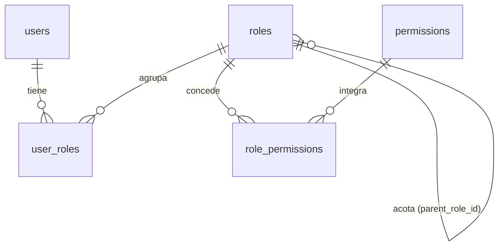
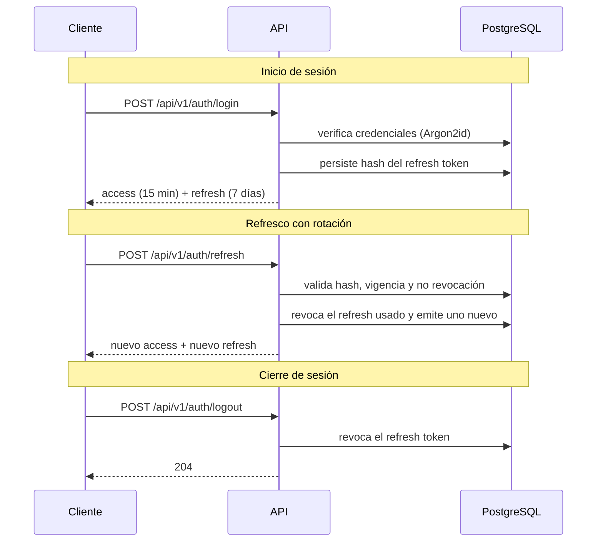

# Modelo de Seguridad — NEXUS

| Campo | Valor |
|---|---|
| Proyecto | NEXUS — Renovación de plataforma |
| Empresa | FACTECH GROUP SAS |
| Documento | `security.md` |
| Versión | 0.10.0 |
| Estado | Borrador |
| Responsable técnico | Bonilla Diaz William Steven |
| Fecha de creación | 19-08-2026 |
| Última actualización | 21-08-2026 |
| Documento superior | `constitution.md` v0.5.0 |
| Documento relacionado | `architecture.md` v0.4.0 |

---

## 1. Propósito y alcance

Este documento define **quién es quién** en NEXUS y **qué puede hacer cada quien**: el modelo de identidad, el modelo de autorización, el mecanismo de autenticación y los controles de protección de datos.

Desarrolla el Artículo IV de la constitución y resuelve la decisión D-08 registrada en `architecture.md` §16.

**Fuera de alcance:** la estructura de capas y el flujo de petición (`architecture.md`), y la especificación funcional del módulo de usuarios, que se documentará en `docs/requirements/`.

---

## 2. Principios rectores

1. **Denegar por defecto.** Todo lo que no está explícitamente permitido, está prohibido (Art. IV.1).
2. **Mínimo privilegio.** Cada actor recibe únicamente los permisos que su función exige (Art. IV.2).
3. **Nadie puede otorgar lo que no tiene.** Ningún actor puede crear un rol, ni asignar un permiso, que exceda sus propios privilegios.
4. **Todo acceso relevante deja rastro.** Autenticación, denegación y cambios de privilegio se auditan (Art. IV.7).
5. **La seguridad no depende del cliente.** Toda validación de autorización ocurre en el backend. Lo que el frontend oculte o muestre es una decisión de usabilidad, nunca un control de seguridad.

---

## 3. Modelo de identidad

### 3.1 Usuario

Un usuario es la representación de una persona que accede al sistema. Los procesos automáticos, cuando existan, usarán un tipo de identidad distinto que deberá especificarse antes de su implementación.

**Estados del usuario:**

| Estado | Significado | ¿Puede autenticarse? |
|---|---|---|
| `ACTIVO` | Operativo | Sí |
| `INACTIVO` | Deshabilitado administrativamente | No |
| `BLOQUEADO` | Bloqueado por intentos fallidos | No, hasta que expire el bloqueo o un administrador lo libere |
| `PENDIENTE` | Creado pero sin activar su credencial | No |

Un usuario **NO DEBE** eliminarse físicamente: se desactiva (Art. V.10). Eliminar el registro rompería la trazabilidad de todo lo que esa persona hizo: los cuatro registros de auditoría referencian al actor por su identificador, y ese identificador debe seguir resolviendo a un usuario.

### 3.2 Credenciales

- Las contraseñas se almacenan con **Argon2id**, nunca en texto plano ni con hash reversible. Los parámetros de costo se declaran en configuración y se revisan periódicamente.
- El sistema **NO DEBE** poder recuperar una contraseña; solo restablecerla.
- La comparación de credenciales debe ser resistente a ataques de temporización.
- El mensaje de error ante credenciales inválidas **NO DEBE** revelar si el usuario existe.

**Política mínima de contraseña:** longitud mínima declarada en configuración, verificación contra una lista de contraseñas comunes, y prohibición de reutilizar la contraseña vigente. Reglas adicionales se definirán en la especificación del módulo de usuarios.

**Bloqueo por intentos fallidos:** tras N intentos fallidos consecutivos (N configurable), la cuenta pasa a `BLOQUEADO` por un tiempo creciente. Cada intento fallido se audita.

---

## 4. Modelo de autorización

### 4.1 Estructura

Control de acceso basado en roles (RBAC) con permisos explícitos:



- Un **usuario** puede tener **varios roles**.
- Un **rol** agrupa un conjunto explícito de **permisos**.
- Un **permiso** es la unidad atómica de autorización.
- Un rol **puede** declarar un **rol padre**, que actúa como **cota superior** de sus privilegios.

### 4.2 Contención de privilegios, no herencia

Esta es la decisión central del modelo y conviene entenderla con precisión.

El campo `parent_role_id` **no implica herencia**. Un rol hijo **no recibe** los permisos de su padre: declara los suyos de forma explícita, uno por uno.

Lo que el padre impone es un **techo**:

> Los permisos de un rol **DEBEN** ser un subconjunto de los permisos de su rol padre.
>
> `permisos(hijo) ⊆ permisos(padre)`

**Consecuencia operativa:** la resolución de permisos en tiempo de autorización **nunca recorre el árbol**. Se lee la lista explícita del rol y nada más. El árbol solo se consulta al **escribir** (crear un rol, modificar sus permisos o cambiar su padre), que es una operación poco frecuente.

**Por qué basta con validar un solo nivel:** la contención es transitiva. Si `hijo ⊆ padre` y `padre ⊆ abuelo`, entonces `hijo ⊆ abuelo` se cumple automáticamente. Validar contra el padre inmediato es suficiente para garantizar el invariante en toda la cadena, sin recorrerla.

**Ejemplo:**

| Rol | Padre | Permisos declarados | ¿Válido? |
|---|---|---|---|
| `SUPERADMIN` | — | Todos | Sí (rol raíz) |
| `ADMIN` | `SUPERADMIN` | `roles:read`, `roles:create`, `users:read`, `users:create` | Sí |
| `SUPERVISOR` | `ADMIN` | `roles:read`, `users:read` | Sí (subconjunto) |
| `AUDITOR` | `SUPERVISOR` | `users:read`, `users:delete` | **No** — `users:delete` no está en `SUPERVISOR` |

### 4.3 Reglas de negocio

Cada regla declara cuándo aplica, qué debe ocurrir y su prioridad, conforme a la plantilla de requerimientos por módulo.

| ID | Regla | Cuándo aplica | Qué debe ocurrir | Prioridad |
|---|---|---|---|---|
| **RN-SEG-001** | Unicidad de rol | Al crear o editar un rol | El código y el nombre son únicos **entre los roles no eliminados lógicamente**; el duplicado se rechaza. El identificador de un rol eliminado queda liberado para reutilizarse | Alta |
| **RN-SEG-002** | Estado del rol | Siempre que se resuelvan permisos | Un rol es `ACTIVO` o `INACTIVO`. Un rol `INACTIVO` no concede permisos, aunque siga asignado | Alta |
| **RN-SEG-003** | Contención de privilegios | Al declarar o modificar los permisos de un rol | Sus permisos deben ser subconjunto de los de su rol padre; en caso contrario la operación se rechaza | **Crítica** |
| **RN-SEG-004** | Validación de un solo nivel | Al verificar RN-SEG-003 | Se valida contra el padre inmediato, sin recorrer la cadena de ancestros: la contención es transitiva | Alta |
| **RN-SEG-005** | Revocación sin cascada | Al retirar un permiso a un rol | Si un rol descendiente directo lo declara, la operación se rechaza e informa qué roles lo impiden. No se revoca en cascada de forma implícita | Alta |
| **RN-SEG-006** | Ausencia de ciclos | Al asignar o cambiar el rol padre | La cadena de roles padre no puede formar ciclos; un rol no puede ser ancestro de sí mismo | **Crítica** |
| **RN-SEG-007** | Rol raíz único | Al crear un rol sin padre | Existe exactamente un rol raíz (`SUPERADMIN`), acotado por el catálogo completo de permisos | Alta |
| **RN-SEG-008** | Eliminación restringida | Al eliminar un rol | Se rechaza si tiene roles hijos o usuarios asignados; debe desactivarse o reasignarse antes | Alta |
| **RN-SEG-009** | Permisos efectivos por unión | Al resolver qué puede hacer un usuario | Sus permisos son la unión de los de sus roles `ACTIVO` | **Crítica** |
| **RN-SEG-010** | Nadie otorga lo que no tiene | Al asignar un rol a un usuario | Se rechaza si los permisos del rol no están contenidos en los permisos efectivos de quien asigna | **Crítica** |
| **RN-SEG-011** | Sin autoconcesión | Al modificar roles o permisos | Un usuario no puede modificar sus propios roles, ni los permisos de los roles que tiene asignados **directamente**. No alcanza a los roles ancestros ni descendientes: `RN-SEG-010` ya impide conceder lo que no se posee, de modo que tocarlos no permite ganar nada | **Crítica** |
| **RN-SEG-012** | Roles de sistema inmutables | Al modificar o eliminar un rol marcado como de sistema | La operación se rechaza por la API, sin excepción | Alta |
| **RN-SEG-013** | Revalidación al reubicar | Al cambiar el rol padre de un rol | Se revalida RN-SEG-003 contra el nuevo padre; si no se cumple, la operación se rechaza | Alta |

**Advertencia sobre RN-SEG-009 y RN-SEG-010.** La contención opera **entre roles**, no sobre el conjunto efectivo del usuario. Dos roles individualmente acotados pueden, en unión, otorgar más de lo que cualquiera de ellos concede por separado. Por eso RN-SEG-010 existe: acota la **asignación** al privilegio efectivo de quien asigna. Sin esa regla, el modelo de contención sería evadible asignando varios roles.

### 4.4 Catálogo de permisos

Un permiso se identifica con el formato `<recurso>:<acción>`, en minúsculas:

```
roles:read       roles:create       roles:update       roles:delete
permissions:read
memberships:read memberships:create
countries:read   countries:create   countries:update
currencies:read  currencies:update

audit:read-changes      audit:read-deletions
audit:read-errors       audit:read-security

users:read       users:create       users:update       users:delete
```

**Cada módulo siembra sus propios permisos.** La tabla `permissions` pertenece a `SP` (`requirements/sp.md` §10), pero su contenido no: `V3__seed_permissions.sql` puebla los dieciséis permisos de `SP` —los tres primeros bloques— y `USR` sembrará `users:*` en su propia migración cuando se construya. Decidido el 21-08-2026 al aprobar el plan de `RF-SP-010`, que hasta entonces omitía `permissions:read`, `memberships:*`, `countries:*` y `currencies:*` de esta lista.

!!! warning "Obligación de toda migración que siembre permisos"

    Sembrar un permiso nuevo **no basta**: la misma migración DEBE asociarlo a `SUPERADMIN` y a `ADMIN`, o incumplirá §4.1 desde el momento en que se aplique. `V7__seed_system_roles.sql` no puede hacerlo por ella, porque asocia el catálogo existente en su momento y un permiso posterior todavía no estará.

    El síntoma de olvidarlo no es evidente: `ADMIN` quedaría incapaz de crear un rol que declare ese permiso, y `RN-SEG-003` rechazaría la operación sin decir que lo que falta es una siembra.

**La auditoría se lee por tipo, no en bloque.** Los cuatro registros del Art. V.8 responden preguntas distintas y no tienen la misma sensibilidad: quién editó un rol es información de operación; quién intentó entrar y falló es información de seguridad. Un único `audit:read` obligaría a dar acceso a la segunda para conceder la primera. Con permisos separados, soporte técnico puede investigar errores sin ver la actividad de autenticación de nadie:

| Perfil | Permisos de auditoría |
|---|---|
| Soporte técnico | `audit:read-errors` |
| Auditor de negocio | `audit:read-changes`, `audit:read-deletions` |
| Responsable de seguridad | Los cuatro |

La vista transversal `v_audit_timeline` (`architecture.md` §6.6.6) exige los cuatro permisos: mezcla las cuatro fuentes y no puede concederse parcialmente.

- El **recurso** corresponde a una entidad o agrupación funcional del módulo.
- La **acción** es una de un conjunto cerrado: `read`, `create`, `update`, `delete`, más acciones específicas del dominio cuando la especificación lo justifique (por ejemplo `users:reset-password`).
- El catálogo de permisos es **datos, no código**: se crea y modifica mediante migración Flyway. Agregar un rol nuevo o cambiar el alcance de uno existente **NO DEBE** requerir un despliegue.
- Cada permiso declara un nombre y una descripción legibles, para poder presentarlo en la interfaz de administración.
- La plantilla de requerimientos admite además la notación `role:<código>` cuando un requerimiento exige un rol concreto en lugar de un permiso. Su uso **DEBERÍA** ser excepcional: acoplar un endpoint a un rol específico anula la ventaja del modelo de permisos.

### 4.5 Resolución en tiempo de ejecución

1. El token de acceso transporta los **códigos de rol** del usuario, no la lista completa de permisos, para no inflar el token.
2. El backend resuelve `rol → permisos` desde una caché en memoria, invalidada ante cualquier cambio en `role_permissions` o en el estado de un rol.
3. Los permisos efectivos son la unión de los permisos de los roles activos (RN-SEG-009).

**Latencia de propagación de cambios** — consecuencia directa de este diseño, que debe conocerse:

| Cambio | Efecto |
|---|---|
| Se modifican los permisos de un rol | **Inmediato**, por invalidación de caché |
| Se activa o desactiva un rol | **Inmediato**, por invalidación de caché |
| Se asignan o quitan roles a un usuario | Hasta la expiración del token de acceso (máx. 15 min) |
| Se desactiva o bloquea un usuario | **Inmediato**: se revocan sus refresh tokens y se rechaza su token de acceso |

El último caso es el crítico y por eso se resuelve de forma explícita: la desactivación de un usuario **DEBE** verificarse contra el estado vigente, no confiar únicamente en la expiración del token.

---

## 5. Autenticación

### 5.1 Decisión D-08

**Token de acceso JWT de vida corta, más refresh token opaco, persistido y revocable.**

Combina las dos propiedades que se necesitan a la vez: validar la mayoría de peticiones sin consultar la base de datos (backend stateless, `architecture.md` §4), y poder cerrar sesión de verdad o expulsar a un usuario comprometido.

### 5.2 Tokens

| | Token de acceso | Refresh token |
|---|---|---|
| Formato | JWT firmado | Valor opaco aleatorio |
| Vida | 15 minutos | 7 días (configurable) |
| Almacenamiento en servidor | Ninguno | Solo su hash, en `refresh_tokens` |
| Revocable | No, expira | Sí, inmediatamente |
| Se envía en | `Authorization: Bearer <token>` | Únicamente al endpoint de refresco |

**Claims del token de acceso:** `iss`, `sub` (id del usuario), `jti`, `iat`, `exp` y los códigos de rol. **NO DEBEN** incluirse datos personales, correo, ni información sensible: un JWT va firmado, no cifrado, y cualquiera que lo posea puede leer su contenido.

El secreto de firma llega por variable de entorno `JWT_SECRET` (Art. IX.1) y **NO DEBE** tener valor por defecto en ningún entorno (Art. IX.5).

### 5.3 Flujos



### 5.4 Rotación y detección de reutilización

Cada uso de un refresh token lo **revoca** y emite uno nuevo (rotación). Se conserva el vínculo con el token que lo reemplazó.

Si llega un refresh token **ya revocado**, el sistema asume robo de credenciales: **revoca toda la familia de tokens de esa sesión**, obliga a autenticarse de nuevo y registra un evento de seguridad de severidad alta. Sin esta regla, la rotación no aporta protección real.

### 5.5 Reglas adicionales

- Al desactivar, bloquear o cambiar la contraseña de un usuario, **DEBEN** revocarse todos sus refresh tokens.
- El endpoint de login **DEBE** tener limitación de tasa por credencial y por origen.
- Los endpoints de autenticación **NO DEBEN** revelar si un usuario existe, ni en el mensaje ni en el tiempo de respuesta.
- Los refresh tokens expirados o revocados se purgan según la política de retención.

---

## 6. Aplicación de la autorización

- La autorización se declara en la capa `api` (`architecture.md` §5.1), mediante anotaciones sobre cada endpoint.
- Un endpoint **sin declaración explícita** de permiso queda **inaccesible**, no público. La configuración por defecto deniega, y la excepción se declara en una lista explícita y corta, revisable de un vistazo:

| Ruta | Por qué es pública | Condición |
|---|---|---|
| `/actuator/health` | El Art. XV.10 lo exige sin autenticación de negocio, y sin detalle interno | Siempre |
| `/api/v1/auth/login` y `/api/v1/auth/refresh` | No puede exigirse credencial para obtener una credencial | Siempre, cuando exista `USR` |
| `/swagger-ui.html`, `/v3/api-docs` | Consultar el contrato durante el desarrollo | **Solo donde se habilite de forma explícita.** Por defecto no: el contrato describe cada endpoint y cada permiso del sistema |

    Cualquier ruta fuera de esa lista exige autenticación. La configuración de seguridad **no** debe traer formulario de acceso, sesión ni autenticación básica: sin credencial válida se responde `401`, no se redirige.
- La verificación de propiedad del dato (que un usuario solo acceda a sus propios registros, cuando aplique) es responsabilidad de la capa `application` y **DEBE** especificarse por requerimiento. Un permiso concede la capacidad de ejecutar una acción, no el derecho sobre un registro concreto.

!!! note "El alcance de datos está pendiente de diseño (D-22)"

    Lo anterior basta mientras el alcance sea la excepción, que es la situación actual: los roles, los permisos y los catálogos de `SP` son globales y ningún requerimiento vigente necesita acotar por persona.

    Deja de bastar en cuanto se retome la estructura comercial: manager, director y agente necesitan el **mismo permiso** sobre conjuntos de datos distintos. El alcance es un **eje ortogonal al permiso** y necesita diseño propio —qué lo determina, cómo se declara por requerimiento y cómo se verifica de forma automatizada—, registrado como **D-22**.

    Ningún requerimiento con alcance por persona debe especificarse antes de resolver D-22.
- Ante falta de permiso se responde `403`; ante ausencia o invalidez del token, `401` (`architecture.md` §7.2).
- **NO DEBE** usarse `404` para ocultar la existencia de un recurso salvo que la especificación lo exija de forma expresa y justificada.

---

## 7. Protección de datos

### 7.1 Secretos

- Ningún secreto en el repositorio, en ninguna forma (Art. IV.3): ni en código, ni en pruebas, ni en comentarios, ni en `.env` versionado, ni en el historial de Git.
- `.env.example` documenta las variables **sin valores reales** (Art. IX.3).
- Si un secreto llega a comprometerse, se **rota**; eliminarlo del historial no lo vuelve seguro, porque ya fue expuesto.

### 7.2 Datos en tránsito y en reposo

- HTTPS obligatorio en `testing` y `production` (Art. IV.6).
- Las credenciales de base de datos y el secreto de firma se inyectan por entorno.
- El cifrado a nivel de columna, si algún dato lo requiere, se decidirá por requerimiento y se documentará aquí.

### 7.3 Enmascaramiento en registros

Implementa el Art. XV.5. Antes de persistir cualquier contenido en `request_log` o de emitirlo a los logs de aplicación:

- Se enmascaran contraseñas, tokens, cabeceras `Authorization` y `Cookie`, y datos personales sensibles.
- El enmascaramiento opera por **lista de inclusión**: solo se registra lo declarado explícitamente como registrable. Un campo nuevo que nadie declaró se enmascara por defecto.
- Los cuerpos de los endpoints de autenticación **NO DEBEN** registrarse en absoluto.

### 7.4 Validación de entrada

- Toda entrada externa se valida en el borde, antes de alcanzar la capa `application` (Art. IV.4).
- Acceso a datos exclusivamente por consultas parametrizadas (Art. IV.5).
- Las respuestas de error no exponen trazas, SQL, rutas ni versiones (Art. VI.5).

---

## 8. Auditoría de seguridad

Es uno de los cuatro registros del Art. V.8, y el único que este documento define en detalle; los otros tres están en `architecture.md` §6.6. Responde **qué ocurrió en el control de acceso**: quién intentó entrar, a quién se le negó qué, y quién cambió los privilegios de quién.

### 8.1 Eventos

Los siguientes **DEBEN** registrarse en `audit_security_log` (Art. IV.7), además del `request_log` general:

| Evento | Severidad | `outcome` |
|---|---|---|
| Inicio de sesión exitoso | Informativa | `SUCCESS` |
| Inicio de sesión fallido | Media | `FAILURE` |
| Bloqueo de cuenta por intentos fallidos | Alta | `FAILURE` |
| Reutilización de un refresh token revocado | **Alta** | `FAILURE` |
| Cierre de sesión | Informativa | `SUCCESS` |
| Denegación de autorización (`403`) | Media | `FAILURE` |
| Creación, modificación o eliminación de un rol | Alta | `SUCCESS` |
| Cambio de permisos de un rol | **Alta** | `SUCCESS` |
| Asignación o retiro de roles a un usuario | **Alta** | `SUCCESS` |
| Cambio de estado de un usuario | Alta | `SUCCESS` |
| Cambio o restablecimiento de contraseña | Alta | `SUCCESS` |

La denegación de autorización se registra **aquí y no en `audit_error_log`**: un `403` no es un fallo del sistema, es el sistema funcionando. Tratarlo como error contamina la búsqueda de fallos reales (`architecture.md` §6.6.4).

Los cambios de rol, de permisos y de estado producen **dos** eventos, no uno: el de cambio de negocio en `audit_change_log`, con el diff de lo que cambió, y el de seguridad aquí, con su severidad. No es duplicación: responden preguntas distintas y se consultan con permisos distintos.

### 8.2 Columnas propias

Sobre el núcleo común de `architecture.md` §6.6.1 —que ya aporta actor, correlación, **IP de origen** y agente de usuario—, este registro agrega:

| Columna | Tipo | Descripción |
|---|---|---|
| `event_type` | `varchar` | Evento de §8.1, con `CHECK` sobre el catálogo cerrado |
| `severity` | `varchar` | `INFORMATIVA`, `MEDIA` o `ALTA` |
| `outcome` | `varchar` | `SUCCESS` o `FAILURE` |
| `target_user_id` | `uuid` NULL | Usuario **objeto** del evento, distinto del actor |
| `detail` | `jsonb` NULL | Contexto adicional, sujeto al enmascaramiento de §7.3 |

`target_user_id` es la columna que distingue «quién lo hizo» de «a quién se lo hicieron». Sin ella, un bloqueo de cuenta o una asignación de rol no dice sobre quién recayó. En un inicio de sesión fallido, el actor es desconocido —todavía no hay identidad probada— y el usuario que se intentó usar va aquí.

**La IP es especialmente relevante en este registro.** Un intento de fuerza bruta se reconoce por el origen, no por el nombre de usuario: quien lo ejecuta prueba muchos usuarios desde la misma IP, o el mismo usuario desde muchas. Ambas consultas dependen de que la IP esté en cada fila y sea confiable, de ahí la exigencia del Art. V.15 sobre la cadena de proxies.

### 8.3 Garantías

- **Transacción independiente** (Art. V.14). Un inicio de sesión fallido ocurre mientras la transacción se revierte; escrito dentro de ella, el `rollback` borraría exactamente el evento que hay que conservar.
- **Sin secretos.** Estos registros **NO DEBEN** contener contraseñas ni tokens, ni siquiera hasheados (Art. IV.8). Un evento de reutilización de refresh token identifica el token por su registro, nunca por su valor.
- **Sin purga silenciosa.** `audit_security_log` no se purga sin decisión documentada en `docs/security/` (Art. XV.8).
- **Lectura restringida.** Requiere `audit:read-security` (§4.4), que se concede aparte de los demás permisos de auditoría.

---

## 9. Modelo de datos de seguridad

Estructura lógica. Las columnas exactas se fijan en la migración Flyway correspondiente, que es la fuente de verdad (Art. V.3).

| Tabla | Propósito | Campos distintivos |
|---|---|---|
| `users` | Identidad y credencial | `username`, `email`, `password_hash`, `status`, `failed_attempts`, `locked_until`, `last_login_at` |
| `roles` | Agrupación de permisos | `code`, `name`, `description`, `parent_role_id`, `status`, `is_system` |
| `permissions` | Catálogo de permisos | `code`, `resource`, `action`, `name`, `description` |
| `role_permissions` | Permisos declarados por rol | `role_id`, `permission_id` |
| `user_roles` | Roles asignados a usuarios | `user_id`, `role_id`, `created_at` |
| `refresh_tokens` | Sesiones revocables | `user_id`, `token_hash`, `expires_at`, `revoked_at`, `replaced_by_id`, `ip`, `user_agent` |
| `audit_security_log` | Eventos de control de acceso (§8) | `event_type`, `severity`, `outcome`, `target_user_id`, `detail`, más el núcleo común (`actor_id`, `correlation_id`, `ip_address`, `user_agent`) |

Todas siguen las convenciones de `architecture.md` §6: clave primaria `uuid` v7, marcas de tiempo de creación y modificación, y restricciones declaradas en el esquema. Ninguna almacena el actor del cambio: quién asignó un rol o quién modificó un permiso se responde desde `audit_change_log`, y quién eliminó un rol y por qué, desde `audit_deletion_log` (Art. V.7). Por eso los eventos de §8 no son opcionales — junto con esos dos registros son la única fuente de esa información.

`audit_security_log` es la excepción a la regla anterior: no es una tabla de negocio sino un registro de eventos, por lo que no lleva `updated_at` ni borrado lógico. **Es de solo inserción**: no se actualiza ni se elimina fila alguna, y ese comportamiento debe estar restringido a nivel de privilegios de base de datos, no solo por convención en el código. Un registro de seguridad que la aplicación puede reescribir no prueba nada.

**Restricciones que deben existir en la base de datos, no solo en Java** (Art. V.6):

- `uq_roles_code`, `uq_roles_name`, `uq_permissions_code`, `uq_users_username`, `uq_users_email`.
- Clave primaria compuesta en `role_permissions (role_id, permission_id)` y en `user_roles (user_id, role_id)`.
- `fk_roles_parent` autorreferenciada con restricción de eliminación (RN-SEG-008).
- `CHECK` sobre los estados de `users` y `roles`.
- Índice único sobre `refresh_tokens.token_hash`.

**Nota sobre el modelo actual.** El modelo `modelo_v1.mwb` contiene `roles.assigned_role_id`. Este documento lo denomina `parent_role_id`, que expresa su intención real: acotar privilegios, no asignar. La migración Flyway usará el nombre `parent_role_id`; el modelo gráfico es material de referencia y no autoridad sobre el esquema (Art. V.3).

---

## 10. Amenazas consideradas

| Amenaza | Mitigación |
|---|---|
| Escalamiento de privilegios al crear roles | RN-SEG-003: contención respecto del rol padre |
| Escalamiento al asignar roles | RN-SEG-010: acotado al privilegio efectivo de quien asigna |
| Escalamiento sobre uno mismo | RN-SEG-011: nadie edita sus propios privilegios |
| Robo de token de acceso | Vida de 15 min; sin datos sensibles en el payload |
| Robo de refresh token | Rotación con detección de reutilización (§5.4) |
| Sesión que sobrevive a la baja del usuario | Revocación de refresh tokens y verificación de estado vigente |
| Fuerza bruta sobre credenciales | Bloqueo progresivo, limitación de tasa, Argon2id |
| Enumeración de usuarios | Respuestas y tiempos indistinguibles |
| Inyección SQL | Consultas parametrizadas (Art. IV.5) |
| Fuga de datos por registros | Enmascaramiento por lista de inclusión (§7.3) |
| IP falsificada en la auditoría | La IP se resuelve contra la lista de proxies confiables, nunca desde una cabecera del cliente (Art. V.15) |
| Eliminación sin rastro de qué se eliminó | `snapshot` obligatorio en `audit_deletion_log` (Art. V.13) |
| Reescritura de la evidencia de seguridad | `audit_security_log` es de solo inserción, restringido por privilegios de base de datos (§9) |
| Secreto filtrado en el repositorio | Prohibición absoluta y política de rotación (§7.1) |
| Endpoint publicado por olvido | Denegar por defecto; lista explícita de endpoints públicos (§6) |

---

## 11. Requerimientos no funcionales de seguridad

| ID | Requerimiento | Verificación |
|---|---|---|
| **RNF-SEG-001** | El sistema implementa autenticación y autorización basada en roles y permisos. | Pruebas de integración por endpoint |
| **RNF-SEG-002** | Todo endpoint no declarado como público exige autenticación. | Prueba automatizada que recorre el catálogo de endpoints |
| **RNF-SEG-003** | Ningún secreto está presente en el repositorio. | Verificación automatizada en CI |
| **RNF-SEG-004** | Las contraseñas se almacenan con Argon2id. | Revisión de código e inspección de esquema |
| **RNF-SEG-005** | Ningún registro contiene contraseñas, tokens ni cabeceras de autorización. | Prueba sobre el enmascarador |
| **RNF-SEG-006** | Los eventos de seguridad de §8 quedan registrados en `audit_security_log`, con su IP de origen y en transacción independiente. | Pruebas de integración por evento, incluyendo una que verifica que el evento persiste tras el `rollback` de la operación fallida |
| **RNF-SEG-007** | Toda eliminación registra un motivo; la API rechaza la eliminación sin él. | Prueba de contrato por cada endpoint `DELETE` |

RNF-SEG-002 merece atención: es una prueba que enumera los endpoints registrados y verifica que cada uno declara su exigencia de permiso. Es la única forma de garantizar que un endpoint nuevo no quede expuesto por descuido.

---

## 12. Decisiones y pendientes

**Cerradas en este documento**

| # | Decisión | Resolución |
|---|---|---|
| D-08 | Mecanismo de autenticación | JWT de acceso de 15 min más refresh token opaco, revocable y con rotación |
| D-12 | Jerarquía de roles | Contención de privilegios vía `parent_role_id`, sin herencia ni recorrido de árbol |
| D-13 | Granularidad de permisos | Permisos `recurso:acción` como datos, asignados a roles |
| D-14 | Roles por usuario | Múltiples roles; permisos efectivos por unión |
| D-15 | Algoritmo de hash de contraseñas | Argon2id |

**Pendientes**

| # | Pendiente | Bloquea |
|---|---|---|
| D-16 | Parámetros concretos: vida de tokens, N de intentos fallidos, duración del bloqueo, longitud mínima de contraseña | Configuración del módulo de usuarios |
| D-17 | Catálogo inicial completo de **permisos**. Los roles de sistema ya están definidos en [`requirements/sp.md`](requirements/sp.md) §4.1 | Primera migración de seguridad |
| D-18 | Política de restablecimiento de contraseña (canal, vigencia del enlace) | Módulo de usuarios |
| D-19 | Identidad para procesos automáticos e integraciones | Cuando exista la primera integración |
| **D-22** | **Modelo de alcance de datos**: cómo se determina *de quién* puede ver los datos un usuario, con independencia de qué permisos tenga | Red comercial, comisiones y finanzas; toda consulta con alcance por persona |
| ~~D-20~~ | ~~Si el motivo de eliminación debe tipificarse (catálogo de códigos) además del texto libre del actor~~ · **Cerrada el 21-08-2026 al aprobar `RF-SP-012`: no se tipifica.** Un catálogo obligaría a prever hoy las razones por las que algo se borrará dentro de dos años, y casi todo acabaría bajo «Otro». El motivo sigue siendo texto libre, y la búsqueda por texto sobre él (`CA-SP-166`) cubre la necesidad de filtrar | — |
| D-21 | Lista de proxies confiables por entorno, de la que depende la validez de la IP registrada (Art. V.15) | Despliegue en `testing` y `production` |

---

## 13. Control de cambios

| Versión | Fecha | Cambio | Responsable |
|---|---|---|---|
| 0.1.0 | 19-08-2026 | Creación inicial. Cierra D-08 y define el modelo de contención de privilegios. | Responsable técnico |
| 0.2.0 | 19-08-2026 | `user_roles` deja de registrar `assigned_by`: el actor de la asignación reside en la auditoría. | Responsable técnico |
| 0.3.0 | 20-08-2026 | §8 pasa a definir `audit_security_log` como uno de los cuatro registros del Art. V.8: columnas propias, `target_user_id`, IP de origen y transacción independiente. §4.4 sustituye `audit:read` por cuatro permisos de lectura por tipo. Nuevo RNF-SEG-007 y pendientes D-20 y D-21. | Responsable técnico |
| 0.4.0 | 20-08-2026 | Las reglas de §4.3 declaran cuándo aplican, qué debe ocurrir y su prioridad, conforme a la plantilla de requerimientos por módulo. | Responsable técnico |
| 0.5.0 | 20-08-2026 | Se registra D-22: el alcance de datos es un eje ortogonal al permiso y carece de diseño. Lo evidencia la Épica 2, donde cinco de siete roles se definen por el alcance y no por el permiso. | Responsable técnico |
| 0.6.0 | 20-08-2026 | RN-SEG-001 acota la unicidad de rol a los no eliminados lógicamente, lo que la convierte en un índice único parcial. | Responsable técnico |
| 0.7.0 | 20-08-2026 | D-22 pasa de aviso de peligro a pendiente registrado: ningún requerimiento vigente necesita alcance por persona. | Responsable técnico |
| 0.8.0 | 20-08-2026 | D-17 se acota al catálogo de permisos: los roles de sistema quedaron definidos al aprobarse los requerimientos de `SP`. | Responsable técnico |
| 0.9.0 | 20-08-2026 | RN-SEG-011 precisa su alcance: solo los roles asignados directamente, no los ancestros ni los descendientes. | Responsable técnico |
| 0.10.0 | 21-08-2026 | D-20 queda cerrada al aprobarse `RF-SP-012`: el motivo de eliminación no se tipifica y sigue siendo texto libre, con búsqueda por texto sobre él. D-21 sigue abierta, y `RF-SP-014` documenta que no bloquea la consulta de auditoría de seguridad. | Responsable técnico |
