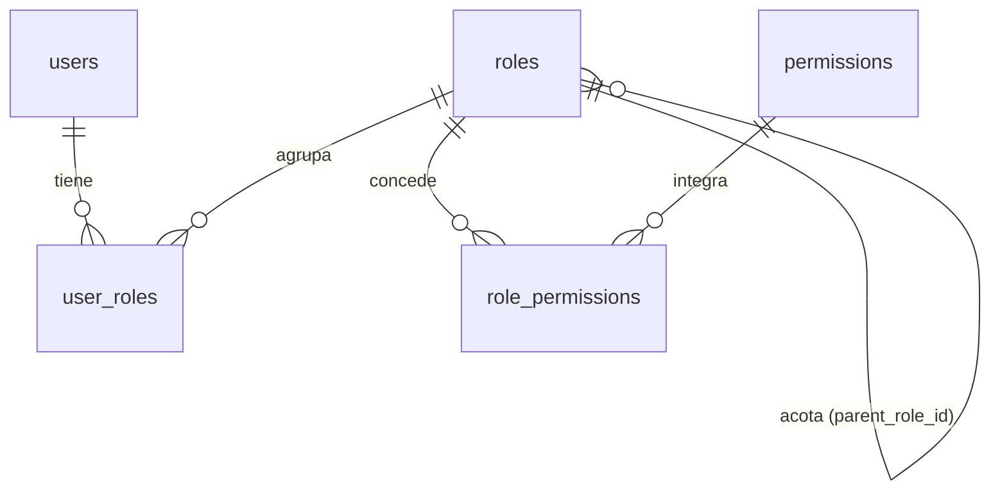
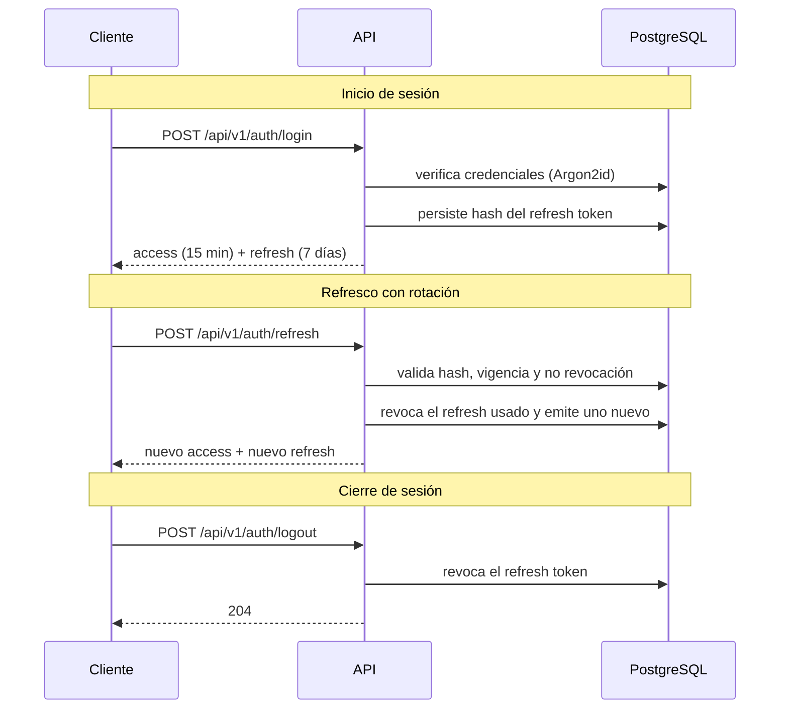

# Modelo de Seguridad — NEXUS

| Campo | Valor |
|---|---|
| Proyecto | NEXUS — Renovación de plataforma |
| Empresa | FACTECH GROUP SAS |
| Documento | `security.md` |
| Versión | 0.57.1 |
| Estado | Borrador |
| Responsable técnico | Bonilla Diaz William Steven |
| Fecha de creación | 19-08-2026 |
| Última actualización | 16-09-2026 |
| Documento superior | `constitution.md` v0.5.0 |
| Documento relacionado | `architecture.md` v0.4.0 |

---

## 1. Propósito y alcance

Este documento define **quién es quién** en NEXUS y **qué puede hacer cada quien**: el modelo de identidad, el modelo de autorización, el mecanismo de autenticación y los controles de protección de datos.

Desarrolla el Artículo IV de la constitución y resuelve la decisión D-08 registrada en `architecture.md` §16.

**Fuera de alcance:** la estructura de capas y el flujo de petición (`architecture.md`), y la especificación funcional del módulo de usuarios, que se documentará en `docs/requirements/`.

---

## 2. Principios rectores

1. **Denegar por defecto.** Todo lo que no está explícitamente permitido, está prohibido (Art. IV.1).
2. **Mínimo privilegio.** Cada actor recibe únicamente los permisos que su función exige (Art. IV.2).
3. **Nadie puede otorgar lo que no tiene.** Ningún actor puede crear un rol, ni asignar un permiso, que exceda sus propios privilegios.
4. **Todo acceso relevante deja rastro.** Autenticación, denegación y cambios de privilegio se auditan (Art. IV.7).
5. **La seguridad no depende del cliente.** Toda validación de autorización ocurre en el backend. Lo que el frontend oculte o muestre es una decisión de usabilidad, nunca un control de seguridad.

---

## 3. Modelo de identidad

### 3.1 Usuario

Un usuario es la representación de una persona que accede al sistema. Los procesos automáticos, cuando existan, usarán un tipo de identidad distinto que deberá especificarse antes de su implementación.

**Estados del usuario:**

| Estado | Significado | ¿Puede autenticarse? |
|---|---|---|
| `ACTIVO` | Operativo | Sí |
| `INACTIVO` | Decisión **organizativa**: la persona ya no debe operar | No |
| `BLOQUEADO` | Respuesta de **seguridad**: hay sospecha sobre la cuenta | No, hasta que un actor la reactive o —si el bloqueo lo puso el sistema— expire |
| `FTD_PENDIENTE` | Cliente registrado por enlace **sin depósito confirmado** | **Sí**, y no opera |

!!! important "`INACTIVO` y `BLOQUEADO` no son lo mismo, y la diferencia no es el mecanismo"

    Los dos impiden autenticarse y los dos revocan todas las sesiones de la persona (§5.5). Lo que los separa es **por qué** se retiró el acceso, y esa distinción se sostiene deliberadamente para que la auditoría y el filtro por estado de `RF-SP-025` signifiquen algo: una cuenta inactiva cuenta una historia de recursos humanos, una bloqueada cuenta una historia de seguridad.

    `BLOQUEADO` tiene **dos orígenes**, fijado el 21-08-2026 al aprobar `RF-SP-028`:

    - **Automático**, por intentos fallidos: lleva momento de expiración (`locked_until`) y se levanta solo.
    - **Manual**, por decisión de un actor con `users:update`: **no lleva expiración** y solo se levanta reactivando la cuenta.

    Retirar el acceso —por cualquiera de las dos vías— exige declarar un **motivo**, que se conserva en el detalle del evento de seguridad. Devolverlo no lo exige y no lo admite.

!!! danger "`FTD_PENDIENTE` autentica, y es el primero que lo hace sin estar `ACTIVO`"

    Hasta el 01-09-2026 la columna «¿Puede autenticarse?» decía lo mismo que «¿Está `ACTIVO`?», y `AuthUser.puedeEntrar()` lo escribía literalmente así. Con `RF-SP-045` **deja de coincidir**: quien se registra por un enlace y no ha depositado **entra al sistema y no puede operar en él**.

    Y esas son dos preguntas distintas, que hasta ahora no hacía falta separar:

    - **Autenticar** es probar quién eres. Esta cuenta puede: necesita entrar para ver qué le falta y cómo depositar.
    - **Operar** es que el sistema atienda tus peticiones. Esta cuenta no, y quien lo hace valer es un filtro (`RF-SP-046`), no el estado — de la misma forma que el indicador de cambio obligatorio de contraseña retiene a alguien **ya autenticado** en lugar de negarle la entrada (§3.2).

    De ahí una obligación sobre el código, y no es de estilo: **la lista de estados que autentican se escribe en positivo**, enumerándolos. Escrita como negación —«todo salvo `INACTIVO` y `BLOQUEADO`»— cualquier estado que se añada mañana **nacería autenticando**, y ese es el error que no se quiere cometer en el camino de acceso.

    `FTD_PENDIENTE` **sustituye a `PENDIENTE`**, que estaba declarado y sin usar desde el 21-08-2026 esperando un flujo de activación que nunca se escribió. `RF-SP-024` sigue creando cuentas `ACTIVO` con la credencial fijada por el actor, y la ventana en que un administrador conoce una credencial ajena se sigue acotando con el indicador de cambio obligatorio (§3.2), no con un estado.

**Identidad de la persona.** Cada usuario lleva dos identidades y con cualquiera de las dos inicia sesión (`RF-SP-024`):

- **`username`** — inmutable, único entre **todos** los usuarios incluidos los eliminados, y **no admite el carácter `@`**. Es el dato que la auditoría referencia, y por eso no cambia nunca.
- **`email`** — único en las mismas condiciones, pero **sí corregible** (`RF-SP-027`). Justamente porque cambia no puede ser la única identidad.

La prohibición del `@` en `username` es lo que permite que `RF-SP-034` acepte ambos sin ambigüedad: ningún nombre de usuario puede parecerse a un correo, de modo que las dos columnas no necesitan compartir un espacio de unicidad común.

Un usuario **NO DEBE** eliminarse físicamente: se desactiva (Art. V.10). Eliminar el registro rompería la trazabilidad de todo lo que esa persona hizo: los cuatro registros de auditoría referencian al actor por su identificador, y ese identificador debe seguir resolviendo a un usuario.

### 3.2 Credenciales

- Las contraseñas se almacenan con **Argon2id**, nunca en texto plano ni con hash reversible. Los parámetros de costo se declaran en configuración y se revisan periódicamente.
- El sistema **NO DEBE** poder recuperar una contraseña; solo restablecerla.
- El **permiso temporal de restablecimiento** que emite `RF-SP-040` es de **un solo uso** y su vigencia es de **treinta minutos**, declarada en configuración: acota la ventana en que un correo interceptado sigue sirviendo para entrar, sin que caduque mientras la persona busca el mensaje en su carpeta de correo no deseado. Se descartaron quince minutos —coherentes con el token de acceso de §4.5, pero generadores de solicitudes repetidas, y cada repetición es otro correo— y sesenta, que es lo habitual en la industria y deja una hora de exposición por solicitud sobre un permiso que basta para tomar la cuenta. Emitir uno nuevo invalida el anterior de esa misma persona, de modo que nunca hay más de uno vivo. El valor concreto se fija aquí y no en el requerimiento, junto al resto de parámetros de credenciales, para poder ajustarlo sin enmendar una spec. Añadido el 22-08-2026 al aprobar `RF-SP-040`.
- La comparación de credenciales debe ser resistente a ataques de temporización.
- El mensaje de error ante credenciales inválidas **NO DEBE** revelar si el usuario existe.

**Política mínima de contraseña:** longitud mínima declarada en configuración, verificación contra una lista de contraseñas comunes, prohibición de reutilizar la contraseña vigente, y **prohibición de que la contraseña contenga el nombre de usuario o la parte local del correo**, sin distinguir mayúsculas. La última se añadió el 22-08-2026 al aprobar el plan de `RF-SP-024`: sin ella, `jperez2026` era una credencial válida para `jperez` con solo cumplir la longitud, y es la contraseña que un atacante prueba primero. Se declara **aquí y no en cada requerimiento** para que `RF-SP-024`, `RF-SP-037`, `RF-SP-038` y `RF-SP-040` verifiquen exactamente lo mismo. Reglas adicionales se definirán en la especificación del módulo de usuarios.

**Cambio obligatorio de contraseña.** Lo decide **`users.provisional_password_expires_at`, y solo esa columna**: nula, la persona navega; con fecha, queda obligada a cambiar la contraseña antes de operar. La regla la fijó el responsable del proyecto el 25-08-2026 y sustituye a la anterior, que leía el indicador `must_change_password`.

Ese indicador **sigue existiendo y ya no decide nada** sobre el acceso: lo escriben el alta (`RF-SP-024`) y el restablecimiento (`RF-SP-038`), y el control de acceso ni siquiera lo consulta. `ck_users_provisional_expiry` garantiza que toda fecha lleva el indicador puesto; lo contrario no, y ahí está lo que hay que saber.

**Las dos consecuencias, declaradas y aceptadas:**

- **El alta no escribe caducidad.** Quien se registra —y el superadministrador que siembra `V22`— **navegan con normalidad** aunque su contraseña la fijara otra persona. La ventana en que dos personas conocen la misma credencial deja de cerrarse en el primer inicio de sesión para esas cuentas.
- **La credencial provisional ya no expira.** Hasta el 25-08-2026, superado el plazo dejaba de autenticar y había que restablecerla. Ahora una fecha vencida autentica igual y solo obliga a cambiarla, de modo que una contraseña que un administrador fijó hace meses **sigue abriendo la puerta** mientras su titular no entre a cambiarla. El plazo de `nexus.security.password.provisional-ttl` se sigue escribiendo y no tiene efecto sobre el acceso.

Lo que sí conserva su razón de ser es la marca en sí: acotar la ventana en que dos personas conocen la misma credencial, en las cuentas donde hay fecha. Sin ella, la auditoría no puede atribuir con certeza lo que ocurra en esa cuenta.

**Quién la aplica y qué deja pasar** (desde el 26-08-2026). `MustChangePasswordFilter`, dentro de la cadena de seguridad y después de la autorización, leyendo el claim `mcp` del token (§5.2) y no la base de datos. Responde **`403`** con un `type` propio **distinto del de la falta de permiso**: los dos son denegaciones y comparten estado, pero ante una la interfaz oculta la opción y ante esta lleva a cambiar la contraseña. La retención **no se audita** — no es un intento de saltarse un permiso, y un evento por rechazo sepultaría `audit_security_log` bajo el ruido de cualquier cliente que reintente.

Quedan alcanzables con la marca puesta: `RF-SP-037` (que la limpia), `RF-SP-039` (sin el cual no se puede saber por qué a uno lo rechazan) y **las tres rutas públicas de sesión**. Estas últimas no sobran: un cliente adjunta su `Authorization` en toda petición, y sin exceptuarlas quien tiene la marca **no podría cerrar su propia sesión**.

Hasta esa fecha el claim viajaba en el token y **no restringía nada**: quien tenía credencial provisional usaba la API entera con normalidad.

**Bloqueo por intentos fallidos:** tras **cinco** intentos fallidos consecutivos —umbral configurable, fijado el 21-08-2026 al aprobar `RF-SP-034`—, la cuenta pasa a `BLOQUEADO` por un tiempo **creciente y con techo declarado**. Cada intento fallido se audita.

El **techo no es opcional**: sin él, alguien puede mantener la cuenta de otra persona bloqueada indefinidamente provocando fallos a propósito, que es una denegación de servicio contra su titular.

**Excepción al mensaje genérico.** El cuarto punto de esta sección exige que el error ante credenciales inválidas no revele si el usuario existe. La **cuenta bloqueada** se exceptúa de forma consciente y se identifica como tal: quien provocó un bloqueo por fuerza bruta ya sabe que la cuenta existe —fue él quien la bloqueó—, de modo que callarlo solo perjudica al titular legítimo. En el bloqueo **manual** el argumento es más fuerte todavía, porque esa cuenta no se desbloquea sola. La contraseña **no se comprueba** antes de rechazar por bloqueo, para no filtrar por tiempo de respuesta lo que el mensaje no dice.

**Aviso de intentos restantes.** El rechazo por credenciales declara **cuántos intentos quedan** antes del bloqueo. Sin él, el bloqueo llega sin previo aviso a quien simplemente no recuerda cuál de sus contraseñas usó, y su primera noticia es no poder entrar.

El número **no puede depender de que la cuenta exista**, o sería el verificador de cuentas que el mensaje genérico existe para impedir: bastaría enviar una contraseña cualquiera y mirar si el campo aparece. Por eso los fallos de un identificador **sin cuenta** también se cuentan —con el mismo umbral y la misma progresión, y respondiendo cuenta bloqueada al agotarlos—, en un registro **efímero y acotado**: persistir una fila por identificador inventado convertiría la defensa en el amplificador del ataque. La consecuencia aceptada es que ese contador caduca y el de una cuenta real no, de modo que quien pruebe, espere a que la ventana cierre y repita, obtiene la misma señal que el rechazo por cuenta bloqueada ya entrega por diseño.

Por el mismo motivo, **todo** rechazo consume intento, incluidos los dos que se producen con la contraseña correcta —cuenta no habilitada y credencial provisional caducada—: si no lo consumieran, su respuesta llevaría un número distinto.

**La expiración del bloqueo viaja como dato, no escrita en el mensaje.** Un texto que diga «vuelva a intentarlo en dos minutos» es cierto en el instante en que se compone y deja de serlo enseguida: la respuesta viaja, el cliente la conserva y la persona la lee después. Se entregan el **instante** de desbloqueo y la **duración** restante —dos valores, porque el primero sobrevive a que la respuesta se guarde y el segundo permite descontarla sin depender de que el reloj del cliente coincida con el del servidor—. El bloqueo **manual** no lleva ninguno de los dos, y esa ausencia es la información: no expira solo.

---

## 4. Modelo de autorización

### 4.1 Estructura

Control de acceso basado en roles (RBAC) con permisos explícitos:



- Un **usuario** puede tener **varios roles**.
- Un **rol** agrupa un conjunto explícito de **permisos**.
- Un **permiso** es la unidad atómica de autorización.
- Un rol **puede** declarar un **rol padre**, que actúa como **cota superior** de sus privilegios.

### 4.2 Contención de privilegios, no herencia

Esta es la decisión central del modelo y conviene entenderla con precisión.

El campo `parent_role_id` **no implica herencia**. Un rol hijo **no recibe** los permisos de su padre: declara los suyos de forma explícita, uno por uno.

Lo que el padre impone es un **techo**:

> Los permisos de un rol **DEBEN** ser un subconjunto de los permisos de su rol padre.
>
> `permisos(hijo) ⊆ permisos(padre)`

**Consecuencia operativa:** la resolución de permisos en tiempo de autorización **nunca recorre el árbol**. Se lee la lista explícita del rol y nada más. El árbol solo se consulta al **escribir** (crear un rol, modificar sus permisos o cambiar su padre), que es una operación poco frecuente.

**Por qué basta con validar un solo nivel:** la contención es transitiva. Si `hijo ⊆ padre` y `padre ⊆ abuelo`, entonces `hijo ⊆ abuelo` se cumple automáticamente. Validar contra el padre inmediato es suficiente para garantizar el invariante en toda la cadena, sin recorrerla.

**Ejemplo:**

| Rol | Padre | Permisos declarados | ¿Válido? |
|---|---|---|---|
| `SUPERADMIN` | — | Todos | Sí (rol raíz) |
| `ADMIN` | `SUPERADMIN` | `roles:read`, `roles:create`, `users:read`, `users:create` | Sí |
| `SUPERVISOR` | `ADMIN` | `roles:read`, `users:read` | Sí (subconjunto) |
| `AUDITOR` | `SUPERVISOR` | `users:read`, `users:delete` | **No** — `users:delete` no está en `SUPERVISOR` |

### 4.3 Reglas de negocio

Cada regla declara cuándo aplica, qué debe ocurrir y su prioridad, conforme a la plantilla de requerimientos por módulo.

| ID | Regla | Cuándo aplica | Qué debe ocurrir | Prioridad |
|---|---|---|---|---|
| **RN-SEG-001** | Unicidad de rol | Al crear o editar un rol | El código y el nombre son únicos **entre los roles no eliminados lógicamente**; el duplicado se rechaza. El identificador de un rol eliminado queda liberado para reutilizarse | Alta |
| **RN-SEG-002** | Estado del rol | Siempre que se resuelvan permisos | Un rol es `ACTIVO` o `INACTIVO`. Un rol `INACTIVO` no concede permisos, aunque siga asignado | Alta |
| **RN-SEG-003** | Contención de privilegios | Al declarar o modificar los permisos de un rol | Sus permisos deben ser subconjunto de los de su rol padre; en caso contrario la operación se rechaza | **Crítica** |
| **RN-SEG-004** | Validación de un solo nivel | Al verificar RN-SEG-003 | Se valida contra el padre inmediato, sin recorrer la cadena de ancestros: la contención es transitiva | Alta |
| **RN-SEG-005** | Revocación sin cascada | Al retirar un permiso a un rol | Si un rol descendiente directo lo declara, la operación se rechaza e informa qué roles lo impiden. No se revoca en cascada de forma implícita | Alta |
| **RN-SEG-006** | Ausencia de ciclos | Al asignar o cambiar el rol padre | La cadena de roles padre no puede formar ciclos; un rol no puede ser ancestro de sí mismo | **Crítica** |
| **RN-SEG-007** | Rol raíz único | Al crear un rol sin padre | Existe exactamente un rol raíz (`SUPERADMIN`), acotado por el catálogo completo de permisos | Alta |
| **RN-SEG-008** | Eliminación restringida | Al eliminar un rol | Se rechaza si tiene roles hijos o usuarios asignados; debe desactivarse o reasignarse antes | Alta |
| **RN-SEG-009** | Permisos efectivos por unión | Al resolver qué puede hacer un usuario | Sus permisos son la unión de los de sus roles `ACTIVO` | **Crítica** |
| **RN-SEG-010** | Nadie otorga lo que no tiene | Al asignar un rol a un usuario | Se rechaza si los permisos del rol no están contenidos en los permisos efectivos de quien asigna | **Crítica** |
| **RN-SEG-011** | Sin autoconcesión | Al modificar roles o permisos | Un usuario no puede modificar sus propios roles, ni los permisos de los roles que tiene asignados **directamente**. No alcanza a los roles ancestros ni descendientes: `RN-SEG-010` ya impide conceder lo que no se posee, de modo que tocarlos no permite ganar nada | **Crítica** |
| **RN-SEG-012** | Roles de sistema inmutables | Al modificar o eliminar un rol marcado como de sistema | La operación se rechaza por la API, sin excepción | Alta |
| **RN-SEG-013** | Revalidación al reubicar | Al cambiar el rol padre de un rol | Se revalida RN-SEG-003 contra el nuevo padre; si no se cumple, la operación se rechaza | Alta |

**Advertencia sobre RN-SEG-009 y RN-SEG-010.** La contención opera **entre roles**, no sobre el conjunto efectivo del usuario. Dos roles individualmente acotados pueden, en unión, otorgar más de lo que cualquiera de ellos concede por separado. Por eso RN-SEG-010 existe: acota la **asignación** al privilegio efectivo de quien asigna. Sin esa regla, el modelo de contención sería evadible asignando varios roles.

### 4.4 Catálogo de permisos

Un permiso se identifica con el formato `<recurso>:<acción>`, en minúsculas:

```
roles:read       roles:create       roles:update       roles:delete
permissions:read
memberships:read memberships:create
countries:read   countries:create   countries:update
currencies:read  currencies:update

audit:read-changes      audit:read-deletions
audit:read-errors       audit:read-security

users:read       users:create       users:update       users:delete
users:assign-roles      users:assign-membership      users:reset-password
users:assign-supervisor

products:read    products:create    products:update    products:delete
products:sale    products:hotlink   products:comment

packages:read    packages:create    packages:update    packages:delete

commissions:read commissions:create commissions:update commissions:delete

movements:read   movements:create   movements:confirm  movements:void

exchange-rates:read     exchange-rates:create
exchange-rates:update   exchange-rates:delete

document-types:read

brokers:read     broker-accounts:read
```

**Cada módulo siembra los suyos, y `SP` sembró los primeros.** `V3__seed_permissions.sql` puebla los veinticuatro permisos, incluidos los de `users:`. Al retirarse el módulo `USR` y absorber `SP` los usuarios (`modules.md` v0.9.0), no hay otro módulo que pudiera sembrarlos: la tabla y su contenido pertenecen al mismo sitio. Esta lista se completó el 21-08-2026 al aprobar el plan de `RF-SP-010`, que hasta entonces omitía `permissions:read`, `memberships:*`, `countries:*` y `currencies:*`. El 22-08-2026 se añadió `users:assign-supervisor`, al registrarse `RF-SP-041`. **El módulo `PM` siembra los cuatro suyos en `V40__seed_products_permissions.sql`**, con su asociación a `SUPERADMIN` y `ADMIN` en la misma migración, y con eso el catálogo pasa de veinticuatro a **veintiocho**. El 02-09-2026 se añade **`products:sale`**, en `V48__seed_products_sale_permission.sql` (**veintinueve**). **`CM` hizo lo mismo en `V45__seed_commissions_permissions.sql`** y lo dejó en **treinta y tres**, y **`MV` en `V51__seed_movements_permissions.sql`**, que lo lleva a **treinta y siete** — este último **sin asociar a `ADMIN`**, por la excepción que se declara justo abajo. El 07-09-2026 se añade **`products:hotlink`**, en `V60__seed_products_hotlink_permission.sql` (**treinta y ocho**), **asociado a `SUPERADMIN` y a `ADMIN`** y sin ruta que lo exija todavía. El 07-09-2026 entran también los **cuatro `exchange-rates:`** del submódulo de tasas de cambio, en `V66__seed_exchange_rates_permissions.sql` (**cuarenta y dos**), asociados a `SUPERADMIN` y a `ADMIN`. **Es el primer recurso del catálogo con guion en el NOMBRE** —hasta hoy el guion solo aparecía en la acción, como `audit:read-changes`— y se admite porque el recurso es de dos palabras y `exchangerates` no se lee. Las pruebas que lo enumeran viven en `SP` y hubo que ampliarlas cada vez: esa fricción es deliberada — un permiso que aparezca sin que nadie actualice esa lista es un permiso que nadie revisó. El 08-09-2026 entra **`document-types:read`**, en `V72__seed_document_types_permission.sql` (**cuarenta y tres**), asociado a `SUPERADMIN` y a `ADMIN`. **Es el único recurso del catálogo con un solo permiso y sin ninguna acción de escritura**, y no por falta de tiempo: `RN-SP-036` prohíbe administrar ese catálogo por API, porque **su contenido es la validación de mayoría de edad** — solo lleva documentos de adulto, y un `document-types:create` dejaría que cualquiera con ese permiso añadiera «Tarjeta de Identidad» y desactivara la regla sin cambiar ninguna regla. Es la asimetría deliberada con `countries:` y `currencies:`, que sí tienen su acción de actualización. El 08-09-2026 entra también **`brokers:read`**, en `V75__seed_brokers_permission.sql` (**cuarenta y cuatro**), y es el **tercero** sin escritura, por el motivo de `RN-SP-039` y no por el de los tipos de documento — **este bloque lo omitía hasta el 10-09-2026**, que es exactamente la fricción que el párrafo anterior describe: un permiso que aparece sin que nadie actualice esta lista es un permiso que nadie revisó, y aquí el que no se revisó fue el propio listado. El 10-09-2026 entra **`broker-accounts:read`**, en `V81__seed_broker_accounts_permission.sql` (**cuarenta y cinco**), asociado a `SUPERADMIN` y a `ADMIN`. El 14-09-2026 entra **`products:comment`**, en `V88__seed_products_comment_permission.sql` (**cuarenta y seis**), asociado a `SUPERADMIN` y a `ADMIN` y **no a `CLIENTE`**, por lo mismo que `products:sale`. **Es el primer permiso de escritura de `PM` que no es de administración**: gobierna las tres operaciones sobre **la reseña propia** —escribirla, corregirla, retirarla— y la lectura de la propia (`RF-PM-009` a `RF-PM-011`, `RF-PM-013`). **Habilita, no autoriza**: quien lo porta escribe las suyas, y tocar una ajena responde `403` aunque lo porte un administrador (`RN-PM-027`) — es la «verificación de propiedad del dato» que §6 deja a la capa de aplicación, y la primera de `PM` que la ejerce. **Es el cuarto sin ninguna acción de escritura**, y el primero cuyo recurso **no es un catálogo**: gobierna la lectura de las cuentas de broker de cualquier persona (`RF-SP-055`). No hay `broker-accounts:create` porque **declarar una cuenta no pasa por él** —la declara su titular al registrarse por enlace, sin sesión (`RN-SP-042`)— ni `broker-accounts:update`, porque quien completa la cuenta es el webhook del broker (`RF-SP-054`) y no una persona. **Y no gobierna el listado del equipo** (`RF-SP-056`): ese lo autoriza la estructura comercial, con la excepción a D-22 que §5 acota. **El 14-09-2026 se diseñan los cuatro `packages:`** —`read`, `create`, `update`, `delete`— para los paquetes de productos (`requirements/pm.md` §5.2.10), y **los sembró `V93__seed_packages_permissions.sql` el 15-09-2026** (**cincuenta**), asociados a `SUPERADMIN` y a `ADMIN`, y no a `CLIENTE` —`V93` y no `V92`, que la tomó el alcance de los productos el mismo día—. **Es un recurso propio y no los `products:`**, por decisión del responsable del proyecto: quien administre roles tiene que poder dar el catálogo sin los paquetes, o al revés. **La oferta de paquetes no estrena permiso**: se ve con `products:sale`, porque el paquete se ve donde se ven los productos. **`packages:update` gobierna también qué productos entran en el paquete y con qué descuento** (`RF-PM-023` a `RF-PM-025`): la asociación es parte de armar el paquete, no otra cosa.


**`products:hotlink` es el segundo permiso de vista de `PM`, y nació SIN ENDPOINT que lo exigiera — lo exige `GET /api/v1/products/hotlinks` desde el 15-09-2026 (`RF-PM-027`).** Gobierna la **vista de hotlinks** —los productos cuyo alcance llega a ese canal (`RN-PM-019`)—, exactamente como `products:sale` gobierna la vista de venta, y por el mismo motivo no reutiliza `products:read`: ese abre el catálogo administrativo entero, con lo inactivo y lo retirado dentro.

**Que nazca sin ruta no es un descuido**: el canal de hotlinks todavía no está construido, y sembrar el permiso antes **no rompe nada** —el catálogo es datos, y su único efecto es poder concederse—. Es lo mismo que hizo `V51` con los cuatro `movements:`, adelantados al resto de su módulo. Lo que sí evita es la alternativa: llegar al requerimiento que lo necesite y tener que sembrar el permiso **y** construir la vista en el mismo Pull Request.

**Se asocia a `SUPERADMIN` y a `ADMIN`**, sin reserva. Decidirlo de otro modo habría creado la cuarta reserva del superadministrador, y ver qué se publica en un canal comercial no es una operación que deba quedar exclusiva de la raíz — `V40` ya estableció que el catálogo comercial de `PM` es administración ordinaria. **No se asocia a `CLIENTE`**, por lo mismo que `products:sale`: `V30` siembra ese rol sin permisos a propósito.
**`products:sale` no es un permiso `<recurso>:<acción>` sobre una operación de escritura, y por eso rompe el patrón CRUD del resto del catálogo.** Gobierna una **vista**, no una mutación: `GET /api/v1/products/available` (`RF-PM-007`) respondía hasta hoy a cualquier persona autenticada, sin exigir nada — la misma decisión que `RF-SP-039` tomó con el perfil propio. Por decisión del responsable del proyecto del 02-09-2026 deja de ser así: la vista de venta pasa a exigir este permiso, que se concede a los roles de tipo `CONSUMIDOR` por la vía normal (`RF-SP-006`) y no por siembra — el rol `CLIENTE` (`V30`) nace **sin permisos a propósito**, y darle este de oficio en la misma migración repetiría exactamente lo que esa migración decidió no hacer.

!!! warning "Obligación de toda migración que siembre permisos"

    Sembrar un permiso nuevo **no basta**: la misma migración DEBE asociarlo a `SUPERADMIN` y a `ADMIN`, o incumplirá §4.1 desde el momento en que se aplique. `V7__seed_system_roles.sql` no puede hacerlo por ella, porque asocia el catálogo existente en su momento y un permiso posterior todavía no estará.

    El síntoma de olvidarlo no es evidente: `ADMIN` quedaría incapaz de crear un rol que declare ese permiso, y `RN-SEG-003` rechazaría la operación sin decir que lo que falta es una siembra.

    **La asociación a `SUPERADMIN` no admite excepción**, porque `RN-SEG-007` acota la raíz por el catálogo completo. La de `ADMIN` sí, y cada una debe quedar declarada aquí abajo con lo que cuesta.

!!! danger "La reserva del superadministrador — tres, y la tercera no es como las otras dos"

    Estos permisos existen en el catálogo y **`ADMIN` no los recibe**:

    | Permiso | Desde | Por qué |
    |---|---|---|
    | `audit:read-security` | `V7`, 22-08-2026 | Es el registro donde quedan los intentos de escalada de privilegios. Un `ADMIN` que pudiera leerlo comprobaría si su propio intento quedó registrado |
    | `currencies:update` | `V7`, 22-08-2026 | `RF-SP-023` declara un único actor: el estado de una moneda condiciona todo cálculo financiero |
    | `movements:read`, `movements:create`, `movements:confirm`, `movements:void` | `V51`, 02-09-2026 | **Decisión del responsable del proyecto**, que se aparta de la obligación de arriba |

    **Las dos primeras cuestan poco y la tercera cuesta el módulo.** `audit:read-security` y `currencies:update` cubren operaciones que de verdad solo hace el superadministrador, de modo que la consecuencia —«`ADMIN` no puede delegar lo que no tiene»— es exactamente la que se busca.

    Los cuatro de `movements:` cubren el **trabajo diario de la fuerza comercial**, y `V7` la cuelga entera de `ADMIN`:

    ```
    SUPERADMIN → ADMIN → MANAGER → DIRECTOR → AGENTE
    ```

    Por `RN-SEG-003`, con `ADMIN` fuera **ningún rol de esa cadena podrá declarar `movements:create`**. No es que `ADMIN` no pueda delegarlo: es que no hay a quién delegárselo. Mientras la reserva siga en pie, registrar, confirmar y anular ventas lo puede hacer el superadministrador y nadie más, y el módulo `MV` no tiene vendedores que lo operen. Revertirlo es una migración de dos `INSERT` sobre `role_permissions`.

**La auditoría se lee por tipo, no en bloque.** Los cuatro registros del Art. V.8 responden preguntas distintas y no tienen la misma sensibilidad: quién editó un rol es información de operación; quién intentó entrar y falló es información de seguridad. Un único `audit:read` obligaría a dar acceso a la segunda para conceder la primera. Con permisos separados, soporte técnico puede investigar errores sin ver la actividad de autenticación de nadie:

| Perfil | Permisos de auditoría |
|---|---|
| Soporte técnico | `audit:read-errors` |
| Auditor de negocio | `audit:read-changes`, `audit:read-deletions` |
| Responsable de seguridad | Los cuatro |

La vista transversal `v_audit_timeline` (`architecture.md` §6.6.6) exige los cuatro permisos: mezcla las cuatro fuentes y no puede concederse parcialmente.

- El **recurso** corresponde a una entidad o agrupación funcional del módulo.
- La **acción** es una de un conjunto cerrado: `read`, `create`, `update`, `delete`, más acciones específicas del dominio cuando la especificación lo justifique (por ejemplo `users:reset-password`).
- El catálogo de permisos es **datos, no código**: se crea y modifica mediante migración Flyway. Agregar un rol nuevo o cambiar el alcance de uno existente **NO DEBE** requerir un despliegue.
- Cada permiso declara un nombre y una descripción legibles, para poder presentarlo en la interfaz de administración.
- La plantilla de requerimientos admite además la notación `role:<código>` cuando un requerimiento exige un rol concreto en lugar de un permiso. Su uso **DEBERÍA** ser excepcional: acoplar un endpoint a un rol específico anula la ventaja del modelo de permisos.

### 4.5 Resolución en tiempo de ejecución

1. El token de acceso transporta los **códigos de rol** del usuario, no la lista completa de permisos, para no inflar el token.
2. El backend resuelve `rol → permisos` desde una caché en memoria, invalidada ante cualquier cambio en `role_permissions` o en el estado de un rol.
3. Los permisos efectivos son la unión de los permisos de los roles activos (RN-SEG-009).

**Latencia de propagación de cambios** — consecuencia directa de este diseño, que debe conocerse:

| Cambio | Efecto |
|---|---|
| Se modifican los permisos de un rol | **Inmediato**, por invalidación de caché |
| Se activa o desactiva un rol | **Inmediato**, por invalidación de caché |
| Se **asignan** roles a un usuario | Hasta la expiración del token de acceso (máx. 15 min) |
| Se **retiran** roles a un usuario | **Inmediato**: se revocan sus refresh tokens y se rechaza su token de acceso |
| Se desactiva o bloquea un usuario | **Inmediato**: se revocan sus refresh tokens y se rechaza su token de acceso |

El último caso es el crítico y por eso se resuelve de forma explícita: la desactivación de un usuario **DEBE** verificarse contra el estado vigente, no confiar únicamente en la expiración del token.

**Cómo se rechaza el token de acceso** (desde el 26-08-2026, `RF-SP-028` · `T-09`). Hasta esa fecha las dos últimas filas de la tabla eran **ciertas solo a medias**: se revocaban los refresh tokens —que impide *prolongar* la sesión— y el token de acceso ya emitido seguía abriendo puertas los quince minutos que le quedaran. Lo resuelve `AccessRevocationRegistry`: la operación publica, **tras el commit**, «para esta persona, todo token emitido antes de este instante deja de valer», y `AccessRevocationValidator` lo comprueba al validar cada token, junto a la firma y la vigencia.

- **En memoria y no consultando la cuenta en cada petición.** Esa consulta convertiría el diseño sin estado en una lectura por petición sobre el camino más caliente, para atender algo que ocurre unas pocas veces al día. Y una lista negra por `jti` obligaría a recordar tokens individuales sin ganar nada: el corte es siempre **por persona**.
- **No crece**: cada entrada deja de servir al cabo de la vida del token y se retira al consultarla.
- **Se siembra al arrancar** con las cuentas que perdieron el acceso dentro de esa ventana. Sin ello, un reinicio devolvería la validez a los tokens recién cortados — un agujero que ninguna prueba funcional detecta.
- **El segundo del corte no queda ambiguo.** El `iat` va en segundos enteros y, dentro del segundo en que se revoca, no distingue si un token nació antes o después. No se resuelve eligiendo a qué lado caen los empates —cerrar mata tokens legítimos, abrir deja vivos quince minutos los que debían morir—, sino sellando: el emisor pone `iat` igual al corte cuando este es posterior al reloj, porque si está emitiendo es que la revocación ya ocurrió y esa persona acaba de probar quién es.
- **Con más de una instancia solo corta en la que atendió la petición** (**D-09**). Los refresh tokens sí quedan revocados en la base, de modo que la sesión no puede prolongarse en ninguna; la ventana es como mucho la vida del token. Sustituirlo por un canal compartido **no toca ningún caso de uso**: va detrás del puerto `AccessRevocationPublisher`. Debe resolverse **antes** de desplegar una segunda instancia — y desde que [`ADR-002`](architecture/ADR-002-plataforma-de-despliegue-railway.md) cierra D-09 eligiendo Railway, esto **ya no espera a ninguna decisión**: es la condición previa a escalar, y por eso el despliegue corre con una sola réplica ([`deployment.md` §2.1](deployment.md#21-una-sola-replica-y-no-es-un-ajuste-de-coste)).

Lo publican las cuatro operaciones que retiran acceso: cambio de estado (`RF-SP-028`), eliminación (`RF-SP-029`), cambio de la propia contraseña (`RF-SP-037`) y restablecimiento por un tercero (`RF-SP-038`).

**Asignar y retirar roles no son simétricos**, y la tabla lo refleja desde el 21-08-2026, al aprobarse `RF-SP-030` y `RF-SP-031`. Conceder puede esperar: la latencia solo retrasa un permiso nuevo, y forzar la renovación expulsaría a alguien de su sesión por haberle **dado** algo. Retirar no puede esperar: la ventana se abriría justo cuando alguien decidió que esa persona dejara de poder hacer algo, de modo que el retiro revoca sus sesiones igual que la desactivación. El coste asumido es que la persona vuelve a autenticarse cada vez que se le retira un rol.

---

## 5. Autenticación

### 5.1 Decisión D-08

**Token de acceso JWT de vida corta, más refresh token opaco, persistido y revocable.**

Combina las dos propiedades que se necesitan a la vez: validar la mayoría de peticiones sin consultar la base de datos (backend stateless, `architecture.md` §4), y poder cerrar sesión de verdad o expulsar a un usuario comprometido.

### 5.2 Tokens

| | Token de acceso | Refresh token |
|---|---|---|
| Formato | JWT firmado | Valor opaco aleatorio |
| Vida | 15 minutos | 7 días (configurable) |
| Almacenamiento en servidor | Ninguno | Solo su hash, en `refresh_tokens` |
| Revocable | No, expira | Sí, inmediatamente |
| Se envía en | `Authorization: Bearer <token>` | Únicamente al endpoint de refresco |

**Claims del token de acceso:** `iss`, `sub` (id del usuario), `jti`, `iat`, `exp`, los códigos de rol y **`mcp`**. **NO DEBEN** incluirse datos personales, correo, ni información sensible: un JWT va firmado, no cifrado, y cualquiera que lo posea puede leer su contenido.

**`mcp`** es un booleano que indica que la cuenta tiene pendiente el **cambio obligatorio de contraseña** (§3.2). Se añadió el 24-08-2026 al aprobar el plan de `RF-SP-034`, que es quien lo necesita: sin él, negar el resto de endpoints mientras la marca esté puesta obliga a leer `users.must_change_password` **en cada petición**, que es exactamente la consulta por petición que la decisión D-08 y `architecture.md` §4 existen para evitar. No contradice la prohibición del párrafo anterior —no identifica a nadie ni dice nada de la persona más allá de que le toca cambiar la contraseña— y su único lector posible es quien ya porta el token, es decir, su propio titular.

Quien lo lee y lo aplica es `MustChangePasswordFilter` (§3.2), desde el 26-08-2026. **El claim se calcula al emitir el token**, de modo que quien cambia su contraseña conserva uno con `mcp` en verdadero hasta quince minutos; `RF-SP-037` lo neutraliza revocando todas las sesiones, con lo que ese token ya no puede renovarse. Es la contrapartida declarada de no consultar la base en cada petición.

El secreto de firma llega por variable de entorno `JWT_SECRET` (Art. IX.1) y **NO DEBE** tener valor por defecto en ningún entorno (Art. IX.5).

### 5.3 Flujos



### 5.4 Rotación y detección de reutilización

Cada uso de un refresh token lo **revoca** y emite uno nuevo (rotación). Se conserva el vínculo con el token que lo reemplazó.

Si llega un refresh token revocado **por rotación**, el sistema asume robo de credenciales: **revoca toda la familia de tokens de esa sesión**, obliga a autenticarse de nuevo y registra un evento de seguridad de severidad alta. Sin esta regla, la rotación no aporta protección real.

**Cada revocación DEBE registrar su motivo**, y solo el motivo «rotación» dispara esa respuesta. Un token revocado por cierre de sesión, por retiro del acceso o por cambio de contraseña se rechaza con la respuesta genérica, **sin revocar familia y sin evento de severidad alta**: no hay dos copias en circulación, solo un cliente que reintenta con una credencial que el sistema retiró a propósito. Sin ese dato, cerrar sesión y reintentar sería indistinguible de un robo, y el registro de seguridad se llenaría de incidentes falsos hasta volverse inútil. Fijado el 21-08-2026 al aprobar `RF-SP-035`.

**La familia tiene una duración máxima de sesión**, declarada en configuración y contada **desde el inicio de sesión**, no desde el último refresco. Al agotarse hay que autenticarse de nuevo aunque la cadena siga viva y sin revocar. Sin ese techo, una sesión que se refresque sola no caduca nunca y la contraseña deja de tener efecto sobre ella. Agotarlo **no es un incidente** y se registra como un cierre, no como un robo.

### 5.5 Reglas adicionales

- Al desactivar, bloquear o cambiar la contraseña de un usuario, **DEBEN** revocarse todos sus refresh tokens.
- El endpoint de login **DEBE** tener limitación de tasa por credencial y por origen.
- El endpoint de **recuperación de contraseña DEBE** tener limitación de tasa **por identidad y por origen**, y fue la cota más estricta del sistema hasta el 26-08-2026, cuando el responsable del proyecto la fijó en cinco por minuto con cinco de espera al superarla (§5.5.1): es la única operación pública que provoca un envío saliente, de modo que sin ella se puede inundar de correos a una persona real —que es acoso— y sondear identidades en masa. Su confirmación se acota por origen. Añadido el 24-08-2026 al aprobar el plan de `RF-SP-040`.
- El endpoint de **refresco DEBE** tener limitación de tasa por origen, más holgada que la del login: es igualmente público y consulta la base de datos en cada llamada, mientras que un cliente legítimo refresca cada quince minutos. Añadido el 21-08-2026 al aprobar `RF-SP-035`.
- El **hotlink público DEBE** tener limitación de tasa **por origen**, y es la única cota del sistema que no protege un endpoint de autenticación. Añadido el 08-09-2026 al construir `RF-PM-008`: sus rechazos son todos el mismo `404`, de modo que lo único que le queda a quien sondea es **recorrer nombres de usuario a ciegas**, y esta cota es su única mitigación. **Acotar no es impedir**, y eso se declara aquí y no se disimula: quien reparta la carga entre orígenes lo consigue igual.
- Los **tres catálogos públicos DEBEN** tener limitación de tasa **por origen**, y por lo mismo que el refresco: son públicos y **consultan la base en cada llamada**. Añadido el 08-09-2026 al abrirlos. **No** es por lo mismo que el hotlink —aquí no hay nada que sondear—, y por eso la cota es la más holgada del sistema: una sola carga del formulario de registro pide los tres.
- El **registro por enlace DEBE** tener limitación de tasa **por origen**, y se acota por lo mismo que la recuperación y no por lo mismo que el refresco: no es que consulte la base, es que **ESCRIBE**. Añadido el 09-09-2026 al construir `RF-SP-045`. Sin cota, un origen puede crear cuentas en masa —cada una con su membresía, su atribución y su cuenta de broker— y ensuciar el árbol comercial sobre el que `CM` comisionará.
- La **imagen de portada de un producto DEBE** tener limitación de tasa **por origen**, por lo mismo que los catálogos: es pública, **consulta la base en cada llamada** y, al revés que todo lo anterior, **sirve bytes** —hasta cinco megas por respuesta—, de modo que una ráfaga cuesta ancho de banda además de sentencias. Añadido el 14-09-2026 al diseñar `RF-PM-016`. Aquí tampoco hay nada que sondear: el identificador es un UUID, y un `404` no dice nada de ningún producto.
- Los endpoints de autenticación **NO DEBEN** revelar si un usuario existe, ni en el mensaje ni en el tiempo de respuesta.
- Los refresh tokens expirados o revocados se purgan según la política de retención.

#### 5.5.1 Las cotas concretas, y por qué esas

Implantadas el 25-08-2026. Los números viven en configuración —`nexus.security.rate-limit`— y no en el código, porque un despliegue detrás de una pasarela corporativa, donde miles de personas comparten dirección de salida, necesita otros:
| Endpoint | Por origen | Por identidad | Ventana | Espera al superarla |
|---|---|---|---|---|
| Inicio de sesión | 10 | 5 | 1 minuto | — |
| Refresco | 60 | — | 1 minuto | — |
| Solicitud de recuperación | 5 | 5 | 1 minuto | **5 minutos** |
| Confirmación de recuperación | 30 | — | 1 hora | — |
| Hotlink público (`GET`) | 60 | — | 1 minuto | — |
| Catálogos públicos (`GET`, por catálogo) | 120 | — | 1 minuto | — |
| Reseñas de un producto (`GET`, por la familia `/api/v1/products/*/comments`) | 120 | — | 1 minuto | — |
| Imagen de portada (`GET`, por la familia `/api/v1/product-images/`) | 120 | — | 1 minuto | — |
| Registro por enlace (`POST`) | 10 | — | 1 hora | — |

Quien teclea mal su contraseña reintenta dos o tres veces; diez por minuto desde una misma dirección ya es una herramienta. La cota **por credencial es más estricta que la del origen** a propósito, y la del origen es la que de verdad importa: el rociado de contraseñas reparte los intentos entre muchas cuentas y **no dispara el bloqueo de ninguna**, porque deja un solo fallo en cada una.

En el refresco el margen es enorme porque una interfaz con varias pestañas refresca en ráfaga; lo que se corta es el bucle. Su confirmación es más holgada porque no provoca ningún envío: deja margen a quien se equivoca copiando el código y no deja sitio a una búsqueda.

**La solicitud de recuperación cambió el 26-08-2026**, por decisión del responsable del proyecto: de **3 por hora y por identidad** a **5 por minuto**, y quien los supera **espera cinco minutos**. La penalización no es un adorno del número, es lo que lo sostiene: cinco por minuto sin castigo son setenta y dos mil correos al día contra una misma dirección; con él, el ritmo sostenido baja a cinco cada cinco minutos, unos **sesenta a la hora**. Aun así es **veinte veces la cota anterior**, y lo que se multiplica por veinte es cuántos correos puede provocar un desconocido en la bandeja de una persona real — la consecuencia se declara aquí porque el número la asume, no porque la resuelva.

**Con las dos cotas iguales, la de identidad no llega a dispararse.** El filtro comprueba primero el origen, de modo que la sexta petición de un minuto topa siempre ahí; la de identidad queda como red de seguridad para el día en que la del origen se afloje —un despliegue detrás de una pasarela corporativa— y no como una defensa que hoy actúe. La alternativa era dejar el origen más holgado que la identidad, como en el login, y se descartó para que «cinco por minuto» signifique cinco por minuto sin depender de por dónde entre la petición.

**El hotlink es la quinta cota y la primera que no protege una credencial** (08-09-2026, `RF-PM-008`). Es también la primera que se aplica a un `GET`, y la única que **no se cuenta por la ruta**: el camino lleva dentro el nombre de usuario, de modo que contar por URI le daría un cubo nuevo a cada nombre probado y **no cortaría jamás** el recorrido que existe para cortar. Se cuenta por la **familia** `/api/v1/hotlinks/`, y por eso mil rutas distintas de un barrido caen en el mismo sitio.

**El número es holgado a propósito, y no lleva penalización.** Un hotlink se reparte por mensajería y lo abren muchas personas que pueden **compartir la dirección de salida de su operador**: una cota estrecha —o una espera fija al superarla— dejaría fuera a lectores legítimos antes que a nadie más, y el enlace dejaría de funcionar justo cuando funciona. Sesenta por minuto son ochenta y seis mil al día desde un origen: **acotar no es impedir**, y lo que la cota compra es que el barrido cueste orígenes, no que sea imposible. **Y el registro del rechazo guarda el prefijo y no la ruta**, por lo mismo que el de la identidad no dice contra qué cuenta iba la ráfaga: conservar uno al azar de los mil nombres de un recorrido sería un dato personal a cambio de nada.

**Las reseñas de un producto son la séptima cota, y toman el número de los catálogos y la llave del hotlink** (14-09-2026, `RF-PM-012`). El número es el de `public-catalog` —120 por minuto y por origen— porque la naturaleza es la misma: una ruta pública que consulta la base en cada llamada y **no identifica a nadie** que no haya decidido publicar su nombre. La llave **no** es la ruta sino la **familia** `/api/v1/products/*/comments`, como en el hotlink: la ruta lleva el identificador del producto, y contar por URI daría un cubo por producto — quien recorriera identificadores al azar buscando cuáles responden `200` no toparía jamás. Con la familia, mil identificadores distintos caen en el mismo sitio.

**La imagen de portada es la octava cota, y la primera que acota bytes y no solo sentencias** (14-09-2026, `RF-PM-016`, diseñada). El número es el de los catálogos —120 por minuto y por origen— y la llave es **la familia** `/api/v1/product-images/`, como el hotlink y las reseñas, porque la ruta lleva un identificador y contar por URI daría un cubo por imagen. Lo que la distingue es lo que cuesta cada acierto: una respuesta de hasta **cinco megas**, de modo que ciento veinte por minuto desde un origen son hasta seiscientos megas por minuto de salida. **Es holgado a propósito, como el hotlink**: la pantalla de una oferta pinta todas sus portadas de una vez, y un origen compartido —una oficina, un operador— tiene que poder cargarlas; y lo que la caché inmutable de `RF-PM-016` compra es que **esa carga ocurra una vez por navegador y no una por pantalla**. Un cliente que ignore la caché y recorra identificadores al azar topa aquí; **acotar no es impedir**, y se anota que el día que el catálogo sea grande esta cota tendrá que contar bytes y no peticiones.

**Esto no sustituye al bloqueo por intentos fallidos de §3.2, ni al revés.** Aquel cuenta fallos de credencial contra **una cuenta** y la protege; este cuenta **peticiones**, acierten o fallen, y protege al sistema —incluido el caso en que provocar bloqueos ajenos sea el ataque—.

Tres consecuencias declaradas:

- **El rechazo es `429`** con `Retry-After` y un miembro `retryAfterSeconds` que el cliente **descuenta**: un mensaje que diga «vuelva en dos minutos» es cierto al serializarse y deja de serlo enseguida.
- **La cuenta vive en memoria del proceso**, de modo que **el límite es por instancia**: con tres réplicas el techo real se triplica. Es aceptable con una sola instancia y deja de serlo al escalar; compartirlo exige almacenamiento común, que hoy no existe. El despliegue corre con **una sola réplica** precisamente por esto ([`deployment.md` §2.1](deployment.md#21-una-sola-replica-y-no-es-un-ajuste-de-coste)).
- **Las dos cotas de recuperación se aplican desde el 26-08-2026**, al existir sus endpoints. La **confirmación se acota solo por origen**, y no es un descuido: su cuerpo no lleva identidad ninguna —lleva un permiso—, de modo que no hay nada por lo que acotar por credencial. Lo que se corta ahí es probar permisos al azar.

#### 5.5.2 La purga, y por qué su plazo no es arbitrario

Implantada el 25-08-2026 (issue #25). Hasta entonces la última regla de §5.5 era una obligación que **nadie ejecutaba**: ni tarea programada, ni requerimiento que la cubriera. Y la tabla no crece despacio — `RF-SP-035` rota el token en **cada** refresco y revocar es marcar, no eliminar: una sesión de siete días renovando cada quince minutos deja **cientos de filas**, y ninguna desaparece al cerrarla. Lo que crece de forma monótona con el uso es la tabla que sostiene la autenticación de todo el sistema, y su índice único de hashes con ella.

**Se purga por familia entera, y el plazo se cuenta desde que toda ella dejó de autenticar** —el mayor `expires_at` del grupo—, **nunca desde la revocación**. La diferencia no es de matiz: una rotación revoca su token a los quince minutos de nacer, de modo que contar desde ahí se llevaría por delante la sesión de alguien que está trabajando.

**Purgar demasiado pronto apaga una alarma.** La detección de robo por reutilización de `RF-SP-035` vive precisamente en las filas revocadas: si la fila ya no está, presentar un token robado deja de distinguirse de presentar uno inválido, y el evento de severidad alta no se emite. Por eso el plazo por defecto es de **treinta días** después de que la familia caduque —un mes de margen para investigar una sesión que ya no puede autenticar a nadie—, y vive en configuración (`nexus.security.token-purge.retention`).

**Tres consecuencias declaradas:**

- **Deja constancia.** Cada purga que borra algo emite el evento `SESSION_TOKENS_PURGED` de §8.1 con cuántas filas y cuántas familias retiró y hasta qué fecha de corte. Una purga que elimina evidencia sin registrar cuánta eliminó no es auditable, y su ausencia sería indistinguible de una que nunca corrió. **No lleva identidad**: quién tenía esas sesiones no responde ninguna de las preguntas de este evento, y convertiría el mantenimiento en un rastro de quién usó el sistema.
- **Con varias instancias, purga una sola.** Se toma un cerrojo de aviso en el motor (`pg_try_advisory_xact_lock`), que es el único sitio donde las réplicas se ven; la que no lo obtiene sale sin hacer nada. Es lo que evita que tres réplicas compitan por las mismas filas cuando llegue el despliegue escalado. **La purga sí está preparada para varias instancias**; el corte de acceso y el límite de tasa, no — y son ellos los que hoy imponen la réplica única.
- **Los permisos de recuperación de contraseña siguen sin purgarse**, y desde el 26-08-2026 su tabla sí existe: `password_reset_permits`, que `RF-SP-040` crea. Hereda esta misma decisión y **el mismo hueco**: ningún requerimiento cubre la purga, de modo que la tabla crece con cada solicitud. Crece despacio —un permiso por olvido, no uno por refresco— y por eso no urge, pero conviene que no se descubra sola.


---

## 6. Aplicación de la autorización

- La autorización se declara en la capa `api` (`architecture.md` §5.1), mediante anotaciones sobre cada endpoint.
- Un endpoint **sin declaración explícita** de permiso queda **inaccesible**, no público. La configuración por defecto deniega, y la excepción se declara en una lista explícita y corta, revisable de un vistazo:

| Ruta | Por qué es pública | Condición |
|---|---|---|
| `/actuator/health` y sus dos sondas | El Art. XV.10 lo exige sin autenticación de negocio, y sin detalle interno. Desde el issue #31 son **tres** rutas —la general, `/liveness` y `/readiness`—: quien las consulta es el orquestador, que no porta credencial ninguna | Siempre |
| `/api/v1/auth/login` y `/api/v1/auth/refresh` | No puede exigirse credencial para obtener una credencial | Siempre. Los implementan `RF-SP-034` y `RF-SP-035` |
| `/swagger-ui.html`, `/v3/api-docs` | Consultar el contrato durante el desarrollo | **Solo donde se habilite de forma explícita.** Por defecto no: el contrato describe cada endpoint y cada permiso del sistema |
| `GET /api/v1/countries`, `GET /api/v1/document-types`, `GET /api/v1/brokers` | **Los tres catálogos que el formulario de registro necesita antes de que exista la cuenta** (`RF-SP-045`). Son listas de opciones y **no identifican a nadie**: no hay oráculo posible porque no hay nada que sondear | Siempre, y **solo en `GET`** (08-09-2026). El `POST` y el `PATCH` de países **no** se abren, y siguen respondiendo `401` sin token en lugar de `403` |
| `POST /api/v1/auth/registration` | **Público por definición** (`RF-SP-045`, 09-09-2026): quien se registra no tiene cuenta con la que autenticarse. **Es el primero que ESCRIBE** | Siempre. Lo que sostiene que no sea un agujero no es un token: la cuenta nace en `FTD_PENDIENTE` —autentica y **no opera**— y el origen está acotado |
| `GET /api/v1/payment-methods` | **El catálogo de métodos de pago** (`RF-MV-009`, `RN-MV-024`, 09-09-2026): el mismo formulario de registro elige **con qué se paga** antes de que exista la cuenta. Lo que devuelve está acotado por **dos ejes** —activo y visibilidad `PUBLICO`—, de modo que abrirlo **no publica nada que un autenticado no viera ya**, y **no identifica a nadie** | Siempre, y **solo en `GET`**. El catálogo no se administra por API todavía; el día que se administre, esas escrituras **no** se abren. **No deja ningún permiso huérfano**: este endpoint nunca exigió uno |
| `GET /api/v1/products/{id}/comments` | **Las reseñas de un producto** (`RF-PM-012`, 14-09-2026): la pantalla del hotlink las necesita y no tiene con qué autenticarse. **Es la segunda ruta pública que publica el nombre de una persona**, después del hotlink, y por eso hereda sus dos decisiones: de cada autor **solo nombre y apellido** (`RN-PM-030`), y **`404` uniforme** para el producto inexistente, inactivo o retirado (`RN-PM-028`) | Siempre, **solo en `GET`** y **solo esa ruta**: `POST` sobre la misma exige `products:comment`, y `/comments/mine`, `PATCH` y `DELETE` sobre `/comments/{commentId}` no se abren. **Es por decisión y no por definición**, y no deja ningún permiso huérfano. La cota de tasa es la de los catálogos, contada por la familia |
| `GET /api/v1/product-images/{imageId}` | **La imagen de portada de un producto — y desde el 16-09-2026 también la de un paquete** (`RF-PM-016`, 14-09-2026, diseñada; `RF-PM-028`, sin ruta nueva): las cuatro lecturas del producto devuelven su dirección —y las cuatro del paquete, la suya—, y una de cada grupo —el hotlink— es pública, de modo que la imagen que señala **tiene que poder ponerse en un `` sin credencial**. **Es la primera ruta del sistema que sirve bytes y no JSON**, y **no identifica a nadie**: sirve una imagen que administración subió para que se viera, **sin mirar el producto** —ni estado, ni alcance, ni retiro— porque el identificador es un UUID que no se lista en ningún sitio sin token ([`requirements/pm.md` §5.2.9](requirements/pm.md)) | Siempre, y **solo en `GET`**: la subida y el retiro de la portada viven en `/products/{id}/cover` bajo `products:update`, y no se abren. **Sirve con `Cache-Control: public, max-age=31536000, immutable` y `X-Content-Type-Options: nosniff`**, y **solo tres tipos** —`JPEG`, `PNG`, `WebP`—: `SVG` queda fuera precisamente porque servirlo *inline* desde este origen sería servir código de quien lo subió. La cota de tasa es la de los catálogos, contada por la familia. **La ruta no sabe de qué entidad es la imagen** ([`requirements/pm.md` §5.2.12](requirements/pm.md)): la subida y el retiro de la portada del paquete viven en `/packages/{id}/cover` bajo `packages:update`, y tampoco se abren |
| `GET /api/v1/hotlinks/{username}/packages/{code}` | **El hotlink de un paquete** (`RF-PM-026`, 15-09-2026): la cuarta ruta pública de `PM` y la novena del sistema. Hereda del hotlink del producto sus dos acotaciones —paquete activo, vivo y de alcance `HOTLINK` o `AMBOS`, y solo el nombre de quien es fuerza comercial— y su **`404` uniforme**, que aquí cubre además al paquete que hoy no se puede ofrecer: distinguirlo publicaría sin token que existe y qué le pasa. **Necesitó su propia declaración** en `RUTAS_PUBLICAS`: el patrón del producto es de dos segmentos (`/*/*`) y esta ruta tiene tres, de modo que entra `/api/v1/hotlinks/*/packages/*` al lado —y no `/**`, que dejaría pública cualquier ruta futura de la familia—. **La cota sí la hereda**, porque `RateLimitFilter` decide por prefijo | Siempre, y solo en `GET`. Cota compartida con el hotlink del producto: dos de uno agotan la tercera del otro |

    Cualquier ruta fuera de esa lista exige autenticación. La configuración de seguridad **no** debe traer formulario de acceso, sesión ni autenticación básica: sin credencial válida se responde `401`, no se redirige.

!!! important "Abrir los tres catálogos deja TRES PERMISOS sin endpoint que los exija — 08-09-2026"

    `countries:read`, `document-types:read` y `brokers:read` **dejan de gobernar** las lecturas que gobernaban: la ruta es pública y el `@PreAuthorize` se retiró de las tres —con la anotación puesta, un anónimo pasaría el filtro y chocaría con un `403`, que es una puerta abierta que no sirve de nada—.

    **Los permisos NO se retiran del catálogo**, y conviene saber por qué: eliminarlos rompería cualquier rol que ya los tenga concedidos, y `RN-SEG-003` empezaría a rechazar operaciones sin decir que lo que falta es una siembra. Quedan como `products:hotlink` y los cuatro de `movements:` — **sembrados y sin endpoint que los exija**.

    **Lo que eso cuesta, dicho en lugar de disimularse**: quien lea el catálogo de permisos verá tres que sugieren que los catálogos están protegidos, y no lo están. Retirarlos es una decisión del responsable del proyecto y no una limpieza técnica, porque cambia lo que un rol existente puede hacer.

    **Y lo que resuelve** es un hueco declarado tres veces —en `V16`, en `V72` y en `V75`—: el registro público de `RF-SP-045` necesita elegir país, tipo de documento y broker, y ninguno de los tres se podía leer sin haber iniciado sesión, que es justo lo que todavía no se ha hecho.

!!! important "El cuarto catálogo público NO deja ningún permiso huérfano, y conviene ver por qué — 09-09-2026"

    `GET /api/v1/payment-methods` se abre por lo mismo que los tres de arriba —el formulario de registro elige con qué se paga antes de que exista la cuenta— y **cuesta menos**: no hay `@PreAuthorize` que retirar, porque **nunca lo tuvo**. Los cuatro permisos de `movements:` gobiernan **ventas**, y ninguno gobernaba esta lectura.

    **Lo que sostiene que abrirlo no publique nada no es el filtro de seguridad: es el predicado de la consulta.** La respuesta lleva **dos ejes** desde el mismo día —`is_active` y `visibility = 'PUBLICO'` (`RN-MV-023`)—, de modo que el anónimo recibe **exactamente la misma respuesta** que el autenticado. Con uno solo, abrir la ruta habría puesto delante de cualquiera el método `GRATIS`, que es el que anota una venta como gratuita — y ese es un dato de administración, no una opción de un selector.

    **Y va a la lista casada por método, no a la de rutas enteras**, aunque hoy esa ruta solo responda a un `GET`: el día que el catálogo se administre por API, tenerla abierta entera haría que el alta respondiera `403` en vez de `401`. Se declara ahora, que cuesta una línea.

    **Con cota de tasa desde el primer día**: entra en la política `public-catalog` —120 por minuto, por origen y con **cubo propio**—, por lo mismo que los otros tres. No es la cota del hotlink: aquí no hay nada que sondear.

!!! info "Las métricas se exponen y NO son públicas — 25-08-2026 (issue #31)"

    `/actuator/metrics` queda **detrás de la autenticación**, y no hace falta declararlo en ninguna parte para que así sea: la regla de denegar por defecto ya lo cubre — solo lo que figura en la tabla de arriba es público. Se anota aquí porque la pregunta se hará: **el Art. XV.10 abre la salud y nada más**.

    Lo que todavía no resuelve: **un raspador no porta un JWT**. Se esperaba que lo resolviera la infraestructura de despliegue, y **[`ADR-002`](architecture/ADR-002-plataforma-de-despliegue-railway.md) cierra D-09 sin resolverlo**: Railway no aporta ni permiso propio ni red de administración. Sigue haciendo falta uno de los dos, ya sin decisión pendiente tras la que esperar, y mientras tanto las métricas se consultan a mano. Ningún otro endpoint de actuator se expone — `env` y `beans` publican configuración y estructura interna, y hay una prueba que impide que entren «para depurar» y se queden.

!!! warning "El contrato ya no es reservado, aunque el endpoint siga cerrado — 24-08-2026"

    La fila de `/v3/api-docs` justifica su reserva en que *«el contrato describe cada endpoint y cada permiso del sistema»*. Desde [`ADR-001`](architecture/ADR-001-publicacion-del-contrato-openapi.md), ese contrato **se publica como archivo versionado** en `docs/api/openapi.json`, de modo que esa información deja de estar reservada por el solo hecho de que el endpoint esté cerrado.

    Se acepta a conciencia. **La reserva nunca fue un control de seguridad**, sino defensa en profundidad: todo endpoint deniega por defecto y exige su permiso (Art. IV.1), y conocer una ruta no acerca a nadie a poder usarla. Lo que se pierde es encarecer el reconocimiento de un atacante. Ningún secreto viaja en el contrato: describe rutas, formas y códigos de error.

    **La bandera no cambia.** `EXPOSE_API_DOCS` sigue en `false`: que el contrato sea legible en el repositorio no es razón para dejar Swagger abierto en un entorno en ejecución, donde además invita a probar contra datos reales.
- La verificación de propiedad del dato (que un usuario solo acceda a sus propios registros, cuando aplique) es responsabilidad de la capa `application` y **DEBE** especificarse por requerimiento. Un permiso concede la capacidad de ejecutar una acción, no el derecho sobre un registro concreto.

!!! note "El alcance de datos está pendiente de diseño (D-22)"

    Lo anterior basta mientras el alcance sea la excepción, que es la situación actual: los roles, los permisos y los catálogos de `SP` son globales y ningún requerimiento vigente necesita acotar por persona.

    Deja de bastar en cuanto se retome la estructura comercial: manager, director y agente necesitan el **mismo permiso** sobre conjuntos de datos distintos. El alcance es un **eje ortogonal al permiso** y necesita diseño propio —qué lo determina, cómo se declara por requerimiento y cómo se verifica de forma automatizada—, registrado como **D-22**.

    Ningún requerimiento con alcance por persona debe especificarse antes de resolver D-22.

    **Actualización del 22-08-2026.** La estructura comercial ya está registrada: `RF-SP-041` y `RF-SP-042` la guardan en `user_supervisors` (`requirements/sp.md` §10.7). Eso **no cierra D-22 ni la relaja**, y conviene ser explícito sobre por qué no la infringe:

    - Ambos requerimientos se autorizan por **permiso**, como el resto del módulo: `users:assign-supervisor` para escribir y `users:read` para consultar. Quien los tiene los ejerce sobre cualquier persona.
    - Ninguno se resuelve **contra el actor**. No existe todavía un «mi equipo», y por eso no hay alcance por persona que declarar.
    - Lo que sí queda disponible es el **dato** que D-22 necesitará para decidir de quién ve los registros cada uno.

    El riesgo se desplaza, no desaparece: existiendo la tabla, es fácil que un requerimiento futuro resuelva su alcance consultándola por su cuenta. Eso dejaría el modelo de alcance repartido en lugar de definido, que es justo lo que D-22 debe evitar. La misma advertencia está anotada en `requirements/sp.md` §10.7.

    **Actualización del 10-09-2026 — el caso previsto acaba de ocurrir, y ocurre por decisión.** `RF-SP-055` y `RF-SP-056` (`RN-SP-046`) **resuelven su alcance consultando `user_supervisors`**: quien es el superior comercial vigente de una persona ve sus cuentas de broker sin traer ningún permiso. Es exactamente el movimiento que el párrafo anterior señalaba como riesgo, de modo que no se disfraza de otra cosa — **D-22 sigue abierta y esto no la resuelve**. Lo que se hace es **acotarlo por escrito para que siga siendo una excepción localizable** y no el principio de un modelo repartido:

    - **Es la única lectura del sistema autorizada por estructura.** Ninguna otra puede añadirse citando esta: quien lo necesite reabre D-22.
    - **`RF-SP-057` NO la amplía, y conviene no confundirlas** (10-09-2026): aquel listado **filtra** por estructura —`?supervisorId=`, y en profundidad— pero **lo autoriza el permiso**, no la estructura. La diferencia es la que importa: quien lo llama ya podía ver las cuentas de cualquiera, de modo que el filtro le ahorra recorrer el árbol y **no le concede nada**. La cota de un solo nivel se rompe **ahí y solo ahí**, y por eso mismo: sin estructura que conceder, no hay estructura que acotar.
    - **Un solo nivel**, el equipo directo. El árbol descendente publicaría la estructura entera de la empresa, y es la misma cota que `RF-SP-042` ya se puso.
    - **La alternativa por permiso sigue existiendo y es la vía general**: `broker-accounts:read` ve las cuentas de cualquiera, y es lo que usa la administración.
    - **Se cierra sobre un dato y no sobre un módulo**: las cuentas de broker, y nada más. No alcanza a movimientos, comisiones ni perfiles.

    **Y aquí se usa `404` donde el modelo pide `403`** —la excepción que el punto de abajo admite «cuando la especificación lo exija de forma expresa y justificada»—: quien no es el superior vigente recibe la misma respuesta que si la persona no existiera. El motivo es que el actor de esta lectura **es un vendedor cualquiera**, no un administrador, y un `403` le confirmaría qué identificadores corresponden a personas reales; es el mismo razonamiento con el que el hotlink de `RF-PM-008` unificó su `404`, con la diferencia de que aquel es público y este no.
- Ante falta de permiso se responde `403`; ante ausencia o invalidez del token, `401` (`architecture.md` §7.2).
- **NO DEBE** usarse `404` para ocultar la existencia de un recurso salvo que la especificación lo exija de forma expresa y justificada.

### 6.1 Orígenes autorizados del navegador (CORS)

CORS **no es autorización**: no decide quién puede llamar, sino desde qué página web puede el navegador leer la respuesta. Un origen autorizado no obtiene nada que no obtuviera ya con `curl`; lo que se protege es a la persona que visita otro sitio mientras tiene sesión abierta aquí.

- La política vive en `CorsConfig` y se aplica a toda la API. Se declara **una vez** y no por endpoint.
- **Los orígenes NO se escriben en el código.** Cambian por entorno y llegan por `CORS_ALLOWED_ORIGINS`, separados por coma y con la forma `esquema://host[:puerto]` (Art. IX.1). La lista concreta de cada entorno desplegado es configuración de despliegue y vive en [`deployment.md` §9](deployment.md#9-dominio-https-y-cors); en un entorno sin frontend desplegado va **vacía**, que es el valor seguro. Los `localhost` del `docker-compose.yml` no van ahí jamás.
- **Vacío = ningún origen autorizado**, que es el valor seguro por defecto (Art. IV.1). No rompe nada que no sea un navegador: quien consume la API de servidor a servidor no pasa por CORS.
- **El comodín `*` no se admite y la aplicación falla al arrancar con él** (Art. IX.5), igual que ante un origen sin esquema, con barra final o con ruta. Estos últimos no casarían jamás y el fallo aparecería como un error de CORS en el navegador —lejos, tarde y sin mencionar la variable mal puesta—.
- **Sin credenciales de navegador.** `allowCredentials` queda en `false`: el sistema no usa cookies de sesión (D-08) y el token viaja en `Authorization`, que el navegador no adjunta por su cuenta.
- Los **métodos y las cabeceras sí se declaran en el código**, porque dependen del contrato y no del entorno. Se exponen `Location` —sin ella, quien registra un recurso no puede leer la dirección del que acaba de crear— y `X-Correlation-Id`, para que la interfaz pueda citarlo al reportar un error (Art. XV.1).
- La comprobación previa (`OPTIONS`) se responde **antes de la autorización** y por eso **no** figura entre las rutas públicas de la tabla anterior: el navegador nunca le adjunta `Authorization`, de modo que exigir credencial ahí cerraría toda ruta protegida al frontend.

Cierra el pendiente n.º 2 de [`ADR-001`](architecture/ADR-001-publicacion-del-contrato-openapi.md): publicar el contrato no bastaba, porque el navegador seguía sin poder llamar.

---

## 7. Protección de datos

### 7.1 Secretos

- Ningún secreto en el repositorio, en ninguna forma (Art. IV.3): ni en código, ni en pruebas, ni en comentarios, ni en `.env` versionado, ni en el historial de Git.
- `.env.example` documenta las variables **sin valores reales** (Art. IX.3).
- Si un secreto llega a comprometerse, se **rota**; eliminarlo del historial no lo vuelve seguro, porque ya fue expuesto.

### 7.2 Datos en tránsito y en reposo

- HTTPS obligatorio en `testing` y `production` (Art. IV.6).
- Las credenciales de base de datos y el secreto de firma se inyectan por entorno.
- El cifrado a nivel de columna, si algún dato lo requiere, se decidirá por requerimiento y se documentará aquí.

### 7.3 Enmascaramiento en registros

Implementa el Art. XV.5. Antes de persistir cualquier contenido en `request_log` o de emitirlo a los logs de aplicación:

- Se enmascaran contraseñas, tokens, cabeceras `Authorization` y `Cookie`, y datos personales sensibles.
- El enmascaramiento opera por **lista de inclusión**: solo se registra lo declarado explícitamente como registrable. Un campo nuevo que nadie declaró se enmascara por defecto.
- Los cuerpos de los endpoints de autenticación **NO DEBEN** registrarse en absoluto.

### 7.4 Validación de entrada

- Toda entrada externa se valida en el borde, antes de alcanzar la capa `application` (Art. IV.4).
- Acceso a datos exclusivamente por consultas parametrizadas (Art. IV.5).
- Las respuestas de error no exponen trazas, SQL, rutas ni versiones (Art. VI.5).

---

## 8. Auditoría de seguridad

Es uno de los cuatro registros del Art. V.8, y el único que este documento define en detalle; los otros tres están en `architecture.md` §6.6. Responde **qué ocurrió en el control de acceso**: quién intentó entrar, a quién se le negó qué, y quién cambió los privilegios de quién.

### 8.1 Eventos

Los siguientes **DEBEN** registrarse en `audit_security_log` (Art. IV.7), además del `request_log` general:

| Evento | Severidad | `outcome` |
|---|---|---|
| Inicio de sesión exitoso | Informativa | `SUCCESS` |
| Inicio de sesión fallido | Media | `FAILURE` |
| Bloqueo de cuenta por intentos fallidos | Alta | `FAILURE` |
| **Bloqueo manual de una cuenta** | Alta | `SUCCESS` |
| Reutilización de un refresh token revocado | **Alta** | `FAILURE` |
| Cierre de sesión | Informativa | `SUCCESS` |
| Denegación de autorización (`403`) | Media | `FAILURE` |
| Creación, modificación o eliminación de un rol | Alta | `SUCCESS` |
| **Alta de un usuario** | Alta | `SUCCESS` |
| Cambio de permisos de un rol | **Alta** | `SUCCESS` |
| Asignación o retiro de roles a un usuario | **Alta** | `SUCCESS` |
| Cambio de estado de un usuario | Alta | `SUCCESS` |
| **Baja de un usuario** | Alta | `SUCCESS` |
| Cambio o restablecimiento de contraseña | Alta | `SUCCESS` |
| **Cambio del correo de un usuario** | Alta | `SUCCESS` |
| **Ráfaga que topa con el límite de tasa** | Alta | `FAILURE` |
| **Purga de sesiones caducadas** | Informativa | `SUCCESS` |

El **alta de un usuario** entró el 22-08-2026, al aprobarse el plan de `RF-SP-024`. Faltaba por cuándo se escribió este documento —antes de que `SP` absorbiera los usuarios—, y su ausencia era contradictoria: la creación de un **rol** sí estaba en el catálogo, y crear a la persona que porta ese rol pesa al menos igual. `CA-SP-200` lo exige, y el evento lleva en su detalle los roles concedidos en el alta. **Es un solo evento, no dos**: aunque el alta conceda roles, no emite además el de «asignación o retiro de roles», porque una sola operación produciría dos hechos y cualquier recuento de asignaciones contaría de más.

La **baja de un usuario** entró el 22-08-2026, al aprobarse el plan de `RF-SP-029`, y su ausencia era la misma asimetría que la del alta: la **eliminación de un rol** sí estaba en el catálogo, y la de la persona que lo portaba no. `RF-SP-014` §2 había resuelto el hueco provisionalmente asignándole `USER_STATUS_CHANGED`; se corrige con código propio, `USER_DELETED`, aplicando el criterio que aquel mismo plan declara: se desdobla lo que se pregunta por separado, y «quién eliminó usuarios» es exactamente esa clase de pregunta. **No es un cambio de estado**: la eliminación ni siquiera toca `status`, que se conserva tal como estaba para que el registro de eliminación diga en qué situación estaba la persona al eliminarse.

El **cambio de correo** entró en este catálogo el 21-08-2026, al aprobarse `RF-SP-027`, y conviene entender por qué: desde `RF-SP-024` el correo es una de las dos formas de iniciar sesión, de modo que modificar el de una cuenta ajena altera **cómo esa persona entra en el sistema**. Es el patrón clásico de apropiación de cuentas, y por eso pesa distinto que corregirle el apellido, que **no** emite evento aquí.

El **rechazo por límite de tasa** entró el 25-08-2026, con `V34`, y el catálogo pasa de diecinueve a **veinte** códigos. Tres cosas conviene que queden escritas:

- **No reutiliza «inicio de sesión fallido»**, y no por pulcritud: en un rechazo por tasa la credencial **ni siquiera llega a comprobarse**. Mezclarlos corrompería las dos lecturas que este registro sirve —el contador de intentos de una cuenta y la investigación de un acceso—, porque una ráfaga bloqueada inflaría el primero sin que nadie haya fallado una contraseña.
- **Severidad alta**, aunque el sistema esté funcionando: quien topa con el límite hace algo que ningún cliente legítimo hace, y debe poder encontrarse buscando por severidad junto a los intentos de escalada.
- **Se emite una vez por ventana y por eje**, no una por petición rechazada. Una ráfaga de mil peticiones por segundo escribiría mil filas por segundo: la defensa se convertiría en el ataque, y el registro quedaría sepultado justo cuando hace falta leerlo. Sí se emite **uno por cada eje** —origen e identidad—, porque son dos hechos distintos y los dos interesan.

Su detalle lleva la operación y el eje que se agotó, **nunca la identidad**: decir «esta cuenta está limitada» confirmaría que existe.

La **purga de sesiones caducadas** entró el 25-08-2026, con `V36`, y el catálogo pasa de veinte a **veintiuno**. Es el primer evento del catálogo **cuyo actor es siempre nulo**: no lo hizo nadie, lo hizo el sistema a su hora. Su severidad es **informativa** porque una purga que ocurre es rutina; lo que merece atención es que **deje** de ocurrir, y eso no lo cuenta un evento sino su ausencia (issue #31). No reutiliza «cierre de sesión» —aquello es una persona cerrando la suya— ni «reutilización de token» —aquello es una alarma de robo—: esto es mantenimiento sobre sesiones que ya no existían, y mezclarlo contaminaría dos lecturas que se consultan por separado.

La denegación de autorización se registra **aquí y no en `audit_error_log`**: un `403` no es un fallo del sistema, es el sistema funcionando. Tratarlo como error contamina la búsqueda de fallos reales (`architecture.md` §6.6.4).

Los cambios de rol, de permisos y de estado producen **dos** eventos, no uno: el de cambio de negocio en `audit_change_log`, con el diff de lo que cambió, y el de seguridad aquí, con su severidad. No es duplicación: responden preguntas distintas y se consultan con permisos distintos.

### 8.2 Columnas propias

Sobre el núcleo común de `architecture.md` §6.6.1 —que ya aporta actor, correlación, **IP de origen** y agente de usuario—, este registro agrega:

| Columna | Tipo | Descripción |
|---|---|---|
| `event_type` | `varchar` | Evento de §8.1, con `CHECK` sobre el catálogo cerrado |
| `severity` | `varchar` | `INFORMATIVA`, `MEDIA` o `ALTA` |
| `outcome` | `varchar` | `SUCCESS` o `FAILURE` |
| `target_user_id` | `uuid` NULL | Usuario **objeto** del evento, distinto del actor |
| `detail` | `jsonb` NULL | Contexto adicional, sujeto al enmascaramiento de §7.3 |

`target_user_id` es la columna que distingue «quién lo hizo» de «a quién se lo hicieron». Sin ella, un bloqueo de cuenta o una asignación de rol no dice sobre quién recayó. En un inicio de sesión fallido, el actor es desconocido —todavía no hay identidad probada— y el usuario que se intentó usar va aquí.

**La IP es especialmente relevante en este registro.** Un intento de fuerza bruta se reconoce por el origen, no por el nombre de usuario: quien lo ejecuta prueba muchos usuarios desde la misma IP, o el mismo usuario desde muchas. Ambas consultas dependen de que la IP esté en cada fila y sea confiable, de ahí la exigencia del Art. V.15 sobre la cadena de proxies.

### 8.3 Garantías

- **Transacción independiente** (Art. V.14). Un inicio de sesión fallido ocurre mientras la transacción se revierte; escrito dentro de ella, el `rollback` borraría exactamente el evento que hay que conservar.
- **Sin secretos.** Estos registros **NO DEBEN** contener contraseñas ni tokens, ni siquiera hasheados (Art. IV.8). Un evento de reutilización de refresh token identifica el token por su registro, nunca por su valor.
- **Sin purga silenciosa.** `audit_security_log` no se purga sin decisión documentada en `docs/security/` (Art. XV.8).
- **Lectura restringida.** Requiere `audit:read-security` (§4.4), que se concede aparte de los demás permisos de auditoría.

---

## 9. Modelo de datos de seguridad

Estructura lógica. Las columnas exactas se fijan en la migración Flyway correspondiente, que es la fuente de verdad (Art. V.3).

| Tabla | Propósito | Campos distintivos |
|---|---|---|
| `users` | Identidad y credencial | `username`, `email`, `first_name`, `last_name`, `password_hash`, `must_change_password`, `status`, `deleted_at`, `failed_attempts`, `locked_until`, `last_login_at` |
| `roles` | Agrupación de permisos | `code`, `name`, `description`, `parent_role_id`, `status`, `is_system` |
| `permissions` | Catálogo de permisos | `code`, `resource`, `action`, `name`, `description` |
| `role_permissions` | Permisos declarados por rol | `role_id`, `permission_id` |
| `user_roles` | Roles asignados a usuarios | `user_id`, `role_id`, `created_at` |
| `refresh_tokens` | Sesiones revocables | `user_id`, `token_hash`, `expires_at`, `revoked_at`, `revoked_reason`, `replaced_by_id`, `ip`, `user_agent`, más el origen de la familia para medir la duración máxima de sesión |
| `audit_security_log` | Eventos de control de acceso (§8) | `event_type`, `severity`, `outcome`, `target_user_id`, `detail`, más el núcleo común (`actor_id`, `correlation_id`, `ip_address`, `user_agent`) |

!!! note "Qué requerimiento crea cada columna de `users`"

    Esta tabla es el **modelo lógico**, no el esquema inicial: las columnas exactas las fija la migración (Art. V.3). El reparto quedó cerrado el 22-08-2026, al aprobarse los planes de `RF-SP-026`, `RF-SP-028` y `RF-SP-029`:

    - **`RF-SP-024`** crea la tabla en `V18` con la identidad, la credencial, el estado y **`deleted_at`**, que `architecture.md` §6.4 declara obligatoria en toda tabla de negocio y que diez requerimientos leen antes de que ninguno la escriba.
    - **`RF-SP-034`** crea las **tres** columnas de control de acceso —`failed_attempts`, `locked_until` y `last_login_at`— y la tabla `refresh_tokens`. Es quien las escribe todas.
    - **`RF-SP-028`** no crea ninguna: **lee `locked_until` y limpia ambas** al reactivar una cuenta. **`RF-SP-029`** escribe `deleted_at` y no crea nada.

    Hasta esta precisión, este documento atribuía las tres columnas a `RF-SP-034` y `RF-SP-028` sin repartirlas, y la migración habría quedado a criterio de quien llegara primero.

Todas siguen las convenciones de `architecture.md` §6: clave primaria `uuid` v7, marcas de tiempo de creación y modificación, y restricciones declaradas en el esquema. Ninguna almacena el actor del cambio: quién asignó un rol o quién modificó un permiso se responde desde `audit_change_log`, y quién eliminó un rol y por qué, desde `audit_deletion_log` (Art. V.7). Por eso los eventos de §8 no son opcionales — junto con esos dos registros son la única fuente de esa información.

`audit_security_log` es la excepción a la regla anterior: no es una tabla de negocio sino un registro de eventos, por lo que no lleva `updated_at` ni borrado lógico. **Es de solo inserción**: no se actualiza ni se elimina fila alguna, y ese comportamiento debe estar restringido a nivel de privilegios de base de datos, no solo por convención en el código. Un registro de seguridad que la aplicación puede reescribir no prueba nada.

**Restricciones que deben existir en la base de datos, no solo en Java** (Art. V.6):

- `uq_roles_code`, `uq_roles_name`, `uq_permissions_code`, `uq_users_username`, `uq_users_email`.
- Clave primaria compuesta en `role_permissions (role_id, permission_id)` y en `user_roles (user_id, role_id)`.
- `fk_roles_parent` autorreferenciada con restricción de eliminación (RN-SEG-008).
- `CHECK` sobre los estados de `users` y `roles`.
- Índice único sobre `refresh_tokens.token_hash`.

**Nota sobre el modelo actual.** El modelo `modelo_v1.mwb` contiene `roles.assigned_role_id`. Este documento lo denomina `parent_role_id`, que expresa su intención real: acotar privilegios, no asignar. La migración Flyway usará el nombre `parent_role_id`; el modelo gráfico es material de referencia y no autoridad sobre el esquema (Art. V.3).

---

## 10. Amenazas consideradas

| Amenaza | Mitigación |
|---|---|
| Escalamiento de privilegios al crear roles | RN-SEG-003: contención respecto del rol padre |
| Escalamiento al asignar roles | RN-SEG-010: acotado al privilegio efectivo de quien asigna |
| Escalamiento sobre uno mismo | RN-SEG-011: nadie edita sus propios privilegios |
| Robo de token de acceso | Vida de 15 min; sin datos sensibles en el payload |
| Robo de refresh token | Rotación con detección de reutilización (§5.4) |
| Sesión que sobrevive a la baja del usuario | Revocación de refresh tokens y verificación de estado vigente |
| Fuerza bruta sobre credenciales | Bloqueo progresivo, limitación de tasa, Argon2id |
| Enumeración de usuarios | Respuestas y tiempos indistinguibles |
| Inyección SQL | Consultas parametrizadas (Art. IV.5) |
| Fuga de datos por registros | Enmascaramiento por lista de inclusión (§7.3) |
| IP falsificada en la auditoría | La IP se resuelve contra la lista de proxies confiables, nunca desde una cabecera del cliente (Art. V.15) |
| Eliminación sin rastro de qué se eliminó | `snapshot` obligatorio en `audit_deletion_log` (Art. V.13) |
| Reescritura de la evidencia de seguridad | `audit_security_log` es de solo inserción, restringido por privilegios de base de datos (§9) |
| Secreto filtrado en el repositorio | Prohibición absoluta y política de rotación (§7.1) |
| Endpoint publicado por olvido | Denegar por defecto; lista explícita de endpoints públicos (§6) |

---

## 11. Requerimientos no funcionales de seguridad

| ID | Requerimiento | Verificación |
|---|---|---|
| **RNF-SEG-001** | El sistema implementa autenticación y autorización basada en roles y permisos. | Pruebas de integración por endpoint |
| **RNF-SEG-002** | Todo endpoint no declarado como público exige autenticación. | Prueba automatizada que recorre el catálogo de endpoints |
| **RNF-SEG-003** | Ningún secreto está presente en el repositorio. | Verificación automatizada en CI |
| **RNF-SEG-004** | Las contraseñas se almacenan con Argon2id. | Revisión de código e inspección de esquema |
| **RNF-SEG-005** | Ningún registro contiene contraseñas, tokens ni cabeceras de autorización. | Prueba sobre el enmascarador |
| **RNF-SEG-006** | Los eventos de seguridad de §8 quedan registrados en `audit_security_log`, con su IP de origen y en transacción independiente. | Pruebas de integración por evento, incluyendo una que verifica que el evento persiste tras el `rollback` de la operación fallida |
| **RNF-SEG-007** | Toda eliminación registra un motivo; la API rechaza la eliminación sin él. | Prueba de contrato por cada endpoint `DELETE` |

RNF-SEG-002 merece atención: es una prueba que enumera los endpoints registrados y verifica que cada uno declara su exigencia de permiso. Es la única forma de garantizar que un endpoint nuevo no quede expuesto por descuido.

---

## 12. Decisiones y pendientes

**Cerradas en este documento**

| # | Decisión | Resolución |
|---|---|---|
| D-08 | Mecanismo de autenticación | JWT de acceso de 15 min más refresh token opaco, revocable y con rotación |
| D-12 | Jerarquía de roles | Contención de privilegios vía `parent_role_id`, sin herencia ni recorrido de árbol |
| D-13 | Granularidad de permisos | Permisos `recurso:acción` como datos, asignados a roles |
| D-14 | Roles por usuario | Múltiples roles; permisos efectivos por unión |
| D-15 | Algoritmo de hash de contraseñas | Argon2id |

**Pendientes**

| # | Pendiente | Bloquea |
|---|---|---|
| D-16 | Parámetros concretos: vida de tokens, N de intentos fallidos, duración del bloqueo, longitud mínima de contraseña | Configuración del módulo de usuarios |
| D-17 | Catálogo inicial completo de **permisos**. Los roles de sistema ya están definidos en [`requirements/sp.md`](requirements/sp.md) §4.1 | Primera migración de seguridad |
| D-18 | Política de restablecimiento de contraseña (canal, vigencia del enlace) | Módulo de usuarios |
| D-19 | Identidad para procesos automáticos e integraciones | Cuando exista la primera integración |
| **D-22** | **Modelo de alcance de datos**: cómo se determina *de quién* puede ver los datos un usuario, con independencia de qué permisos tenga. Desde el 22-08-2026 cuenta con el dato de partida —`user_supervisors`, la estructura persona → persona—, pero **sigue sin diseño**: falta cómo se declara el alcance por requerimiento y cómo se verifica | Comisiones y finanzas; la consulta de la propia red descendente; toda consulta con alcance por persona |
| ~~D-20~~ | ~~Si el motivo de eliminación debe tipificarse (catálogo de códigos) además del texto libre del actor~~ · **Cerrada el 21-08-2026 al aprobar `RF-SP-012`: no se tipifica.** Un catálogo obligaría a prever hoy las razones por las que algo se borrará dentro de dos años, y casi todo acabaría bajo «Otro». El motivo sigue siendo texto libre, y la búsqueda por texto sobre él (`CA-SP-166`) cubre la necesidad de filtrar | — |
| **D-21** | ~~Lista de proxies confiables por entorno~~ · ~~**Reformulada el 27-08-2026**: `ClientIpResolver` compara por **coincidencia exacta** y en Railway no hay dirección fija que declarar~~ · **La mitad de código, resuelta el 27-08-2026: el resolvedor admite rangos CIDR.** Una entrada puede ser ahora una dirección o un bloque —`10.0.0.0/8`, `fd00::/8`—, que es lo único con lo que se puede declarar «confío en la red privada del proveedor» sin conocer la dirección concreta; una dirección suelta sigue significando exactamente lo mismo que antes. Con ello, **lo que queda de D-21 vuelve a ser lo que se creía al principio**: qué rango declarar en cada entorno desplegado, que es un valor de despliegue y no un diseño. Y hay que decidirlo sabiendo lo que se compra: **confiar en un rango es confiar en todo lo que salga de él** —quien pueda emitir peticiones desde dentro escribe la IP que quiera en la auditoría—, de modo que la declaración debe ser la más estrecha que la plataforma permita. Mientras el valor siga vacío, el comportamiento no cambia: la auditoría apunta al proxy, que es un dato incompleto pero cierto | El Art. V.15 en `testing` y `production`. No bloquea el despliegue: [`deployment.md` §11.2](deployment.md#112-lo-que-la-verificacion-no-puede-comprobar-hoy) |

---

## 13. Control de cambios

| Versión | Fecha | Cambio | Responsable |
|---|---|---|---|
| 0.36.0 | 27-08-2026 | **La mitad de código de D-21 queda resuelta**: `ClientIpResolver` admite **rangos CIDR** además de direcciones sueltas, que es lo que [`ADR-002`](architecture/ADR-002-plataforma-de-despliegue-railway.md) declaró como única salida —en Railway no hay una dirección de borde fija que declarar, pero la red de la que sale sí—. Con ello D-21 deja de ser un pendiente de diseño y vuelve a ser lo que se creía al principio: **qué rango declarar en cada entorno**, que es un valor de despliegue. Se deja escrito el precio, porque no es un trámite: **confiar en un rango es confiar en todo lo que salga de él**, de modo que se declara el más estrecho que la plataforma permita. Y dos propiedades nuevas del resolvedor, las dos por seguridad: **no resuelve nombres** —un `X-Forwarded-For` que no sea un literal de IP no provoca ninguna consulta DNS elegida por quien manda la petición— y **no arranca con una lista que no entiende** (Art. IX.5), porque ignorar una entrada malformada dejaría un despliegue que cree tener configurada la confianza y no la tiene. | Responsable técnico |
| 0.1.0 | 19-08-2026 | Creación inicial. Cierra D-08 y define el modelo de contención de privilegios. | Responsable técnico |
| 0.2.0 | 19-08-2026 | `user_roles` deja de registrar `assigned_by`: el actor de la asignación reside en la auditoría. | Responsable técnico |
| 0.3.0 | 20-08-2026 | §8 pasa a definir `audit_security_log` como uno de los cuatro registros del Art. V.8: columnas propias, `target_user_id`, IP de origen y transacción independiente. §4.4 sustituye `audit:read` por cuatro permisos de lectura por tipo. Nuevo RNF-SEG-007 y pendientes D-20 y D-21. | Responsable técnico |
| 0.4.0 | 20-08-2026 | Las reglas de §4.3 declaran cuándo aplican, qué debe ocurrir y su prioridad, conforme a la plantilla de requerimientos por módulo. | Responsable técnico |
| 0.5.0 | 20-08-2026 | Se registra D-22: el alcance de datos es un eje ortogonal al permiso y carece de diseño. Lo evidencia la Épica 2, donde cinco de siete roles se definen por el alcance y no por el permiso. | Responsable técnico |
| 0.6.0 | 20-08-2026 | RN-SEG-001 acota la unicidad de rol a los no eliminados lógicamente, lo que la convierte en un índice único parcial. | Responsable técnico |
| 0.7.0 | 20-08-2026 | D-22 pasa de aviso de peligro a pendiente registrado: ningún requerimiento vigente necesita alcance por persona. | Responsable técnico |
| 0.8.0 | 20-08-2026 | D-17 se acota al catálogo de permisos: los roles de sistema quedaron definidos al aprobarse los requerimientos de `SP`. | Responsable técnico |
| 0.9.0 | 20-08-2026 | RN-SEG-011 precisa su alcance: solo los roles asignados directamente, no los ancestros ni los descendientes. | Responsable técnico |
| 0.10.0 | 21-08-2026 | D-20 queda cerrada al aprobarse `RF-SP-012`: el motivo de eliminación no se tipifica y sigue siendo texto libre, con búsqueda por texto sobre él. D-21 sigue abierta, y `RF-SP-014` documenta que no bloquea la consulta de auditoría de seguridad. | Responsable técnico |
| 0.11.0 | 21-08-2026 | Consecuencias de aprobar `RF-SP-024`. §3.1 declara la doble identidad —`username` inmutable y sin `@`, `email` corregible, ambos válidos para iniciar sesión— y deja constancia de que `PENDIENTE` está declarado y sin usar. §3.2 incorpora el indicador de cambio obligatorio de contraseña, que acota la ventana en que un administrador conoce una credencial ajena. §9 añade `first_name`, `last_name` y `must_change_password` a `users`. | Responsable técnico |
| 0.12.0 | 21-08-2026 | Consecuencias de aprobar `RF-SP-027`. §8.1 incorpora al catálogo cerrado el evento **cambio del correo de un usuario**, con severidad alta: desde `RF-SP-024` el correo es una vía de acceso, y modificar el de una cuenta ajena altera cómo esa persona entra. El cambio de nombre o apellidos no emite evento. | Responsable técnico |
| 0.13.0 | 21-08-2026 | Consecuencias de aprobar `RF-SP-028`. §3.1 separa el significado de `INACTIVO` \(organizativo\) y `BLOQUEADO` \(seguridad\), y declara los dos orígenes del bloqueo: automático con expiración y **manual sin ella**. Retirar el acceso exige motivo, que se conserva en el detalle del evento de seguridad; devolverlo no lo admite. §8.1 incorpora el bloqueo manual al catálogo cerrado. | Responsable técnico |
| 0.14.0 | 21-08-2026 | Consecuencias de aprobar `RF-SP-030` y `RF-SP-031`. §4.5 separa la latencia de **asignar** roles \(hasta 15 min\) de la de **retirarlos** \(inmediata, revocando sesiones\), que la tabla trataba como el mismo caso. `RN-SEG-010` se declara aplicable también al retiro. | Responsable técnico |
| 0.15.0 | 21-08-2026 | Consecuencias de aprobar `RF-SP-034`. §3.2 fija el umbral de bloqueo en **cinco** intentos consecutivos, con progresión y **techo declarado** —sin techo, provocar fallos ajenos es una denegación de servicio—, y declara la **cuenta bloqueada como excepción consciente** al mensaje genérico, sin comprobar la contraseña antes de rechazar. El inicio de sesión admite nombre de usuario o correo, y no hay tope de sesiones simultáneas. | Responsable técnico |
| 0.16.0 | 21-08-2026 | Consecuencias de aprobar `RF-SP-035`. §5.4 exige registrar el **motivo de cada revocación** —solo «rotación» dispara la revocación de familia y el evento de severidad alta— y declara una **duración máxima de sesión** contada desde el inicio, sin la cual una sesión refrescada no caduca nunca. §5.5 extiende la limitación de tasa al endpoint de refresco. §9 incorpora `revoked_reason` a `refresh_tokens`. | Responsable técnico |
| 0.17.0 | 22-08-2026 | Se registra la estructura comercial persona → persona \(`RF-SP-041`, `RF-SP-042`\). §4.4 incorpora el permiso `users:assign-supervisor` —el catálogo pasa de veintitrés a veinticuatro— y §6 precisa por qué registrar la estructura **no infringe la reserva de D-22** ni la cierra: ambos requerimientos se autorizan por permiso y ninguno se resuelve contra el actor. D-22 se reformula: ya tiene su dato de partida, le sigue faltando el diseño. | Responsable técnico |
| 0.18.0 | 22-08-2026 | Consecuencias de aprobar `RF-SP-040`. §3.2 incorpora el **permiso temporal de restablecimiento**: de un solo uso, con vigencia de **treinta minutos** declarada en configuración, e invalidado al emitirse otro para la misma persona. El valor vive aquí y no en el requerimiento para poder ajustarlo sin enmendar una spec. | Responsable técnico |
| 0.19.0 | 22-08-2026 | Consecuencias de aprobar el **plan** de `RF-SP-024`. §3.2 amplía la política mínima de contraseña: la credencial **no puede contener el nombre de usuario ni la parte local del correo**, sin distinguir mayúsculas —`jperez2026` era válida para `jperez` con solo cumplir la longitud—, y se declara aquí para que `RF-SP-024`, `RF-SP-037`, `RF-SP-038` y `RF-SP-040` verifiquen lo mismo. §8.1 incorpora el **alta de un usuario** al catálogo cerrado de eventos, con severidad Alta y en **un solo evento** aunque el alta conceda roles. §9 se precisa: las columnas que enumera para `users` son el modelo lógico, no el esquema inicial —`failed_attempts`, `locked_until`, `last_login_at` y `deleted_at` las crean `RF-SP-034`, `RF-SP-028` y `RF-SP-029`—. | Responsable técnico |
| 0.20.0 | 22-08-2026 | Consecuencias de aprobar los **planes** de `RF-SP-025` a `RF-SP-029`. §8.1 incorpora la **baja de un usuario** al catálogo cerrado, con severidad Alta: la eliminación de un **rol** ya estaba y la de la persona que lo portaba no, y `RF-SP-014` §2 había tapado el hueco reutilizando `USER_STATUS_CHANGED`; pasa a tener código propio, `USER_DELETED`. §9 incorpora `deleted_at` al modelo lógico de `users` y **reparte por requerimiento** qué columna crea cada uno: `RF-SP-024` la tabla y `deleted_at`, `RF-SP-034` las tres de control de acceso y `refresh_tokens`, y `RF-SP-028` **ninguna** —solo las lee y las limpia—. Hasta ahora la migración de esas tres columnas quedaba a criterio de quien llegara primero. | Responsable técnico |
| 0.21.0 | 24-08-2026 | Consecuencias de aprobar los **planes** de `RF-SP-034` a `RF-SP-036`, el bloque de autenticación y sesión. §5.2 incorpora el claim **`mcp`** al token de acceso: sin él, aplicar el cambio obligatorio de contraseña en el resto de endpoints exige leer `users.must_change_password` **en cada petición**, que es la consulta por petición que D-08 existe para evitar. No contradice la prohibición de datos sensibles del mismo párrafo — no identifica a nadie y su único lector es el titular del token. El resto del bloque **no necesitó enmienda**: la rotación, el motivo obligatorio de revocación, el techo de sesión y los límites de tasa ya se habían incorporado a §5.4 y §5.5 el 21-08-2026, al aprobarse las propias especificaciones, y los cuatro eventos que el bloque emite —`LOGIN_SUCCESS`, `LOGIN_FAILURE`, `ACCOUNT_LOCKED`, `REFRESH_TOKEN_REUSE` y `LOGOUT`— ya estaban en el catálogo cerrado de §8.1 y en el `CHECK` del esquema. Queda declarado un **hueco del módulo**: la **purga** de tokens expirados y revocados que §5.5 exige no tiene requerimiento que la cubra, y una familia de siete días encadenando refrescos cada quince minutos deja cientos de filas por sesión. | Responsable técnico |
| 0.22.0 | 24-08-2026 | Consecuencias de aprobar los **planes** de `RF-SP-037` a `RF-SP-042`. §3.2 incorpora la **caducidad de la credencial provisional** que fija `RF-SP-038`: sin ella, una cuenta restablecida y nunca usada conserva indefinidamente una credencial conocida por otra persona, y nadie se entera porque no falla nada; se persiste en `users.provisional_password_expires_at` y la comprueba `RF-SP-034` al autenticar. §5.5 incorpora la **limitación de tasa de la recuperación de contraseña**, por identidad y por origen y más estricta que todas las demás: es la única operación pública que provoca un envío saliente, y sin cota permite inundar de correos a una persona real y sondear identidades en masa. Ningún cambio en el **catálogo cerrado** de §8.1 pese a los seis requerimientos: el intento fallido de cambio de contraseña, la sesión agotada y las dos etapas de la recuperación se distinguen con la columna `outcome` y con `detail`, en lugar de añadir literales que obligarían a alterar `ck_audit_security_log_event_type` para separar lo que dos columnas ya separan. | Responsable técnico |
| 0.23.0 | 24-08-2026 | Consecuencia de [`ADR-001`](architecture/ADR-001-publicacion-del-contrato-openapi.md). El contrato OpenAPI pasa a **publicarse como archivo versionado** en `docs/api/openapi.json`, de modo que la reserva en que §6 apoyaba el cierre de `/v3/api-docs` —«describe cada endpoint y cada permiso del sistema»— **deja de existir**. Se acepta a conciencia y con el argumento escrito: esa reserva nunca fue un control, sino defensa en profundidad, porque todo endpoint deniega por defecto y exige su permiso (Art. IV.1); lo que se pierde es encarecer el reconocimiento. **`EXPOSE_API_DOCS` no cambia** y sigue en `false`: que el contrato sea legible en el repositorio no autoriza a dejar Swagger abierto en un entorno en ejecución. La decisión se reabre si el repositorio pasa a ser privado. | Responsable técnico |
| 0.24.0 | 25-08-2026 | Nueva **§6.1: orígenes autorizados del navegador (CORS)**, que cierra el pendiente n.º 2 de [`ADR-001`](architecture/ADR-001-publicacion-del-contrato-openapi.md). Publicar el contrato no bastaba: sin autorización de origen, toda llamada del frontend fallaba en el navegador aunque la petición fuera correcta, estuviera autenticada y el backend respondiera `200` — y el síntoma no menciona nunca al backend. Lo que la sección fija es **dónde vive la lista y qué no se admite**: los orígenes llegan por `CORS_ALLOWED_ORIGINS` y **no se escriben en el código** (Art. IX.1) —uno quemado obliga a recompilar para desplegar bajo otro dominio y acaba autorizando en producción el `localhost` de alguien—; **vacío es ningún origen autorizado**, que es el valor seguro y no rompe a quien consume la API de servidor a servidor; y el comodín `*`, junto con todo origen que no casaría nunca —sin esquema, con barra final o con ruta—, **tumba el arranque** (Art. IX.5) en lugar de fallar semanas después en el navegador de quien consume. `allowCredentials` queda en `false` porque no hay cookie de sesión (D-08). La comprobación previa `OPTIONS` se resuelve **antes de la autorización** y por eso no entra en la lista de rutas públicas: el navegador nunca le adjunta `Authorization`, y exigir credencial ahí cerraría toda ruta protegida al frontend. La lista concreta por entorno desplegado queda pendiente junto con **D-21**. | Responsable técnico |
| 0.25.0 | 25-08-2026 | Consecuencias de enmendar `RF-SP-034`. §3.2 incorpora el **aviso de intentos restantes** y su condición: el número no puede depender de que la cuenta exista, de modo que los fallos de un identificador **sin cuenta** también se cuentan —registro efímero y acotado, porque persistirlos convertiría la defensa en el amplificador del ataque— y **todo** rechazo consume intento, incluidos los dos que se producen con la contraseña correcta. La expiración del bloqueo pasa a viajar **como dato y no escrita en el mensaje**, con el instante de desbloqueo y la duración restante, porque un texto con la duración envejece entre que se compone y se lee. Queda declarado el resto que no se cierra: el contador del identificador inventado caduca y el de una cuenta real no. | Responsable técnico |
| 0.26.0 | 25-08-2026 | **El cambio obligatorio pasa a decidirlo `provisional_password_expires_at`, y solo esa columna** —nula navega, con fecha obliga—, por decisión del responsable del proyecto. `must_change_password` sigue escribiéndose y deja de decidir; el control de acceso ni siquiera lo proyecta. §3.2 se reescribe con las dos consecuencias, que se aceptan a sabiendas: **el alta no escribe caducidad**, de modo que quien se registra y el superadministrador sembrado navegan con la contraseña que fijó otra persona; y **la credencial provisional deja de expirar**, con lo que se reabre la ventana que `RF-SP-038` había acotado el 24-08-2026. El plazo `provisional-ttl` se conserva y ya no tiene efecto sobre el acceso. | Responsable técnico |
| 0.27.0 | 25-08-2026 | **El límite de tasa deja de ser una obligación escrita y pasa a existir** (issue #21). §5.5 gana el apartado **5.5.1** con las cotas concretas —10/min por origen y 5/min por credencial en el inicio de sesión, 60/min en el refresco, 10/hora y 3/hora en la recuperación— y con el motivo de cada una. Lo que estas cotas cubren y el bloqueo de §3.2 no: el **rociado de contraseñas** reparte los intentos entre muchas cuentas y no dispara el bloqueo de ninguna, porque deja un solo fallo en cada una; y provocar bloqueos ajenos a propósito era hasta hoy una denegación de servicio gratuita contra sus titulares. Los números **viven en configuración y no en el código**, porque un despliegue detrás de una pasarela corporativa —miles de personas compartiendo dirección de salida— necesita otros. Se declaran tres consecuencias: el rechazo es `429` con `Retry-After` y un `retryAfterSeconds` que el cliente **descuenta** —un texto con «vuelva en dos minutos» es cierto al serializarse y deja de serlo enseguida—; la cuenta vive **en memoria del proceso**, de modo que el límite es **por instancia** y deja de bastar al escalar (**D-09**); y la cota de recuperación está **declarada y sin aplicar**, porque su endpoint sigue bloqueado por **D-23**. §8.1 incorpora el vigésimo evento del catálogo cerrado, **la ráfaga que topa con el límite**, con severidad **Alta**: no reutiliza «inicio de sesión fallido» porque en un rechazo por tasa **la credencial ni siquiera llega a comprobarse**, y mezclarlos inflaría el contador de intentos de una cuenta sin que nadie haya fallado una contraseña. Se emite **una vez por ventana y por eje** —origen e identidad—, no una por petición rechazada: mil peticiones por segundo serían mil filas por segundo, y la defensa se convertiría en el ataque. Su detalle **nunca lleva la identidad**: decir «esta cuenta está limitada» confirmaría que existe. | Responsable técnico |
| 0.28.0 | 25-08-2026 | **La purga de sesiones caducadas deja de ser una obligación escrita y pasa a existir** (issue #25). §5.5 declaraba desde el principio que los refresh tokens expirados o revocados se purgan «según la política de retención», y **nadie los purgaba**: ni tarea programada, ni requerimiento que lo cubriera. La tabla no crece despacio — `RF-SP-035` rota el token en **cada** refresco y revocar es marcar, no eliminar, de modo que una sesión de siete días renovando cada quince minutos deja **cientos de filas** que ninguna operación retira. El nuevo **§5.5.2** fija el criterio: se purga **por familia entera** y el plazo se cuenta desde que **toda** ella dejó de autenticar —el mayor `expires_at` del grupo— y **nunca desde la revocación**, porque una rotación revoca su token a los quince minutos de nacer y contar desde ahí se llevaría por delante la sesión de alguien que está trabajando. El plazo por defecto es de **treinta días** y vive en configuración: **purgar demasiado pronto apaga una alarma**, porque la detección de robo por reutilización de `RF-SP-035` vive precisamente en las filas revocadas — sin ellas, presentar un token robado deja de distinguirse de presentar uno inválido. Se declaran tres consecuencias: la purga **deja constancia** de cuántas filas y familias retiró y hasta qué corte —una purga que elimina evidencia sin registrar cuánta eliminó no es auditable, y su ausencia sería indistinguible de una que nunca corrió—, **sin identidad alguna**, porque quién tenía esas sesiones convertiría el mantenimiento en un rastro de quién usó el sistema; con **varias instancias purga una sola**, mediante un cerrojo de aviso en el motor, que es el único sitio donde las réplicas se ven (**D-09**); y los **tokens de recuperación siguen sin purgarse** porque su tabla no existe todavía (`RF-SP-040`, bloqueado por **D-23**). §8.1 incorpora el **vigesimoprimer** evento del catálogo cerrado, la purga, con severidad **informativa** y `V36`: es el primero **cuyo actor es siempre nulo** —no lo hizo nadie, lo hizo el sistema—, y lo que merece atención no es que ocurra sino que deje de ocurrir, que es ausencia y no evento (issue #31). | Responsable técnico |
| 0.29.0 | 25-08-2026 | Consecuencias de separar las sondas y exponer las métricas (issue #31). §6 corrige la tabla de rutas públicas: la salud son **tres** rutas y no una —la general, `/liveness` y `/readiness`—, porque quien las consulta es el orquestador y no porta credencial; sin abrirlas, las sondas responderían `401` y el contenedor concluiría que la aplicación está enferma justo cuando está sana. Se anota además que **`/actuator/metrics` no es público** y que no hizo falta declararlo: la regla de denegar por defecto ya lo cubre, y el Art. XV.10 abre la salud y nada más. Lo que sigue sin resolver queda escrito para que no se confunda con lo hecho: **un raspador no porta un JWT**, de modo que hasta **D-09** las métricas se consultan a mano. Ningún otro endpoint de actuator se expone. | Responsable técnico |
| 0.30.0 | 26-08-2026 | **El cambio obligatorio de contraseña deja de ser una advertencia y pasa a retener** (`RF-SP-034` · `T-12`). Desde el 24-08-2026 el token llevaba el claim `mcp` y la respuesta del inicio de sesión lo devolvía, pero **nada lo hacía cumplir**: quien tenía credencial provisional podía usar la API entera con normalidad, que es exactamente la ventana que la marca existe para cerrar. §3.2 gana quién la aplica —`MustChangePasswordFilter`, dentro de la cadena de seguridad y leyendo el claim, no la base— y cómo responde: **`403`** con un `type` propio **distinto del de la falta de permiso**, porque comparten estado y lo que el cliente debe hacer con cada uno es opuesto. §5.2 anota la contrapartida de decidirlo con el claim: quien cambia la contraseña conserva un token marcado hasta quince minutos, y lo que la neutraliza es la revocación de todas las sesiones que `RF-SP-037` ya hacía. Quedan alcanzables con la marca puesta `RF-SP-037`, `RF-SP-039` y **las tres rutas públicas de sesión** — estas últimas porque un cliente adjunta su `Authorization` en toda petición y sin exceptuarlas **no se podría cerrar la propia sesión**, que es lo contrario de lo que `RF-SP-036` persigue al hacer público ese endpoint. La retención **no se audita**, con el mismo argumento por el que el límite de tasa avisa una vez por ventana: no es un intento de saltarse un permiso, y un evento por rechazo sepultaría el registro bajo el ruido de cualquier cliente que reintente. | Responsable técnico |
| 0.31.0 | 26-08-2026 | **El retiro de acceso pasa a ser inmediato de verdad** (`RF-SP-028` · `T-09`). Las dos últimas filas de §4.5 —«se revocan sus refresh tokens **y se rechaza su token de acceso**»— eran ciertas solo en su primera mitad desde que se escribieron: revocar los refresh tokens impide *prolongar* la sesión, pero el token de acceso ya emitido es un JWT firmado que se valida sin consultar nada y seguía abriendo puertas los quince minutos que le quedaran. Quien fuera desactivado, eliminado o le restablecieran la contraseña conservaba un cuarto de hora de acceso, **y ninguna prueba lo decía**. §4.5 gana el mecanismo: `AccessRevocationRegistry`, un corte por persona publicado **tras el commit** y comprobado al validar cada token junto a la firma y la vigencia. Cuatro decisiones quedan escritas. **En memoria y no consultando la cuenta en cada petición**, que convertiría el diseño sin estado en una lectura sobre el camino más caliente para atender algo que ocurre pocas veces al día; y no una lista negra por `jti`, que obliga a recordar tokens individuales cuando el corte es siempre por persona. **Se siembra al arrancar**, porque sin ello un reinicio devuelve la validez a los tokens recién cortados — un agujero que ninguna prueba funcional detecta. **El segundo del corte no queda ambiguo**: el `iat` va en segundos enteros y, dentro del segundo en que se revoca, no distingue si un token nació antes o después. No se resuelve eligiendo a qué lado caen los empates —cerrar mata tokens legítimos, abrir deja vivos quince minutos los que debían morir— sino **sellando**: el emisor pone `iat` igual al corte cuando este es posterior al reloj, porque si está emitiendo es que la revocación ya ocurrió y esa persona acaba de probar quién es. Y **con más de una instancia solo corta en la que atendió la petición** (**D-09**), riesgo ya declarado y acotado: sustituirlo por un canal compartido no toca ningún caso de uso, porque va detrás del puerto `AccessRevocationPublisher`. Debe resolverse antes de desplegar una segunda instancia. | Responsable técnico |
| 0.32.0 | 26-08-2026 | **La recuperación de contraseña olvidada existe** (`RF-SP-040`), y con ella se cierra **D-23**: el envío saliente es **Resend**, por su API HTTP y no SMTP. §3.2 gana la vigencia real del permiso —treinta minutos, en `nexus.security.password.recovery-ttl`—; §5.5.1 pasa la cota de recuperación de **declarada y sin aplicar** a aplicada, y la desdobla en dos: la **solicitud** se acota por origen y por identidad porque provoca un envío saliente, y la **confirmación solo por origen**, porque su cuerpo no lleva identidad ninguna —lleva un permiso— y lo que hay que cortar ahí es probar permisos al azar. §5.5.2 corrige el resto que declaraba: la tabla de permisos ya existe, y **hereda el mismo hueco de purga** que los refresh tokens tenían. Lo que este requerimiento añade al modelo de seguridad y conviene leer entero está en `architecture.md` §15.1: **el desacople del envío son dos mitades**, después del commit **y fuera del hilo de la petición**, y solo la primera es evidente — `afterCommit` corre en ese hilo, de modo que saca el envío de la transacción y no de la respuesta, y con él ahí dentro la respuesta vuelve a tardar distinto según exista la identidad. Es la fuga que `CA-SP-473` mide con un cronómetro y que ninguna lectura del código destapa. | Responsable técnico |
| 0.33.0 | 26-08-2026 | **La cota de la solicitud de recuperación pasa de 3 por hora a 5 por minuto**, con **cinco minutos de espera** al superarla. Decisión del responsable del proyecto, tomada sobre la advertencia de sus consecuencias. §5.5.1 gana la columna **«espera al superarla»**, porque el límite de tasa estrena un concepto que no tenía: hasta hoy superar una cota solo significaba aguardar a que la ventana deslizante dejara sitio, y ahora puede costar una espera fija. **La penalización es lo que sostiene el número**: cinco por minuto sin castigo son setenta y dos mil correos al día contra una misma dirección; con él el ritmo sostenido baja a unos sesenta a la hora, que sigue siendo **veinte veces** la cota anterior. Queda declarado lo que el número asume y no resuelve: lo que se multiplica por veinte es cuántos correos puede provocar un desconocido en la bandeja de una persona real. **Y queda declarado un efecto de la simetría**: con las dos cotas en cinco, el filtro comprueba primero el origen y la de identidad **no llega a dispararse** — queda como red de seguridad para cuando la del origen se afloje detrás de una pasarela corporativa, no como una defensa que hoy actúe. | Responsable técnico |
| 0.34.0 | 27-08-2026 | **El catálogo de permisos deja de ser solo de `SP`**: `PM` siembra los cuatro suyos en `V40`, y §4.4 los incorpora. De veinticuatro a **veintiocho**. La obligación de asociarlos a `SUPERADMIN` y `ADMIN` **en la misma migración** se cumple ahí, y no podía cumplirla `V7`, que asocia el catálogo existente en su momento. Seis pruebas de `SP` fallaron al crecer el catálogo porque lo enumeran como lista cerrada, y se ampliaron en lugar de aflojarse: **esa fricción es deliberada** — un permiso que aparezca sin que nadie toque esa lista es un permiso que nadie revisó. | Responsable técnico |
| 0.35.0 | 27-08-2026 | **Consecuencias de que el sistema tenga por fin dónde correr** ([`ADR-002`](architecture/ADR-002-plataforma-de-despliegue-railway.md), que cierra D-09 con Railway). **D-21 se reformula, y a peor.** Se creía que era «qué IPs poner en `TRUSTED_PROXIES` en cada entorno»; al aterrizar sobre una plataforma real resulta que **no hay ninguna que poner**: `ClientIpResolver` compara el par inmediato contra un conjunto de **coincidencia exacta**, sin rangos ni CIDR, y la dirección con la que el borde habla con el contenedor no es fija ni publicada. Con la lista vacía el resolvedor hace lo correcto —ignora `X-Forwarded-For` y registra la IP del socket—, de modo que **la auditoría apunta al proxy**: un dato incompleto pero **cierto**, en lugar de uno que el atacante elige escribiendo una cabecera, que es la propiedad que ese componente existe para conservar. Lo que se pierde es el **Art. V.15 entero** —desde dónde se hizo cada operación no se responde hoy en un entorno desplegado—, y la salida **no es una lista de IPs** sino que `ClientIpResolver` admita rangos. Se corrigen además cuatro puntos que colgaban de D-09 y que ya no esperan decisión ninguna: el **canal compartido** del corte de tokens (§4.5) y el **almacenamiento común** del límite de tasa (§5.5) son ahora la condición previa a una segunda instancia, y por eso el despliegue corre con **una sola réplica**; la **purga sí está preparada** para varias y son esos dos los que imponen el tope (§5.5.2); y el **raspado de métricas** (§6) queda declarado como lo que es — D-09 se cierra **sin resolverlo**, porque la plataforma no aporta ni permiso propio ni red de administración. §6.1 deja de aplazar la lista de orígenes del navegador: vive en `deployment.md` §9, va **vacía** donde no hay frontend desplegado, y los `localhost` del `docker-compose.yml` no entran ahí jamás. | Responsable técnico |
| 0.37.0 | 01-09-2026 | **§3.1 cambia el catálogo de estados de la cuenta**, consecuencia de aprobar `RF-SP-045`. `PENDIENTE` —declarado y sin usar desde el 21-08-2026, esperando un flujo de activación que nunca se escribió— es sustituido por **`FTD_PENDIENTE`**: el cliente que se registró por un enlace y **no ha confirmado su depósito**. Lo que hace de este cambio algo más que un renombrado es que **es el primer estado del sistema que autentica sin estar `ACTIVO`**: hasta hoy la columna «¿Puede autenticarse?» decía lo mismo que «¿está activo?», y `AuthUser.puedeEntrar()` lo escribía literalmente así. Ahora **autenticar y operar son dos preguntas distintas** — esta cuenta entra, porque necesita entrar para ver qué le falta, y no opera, y quien lo hace valer es un filtro (`RF-SP-046`) y no el estado, exactamente como el indicador de cambio obligatorio de contraseña retiene a alguien ya autenticado en lugar de negarle la entrada. De ahí una obligación sobre el código que queda escrita: **la lista de estados que autentican se escribe en positivo**, enumerándolos, porque en su forma negada todo estado futuro nacería autenticando — y ese es el error que no se quiere cometer en el camino de acceso. | Responsable del proyecto |
| 0.38.0 | 02-09-2026 | **Nace `products:sale`, el primer permiso del catálogo que no gobierna una escritura.** Por decisión del responsable del proyecto, `GET /api/v1/products/available` (`RF-PM-007`) deja de responder a cualquier persona autenticada sin exigir nada y pasa a exigir este permiso — enmienda de la spec bajo Art. I.7, con el requerimiento ya implementado. §4.4 lo incorpora: de veintiocho a **veintinueve**, sembrado en `V48__seed_products_sale_permission.sql` y asociado a `SUPERADMIN` y `ADMIN` en la misma migración, como exige la obligación de arriba. **No se asocia al rol `CLIENTE`**, y es deliberado: `V30` lo siembra sin permisos a propósito —«sembrarlos a ojo produciría un catálogo que nadie aprobó»—, y concederle este de oficio repetiría exactamente lo que esa migración decidió no hacer. Quien administre roles se lo concede a `CLIENTE`, a `ESTUDIANTE` o a cualquier rol de tipo `CONSUMIDOR` por la vía normal, `RF-SP-006`. | Responsable del proyecto |
| 0.39.0 | 02-09-2026 | **§4.4 incorpora los ocho permisos que faltaban en la lista y declara la tercera reserva del superadministrador.** El catálogo llevaba escrito «veintiocho» desde que `PM` sembró los suyos: `CM` lo había dejado en treinta y dos con `V45` sin que esta sección se enterara, y `MV` lo lleva a **treinta y seis** con `V51__seed_movements_permissions.sql` —los cuatro `movements:` de [`requirements/mv.md` §6](requirements/mv.md), adelantados al resto del módulo porque su tarea no depende de ninguna otra—. Lo que de verdad cambia es lo segundo: **esos cuatro NO se asocian a `ADMIN`**, por decisión del responsable del proyecto, y con ello la obligación de esta sección deja de cumplirse sin excepción y pasa a admitirlas **siempre que queden declaradas con su coste**. El coste de esta no es el de las dos que ya había: `audit:read-security` y `currencies:update` reservan operaciones que solo hace el superadministrador, mientras que `movements:` reserva el trabajo diario de la fuerza comercial, que `V7` cuelga entera de `ADMIN`. Por `RN-SEG-003`, **ningún rol bajo `ADMIN` podrá declarar `movements:create`** mientras la reserva siga en pie, de modo que el módulo `MV` queda operable únicamente por el superadministrador. Queda escrito además que la asociación a `SUPERADMIN` **no admite excepción**, porque `RN-SEG-007` acota la raíz por el catálogo completo, y `V51` la comprueba con una guarda que aborta la migración si alguna de las cuatro filas no se insertó. | Responsable técnico |
| 0.40.0 | 07-09-2026 | **Nace `products:hotlink`, el segundo permiso de vista de `PM`**, por decisión del responsable del proyecto. El catálogo pasa de treinta y siete a **treinta y ocho**, sembrado en `V60__seed_products_hotlink_permission.sql` y **asociado a `SUPERADMIN` y a `ADMIN` en la misma migración**, como exige la obligación de §4.4: **no hay reserva**, y decidirlo de otro modo habría creado la cuarta — ver qué se publica en un canal comercial no es una operación que deba quedar exclusiva de la raíz, y `V40` ya estableció que el catálogo comercial de `PM` es administración ordinaria. **Gobierna la vista de hotlinks** —los productos cuyo alcance llega a ese canal (`RN-PM-019`, 07-09-2026)— y no reutiliza `products:read` por el mismo motivo que `products:sale`: ese abre el catálogo administrativo entero, con lo inactivo y lo retirado dentro. **Nace SIN ENDPOINT que lo exija, y es deliberado**: el canal de hotlinks no está construido, sembrar el permiso antes no rompe nada —el catálogo es datos, y su único efecto es poder concederse— y es exactamente lo que hizo `V51` con los cuatro `movements:`. Nace `ProductsPermissionsSeedIT`, que comprueba las **seis** siembras de `PM` y sus dos asociaciones — es lo único que verifica este permiso, porque sin endpoint ninguna prueba de API lo toca. **No se asocia a `CLIENTE`**, por lo mismo que `products:sale`: `V30` siembra ese rol sin permisos a propósito, y concedérselo de oficio repetiría lo que aquella migración decidió no hacer. | Responsable del proyecto |
| 0.41.0 | 07-09-2026 | **Entran los cuatro permisos del submódulo de tasas de cambio**, `exchange-rates:` (`read`, `create`, `update`, `delete`). El catálogo pasa de treinta y ocho a **cuarenta y dos**, sembrados en `V66__seed_exchange_rates_permissions.sql` y asociados a **`SUPERADMIN` y a `ADMIN`** en la misma migración: **sin reserva**, porque administrar a cuánto se cambia una moneda es administración ordinaria y no una operación de la raíz. **Es el primer recurso del catálogo con guion en el NOMBRE**: hasta hoy el guion solo aparecía en la acción —`audit:read-changes`, `users:assign-roles`—, y se admite porque el recurso es de dos palabras y `exchangerates` no se lee. **Y conviene leer la diferencia con `currencies:`**: aquel gobierna un catálogo que `RN-SP-010` deja **fuera del alcance de la API** —`currencies:update` es además una de las tres reservas del superadministrador—, mientras que una tasa **se administra por API** porque cambia, y cambia seguido. Que las monedas sean estables y sus tasas no es exactamente la razón de que sean dos recursos y no uno. | Responsable del proyecto |
| 0.42.0 | 07-09-2026 | **Nace la sexta ruta pública del sistema, y es la primera que publica el nombre de una persona**: `GET /api/v1/hotlinks/{username}/{code}` (`RF-PM-008`). Las cinco anteriores —las tres de sesión y las dos de recuperación— son públicas **por definición**, porque quien las llama no puede portar todavía un token; esta lo es **por decisión**, y por eso su diseño de seguridad se escribe aquí. **Lo que publica está acotado dos veces**: solo productos **activos y de alcance `HOTLINKS`** (`RN-PM-021`) y solo **nombre y apellido** de quien porta un rol de tipo `VENDEDOR` (`RN-PM-022`) — ni correo, ni identificador, ni estado, ni roles. **La decisión de seguridad es el `404` uniforme**: los seis casos que no proceden responden **con el mismo cuerpo**, porque distinguirlos convertiría el endpoint en un **oráculo de existencia de personas** — y en su variante peor, diría **quién es cliente**. **Y queda escrito lo que eso no resuelve**: el recorrido a ciegas de nombres de usuario, que `RateLimitFilter` acota **por origen** y que **acotar no es impedir** — quien reparta la carga entre orígenes lo consigue igual. Se admite porque el conjunto publicable es la fuerza comercial, que **ya reparte su nombre en los enlaces**. **Y aparece una pregunta que este documento abre y no cierra**: `products:hotlink`, sembrado hoy mismo en `V60` para «la vista de hotlinks», **se queda sin endpoint que lo exija** si esa vista es pública. La tripleta propone que gobierne la vista **autenticada** donde un vendedor administra sus enlaces —otro requerimiento, que no existe—, y **la decisión no está tomada**: el permiso queda sembrado y sin usar, como estuvieron los cuatro `movements:` desde `V51`. | Responsable del proyecto |
| 0.43.0 | 08-09-2026 | **El catálogo llega a cuarenta y tres permisos con `document-types:read`** (`V72`), y es el primero que entra **sin ninguna acción de escritura que lo acompañe**. No es una omisión: `RN-SP-036` prohíbe administrar ese catálogo por API porque **su contenido es una regla de negocio** — solo lleva documentos que acreditan mayoría de edad, y esa ausencia es la validación entera (`requirements/sp.md` v1.41.0 §5.1). Un `document-types:create` dejaría que quien lo tuviera añadiera el tipo que falta y **la validación desaparecería sin que ninguna regla cambiara y sin que nadie lo notara**; por eso el catálogo se puebla por migración y lo que deja de admitirse se retira también por migración. Es la asimetría deliberada con `countries:` y `currencies:`, que sí tienen acción de actualización porque su contenido no decide quién puede entrar. | Responsable técnico |
| 0.44.0 | 08-09-2026 | **El límite de tasa deja de ser cosa de la autenticación**: §5.5 y §5.5.1 incorporan la **quinta cota**, la del hotlink público (`RF-PM-008`, `CA-PM-137`), que es la primera que protege una lectura y la primera que se aplica a un `GET`. **60 por minuto y por origen, sin penalización**, y el número es holgado **a propósito**: un hotlink se reparte por mensajería y lo abren muchas personas que pueden compartir la dirección de salida de su operador, de modo que una cota estrecha —o una espera fija— dejaría fuera a lectores legítimos antes que a nadie más. **Lo que la cota acota es el recorrido a ciegas de nombres de usuario**, que es lo único que le queda a quien sondea un endpoint cuyos seis rechazos son el mismo `404`; y se declara sin adornos que **acotar no es impedir** — quien reparta la carga entre orígenes lo consigue igual. **La decisión de implantación que la hace existir de verdad es la llave del contador**: es la única ruta acotada con **variables en el camino**, y contarla por URI le habría dado un cubo nuevo a cada nombre probado — una cota que nunca corta, indistinguible de la que sí lo hace salvo el día en que hiciera falta. Se cuenta por la **familia** `/api/v1/hotlinks/`. **Y el registro del rechazo guarda el prefijo y no la ruta pedida**, por lo mismo que el de la identidad no dice contra qué cuenta iba la ráfaga: la ruta lleva dentro un nombre de usuario, y conservar uno al azar de los mil de un barrido sería un dato personal a cambio de nada. | Responsable técnico |
| 0.45.0 | 08-09-2026 | **El catálogo llega a cuarenta y cuatro permisos con `brokers:read`** (`V75`, `RF-SP-052`), y es el **segundo** que entra sin ninguna acción de escritura que lo acompañe. El motivo es estructural y **no** el mismo que el de `document-types:read`: allí el contenido del catálogo **es** una regla de negocio —la mayoría de edad— y una acción de escritura la desactivaría; aquí `RN-SP-039` deja el catálogo fuera de la API porque los brokers son pocos y cambian poco, de modo que cada alta merece quedar en el historial del repositorio. **Sembrar los otros tres verbos «por simetría» con las tasas de cambio dejaría permisos que nadie puede ejercer** y que alguien acabaría concediendo, creyendo que existe el endpoint. Se asocia a `SUPERADMIN` y `ADMIN`, sin reserva para la raíz — leer con qué brokers opera la plataforma es administración ordinaria. **Y queda declarado el hueco, que ya es el tercero**: si `RF-SP-053` acaba dejando que la persona declare su propia cuenta, necesitará este catálogo para elegir el broker y **hoy `CLIENTE` no lo puede leer**; es el mismo bloqueo que ya tienen países y tipos de documento con el registro público de `RF-SP-045`. | Responsable técnico |
| 0.46.0 | 08-09-2026 | **Tres catálogos pasan a ser públicos**, por decisión del responsable del proyecto: `GET /api/v1/countries`, `GET /api/v1/document-types` y `GET /api/v1/brokers` se consultan **sin iniciar sesión**. Resuelven un hueco que este documento llevaba tres migraciones declarando —el registro público de `RF-SP-045` necesita elegir país, tipo de documento y broker, y ninguno de los tres se podía leer sin una sesión que todavía no existe—. §6 los incorpora a la tabla de rutas públicas. **Son públicos por DECISIÓN y no por definición**, como el hotlink, pero con una diferencia que los hace mucho menos delicados: **no identifican a nadie**. El hotlink publica el nombre de una persona y por eso su diseño gira alrededor del `404` uniforme; aquí no hay oráculo posible porque no hay nada que sondear — son listas de opciones. **Se abren SOLO en `GET`**, y esa precisión es la mitad del cambio: `/api/v1/countries` responde también a un `POST` y a un `PATCH`, y meter la ruta entera entre las públicas dejaría a un anónimo recibiendo `403` —«existe y no puedes»— donde debe recibir `401` —«identifícate»—. **Y deja tres permisos sin endpoint que los exija**: `countries:read`, `document-types:read` y `brokers:read` dejan de gobernar esas lecturas y **no se retiran**, porque eliminarlos rompería los roles que ya los tengan; quedan como `products:hotlink` y los cuatro de `movements:`. Se declara lo que eso cuesta: quien lea el catálogo de permisos verá tres que sugieren una protección que ya no existe, y retirarlos es una decisión del responsable del proyecto y no una limpieza técnica. §5.5 y §5.5.1 incorporan la **sexta cota** del límite de tasa —**120/min por origen y por catálogo**, la más holgada del sistema porque una sola carga del formulario pide los tres—, por lo mismo que la del refresco: son rutas públicas que consultan la base en cada llamada. | Responsable del proyecto |
| 0.47.0 | 09-09-2026 | **El sistema estrena su primer endpoint público que ESCRIBE**: `POST /api/v1/auth/registration` (`RF-SP-045`). Los ocho anteriores o leen —el hotlink, los tres catálogos, la salud— o consumen una credencial que alguien emitió; este **crea cuentas**. §6 lo incorpora a la tabla de rutas públicas y §5.5.1 la **séptima cota** —10 por hora y por origen—, que se acota por lo mismo que la recuperación: no es que consulte la base, es que escribe. **Lo que sostiene que esto no sea un agujero no es un token**, y por eso se escribe aquí: la cuenta nace en **`FTD_PENDIENTE`**, un estado nuevo que **autentica y no opera**, de modo que forjar un enlace produce una cuenta que no puede hacer nada hasta que un depósito la active. **Y es la primera vez que un estado distinto de `ACTIVO` puede autenticarse**: `AuthUser.puedeEntrar()` pasa a ser una **lista explícita** de los estados que entran y no la negación de los que no — con la forma negada, **todo estado futuro nacería autenticando** sin que nadie lo decidiera. **Lo que el requerimiento NO resuelve queda declarado**: la atribución al vendedor es **forjable** —quien compone el enlace elige a quién se atribuye—, no concede acceso pero ensucia la base sobre la que `CM` comisionará, y cerrarlo exigiría que el enlace fuera un artefacto emitido con caducidad y revocación en lugar de una cadena que se compone. | Responsable del proyecto |
| 0.48.0 | 09-09-2026 | **El cuarto catálogo público: `GET /api/v1/payment-methods`**, por decisión del responsable del proyecto —«que los métodos de pago puedan ser públicos, pero solo los activos y visibles»—. §6 gana su fila y la nota que la explica. Se abre por lo mismo que los tres del 08-09-2026 —el formulario de registro por enlace (`RF-SP-045`) elige **con qué se paga** antes de que exista la cuenta— y **cuesta menos que aquellos**: no hay `@PreAuthorize` que retirar y **ningún permiso queda huérfano**, porque este endpoint nunca exigió uno; los cuatro `movements:` gobiernan ventas. **Lo que sostiene que abrirlo no publique nada no es el filtro: es el predicado de la consulta**, que lleva **dos ejes** desde el mismo día —`is_active` y `visibility = 'PUBLICO'` (`RN-MV-023`)—, de modo que el anónimo recibe **exactamente la misma respuesta** que el autenticado. Con un solo eje, abrir la ruta habría publicado el método `GRATIS`, que es un dato de administración y no una opción de un selector. **Solo el `GET`**, en la lista casada por método aunque hoy no exista otro verbo: el día que el catálogo se administre por API, la ruta abierta entera haría que el alta respondiera `403` en lugar de `401`. Y **con cota desde el primer día**, en la política `public-catalog` ya existente —120/min por origen, con cubo propio—: es una ruta pública que consulta la base en cada llamada. `CA-MV-033` se **invierte** —sin token ahora se exige `200`— y nacen `CA-MV-051` y `CA-MV-052`, que comprueban **sin token** que la respuesta es la misma y que los dos ejes siguen puestos. | Responsable del proyecto |
| 0.49.0 | 10-09-2026 | **La estructura comercial autoriza una lectura por primera vez, y el catálogo llega a cuarenta y cinco permisos con `broker-accounts:read`** (`V81`, `RF-SP-055`). Por decisión del responsable del proyecto, el **superior comercial vigente** de una persona puede consultar sus cuentas de broker **sin traer ningún permiso** (`RN-SP-046`, `requirements/sp.md` v1.49.0): el alcance sale de `user_supervisors` y no del catálogo. **§5 lo declara como lo que es** —el caso que la nota de D-22 llevaba desde el 22-08-2026 señalando como riesgo, «un requerimiento futuro que resuelva su alcance consultando la tabla por su cuenta»—, **no lo disfraza y no cierra D-22**: la acota a esta lectura, a un solo nivel de equipo y a este dato, y deja escrito que ninguna otra puede añadirse citándola. **Segunda excepción declarada: `404` donde el modelo pide `403`.** Quien no es el superior vigente recibe la misma respuesta que si la persona no existiera, porque el actor aquí **es un vendedor cualquiera** y un `403` le confirmaría qué identificadores son personas reales — mismo razonamiento que el hotlink de `RF-PM-008`, sobre una ruta que no es pública. **El permiso nuevo es el cuarto sin ninguna acción de escritura que lo acompañe y el primero cuyo recurso no es un catálogo**: no hay `create` porque la cuenta la declara su titular al registrarse (`RN-SP-042`), ni `update` porque quien la completa es el webhook del broker. **Y se corrige una omisión de este documento**: `brokers:read` estaba sembrado desde el 08-09-2026 (`V75`) y **no figuraba en el catálogo de §4.4** — la lista llevaba dos días diciendo cuarenta y tres donde había cuarenta y cuatro. | Responsable del proyecto |
| 0.50.0 | 10-09-2026 | **`broker-accounts:read` estrena su segunda ruta, y con ella la primera lectura RECURSIVA del sistema**: `GET /api/v1/broker-accounts` (`RF-SP-057`) devuelve todas las cuentas y admite acotarlas por **la red entera de un vendedor**, en profundidad. **Ningún permiso nuevo** — el catálogo sigue en cuarenta y cinco. §5 incorpora la precisión que evita la confusión que este cambio invita a hacer: **esta ruta NO amplía la excepción a D-22**. Aquella —`RF-SP-055`— se autoriza **por estructura**, y de ahí que se acote a un solo nivel; esta se autoriza **por permiso** y solo **filtra** por estructura. La diferencia decide todo lo demás: quien la llama ya podía ver las cuentas de cualquiera, de modo que devolver la rama entera **no le concede nada que no tuviera** — le ahorra recorrer el árbol persona a persona. Por eso la cota de un solo nivel que se imponen `RF-SP-042`, `RF-SP-055` y `RF-SP-056` **se rompe ahí y solo ahí**: donde no hay estructura que conceder, no hay estructura que acotar. **D-22 sigue abierta y sin moverse.** | Responsable del proyecto |
| 0.51.0 | 10-09-2026 | **`GET /api/v1/broker-accounts/indicators` publica LA ESTRUCTURA COMERCIAL ENTERA** (`RF-SP-058`), y eso merece quedar escrito aunque no cambie ningún permiso: hasta hoy la jerarquía se leía **un nivel cada vez** —`RF-SP-042`— y `RF-SP-057` la recorría **sin publicarla**, porque devuelve cuentas planas. Esta la devuelve **como árbol**, de arriba abajo, y con ella quien tenga `broker-accounts:read` ve **el organigrama de la fuerza comercial** de una sola llamada. Se acepta y se acota: **los consumidores NO son nodos** —aportan su número y no aparecen—, de modo que lo que se publica es la estructura **interna** y nunca la cartera de clientes, que es el dato sensible de verdad. **D-22 no se mueve**: lo gobierna el permiso, como `RF-SP-057`. Queda dicho lo que esto implica para el día que la lectura se abra a un vendedor sobre su propia red —hoy **no** está abierta—: ahí el árbol tendría que recortarse a su rama, y esa es una decisión del responsable del proyecto, no una extensión del permiso. | Responsable del proyecto |
| 0.52.0 | 14-09-2026 | **Nace `products:comment` y la séptima ruta pública del sistema**, con las reseñas de producto ([`requirements/pm.md`](requirements/pm.md) v0.24.0 §5.2.7). El permiso es el **cuadragésimo sexto** del catálogo (`V88`), asociado a `SUPERADMIN` y `ADMIN` y no a `CLIENTE`, y es **el primero de escritura de `PM` que no es de administración**: gobierna la reseña **propia**, y **habilita sin autorizar** — tocar una ajena responde `403` aunque lo porte un administrador (`RN-PM-027`), que es la primera vez que `PM` ejerce la verificación de propiedad del dato que §6 deja a la capa de aplicación. `GET /api/v1/products/{id}/comments` entra en §6 **solo en `GET` y solo esa ruta**: es la **segunda ruta pública que publica el nombre de una persona** y hereda del hotlink sus dos decisiones —solo nombre y apellido, `404` uniforme—. §5.5 incorpora la **séptima cota**: 120 por minuto y por origen, como los catálogos, y contada **por la familia** `/api/v1/products/*/comments`, como el hotlink, porque la ruta lleva un identificador y contar por URI no cortaría jamás un recorrido. | Responsable del proyecto |
| 0.53.0 | 14-09-2026 | **Nace la octava ruta pública del sistema, y es la primera que sirve bytes y no JSON**: `GET /api/v1/product-images/{imageId}` (`RF-PM-016`, diseñada; [`requirements/pm.md`](requirements/pm.md) v0.29.0 §5.2.9). Con la portada de un producto **el sistema guarda un archivo por primera vez**, y lo sirve sin token porque una de las cuatro lecturas que devuelven su dirección —el hotlink— es pública y un `` no lleva credencial. **Ningún permiso nuevo** — el catálogo sigue en cuarenta y seis: subir y quitar la portada van bajo `products:update`, porque es el valor de un campo del producto y no una entidad. §6 recoge **lo que este endpoint decide para no ser un problema**: sirve **solo tres tipos** y **`SVG` queda fuera a propósito** —servido *inline* desde el propio origen sería servir código de quien lo subió—, con `nosniff` y caché inmutable; y **no mira el producto** —ni estado, ni alcance, ni retiro— porque lo que sirve no identifica a nadie y el identificador no se lista sin token. §5.5 incorpora la **octava cota**, 120 por minuto y por origen por la familia `/api/v1/product-images/`, y deja escrito lo que la distingue de las siete anteriores: **acota bytes y no solo sentencias** —hasta cinco megas por acierto—, la caché inmutable es lo que hace que ese número baste, y el día que el catálogo sea grande tendrá que contar bytes. | Responsable del proyecto |
| 0.54.0 | 14-09-2026 | **Se diseñan los cuatro `packages:`** para los paquetes de productos ([`requirements/pm.md`](requirements/pm.md) v0.31.0 §5.2.10), por decisión del responsable del proyecto: recurso propio y no los `products:`, para poder dar el catálogo sin los paquetes o al revés. Los sembrará la migración de `RF-PM-017`, asociados a `SUPERADMIN` y `ADMIN` y no a `CLIENTE`; `packages:update` cubre también la asociación de productos y sus descuentos. La oferta de paquetes se ve con `products:sale` sin permiso nuevo, y el hotlink de un paquete (`RF-PM-026`) **cuelga de la familia `/api/v1/hotlinks/`**: hereda la declaración pública y la cota de tasa del hotlink del producto sin estrenar ninguna de las dos, y responde el mismo `404` uniforme. | Responsable del proyecto |
| 0.55.0 | 14-09-2026 | **La octava ruta pública y la octava cota quedan construidas**: `GET /api/v1/product-images/{imageId}` (`RF-PM-016`) entra en `SecurityConfig` **por método** —`PORTADAS_PUBLICAS`, solo `GET`— y en `RateLimitFilter` por el prefijo `/api/v1/product-images/` con la política `public-catalog`; `EndpointPermissionsIT` la lista como pública y `RateLimitIT` prueba que identificadores distintos topan con la misma cota y que el registro del rechazo lleva el prefijo y no la ruta. **Ningún permiso nuevo.** Dos decisiones de construcción que §6 ya anticipaba y conviene dejar nombradas: la ruta **no negocia** —sin `produces`, para que un `Accept: application/json` no reciba `406` antes de llegar— y el `404` sale con el sobre de errores JSON del sistema, como en toda ruta. | Responsable técnico |
| 0.56.0 | 15-09-2026 | **`products:hotlink` deja de ser un permiso sin endpoint**: `GET /api/v1/products/hotlinks` (`RF-PM-027`, [`requirements/pm.md`](requirements/pm.md) v0.34.0) lo exige con `@PreAuthorize`, como cualquier otra ruta, y `EndpointPermissionsIT` lo reconoce sin excepción. **Ningún cambio en el catálogo** —sigue en cuarenta y seis— ni en la siembra: quién lo porta lo decide quien administra roles (`RF-SP-006`), y el destinatario natural es el rol de tipo `VENDEDOR`. Lo que la ruta publica está acotado por lo que el hotlink público ya publica (`RN-PM-021`): activos de alcance `HOTLINKS`, sin precio de compra. | Responsable del proyecto |
| 0.57.0 | 15-09-2026 | **Nace la novena ruta pública del sistema y el catálogo llega a cincuenta.** `GET /api/v1/hotlinks/{username}/packages/{code}` (`RF-PM-026`) hereda del hotlink del producto sus dos acotaciones y su `404` uniforme —que cubre además al paquete que hoy no se puede ofrecer—, **y estrenó su propia declaración**: `requirements/pm.md` v0.31.0 dijo que no estrenaría «ni declaración ni cota», y la mitad era falsa. Un `*` de Ant es **un** segmento; el patrón del producto tiene dos y esta ruta tres, de modo que sin `/api/v1/hotlinks/*/packages/*` respondía `401` a todo el mundo. Se añade **al lado** del de dos y no se sustituye por `/**`, que dejaría pública cualquier ruta futura de la familia sin que nadie la declarara. La cota **sí** se hereda —`RateLimitFilter` decide por prefijo— y `RateLimitIT` lo prueba en los dos sentidos. Y `V93__seed_packages_permissions.sql` siembra los cuatro `packages:` (`create`, `read`, `update`, `delete`), asociados a `SUPERADMIN` y a `ADMIN` y no a `CLIENTE`: el catálogo pasa de cuarenta y seis a **cincuenta**, y las cuatro suites de `SP` que lo cuentan cambiaron de número, que es la fricción deliberada de §4.4. **Es `V93` y no `V92`**: la migración del alcance de cuatro valores la tomó el mismo día. | Responsable técnico |
| 0.57.1 | 16-09-2026 | **La portada del paquete no estrena ruta pública ni cota**: `RF-PM-028` y `RF-PM-029` (`PUT` y `DELETE /api/v1/packages/{id}/cover`, `packages:update`, [`requirements/pm.md`](requirements/pm.md) v0.37.0 §5.2.12) guardan la imagen en `product_images` y la sirven por `GET /api/v1/product-images/{imageId}`, que **no sabe de qué entidad es lo que sirve**. La fila de esa ruta en §6 lo dice; nada cambia en `SecurityConfig` ni en `RateLimitFilter`. | Responsable técnico |
