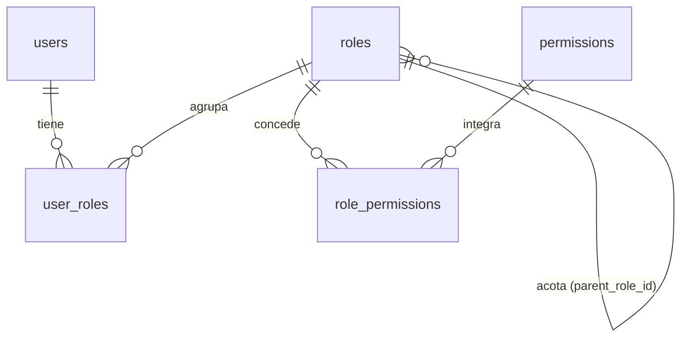
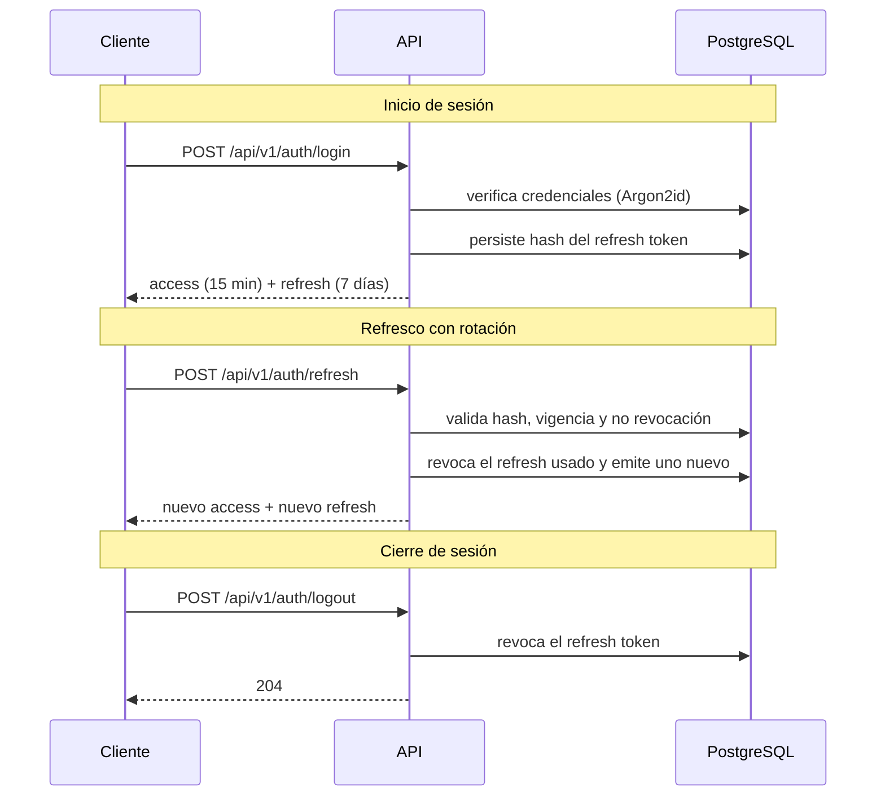

# Modelo de Seguridad — NEXUS

| Campo | Valor |
|---|---|
| Proyecto | NEXUS — Renovación de plataforma |
| Empresa | FACTECH GROUP SAS |
| Documento | `security.md` |
| Versión | 0.1.0 |
| Estado | Borrador |
| Responsable técnico | Bonilla Diaz William Steven |
| Fecha de creación | 19-08-2026 |
| Última actualización | 19-08-2026 |
| Documento superior | `constitution.md` v0.2.0 |
| Documento relacionado | `architecture.md` v0.1.0 |

---

## 1. Propósito y alcance

Este documento define **quién es quién** en NEXUS y **qué puede hacer cada quien**: el modelo de identidad, el modelo de autorización, el mecanismo de autenticación y los controles de protección de datos.

Desarrolla el Artículo IV de la constitución y resuelve la decisión D-08 registrada en `architecture.md` §16.

**Fuera de alcance:** la estructura de capas y el flujo de petición (`architecture.md`), y la especificación funcional del módulo de usuarios, que se documentará en `docs/requirements/`.

---

## 2. Principios rectores

1. **Denegar por defecto.** Todo lo que no está explícitamente permitido, está prohibido (Art. IV.1).
2. **Mínimo privilegio.** Cada actor recibe únicamente los permisos que su función exige (Art. IV.2).
3. **Nadie puede otorgar lo que no tiene.** Ningún actor puede crear un rol, ni asignar un permiso, que exceda sus propios privilegios.
4. **Todo acceso relevante deja rastro.** Autenticación, denegación y cambios de privilegio se auditan (Art. IV.7).
5. **La seguridad no depende del cliente.** Toda validación de autorización ocurre en el backend. Lo que el frontend oculte o muestre es una decisión de usabilidad, nunca un control de seguridad.

---

## 3. Modelo de identidad

### 3.1 Usuario

Un usuario es la representación de una persona que accede al sistema. Los procesos automáticos, cuando existan, usarán un tipo de identidad distinto que deberá especificarse antes de su implementación.

**Estados del usuario:**

| Estado | Significado | ¿Puede autenticarse? |
|---|---|---|
| `ACTIVO` | Operativo | Sí |
| `INACTIVO` | Deshabilitado administrativamente | No |
| `BLOQUEADO` | Bloqueado por intentos fallidos | No, hasta que expire el bloqueo o un administrador lo libere |
| `PENDIENTE` | Creado pero sin activar su credencial | No |

Un usuario **NO DEBE** eliminarse físicamente: se desactiva (Art. V.10). Eliminar el registro rompería la trazabilidad de todo lo que esa persona hizo (`created_by`, `audit_log`).

### 3.2 Credenciales

- Las contraseñas se almacenan con **Argon2id**, nunca en texto plano ni con hash reversible. Los parámetros de costo se declaran en configuración y se revisan periódicamente.
- El sistema **NO DEBE** poder recuperar una contraseña; solo restablecerla.
- La comparación de credenciales debe ser resistente a ataques de temporización.
- El mensaje de error ante credenciales inválidas **NO DEBE** revelar si el usuario existe.

**Política mínima de contraseña:** longitud mínima declarada en configuración, verificación contra una lista de contraseñas comunes, y prohibición de reutilizar la contraseña vigente. Reglas adicionales se definirán en la especificación del módulo de usuarios.

**Bloqueo por intentos fallidos:** tras N intentos fallidos consecutivos (N configurable), la cuenta pasa a `BLOQUEADO` por un tiempo creciente. Cada intento fallido se audita.

---

## 4. Modelo de autorización

### 4.1 Estructura

Control de acceso basado en roles (RBAC) con permisos explícitos:



- Un **usuario** puede tener **varios roles**.
- Un **rol** agrupa un conjunto explícito de **permisos**.
- Un **permiso** es la unidad atómica de autorización.
- Un rol **puede** declarar un **rol padre**, que actúa como **cota superior** de sus privilegios.

### 4.2 Contención de privilegios, no herencia

Esta es la decisión central del modelo y conviene entenderla con precisión.

El campo `parent_role_id` **no implica herencia**. Un rol hijo **no recibe** los permisos de su padre: declara los suyos de forma explícita, uno por uno.

Lo que el padre impone es un **techo**:

> Los permisos de un rol **DEBEN** ser un subconjunto de los permisos de su rol padre.
>
> `permisos(hijo) ⊆ permisos(padre)`

**Consecuencia operativa:** la resolución de permisos en tiempo de autorización **nunca recorre el árbol**. Se lee la lista explícita del rol y nada más. El árbol solo se consulta al **escribir** (crear un rol, modificar sus permisos o cambiar su padre), que es una operación poco frecuente.

**Por qué basta con validar un solo nivel:** la contención es transitiva. Si `hijo ⊆ padre` y `padre ⊆ abuelo`, entonces `hijo ⊆ abuelo` se cumple automáticamente. Validar contra el padre inmediato es suficiente para garantizar el invariante en toda la cadena, sin recorrerla.

**Ejemplo:**

| Rol | Padre | Permisos declarados | ¿Válido? |
|---|---|---|---|
| `SUPERADMIN` | — | Todos | Sí (rol raíz) |
| `ADMIN` | `SUPERADMIN` | `roles:read`, `roles:create`, `users:read`, `users:create` | Sí |
| `SUPERVISOR` | `ADMIN` | `roles:read`, `users:read` | Sí (subconjunto) |
| `AUDITOR` | `SUPERVISOR` | `users:read`, `users:delete` | **No** — `users:delete` no está en `SUPERVISOR` |

### 4.3 Reglas de negocio

| ID | Regla |
|---|---|
| **RN-SEG-001** | El código y el nombre de un rol son únicos en el sistema. |
| **RN-SEG-002** | Un rol tiene uno de los estados definidos: `ACTIVO` o `INACTIVO`. Un rol `INACTIVO` no concede permisos, aunque siga asignado. |
| **RN-SEG-003** | Los permisos de un rol deben ser un subconjunto de los permisos de su rol padre. La operación que viole esta condición se rechaza. |
| **RN-SEG-004** | La validación de RN-SEG-003 se realiza contra el rol padre inmediato. No se recorre la cadena de ancestros. |
| **RN-SEG-005** | Al revocar un permiso a un rol, si algún rol descendiente directo lo declara, la operación **se rechaza** e informa qué roles lo impiden. El sistema no revoca permisos en cascada de forma implícita. |
| **RN-SEG-006** | La cadena de roles padre no puede formar ciclos. Un rol no puede ser ancestro de sí mismo. |
| **RN-SEG-007** | Existe exactamente un rol raíz sin padre (`SUPERADMIN`), acotado por el catálogo completo de permisos. |
| **RN-SEG-008** | Un rol no puede eliminarse si tiene roles hijos o usuarios asignados. Debe desactivarse o reasignarse previamente. |
| **RN-SEG-009** | Los permisos efectivos de un usuario son la **unión** de los permisos de sus roles `ACTIVO`. |
| **RN-SEG-010** | Un actor no puede asignar a otro usuario un rol cuyos permisos no estén contenidos en sus propios permisos efectivos. |
| **RN-SEG-011** | Un usuario no puede modificar sus propios roles ni los permisos de los roles que tiene asignados. |
| **RN-SEG-012** | Los roles marcados como de sistema no pueden modificarse ni eliminarse por la API. |
| **RN-SEG-013** | Cambiar el rol padre de un rol exige revalidar RN-SEG-003 contra el nuevo padre. Si no se cumple, la operación se rechaza. |

**Advertencia sobre RN-SEG-009 y RN-SEG-010.** La contención opera **entre roles**, no sobre el conjunto efectivo del usuario. Dos roles individualmente acotados pueden, en unión, otorgar más de lo que cualquiera de ellos concede por separado. Por eso RN-SEG-010 existe: acota la **asignación** al privilegio efectivo de quien asigna. Sin esa regla, el modelo de contención sería evadible asignando varios roles.

### 4.4 Catálogo de permisos

Un permiso se identifica con el formato `<recurso>:<acción>`, en minúsculas:

```
roles:read      roles:create      roles:update      roles:delete
users:read      users:create      users:update      users:delete
audit:read
```

- El **recurso** corresponde a una entidad o agrupación funcional del módulo.
- La **acción** es una de un conjunto cerrado: `read`, `create`, `update`, `delete`, más acciones específicas del dominio cuando la especificación lo justifique (por ejemplo `users:reset-password`).
- El catálogo de permisos es **datos, no código**: se crea y modifica mediante migración Flyway. Agregar un rol nuevo o cambiar el alcance de uno existente **NO DEBE** requerir un despliegue.
- Cada permiso declara un nombre y una descripción legibles, para poder presentarlo en la interfaz de administración.
- La plantilla de requerimientos admite además la notación `role:<código>` cuando un requerimiento exige un rol concreto en lugar de un permiso. Su uso **DEBERÍA** ser excepcional: acoplar un endpoint a un rol específico anula la ventaja del modelo de permisos.

### 4.5 Resolución en tiempo de ejecución

1. El token de acceso transporta los **códigos de rol** del usuario, no la lista completa de permisos, para no inflar el token.
2. El backend resuelve `rol → permisos` desde una caché en memoria, invalidada ante cualquier cambio en `role_permissions` o en el estado de un rol.
3. Los permisos efectivos son la unión de los permisos de los roles activos (RN-SEG-009).

**Latencia de propagación de cambios** — consecuencia directa de este diseño, que debe conocerse:

| Cambio | Efecto |
|---|---|
| Se modifican los permisos de un rol | **Inmediato**, por invalidación de caché |
| Se activa o desactiva un rol | **Inmediato**, por invalidación de caché |
| Se asignan o quitan roles a un usuario | Hasta la expiración del token de acceso (máx. 15 min) |
| Se desactiva o bloquea un usuario | **Inmediato**: se revocan sus refresh tokens y se rechaza su token de acceso |

El último caso es el crítico y por eso se resuelve de forma explícita: la desactivación de un usuario **DEBE** verificarse contra el estado vigente, no confiar únicamente en la expiración del token.

---

## 5. Autenticación

### 5.1 Decisión D-08

**Token de acceso JWT de vida corta, más refresh token opaco, persistido y revocable.**

Combina las dos propiedades que se necesitan a la vez: validar la mayoría de peticiones sin consultar la base de datos (backend stateless, `architecture.md` §4), y poder cerrar sesión de verdad o expulsar a un usuario comprometido.

### 5.2 Tokens

| | Token de acceso | Refresh token |
|---|---|---|
| Formato | JWT firmado | Valor opaco aleatorio |
| Vida | 15 minutos | 7 días (configurable) |
| Almacenamiento en servidor | Ninguno | Solo su hash, en `refresh_tokens` |
| Revocable | No, expira | Sí, inmediatamente |
| Se envía en | `Authorization: Bearer <token>` | Únicamente al endpoint de refresco |

**Claims del token de acceso:** `iss`, `sub` (id del usuario), `jti`, `iat`, `exp` y los códigos de rol. **NO DEBEN** incluirse datos personales, correo, ni información sensible: un JWT va firmado, no cifrado, y cualquiera que lo posea puede leer su contenido.

El secreto de firma llega por variable de entorno `JWT_SECRET` (Art. IX.1) y **NO DEBE** tener valor por defecto en ningún entorno (Art. IX.5).

### 5.3 Flujos



### 5.4 Rotación y detección de reutilización

Cada uso de un refresh token lo **revoca** y emite uno nuevo (rotación). Se conserva el vínculo con el token que lo reemplazó.

Si llega un refresh token **ya revocado**, el sistema asume robo de credenciales: **revoca toda la familia de tokens de esa sesión**, obliga a autenticarse de nuevo y registra un evento de seguridad de severidad alta. Sin esta regla, la rotación no aporta protección real.

### 5.5 Reglas adicionales

- Al desactivar, bloquear o cambiar la contraseña de un usuario, **DEBEN** revocarse todos sus refresh tokens.
- El endpoint de login **DEBE** tener limitación de tasa por credencial y por origen.
- Los endpoints de autenticación **NO DEBEN** revelar si un usuario existe, ni en el mensaje ni en el tiempo de respuesta.
- Los refresh tokens expirados o revocados se purgan según la política de retención.

---

## 6. Aplicación de la autorización

- La autorización se declara en la capa `api` (`architecture.md` §5.1), mediante anotaciones sobre cada endpoint.
- Un endpoint **sin declaración explícita** de permiso queda **inaccesible**, no público. La configuración por defecto deniega, y la excepción (endpoints públicos como login o salud) se declara en una lista explícita y corta, revisable de un vistazo.
- La verificación de propiedad del dato (que un usuario solo acceda a sus propios registros, cuando aplique) es responsabilidad de la capa `application` y **DEBE** especificarse por requerimiento. Un permiso concede la capacidad de ejecutar una acción, no el derecho sobre un registro concreto.
- Ante falta de permiso se responde `403`; ante ausencia o invalidez del token, `401` (`architecture.md` §7.2).
- **NO DEBE** usarse `404` para ocultar la existencia de un recurso salvo que la especificación lo exija de forma expresa y justificada.

---

## 7. Protección de datos

### 7.1 Secretos

- Ningún secreto en el repositorio, en ninguna forma (Art. IV.3): ni en código, ni en pruebas, ni en comentarios, ni en `.env` versionado, ni en el historial de Git.
- `.env.example` documenta las variables **sin valores reales** (Art. IX.3).
- Si un secreto llega a comprometerse, se **rota**; eliminarlo del historial no lo vuelve seguro, porque ya fue expuesto.

### 7.2 Datos en tránsito y en reposo

- HTTPS obligatorio en `testing` y `production` (Art. IV.6).
- Las credenciales de base de datos y el secreto de firma se inyectan por entorno.
- El cifrado a nivel de columna, si algún dato lo requiere, se decidirá por requerimiento y se documentará aquí.

### 7.3 Enmascaramiento en registros

Implementa el Art. XV.5. Antes de persistir cualquier contenido en `request_log` o de emitirlo a los logs de aplicación:

- Se enmascaran contraseñas, tokens, cabeceras `Authorization` y `Cookie`, y datos personales sensibles.
- El enmascaramiento opera por **lista de inclusión**: solo se registra lo declarado explícitamente como registrable. Un campo nuevo que nadie declaró se enmascara por defecto.
- Los cuerpos de los endpoints de autenticación **NO DEBEN** registrarse en absoluto.

### 7.4 Validación de entrada

- Toda entrada externa se valida en el borde, antes de alcanzar la capa `application` (Art. IV.4).
- Acceso a datos exclusivamente por consultas parametrizadas (Art. IV.5).
- Las respuestas de error no exponen trazas, SQL, rutas ni versiones (Art. VI.5).

---

## 8. Auditoría de seguridad

Los siguientes eventos **DEBEN** registrarse en `audit_log` (Art. IV.7), además del `request_log` general:

| Evento | Severidad |
|---|---|
| Inicio de sesión exitoso | Informativa |
| Inicio de sesión fallido | Media |
| Bloqueo de cuenta por intentos fallidos | Alta |
| Reutilización de un refresh token revocado | **Alta** |
| Cierre de sesión | Informativa |
| Denegación de autorización (`403`) | Media |
| Creación, modificación o eliminación de un rol | Alta |
| Cambio de permisos de un rol | **Alta** |
| Asignación o retiro de roles a un usuario | **Alta** |
| Cambio de estado de un usuario | Alta |
| Cambio o restablecimiento de contraseña | Alta |

Los registros de auditoría **NO DEBEN** contener contraseñas ni tokens, ni siquiera en su forma hasheada (Art. IV.8). El `audit_log` no se purga sin decisión documentada (Art. XV.8).

---

## 9. Modelo de datos de seguridad

Estructura lógica. Las columnas exactas se fijan en la migración Flyway correspondiente, que es la fuente de verdad (Art. V.3).

| Tabla | Propósito | Campos distintivos |
|---|---|---|
| `users` | Identidad y credencial | `username`, `email`, `password_hash`, `status`, `failed_attempts`, `locked_until`, `last_login_at` |
| `roles` | Agrupación de permisos | `code`, `name`, `description`, `parent_role_id`, `status`, `is_system` |
| `permissions` | Catálogo de permisos | `code`, `resource`, `action`, `name`, `description` |
| `role_permissions` | Permisos declarados por rol | `role_id`, `permission_id` |
| `user_roles` | Roles asignados a usuarios | `user_id`, `role_id`, `assigned_at`, `assigned_by` |
| `refresh_tokens` | Sesiones revocables | `user_id`, `token_hash`, `expires_at`, `revoked_at`, `replaced_by_id`, `ip`, `user_agent` |

Todas siguen las convenciones de `architecture.md` §6: clave primaria `uuid` v7, columnas de auditoría obligatorias y restricciones declaradas en el esquema.

**Restricciones que deben existir en la base de datos, no solo en Java** (Art. V.6):

- `uq_roles_code`, `uq_roles_name`, `uq_permissions_code`, `uq_users_username`, `uq_users_email`.
- Clave primaria compuesta en `role_permissions (role_id, permission_id)` y en `user_roles (user_id, role_id)`.
- `fk_roles_parent` autorreferenciada con restricción de eliminación (RN-SEG-008).
- `CHECK` sobre los estados de `users` y `roles`.
- Índice único sobre `refresh_tokens.token_hash`.

**Nota sobre el modelo actual.** El modelo `modelo_v1.mwb` contiene `roles.assigned_role_id`. Este documento lo denomina `parent_role_id`, que expresa su intención real: acotar privilegios, no asignar. La migración Flyway usará el nombre `parent_role_id`; el modelo gráfico es material de referencia y no autoridad sobre el esquema (Art. V.3).

---

## 10. Amenazas consideradas

| Amenaza | Mitigación |
|---|---|
| Escalamiento de privilegios al crear roles | RN-SEG-003: contención respecto del rol padre |
| Escalamiento al asignar roles | RN-SEG-010: acotado al privilegio efectivo de quien asigna |
| Escalamiento sobre uno mismo | RN-SEG-011: nadie edita sus propios privilegios |
| Robo de token de acceso | Vida de 15 min; sin datos sensibles en el payload |
| Robo de refresh token | Rotación con detección de reutilización (§5.4) |
| Sesión que sobrevive a la baja del usuario | Revocación de refresh tokens y verificación de estado vigente |
| Fuerza bruta sobre credenciales | Bloqueo progresivo, limitación de tasa, Argon2id |
| Enumeración de usuarios | Respuestas y tiempos indistinguibles |
| Inyección SQL | Consultas parametrizadas (Art. IV.5) |
| Fuga de datos por registros | Enmascaramiento por lista de inclusión (§7.3) |
| Secreto filtrado en el repositorio | Prohibición absoluta y política de rotación (§7.1) |
| Endpoint publicado por olvido | Denegar por defecto; lista explícita de endpoints públicos (§6) |

---

## 11. Requerimientos no funcionales de seguridad

| ID | Requerimiento | Verificación |
|---|---|---|
| **RNF-SEG-001** | El sistema implementa autenticación y autorización basada en roles y permisos. | Pruebas de integración por endpoint |
| **RNF-SEG-002** | Todo endpoint no declarado como público exige autenticación. | Prueba automatizada que recorre el catálogo de endpoints |
| **RNF-SEG-003** | Ningún secreto está presente en el repositorio. | Verificación automatizada en CI |
| **RNF-SEG-004** | Las contraseñas se almacenan con Argon2id. | Revisión de código e inspección de esquema |
| **RNF-SEG-005** | Ningún registro contiene contraseñas, tokens ni cabeceras de autorización. | Prueba sobre el enmascarador |
| **RNF-SEG-006** | Los eventos de seguridad de §8 quedan registrados en `audit_log`. | Pruebas de integración por evento |

RNF-SEG-002 merece atención: es una prueba que enumera los endpoints registrados y verifica que cada uno declara su exigencia de permiso. Es la única forma de garantizar que un endpoint nuevo no quede expuesto por descuido.

---

## 12. Decisiones y pendientes

**Cerradas en este documento**

| # | Decisión | Resolución |
|---|---|---|
| D-08 | Mecanismo de autenticación | JWT de acceso de 15 min más refresh token opaco, revocable y con rotación |
| D-12 | Jerarquía de roles | Contención de privilegios vía `parent_role_id`, sin herencia ni recorrido de árbol |
| D-13 | Granularidad de permisos | Permisos `recurso:acción` como datos, asignados a roles |
| D-14 | Roles por usuario | Múltiples roles; permisos efectivos por unión |
| D-15 | Algoritmo de hash de contraseñas | Argon2id |

**Pendientes**

| # | Pendiente | Bloquea |
|---|---|---|
| D-16 | Parámetros concretos: vida de tokens, N de intentos fallidos, duración del bloqueo, longitud mínima de contraseña | Configuración del módulo de usuarios |
| D-17 | Catálogo inicial completo de permisos y roles de sistema | Primera migración de seguridad |
| D-18 | Política de restablecimiento de contraseña (canal, vigencia del enlace) | Módulo de usuarios |
| D-19 | Identidad para procesos automáticos e integraciones | Cuando exista la primera integración |

---

## 13. Control de cambios

| Versión | Fecha | Cambio | Responsable |
|---|---|---|---|
| 0.1.0 | 19-08-2026 | Creación inicial. Cierra D-08 y define el modelo de contención de privilegios. | Responsable técnico |
