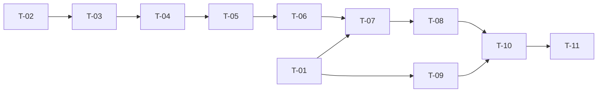

# TASKS — `RF-MV-017` Consultar las líneas de venta

| Campo | Valor |
|---|---|
| Requerimiento | `RF-MV-017` |
| Especificación | [`spec.md`](spec.md) |
| Plan | [`plan.md`](plan.md), aprobado el 23-09-2026 |
| Estado | **En revisión** |
| Issue | Pendiente de crear |
| Rama | `feature/lineas-de-venta` |
| Autor | Responsable técnico |

---

## 1. Tareas

| ID | Tarea | Depende de | Verificación | Estado |
|---|---|---|---|---|
| `T-01` | Migración `V37__mv_semilla_permiso_lineas_de_venta.sql`: `movements:list-sale-lines` con identificador literal, asociado **solo** a `SUPERADMIN` y `ADMIN`, con las guardas de 135 / 135 / 129 y la de contención de `RN-SEG-003` | `RF-MV-016` `V36` | `CA-MV-177`; la migración falla con mensaje propio si el catálogo no está en 134 | Pendiente |
| `T-02` | `SaleLinesRequest` en `application`: los diez parámetros, con los estados y las fechas **como texto** para que su `400` viaje junto a los demás | — | `CA-MV-174` | Pendiente |
| `T-03` | `MovementRepository`: `findSaleLines` y `countSaleLines`, con los registros `SaleLinesFilter` y `SaleLineRow` | `T-02` | Firma usada por `T-05` | Pendiente |
| `T-04` | `JpaMovementRepository`: las dos sentencias. Una sola para la página —con el **`LEFT JOIN`** del vendedor, el predicado `mt.code = 'VENTA'` y el orden con desempate determinista— y el conteo con `BoundedCount` | `T-03` | `CA-MV-163`, `CA-MV-165`, `CA-MV-175`, `CA-MV-178`, `CA-MV-179` | Pendiente |
| `T-05` | `SaleLineResponse` y `ListSaleLinesService`: los seis `400` **juntos**, la página y el total acotado. `@Transactional(readOnly = true)` | `T-04` | `CA-MV-164`, `CA-MV-166` a `CA-MV-174` | Pendiente |
| `T-06` | `MovementController`: `GET /api/v1/movements/sales/lines` con `movements:list-sale-lines`, y la **prosa OpenAPI** —que es de administración y **no** tiene alcance, que la fila es la línea y no la venta, que el nombre del producto es el congelado, que el vendedor puede venir nulo y que el total puede no ser exacto | `T-05` | `CA-MV-176` | Pendiente |
| `T-07` | `EndpointPermissionsIT` con la ruta en `PERMISO_DE_CADA_OPERACION`; `OpenApiContractIT` con su `x-required-permission`; las **cuatro** suites del catálogo a **135** | `T-01`, `T-06` | `CA-MV-176`, `CA-MV-177` | Pendiente |
| `T-08` | `SaleLinesIT` con el fixture del plan §11: `CA-MV-163` a `CA-MV-176`, `CA-MV-178` y `CA-MV-179` | `T-07` | Dieciséis de los diecisiete criterios | Pendiente |
| `T-09` | `SaleLinesPermissionSeedIT`: la siembra de `V37`, los recuentos y que **ningún otro rol** lo porta | `T-01` | `CA-MV-177` | Pendiente |
| `T-10` | Contrato regenerado y comparado —solo altas— y `api/index.md` con su fila | `T-08`, `T-09` | El diff del contrato no toca ninguna forma existente | Pendiente |
| `T-11` | Matriz de `docs/requirements.md`, la ficha de `requirements/mv.md` §4.1 y los estados de esta tripleta | `T-10` | La fila de `RF-MV-017` refleja el estado | Pendiente |
| `T-12` | **La enmienda 0.2.0**: el filtro `typeStatus` de punta a punta —`SaleLinesRequest`, `SaleLinesFilter`, el `JOIN` de `movement_type_statuses` en las dos sentencias, la validación contra `existsTypeStatusCode` y el parámetro documentado en el controlador—, **sin publicar el campo** | `T-08` | `CA-MV-180`, `CA-MV-181` | Pendiente |

## 2. Orden de ejecución

**`T-02` abre y no espera a la migración**, que es lo que permite avanzar mientras `RF-MV-016` se integra: el cuerpo, el repositorio y el servicio no dependen del permiso. Lo que no se puede correr sin `V37` es `T-07` en adelante, porque `EndpointPermissionsIT` exige que toda ruta declare un permiso **que exista**.

## 3. Cobertura de los criterios de aceptación

| Criterio | Tareas |
|---|---|
| `CA-MV-163`, `CA-MV-164` | `T-04`, `T-05`, `T-08` |
| `CA-MV-165` | `T-04`, `T-08` |
| `CA-MV-166` a `CA-MV-173` | `T-05`, `T-08` |
| `CA-MV-174` | `T-02`, `T-05`, `T-08` |
| `CA-MV-175` | `T-04`, `T-08` |
| `CA-MV-176` | `T-06`, `T-07`, `T-08` |
| `CA-MV-177` | `T-01`, `T-07`, `T-09` |
| `CA-MV-178` | `T-04`, `T-08` |
| `CA-MV-179` | `T-04`, `T-08` |
| `CA-MV-180`, `CA-MV-181` | `T-12` |

## 4. Bloqueos

| # | Bloqueo | Desde | Responsable | Estado |
|---|---|---|---|---|
| 1 | ~~**`V37` espera a que `RF-MV-016` integre su `V36`.**~~ **Cerrado el 23-09-2026**: su PR #104 se mezcló en `feature/academia` con *merge commit* y sin *squash*, de modo que esta rama —que se rebasó sobre la suya— conserva los hashes y la guarda encuentra el catálogo en 134. No hubo que renumerar nada; sí hubo que **mover el sufijo del identificador** del permiso, porque los dos habíamos tomado el `000009`. Lo que sigue Su migración deja el catálogo en 134 y la guarda de la mía lo exige ahí. Acordado con esa sesión el 23-09-2026: su rama se mezcla primero. Si el orden se invierte, esta tripleta **renumera** a `V36` y permiso 134 | 23-09-2026 | Responsable técnico | **Abierto** |
| 2 | ~~**Los fixtures tendrán que poner `type_status_id`**~~ **Cerrado el 23-09-2026** con la subconsulta por código, más el estado propio del movimiento de otro tipo y la limpieza en orden —los estados antes del tipo, que la clave ajena es `RESTRICT`—. Lo que decía en las ventas que insertan a mano, en cuanto `RF-MV-016` añada esa columna (`NOT NULL`, sin `DEFAULT`). No afecta al código de producción, solo a `SaleLinesIT`, y se resuelve al integrar con la subconsulta que esa sesión dejó escrita | 23-09-2026 | Responsable técnico | **Abierto** |

## 5. Definición de terminado

- [ ] Todas las tareas en estado `Hecha`.
- [ ] Todos los criterios de aceptación con prueba automatizada en verde.
- [ ] La consulta cuesta **dos sentencias**, con una fila y con veinte.
- [ ] Una línea sin vendedor **sale**, con `seller` presente y nulo.
- [ ] `GET /movements/sales/lines` consta en `EndpointPermissionsIT` con `movements:list-sale-lines`.
- [ ] `V37` siembra el permiso solo para `SUPERADMIN` y `ADMIN`, y el catálogo cuenta 135.
- [ ] El filtro `typeStatus` acota y su `400` viaja con los demás, **y el campo no aparece en la fila** (0.2.0).
- [ ] `mvn verify` en verde en local; CI en el PR.
- [ ] El contrato OpenAPI coincide con el comportamiento real, **prosa incluida**.
- [ ] Documentación afectada actualizada en el mismo Pull Request.
- [ ] Matriz de trazabilidad actualizada.
- [ ] Pull Request aprobado por alguien distinto del autor e integrado.
