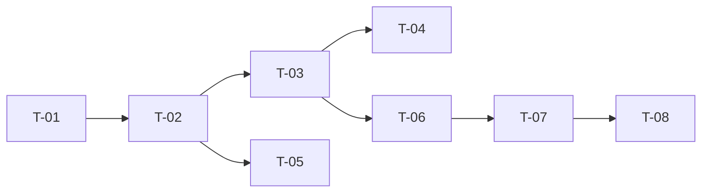

# TASKS — `RF-XXX-NNN` [Nombre de la funcionalidad]

| Campo | Valor |
|---|---|
| Requerimiento | `RF-XXX-NNN` |
| Especificación | [`spec.md`](spec.md) |
| Plan | [`plan.md`](plan.md) |
| `plan.md` aprobado el | [DD-MM-AAAA] |
| Estado | Borrador · En revisión · **Aprobadas** |
| Issue | `#NN` |
| Rama | `feature/[descripcion]` |
| Aprobadas por | [Responsable técnico] |

!!! info "Qué va en este documento"

    **En qué pasos, en qué orden y cómo se verifica cada uno.**

    **Prueba de pertenencia:** si no puede marcarse como hecho, no es una tarea.

    **Es la fuente de verdad de las tareas.** El Issue de GitHub coordina y enlaza aquí; no la sustituye ni la duplica. Si las dos listas discrepan, manda este archivo.

    No se escribe hasta que `plan.md` esté aprobado, y ninguna tarea se ejecuta hasta que este documento lo esté (Art. I.6).

---

## 1. Tareas

Cada tarea debe ser del tamaño de un commit y tener una verificación objetiva. «Implementar el módulo» no es una tarea; «crear la migración `V4__create_roles.sql` y que `mvn flyway:info` la muestre aplicada» sí.

| # | Tarea | Depende de | Verificación | Estado |
|---|---|---|---|---|
| `T-01` | [Migración de esquema] | — | `mvn flyway:info` la lista aplicada | Pendiente |
| `T-02` | [Entidad de dominio y reglas `RN-…`] | `T-01` | Prueba unitaria en verde, sin Spring | Pendiente |
| `T-03` | [Caso de uso y transaccionalidad] | `T-02` | Prueba con dobles en verde | Pendiente |
| `T-04` | [Evento de auditoría] | `T-03` | Prueba de integración verifica la fila escrita | Pendiente |
| `T-05` | [Repositorio y adaptador] | `T-02` | Prueba de integración con Testcontainers | Pendiente |
| `T-06` | [Endpoint, DTOs y permiso] | `T-03` | Prueba de API cubre `2xx` y errores | Pendiente |
| `T-07` | [Documentación OpenAPI] | `T-06` | El contrato publicado coincide con el real | Pendiente |
| `T-08` | [Actualizar matriz de trazabilidad] | `T-06` | La fila del `RF` refleja el estado | Pendiente |

**Estados:** `Pendiente` · `En curso` · `Hecha` · `Bloqueada`.

## 2. Orden de ejecución

Las tareas sin dependencia entre sí pueden ejecutarse en paralelo.

## 3. Cobertura de los criterios de aceptación

Toda fila de `spec.md` §12 debe aparecer aquí. Un criterio sin tarea que lo cubra es una funcionalidad que nadie va a implementar.

| Criterio | Tarea que lo cubre |
|---|---|
| `CA-XXX-001` | `T-06` |

## 4. Bloqueos

| # | Bloqueo | Desde | Responsable | Estado |
|---|---|---|---|---|
| 1 | [Qué impide avanzar] | [Fecha] | [Quién] | Abierto / Resuelto |

## 5. Definición de terminado

El requerimiento no está terminado hasta cumplir **todas** las condiciones de la constitución §16:

- [ ] Todas las tareas en estado `Hecha`.
- [ ] Todos los criterios de aceptación con prueba automatizada en verde.
- [ ] `mvn verify` en verde en local.
- [ ] Toda escritura emite su evento de auditoría, en la transacción que corresponde.
- [ ] Los endpoints nuevos declaran su permiso.
- [ ] El contrato OpenAPI coincide con el comportamiento real.
- [ ] Documentación afectada actualizada en el mismo Pull Request.
- [ ] Matriz de trazabilidad actualizada.
- [ ] Pull Request aprobado por alguien distinto del autor e integrado.
