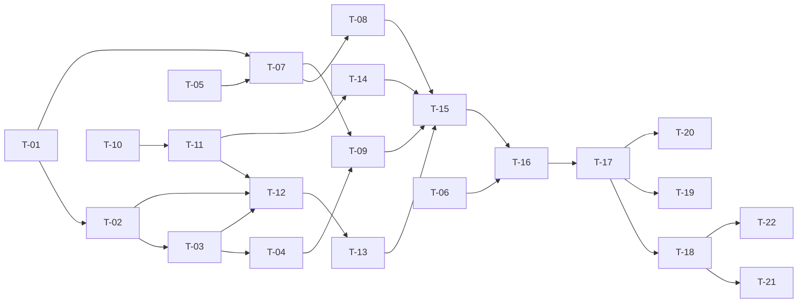

# TASKS — `RF-SP-001` Registrar rol

| Campo | Valor |
|---|---|
| Requerimiento | `RF-SP-001` |
| Especificación | [`spec.md`](spec.md) |
| Plan | [`plan.md`](plan.md) |
| `plan.md` aprobado el | 21-08-2026 |
| Estado | **Aprobadas** |
| Issue | Pendiente de crear |
| Rama | `feature/registrar-rol` |
| Aprobadas por | Responsable técnico el 22-08-2026 |

!!! info "Qué va en este documento"

    **En qué pasos, en qué orden y cómo se verifica cada uno.**

    **Prueba de pertenencia:** si no puede marcarse como hecho, no es una tarea.

    **Es la fuente de verdad de las tareas.** El Issue de GitHub coordina y enlaza aquí; no la sustituye ni la duplica. Si las dos listas discrepan, manda este archivo.

    No se escribe hasta que `plan.md` esté aprobado, y ninguna tarea se ejecuta hasta que este documento lo esté (Art. I.6).

---

## 1. Tareas

`RF-SP-001` es el primer requerimiento que escribe en base de datos, de modo que su lista de tareas incluye la infraestructura compartida que todo módulo posterior reutiliza: los cuatro registros de auditoría, la jerarquía de errores, el generador de identificadores y la publicación del actor autenticado hacia `application`. Eso explica su tamaño frente al de los requerimientos que vienen después.

**Prerrequisito:** `V1__create_shared_functions.sql`, `V2__create_permissions.sql` y `V3__seed_permissions.sql` pertenecen a `RF-SP-010` y deben estar aplicadas antes de `T-01`. No se replican aquí.

| # | Tarea | Depende de | Verificación | Estado |
|---|---|---|---|---|
| `T-01` | Migración `V4__create_audit_logs.sql`: los cuatro registros con su núcleo común, la vista `v_audit_timeline`, los índices de `architecture.md` §6.6.6 y los `CHECK` de dominio cerrado. Incluye las **cuatro correcciones consolidadas** de la nota de abajo | — | `mvn flyway:info` la lista aplicada, y pruebas de integración para cada restricción: un `INSERT` en `audit_error_log` con estado HTTP `403` falla, un motivo de tres caracteres se acepta y uno vacío no, y `event_type` acepta los dieciséis literales y ningún otro | Hecha |
| `T-02` | Migración `V5__create_roles.sql`: tabla `roles`, índices únicos parciales, clave foránea al padre, y los `CHECK` de estado, clasificación, formato de código, longitud de descripción y raíz única | `T-01` | `mvn flyway:info` la lista aplicada; prueba de integración que ejercita cada restricción con un `INSERT` que debe fallar | Hecha |
| `T-03` | Migración `V6__create_role_permissions.sql`: clave primaria compuesta, ambas claves foráneas con `ON DELETE RESTRICT` e índice sobre `permission_id` | `T-02` | `mvn flyway:info` la lista aplicada; prueba de integración: el par duplicado falla, y el borrado físico del rol asociado también | Hecha |
| `T-04` | Migración `V7__seed_system_roles.sql`: los siete roles de sistema con identificadores UUID v7 literales, los permisos de `SUPERADMIN`, `ADMIN` y `CONTABILIDAD`, y una fila de `audit_change_log` por rol | `T-03` | Prueba de integración: existe exactamente un rol raíz; `ADMIN` **no** declara `audit:read-security` **ni `currencies:update`**, y `SUPERADMIN` sí declara el catálogo completo; y hay siete filas de auditoría con actor, correlación e IP en nulo | Hecha |
| `T-05` | `shared/persistence/UuidV7Generator`: generación del identificador en la aplicación | — | Prueba unitaria: el valor generado es versión 7, es único y crece de forma monótona en el tiempo | Hecha |
| `T-06` | `shared/error`: jerarquía de excepciones de `development-guide.md` §7.1 —incluida `UnprocessableEntityException`— y `GlobalExceptionHandler` con el formato Problem Details de `architecture.md` §7.3 | — | Prueba de `MockMvc` sobre un controlador de prueba: cada excepción produce su estado, su `type`, su `error_code` y su `correlationId` | Hecha |
| `T-07` | `shared/audit`: puerto `AuditWriter` y sus cuatro adaptadores JPA, con el núcleo común tomado del contexto de la petición | `T-01`, `T-05` | Prueba de integración con Testcontainers: cada adaptador escribe su fila con instante, actor, correlación, IP y agente de usuario | Hecha |
| `T-08` | Mecánica transaccional de la auditoría: `REQUIRES_NEW` para el registro de errores, y emisión del evento de seguridad enganchada al commit de la transacción de negocio | `T-07` | Pruebas de integración: al revertirse la transacción sobrevive la fila de `audit_error_log` y **no** queda ninguna de `audit_security_log`; al confirmarse, la de seguridad se escribe | Hecha |
| `T-09` | `shared/security`: publicación hacia `application` del actor autenticado y sus permisos efectivos leídos de base de datos, y emisión del evento de denegación de autorización | `T-04`, `T-07` | Prueba de API: un actor sin el permiso exigido recibe `403` sin entrar al caso de uso y deja el evento en `audit_security_log` con resultado de fallo | Hecha |
| `T-10` | `domain`: objetos de valor `RoleCode` y `PermissionCode` y enumerados `RoleType` y `RoleStatus`, con los valores exactos que se persisten | — | Prueba unitaria sin Spring: `RoleCode` rechaza minúsculas, guion medio, espacios, inicio por dígito y exceso de longitud, y no normaliza | Hecha |
| `T-11` | `domain`: agregado `Role`, fábrica `Role.create` con `RN-SP-002`, `RN-SP-003`, `RN-SEG-003` y `RN-SEG-010`, estado activo no admitido como argumento, y los puertos `RoleRepository` y `PermissionCatalog` | `T-10` | Pruebas unitarias sin Spring ni base de datos: alta válida, alta sin permisos, permiso fuera del padre, permiso fuera del actor y clasificación distinta de la del padre | Hecha |
| `T-12` | `infrastructure`: `RoleEntity`, `RolePermissionEntity`, `RolePermissionId` y `RoleJpaMapper`, con relaciones perezosas y el agregado sin anotaciones de JPA | `T-02`, `T-03`, `T-11` | Prueba de integración: el mapeo va y vuelve sin pérdida | Hecha |
| `T-13` | `infrastructure/JpaRoleRepository`: `save`, `findById`, `existsActiveCode`, `existsActiveName` y traducción de la violación de índice único a la excepción de duplicado **por nombre de restricción** | `T-12` | Prueba de integración: `uq_roles_code` y `uq_roles_name` producen excepciones distinguibles, y ninguna se decide por el texto del mensaje del driver | Hecha |
| `T-14` | `infrastructure/JpaPermissionCatalog`: resolución de un conjunto de identificadores contra la tabla `permissions` | `T-11` | Prueba de integración: devuelve los permisos existentes y señala cuáles del conjunto no están en el catálogo | Hecha |
| `T-15` | `application`: `CreateRoleCommand`, `CreateRoleService` con `@Transactional`, el orden de verificación de `plan.md` §4 y los puertos `AuthenticatedActor` y `RoleChangeAuditor`. El evento de seguridad usa el literal `ROLE_CREATED`, que fija `RF-SP-014` §2 | `T-08`, `T-09`, `T-13`, `T-14` | Pruebas con dobles: cada excepción de `spec.md` §10 se lanza en el orden declarado, y el evento de cambio se emite con el estado inicial completo | Hecha |
| `T-16` | `api`: `CreateRoleRequest` con Bean Validation, `RoleResponse`, `RoleSummaryResponse` y `PermissionResponse`, recorte de nombre y descripción, colapso de permisos duplicados y rechazo de campos desconocidos | `T-15` | Prueba de API: las validaciones de formato se devuelven **todas juntas** en `errors`, y un cuerpo que incluya `status` o `isSystem` recibe `400` | Hecha |
| `T-17` | `api/RoleController`: `POST /api/v1/roles` con el permiso `roles:create` declarado sobre el método, respuesta `201` y cabecera `Location` | `T-16` | Prueba de API: el alta correcta devuelve `201`, `Location: /api/v1/roles/{id}` y el rol con su padre y sus permisos | Hecha |
| `T-18` | Pruebas de API de los criterios de aceptación de `spec.md` §12, una por criterio | `T-17` | La suite cubre `CA-SP-001` a `CA-SP-008`, `CA-SP-144`, `CA-SP-145` y `CA-SP-146`, con sus estados y sus `error_code` | Hecha |
| `T-19` | Pruebas de los casos límite de `spec.md` §13: padre eliminado lógicamente, permisos duplicados en la petición, alta concurrente con el mismo código y unicidad del rol raíz | `T-17` | El alta concurrente produce un `201` y un `409`, nunca un `500`; el resto se comporta según `plan.md` §11 | Hecha |
| `T-20` | Prueba de ArchUnit: `domain` no importa Spring, JPA ni `jakarta.servlet`, y `api` no accede a `infrastructure` | `T-17` | La prueba falla al introducir a propósito la dependencia prohibida | Hecha |
| `T-21` | Documentación OpenAPI del endpoint: petición, respuesta `201` y los estados `400`, `401`, `403`, `409`, `422` y `500` | `T-18` | El contrato publicado coincide con el comportamiento real (Art. VIII.6) | Hecha |
| `T-22` | Actualizar la matriz de trazabilidad de `docs/requirements.md` | `T-18` | La fila de `RF-SP-001` refleja el estado y enlaza esta tripleta | Hecha |

**Estados:** `Pendiente` · `En curso` · `Hecha` · `Bloqueada`.

!!! warning "Enmiendas aplicadas al ejecutar estas tareas — 22-08-2026"

    `plan.md` se aprobó el 21-08-2026 sobre la disposición de capas anterior. El 22-08-2026 `architecture.md` §5.1 cambió y **declara de forma expresa** que los planes de `RF-SP-001` a `RF-SP-009` quedaron escritos sobre la anterior, y que los puntos en conflicto **deben resolverse al aprobar sus tareas**: «o se reescriben esas tareas, o la regla de ArchUnit se acota a lo que esta sección permite». Se toma esa segunda vía, que es la que el documento transversal admite y la que ya sigue el código implantado de `RF-SP-010`.

    | Tarea | Lo que pedía | Lo que se hizo, y por qué |
    |---|---|---|
    | `T-11` | Probar el agregado «sin Spring ni base de datos» | Se prueba sin Spring y sin base de datos, pero **con JPA en el classpath**: `Role` es a la vez agregado y modelo persistente. Lo que se pierde —la garantía de que *no pueda* depender de la base— está declarado en §5.1 como coste asumido |
    | `T-12` | `RoleEntity`, `RolePermissionEntity`, `RolePermissionId` y `RoleJpaMapper` | **No existen.** §5.1 sitúa el modelo persistente en `domain/models`, de modo que no hay dos representaciones que unir y el `mapper` no tiene nada que mapear. La asociación rol–permiso se mapea como `@ElementCollection` sobre `role_permissions` |
    | `T-20` | Fallar si `domain` importa JPA | La regla se **acota**: se verifica que `domain/models` no conoce HTTP ni el contenedor de Spring, que `interfaces` no alcanza `domain/repository`, que `application` no conoce persistencia ni transporte y que `shared` no depende de ningún módulo. Cinco reglas, todas en verde |
    | `T-15`, `T-17` | `application` / `api` como capas propias | El caso de uso vive en `domain/service` y el controlador en `interfaces`, según §5.1 |

    Dos decisiones más, ajenas a ese cambio:

    - **`role_type` de los siete roles de sistema no lo declara ninguna fuente.** `requirements/sp.md` §4.1 fija código, nombre, padre e `is_system`, pero no la clasificación. Se deriva de §10.2, que identifica como fuerza comercial exactamente a manager, director y agente: esos tres se siembran `VENDEDOR` y los cuatro restantes `FUNCIONARIO`. Queda anotado por si el negocio lo corrige.
    - **`ck_deletion_reason` gana `reason IS NOT NULL`.** Tal como lo transcribe `architecture.md` §6.6.3, un motivo nulo daba `FALSE OR NULL` = `NULL`, y un `CHECK` que evalúa a `NULL` **acepta la fila**: la obligación del Art. V.13 no existía. Se corrige en `V4` y se verifica con prueba propia. `architecture.md` §6.6.3 debería recoger la corrección.
    - **springdoc pasa de 2.6.0 a 2.8.9.** `/v3/api-docs` devolvía `500` —`NoSuchMethodError` sobre `ControllerAdviceBean.<init>(Object)`, un constructor que Spring Framework 6.2 retiró y que springdoc 2.6.0 todavía invoca—, de modo que **el contrato no se generaba en absoluto** y `RF-SP-010` tampoco figuraba en él. El fallo estaba latente desde que se fijó la versión: solo se manifiesta cuando existe un `@ControllerAdvice` que springdoc tenga que inspeccionar, y el primero lo crea `T-06`. Se añade `OpenApiContractIT`, que verifica que las rutas publicadas están.

!!! warning "Las correcciones de `V4` se consolidan en `T-01`"

    `V4__create_audit_logs.sql` es la migración de este requerimiento, pero **cuatro planes posteriores decidieron sobre ella**. Todas las correcciones van aquí, en la migración que crea las tablas, y no en migraciones de alteración: nada está desplegado, de modo que hoy cuestan una edición y después costarían validar las filas existentes de una tabla en uso.

    | Corrección | La decide | Qué añade |
    |---|---|---|
    | `ck_audit_error_log_status` | `RF-SP-013` §2 | `CHECK (http_status NOT IN (400, 401, 403, 404))`. Convierte `CA-SP-100` y `CA-SP-101` de convención en garantía |
    | `ck_deletion_reason` relajado | `RF-SP-009` §2 | Exige contenido no vacío en lugar de diez caracteres (`architecture.md` §6.6.3) |
    | `ck_audit_security_log_event_type` | `RF-SP-014` §2 | Enumera los **dieciséis literales** del catálogo, en lugar de referirse en prosa a `security.md` §8.1 |
    | Índice por origen compuesto | `RF-SP-014` §2 | En `audit_security_log`, `(ip_address, occurred_at DESC)` en lugar de `(ip_address)` |

    Y una quinta sobre `V7__seed_system_roles.sql`, que también es de este requerimiento:

    | Corrección | La decide | Qué añade |
    |---|---|---|
    | Segunda reserva de `SUPERADMIN` | `RF-SP-023` §5 | `ADMIN` deja de recibir `currencies:update`, además de `audit:read-security`. Va en `T-04` |

    Cada una tiene además su propia tarea de verificación en el requerimiento que la decidió. Si `T-01` se integra antes de que esos planes se aprueben, la corrección pasa a ser una migración de alteración y deja de ser gratis.

## 2. Orden de ejecución

Las tareas sin dependencia entre sí pueden ejecutarse en paralelo. Tres frentes arrancan a la vez: las migraciones (`T-01`), el dominio (`T-10`) y la infraestructura compartida (`T-05`, `T-06`).

## 3. Cobertura de los criterios de aceptación

| Criterio | Tarea que lo cubre |
|---|---|
| `CA-SP-001` | `T-11`, `T-17`, `T-18` |
| `CA-SP-002` | `T-02`, `T-13`, `T-18` |
| `CA-SP-003` | `T-11`, `T-18` |
| `CA-SP-004` | `T-09`, `T-11`, `T-18` |
| `CA-SP-005` | `T-11`, `T-16`, `T-18` |
| `CA-SP-006` | `T-02`, `T-18` |
| `CA-SP-007` | `T-07`, `T-08`, `T-15`, `T-18` |
| `CA-SP-008` | `T-09`, `T-17`, `T-18` |
| `CA-SP-144` | `T-02`, `T-10`, `T-18` |
| `CA-SP-145` | `T-11`, `T-18` |
| `CA-SP-146` | `T-11`, `T-16`, `T-18` |

Los casos límite de `spec.md` §13 los cubre `T-19`, y las reglas de capa de `architecture.md` §5.2, `T-20`.

## 4. Bloqueos

| # | Bloqueo | Desde | Responsable | Estado |
|---|---|---|---|---|
| 1 | `T-01` no puede aplicarse hasta que las migraciones `V1` a `V3` de `RF-SP-010` estén integradas | 21-08-2026 | Responsable técnico | **Cerrado** — `V1` a `V3` aplicadas y en verde el 22-08-2026 |
| 2 | El carácter *append-only* de las tablas de auditoría no se fuerza en base de datos: exige un modelo de usuarios por entorno que no está definido (`plan.md` §10). No bloquea estas tareas; sí el primer despliegue productivo | 21-08-2026 | Responsable técnico | Abierto |
| 3 | **`RN-SEG-010` no lee los permisos efectivos de la base de datos**, como exige `plan.md` §5, sino del `Authentication`. El camino `users` → `user_roles` → `roles` → `role_permissions` **no existe todavía**: lo crea `RF-SP-024`. `CurrentActor.currentPermissions()` debe pasar a resolverlos contra la base cuando esas tablas se integren, y este requerimiento no está terminado hasta entonces | 22-08-2026 | Responsable técnico | Abierto |
| 4 | Ninguna tarea de ninguna tripleta crea el **contexto de origen de la petición** —correlación, IP resuelta contra la cadena de proxies y agente de usuario— que `architecture.md` §6.6.1 exige en las cuatro tablas y §7.3 publica como `correlationId`. Se escribió como `shared/observability` junto con `T-07`; debería tener tarea propia, y es el mismo hueco que el bloqueo 4 de `RF-SP-010` señala para la base de pruebas de integración | 22-08-2026 | Responsable técnico | Abierto |

## 5. Definición de terminado

El requerimiento no está terminado hasta cumplir **todas** las condiciones de la constitución §16:

- [x] Todas las tareas en estado `Hecha`.
- [x] Todos los criterios de aceptación con prueba automatizada en verde.
- [x] `mvn verify` en verde en local.
- [x] Toda escritura emite su evento de auditoría, en la transacción que corresponde.
- [x] Los endpoints nuevos declaran su permiso.
- [ ] El contrato OpenAPI coincide con el comportamiento real.
- [x] Documentación afectada actualizada en el mismo Pull Request.
- [x] Matriz de trazabilidad actualizada.
- [ ] Pull Request aprobado por alguien distinto del autor e integrado.

**El requerimiento NO está `Implementado` todavía**, y no por el Pull Request: el **bloqueo 3** de §4 lo impide. `RN-SEG-010` decide un techo de privilegios leyendo los permisos del `Authentication` y no de la base de datos, que es lo que `plan.md` §5 exige y lo que `RF-SP-024` hará posible. Hasta entonces el alta funciona y sus once criterios están en verde, pero la regla se apoya en un dato que el token trae en lugar de en el que la base tiene.

El contrato OpenAPI se publica con el endpoint (`T-21`) y `OpenApiContractIT` comprueba que la ruta, su resumen y sus estados `201`, `409` y `422` figuran en `/v3/api-docs`. Lo que **no** está comprobado de forma automática es la equivalencia completa entre contrato y comportamiento que exige el Art. VIII.6 —cada esquema, cada campo—: eso sigue dependiendo de la revisión, y por eso la casilla queda sin marcar.
