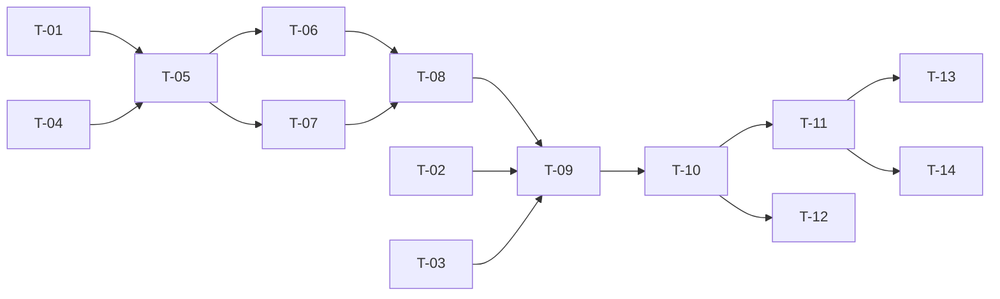

# TASKS — `RF-SP-002` Consultar roles

| Campo | Valor |
|---|---|
| Requerimiento | `RF-SP-002` |
| Especificación | [`spec.md`](spec.md) |
| Plan | [`plan.md`](plan.md) |
| `plan.md` aprobado el | 21-08-2026 |
| Estado | **Aprobadas** — 25-08-2026 |
| Issue | Pendiente de crear |
| Rama | `feature/consultar-roles` |
| Aprobadas por | Responsable técnico el 25-08-2026 |

!!! info "Qué va en este documento"

    **En qué pasos, en qué orden y cómo se verifica cada uno.**

    **Prueba de pertenencia:** si no puede marcarse como hecho, no es una tarea.

    **Es la fuente de verdad de las tareas.** El Issue de GitHub coordina y enlaza aquí; no la sustituye ni la duplica. Si las dos listas discrepan, manda este archivo.

    No se escribe hasta que `plan.md` esté aprobado, y ninguna tarea se ejecuta hasta que este documento lo esté (Art. I.6).

---

## 1. Tareas

Este requerimiento estrena la mecánica de paginación de todo el sistema —`T-02` y `T-03`—, de modo que dos de sus tareas tienen alcance muy superior al endpoint que las motiva. Se hacen primero y se prueban por separado, porque todo listado posterior las hereda.

**Prerrequisitos:** `V1` a `V7` (`RF-SP-010` y `RF-SP-001`) aplicadas, y la infraestructura de `shared/error` y `shared/security` de `RF-SP-001` integrada.

| # | Tarea | Depende de | Verificación | Estado |
|---|---|---|---|---|
| `T-01` | Migración `V8__create_role_search_index.sql`: `ix_roles_busqueda`, GIN de trigramas multicolumna sobre `f_unaccent(lower(code))` y `f_unaccent(lower(name))`, no parcial | — | `mvn flyway:info` la lista aplicada; el índice se crea sin error, lo que confirma que `f_unaccent` es indexable | Hecha |
| `T-02` | `shared/api/PageResponse<T>`: envoltura con `content`, `page`, `size`, `totalElements`, `totalPages` y `totalIsExact`, sin serializar el `Page` de Spring Data | — | Prueba unitaria de serialización: el JSON tiene exactamente esos seis campos y no depende de ningún tipo del framework | Hecha |
| `T-03` | `shared/api/PageRequestFactory` y la configuración `nexus.pagination.default-size` y `max-size`, sin usar `spring.data.web.pageable.max-page-size` | — | Prueba unitaria: `size = 101` es **rechazado**, no recortado; `page` negativa también; los valores por omisión salen de la configuración | Hecha |
| `T-04` | `application`: `ListRolesQuery`, `RoleListItem`, el enum cerrado `RoleSortField` y el puerto `RoleQueryRepository` | — | Prueba unitaria: `RoleSortField` resuelve los seis campos de la lista blanca y rechaza cualquier otro antes de construir consulta alguna | Hecha |
| `T-05` | `infrastructure/JpaRoleQueryRepository`: predicado por filtros presentes, `LEFT JOIN` al padre, proyección con `cb.construct` sobre once columnas y desempate por `id` en todo ordenamiento | `T-01`, `T-04` | Prueba de integración: una página de veinte roles con padre ejecuta **dos** sentencias como máximo, ninguna sobre `role_permissions`, y el rol raíz aparece con padre nulo | Hecha |
| `T-06` | Búsqueda: recorte del término, escape de `\`, `%` y `_`, parámetro enlazado y normalización con `f_unaccent` en la base de datos, nunca en Java | `T-05` | Pruebas de integración: `administracion` encuentra `Administración`, `100%` no devuelve el catálogo entero, y el `EXPLAIN` muestra el recorrido de `ix_roles_busqueda` | Hecha |
| `T-07` | Conteo: misma función de predicado para datos y total, conteo sin el `LEFT JOIN` y omitido cuando el resultado lo hace deducible | `T-05` | Prueba de integración: filtro y conteo no pueden divergir, y una primera página incompleta no dispara la sentencia de conteo | Hecha |
| `T-08` | `application/ListRolesService` con `@Transactional(readOnly = true)` | `T-06`, `T-07` | Prueba de integración: la transacción es de solo lectura y un intento de escritura desde este camino falla | Hecha |
| `T-09` | `api/ListRolesRequest` con Bean Validation de `VAL-001` a `VAL-004`, y `api/RoleListItemResponse` reutilizando `RoleSummaryResponse` para el padre | `T-08` | Prueba de API: los cuatro `400` se evalúan y se devuelven **juntos** en `errors`, cada uno con su `error_code` y su campo | Hecha |
| `T-10` | `api/RoleController`: añade `GET /api/v1/roles` con el permiso `roles:read` declarado sobre el método | `T-09` | Prueba de API: la consulta autorizada devuelve `200` con la envoltura de `T-02`; sin el permiso, `403` | Hecha |
| `T-11` | Pruebas de API e integración de los criterios de aceptación de `spec.md` §12 | `T-10` | La suite cubre `CA-SP-009` a `CA-SP-015`, `CA-SP-147` y `CA-SP-148` | Hecha |
| `T-12` | Pruebas de los casos límite de `spec.md` §13 y de las decisiones de `plan.md` §11: página fuera de rango, padre inexistente, ordenamiento arbitrario, ordenamiento con valores repetidos y número de sentencias | `T-10` | `sort=(select 1),asc` devuelve `400` sin llegar a la base de datos; recorrer todas las páginas ordenando por `status` devuelve cada rol exactamente una vez | Hecha |
| `T-13` | Documentación OpenAPI del endpoint: los ocho parámetros, la envoltura paginada y los estados `400`, `401`, `403` y `500` | `T-11` | El contrato publicado coincide con el comportamiento real (Art. VIII.6) | Hecha |
| `T-14` | Actualizar la matriz de trazabilidad de `docs/requirements.md` | `T-11` | La fila de `RF-SP-002` refleja el estado y enlaza esta tripleta | Hecha |

**Estados:** `Pendiente` · `En curso` · `Hecha` · `Bloqueada`.

!!! note "Cuatro desviaciones al implementar — 25-08-2026"

    Las tareas se escribieron el 21-08-2026, cuando este requerimiento iba a implementarse **antes** que los catálogos y que los usuarios. Se ejecutaron después, y cuatro puntos del plan ya no describían el sistema que existe. Se dejan escritas porque la diferencia entre el documento y el código, sin explicación, se lee como descuido:

    1. **La migración es `V32`, no `V8`.** Aquel número se reservó antes de que se aplicaran `V13` a `V31`. Insertar hoy una `V8` deja una migración fuera de orden: Flyway aborta el arranque en toda base ya migrada salvo activando `out-of-order`, que es la puerta que no conviene abrir para ahorrarse un renombrado. El número es un orden de aplicación, no un identificador del requerimiento.
    2. **`T-02` y `T-03` ya estaban hechas.** `PageResponse` y `Pagination` —el `PageRequestFactory` del plan, con otro nombre— los creó `RF-SP-010` y los amplió `RF-SP-025` con `totalIsExact`. Este requerimiento los **usa** en lugar de crearlos, que es lo que el plan quería: que todo listado comparta una sola envoltura.
    3. **Los códigos de la paginación son los del componente compartido.** El plan asigna `VAL-001` a `page` y `VAL-002` a `size`; `Pagination` emite `VAL-003` para ambos desde `RF-SP-010`, y así lo verifican las pruebas de tres requerimientos ya integrados. Se mantiene la uniformidad y **queda anotada la discrepancia**: la resuelve quien decida cambiar el componente compartido, no este endpoint. `CA-SP-014` se satisface igual, porque exige que el tamaño excesivo se rechace, no un código concreto.
    4. **El atajo del conteo tiene una condición más de la que `plan.md` §4 describe.** «Omitir el conteo cuando la página no se llena» es correcto salvo en un caso: la página **vacía** más allá de la última. Deducir el total del desplazamiento daría `1980` para la página 99 de un catálogo de doce roles —un total inventado, con la colección vacía y sin ningún error que lo delate—. Cuando no viene ninguna fila, se cuenta. Tiene prueba propia en `ListRolesServiceIT` y en `RolesQueryIT`.

    Se implementa además con **SQL nativo y proyección a `record`**, como `RF-SP-025`, en lugar de la API de criterios que el plan describe. La propiedad que sostenía esa decisión se conserva entera: el ordenamiento se resuelve contra `RoleSortField` **antes** de construir la sentencia, de modo que la cadena del cliente nunca llega al `ORDER BY`.

## 2. Orden de ejecución

`T-01` a `T-04` no dependen entre sí y pueden ir en paralelo. `T-02` y `T-03` son infraestructura compartida: conviene integrarlas en su propio Pull Request, porque las heredan todos los listados posteriores.

## 3. Cobertura de los criterios de aceptación

| Criterio | Tarea que lo cubre |
|---|---|
| `CA-SP-009` | `T-02`, `T-07`, `T-11` |
| `CA-SP-010` | `T-05`, `T-11` |
| `CA-SP-011` | `T-05`, `T-11` |
| `CA-SP-012` | `T-05`, `T-11` |
| `CA-SP-013` | `T-05`, `T-11` |
| `CA-SP-014` | `T-03`, `T-09`, `T-11` |
| `CA-SP-015` | `T-10`, `T-11` |
| `CA-SP-147` | `T-01`, `T-06`, `T-11` |
| `CA-SP-148` | `T-05`, `T-11` |

Los casos límite de `spec.md` §13 los cubre `T-12`. Las reglas de ArchUnit de `RF-SP-001` cubren también este requerimiento y no se añade ninguna: no toca `domain`.

## 4. Bloqueos

| # | Bloqueo | Desde | Responsable | Estado |
|---|---|---|---|---|
| 1 | `T-01` falla si `V1__create_shared_functions.sql` (`RF-SP-010`) no está aplicada. Es el momento correcto de enterarse y no requiere acción previa más allá del orden de integración | 21-08-2026 | Responsable técnico | Abierto |
| 2 | La estrategia de conteo exacto de `T-07` **no debe heredarse** en `RF-SP-011` a `RF-SP-014`, donde las tablas crecen sin límite (`plan.md` §4 y §8). No bloquea estas tareas; sí condiciona las de aquellos | 21-08-2026 | Responsable técnico | Abierto |

## 5. Definición de terminado

El requerimiento no está terminado hasta cumplir **todas** las condiciones de la constitución §16:

- [x] Todas las tareas en estado `Hecha`.
- [x] Todos los criterios de aceptación con prueba automatizada en verde.
- [x] `mvn verify` en verde en local (25-08-2026: 123 unitarias y 448 de integración).
- [ ] Toda escritura emite su evento de auditoría, en la transacción que corresponde.
- [x] Los endpoints nuevos declaran su permiso.
- [x] El contrato OpenAPI coincide con el comportamiento real (`OpenApiContractIT` regenera `docs/api/openapi.json`).
- [ ] Documentación afectada actualizada en el mismo Pull Request.
- [x] Matriz de trazabilidad actualizada.
- [ ] Pull Request aprobado por alguien distinto del autor e integrado.
