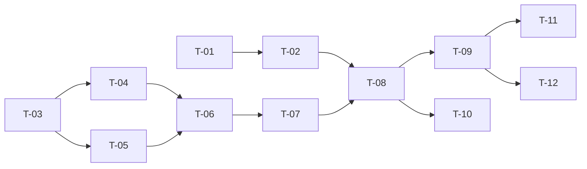

# TASKS — `RF-SP-003` Consultar detalle de un rol

| Campo | Valor |
|---|---|
| Requerimiento | `RF-SP-003` |
| Especificación | [`spec.md`](spec.md) |
| Plan | [`plan.md`](plan.md) |
| `plan.md` aprobado el | 21-08-2026 |
| Estado | **En revisión** |
| Issue | Pendiente de crear |
| Rama | `feature/consultar-detalle-rol` |
| Aprobadas por | Pendiente |

!!! info "Qué va en este documento"

    **En qué pasos, en qué orden y cómo se verifica cada uno.**

    **Prueba de pertenencia:** si no puede marcarse como hecho, no es una tarea.

    **Es la fuente de verdad de las tareas.** El Issue de GitHub coordina y enlaza aquí; no la sustituye ni la duplica. Si las dos listas discrepan, manda este archivo.

    No se escribe hasta que `plan.md` esté aprobado, y ninguna tarea se ejecuta hasta que este documento lo esté (Art. I.6).

---

## 1. Tareas

Este requerimiento no cambia el esquema: no tiene migración propia. A cambio, **depende del esquema de usuarios**, que crean `RF-SP-024` y `RF-SP-030`, y por eso ambos se adelantan en el orden de `requirements/sp.md` §6.1. La dependencia está declarada en §4.

`T-01` tiene alcance mayor que este requerimiento: registrar el conversor de identificadores cambia el comportamiento de todo endpoint del sistema con un UUID en la ruta, presente y futuro.

| # | Tarea | Depende de | Verificación | Estado |
|---|---|---|---|---|
| `T-01` | `shared/api/CanonicalUuidConverter`: `Converter<String, UUID>` registrado globalmente que exige la forma canónica de 36 caracteres antes de delegar en `UUID.fromString`, sin validar la versión | — | Prueba unitaria: `1-1-1-1-1` y `abc` son rechazados; un v4 bien formado se acepta | Pendiente |
| `T-02` | `shared/error`: traducción del fallo de conversión del identificador a `400` con `VAL-001` y campo `id`, y de `ResourceNotFoundException` a `404` | `T-01` | Prueba de `MockMvc`: un identificador no canónico produce `400`, no el `404` de manejador ausente | Pendiente |
| `T-03` | `application`: modelos de lectura `RoleDetail` y `PermissionItem`, y el puerto `RoleDetailQueryRepository` con `findById` y `findDeclaredPermissions` | — | Compila; `findById` devuelve `Optional`, nunca `null` | Pendiente |
| `T-04` | `infrastructure/JpaRoleDetailQueryRepository`, primera sentencia: rol, `LEFT JOIN` al padre con `deleted_at IS NULL`, subconsulta de hijos directos vigentes y subconsulta de usuarios asignados con `count(DISTINCT)` excluyendo eliminados | `T-03` | Prueba de integración: con nietos en la tabla el conteo de hijos no los incluye; un hijo inactivo sí cuenta y uno eliminado no; un usuario bloqueado cuenta y uno eliminado no | Pendiente |
| `T-05` | Segunda sentencia: permisos declarados sobre `role_permissions ⋈ permissions`, completa, sin paginar y con `ORDER BY code` | `T-03` | Prueba de integración: doscientos permisos se devuelven completos, en el mismo orden entre dos llamadas | Pendiente |
| `T-06` | `application/GetRoleDetailService` con `@Transactional(readOnly = true)`, que devuelve `404` sin ejecutar la segunda sentencia cuando el rol no existe | `T-04`, `T-05` | Prueba de integración: la petición ejecuta **exactamente dos** sentencias, y una sola cuando el rol no existe | Pendiente |
| `T-07` | `api/RoleDetailResponse`, reutilizando `RoleSummaryResponse` y `PermissionResponse`, con `childRoleCount` y `assignedUserCount` como números simples | `T-06` | Prueba de API: `permissions` vacío es `[]` y no `null`; `assignedUserCount` vale `0` con el campo presente; no existe `childRoles` ni `deletedAt` ni `createdBy` | Pendiente |
| `T-08` | `api/RoleController`: añade `GET /api/v1/roles/{id}` con el permiso `roles:read` declarado sobre el método | `T-02`, `T-07` | Prueba de API: `200` con el detalle; `404` para un identificador inexistente o eliminado; `403` sin el permiso | Pendiente |
| `T-09` | Pruebas de API e integración de los criterios de aceptación de `spec.md` §12 | `T-08` | La suite cubre `CA-SP-016` a `CA-SP-022`, `CA-SP-149` y `CA-SP-150` | Pendiente |
| `T-10` | Pruebas de los casos límite de `spec.md` §13 y de las decisiones de `plan.md` §11: identificador no canónico, rol eliminado, muchos permisos, muchos hijos y uso efectivo de `ix_user_roles_role_id` | `T-08` | Un rol eliminado devuelve el **mismo** cuerpo que uno inexistente; el `EXPLAIN` muestra el índice en la subconsulta de usuarios | Pendiente |
| `T-11` | Documentación OpenAPI del endpoint: respuesta `200` y estados `400`, `401`, `403`, `404` y `500` | `T-09` | El contrato publicado coincide con el comportamiento real (Art. VIII.6) | Pendiente |
| `T-12` | Actualizar la matriz de trazabilidad de `docs/requirements.md` | `T-09` | La fila de `RF-SP-003` refleja el estado y enlaza esta tripleta | Pendiente |

**Estados:** `Pendiente` · `En curso` · `Hecha` · `Bloqueada`.

## 2. Orden de ejecución

`T-01` y `T-03` arrancan en paralelo. Conviene integrar `T-01` y `T-02` en su propio Pull Request: cambian el comportamiento de todo el sistema, no solo el de este endpoint.

## 3. Cobertura de los criterios de aceptación

| Criterio | Tarea que lo cubre |
|---|---|
| `CA-SP-016` | `T-05`, `T-07`, `T-09` |
| `CA-SP-017` | `T-04`, `T-07`, `T-09` |
| `CA-SP-018` | `T-05`, `T-07`, `T-09` |
| `CA-SP-019` | `T-04`, `T-09` |
| `CA-SP-020` | `T-04`, `T-08`, `T-09` |
| `CA-SP-021` | `T-06`, `T-09` |
| `CA-SP-022` | `T-08`, `T-09` |
| `CA-SP-149` | `T-04`, `T-09` |
| `CA-SP-150` | `T-04`, `T-07`, `T-09` |

`RN-SEG-004` no tiene tarea que la implemente: se cumple porque el plan de ejecución no recorre ancestros, y lo que la hace verificable es el conteo de sentencias de `T-06` y `CA-SP-021`. Los casos límite de `spec.md` §13 los cubre `T-10`.

## 4. Bloqueos

| # | Bloqueo | Desde | Responsable | Estado |
|---|---|---|---|---|
| 1 | `T-04` no puede escribirse hasta que existan `users` (`RF-SP-024`) y `user_roles` (`RF-SP-030`). Ambas tripletas están adelantadas en `requirements/sp.md` §6.1, pero sus specs todavía no existen | 21-08-2026 | Responsable técnico | Abierto |
| 2 | `RF-SP-030` debe declarar `ix_user_roles_role_id`. Sin ese índice, cada detalle de rol recorre la tabla entera de asignaciones (`plan.md` §2 y §8) | 21-08-2026 | Responsable técnico | Abierto |
| 3 | `T-01` cambia de `404` a `400` la respuesta a un identificador no canónico en **todo** endpoint con UUID en la ruta. Debe revisarse al integrarlo con los endpoints ya publicados | 21-08-2026 | Responsable técnico | Abierto |

## 5. Definición de terminado

El requerimiento no está terminado hasta cumplir **todas** las condiciones de la constitución §16:

- [ ] Todas las tareas en estado `Hecha`.
- [ ] Todos los criterios de aceptación con prueba automatizada en verde.
- [ ] `mvn verify` en verde en local.
- [ ] Toda escritura emite su evento de auditoría, en la transacción que corresponde.
- [ ] Los endpoints nuevos declaran su permiso.
- [ ] El contrato OpenAPI coincide con el comportamiento real.
- [ ] Documentación afectada actualizada en el mismo Pull Request.
- [ ] Matriz de trazabilidad actualizada.
- [ ] Pull Request aprobado por alguien distinto del autor e integrado.
