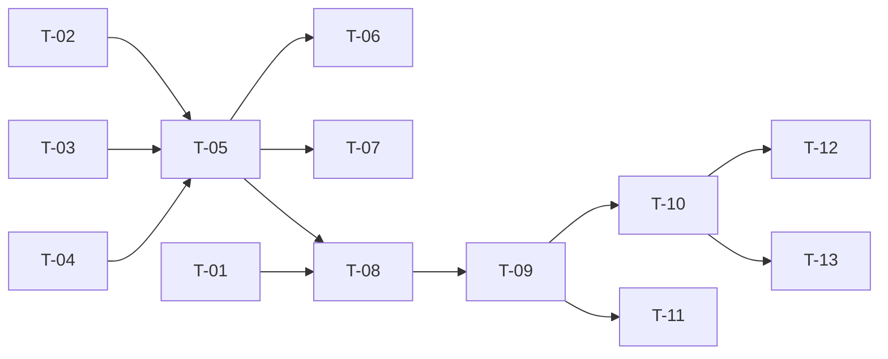

# TASKS — `RF-SP-004` Editar rol

| Campo | Valor |
|---|---|
| Requerimiento | `RF-SP-004` |
| Especificación | [`spec.md`](spec.md) |
| Plan | [`plan.md`](plan.md) |
| `plan.md` aprobado el | 21-08-2026, **reabierto el 22-08-2026** por la corrección de su §6 |
| Estado | **En revisión** |
| Issue | Pendiente de crear |
| Rama | `feature/editar-rol` |
| Aprobadas por | Pendiente |

!!! info "Qué va en este documento"

    **En qué pasos, en qué orden y cómo se verifica cada uno.**

    **Prueba de pertenencia:** si no puede marcarse como hecho, no es una tarea.

    **Es la fuente de verdad de las tareas.** El Issue de GitHub coordina y enlaza aquí; no la sustituye ni la duplica. Si las dos listas discrepan, manda este archivo.

    No se escribe hasta que `plan.md` esté aprobado, y ninguna tarea se ejecuta hasta que este documento lo esté (Art. I.6).

---

## 1. Tareas

Sin migración: la tabla y sus restricciones las crea `V5__create_roles.sql` (`RF-SP-001`). El peso está en tres piezas que este requerimiento estrena y que heredan todas las escrituras posteriores: el envoltorio de tres estados `Patchable<T>`, la lectura de los roles vigentes del actor y el diff de auditoría.

| # | Tarea | Depende de | Verificación | Estado |
|---|---|---|---|---|
| `T-01` | `shared/api/Patchable<T>` y su deserializador: tres estados —ausente, nulo, con valor— compatible con Bean Validation sobre el valor envuelto | — | Prueba unitaria del deserializador para los cuatro cuerpos de `plan.md` §4: `{"name":"X"}`, `{"description":null}`, `{"description":""}` y `{}` | Pendiente |
| `T-02` | `domain`: `RoleChanges` y `Role.rename(name, description)`, que aplica el cambio y devuelve **qué campos mutaron** con su antes y su después | — | Prueba unitaria sin Spring: renombrar devuelve un solo campo mutado; escribir los mismos valores devuelve el conjunto vacío; el nombre solo con espacios se rechaza tras recortar | Pendiente |
| `T-03` | `application/AuthenticatedActor`: se amplía con los **roles vigentes del actor leídos de la base de datos**, no del token | — | Prueba de integración: a un actor con un rol asignado después de emitirse su token, el puerto se lo devuelve igualmente | Pendiente |
| `T-04` | `infrastructure/JpaRoleRepository`: traducción de la violación de `uq_roles_name` a la excepción de duplicado, por nombre de restricción | — | Prueba de integración: el nombre duplicado produce la excepción de negocio, nunca un error de integridad sin traducir | Pendiente |
| `T-05` | `application`: `UpdateRoleCommand` y `UpdateRoleService` con `@Transactional` y el orden de verificación de `plan.md` §4 —formato, existencia, rol de sistema, `RN-SEG-011`, unicidad— | `T-02`, `T-03`, `T-04` | Pruebas con dobles: cada excepción se lanza en el orden declarado, y la unicidad es la última porque es la única que consulta otra fila | Pendiente |
| `T-06` | Auditoría de la edición: `audit_change_log` con `action = UPDATE` y **solo** los campos mutados, evento de seguridad tras el commit, y **ningún** evento cuando no hubo cambio efectivo | `T-05` | Prueba de integración: una edición efectiva deja una fila con el diff; enviar los valores actuales no deja fila en ninguno de los dos registros | Pendiente |
| `T-07` | Auditoría de los rechazos, **cada uno en el registro que le corresponde** (`plan.md` §6): `EX-001` y `EX-003` —los dos `409`— en `audit_error_log` con `error_type = 'BUSINESS_RULE'` y severidad Media; `EX-002` —el `403` de `RN-SEG-011`— en `audit_security_log` con `event_type = 'AUTHORIZATION_DENIED'` y severidad **Alta**, en transacción independiente y sin esperar a un commit que no llega; `EX-004` (`404`) y los `400` de formato no se auditan | `T-05` | Prueba de integración: `EX-001` y `EX-003` dejan su fila en `audit_error_log` con su `error_code`; `EX-002` deja la suya en `audit_security_log` y **ninguna** en `audit_error_log`; `EX-004` y un `400` de formato no dejan ninguna en ninguno de los dos registros | Pendiente |
| `T-08` | `api/UpdateRoleRequest` con `Patchable<T>` y Bean Validation (`VAL-002`, `VAL-004`), y rechazo de propiedades desconocidas | `T-01`, `T-05` | Prueba de API: un cuerpo con `roleType` es **rechazado**, no ignorado; `{}` devuelve `400` con `VAL-001` | Pendiente |
| `T-09` | `api/RoleController`: añade `PATCH /api/v1/roles/{id}` con el permiso `roles:update`, devolviendo `RoleResponse` y no el detalle de `RF-SP-003` | `T-08` | Prueba de API: `200` con el rol editado, y la traza de sentencias no incluye las subconsultas de conteo del detalle | Pendiente |
| `T-10` | Pruebas de API e integración de los criterios de aceptación de `spec.md` §12 | `T-09` | La suite cubre `CA-SP-023` a `CA-SP-030`, `CA-SP-151` y `CA-SP-152` | Pendiente |
| `T-11` | Pruebas de los casos límite de `spec.md` §13 y del caso añadido en `plan.md` §11: rol asignado al actor **después** de emitirse su token | `T-09` | Ese caso devuelve `403` con `RN-SEG-011`, no `200`. Es la única prueba que distingue leer los roles del actor de la base de datos de leerlos del token | Pendiente |
| `T-12` | Documentación OpenAPI del endpoint: semántica de `PATCH`, los cuatro cuerpos de `plan.md` §4 y los estados `400`, `401`, `403`, `404`, `409` y `500` | `T-10` | El contrato publicado coincide con el comportamiento real (Art. VIII.6), y los dos `403` figuran con `error_code` distinto | Pendiente |
| `T-13` | Actualizar la matriz de trazabilidad de `docs/requirements.md` | `T-10` | La fila de `RF-SP-004` refleja el estado y enlaza esta tripleta | Pendiente |

**Estados:** `Pendiente` · `En curso` · `Hecha` · `Bloqueada`.

## 2. Orden de ejecución

`T-01` a `T-04` no dependen entre sí. `T-01` y `T-03` son infraestructura que reutilizan `RF-SP-005` a `RF-SP-009`: conviene integrarlas por separado.

## 3. Cobertura de los criterios de aceptación

| Criterio | Tarea que lo cubre |
|---|---|
| `CA-SP-023` | `T-02`, `T-05`, `T-10` |
| `CA-SP-024` | `T-01`, `T-02`, `T-10` |
| `CA-SP-025` | `T-05`, `T-10` |
| `CA-SP-026` | `T-03`, `T-05`, `T-10` |
| `CA-SP-027` | `T-04`, `T-05`, `T-10` |
| `CA-SP-028` | `T-04`, `T-10` |
| `CA-SP-029` | `T-02`, `T-06`, `T-10` |
| `CA-SP-030` | `T-02`, `T-06`, `T-10` |
| `CA-SP-151` | `T-08`, `T-10` |
| `CA-SP-152` | `T-05`, `T-10` |

Los casos límite de `spec.md` §13 y el añadido en `plan.md` §11 los cubre `T-11`.

## 4. Bloqueos

| # | Bloqueo | Desde | Responsable | Estado |
|---|---|---|---|---|
| 1 | `T-03` exige poder leer los roles asignados al actor, lo que depende de `user_roles` (`RF-SP-030`). Mientras esa tabla no exista, `RN-SEG-011` no es verificable | 21-08-2026 | Responsable técnico | Abierto |
| 2 | La decisión de no usar bloqueo optimista es firme, pero si se revirtiera, la columna de versión debe añadirse a `V5` **antes** del primer despliegue (`plan.md` §2) | 21-08-2026 | Responsable técnico | Abierto |
| 3 | `plan.md` §6 se corrigió el 22-08-2026 —el `403` de `RN-SEG-011` y el `404` no caben en `audit_error_log`— y volvió a **En revisión**. Ninguna tarea se ejecuta hasta que ese plan se apruebe de nuevo (Art. I.6) | 22-08-2026 | Responsable técnico | Abierto |

## 5. Definición de terminado

El requerimiento no está terminado hasta cumplir **todas** las condiciones de la constitución §16:

- [ ] Todas las tareas en estado `Hecha`.
- [ ] Todos los criterios de aceptación con prueba automatizada en verde.
- [ ] `mvn verify` en verde en local.
- [ ] Toda escritura emite su evento de auditoría, en la transacción que corresponde.
- [ ] Los endpoints nuevos declaran su permiso.
- [ ] El contrato OpenAPI coincide con el comportamiento real.
- [ ] Documentación afectada actualizada en el mismo Pull Request.
- [ ] Matriz de trazabilidad actualizada.
- [ ] Pull Request aprobado por alguien distinto del autor e integrado.
