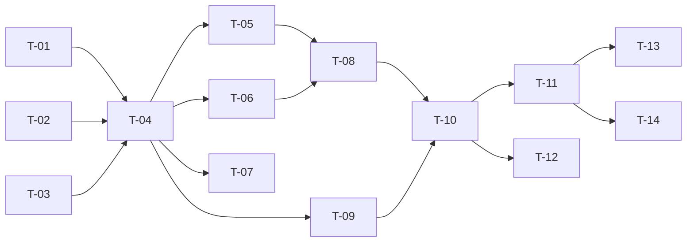

# TASKS — `RF-SP-005` Asignar permisos a un rol

| Campo | Valor |
|---|---|
| Requerimiento | `RF-SP-005` |
| Especificación | [`spec.md`](spec.md) |
| Plan | [`plan.md`](plan.md) |
| `plan.md` aprobado el | 21-08-2026 |
| Estado | **En revisión** |
| Issue | Pendiente de crear |
| Rama | `feature/asignar-permisos` |
| Aprobadas por | Pendiente |

!!! info "Qué va en este documento"

    **En qué pasos, en qué orden y cómo se verifica cada uno.**

    **Prueba de pertenencia:** si no puede marcarse como hecho, no es una tarea.

    **Es la fuente de verdad de las tareas.** El Issue de GitHub coordina y enlaza aquí; no la sustituye ni la duplica. Si las dos listas discrepan, manda este archivo.

    No se escribe hasta que `plan.md` esté aprobado, y ninguna tarea se ejecuta hasta que este documento lo esté (Art. I.6).

---

## 1. Tareas

Sin migración: `role_permissions` la crea `V6__create_role_permissions.sql` (`RF-SP-001`). Este es el requerimiento donde el modelo de contención pasa de documento a código, de modo que el peso está en `T-01` y en sus pruebas unitarias: `RN-SEG-003` y `RN-SEG-010` deben ser verificables sin Spring ni base de datos.

| # | Tarea | Depende de | Verificación | Estado |
|---|---|---|---|---|
| `T-01` | `domain`: `Role.grantPermissions(...)` con `RN-SEG-003` y `RN-SEG-010`, aditivo e idempotente, que devuelve **qué permisos se agregaron realmente**, y `PermissionContainmentViolation` con qué permisos incumplen y contra qué cota | — | Pruebas unitarias sin Spring: el rechazo es completo y enumera los infractores; un rol sin padre omite `RN-SEG-003` y conserva `RN-SEG-010`; repetir la operación no agrega nada | Pendiente |
| `T-02` | `application/RolePermissionCacheInvalidator`: puerto hacia `shared/security` para dejar sin efecto la resolución de permisos del rol | — | Prueba con dobles: el puerto se invoca una vez por operación efectiva | Pendiente |
| `T-03` | `infrastructure/SecurityContextActorAdapter`: resuelve los permisos efectivos del actor **desde la base de datos**, no desde la caché de resolución | — | Prueba de integración: un permiso revocado al actor deja de estar disponible en la siguiente petición, sin esperar a la expiración de ninguna caché | Pendiente |
| `T-04` | `application/GrantRolePermissionsService` con `@Transactional` y el orden de verificación de `plan.md` §4, de la existencia del rol a la contención en el actor | `T-01`, `T-02`, `T-03` | Pruebas con dobles: cada excepción se lanza en el orden declarado; los pasos 6 y 7 nunca se evalúan antes de resolver el catálogo | Pendiente |
| `T-05` | Persistencia de las filas nuevas en `role_permissions` desde `JpaRoleRepository`, con la clave primaria compuesta absorbiendo el empate concurrente | `T-04` | Prueba de integración: dos peticiones simultáneas con el mismo permiso no producen fila duplicada ni error interno | Pendiente |
| `T-06` | Auditoría: `audit_change_log` con **solo los permisos realmente agregados**, evento de seguridad de severidad Alta tras el commit, y ningún evento cuando no se agregó ninguno | `T-04` | Prueba de integración: una operación efectiva deja **una** fila en cada registro; repetirla no deja ninguna | Pendiente |
| `T-07` | Auditoría de los rechazos: severidad **Alta** para `RN-SEG-003`, `RN-SEG-010` y `RN-SEG-011`; **Media** para el resto; los `400` de formato no se auditan | `T-04` | Prueba de integración: cada rechazo deja su fila con su `error_code`, y los tres de escalada se encuentran filtrando por severidad Alta | Pendiente |
| `T-08` | Invalidación de la caché de permisos del rol **después** del commit, nunca antes | `T-05`, `T-06` | Prueba de integración: tras la operación, una resolución de permisos refleja el cambio de inmediato, y una petición concurrente no repuebla la caché con el estado antiguo | Pendiente |
| `T-09` | `api/GrantPermissionsRequest` con Bean Validation (`VAL-001`, `VAL-002`, `VAL-006`), colapso de duplicados y límite de 100 elementos | `T-04` | Prueba de API: lista vacía y lista de 101 elementos devuelven `400`; los duplicados se colapsan sin error | Pendiente |
| `T-10` | `api/RoleController`: añade `POST /api/v1/roles/{id}/permissions` con el permiso `roles:update`, devolviendo `RoleResponse`, y con los `409` de contención enumerando los permisos infractores | `T-08`, `T-09` | Prueba de API: `200` con la lista actualizada; los cuerpos de `409` citan **cuáles** permisos incumplen; los dos `403` llevan `error_code` distinto | Pendiente |
| `T-11` | Pruebas de API e integración de los criterios de aceptación de `spec.md` §12 | `T-10` | La suite cubre `CA-SP-031` a `CA-SP-040`, `CA-SP-153`, `CA-SP-154` y `CA-SP-173` | Pendiente |
| `T-12` | Pruebas de los casos límite de `spec.md` §13: rechazo parcial, duplicados, cadena profunda, actor superadministrador y reparto en varias peticiones | `T-10` | Con una cadena de tres roles, la operación consulta al padre y **no** al abuelo; partir la petición en dos produce el mismo estado final | Pendiente |
| `T-13` | Documentación OpenAPI del endpoint: cuerpo, respuesta `200` y los estados `400`, `401`, `403`, `404`, `409`, `422` y `500` | `T-11` | El contrato publicado coincide con el comportamiento real (Art. VIII.6) | Pendiente |
| `T-14` | Actualizar la matriz de trazabilidad de `docs/requirements.md` | `T-11` | La fila de `RF-SP-005` refleja el estado y enlaza esta tripleta | Pendiente |

**Estados:** `Pendiente` · `En curso` · `Hecha` · `Bloqueada`.

## 2. Orden de ejecución

`T-01` a `T-03` no dependen entre sí. `T-01` puede escribirse y probarse por completo antes de que exista nada de infraestructura: es dominio puro.

## 3. Cobertura de los criterios de aceptación

| Criterio | Tarea que lo cubre |
|---|---|
| `CA-SP-031` | `T-01`, `T-05`, `T-11` |
| `CA-SP-032` | `T-01`, `T-10`, `T-11` |
| `CA-SP-033` | `T-01`, `T-03`, `T-10`, `T-11` |
| `CA-SP-034` | `T-01`, `T-05`, `T-11` |
| `CA-SP-035` | `T-01`, `T-11` |
| `CA-SP-036` | `T-04`, `T-11` |
| `CA-SP-037` | `T-04`, `T-11` |
| `CA-SP-038` | `T-08`, `T-11` |
| `CA-SP-039` | `T-06`, `T-11` |
| `CA-SP-040` | `T-01`, `T-11`, `T-12` |
| `CA-SP-153` | `T-01`, `T-05`, `T-11` |
| `CA-SP-154` | `T-09`, `T-11` |
| `CA-SP-173` | `T-04`, `T-10`, `T-11` |

`CA-SP-173` —rol inexistente o eliminado, sin distinguir ambos casos— aparece en `spec.md` §12 y **no** en la tabla de `plan.md` §11. Se cubre igual: es `EX-006` y su `404`, y `T-11` debe incluir la prueba de que ambos casos devuelven el mismo cuerpo.

## 4. Bloqueos

| # | Bloqueo | Desde | Responsable | Estado |
|---|---|---|---|---|
| 1 | `RN-SEG-011` exige leer los roles vigentes del actor, lo que depende de `user_roles` (`RF-SP-030`). Es la misma dependencia que registró `RF-SP-004` | 21-08-2026 | Responsable técnico | Abierto |
| 2 | `T-02` y `T-08` dependen de que `shared/security` exponga la invalidación de la resolución de permisos. Es la primera vez que se necesita; `RF-SP-006` y `RF-SP-007` reutilizan el mismo puerto | 21-08-2026 | Responsable técnico | Abierto |

## 5. Definición de terminado

El requerimiento no está terminado hasta cumplir **todas** las condiciones de la constitución §16:

- [ ] Todas las tareas en estado `Hecha`.
- [ ] Todos los criterios de aceptación con prueba automatizada en verde.
- [ ] `mvn verify` en verde en local.
- [ ] Toda escritura emite su evento de auditoría, en la transacción que corresponde.
- [ ] Los endpoints nuevos declaran su permiso.
- [ ] El contrato OpenAPI coincide con el comportamiento real.
- [ ] Documentación afectada actualizada en el mismo Pull Request.
- [ ] Matriz de trazabilidad actualizada.
- [ ] Pull Request aprobado por alguien distinto del autor e integrado.
