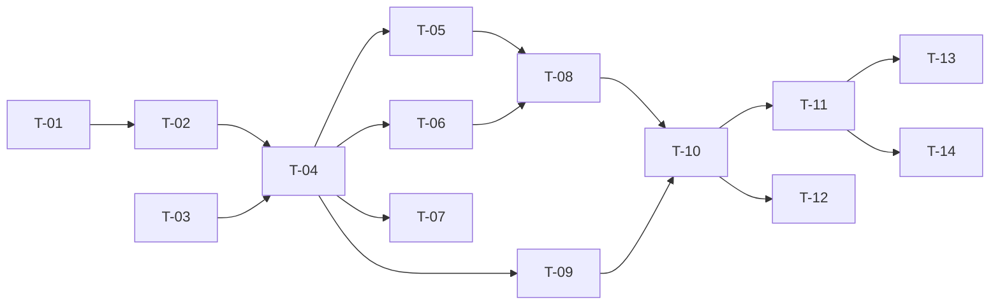

# TASKS — `RF-SP-006` Revocar permisos de un rol

| Campo | Valor |
|---|---|
| Requerimiento | `RF-SP-006` |
| Especificación | [`spec.md`](spec.md) |
| Plan | [`plan.md`](plan.md) |
| `plan.md` aprobado el | 21-08-2026, **reabierto el 22-08-2026** por la corrección de su §6 |
| Estado | **En revisión** |
| Issue | Pendiente de crear |
| Rama | `feature/revocar-permisos` |
| Aprobadas por | Pendiente |

!!! info "Qué va en este documento"

    **En qué pasos, en qué orden y cómo se verifica cada uno.**

    **Prueba de pertenencia:** si no puede marcarse como hecho, no es una tarea.

    **Es la fuente de verdad de las tareas.** El Issue de GitHub coordina y enlaza aquí; no la sustituye ni la duplica. Si las dos listas discrepan, manda este archivo.

    No se escribe hasta que `plan.md` esté aprobado, y ninguna tarea se ejecuta hasta que este documento lo esté (Art. I.6).

---

## 1. Tareas

Sin migración. La diferencia esencial con `RF-SP-005` está en `T-01` y `T-02`: aquí el conjunto de permisos **encoge**, de modo que hay que mirar hacia abajo antes de escribir. Quien implemente esto copiando el requerimiento anterior omitirá exactamente esa verificación, y es el riesgo que `plan.md` §10 marca como alto.

| # | Tarea | Depende de | Verificación | Estado |
|---|---|---|---|---|
| `T-01` | `domain/RoleRepository`: búsqueda de los hijos directos de un rol **sin filtrar por estado**, y su adaptador apoyado en `ix_roles_parent_role_id` | — | Prueba de integración: devuelve hijos activos e inactivos, excluye los eliminados lógicamente, y el `EXPLAIN` muestra el uso del índice | Pendiente |
| `T-02` | `domain`: `Role.revokePermissions(...)` con `RN-SEG-005`, que devuelve qué permisos se retiraron realmente, y `PermissionRevocationBlocked` con qué roles hijos lo impiden y con qué permisos | `T-01` | Pruebas unitarias sin Spring: un hijo **inactivo** que declara el permiso bloquea igual que uno activo; retirar un permiso no declarado no produce error; el rechazo es completo | Pendiente |
| `T-03` | `application/RoleDeletionAuditor`: puerto hacia `shared/audit` para el registro de eliminación | — | Prueba con dobles: se invoca **una vez por permiso retirado**, no una por operación | Pendiente |
| `T-04` | `application/RevokeRolePermissionsService` con `@Transactional`, que carga la descendencia directa antes de aplicar y reutiliza `RolePermissionCacheInvalidator` de `RF-SP-005` | `T-02`, `T-03` | Pruebas con dobles: cada excepción se lanza en su orden; tras un rechazo no se escribe nada | Pendiente |
| `T-05` | `infrastructure/JpaRoleRepository`: eliminación **física** de las filas de `role_permissions` | `T-04` | Prueba de integración: la fila desaparece de la tabla, no queda marcada | Pendiente |
| `T-06` | Auditoría: una fila de `audit_deletion_log` **por permiso retirado**, con `deletion_type = ASSOCIATION`, `reason` vacío y el estado conservado con identificadores **y códigos** de rol y permiso; evento de seguridad de severidad Alta tras el commit | `T-04` | Prueba de integración: `reason` vacío no viola la restricción del esquema, y el estado conservado se lee sin resolver ninguna referencia | Pendiente |
| `T-07` | Auditoría de los rechazos, **cada uno en el registro que le corresponde** (`plan.md` §6): `EX-001` y `EX-002` en `audit_error_log`, con severidad **Alta** para `RN-SEG-005` y Media para `EX-002`; `EX-003` —el `403` de `RN-SEG-011`— en `audit_security_log` con `event_type = 'AUTHORIZATION_DENIED'` y severidad **Alta**, en transacción independiente y sin esperar a un commit que no llega; `EX-004` (`404`) y los `400` de formato no se auditan | `T-04` | Prueba de integración: `EX-001` y `EX-002` dejan su fila en `audit_error_log` con su `error_code`; `EX-003` deja la suya en `audit_security_log` y **ninguna** en `audit_error_log`; `EX-004` y un `400` no dejan ninguna en ninguno de los dos registros | Pendiente |
| `T-08` | Invalidación de la caché de permisos del rol **después** del commit | `T-05`, `T-06` | Prueba de integración: una resolución de permisos posterior ya no concede el permiso retirado | Pendiente |
| `T-09` | `api/RevokePermissionsRequest`: lista de identificadores, **sin motivo**, con Bean Validation (`VAL-001`, `VAL-002`) y el límite de 100 de `VAL-004` | `T-04` | Prueba de API: lista vacía y lista de 101 devuelven `400`; el cuerpo no admite campo de motivo | Pendiente |
| `T-10` | `api/RoleController`: añade `POST /api/v1/roles/{id}/permissions/revocations` con el permiso `roles:update`, devolviendo `RoleResponse`, y con el `409` de `RN-SEG-005` enumerando roles y permisos bloqueantes | `T-08`, `T-09` | Prueba de API: `200` con la lista actualizada; el cuerpo del `409` cita **qué roles** lo impiden y **con qué permisos** | Pendiente |
| `T-11` | Pruebas de API e integración de los criterios de aceptación de `spec.md` §12 | `T-10` | La suite cubre `CA-SP-041` a `CA-SP-048`, `CA-SP-155`, `CA-SP-156` y `CA-SP-174` | Pendiente |
| `T-12` | Pruebas de los casos límite de `spec.md` §13: retirar todos los permisos, hijo eliminado lógicamente, rol ancestro del actor y revocación concurrente | `T-10` | Un hijo eliminado lógicamente **no** bloquea; la segunda revocación concurrente no encuentra la asociación y no falla | Pendiente |
| `T-13` | Documentación OpenAPI del endpoint: por qué es `POST` sobre un subrecurso, cuerpo, respuesta `200` y los estados `400`, `401`, `403`, `404`, `409` y `500` | `T-11` | El contrato publicado coincide con el comportamiento real (Art. VIII.6) | Pendiente |
| `T-14` | Actualizar la matriz de trazabilidad de `docs/requirements.md` | `T-11` | La fila de `RF-SP-006` refleja el estado y enlaza esta tripleta | Pendiente |

**Estados:** `Pendiente` · `En curso` · `Hecha` · `Bloqueada`.

## 2. Orden de ejecución

## 3. Cobertura de los criterios de aceptación

| Criterio | Tarea que lo cubre |
|---|---|
| `CA-SP-041` | `T-02`, `T-05`, `T-11` |
| `CA-SP-042` | `T-02`, `T-10`, `T-11` |
| `CA-SP-043` | `T-04`, `T-11` |
| `CA-SP-044` | `T-02`, `T-11` |
| `CA-SP-045` | `T-06`, `T-11` |
| `CA-SP-046` | `T-05`, `T-11` |
| `CA-SP-047` | `T-04`, `T-11` |
| `CA-SP-048` | `T-08`, `T-11` |
| `CA-SP-155` | `T-01`, `T-02`, `T-11` |
| `CA-SP-156` | `T-06`, `T-11` |
| `CA-SP-174` | `T-09`, `T-11` |

`CA-SP-155` y `CA-SP-048` son las dos que no pueden faltar (`plan.md` §11): la primera protege el invariante de contención donde es más fácil olvidarlo, la segunda distingue un permiso revocado de uno que sigue concediéndose desde la caché. Los casos límite de `spec.md` §13 los cubre `T-12`.

## 4. Bloqueos

| # | Bloqueo | Desde | Responsable | Estado |
|---|---|---|---|---|
| 1 | `RN-SEG-011` exige leer los roles vigentes del actor, lo que depende de `user_roles` (`RF-SP-030`). Misma dependencia que `RF-SP-004` y `RF-SP-005` | 21-08-2026 | Responsable técnico | Abierto |
| 2 | `T-08` reutiliza el puerto de invalidación que estrena `RF-SP-005`: ese requerimiento debe integrarse antes | 21-08-2026 | Responsable técnico | Abierto |
| 3 | `plan.md` §6 se corrigió el 22-08-2026 —el `403` de `RN-SEG-011` y el `404` no caben en `audit_error_log`— y volvió a **En revisión**. Ninguna tarea se ejecuta hasta que ese plan se apruebe de nuevo (Art. I.6) | 22-08-2026 | Responsable técnico | Abierto |

## 5. Definición de terminado

El requerimiento no está terminado hasta cumplir **todas** las condiciones de la constitución §16:

- [ ] Todas las tareas en estado `Hecha`.
- [ ] Todos los criterios de aceptación con prueba automatizada en verde.
- [ ] `mvn verify` en verde en local.
- [ ] Toda escritura emite su evento de auditoría, en la transacción que corresponde.
- [ ] Los endpoints nuevos declaran su permiso.
- [ ] El contrato OpenAPI coincide con el comportamiento real.
- [ ] Documentación afectada actualizada en el mismo Pull Request.
- [ ] Matriz de trazabilidad actualizada.
- [ ] Pull Request aprobado por alguien distinto del autor e integrado.
