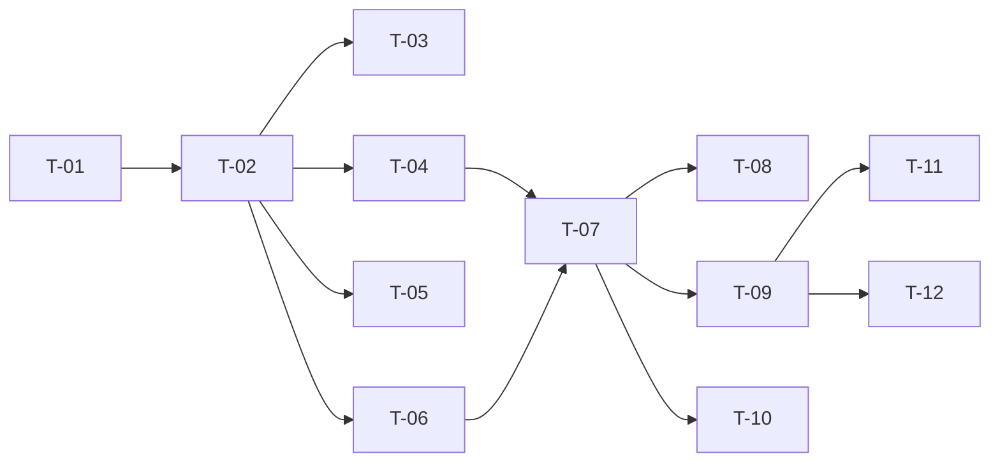

# TASKS — `RF-SP-007` Cambiar el estado de un rol

| Campo | Valor |
|---|---|
| Requerimiento | `RF-SP-007` |
| Especificación | [`spec.md`](spec.md) |
| Plan | [`plan.md`](plan.md) |
| `plan.md` aprobado el | 21-08-2026 |
| Estado | **En revisión** |
| Issue | Pendiente de crear |
| Rama | `feature/cambiar-estado-rol` |
| Aprobadas por | Pendiente |

!!! info "Qué va en este documento"

    **En qué pasos, en qué orden y cómo se verifica cada uno.**

    **Prueba de pertenencia:** si no puede marcarse como hecho, no es una tarea.

    **Es la fuente de verdad de las tareas.** El Issue de GitHub coordina y enlaza aquí; no la sustituye ni la duplica. Si las dos listas discrepan, manda este archivo.

    No se escribe hasta que `plan.md` esté aprobado, y ninguna tarea se ejecuta hasta que este documento lo esté (Art. I.6).

---

## 1. Tareas

Sin migración: `status` y `ck_roles_status` los crea `V5__create_roles.sql` (`RF-SP-001`). Persistir el estado es trivial; el requerimiento está en `T-04` y en la prueba de `T-08`, que es la que decide si «inmediato» significa algo. Verificar `CA-SP-050` leyendo la columna daría verde con una implementación que no invalida nada.

| # | Tarea | Depende de | Verificación | Estado |
|---|---|---|---|---|
| `T-01` | `domain`: `Role.activate()` y `Role.deactivate()`, que devuelven si hubo **cambio efectivo**, y el rechazo del rol raíz por su propia condición: `esRaiz \|\| esDeSistema` | — | Prueba unitaria sin Spring: aplicar el estado que ya tenía devuelve «sin cambio»; un rol raíz no marcado como de sistema se rechaza igual | Pendiente |
| `T-02` | `application/ChangeRoleStatusService` con `@Transactional` y el orden de verificación —existencia, rol de sistema o raíz, `RN-SEG-011`— reutilizando `RoleChangeAuditor` y `RolePermissionCacheInvalidator` | `T-01` | Pruebas con dobles: cada excepción en su orden; sin cambio efectivo no se invoca ni el auditor ni el invalidador | Pendiente |
| `T-03` | Auditoría del cambio: `audit_change_log` con `action = UPDATE` y solo `status` en el diff, evento de seguridad de severidad **Alta** tras el commit, y ningún evento si no hubo cambio | `T-02` | Prueba de integración: desactivar deja una fila en cada registro; repetir la petición no deja ninguna | Pendiente |
| `T-04` | Invalidación de la caché de permisos del rol **después** del commit, por el único método del puerto: invalidar por rol | `T-02` | Prueba de integración: la invalidación ocurre tras confirmar, nunca antes | Pendiente |
| `T-05` | Auditoría de los rechazos: severidad **Alta** para `RN-SEG-011` y para el intento sobre el rol raíz, **Media** para el resto; los `400` de formato no se auditan | `T-02` | Prueba de integración: cada rechazo deja su fila con su `error_code`, y el del rol raíz cita `RN-SEG-007` | Pendiente |
| `T-06` | `api/ChangeRoleStatusRequest`: **estado destino**, no acción; sin campo de motivo y con rechazo de propiedades desconocidas | `T-02` | Prueba de API: un cuerpo con motivo devuelve `400`, no se ignora; un estado fuera del dominio devuelve `400` con `VAL-001` | Pendiente |
| `T-07` | `api/RoleController`: añade `PATCH /api/v1/roles/{id}/status` con el permiso `roles:update`, devolviendo `RoleResponse` | `T-04`, `T-06` | Prueba de API: `200` con el estado actualizado; el `409` del rol de sistema cita `RN-SEG-012` y el del raíz, `RN-SEG-007` | Pendiente |
| `T-08` | Prueba de que un rol inactivo deja de conceder permisos **de inmediato**, resolviendo los permisos de un portador real con su token aún vigente | `T-07` | Tras desactivar, la resolución de permisos de ese portador ya no incluye los del rol. No vale leer la columna `status` | Pendiente |
| `T-09` | Pruebas de API e integración del resto de criterios de aceptación de `spec.md` §12 | `T-07` | La suite cubre `CA-SP-049` y `CA-SP-051` a `CA-SP-055`, más `CA-SP-157`, `CA-SP-158` y `CA-SP-159` | Pendiente |
| `T-10` | Pruebas de los casos límite de `spec.md` §13: rol padre desactivado con hijos activos, rol eliminado, y usuario cuyo único rol se desactiva | `T-07` | Un portador de un rol hijo conserva sus permisos tras desactivar el padre; el usuario sin roles activos queda autenticado y sin permisos, no en error | Pendiente |
| `T-11` | Documentación OpenAPI del endpoint: cuerpo con estado destino, respuesta `200` y los estados `400`, `401`, `403`, `404`, `409` y `500` | `T-09` | El contrato publicado coincide con el comportamiento real (Art. VIII.6) | Pendiente |
| `T-12` | Actualizar la matriz de trazabilidad de `docs/requirements.md` | `T-09` | La fila de `RF-SP-007` refleja el estado y enlaza esta tripleta | Pendiente |

**Estados:** `Pendiente` · `En curso` · `Hecha` · `Bloqueada`.

## 2. Orden de ejecución

## 3. Cobertura de los criterios de aceptación

| Criterio | Tarea que lo cubre |
|---|---|
| `CA-SP-049` | `T-01`, `T-07`, `T-09` |
| `CA-SP-050` | `T-04`, `T-08` |
| `CA-SP-051` | `T-02`, `T-09` |
| `CA-SP-052` | `T-01`, `T-03`, `T-09` |
| `CA-SP-053` | `T-02`, `T-07`, `T-09` |
| `CA-SP-054` | `T-02`, `T-09` |
| `CA-SP-055` | `T-03`, `T-09` |
| `CA-SP-157` | `T-02`, `T-10` |
| `CA-SP-158` | `T-01`, `T-07`, `T-09` |
| `CA-SP-159` | `T-06`, `T-09` |

`CA-SP-050` tiene tarea propia, `T-08`, precisamente para que no se verifique leyendo la columna. Los casos límite de `spec.md` §13 los cubre `T-10`.

## 4. Bloqueos

| # | Bloqueo | Desde | Responsable | Estado |
|---|---|---|---|---|
| 1 | `T-08` exige un portador real del rol, lo que depende de `user_roles` (`RF-SP-030`). Sin esa tabla, `CA-SP-050` no es verificable como el plan exige | 21-08-2026 | Responsable técnico | Abierto |
| 2 | `T-04` reutiliza el puerto de invalidación que estrena `RF-SP-005`: ese requerimiento debe integrarse antes | 21-08-2026 | Responsable técnico | Abierto |
| 3 | La caché es en memoria del proceso: con más de una instancia del backend, la invalidación solo alcanza a la que atendió la petición (`plan.md` §10, aceptado). No bloquea estas tareas; se dispara el día que se despliegue una segunda instancia, y afecta igual a `RF-SP-005`, `RF-SP-006` y `RF-SP-009` | 21-08-2026 | Responsable técnico | Abierto |

## 5. Definición de terminado

El requerimiento no está terminado hasta cumplir **todas** las condiciones de la constitución §16:

- [ ] Todas las tareas en estado `Hecha`.
- [ ] Todos los criterios de aceptación con prueba automatizada en verde.
- [ ] `mvn verify` en verde en local.
- [ ] Toda escritura emite su evento de auditoría, en la transacción que corresponde.
- [ ] Los endpoints nuevos declaran su permiso.
- [ ] El contrato OpenAPI coincide con el comportamiento real.
- [ ] Documentación afectada actualizada en el mismo Pull Request.
- [ ] Matriz de trazabilidad actualizada.
- [ ] Pull Request aprobado por alguien distinto del autor e integrado.
