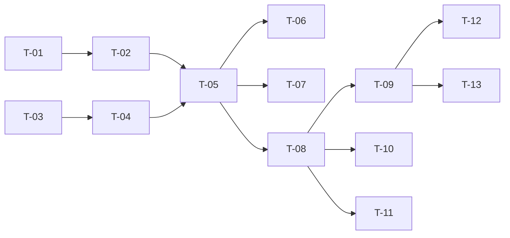

# TASKS — `RF-SP-008` Cambiar el rol padre de un rol

| Campo | Valor |
|---|---|
| Requerimiento | `RF-SP-008` |
| Especificación | [`spec.md`](spec.md) |
| Plan | [`plan.md`](plan.md) |
| `plan.md` aprobado el | 21-08-2026 |
| Estado | **En revisión** |
| Issue | Pendiente de crear |
| Rama | `feature/cambiar-rol-padre` |
| Aprobadas por | Pendiente |

!!! info "Qué va en este documento"

    **En qué pasos, en qué orden y cómo se verifica cada uno.**

    **Prueba de pertenencia:** si no puede marcarse como hecho, no es una tarea.

    **Es la fuente de verdad de las tareas.** El Issue de GitHub coordina y enlaza aquí; no la sustituye ni la duplica. Si las dos listas discrepan, manda este archivo.

    No se escribe hasta que `plan.md` esté aprobado, y ninguna tarea se ejecuta hasta que este documento lo esté (Art. I.6).

---

## 1. Tareas

Sin migración. Es la única operación del módulo capaz de dejar la estructura en un estado del que no se sale, de modo que dos tareas son innegociables: `T-04`, el bloqueo que serializa las reubicaciones, y `T-10`, la prueba concurrente que lo verifica. Ejecutar `CA-SP-161` como dos llamadas secuenciales pasaría siempre y no probaría nada.

| # | Tarea | Depende de | Verificación | Estado |
|---|---|---|---|---|
| `T-01` | `domain/RoleRepository` e `infrastructure/JpaRoleRepository`: carga de la **descendencia completa** de un rol con consulta recursiva y **profundidad acotada**, con error controlado al superarla | — | Prueba de integración: devuelve toda la descendencia de una cadena profunda, usa `ix_roles_parent_role_id` según el `EXPLAIN`, y una jerarquía corrupta no produce recorrido infinito | Pendiente |
| `T-02` | `domain`: `RoleHierarchy` con `RN-SEG-006` y `RN-SEG-013`, `HierarchyViolation` distinguiendo ciclo de contención, y `Role.reparent(...)` que aplica el cambio ya validado | `T-01` | Pruebas unitarias sin Spring: un rol bajo su propio nieto se rechaza; un rol como padre de sí mismo se rechaza; el exceso de contención enumera **qué permisos sobran** y no retira ninguno | Pendiente |
| `T-03` | `application/RoleHierarchyLock`: puerto que serializa toda mutación de la jerarquía | — | Compila; su contrato declara el intento **sin espera**, no la adquisición bloqueante | Pendiente |
| `T-04` | `infrastructure/AdvisoryRoleHierarchyLock`: bloqueo consultivo de PostgreSQL sobre una clave fija con `pg_try_advisory_xact_lock`, ligado a la transacción | `T-03` | Prueba de integración: una segunda transacción que lo intenta recibe la negativa **de inmediato**, no se encola; el bloqueo se libera también cuando la transacción falla | Pendiente |
| `T-05` | `application/ChangeRoleParentService` con `@Transactional` y el orden de verificación de `plan.md` §4: el bloqueo se toma **antes** de las dos verificaciones estructurales y **después** de las de formato, permiso y existencia | `T-02`, `T-04` | Pruebas con dobles: un rechazo por formato o por permiso no llega a tomar el bloqueo | Pendiente |
| `T-06` | Auditoría del cambio: `audit_change_log` con solo `parent_role_id` en el diff, incluidos los **códigos** del padre anterior y el nuevo; evento de seguridad de severidad Alta tras el commit; ningún evento si el padre no cambia | `T-05` | Prueba de integración: el diff se lee sin resolver referencias; enviar el padre actual no deja fila en ninguno de los dos registros | Pendiente |
| `T-07` | Auditoría de los rechazos: severidad **Alta** para `RN-SEG-006`, `RN-SEG-013` y `RN-SEG-011`; **Media** para el resto, incluido el `409` por bloqueo no obtenido, que se audita para poder contar con qué frecuencia ocurre | `T-05` | Prueba de integración: el rechazo por bloqueo deja fila con `error_type = 'BUSINESS_RULE'` y severidad Media | Pendiente |
| `T-08` | `api/ChangeRoleParentRequest` y `RoleController`: añade `PATCH /api/v1/roles/{id}/parent` con el permiso `roles:update`, devolviendo `RoleResponse` | `T-05` | Prueba de API: `200` con el nuevo padre; el `409` de contención enumera los permisos sobrantes; el `404` del rol movido y el `422` del nuevo padre inexistente llevan códigos distintos | Pendiente |
| `T-09` | Pruebas de API e integración de los criterios de aceptación de `spec.md` §12, salvo el concurrente | `T-08` | La suite cubre `CA-SP-056` a `CA-SP-063`, `CA-SP-160`, `CA-SP-162` y `CA-SP-175` | Pendiente |
| `T-10` | Prueba **concurrente** de `CA-SP-161`: dos transacciones reales que intentan `B → D` y `D → B` a la vez | `T-08` | Una tiene éxito y la otra recibe `409`; la jerarquía final no contiene ciclo. Dos llamadas secuenciales no sirven como prueba | Pendiente |
| `T-11` | Pruebas de los casos límite de `spec.md` §13: cadena profunda, nuevo padre eliminado lógicamente y rol comercial bajo padre funcionario | `T-08` | El tipo del nuevo padre no se verifica; un padre eliminado se trata como inexistente | Pendiente |
| `T-12` | Documentación OpenAPI del endpoint: cuerpo, respuesta `200` y los estados `400`, `401`, `403`, `404`, `409` —con sus cuatro motivos distinguibles por `error_code`— `422` y `500` | `T-09` | El contrato publicado coincide con el comportamiento real (Art. VIII.6) | Pendiente |
| `T-13` | Actualizar la matriz de trazabilidad de `docs/requirements.md` | `T-09` | La fila de `RF-SP-008` refleja el estado y enlaza esta tripleta | Pendiente |

**Estados:** `Pendiente` · `En curso` · `Hecha` · `Bloqueada`.

## 2. Orden de ejecución

`T-01` y `T-03` arrancan en paralelo. `T-02` es dominio puro y puede completarse y probarse antes de que exista el bloqueo.

## 3. Cobertura de los criterios de aceptación

| Criterio | Tarea que lo cubre |
|---|---|
| `CA-SP-056` | `T-02`, `T-08`, `T-09` |
| `CA-SP-057` | `T-02`, `T-08`, `T-09` |
| `CA-SP-058` | `T-01`, `T-02`, `T-09` |
| `CA-SP-059` | `T-02`, `T-09` |
| `CA-SP-060` | `T-05`, `T-09` |
| `CA-SP-061` | `T-02`, `T-09` |
| `CA-SP-062` | `T-06`, `T-09` |
| `CA-SP-063` | `T-06`, `T-09` |
| `CA-SP-160` | `T-02`, `T-09` |
| `CA-SP-161` | `T-04`, `T-05`, `T-10` |
| `CA-SP-162` | `T-02`, `T-09` |
| `CA-SP-175` | `T-05`, `T-08`, `T-09` |

Los casos límite de `spec.md` §13 los cubre `T-11`.

## 4. Bloqueos

| # | Bloqueo | Desde | Responsable | Estado |
|---|---|---|---|---|
| 1 | `RN-SEG-011` exige leer los roles vigentes del actor, lo que depende de `user_roles` (`RF-SP-030`). Misma dependencia que `RF-SP-004` a `RF-SP-007` | 21-08-2026 | Responsable técnico | Abierto |
| 2 | `T-10` necesita infraestructura de prueba concurrente con dos transacciones reales sobre Testcontainers. No existe en el proyecto y hay que montarla; también la usa `CA-SP-027` de `RF-SP-004` y el alta concurrente de `RF-SP-001` | 21-08-2026 | Responsable técnico | Abierto |
| 3 | Si `RF-SP-005` o `RF-SP-006` llegaran a modificar la estructura de la jerarquía, deben tomar el mismo bloqueo (`plan.md` §8). Hoy no lo hacen | 21-08-2026 | Responsable técnico | Abierto |

## 5. Definición de terminado

El requerimiento no está terminado hasta cumplir **todas** las condiciones de la constitución §16:

- [ ] Todas las tareas en estado `Hecha`.
- [ ] Todos los criterios de aceptación con prueba automatizada en verde.
- [ ] `mvn verify` en verde en local.
- [ ] Toda escritura emite su evento de auditoría, en la transacción que corresponde.
- [ ] Los endpoints nuevos declaran su permiso.
- [ ] El contrato OpenAPI coincide con el comportamiento real.
- [ ] Documentación afectada actualizada en el mismo Pull Request.
- [ ] Matriz de trazabilidad actualizada.
- [ ] Pull Request aprobado por alguien distinto del autor e integrado.
