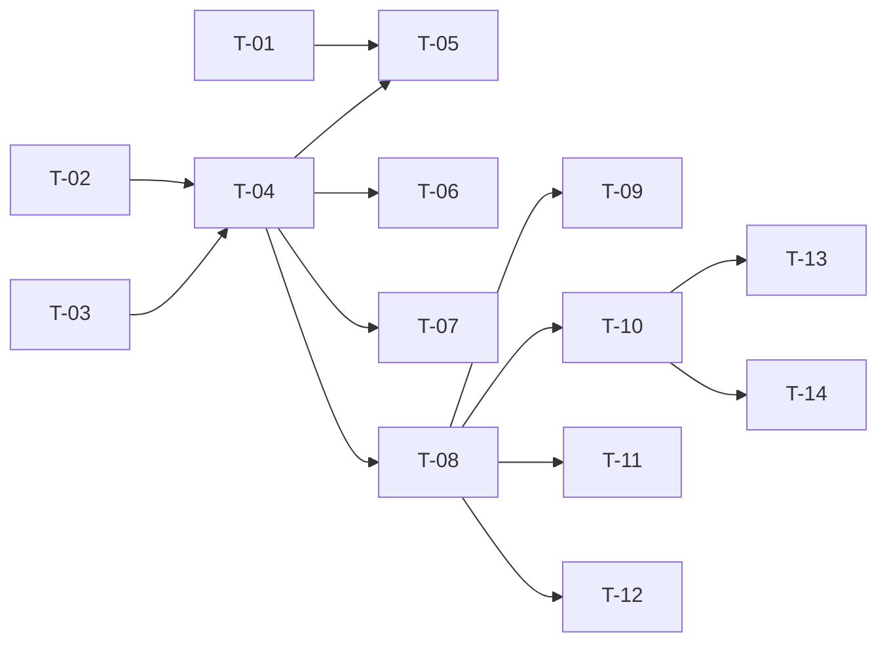

# TASKS — `RF-SP-009` Eliminar rol

| Campo | Valor |
|---|---|
| Requerimiento | `RF-SP-009` |
| Especificación | [`spec.md`](spec.md) |
| Plan | [`plan.md`](plan.md) |
| `plan.md` aprobado el | 21-08-2026, **reabierto el 22-08-2026** por la corrección de su §6 |
| Estado | **Aprobadas** — 25-08-2026 |
| Issue | Pendiente de crear |
| Rama | `feature/eliminar-rol` |
| Aprobadas por | Responsable técnico el 25-08-2026 |

!!! info "Qué va en este documento"

    **En qué pasos, en qué orden y cómo se verifica cada uno.**

    **Prueba de pertenencia:** si no puede marcarse como hecho, no es una tarea.

    **Es la fuente de verdad de las tareas.** El Issue de GitHub coordina y enlaza aquí; no la sustituye ni la duplica. Si las dos listas discrepan, manda este archivo.

    No se escribe hasta que `plan.md` esté aprobado, y ninguna tarea se ejecuta hasta que este documento lo esté (Art. I.6).

---

## 1. Tareas

Sin migración propia, pero con un ajuste ajeno que debe ir antes: `ck_deletion_reason` de `V4__create_audit_logs.sql` pasa a exigir solo contenido no vacío, y eso hay que corregirlo **en la migración**, antes del primer despliegue. Está en `T-01` y pertenece al Pull Request de `RF-SP-001` si aún no se ha integrado.

Lo demás gira en torno a una carrera: eliminar un rol mientras alguien se lo asigna. `T-02`, `T-06` y `T-12` son las tareas que la cierran y la verifican.

| # | Tarea | Depende de | Verificación | Estado |
|---|---|---|---|---|
| `T-01` | Ajustar `ck_deletion_reason` en `V4__create_audit_logs.sql` para que exija contenido no vacío en lugar de diez caracteres, conforme a `architecture.md` §6.6.3 | — | Prueba de integración: un motivo de tres caracteres se acepta; uno vacío o solo con espacios se rechaza. **Debe hacerse antes del primer despliegue** | Hecha |
| `T-02` | `domain/RoleRepository` e `infrastructure/JpaRoleRepository`: bloqueo exclusivo de la fila del rol (`SELECT … FOR UPDATE`), búsqueda de hijos vigentes y conteo de usuarios asignados con la semántica de `RF-SP-003` §4 | — | Prueba de integración: un usuario bloqueado cuenta, uno eliminado lógicamente no; el bloqueo se libera al terminar la transacción, también si falla | Hecha |
| `T-03` | `domain`: `Role.delete(String motivo)`, que valida el motivo tras recortar y devuelve el **estado previo** para el registro de eliminación | — | Prueba unitaria sin Spring: un motivo solo con espacios se rechaza; el estado devuelto incluye los permisos declarados | Hecha |
| `T-04` | `application/DeleteRoleService` con `@Transactional` y el orden de verificación de `plan.md` §4: **el motivo primero de todo**, el bloqueo antes de contar hijos y usuarios | `T-02`, `T-03` | Pruebas con dobles: el motivo ausente se rechaza sin tocar la fila; el conteo nunca se ejecuta antes del bloqueo | Hecha |
| `T-05` | Auditoría: `audit_deletion_log` con `deletion_type = LOGICAL`, el motivo del actor y el estado conservado con el rol completo **y sus permisos declarados**; evento de seguridad de severidad Alta tras el commit | `T-01`, `T-04` | Prueba de integración: el estado conservado responde qué concedía el rol sin consultar `role_permissions` | Hecha |
| `T-06` | Invalidación de la caché de permisos del rol tras el commit | `T-04` | Prueba de integración: el rol eliminado deja de conceder de inmediato | Hecha |
| `T-07` | Auditoría de los rechazos, **cada uno en el registro que le corresponde** (`plan.md` §6): `EX-002` a `EX-004` en `audit_error_log`, con severidad **Alta** para las dos formas de `RN-SEG-008` y Media para `EX-004`; `EX-005` —el `403` de `RN-SEG-011`— en `audit_security_log` con `event_type = 'AUTHORIZATION_DENIED'` y severidad **Alta**, en transacción independiente y sin esperar a un commit que no llega; `EX-006` (`404`) y el motivo ausente **no** se auditan, este último porque es validación y no regla incumplida | `T-04` | Prueba de integración: un `409` por hijos vigentes deja fila en `audit_error_log`; `EX-005` deja la suya en `audit_security_log` y **ninguna** en `audit_error_log`; un `400` por motivo ausente y un `404` no dejan ninguna en ninguno de los dos registros | Hecha |
| `T-08` | `api/DeleteRoleRequest` con el motivo como único campo, y `RoleController`: añade `POST /api/v1/roles/{id}/deletion` con el permiso `roles:delete`, respondiendo `204` sin cuerpo | `T-04` | Prueba de API: `204` sin cuerpo; los `409` de `RN-SEG-008` dicen **cuáles** hijos por su código y **cuántos** usuarios | Hecha |
| `T-09` | Verificar que no existe ninguna operación de restauración sobre el recurso | `T-08` | Prueba de API: no hay manejador que reponga un rol eliminado; `CA-SP-164` se verifica por ausencia | Hecha |
| `T-10` | Pruebas de API e integración de los criterios de aceptación de `spec.md` §12, salvo el concurrente | `T-08` | La suite cubre `CA-SP-064` a `CA-SP-072`, `CA-SP-163`, `CA-SP-164` y `CA-SP-176` | Hecha |
| `T-11` | Pruebas de los casos límite de `spec.md` §13: hijos eliminados lógicamente, motivo solo con espacios, rol ya eliminado, y resolución del identificador desde auditoría antigua | `T-08` | Un hijo eliminado lógicamente **no** impide la eliminación; el identificador de un rol borrado sigue resolviendo al registro conservado | Hecha |
| `T-12` | Prueba **concurrente** de `CA-SP-165`: eliminar el rol y asignárselo a alguien a la vez, con dos transacciones reales | `T-08` | Una de las dos falla, y no queda ningún usuario apuntando a un rol eliminado. Falla en CI si la asignación de `RF-SP-030` no toma el bloqueo compartido | Hecha |
| `T-13` | Documentación OpenAPI del endpoint: cuerpo con el motivo, respuesta `204` y los estados `400`, `401`, `403`, `404`, `409` y `500` | `T-10` | El contrato publicado coincide con el comportamiento real (Art. VIII.6) | Hecha |
| `T-14` | Actualizar la matriz de trazabilidad de `docs/requirements.md` | `T-10` | La fila de `RF-SP-009` refleja el estado y enlaza esta tripleta | Hecha |

**Estados:** `Pendiente` · `En curso` · `Hecha` · `Bloqueada`.

## 2. Orden de ejecución

`T-01` es independiente y urgente: cuanto antes se corrija la restricción, menos probable es que haya que alterarla con la tabla en uso.

## 3. Cobertura de los criterios de aceptación

| Criterio | Tarea que lo cubre |
|---|---|
| `CA-SP-064` | `T-03`, `T-04`, `T-10` |
| `CA-SP-065` | `T-03`, `T-04`, `T-10` |
| `CA-SP-066` | `T-02`, `T-08`, `T-10` |
| `CA-SP-067` | `T-02`, `T-08`, `T-10` |
| `CA-SP-068` | `T-04`, `T-10` |
| `CA-SP-069` | `T-04`, `T-10` |
| `CA-SP-070` | `T-04`, `T-10` |
| `CA-SP-071` | `T-01`, `T-05`, `T-10` |
| `CA-SP-072` | `T-05`, `T-10` |
| `CA-SP-163` | `T-02`, `T-10` |
| `CA-SP-164` | `T-09`, `T-10` |
| `CA-SP-165` | `T-02`, `T-04`, `T-12` |
| `CA-SP-176` | `T-04`, `T-08`, `T-10` |

`CA-SP-067` y `CA-SP-165` son las dos que protegen el invariante (`plan.md` §11): la primera fija quién cuenta y quién no, la segunda comprueba que el bloqueo cierra la carrera de verdad. Los casos límite de `spec.md` §13 los cubre `T-11`.

## 4. Bloqueos

| # | Bloqueo | Desde | Responsable | Estado |
|---|---|---|---|---|
| 1 | `T-02` y `T-12` dependen de `users` (`RF-SP-024`) y `user_roles` (`RF-SP-030`). Ambas tripletas están adelantadas en `requirements/sp.md` §6.1 y sus specs todavía no existen | 21-08-2026 | Responsable técnico | Abierto |
| 2 | `RF-SP-030` debe tomar un bloqueo **compartido** sobre la fila del rol antes de insertar en `user_roles` (`plan.md` §5). Es el contrato que hace correcta esta operación, y `T-12` lo verifica: si esa asignación no lo toma, la prueba falla en CI | 21-08-2026 | Responsable técnico | Abierto |
| 3 | `T-01` toca una migración de `RF-SP-001`. Si ese requerimiento ya se integró y se desplegó, deja de ser una edición y pasa a ser una migración de alteración sobre una tabla en uso | 21-08-2026 | Responsable técnico | Abierto |
| 4 | `plan.md` §6 se corrigió el 22-08-2026 —el `403` de `RN-SEG-011` y el `404` no caben en `audit_error_log`— y volvió a **En revisión**. Ninguna tarea se ejecuta hasta que ese plan se apruebe de nuevo (Art. I.6) | 22-08-2026 | Responsable técnico | Abierto |

## 5. Definición de terminado

El requerimiento no está terminado hasta cumplir **todas** las condiciones de la constitución §16:

- [x] Todas las tareas en estado `Hecha`.
- [x] Todos los criterios de aceptación con prueba automatizada en verde.
- [x] `mvn verify` en verde en local (25-08-2026).
- [x] Toda escritura emite su evento de auditoría, en la transacción que corresponde.
- [x] Los endpoints nuevos declaran su permiso.
- [x] El contrato OpenAPI coincide con el comportamiento real.
- [ ] Documentación afectada actualizada en el mismo Pull Request.
- [x] Matriz de trazabilidad actualizada.
- [ ] Pull Request aprobado por alguien distinto del autor e integrado.
