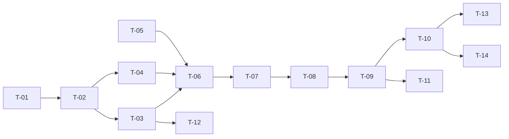

# TASKS — `RF-SP-010` Consultar catálogo de permisos

| Campo | Valor |
|---|---|
| Requerimiento | `RF-SP-010` |
| Especificación | [`spec.md`](spec.md) |
| Plan | [`plan.md`](plan.md) |
| `plan.md` aprobado el | 21-08-2026, enmendado y reaprobado el 22-08-2026 |
| Estado | **Aprobadas** |
| Issue | Pendiente de crear |
| Rama | `feature/consultar-permisos` |
| Aprobadas por | Responsable técnico el 22-08-2026 |

!!! info "Qué va en este documento"

    **En qué pasos, en qué orden y cómo se verifica cada uno.**

    **Prueba de pertenencia:** si no puede marcarse como hecho, no es una tarea.

    **Es la fuente de verdad de las tareas.** El Issue de GitHub coordina y enlaza aquí; no la sustituye ni la duplica. Si las dos listas discrepan, manda este archivo.

    No se escribe hasta que `plan.md` esté aprobado, y ninguna tarea se ejecuta hasta que este documento lo esté (Art. I.6).

---

## 1. Tareas

Este requerimiento abre el orden de implementación de `requirements/sp.md` §6.1, y lo abre **por sus migraciones**: `V1` a `V3` son prerrequisito de todo lo demás. El endpoint, en cambio, necesita la jerarquía de errores y la capa de seguridad que crea `RF-SP-001`, de modo que las tareas se dividen en dos frentes con distinta condición de arranque. Está declarado en §4.

| # | Tarea | Depende de | Verificación | Estado |
|---|---|---|---|---|
| `T-01` | Migración `V1__create_shared_functions.sql`: extensiones `unaccent` y `pg_trgm`, y `f_unaccent(text)` declarada `IMMUTABLE STRICT PARALLEL SAFE` con el diccionario cualificado | — | `mvn flyway:info` la lista aplicada; prueba de integración: `f_unaccent('AUDITORÍA')` devuelve `AUDITORIA`, y un índice de expresión que la invoca se crea sin error | Hecha |
| `T-02` | Migración `V2__create_permissions.sql`: tabla `permissions` con `uq_permissions_code`, `ck_permissions_code_format`, `ck_permissions_code_matches` y `ck_permissions_description_length` | `T-01` | `mvn flyway:info` la lista aplicada; prueba de integración: un `INSERT` con código incoherente con recurso y acción es rechazado, y otro con formato inválido también | Hecha |
| `T-03` | Migración `V3__seed_permissions.sql`: los **veinticuatro** permisos de `requirements/sp.md` §9 con identificadores UUID v7 literales, nombre y descripción legibles, y sin emitir auditoría. Incluye `users:assign-supervisor`, incorporado al enmendarse `plan.md` §2 el 22-08-2026 | `T-02` | Prueba de integración: la tabla tiene exactamente veinticuatro filas, incluidas las **ocho** de recurso `users`, y los identificadores son estables entre ejecuciones | Hecha |
| `T-04` | `domain/models/Permission`: mapeo JPA de `permissions`, usado como metamodelo de la consulta | `T-02` | Prueba de integración: el mapeo lee una fila sembrada con sus seis columnas | Hecha |
| `T-05` | `application`: `ListPermissionsQuery` y el modelo de lectura `PermissionItem` con sus seis campos; `domain/repository`: el puerto `PermissionQueryRepository` | — | Compila y la prueba unitaria del recorte del término de búsqueda —vacío o solo espacios equivale a ausente— está en verde | Hecha |
| `T-06` | `domain/repository/JpaPermissionQueryRepository`: predicado con igualdad para recurso y acción, búsqueda con `f_unaccent`, `coalesce` sobre la descripción, escape de `\`, `%` y `_`, parámetro enlazado y `ORDER BY resource, action` | `T-03`, `T-04`, `T-05` | Pruebas de integración: la búsqueda ignora acentos y mayúsculas, un término con `%` no devuelve el catálogo entero, y el permiso sin descripción sigue apareciendo al buscar por su código | Hecha |
| `T-07` | `domain/service/ListPermissionsService` con `@Transactional(readOnly = true)` | `T-06` | Prueba de integración: la consulta se resuelve en **una** sentencia con y sin filtros, y ninguna toca `role_permissions` | Hecha |
| `T-08` | `application`: `ListPermissionsRequest` con exactamente tres parámetros, y `PermissionResponse` con `id`, `code`, `resource`, `action`, `name` y `description`, envueltos en un objeto con `content` | `T-07` | Prueba de serialización: el cuerpo no contiene `page`, `size`, `totalElements` ni `totalPages`, y `description` viaja como `null` en vez de omitirse. Se comprueba **sobre el DTO y no sobre el endpoint**, porque el controlador no puede integrarse hasta `RF-SP-001` (bloqueo 5); `T-10` la reconfirma extremo a extremo | Hecha |
| `T-09` | `interfaces/PermissionController`: `GET /api/v1/permissions` con el permiso `permissions:read` declarado sobre el método, y **sin** ningún manejador de escritura | `T-08`, `RF-SP-001 · T-06`, `RF-SP-001 · T-09` | Prueba de API: la consulta autorizada devuelve `200`; `POST`, `PUT`, `PATCH` y `DELETE` sobre el recurso y sobre `/{id}` devuelven `405` | Bloqueada |
| `T-10` | Pruebas de API de los criterios de aceptación de `spec.md` §12 | `T-09` | La suite cubre `CA-SP-073` a `CA-SP-077`, con sus estados y sus `error_code` | Bloqueada |
| `T-11` | Pruebas de los casos límite de `spec.md` §13 y de las decisiones de `plan.md` §11: orden estable, parámetros de paginación ignorados, búsqueda vacía y restricciones del esquema | `T-09` | Dos llamadas consecutivas devuelven el mismo orden; `?page=2&size=5` devuelve el catálogo completo, ni cinco elementos ni un error | Bloqueada |
| `T-12` | Enmendar `security.md` §4.1 y §4.4: catálogo completo de permisos, qué módulo siembra cada bloque, y la obligación permanente de asociar a `SUPERADMIN` y `ADMIN` todo permiso sembrado **con su lista de excepciones** —`audit:read-security` y `currencies:update`, reservados a `SUPERADMIN`— | `T-03` | La lista del documento coincide fila por fila con la de `V3__seed_permissions.sql`, y las dos reservas figuran donde las verá quien escriba la próxima migración de siembra | Hecha |
| `T-13` | Documentación OpenAPI del endpoint: los tres filtros, la respuesta `200` con `content` y los estados `401`, `403` y `500` | `T-10` | El contrato publicado coincide con el comportamiento real (Art. VIII.6) | Bloqueada |
| `T-14` | Actualizar la matriz de trazabilidad de `docs/requirements.md` | `T-10` | La fila de `RF-SP-010` refleja el estado y enlaza esta tripleta | Hecha |

**Estados:** `Pendiente` · `En curso` · `Hecha` · `Bloqueada`.

## 2. Orden de ejecución

`T-01` a `T-03` son el prerrequisito del módulo entero y deben integrarse antes que ninguna otra migración. `T-05` y `T-12` no dependen del endpoint y pueden ir en paralelo.

## 3. Cobertura de los criterios de aceptación

| Criterio | Tarea que lo cubre |
|---|---|
| `CA-SP-073` | `T-03`, `T-08`, `T-10` |
| `CA-SP-074` | `T-06`, `T-10` |
| `CA-SP-075` | `T-06`, `T-10` |
| `CA-SP-076` | `T-09`, `T-10` |
| `CA-SP-077` | `T-09`, `T-10` |

`RN-SP-004` no tiene tarea que la implemente: se cumple porque no existe endpoint de escritura, y lo que la hace verificable es el `405` de `T-09` y `T-10`. Los casos límite de `spec.md` §13 los cubre `T-11`.

## 4. Bloqueos

| # | Bloqueo | Desde | Responsable | Estado |
|---|---|---|---|---|
| 1 | `T-09` depende de `shared/error` y `shared/security`, que crea `RF-SP-001` (`T-06` y `T-09` de su lista). El orden de `requirements/sp.md` §6.1 pone este requerimiento primero por sus **migraciones**; el endpoint se integra después del de `RF-SP-001` o arrastra consigo la infraestructura de errores | 21-08-2026 | Responsable técnico | Abierto |
| 2 | `CREATE EXTENSION` exige privilegios que el usuario de migración puede no tener en un PostgreSQL administrado (`plan.md` §10). Debe comprobarse por entorno antes de aplicar `T-01` | 21-08-2026 | Responsable técnico | Abierto |
| 3 | **La estación de trabajo no cumple `development-guide.md` §2.1**: no hay JDK 21 ni Maven instalados, de modo que `mvn verify` no puede ejecutarse y ninguna tarea puede darse por `Hecha`. Ejecutar Maven en contenedor tampoco sirve para las pruebas de integración: Docker Desktop publica en `/var/run/docker.sock` un proxy de CLI que responde `400` al `/info` de la Engine API, y Testcontainers lo descarta. Se resuelve instalando las dos herramientas en el equipo. **Cerrado el 22-08-2026**: la estación tiene JDK 21.0.12 y el **envoltorio de Maven** 3.9.9 —`./mvnw`, versionado en este mismo cambio, que hace innecesario instalar Maven aparte—, y `./mvnw clean verify` termina en verde con **14 pruebas unitarias y 38 de integración** sobre Testcontainers contra Docker 29.7.2 | 22-08-2026 | Responsable técnico | **Cerrado** |
| 4 | Ninguna tarea de ninguna tripleta crea la **base de pruebas de integración** con Testcontainers, que `T-01` necesita ya y heredan todas las demás. Se escribió como `IntegrationTestBase` junto con `T-01`; debería tener tarea propia en `RF-SP-001`, que es donde la lista de tareas la da por existente | 22-08-2026 | Responsable técnico | Abierto |
| 5 | `T-09` declara `@PreAuthorize("hasAuthority('permissions:read')")`, y esa anotación **no surte efecto** hasta que `RF-SP-001` · `T-09` habilite la seguridad de método y publique el actor autenticado con sus permisos. Integrar el controlador antes dejaría el endpoint accesible a cualquier autenticado, incumpliendo `CA-SP-077`. El controlador está escrito y **no debe integrarse** hasta entonces | 22-08-2026 | Responsable técnico | Abierto |

## 5. Definición de terminado

El requerimiento no está terminado hasta cumplir **todas** las condiciones de la constitución §16:

- [ ] Todas las tareas en estado `Hecha`.
- [ ] Todos los criterios de aceptación con prueba automatizada en verde.
- [ ] `mvn verify` en verde en local.
- [ ] Toda escritura emite su evento de auditoría, en la transacción que corresponde.
- [ ] Los endpoints nuevos declaran su permiso.
- [ ] El contrato OpenAPI coincide con el comportamiento real.
- [ ] Documentación afectada actualizada en el mismo Pull Request.
- [ ] Matriz de trazabilidad actualizada.
- [ ] Pull Request aprobado por alguien distinto del autor e integrado.
