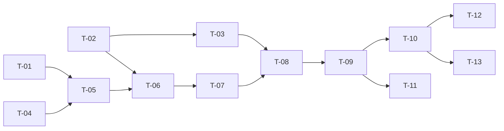

# TASKS — `RF-SP-011` Consultar auditoría de cambios

| Campo | Valor |
|---|---|
| Requerimiento | `RF-SP-011` |
| Especificación | [`spec.md`](spec.md) |
| Plan | [`plan.md`](plan.md) |
| `plan.md` aprobado el | 21-08-2026 |
| Estado | **Aprobadas** — 25-08-2026 |
| Issue | Pendiente de crear |
| Rama | `feature/consultar-auditoria-cambios` |
| Aprobadas por | Responsable técnico el 25-08-2026 |

!!! info "Qué va en este documento"

    **En qué pasos, en qué orden y cómo se verifica cada uno.**

    **Prueba de pertenencia:** si no puede marcarse como hecho, no es una tarea.

    **Es la fuente de verdad de las tareas.** El Issue de GitHub coordina y enlaza aquí; no la sustituye ni la duplica. Si las dos listas discrepan, manda este archivo.

    No se escribe hasta que `plan.md` esté aprobado, y ninguna tarea se ejecuta hasta que este documento lo esté (Art. I.6).

---

## 1. Tareas

Estructuralmente es `RF-SP-002` con otros filtros, pero sobre una tabla que crece sin límite. Dos tareas tienen por eso alcance mayor que este requerimiento y las heredan `RF-SP-012` a `RF-SP-014`: `T-02`, el conteo acotado, y `T-03`, el campo `totalIsExact` en la envoltura compartida.

| # | Tarea | Depende de | Verificación | Estado |
|---|---|---|---|---|
| `T-01` | Migración `V9__create_audit_change_log_timeline_index.sql`: `ix_audit_change_log_occurred_at` sobre `(occurred_at DESC, id DESC)` | — | `mvn flyway:info` la lista aplicada; el `EXPLAIN` del listado sin filtros muestra el recorrido del índice y **no** un ordenamiento de la tabla | Hecha |
| `T-02` | `shared/api/BoundedCount`: conteo con techo mediante subconsulta con `LIMIT count-limit + 1`, que devuelve el total y su marca de exactitud | — | Prueba de integración: con el techo en 10 y 25 filas, devuelve 10 y «no exacto»; el `EXPLAIN (ANALYZE)` muestra que el nodo de límite corta en 11 | Hecha |
| `T-03` | `shared/api/PageResponse<T>` gana `totalIsExact`, y `shared/config` declara `nexus.pagination.count-limit: 10000` | `T-02` | Prueba unitaria: los listados de conteo exacto devuelven `true` constante; el techo se lee de configuración, no de una constante | Hecha |
| `T-04` | `application`: `ChangeAuditQuery`, `ChangeAuditItem`, el enum cerrado `AuditAction` y el puerto `ChangeAuditQueryRepository` | — | Prueba unitaria: `action` fuera de `CREATE`/`UPDATE` se rechaza antes de construir consulta alguna | Hecha |
| `T-05` | `infrastructure`: `AuditChangeLogEntity` como metamodelo y `JpaChangeAuditQueryRepository` con predicado por filtros presentes, rango **semiabierto** `>= from AND < to`, proyección con `cb.construct` y orden fijo `occurred_at DESC, id DESC` | `T-01`, `T-04` | Prueba de integración: un evento en el instante `to` no aparece y sí aparece cuando ese instante es `from`; dos eventos con el mismo instante salen en orden estable | Hecha |
| `T-06` | Conteo del listado usando `BoundedCount` y **la misma función de predicado** que los datos | `T-02`, `T-05` | Prueba de integración: con un filtro que deja 3 eventos, `totalElements` vale 3 y no el total de la tabla; datos y conteo no pueden divergir | Hecha |
| `T-07` | `application/ListChangeAuditService` con `@Transactional(readOnly = true)` | `T-06` | Prueba de integración: la petición ejecuta **dos** sentencias como máximo, y la transacción de solo lectura impide escribir en la tabla desde este camino | Hecha |
| `T-08` | `api`: `ListChangeAuditRequest` con Bean Validation (`VAL-001` a `VAL-003`) e instantes con zona obligatoria, y `ChangeAuditItemResponse` con `changes` como objeto JSON | `T-07` | Prueba de API: `from=2026-08-01` sin zona devuelve `400`; `from` posterior a `to` devuelve `400` con `VAL-001` y no colección vacía; los cuatro `400` se devuelven juntos | Hecha |
| `T-09` | `api/AuditController`: `GET /api/v1/audit/changes` con el permiso `audit:read-changes` declarado **sobre el método**, y sin ningún manejador de escritura | `T-08` | Prueba de API: `200` con la envoltura paginada; `POST`, `PUT`, `PATCH` y `DELETE` sobre el recurso devuelven `405` | Hecha |
| `T-10` | Pruebas de API e integración de los criterios de aceptación de `spec.md` §12 | `T-09` | La suite cubre `CA-SP-081` a `CA-SP-088`; `CA-SP-087` se verifica **sobre el camino de escritura**, ejecutando una escritura real con un campo enmascarado | Hecha |
| `T-11` | Pruebas del conteo acotado y de los casos límite de `spec.md` §13: por debajo y por encima del techo, navegación más allá de la cota, registro eliminado, empate en `occurred_at` y uso efectivo del índice | `T-09` | Con el techo en 10 y 25 eventos, la página 2 devuelve contenido real: el techo no es un muro | Hecha |
| `T-12` | Documentación OpenAPI del endpoint: los nueve parámetros, la envoltura con `totalIsExact` y los estados `400`, `401`, `403` y `500` | `T-10` | El contrato publicado coincide con el comportamiento real (Art. VIII.6), y documenta qué significa `totalIsExact: false` | Hecha |
| `T-13` | Actualizar la matriz de trazabilidad de `docs/requirements.md` | `T-10` | La fila de `RF-SP-011` refleja el estado y enlaza esta tripleta | Hecha |

**Estados:** `Pendiente` · `En curso` · `Hecha` · `Bloqueada`.

!!! note "Cuatro desviaciones al implementar — 25-08-2026"

    Los cuatro registros se implementaron **en un solo pase**, y eso cambió cuatro cosas respecto de lo que los cuatro `plan.md` describían por separado. Se dejan escritas porque la diferencia entre el documento y el código, sin explicación, se lee como descuido:

    1. **Una sola migración, `V33`, en lugar de `V9` a `V12`.** Aquellos números se reservaron antes de que se aplicaran `V13` a `V32`, e insertarlos hoy deja migraciones fuera de orden: Flyway aborta el arranque en toda base ya migrada. Van además en un solo archivo porque son **el mismo índice cuatro veces** sobre cuatro tablas hermanas; separarlas no aporta reversibilidad —ninguna se aplica sin las otras— y sí cuatro cabeceras repitiendo el mismo argumento.
    2. **Un puerto, un adaptador, un caso de uso y un controlador para los cuatro.** Los planes describían uno por registro. Son la misma consulta cuatro veces —predicado opcional, orden fijo, página y conteo acotado— sobre cuatro tablas que comparten el núcleo común de columnas: cuatro copias del predicado de rango habrían sido cuatro ocasiones de que una divergiera, y una divergencia ahí **no se ve**, porque devuelve datos plausibles. El permiso se sigue declarando **por método**, de modo que compartir clase no comparte autorización.
    3. **Los dominios cerrados de los filtros se reutilizan de `AuditEnums`**, en lugar de declarar enumerados nuevos en `application`. Aquellos ya existen, ya replican el `CHECK` del esquema y son los que usa quien escribe: un segundo juego de constantes para leer lo mismo que se escribe sería la ocasión perfecta de que ambos dejaran de coincidir.
    4. **`BoundedCount` no vive en `shared/api` sino en `shared/pagination`**, junto a `PageResponse` y `Pagination`, que es donde el sistema ya tiene la mecánica de paginar. El argumento del plan —que no viva en el adaptador, para que no haya cuatro techos distintos— se conserva entero.

## 2. Orden de ejecución

`T-02` y `T-03` son infraestructura compartida: conviene integrarlas en su propio Pull Request, porque cambian el contrato de **todos** los listados del sistema y las heredan los tres requerimientos de auditoría siguientes.

## 3. Cobertura de los criterios de aceptación

| Criterio | Tarea que lo cubre |
|---|---|
| `CA-SP-081` | `T-01`, `T-05`, `T-10` |
| `CA-SP-082` | `T-08`, `T-10` |
| `CA-SP-083` | `T-08`, `T-10` |
| `CA-SP-084` | `T-05`, `T-10` |
| `CA-SP-085` | `T-05`, `T-10` |
| `CA-SP-086` | `T-08`, `T-10` |
| `CA-SP-087` | `T-10` |
| `CA-SP-088` | `T-09`, `T-10` |

La inmutabilidad del registro por API (`spec.md` §4.2) no tiene tarea que la implemente: se cumple porque `T-09` no declara ningún manejador de escritura, y lo que la hace verificable es el `405` de `T-09`. El conteo acotado y los casos límite de `spec.md` §13 los cubre `T-11`.

## 4. Bloqueos

| # | Bloqueo | Desde | Responsable | Estado |
|---|---|---|---|---|
| 1 | `T-03` añade un campo a `PageResponse<T>`, que ya devuelve `RF-SP-002`. Ese requerimiento debe pasar a devolver `totalIsExact: true` constante en el mismo Pull Request, o los dos listados publicarán formas distintas de la misma envoltura | 21-08-2026 | Responsable técnico | Abierto |
| 2 | `T-10` necesita eventos reales escritos por `RF-SP-001` y `RF-SP-004` para verificar `CA-SP-082` y `CA-SP-083`: ambos requerimientos deben estar integrados | 21-08-2026 | Responsable técnico | Abierto |
| 3 | `RF-SP-012` a `RF-SP-014` heredan `T-02`, `T-03` y el reparto de componentes, **pero cada uno debe crear su propio índice de línea de tiempo**: `V9` solo cubre `audit_change_log`. Y `RF-SP-014` no hereda §6 de este plan: su consulta sí emite evento de seguridad | 21-08-2026 | Responsable técnico | Abierto |

## 5. Definición de terminado

El requerimiento no está terminado hasta cumplir **todas** las condiciones de la constitución §16:

- [x] Todas las tareas en estado `Hecha`.
- [x] Todos los criterios de aceptación con prueba automatizada en verde.
- [x] `mvn verify` en verde en local (25-08-2026).
- [x] Toda escritura emite su evento de auditoría, en la transacción que corresponde.
- [x] Los endpoints nuevos declaran su permiso.
- [x] El contrato OpenAPI coincide con el comportamiento real.
- [ ] Documentación afectada actualizada en el mismo Pull Request.
- [x] Matriz de trazabilidad actualizada.
- [ ] Pull Request aprobado por alguien distinto del autor e integrado.
