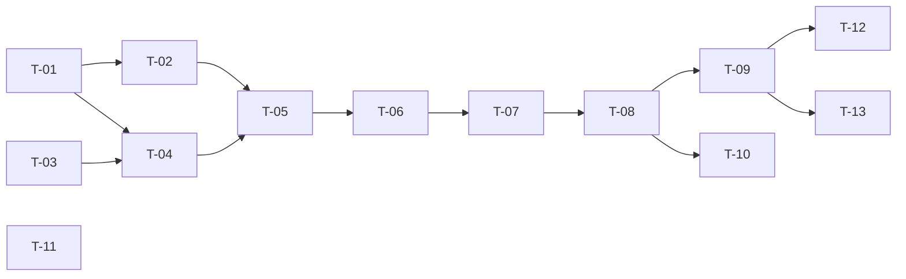

# TASKS — `RF-SP-012` Consultar auditoría de eliminación

| Campo | Valor |
|---|---|
| Requerimiento | `RF-SP-012` |
| Especificación | [`spec.md`](spec.md) |
| Plan | [`plan.md`](plan.md) |
| `plan.md` aprobado el | 21-08-2026 |
| Estado | **Aprobadas** — 25-08-2026 |
| Issue | Pendiente de crear |
| Rama | `feature/consultar-auditoria-eliminacion` |
| Aprobadas por | Responsable técnico el 25-08-2026 |

!!! info "Qué va en este documento"

    **En qué pasos, en qué orden y cómo se verifica cada uno.**

    **Prueba de pertenencia:** si no puede marcarse como hecho, no es una tarea.

    **Es la fuente de verdad de las tareas.** El Issue de GitHub coordina y enlaza aquí; no la sustituye ni la duplica. Si las dos listas discrepan, manda este archivo.

    No se escribe hasta que `plan.md` esté aprobado, y ninguna tarea se ejecuta hasta que este documento lo esté (Art. I.6).

---

## 1. Tareas

Hereda de `RF-SP-011` el conteo acotado, el orden fijo, el rango semiabierto y el reparto de componentes: nada de eso se rehace. Lo propio son tres cosas, y las tres tienen tarea: la búsqueda por motivo con índice **parcial** (`T-02`, `T-05`), el motivo vacío como valor legítimo garantizado por el esquema (`T-07`), y la prueba automática de que **ninguna** clave foránea del sistema declara borrado en cascada (`T-11`).

| # | Tarea | Depende de | Verificación | Estado |
|---|---|---|---|---|
| `T-01` | Migración `V10`, primera parte: `ix_audit_deletion_log_occurred_at` sobre `(occurred_at DESC, id DESC)` | — | `mvn flyway:info` la lista aplicada; el `EXPLAIN` del listado sin filtros muestra el índice y no un ordenamiento de la tabla | Hecha |
| `T-02` | Migración `V10`, segunda parte: `ix_audit_deletion_log_reason_busqueda`, GIN de trigramas sobre `f_unaccent(lower(reason))`, **parcial** con `WHERE deletion_type <> 'ASSOCIATION'` | `T-01` | El índice se crea sin error, lo que confirma que `f_unaccent` (`V1`, `RF-SP-010`) está disponible | Hecha |
| `T-03` | `application`: `DeletionAuditQuery`, `DeletionAuditItem`, el enum cerrado `DeletionType` y el puerto `DeletionAuditQueryRepository` | — | Prueba unitaria: un tipo fuera de los tres valores se rechaza antes de construir consulta alguna | Hecha |
| `T-04` | `infrastructure`: `AuditDeletionLogEntity` como metamodelo y `JpaDeletionAuditQueryRepository` con predicado, proyección, orden fijo y conteo acotado con `BoundedCount` | `T-01`, `T-03` | Prueba de integración: dos sentencias como máximo por petición; datos y conteo comparten la misma función de predicado | Hecha |
| `T-05` | Búsqueda por motivo: recorte, escape de `\`, `%` y `_`, parámetro enlazado, normalización con `f_unaccent` y **la condición `deletion_type <> 'ASSOCIATION'` añadida solo cuando el filtro está presente** | `T-02`, `T-04` | Prueba de integración: el `EXPLAIN` muestra el recorrido del índice parcial. Sin esa condición la búsqueda devuelve lo correcto recorriendo toda la tabla, y ninguna prueba funcional lo detecta | Hecha |
| `T-06` | `application/ListDeletionAuditService` con `@Transactional(readOnly = true)` | `T-05` | Prueba de integración: la transacción de solo lectura impide escribir en el registro desde este camino | Hecha |
| `T-07` | `api`: `ListDeletionAuditRequest` con Bean Validation e instantes con zona, y `DeletionAuditItemResponse` con `snapshot` como objeto JSON y `reason` presente aunque sea nulo | `T-06` | Prueba de API: una asociación devuelve `reason: null` con el campo **presente**, no omitido; el endpoint no interpreta el `snapshot` | Hecha |
| `T-08` | `api/AuditController`: añade `GET /api/v1/audit/deletions` con el permiso `audit:read-deletions` declarado sobre el método, sin ningún manejador de escritura | `T-07` | Prueba de API: `200` con la envoltura paginada; los cuatro verbos de escritura devuelven `405`; un actor con los otros tres permisos de auditoría recibe `403` | Hecha |
| `T-09` | Pruebas de API e integración de los criterios de aceptación de `spec.md` §12 | `T-08` | La suite cubre `CA-SP-089` a `CA-SP-095`, `CA-SP-166` y `CA-SP-177`; `CA-SP-094` se verifica **sobre el camino de escritura** | Hecha |
| `T-10` | Pruebas de los casos límite de `spec.md` §13 y de `plan.md` §11: código reutilizado tras eliminar, búsqueda con caracteres especiales, búsqueda vacía, asociación combinada con motivo, rango semiabierto y conteo acotado | `T-08` | `deletionType=ASSOCIATION&reason=algo` devuelve `200` con colección vacía, no error; una búsqueda vacía **no** añade la condición de tipo y las asociaciones siguen apareciendo | Hecha |
| `T-11` | Prueba automática de **ausencia de cascadas**: consulta sobre `pg_constraint` que falla si aparece cualquier clave foránea con `confdeltype` en `c` o `n`, en cualquier tabla | — | La prueba falla al declarar a propósito una clave foránea con `ON DELETE CASCADE`. Es lo que exige `spec.md` §14 y lo que impide que una migración futura abra un camino de borrado sin evento | Hecha |
| `T-12` | Documentación OpenAPI del endpoint: los diez parámetros, la envoltura con `totalIsExact` y los estados `400`, `401`, `403` y `500` | `T-09` | El contrato publicado coincide con el comportamiento real (Art. VIII.6), y documenta que `reason` es nulo en las asociaciones por diseño | Hecha |
| `T-13` | Actualizar la matriz de trazabilidad de `docs/requirements.md` | `T-09` | La fila de `RF-SP-012` refleja el estado y enlaza esta tripleta | Hecha |

**Estados:** `Pendiente` · `En curso` · `Hecha` · `Bloqueada`.

## 2. Orden de ejecución

`T-11` no depende de nada de este requerimiento y puede escribirse el primer día: es una prueba sobre el esquema, no sobre el endpoint.

## 3. Cobertura de los criterios de aceptación

| Criterio | Tarea que lo cubre |
|---|---|
| `CA-SP-089` | `T-01`, `T-04`, `T-09` |
| `CA-SP-090` | `T-09` |
| `CA-SP-091` | `T-07`, `T-09` |
| `CA-SP-092` | `T-04`, `T-09` |
| `CA-SP-166` | `T-02`, `T-05`, `T-09` |
| `CA-SP-093` | `T-07`, `T-09` |
| `CA-SP-094` | `T-09` |
| `CA-SP-095` | `T-08`, `T-09` |
| `CA-SP-177` | `T-04`, `T-09` |

`CA-SP-090` y `CA-SP-091` no tienen código propio que las implemente: las garantiza `ck_deletion_reason` en el esquema, y `T-09` las verifica sobre eventos reales escritos por `RF-SP-009` y `RF-SP-006`. La ausencia de cascadas de `spec.md` §13 la cubre `T-11`, y el resto de casos límite, `T-10`.

## 4. Bloqueos

| # | Bloqueo | Desde | Responsable | Estado |
|---|---|---|---|---|
| 1 | `T-04` y `T-07` reutilizan `BoundedCount` y `PageResponse<T>` con `totalIsExact`, que estrena `RF-SP-011`: ese requerimiento debe integrarse antes | 21-08-2026 | Responsable técnico | Abierto |
| 2 | `T-09` necesita eventos reales escritos por `RF-SP-009` —eliminación lógica con motivo— y por `RF-SP-006` —asociación sin motivo—: ambos requerimientos deben estar integrados | 21-08-2026 | Responsable técnico | Abierto |
| 3 | `T-02` depende de `f_unaccent`, creada en `V1` por `RF-SP-010`. Quien modifique el diccionario `unaccent` debe reindexar también este índice, que es su tercer consumidor | 21-08-2026 | Responsable técnico | Abierto |

## 5. Definición de terminado

El requerimiento no está terminado hasta cumplir **todas** las condiciones de la constitución §16:

- [x] Todas las tareas en estado `Hecha`.
- [x] Todos los criterios de aceptación con prueba automatizada en verde.
- [x] `mvn verify` en verde en local (25-08-2026).
- [x] Toda escritura emite su evento de auditoría, en la transacción que corresponde.
- [x] Los endpoints nuevos declaran su permiso.
- [x] El contrato OpenAPI coincide con el comportamiento real.
- [ ] Documentación afectada actualizada en el mismo Pull Request.
- [x] Matriz de trazabilidad actualizada.
- [ ] Pull Request aprobado por alguien distinto del autor e integrado.
