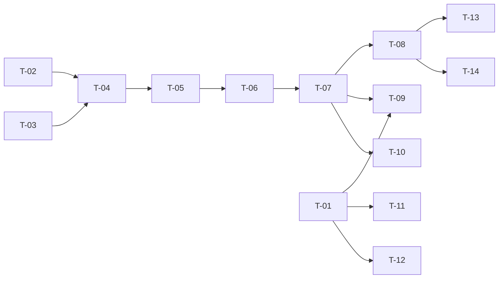

# TASKS — `RF-SP-013` Consultar auditoría de error

| Campo | Valor |
|---|---|
| Requerimiento | `RF-SP-013` |
| Especificación | [`spec.md`](spec.md) |
| Plan | [`plan.md`](plan.md) |
| `plan.md` aprobado el | 21-08-2026 |
| Estado | **Aprobadas** — 25-08-2026 |
| Issue | Pendiente de crear |
| Rama | `feature/consultar-auditoria-error` |
| Aprobadas por | Responsable técnico el 25-08-2026 |

!!! info "Qué va en este documento"

    **En qué pasos, en qué orden y cómo se verifica cada uno.**

    **Prueba de pertenencia:** si no puede marcarse como hecho, no es una tarea.

    **Es la fuente de verdad de las tareas.** El Issue de GitHub coordina y enlaza aquí; no la sustituye ni la duplica. Si las dos listas discrepan, manda este archivo.

    No se escribe hasta que `plan.md` esté aprobado, y ninguna tarea se ejecuta hasta que este documento lo esté (Art. I.6).

---

## 1. Tareas

Es el más simple de los cuatro en cuanto a consulta: hereda íntegro el §4 y el §7 de `RF-SP-011` y cambian solo los filtros y las columnas. Lo propio son dos cosas, y ninguna está en el camino de la consulta: el índice por código de error que sostiene el diagnóstico real (`T-02`), y los dos criterios negativos —`CA-SP-100` y `CA-SP-101`—, que **no se cumplen consultando bien sino escribiendo bien**, y por eso viven en `ck_audit_error_log_status`, dentro de la migración `V4` de `RF-SP-001` (`T-01`).

| # | Tarea | Depende de | Verificación | Estado |
|---|---|---|---|---|
| `T-01` | Comprobar que `V4__create_audit_logs.sql` declara `ck_audit_error_log_status CHECK (http_status NOT IN (400, 401, 403, 404))`, e incorporarla si aún no está | — | Prueba de integración: un `INSERT` con cada uno de los cuatro estados prohibidos es rechazado, y los estados `200`, `409`, `422`, `500` y `503` se **aceptan**. Ambas mitades importan | Hecha |
| `T-02` | Migración `V11__create_audit_error_log_indexes.sql`: `ix_audit_error_log_occurred_at` sobre `(occurred_at DESC, id DESC)` e `ix_audit_error_log_error_code` sobre `(error_code, occurred_at DESC)` | — | `mvn flyway:info` los lista aplicados; el `EXPLAIN` de una consulta por código más rango muestra el segundo índice **sin paso de ordenamiento** | Hecha |
| `T-03` | `application`: `ErrorAuditQuery`, `ErrorAuditItem`, los enums cerrados `ErrorType` y `ErrorSeverity` —propios, no compartidos con `audit_security_log`— y el puerto `ErrorAuditQueryRepository` | — | Prueba unitaria: un tipo o una severidad fuera de dominio se rechazan antes de construir consulta alguna | Hecha |
| `T-04` | `infrastructure`: `AuditErrorLogEntity` como metamodelo y `JpaErrorAuditQueryRepository` con predicado —`errorCode` por **igualdad**—, proyección, orden fijo y conteo acotado con `BoundedCount` | `T-02`, `T-03` | Prueba de integración: dos sentencias como máximo por petición, **ningún `GROUP BY`**, y `errorCode=RN-SEG-01` no devuelve los eventos de `RN-SEG-010` | Hecha |
| `T-05` | `application/ListErrorAuditService` con `@Transactional(readOnly = true)` | `T-04` | Prueba de integración: la transacción de solo lectura impide escribir en el registro desde este camino | Hecha |
| `T-06` | `api`: `ListErrorAuditRequest` con Bean Validation e instantes con zona, y `ErrorAuditItemResponse` con `message` **tal como se almacenó**, sin sanear de nuevo, y `actorId` y `entityId` presentes aunque sean nulos | `T-05` | Prueba de API: un evento sin actor devuelve `actorId: null` con el campo presente; la respuesta no incluye traza técnica ni agregados por tipo o severidad | Hecha |
| `T-07` | `api/AuditController`: añade `GET /api/v1/audit/errors` con el permiso `audit:read-errors` declarado sobre el método, sin ningún manejador de escritura | `T-06` | Prueba de API: `200` con la envoltura paginada; los cuatro verbos de escritura devuelven `405`; un actor con los otros tres permisos de auditoría recibe `403` | Hecha |
| `T-08` | Pruebas de los criterios positivos de `spec.md` §12 | `T-07` | La suite cubre `CA-SP-096` a `CA-SP-099` y `CA-SP-102`; `CA-SP-097` se prueba de extremo a extremo: provocar un fallo real, tomar el `correlationId` de la respuesta y recuperar el evento con él | Hecha |
| `T-09` | Pruebas de los dos criterios negativos, `CA-SP-100` y `CA-SP-101`, por los **dos** caminos: provocando un `403`, un `400` y un `404` reales, y con `INSERT` directos contra la restricción | `T-01`, `T-07` | El `403` real no deja fila en `audit_error_log` y sí en `audit_security_log`; los `INSERT` directos con los cuatro estados prohibidos fallan | Hecha |
| `T-10` | Pruebas de los casos límite de `spec.md` §13 y de `plan.md` §11: fallo sin actor, fallo sin registro concreto, ráfaga de mil fallos idénticos, uso de ambos índices, rango semiabierto y conteo acotado | `T-07` | Mil eventos con el mismo código se devuelven como mil filas con sus instantes distintos, no agrupadas ni con contador | Hecha |
| `T-11` | Prueba de que un fallo al **escribir** la auditoría no arrastra al negocio: con un escritor que intenta registrar un estado prohibido, la operación de negocio se confirma igual y el fallo queda en el log de aplicación | `T-01` | La operación de negocio devuelve su respuesta normal; no se produce cadena de eventos | Hecha |
| `T-12` | Actualizar `architecture.md` §6.6.4 para que declare `ck_audit_error_log_status` junto a la tabla de qué entra y qué no (Art. XII.3) | `T-01` | Documento y esquema dicen lo mismo | Hecha |
| `T-13` | Documentación OpenAPI del endpoint: los nueve parámetros, la envoltura con `totalIsExact` y los estados `400`, `401`, `403` y `500` | `T-08` | El contrato publicado coincide con el comportamiento real (Art. VIII.6) | Hecha |
| `T-14` | Actualizar la matriz de trazabilidad de `docs/requirements.md` | `T-08` | La fila de `RF-SP-013` refleja el estado y enlaza esta tripleta | Hecha |

**Estados:** `Pendiente` · `En curso` · `Hecha` · `Bloqueada`.

## 2. Orden de ejecución

`T-01` es la primera y la más urgente: si `V4` ya se aplicó sin la restricción, añadirla deja de ser una edición de la migración y pasa a ser una alteración sobre una tabla en uso, con todas sus filas que validar.

## 3. Cobertura de los criterios de aceptación

| Criterio | Tarea que lo cubre |
|---|---|
| `CA-SP-096` | `T-02`, `T-04`, `T-08` |
| `CA-SP-097` | `T-04`, `T-08` |
| `CA-SP-098` | `T-04`, `T-08` |
| `CA-SP-099` | `T-06`, `T-08` |
| `CA-SP-100` | `T-01`, `T-09` |
| `CA-SP-101` | `T-01`, `T-09` |
| `CA-SP-102` | `T-07`, `T-08` |

`CA-SP-099` no tiene código propio en este requerimiento: la garantía la da el saneamiento **al escribir**, y `T-08` la verifica sobre ese camino, provocando un fallo cuyo mensaje contiene una ruta y una sentencia. `CA-SP-100` y `CA-SP-101` tampoco: los garantiza `ck_audit_error_log_status` de `T-01`. Los casos límite de `spec.md` §13 los cubren `T-10` y `T-11`.

## 4. Bloqueos

| # | Bloqueo | Desde | Responsable | Estado |
|---|---|---|---|---|
| 1 | `T-01` toca `V4__create_audit_logs.sql`, migración de `RF-SP-001`. Debe hacerse **antes del primer despliegue**: añadir la restricción a una tabla en uso obliga a validar las filas existentes y a decidir qué hacer con las que no cumplen | 21-08-2026 | Responsable técnico | Abierto |
| 2 | `T-04` y `T-06` reutilizan `BoundedCount` y `PageResponse<T>` con `totalIsExact`, que estrena `RF-SP-011`: ese requerimiento debe integrarse antes | 21-08-2026 | Responsable técnico | Abierto |
| 3 | La restricción de `T-01` sujeta a **todo** escritor de `audit_error_log`: quien intente registrar un `400`, `401`, `403` o `404` recibirá un fallo de integridad. Es lo pretendido, y quien implemente `shared/audit` en `RF-SP-001` debe saberlo antes de encontrárselo | 21-08-2026 | Responsable técnico | Abierto |
| 4 | La retención del registro queda fuera de esta especificación (`spec.md` §14, pregunta 3, y D-10). El conteo acotado impide que el volumen degrade la respuesta, pero no mitiga el crecimiento del almacenamiento | 21-08-2026 | Responsable técnico | Abierto |

## 5. Definición de terminado

El requerimiento no está terminado hasta cumplir **todas** las condiciones de la constitución §16:

- [x] Todas las tareas en estado `Hecha`.
- [x] Todos los criterios de aceptación con prueba automatizada en verde.
- [x] `mvn verify` en verde en local (25-08-2026).
- [x] Toda escritura emite su evento de auditoría, en la transacción que corresponde.
- [x] Los endpoints nuevos declaran su permiso.
- [x] El contrato OpenAPI coincide con el comportamiento real.
- [ ] Documentación afectada actualizada en el mismo Pull Request.
- [x] Matriz de trazabilidad actualizada.
- [ ] Pull Request aprobado por alguien distinto del autor e integrado.
