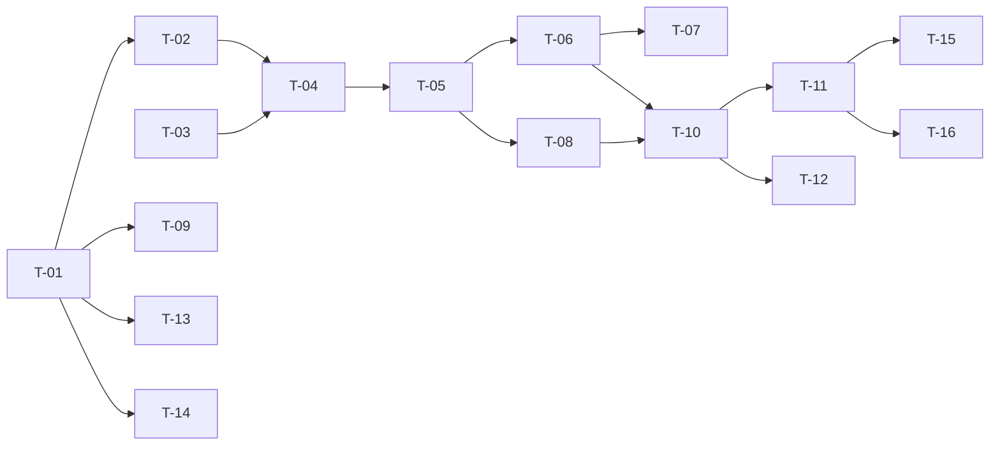

# TASKS — `RF-SP-014` Consultar auditoría de seguridad

| Campo | Valor |
|---|---|
| Requerimiento | `RF-SP-014` |
| Especificación | [`spec.md`](spec.md) |
| Plan | [`plan.md`](plan.md) |
| `plan.md` aprobado el | 21-08-2026 |
| Estado | **En revisión** |
| Issue | Pendiente de crear |
| Rama | `feature/consultar-auditoria-seguridad` |
| Aprobadas por | Pendiente |

!!! info "Qué va en este documento"

    **En qué pasos, en qué orden y cómo se verifica cada uno.**

    **Prueba de pertenencia:** si no puede marcarse como hecho, no es una tarea.

    **Es la fuente de verdad de las tareas.** El Issue de GitHub coordina y enlaza aquí; no la sustituye ni la duplica. Si las dos listas discrepan, manda este archivo.

    No se escribe hasta que `plan.md` esté aprobado, y ninguna tarea se ejecuta hasta que este documento lo esté (Art. I.6).

---

## 1. Tareas

Hereda de `RF-SP-011` la proyección única, el conteo acotado, el orden fijo y el rango semiabierto. Lo propio son tres cosas y las tres tienen tarea: el catálogo de dieciséis códigos que este requerimiento fija para todo el módulo (`T-01`), el evento que la propia consulta emite y que **no puede escribirse dentro de la transacción de lectura** (`T-06`), y la forma del `LOGIN_FAILURE` que impide enumerar cuentas (`T-09`).

| # | Tarea | Depende de | Verificación | Estado |
|---|---|---|---|---|
| `T-01` | En `V4__create_audit_logs.sql`: `ck_audit_security_log_event_type` con los **dieciséis literales** de `plan.md` §2, y el índice por origen declarado compuesto como `(ip_address, occurred_at DESC)` | — | Prueba de integración: la restricción acepta los dieciséis literales y rechaza cualquier otro, incluidas variantes de capitalización. **Antes del primer despliegue** | Pendiente |
| `T-02` | Migración `V12__create_audit_security_log_indexes.sql`: `ix_audit_security_log_occurred_at` sobre `(occurred_at DESC, id DESC)` | `T-01` | `mvn flyway:info` la lista aplicada; el `EXPLAIN` del listado sin filtros muestra el índice y no un ordenamiento de la tabla | Pendiente |
| `T-03` | `application`: `SecurityAuditQuery`, `SecurityAuditItem`, los enums cerrados `SecurityEventType` —los dieciséis códigos—, `SecuritySeverity` y `SecurityOutcome`, y el puerto `SecurityAuditQueryRepository` | — | Prueba unitaria: los tres dominios se rechazan fuera de rango antes de construir consulta alguna; los literales del enum coinciden **uno a uno** con los del `CHECK` de `T-01` | Pendiente |
| `T-04` | `infrastructure`: `AuditSecurityLogEntity` como metamodelo y `JpaSecurityAuditQueryRepository` con predicado, proyección, orden fijo y conteo acotado; `ipAddress` convertido y comparado **sobre la columna `inet`**, no como texto | `T-02`, `T-03` | Prueba de integración: `190.85.012.7` y `190.85.12.7` devuelven el mismo resultado; dos sentencias como máximo por consulta | Pendiente |
| `T-05` | `application/ListSecurityAuditService` con `@Transactional(readOnly = true)` para la consulta | `T-04` | Prueba de integración: la transacción de solo lectura impide escribir en la tabla desde el camino de consulta, y esa garantía **no se relaja** por el evento propio | Pendiente |
| `T-06` | `shared/audit/SecurityAuditWriter` gana `SECURITY_AUDIT_READ`, y el caso de uso lo emite **después de cerrar** la transacción de lectura, en la suya propia con `REQUIRES_NEW`, con los filtros aplicados en `detail` —los ausentes **se omiten**, no se escriben como nulos— | `T-05` | Prueba de integración: dos consultas consecutivas; la primera **no** contiene su propio evento y la segunda sí contiene el de la primera | Pendiente |
| `T-07` | Un fallo al escribir ese evento **no propaga**: la consulta responde `200` y el fallo queda como `ERROR` en el log de aplicación con su `correlation_id` | `T-06` | Prueba de integración: con el escritor forzado a fallar, la consulta responde `200` igual y queda constancia del fallo | Pendiente |
| `T-08` | `api`: `ListSecurityAuditRequest` con Bean Validation —`ipAddress` malformada produce `VAL-003`, no colección vacía— y `SecurityAuditItemResponse` con `detail` como objeto JSON y `actorId` y `targetUserId` presentes aunque sean nulos | `T-05` | Prueba de API: `ipAddress=190.85.12` devuelve `400`; un evento sin actor devuelve `actorId: null` con el campo presente | Pendiente |
| `T-09` | Fijar la forma del `LOGIN_FAILURE` como obligación sobre `RF-SP-034`: `actor_id` y `target_user_id` **siempre nulos**, `severity` y `outcome` invariables, y el identificador intentado en `detail` | `T-01` | Prueba de integración: dos intentos fallidos —uno contra una cuenta real, otro contra una inventada— producen filas **indistinguibles campo por campo** salvo por `detail.attemptedUsername` | Pendiente |
| `T-10` | `api/AuditController`: añade `GET /api/v1/audit/security` con el permiso `audit:read-security` declarado sobre el método, sin ningún manejador de escritura | `T-06`, `T-08` | Prueba de API: `200` con la envoltura paginada; los cuatro verbos de escritura devuelven `405`; un actor con los otros tres permisos de auditoría recibe `403`, y esa denegación queda **en esta misma tabla** | Pendiente |
| `T-11` | Pruebas de API e integración de los criterios de aceptación de `spec.md` §12 | `T-10` | La suite cubre `CA-SP-103` a `CA-SP-110` y `CA-SP-167`; `CA-SP-106` se verifica **sobre el camino de escritura**, con un inicio de sesión fallido y un restablecimiento de contraseña reales | Pendiente |
| `T-12` | Pruebas de los casos límite de `spec.md` §13 y de `plan.md` §11: correspondencia de severidad por tipo de evento, reutilización de credencial de refresco, ráfaga de intentos fallidos, actor sin autenticar, uso de ambos índices y conteo acotado | `T-10` | Cada evento que el sistema emite lleva la severidad y el `outcome` que `plan.md` §2 le asigna; sin esta prueba la correspondencia queda solo en la documentación | Pendiente |
| `T-13` | Enmendar `security.md`: §8.1 incorpora la columna de código, el desdoblamiento de las filas agrupadas y la fila de `SECURITY_AUDIT_READ`; §8.2 recoge que el índice por origen de esta tabla es compuesto | `T-01` | La lista del documento coincide literal por literal con el `CHECK` de `T-01` | Pendiente |
| `T-14` | Enmendar `architecture.md` §6.6.6: el índice mínimo `(ip_address)` se refina a `(ip_address, occurred_at DESC)` en `audit_security_log` | `T-01` | Documento y esquema dicen lo mismo (Art. XII.3) | Pendiente |
| `T-15` | Documentación OpenAPI del endpoint: los diez parámetros, la envoltura con `totalIsExact` y los estados `400`, `401`, `403` y `500` | `T-11` | El contrato publicado coincide con el comportamiento real (Art. VIII.6), y documenta que la consulta deja su propio evento | Pendiente |
| `T-16` | Actualizar la matriz de trazabilidad de `docs/requirements.md` | `T-11` | La fila de `RF-SP-014` refleja el estado y enlaza esta tripleta | Pendiente |

**Estados:** `Pendiente` · `En curso` · `Hecha` · `Bloqueada`.

## 2. Orden de ejecución

`T-01` es la primera y la más urgente: fija el vocabulario que emiten todos los requerimientos del módulo, y añadirla a una tabla en uso obliga a validar las filas existentes.

## 3. Cobertura de los criterios de aceptación

| Criterio | Tarea que lo cubre |
|---|---|
| `CA-SP-103` | `T-02`, `T-04`, `T-11` |
| `CA-SP-104` | `T-04`, `T-11` |
| `CA-SP-105` | `T-04`, `T-08`, `T-11` |
| `CA-SP-106` | `T-11` |
| `CA-SP-107` | `T-01`, `T-11` |
| `CA-SP-108` | `T-10`, `T-11` |
| `CA-SP-109` | `T-09`, `T-11` |
| `CA-SP-110` | `T-10`, `T-11` |
| `CA-SP-167` | `T-06`, `T-11` |

`CA-SP-106` no tiene código propio en este requerimiento: la garantía la da el enmascaramiento **al escribir** (`security.md` §7.3), y `T-11` la verifica sobre ese camino. `CA-SP-109` tampoco: lo que la cumple es la forma del evento que fija `T-09` sobre `RF-SP-034`. Los casos límite de `spec.md` §13 los cubre `T-12`.

## 4. Bloqueos

| # | Bloqueo | Desde | Responsable | Estado |
|---|---|---|---|---|
| 1 | `T-01` toca `V4__create_audit_logs.sql`, de `RF-SP-001`, y es el **tercer** requerimiento que lo hace —tras `RF-SP-009` y `RF-SP-013`—. Las tres ediciones deben consolidarse en `T-01` de `RF-SP-001` antes del primer despliegue | 21-08-2026 | Responsable técnico | Abierto |
| 2 | `T-09`, `T-11` y `T-12` necesitan eventos reales de autenticación —`LOGIN_FAILURE`, `ACCOUNT_LOCKED`, `REFRESH_TOKEN_REUSE`, `PASSWORD_RESET`—, que emiten `RF-SP-034` a `RF-SP-038`. Ninguno tiene `spec.md` aprobada todavía | 21-08-2026 | Responsable técnico | Abierto |
| 3 | El filtro por `ipAddress` vale lo que valga la lista de proxies confiables (D-21, abierta en `security.md`). No bloquea estas tareas; **debe cerrarse antes del primer despliegue expuesto a Internet**, porque este es el registro donde más importa | 21-08-2026 | Responsable técnico | Abierto |
| 4 | `T-04` y `T-08` reutilizan `BoundedCount` y `PageResponse<T>` con `totalIsExact`, que estrena `RF-SP-011`: ese requerimiento debe integrarse antes | 21-08-2026 | Responsable técnico | Abierto |

## 5. Definición de terminado

El requerimiento no está terminado hasta cumplir **todas** las condiciones de la constitución §16:

- [ ] Todas las tareas en estado `Hecha`.
- [ ] Todos los criterios de aceptación con prueba automatizada en verde.
- [ ] `mvn verify` en verde en local.
- [ ] Toda escritura emite su evento de auditoría, en la transacción que corresponde.
- [ ] Los endpoints nuevos declaran su permiso.
- [ ] El contrato OpenAPI coincide con el comportamiento real.
- [ ] Documentación afectada actualizada en el mismo Pull Request.
- [ ] Matriz de trazabilidad actualizada.
- [ ] Pull Request aprobado por alguien distinto del autor e integrado.
