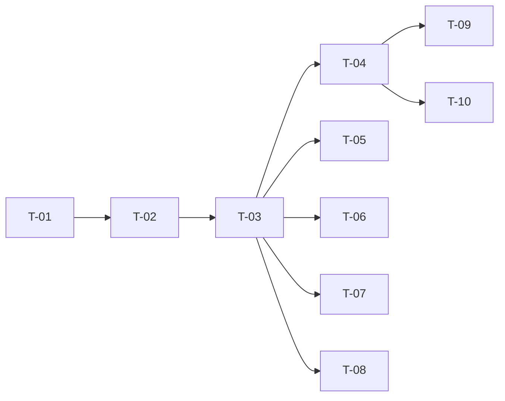

# TASKS — `RF-SP-015` Consultar detalle de un permiso

| Campo | Valor |
|---|---|
| Requerimiento | `RF-SP-015` |
| Especificación | [`spec.md`](spec.md) |
| Plan | [`plan.md`](plan.md) |
| `plan.md` aprobado el | 21-08-2026 |
| Estado | **En revisión** |
| Issue | Pendiente de crear |
| Rama | `feature/consultar-detalle-permiso` |
| Aprobadas por | Pendiente |

!!! info "Qué va en este documento"

    **En qué pasos, en qué orden y cómo se verifica cada uno.**

    **Prueba de pertenencia:** si no puede marcarse como hecho, no es una tarea.

    **Es la fuente de verdad de las tareas.** El Issue de GitHub coordina y enlaza aquí; no la sustituye ni la duplica. Si las dos listas discrepan, manda este archivo.

    No se escribe hasta que `plan.md` esté aprobado, y ninguna tarea se ejecuta hasta que este documento lo esté (Art. I.6).

---

## 1. Tareas

Es el requerimiento más pequeño del módulo: sin migración, sin `domain`, sin tipos nuevos y sin excepciones nuevas. Todo lo que necesita lo crearon `RF-SP-010` —controlador, permiso, modelo de lectura y DTO— y `RF-SP-003` —el conversor estricto del identificador—. La lista de tareas es corta a propósito, y su peso está en las pruebas: dos de ellas verifican decisiones que se toman **por ausencia**.

| # | Tarea | Depende de | Verificación | Estado |
|---|---|---|---|---|
| `T-01` | `application/PermissionQueryRepository` gana `findById(UUID): Optional<PermissionItem>`, y `infrastructure/JpaPermissionQueryRepository` lo implementa con **la misma proyección** que el listado | — | Prueba de integración: devuelve `Optional` vacío para un identificador inexistente, nunca `null`; la consulta es **una** sentencia sin `JOIN` ni subconsultas | Pendiente |
| `T-02` | `application/GetPermissionService` con `@Transactional(readOnly = true)`, que lanza `ResourceNotFoundException` cuando no hay permiso | `T-01` | Prueba de integración: la transacción de solo lectura impide escribir en `permissions` desde este camino, que es la garantía de `RN-SP-004` | Pendiente |
| `T-03` | `api/PermissionController`: añade `GET /api/v1/permissions/{id}` con el permiso `permissions:read`, reutilizando `PermissionResponse` y **sin** declarar restricción de patrón sobre el identificador | `T-02` | Prueba de API: `200` con los cinco campos de `spec.md` §6.2; `404` con `EX-001` para un UUID canónico inexistente; `403` sin el permiso | Pendiente |
| `T-04` | Pruebas de los criterios de aceptación de `spec.md` §12 | `T-03` | La suite cubre `CA-SP-078`, `CA-SP-079` y `CA-SP-080`, con sus estados y sus `error_code` | Pendiente |
| `T-05` | Prueba de las tres formas de identificador inválido: `abc`, `1-1-1-1-1` y un UUID de 35 caracteres | `T-03` | Las tres devuelven `400` con `VAL-001` y campo `id`, **nunca `404`**. La segunda es la que el JDK convertiría sin error, y la que delata una restricción de patrón mal puesta | Pendiente |
| `T-06` | Prueba de coherencia con el listado: el objeto del detalle es **campo por campo idéntico** al elemento correspondiente de `GET /api/v1/permissions` | `T-03` | Una divergencia entre ambos endpoints rompe la construcción. Es lo que sostiene la decisión de compartir tipo en vez de duplicarlo | Pendiente |
| `T-07` | Pruebas de lo que el endpoint **no** hace: sin `createdAt` ni `updatedAt` en el cuerpo, sin sentencias sobre `role_permissions` ni sobre `roles`, y `405` en los cuatro verbos de escritura | `T-03` | El conteo de sentencias vale **una**; junto con `CA-SP-076` de `RF-SP-010`, el `405` es la única forma de verificar `RN-SP-004` | Pendiente |
| `T-08` | Prueba del permiso sin descripción: se devuelve como `null`, con el campo presente | `T-03` | Un campo omitido es indistinguible de uno que el cliente no conoce | Pendiente |
| `T-09` | Documentación OpenAPI del endpoint: respuesta `200` y los estados `400`, `401`, `403`, `404` y `500` | `T-04` | El contrato publicado coincide con el comportamiento real (Art. VIII.6) | Pendiente |
| `T-10` | Actualizar la matriz de trazabilidad de `docs/requirements.md` | `T-04` | La fila de `RF-SP-015` refleja el estado y enlaza esta tripleta | Pendiente |

**Estados:** `Pendiente` · `En curso` · `Hecha` · `Bloqueada`.

## 2. Orden de ejecución

Las cinco tareas de prueba no dependen entre sí y pueden repartirse.

## 3. Cobertura de los criterios de aceptación

| Criterio | Tarea que lo cubre |
|---|---|
| `CA-SP-078` | `T-01`, `T-03`, `T-04` |
| `CA-SP-079` | `T-02`, `T-03`, `T-04` |
| `CA-SP-080` | `T-03`, `T-04` |

`RN-SP-004` no tiene tarea que la implemente: se cumple porque no existe endpoint de escritura, y lo que la hace verificable es el `405` de `T-07`. Los dos casos límite de `spec.md` §13 los cubren `T-05` y `T-08`; las decisiones que el plan toma por ausencia —marcas temporales y roles que declaran el permiso—, `T-07`.

## 4. Bloqueos

| # | Bloqueo | Desde | Responsable | Estado |
|---|---|---|---|---|
| 1 | `T-01` amplía un puerto de `RF-SP-010` y `T-03` añade un método a su controlador: ese requerimiento debe integrarse antes | 21-08-2026 | Responsable técnico | Abierto |
| 2 | `T-03` y `T-05` dependen de `CanonicalUuidConverter`, que estrena `RF-SP-003`. Sin él, un identificador no canónico devuelve `404` en lugar del `400` que `spec.md` §13 exige | 21-08-2026 | Responsable técnico | Abierto |

## 5. Definición de terminado

El requerimiento no está terminado hasta cumplir **todas** las condiciones de la constitución §16:

- [ ] Todas las tareas en estado `Hecha`.
- [ ] Todos los criterios de aceptación con prueba automatizada en verde.
- [ ] `mvn verify` en verde en local.
- [ ] Toda escritura emite su evento de auditoría, en la transacción que corresponde.
- [ ] Los endpoints nuevos declaran su permiso.
- [ ] El contrato OpenAPI coincide con el comportamiento real.
- [ ] Documentación afectada actualizada en el mismo Pull Request.
- [ ] Matriz de trazabilidad actualizada.
- [ ] Pull Request aprobado por alguien distinto del autor e integrado.
