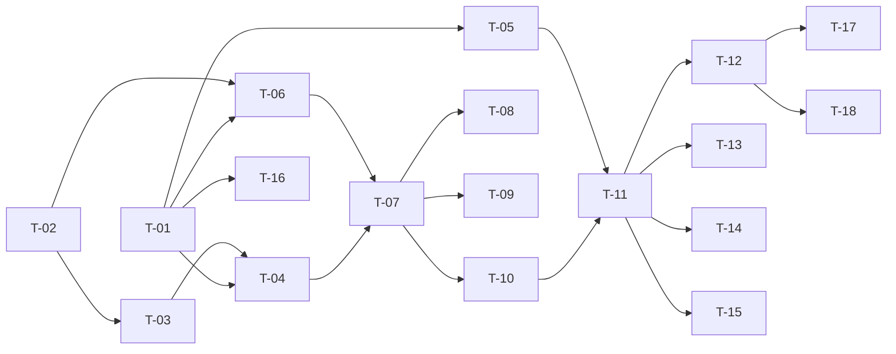

# TASKS — `RF-SP-016` Registrar membresía

| Campo | Valor |
|---|---|
| Requerimiento | `RF-SP-016` |
| Especificación | [`spec.md`](spec.md) |
| Plan | [`plan.md`](plan.md) |
| `plan.md` aprobado el | 21-08-2026 |
| Estado | **Aprobadas** |
| Issue | Pendiente de crear |
| Rama | `feature/registrar-membresia` |
| Aprobadas por | Responsable técnico el 24-08-2026 |

!!! info "Qué va en este documento"

    **En qué pasos, en qué orden y cómo se verifica cada uno.**

    **Prueba de pertenencia:** si no puede marcarse como hecho, no es una tarea.

    **Es la fuente de verdad de las tareas.** El Issue de GitHub coordina y enlaza aquí; no la sustituye ni la duplica. Si las dos listas discrepan, manda este archivo.

    No se escribe hasta que `plan.md` esté aprobado, y ninguna tarea se ejecuta hasta que este documento lo esté (Art. I.6).

---

## 1. Tareas

Es la primera escritura del módulo que **modifica filas que el actor no mencionó**: insertar en medio reencadena a la hija y desplaza los niveles de todo lo que queda por debajo. Tres tareas concentran la dificultad y ninguna es el `INSERT`: `T-01` declara las restricciones diferidas que permiten reordenar sin dejar de garantizar la cadena, `T-05` traduce una violación que salta **en el `COMMIT`** y que el `try/catch` del adaptador no ve, y `T-02` es el único sitio donde vive el invariante lineal.

| # | Tarea | Depende de | Verificación | Estado |
|---|---|---|---|---|
| `T-01` | Migración `V13__create_memberships.sql`: tabla, `uq_memberships_code`, el índice único funcional `uq_memberships_name` sobre `f_unaccent(lower(name))`, `ck_memberships_code_format`, `fk_memberships_parent` con `ON DELETE RESTRICT`, y las dos restricciones **`DEFERRABLE INITIALLY DEFERRED`**: `uq_memberships_parent` con `NULLS NOT DISTINCT` y `uq_memberships_level` | — | `mvn flyway:info` la lista aplicada; pruebas de integración: un segundo `INSERT` con `parent_membership_id` nulo es rechazado —es lo que `NULLS NOT DISTINCT` añade—, y un `UPDATE` masivo de niveles que colisiona consigo mismo **confirma** porque la comprobación está diferida | Hecha |
| `T-02` | `domain`: agregado `Membership` y `MembershipChain`, que recibe la cadena vigente y la hija indicada y devuelve la posición de la nueva y los niveles recalculados. Aquí viven `RN-SP-006` y `RN-SP-007` | — | Pruebas unitarias **con listas en memoria, sin Spring ni base de datos**: los cinco casos de inserción, incluido por encima de la superior y sobre una cadena de una sola membresía | Hecha |
| `T-03` | `domain/MembershipRepository`: `save`, `findById`, `existsCode`, `existsName` y `loadChainForUpdate` | `T-02` | Compila; `loadChainForUpdate` declara en su contrato que devuelve la cadena **bloqueada y ordenada por nivel** | Hecha |
| `T-04` | `infrastructure/JpaMembershipRepository`: `SELECT … ORDER BY level FOR UPDATE` para la cadena, un **único** `UPDATE` masivo de niveles y el reencadenado de la hija | `T-01`, `T-03` | Prueba de integración: el número de sentencias no crece con el tamaño de la cadena, y el listado de `RF-SP-017` **no** se bloquea mientras un alta está en curso | Hecha |
| `T-05` | `shared/error/GlobalExceptionHandler`: traducción de la violación de restricción **diferida**, que salta al confirmar y fuera del caso de uso, distinguida por **nombre de restricción** y devuelta como `409` con `EX-003` | `T-01` | Prueba de integración: la violación de `uq_memberships_parent` produce `409` con `EX-003`, **nunca `500`**; capturarla en el adaptador no funciona y la prueba lo demuestra | Hecha |
| `T-06` | `infrastructure/MembershipEntity` y `MembershipJpaMapper`, con la relación al padre `LAZY` y el agregado sin anotaciones de JPA | `T-01`, `T-02` | Prueba de integración: el mapeo va y vuelve sin pérdida | Hecha |
| `T-07` | `application`: `RegisterMembershipCommand`, `RegisterMembershipService` con `@Transactional` y el orden de verificación de `plan.md` §4 —el **bloqueo antes** de las verificaciones—, y el puerto `MembershipChangeAuditor` | `T-04`, `T-06` | Pruebas con dobles: ninguna verificación se evalúa sobre una cadena sin bloquear; la unicidad se comprueba para redactar el mensaje, no para garantizarla | Hecha |
| `T-08` | Auditoría: un evento `CREATE` por la membresía nueva y un `UPDATE` **por cada membresía que el reordenamiento tocó**, todos en la misma transacción y bajo el mismo `correlation_id` | `T-07` | Prueba de integración: sobre una cadena de cuatro, una inserción intermedia deja un `CREATE` y tantos `UPDATE` como desplazadas, y la operación entera se recupera filtrando por `correlationId` en `RF-SP-011` | Hecha |
| `T-09` | Auditoría de los rechazos: `audit_error_log` con `error_type = 'BUSINESS_RULE'` y `severity = 'MEDIA'`; los `400` de formato no se auditan | `T-07` | Prueba de integración: `EX-001` y `EX-002` dejan su fila; un `400` no deja ninguna, y `ck_audit_error_log_status` lo impediría igualmente | Hecha |
| `T-10` | `api/RegisterMembershipRequest` con Bean Validation (`VAL-001`, `VAL-002`, `VAL-006`), recorte de nombre y descripción, `code` sin tocar, y rechazo de propiedades desconocidas | `T-07` | Prueba de API: un cuerpo con `level` o `parentMembershipId` devuelve `400`; `"Plata "` y `"Plata"` son el mismo nombre para la unicidad | Hecha |
| `T-11` | `api/MembershipController` y `MembershipResponse`: `POST /api/v1/memberships` con el permiso `memberships:create`, `201` con `Location`, y los vecinos como identificadores —nulos, no omitidos, cuando no los hay— | `T-05`, `T-10` | Prueba de API: la respuesta trae `level`, `parentMembershipId` y `childMembershipId`, que es lo que el actor no podía saber antes de la operación | Hecha |
| `T-12` | Pruebas de los criterios de aceptación de `spec.md` §12 | `T-11` | La suite cubre `CA-SP-111` a `CA-SP-119` y `CA-SP-347` a `CA-SP-349` | Hecha |
| `T-13` | Pruebas de concurrencia: dos altas simultáneas sobre la misma hija, y dos con el mismo código | `T-11` | Una devuelve `201` y la otra `409` —con `EX-003` y `EX-001` respectivamente—, **nunca `500`**, y la cadena resultante no queda bifurcada ni con niveles repetidos | Hecha |
| `T-14` | Prueba de coherencia entre `level` y la cadena: tras veinte inserciones en orden aleatorio, recorrer desde la superior por `parent_membership_id` da el mismo orden que ordenar por `level`, y los niveles son `1..n` sin huecos | `T-11` | Es la única prueba que detecta una divergencia que **ninguna restricción declarativa puede impedir** | Hecha |
| `T-15` | Pruebas del resto de casos límite de `spec.md` §13 y de `plan.md` §11: atomicidad del reordenamiento, descripción en el límite, y `405` en `PUT`, `PATCH` y `DELETE` sobre `/api/v1/memberships/{id}` | `T-11` | Forzando un fallo entre el `UPDATE` de niveles y el reencadenado no queda **ninguna** fila escrita; el `405` es la única forma de verificar `RN-SP-008` | En curso |
| `T-16` | Enmendar `requirements/sp.md`: §10.7 gana `uq_memberships_name` sobre la forma normalizada y `ck_memberships_code_format`; §10.4 recoge que `uq_memberships_parent` es `NULLS NOT DISTINCT` y que `level` cuenta desde la cima, con `1` como la superior | `T-01` | Sin la última frase, «membresía de mayor nivel» de `RN-SP-006` se lee al revés | Hecha |
| `T-17` | Documentación OpenAPI del endpoint: cuerpo, respuesta `201` con `Location` y los estados `400`, `401`, `403`, `409` —con `EX-001` y `EX-003` distinguibles— `422` y `500` | `T-12` | El contrato publicado coincide con el comportamiento real (Art. VIII.6) | Hecha |
| `T-18` | Actualizar la matriz de trazabilidad de `docs/requirements.md` | `T-12` | La fila de `RF-SP-016` refleja el estado y enlaza esta tripleta | Hecha |

**Estados:** `Pendiente` · `En curso` · `Hecha` · `Bloqueada`.

!!! important "`T-13` cerrada, y con un hallazgo — 24-08-2026"

    **`EX-003` es inalcanzable desde la API mientras el bloqueo funcione**, y eso no es un defecto: es exactamente lo que el diseño pretende. Quien lee la cadena la mantiene bloqueada hasta escribir, de modo que ninguna otra transacción puede confirmar un cambio en medio y dejar la posición calculada obsoleta. Se comprobó lanzando **seis** altas simultáneas sobre la misma hija: ninguna produjo el empate.

    La restricción diferida es, por tanto, literalmente lo que `plan.md` §4 dice que es —el respaldo para «un camino nuevo que no tome el bloqueo, una réplica, un defecto»—, y su valor está en cubrir el día en que alguien añada ese camino.

    La consecuencia para la verificación es que **la garantía y su traducción se prueban por separado**, porque no hay forma de ejercitarlas juntas:

    | Qué | Dónde | Cómo |
    |---|---|---|
    | El invariante bajo carga real | `MembershipConcurrencyIT` | Altas simultáneas: nunca un `500`, y la cadena queda con una sola cima, sin bifurcaciones y con niveles contiguos |
    | Que la restricción diferida **rechaza** al confirmar | `MembershipConcurrencyIT` | Atacando la tabla directamente dentro de una transacción, que es la única vía determinista |
    | Que esa violación se traduce a `409` con `EX-003` | `GlobalExceptionHandlerTest` | Prueba unitaria del manejador, con la excepción que Spring lanzaría |

    **Un defecto encontrado al escribir esa prueba unitaria:** el manejador consultaba la lista de restricciones diferidas con `Set.of(...).contains(restriccion)` sin comprobar el nulo, y `Set.of` **lanza `NullPointerException`** en lugar de devolver `false`. Un fallo al confirmar que no viniera de una restricción —el caso más común— reventaba **dentro del manejador de excepciones**. Corregido.

    El arnés que hace posibles estas pruebas es `ConcurrencyHarness`, y **se prueba a sí mismo**: sin comprobar que las tareas se solapan de verdad, una prueba de concurrencia que serializa pasa siempre y no hay forma de notarlo.

!!! warning "Enmiendas y hueco al ejecutar estas tareas — 24-08-2026"

    **`T-06` no produjo código.** Pedía `MembershipEntity` y `MembershipJpaMapper`; `architecture.md` §5.1 —reescrita el 22-08-2026— sitúa el modelo persistente en `domain/models`, de modo que `Membership` es a la vez agregado y entidad y **no hay dos representaciones que unir**. Es la misma resolución que se aplicó en `RF-SP-001` · `T-12`, por la vía que ese documento admite de forma expresa. Las capas `application` / `infrastructure` / `api` que este plan nombra se leen como `application` / `domain.repository` / `interfaces`.

    **`T-02` del listado usa SQL nativo y no `cb.construct`.** La auto-unión que resuelve la hija —«quién apunta a mí»— no tiene equivalente limpio en la API de criterios sin una asociación mapeada, y mapear esa asociación era justo lo que se descartó para no producir una consulta por eslabón al recorrer la cadena.

    **`T-13` queda `Pendiente`: no hay prueba de concurrencia real.** El bloqueo explícito y la restricción diferida están implementados, y `EX-003` tiene su manejador en `GlobalExceptionHandler`, pero **ningún caso lo ejercita todavía**: hacerlo exige dos transacciones simultáneas contra la misma hija, que no se monta con `MockMvc`. Mientras tanto, la ruta que devuelve `409` con `EX-003` está escrita y **sin verificar**.

    **Dos defectos ajenos a este requerimiento, encontrados al ejecutarlo:**

    | Defecto | Alcance | Estado |
    |---|---|---|
    | Un identificador que no es un UUID en una variable de ruta devolvía **`500`**. Spring lanza la excepción al convertir el argumento, antes de entrar al controlador, y sin manejador caía en el `catch` genérico: el cliente recibía un fallo del sistema por un dedazo, y `audit_error_log` acumulaba `UNHANDLED` de severidad `ALTA` que no eran fallos de nada | **Todo endpoint con variable de ruta tipada**, presentes y futuros | **Corregido** en `GlobalExceptionHandler`, con prueba |
    | `PermissionsSeedIT.laSiembraNoSeAudita` contaba `audit_security_log` **entera** y solo pasaba por el orden en que Failsafe ejecutaba las clases; cualquier prueba que ejercite un `403` la rompía | La suite | **Corregido**: ahora lee las migraciones y comprueba que ninguna escribe en ese registro |

## 2. Orden de ejecución

`T-02` es dominio puro y puede completarse y probarse el primer día, antes de que exista la tabla: los cinco casos de inserción se verifican con listas en memoria.

## 3. Cobertura de los criterios de aceptación

| Criterio | Tarea que lo cubre |
|---|---|
| `CA-SP-111` | `T-02`, `T-11`, `T-12` |
| `CA-SP-112` | `T-02`, `T-04`, `T-12` |
| `CA-SP-113` | `T-02`, `T-10`, `T-12` |
| `CA-SP-114` | `T-01`, `T-12` |
| `CA-SP-115` | `T-02`, `T-04`, `T-12` |
| `CA-SP-116` | `T-01`, `T-07`, `T-12` |
| `CA-SP-117` | `T-07`, `T-11`, `T-12` |
| `CA-SP-118` | `T-08`, `T-12` |
| `CA-SP-119` | `T-11`, `T-12` |
| `CA-SP-347` | `T-01`, `T-10`, `T-12` |
| `CA-SP-348` | `T-01`, `T-12` |
| `CA-SP-349` | `T-05`, `T-12`, `T-13` |

`RN-SP-008` no tiene tarea que la implemente: se cumple porque no existe endpoint de edición ni de borrado, y lo que la hace verificable es el `405` de `T-15`. Los casos límite de `spec.md` §13 los cubren `T-13`, `T-14` y `T-15`.

## 4. Bloqueos

| # | Bloqueo | Desde | Responsable | Estado |
|---|---|---|---|---|
| 1 | `T-01` exige PostgreSQL 15 o superior por `NULLS NOT DISTINCT`. La línea vigente es la 17 (`architecture.md` §3), pero debe comprobarse por entorno antes de aplicar la migración | 21-08-2026 | Responsable técnico | Abierto |
| 2 | `T-01` depende de `f_unaccent`, creada en `V1` por `RF-SP-010`, para el índice único funcional del nombre | 21-08-2026 | Responsable técnico | Abierto |
| 3 | `T-13` necesita infraestructura de prueba concurrente con dos transacciones reales sobre Testcontainers, la misma que piden `RF-SP-008` y `RF-SP-009` | 21-08-2026 | Responsable técnico | Abierto |
| 4 | Obligación sobre academia y productos (`plan.md` §8): un contenido que exija un nivel mínimo referencia la membresía por su `id`, **nunca por el número de `level`**, que cambia de significado cada vez que se intercala una membresía. No bloquea estas tareas; se dispara cuando exista el primer módulo de contenidos | 21-08-2026 | Responsable técnico | Abierto |

## 5. Definición de terminado

El requerimiento no está terminado hasta cumplir **todas** las condiciones de la constitución §16:

- [ ] Todas las tareas en estado `Hecha`.
- [ ] Todos los criterios de aceptación con prueba automatizada en verde.
- [ ] `mvn verify` en verde en local.
- [ ] Toda escritura emite su evento de auditoría, en la transacción que corresponde.
- [ ] Los endpoints nuevos declaran su permiso.
- [ ] El contrato OpenAPI coincide con el comportamiento real.
- [ ] Documentación afectada actualizada en el mismo Pull Request.
- [ ] Matriz de trazabilidad actualizada.
- [ ] Pull Request aprobado por alguien distinto del autor e integrado.
