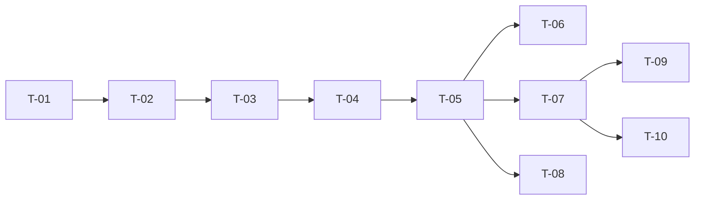

# TASKS — `RF-SP-017` Consultar membresías

| Campo | Valor |
|---|---|
| Requerimiento | `RF-SP-017` |
| Especificación | [`spec.md`](spec.md) |
| Plan | [`plan.md`](plan.md) |
| `plan.md` aprobado el | 21-08-2026 |
| Estado | **Aprobadas** |
| Issue | Pendiente de crear |
| Rama | `feature/consultar-membresias` |
| Aprobadas por | Responsable técnico el 24-08-2026 |

!!! info "Qué va en este documento"

    **En qué pasos, en qué orden y cómo se verifica cada uno.**

    **Prueba de pertenencia:** si no puede marcarse como hecho, no es una tarea.

    **Es la fuente de verdad de las tareas.** El Issue de GitHub coordina y enlaza aquí; no la sustituye ni la duplica. Si las dos listas discrepan, manda este archivo.

    No se escribe hasta que `plan.md` esté aprobado, y ninguna tarea se ejecuta hasta que este documento lo esté (Art. I.6).

---

## 1. Tareas

Sin migración y sin `domain`: una sentencia sobre una proyección. La decisión que sostiene el requerimiento —ordenar por `level` en lugar de recorrer `parent_membership_id`— no se implementa, se **verifica**, y por eso `T-06` no es una prueba más: es la que comprueba que un eslabón roto no desaparece del listado.

| # | Tarea | Depende de | Verificación | Estado |
|---|---|---|---|---|
| `T-01` | `application`: `ListMembershipsQuery` con el término recortado, el modelo de lectura `MembershipItem` y el puerto `MembershipQueryRepository` | — | Prueba unitaria: un término vacío o solo con espacios equivale a ausente | Hecha |
| `T-02` | `infrastructure/JpaMembershipQueryRepository`: proyección con `cb.construct`, la hija por **subconsulta correlacionada**, `ORDER BY level` y el predicado de búsqueda **añadido solo si hay término**, nunca neutralizado con una guarda | `T-01` | Prueba de integración: **una** sentencia con y sin búsqueda, ninguna sobre `user_memberships`, y ninguna asociación perezosa que recorrer | Hecha |
| `T-03` | Búsqueda: escape de `\`, `%` y `_`, parámetro enlazado y normalización con `f_unaccent` sobre `code` y `name`, **sin `coalesce`** porque ambas columnas son `NOT NULL` | `T-02` | Pruebas de integración: `platino`, `PLATINO` y `Platíno` encuentran la misma membresía; un término con `%` no devuelve la cadena entera | Hecha |
| `T-04` | `application/ListMembershipsService` con `@Transactional(readOnly = true)` | `T-03` | Prueba de integración: una sola instantánea, de modo que un alta concurrente nunca produce una cadena a medias | Hecha |
| `T-05` | `api`: `ListMembershipsRequest` con **un solo campo**, y `MembershipController` gana `GET /api/v1/memberships` con el permiso `memberships:read`, envolviendo la colección en `content` y **sin** usar `PageResponse` | `T-04` | Prueba de API: `?page=2&size=1` devuelve la cadena completa, no un elemento ni un error; el cuerpo no contiene ningún campo de paginación | Hecha |
| `T-06` | Prueba de la cadena rota: con una membresía cuyo `parent_membership_id` apunta a otra que no la reconoce —forzado por `UPDATE` directo—, el listado **sigue devolviendo todas las filas** en orden de `level` | `T-05` | Es la prueba que verifica la decisión de `plan.md` §1. Con un recorrido recursivo, el listado se detendría en el eslabón roto | Pendiente |
| `T-07` | Pruebas de los criterios de aceptación de `spec.md` §12 | `T-05` | La suite cubre `CA-SP-120` a `CA-SP-124`; `CA-SP-123` lista, inserta una membresía intermedia con `RF-SP-016` y vuelve a listar | Hecha |
| `T-08` | Pruebas del resto de casos límite de `spec.md` §13 y de `plan.md` §11: una sola membresía, búsqueda no contigua, búsqueda vacía, orden estable y coherencia con el detalle de `RF-SP-018` | `T-05` | Una sola membresía devuelve ambos vecinos **nulos y presentes**; una búsqueda que casa con la primera y la tercera devuelve `level` `1` y `3`, sin rellenar el hueco | En curso |
| `T-09` | Documentación OpenAPI del endpoint: el parámetro de búsqueda, la respuesta `200` con `content` y los estados `401`, `403` y `500` | `T-07` | El contrato publicado coincide con el comportamiento real (Art. VIII.6), y documenta que la colección **no** se pagina | Hecha |
| `T-10` | Actualizar la matriz de trazabilidad de `docs/requirements.md` | `T-07` | La fila de `RF-SP-017` refleja el estado y enlaza esta tripleta | Hecha |
| `T-11` | `MembershipItem` y la consulta del listado incorporan `color` | `RF-SP-016 · T-21` | Prueba de integración: el listado trae el color de cada membresía, en mayúsculas (`CA-SP-490`) | Hecha |

**Estados:** `Pendiente` · `En curso` · `Hecha` · `Bloqueada`.

!!! note "Al ejecutar estas tareas — 24-08-2026"

    **`T-02` usa SQL nativo y no `cb.construct`.** La auto-unión que resuelve la hija no tiene equivalente limpio en la API de criterios sin una asociación mapeada, y mapearla era lo que se descartó para no producir una consulta por eslabón. Lo que la tarea garantiza —una sola sentencia y sin cruce con `user_memberships`— se cumple igual, y se verifica leyendo el SQL.

    **`T-06` queda `Pendiente`:** no hay prueba de la cadena rota. `fk_memberships_parent` impide un puntero colgante, de modo que reproducir el caso exige violar el esquema a propósito.

## 2. Orden de ejecución

## 3. Cobertura de los criterios de aceptación

| Criterio | Tarea que lo cubre |
|---|---|
| `CA-SP-120` | `T-02`, `T-05`, `T-07` |
| `CA-SP-121` | `T-02`, `T-07` |
| `CA-SP-122` | `T-05`, `T-07` |
| `CA-SP-123` | `T-02`, `T-07` |
| `CA-SP-124` | `T-05`, `T-07` |

`RN-SP-006` no tiene tarea que la implemente: este requerimiento la **lee** y no la verifica. Que `level` sea fiable lo garantizan `uq_memberships_level` y `uq_memberships_parent` de `RF-SP-016`, y la detección de una divergencia vive en la prueba de coherencia de ese requerimiento, no aquí. Los casos límite de `spec.md` §13 los cubren `T-06` y `T-08`.

## 4. Bloqueos

| # | Bloqueo | Desde | Responsable | Estado |
|---|---|---|---|---|
| 1 | Todo depende de `V13__create_memberships.sql` (`RF-SP-016`), y en particular la subconsulta de la hija **solo es legal mientras exista `uq_memberships_parent`**: sin esa restricción devolvería varias filas y la sentencia fallaría en ejecución | 21-08-2026 | Responsable técnico | Abierto |
| 2 | `T-03` depende de `f_unaccent`, creada en `V1` por `RF-SP-010` | 21-08-2026 | Responsable técnico | Abierto |
| 3 | La detección en producción de una cadena incoherente queda cubierta solo por las restricciones y por la prueba de `RF-SP-016`. Si el negocio quisiera detección en caliente, sería un requerimiento de diagnóstico propio | 21-08-2026 | Responsable técnico | Abierto |

## 5. Definición de terminado

El requerimiento no está terminado hasta cumplir **todas** las condiciones de la constitución §16:

- [ ] Todas las tareas en estado `Hecha`.
- [ ] Todos los criterios de aceptación con prueba automatizada en verde.
- [ ] `mvn verify` en verde en local.
- [ ] Toda escritura emite su evento de auditoría, en la transacción que corresponde.
- [ ] Los endpoints nuevos declaran su permiso.
- [ ] El contrato OpenAPI coincide con el comportamiento real.
- [ ] Documentación afectada actualizada en el mismo Pull Request.
- [ ] Matriz de trazabilidad actualizada.
- [ ] Pull Request aprobado por alguien distinto del autor e integrado.
