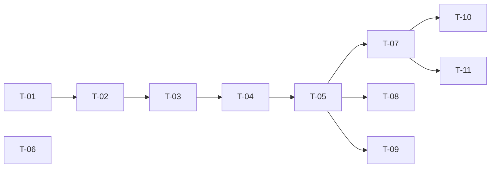

# TASKS — `RF-SP-018` Consultar detalle de una membresía

| Campo | Valor |
|---|---|
| Requerimiento | `RF-SP-018` |
| Especificación | [`spec.md`](spec.md) |
| Plan | [`plan.md`](plan.md) |
| `plan.md` aprobado el | 21-08-2026 |
| Estado | **Aprobadas** |
| Issue | Pendiente de crear |
| Rama | `feature/consultar-detalle-membresia` |
| Aprobadas por | Responsable técnico el 24-08-2026 |

!!! info "Qué va en este documento"

    **En qué pasos, en qué orden y cómo se verifica cada uno.**

    **Prueba de pertenencia:** si no puede marcarse como hecho, no es una tarea.

    **Es la fuente de verdad de las tareas.** El Issue de GitHub coordina y enlaza aquí; no la sustituye ni la duplica. Si las dos listas discrepan, manda este archivo.

    No se escribe hasta que `plan.md` esté aprobado, y ninguna tarea se ejecuta hasta que este documento lo esté (Art. I.6).

---

## 1. Tareas

Sin migración, sin `domain` y sin excepciones nuevas: una sentencia por clave primaria con dos vecinos resueltos en el mismo `SELECT`. Lo único que no es rutina es que el segundo `LEFT JOIN` **solo es legal porque `uq_memberships_parent` existe**; sin esa restricción devolvería tantas filas como hijas hubiera. Por eso `T-06` no es una prueba del endpoint sino una guarda sobre el esquema.

| # | Tarea | Depende de | Verificación | Estado |
|---|---|---|---|---|
| `T-01` | `application`: modelo de lectura `MembershipDetail` —la membresía más sus dos vecinos ya resueltos— y `MembershipQueryRepository` gana `findDetailById(UUID): Optional<MembershipDetail>` | — | Compila; devuelve `Optional`, nunca `null`, y no ejecuta ninguna consulta previa de existencia | Hecha |
| `T-02` | `infrastructure/JpaMembershipQueryRepository`: la sentencia de `plan.md` §4 con los dos `LEFT JOIN` —al padre por clave foránea y a la hija por `parent_membership_id`— y proyección con `cb.construct`, **sin** filtrar por `deleted_at`, que esta tabla no tiene | `T-01` | Prueba de integración: **una** sentencia por petición, ninguna sobre `user_memberships`, y el mapeo no multiplica filas | Hecha |
| `T-03` | `application/GetMembershipService` con `@Transactional(readOnly = true)`, que lanza `ResourceNotFoundException` cuando la sentencia no devuelve filas | `T-02` | Prueba de integración: la membresía y sus dos vecinos se leen de **la misma instantánea**, de modo que un alta concurrente no produce una mezcla de dos estados | Hecha |
| `T-04` | `api`: `MembershipSummaryResponse` con `id`, `code`, `name` y `level`, y `MembershipDetailResponse` que lo usa para cada vecino. **No** se reutiliza `MembershipResponse` de `RF-SP-016` | `T-03` | Prueba de API: el objeto de `parentMembership` **no** contiene a su vez `parentMembership` ni `childMembership`, ni `description`, ni marcas temporales | Hecha |
| `T-05` | `api/MembershipController`: añade `GET /api/v1/memberships/{id}` con el permiso `memberships:read`, **sin** declarar restricción de patrón sobre el identificador | `T-04` | Prueba de API: `200` con el detalle; `404` con `EX-001` para un UUID canónico inexistente; `403` sin el permiso | Hecha |
| `T-06` | Aserción de esquema: una consulta sobre `pg_constraint` que falla si `uq_memberships_parent` desaparece o pierde `NULLS NOT DISTINCT` | — | La prueba falla al relajar la restricción a propósito. Es lo que sostiene que el contrato prometa un objeto y no una lista | Hecha |
| `T-07` | Pruebas de los criterios de aceptación de `spec.md` §12 | `T-05` | La suite cubre `CA-SP-125` a `CA-SP-129`; los vecinos nulos se verifican **presentes**, no omitidos | Hecha |
| `T-08` | Prueba de las tres formas de identificador inválido: `abc`, `1-1-1-1-1` y un UUID de 35 caracteres | `T-05` | Las tres devuelven `400` con `VAL-001` y campo `id`, **nunca `404`**. La segunda es la que el JDK convertiría sin error | **Hecha** — cerrada el 24-08-2026 con `CanonicalUuidConverter`: un editor personalizado, tras fallar dos veces con un `Converter` |
| `T-09` | Pruebas del resto de casos límite de `spec.md` §13 y de `plan.md` §11: única membresía del sistema, membresía recién insertada, coherencia con el listado de `RF-SP-017`, ausencia de marcas temporales y de conteos, y `405` en `PUT`, `PATCH` y `DELETE` | `T-05` | Tras insertar una intermedia con `RF-SP-016`, los detalles de las tres membresías implicadas son coherentes entre sí y con el listado | En curso |
| `T-10` | Documentación OpenAPI del endpoint: respuesta `200` con los dos vecinos y los estados `400`, `401`, `403`, `404` y `500` | `T-07` | El contrato publicado coincide con el comportamiento real (Art. VIII.6), y documenta que la expansión llega a **un solo grado** | Hecha |
| `T-11` | Actualizar la matriz de trazabilidad de `docs/requirements.md` | `T-07` | La fila de `RF-SP-018` refleja el estado y enlaza esta tripleta | Hecha |
| `T-12` | `MembershipDetailItem` y `MembershipNeighborItem` incorporan `color`, de modo que la consultada, su superior y su hija lo traigan | `RF-SP-016 · T-21` | Prueba de integración: las tres membresías de la respuesta traen su color (`CA-SP-491`) | Hecha |

**Estados:** `Pendiente` · `En curso` · `Hecha` · `Bloqueada`.

!!! warning "Hueco declarado al ejecutar estas tareas — 24-08-2026"

    **`T-08` queda `En curso`: un UUID no canónico no se rechaza.** `plan.md` §4 exige `400` con `VAL-001` cuando el identificador «no es un UUID en forma canónica». `UUID.fromString` del JDK es **laxo** y acepta `1-1-1-1-1` como `00000001-0001-0001-0001-000000000001`, de modo que la conversión no falla y la respuesta acaba siendo `404`.

    Las otras dos formas —`abc` y un UUID sin guiones— **sí** devuelven `400`, y ese arreglo es nuevo: antes devolvían `500`.

    Se intentó desplazar el convertidor por omisión de dos maneras —un bean `Converter<String, UUID>` y un `WebMvcConfigurer` que lo registra en el `FormatterRegistry`— y **ninguna surtió efecto**. El código no demostrado se retiró en lugar de dejarlo inerte. `MembershipsIT` fija el comportamiento real de hoy con una prueba marcada como hueco: cuando alguien lo corrija, esa prueba fallará, que es exactamente lo que debe hacer.

## 2. Orden de ejecución

`T-06` no depende de nada de este requerimiento y puede escribirse el primer día: es una prueba sobre el esquema, no sobre el endpoint.

## 3. Cobertura de los criterios de aceptación

| Criterio | Tarea que lo cubre |
|---|---|
| `CA-SP-125` | `T-02`, `T-04`, `T-07` |
| `CA-SP-126` | `T-04`, `T-07` |
| `CA-SP-127` | `T-02`, `T-04`, `T-07` |
| `CA-SP-128` | `T-03`, `T-05`, `T-07` |
| `CA-SP-129` | `T-05`, `T-07` |

`RN-SP-006` no tiene tarea que la implemente: este requerimiento la **lee** y no la verifica. `RN-SP-008` tampoco: se cumple porque no existe endpoint de edición ni de borrado, y lo que la hace verificable es el `405` de `T-09`. Los casos límite de `spec.md` §13 los cubren `T-08` y `T-09`.

## 4. Bloqueos

| # | Bloqueo | Desde | Responsable | Estado |
|---|---|---|---|---|
| 1 | `T-01` amplía el puerto de `RF-SP-017` y `T-05` añade un método a `MembershipController`, que crea `RF-SP-016`: ambos requerimientos deben integrarse antes | 21-08-2026 | Responsable técnico | Abierto |
| 2 | El `LEFT JOIN` a la hija **solo es legal mientras exista `uq_memberships_parent`** con `NULLS NOT DISTINCT` (`RF-SP-016`). `T-06` es la guarda de esa dependencia | 21-08-2026 | Responsable técnico | Abierto |
| 3 | `T-05` y `T-08` dependen de `CanonicalUuidConverter`, que estrena `RF-SP-003`. Sin él, un identificador no canónico devuelve `404` en lugar del `400` que `spec.md` §13 exige | 21-08-2026 | Responsable técnico | **Cerrado** — 24-08-2026. Los dos intentos con un `Converter` fallaban porque `TypeConverterDelegate` captura la excepción del convertidor y reintenta con el editor permisivo por omisión; un editor PERSONALIZADO se localiza antes y cortocircuita ese reintento |

## 5. Definición de terminado

El requerimiento no está terminado hasta cumplir **todas** las condiciones de la constitución §16:

- [ ] Todas las tareas en estado `Hecha`.
- [ ] Todos los criterios de aceptación con prueba automatizada en verde.
- [ ] `mvn verify` en verde en local.
- [ ] Toda escritura emite su evento de auditoría, en la transacción que corresponde.
- [ ] Los endpoints nuevos declaran su permiso.
- [ ] El contrato OpenAPI coincide con el comportamiento real.
- [ ] Documentación afectada actualizada en el mismo Pull Request.
- [ ] Matriz de trazabilidad actualizada.
- [ ] Pull Request aprobado por alguien distinto del autor e integrado.
