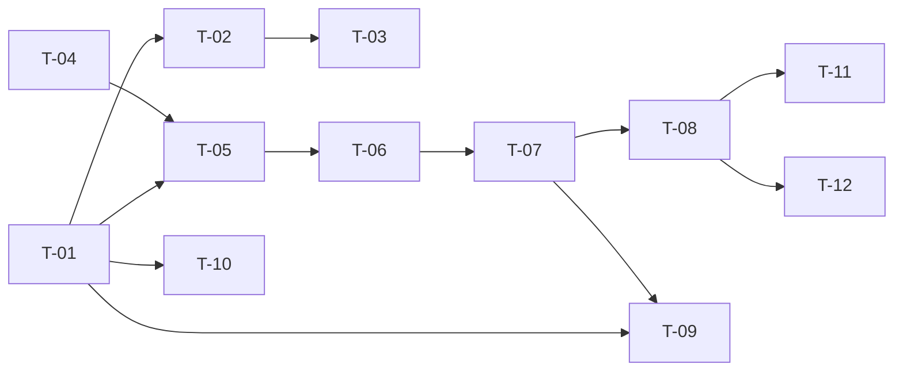

# TASKS — `RF-SP-019` Consultar monedas

| Campo | Valor |
|---|---|
| Requerimiento | `RF-SP-019` |
| Especificación | [`spec.md`](spec.md) |
| Plan | [`plan.md`](plan.md) |
| `plan.md` aprobado el | 21-08-2026 |
| Estado | **Aprobadas** |
| Issue | Pendiente de crear |
| Rama | `feature/consultar-monedas` |
| Aprobadas por | Responsable técnico el 24-08-2026 |

!!! info "Qué va en este documento"

    **En qué pasos, en qué orden y cómo se verifica cada uno.**

    **Prueba de pertenencia:** si no puede marcarse como hecho, no es una tarea.

    **Es la fuente de verdad de las tareas.** El Issue de GitHub coordina y enlaza aquí; no la sustituye ni la duplica. Si las dos listas discrepan, manda este archivo.

    No se escribe hasta que `plan.md` esté aprobado, y ninguna tarea se ejecuta hasta que este documento lo esté (Art. I.6).

---

## 1. Tareas

La consulta es trivial: una sentencia sobre una tabla de una fila. **El peso está en el esquema y en el arranque.** `T-01` declara dos invariantes que `RF-SP-023` heredará ya garantizadas, `T-02` siembra la moneda con la que opera el sistema y audita esa siembra, y `T-03` es la primera comprobación del proyecto que puede impedir que el servicio levante.

| # | Tarea | Depende de | Verificación | Estado |
|---|---|---|---|---|
| `T-01` | Migración `V14__create_currencies.sql`: tabla `currencies` con `uq_currencies_code`, `uq_currencies_name`, `ck_currencies_code_format`, `ck_currencies_decimal_places`, el índice único parcial `uq_currencies_single_default` y `ck_currencies_default_active` | — | `mvn flyway:info` la lista aplicada; pruebas de integración por restricción: `usd`, `US` y `USD1` se rechazan; `decimal_places` de `-1` y `5` también; un `UPDATE` que desactive la moneda por defecto falla | Hecha |
| `T-02` | Migración `V15__seed_currencies.sql`: **`USD`**, «Dólar estadounidense», símbolo `$`, dos decimales, por defecto y activa, con identificador UUID v7 literal, **y su fila de `audit_change_log`** con actor, correlación e IP en nulo | `T-01` | Prueba de integración: la tabla tiene una fila con `code = 'USD'` y `decimal_places = 2`, el identificador es estable entre ejecuciones, y existe la fila de auditoría con `action = 'CREATE'` | Hecha |
| `T-03` | `shared/config/CurrencyCatalogHealthCheck`: al arrancar comprueba que existe **exactamente una** moneda con `is_default` e `is_active` en `true`, y **falla el arranque** si no la hay | `T-02` | Prueba de integración: con la tabla vacía el contexto de Spring **no levanta**, y el mensaje de fallo nombra la migración de siembra que falta | Hecha |
| `T-04` | `application`: modelo de lectura `CurrencyItem` y el puerto `CurrencyQueryRepository` | — | Compila; el puerto no declara ningún método de escritura | Hecha |
| `T-05` | `infrastructure`: `CurrencyEntity` como metamodelo y `JpaCurrencyQueryRepository` con proyección `cb.construct`, el filtro de `includeInactive` **añadido solo cuando vale `false`** y `ORDER BY code` | `T-01`, `T-04` | Prueba de integración: **una** sentencia con y sin el parámetro; dos llamadas consecutivas devuelven el mismo orden | Hecha |
| `T-06` | `application/ListCurrenciesService` con `@Transactional(readOnly = true)` | `T-05` | Prueba de integración: la transacción de solo lectura impide escribir en `currencies` desde este camino, que es la garantía de `RN-SP-010` | Hecha |
| `T-07` | `api`: `ListCurrenciesRequest` con **un solo campo** booleano, `CurrencyResponse` con los seis campos, y `CurrencyController` con `GET /api/v1/currencies` y el permiso `currencies:read`, envolviendo la colección en `content` y **sin** usar `PageResponse` | `T-06` | Prueba de API: `?page=2&size=5` devuelve el catálogo completo; `includeInactive=quizas` devuelve `400`; el cuerpo no contiene campos de paginación | Hecha |
| `T-08` | Pruebas de los criterios de aceptación de `spec.md` §12 | `T-07` | La suite cubre `CA-SP-130` a `CA-SP-133` y `CA-SP-168` a `CA-SP-170`. `CA-SP-131` se verifica con **`405` sobre la colección**, que está mapeada, y **`404` sobre `/{id}` y `/{id}/status`**, que no lo están | Hecha |
| `T-09` | Pruebas de los casos límite de `spec.md` §13: moneda sin símbolo, moneda sin decimales, catálogo de una sola moneda y moneda por defecto inactiva | `T-01`, `T-07` | `symbol: null` se devuelve presente; `decimal_places = 0` se acepta y se devuelve como `0`, distinguible de un nulo; la colección de un elemento sigue siendo colección | Hecha |
| `T-10` | Enmendar `requirements/sp.md`: §10.5 gana `updated_at`, que no declaraba pese al Art. V.7 y pese a que `is_active` cambia por API; §10.7 gana `uq_currencies_name`, `uq_currencies_single_default` y `ck_currencies_default_active` | `T-01` | El documento y el esquema declaran las mismas restricciones (Art. XII.3) | Hecha |
| `T-11` | Documentación OpenAPI del endpoint: el parámetro `includeInactive`, la respuesta `200` con `content` y los estados `400`, `401`, `403` y `500` | `T-08` | El contrato publicado coincide con el comportamiento real (Art. VIII.6), y documenta que `includeInactive` **añade** en lugar de sustituir | Hecha |
| `T-12` | Actualizar la matriz de trazabilidad de `docs/requirements.md` | `T-08` | La fila de `RF-SP-019` refleja el estado y enlaza esta tripleta | Hecha |

**Estados:** `Pendiente` · `En curso` · `Hecha` · `Bloqueada`.

!!! note "Enmiendas al ejecutar estas tareas — 24-08-2026"

    **`T-03` vive en el módulo y no en `shared/config`.** El plan la situaba allí, pero `architecture.md` §5.3 —y la prueba de ArchUnit que la verifica desde `RF-SP-001`— prohíbe que la infraestructura transversal dependa de un módulo de negocio, y esta comprobación consulta el catálogo de `SP`. Se ejecuta igual al arrancar: lo que la dispara es implementar `ApplicationRunner`, no el paquete donde viva.

    **El código se mapea con el tipo JDBC `CHAR` de forma explícita.** PostgreSQL llama `bpchar` a `char(3)`, y sin declararlo Hibernate espera `varchar(3)` y **`ddl-auto: validate` impide arrancar**. El fallo aparece al levantar el contexto, no al consultar.

    **`ListCurrenciesRequest` declara `Boolean` y no `boolean`.** Spring construye el registro por su constructor canónico, y con un primitivo la **ausencia** del parámetro no tiene valor que pasar: la consulta sin filtros fallaba con `400`.

    **Desviación menor del contrato, declarada:** `plan.md` §4 asigna `VAL-003` al `400` por un valor no booleano, y el manejador global emite `VAL-001` para toda conversión fallida de parámetro. El manejador es transversal y no conoce el requerimiento que atiende; unificar el código por naturaleza del fallo se consideró preferible a un catálogo por endpoint.

## 2. Orden de ejecución

`T-04` y `T-10` no dependen del endpoint y pueden ir en paralelo.

## 3. Cobertura de los criterios de aceptación

| Criterio | Tarea que lo cubre |
|---|---|
| `CA-SP-130` | `T-05`, `T-07`, `T-08` |
| `CA-SP-131` | `T-07`, `T-08` |
| `CA-SP-132` | `T-02`, `T-08` |
| `CA-SP-133` | `T-07`, `T-08` |
| `CA-SP-168` | `T-01`, `T-07`, `T-08` |
| `CA-SP-169` | `T-01`, `T-02`, `T-08` |
| `CA-SP-170` | `T-05`, `T-08` |

`RN-SP-010` no tiene tarea que la implemente: se cumple porque no existe endpoint de escritura, y lo que la hace verificable es el `405` de `T-08` más el `readOnly = true` de `T-06`. El último caso límite de `spec.md` §13 —moneda por defecto inactiva— lo garantiza `ck_currencies_default_active` de `T-01`, **sin esperar a `RF-SP-023`**.

## 4. Bloqueos

| # | Bloqueo | Desde | Responsable | Estado |
|---|---|---|---|---|
| 1 | `T-03` es la primera comprobación del proyecto que puede impedir el arranque. Si más adelante hubiera otras, conviene agruparlas para que el mensaje diga **todas** las que fallan y no solo la primera (`plan.md` §8) | 21-08-2026 | Responsable técnico | Abierto |
| 2 | Obligación sobre todo módulo financiero futuro (`plan.md` §8): un importe se almacena junto con el identificador de su moneda, y el redondeo usa el `decimal_places` de esa moneda, **nunca una constante**. No bloquea estas tareas; se dispara con el primer módulo de cobros | 21-08-2026 | Responsable técnico | Abierto |
| 3 | `RF-SP-023` hereda `ck_currencies_default_active` y `uq_currencies_single_default` ya garantizadas, y deberá decidir qué ocurre al **cambiar** cuál es la moneda por defecto. No puede resolverlo difiriendo el índice: un índice único parcial no es una restricción y no admite `DEFERRABLE` | 21-08-2026 | Responsable técnico | Abierto |

## 5. Definición de terminado

El requerimiento no está terminado hasta cumplir **todas** las condiciones de la constitución §16:

- [ ] Todas las tareas en estado `Hecha`.
- [ ] Todos los criterios de aceptación con prueba automatizada en verde.
- [ ] `mvn verify` en verde en local.
- [ ] Toda escritura emite su evento de auditoría, en la transacción que corresponde.
- [ ] Los endpoints nuevos declaran su permiso.
- [ ] El contrato OpenAPI coincide con el comportamiento real.
- [ ] Documentación afectada actualizada en el mismo Pull Request.
- [ ] Matriz de trazabilidad actualizada.
- [ ] Pull Request aprobado por alguien distinto del autor e integrado.
